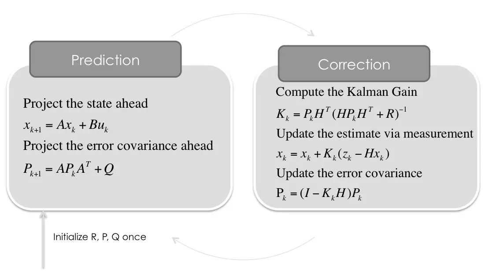
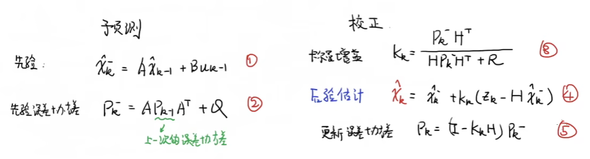
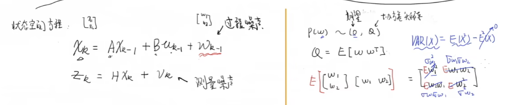
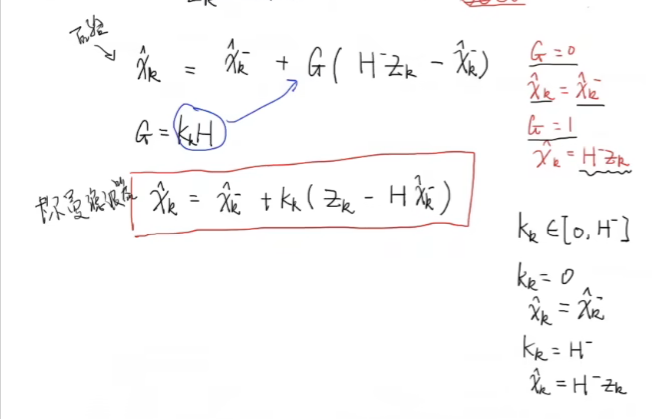
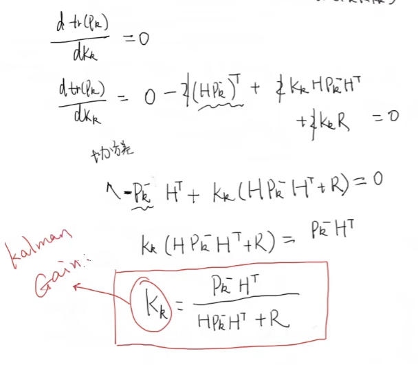
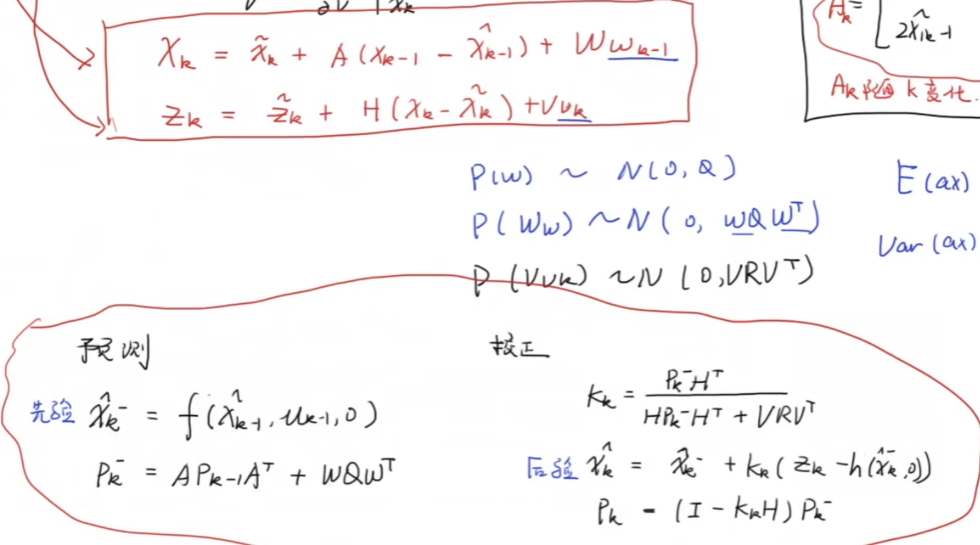
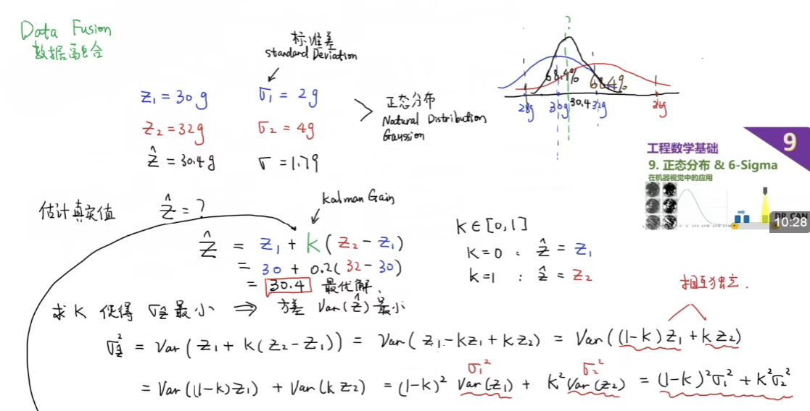
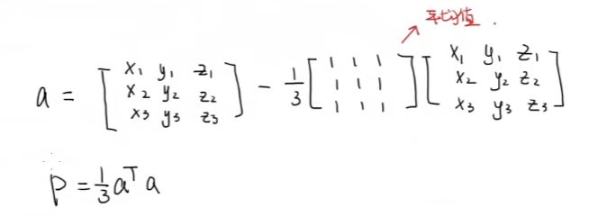
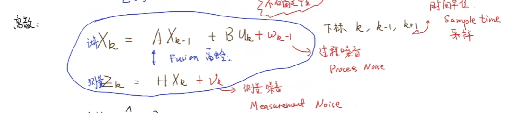

# Main Takeaway

介绍各种滤波算法和他们之间的比较。

# 各种滤波

## 高斯滤波GF

高斯滤波是一种根据***\*高斯函数\****的形状来选择权值的**线性平滑**滤波器，它对抑制服从正态分布的噪声非常有效，从而达到平滑数据的目的。

## 卡尔曼滤波KF

卡尔曼滤波算法是一种抑制高斯噪声有效的最优化自回归数据处理算法，对于系统过程的滤波比较好，能够有效滤除信号发生的突变。并且对于变化快速、实时更新的线性系统有着非常好的寻优及滤波效果。

### 推导

$z_k$是测量结果，对状态进行测量

先验估计值

根据$k_k$来选择更加相信算出来的，还是更加相信测出来的
$$
卡尔曼滤波器：\hat{x}_k=\hat{x}_k^-+k_k(z_k-H\hat{x}_k^-)
$$
于是我们的目标变成了：去寻找$k_k$使得$\hat{x}_k\rightarrow x_k(实际值)$

那么我们定义$e_k=x_k-\hat{x}_k$只需要让其协方差矩阵的迹最小，即方差最小

经过一通变换后可得：

其中$P_k^-$还没被表示，经推导得
$$
P_k^-=AP_{k-1}A^T+Q
$$
其中有$P_{k-1}$，所以我们在最后还要更新一下误差协方差$P_k$

### 使用实例

## 扩展卡尔曼滤波器EKF

对非线性系统的适应——即将非线性系统线性化

> problem：正态分布的随机变量通过非线性系统后就不再满足正态的了

线性化：即前一个估计点处的泰勒级数展开，得到线性化后的方程

# 数学基础

## 数据融合

data fusion

对于两组数据，找到一个增益K使得两个数据融合的估计值$\hat{z}$的方差最小

## 协方差矩阵

协方差矩阵，让方差、协方差在一个矩阵中表现出来，用来表现变量间的联动关系

P为协方差矩阵

## 状态空间方程

观测器问题，要加入两个噪声

# References

- [各种滤波算法的比较（GF、KF、EKF、UKF、PF），内附简单实现代码_kf和ukf](https://blog.csdn.net/qq_53860947/article/details/134858215)

- [CSI数据预处理之卡尔曼滤波、高斯滤波、简单平均](https://blog.csdn.net/qq_53860947/article/details/126175335)