# Main Takeaway

矩阵分析

<!--more-->

# CH1 矩阵基本概念

线性变换

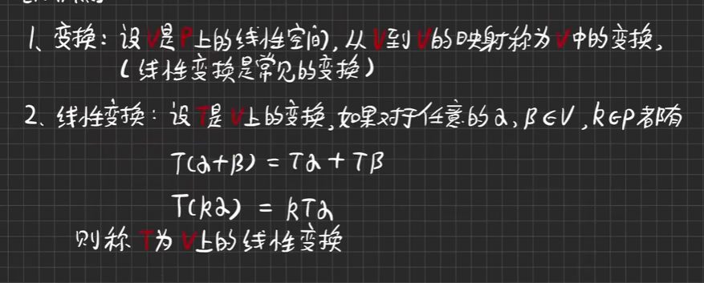

像子空间和核子空间

两个用线性变换定义的子空间

线性变换的矩阵

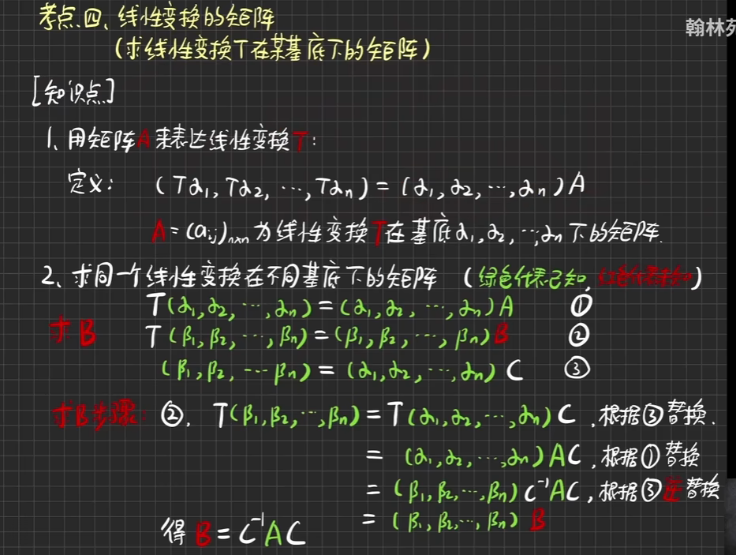

# CH2 矩阵的内积

$A^H$是A的共轭转置

# CH4 向量和矩阵的范数

- 向量范数：

  

- 矩阵范数

  

  相比向量范数多了相容性

  

[矩阵论（六）：矩阵的条件数](https://blog.csdn.net/niu_123ming/article/details/84493102)

# CH3 矩阵的标准型

- 哈密顿-凯莱定理Hamiton-Cayley

  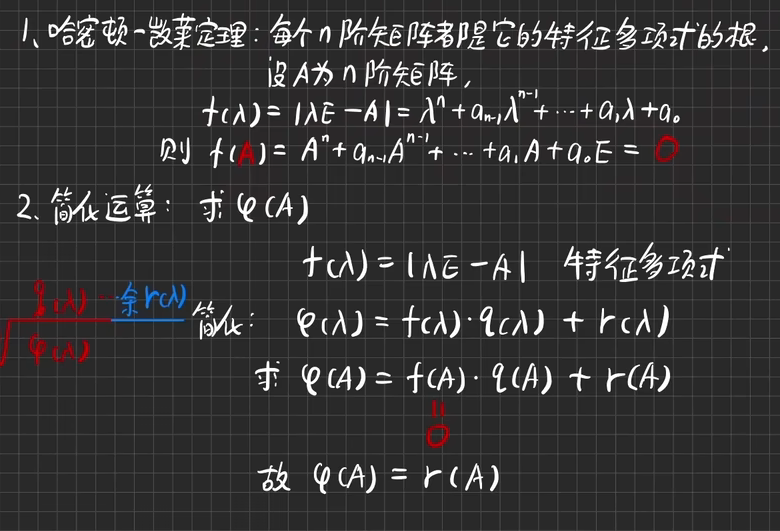

- 最小多项式

  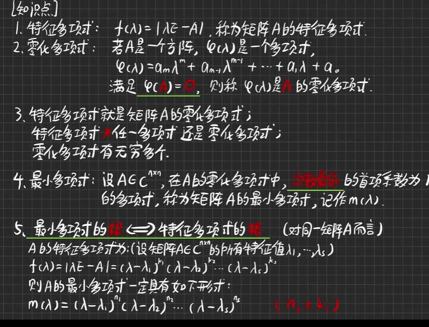

  A的最小多项式的根和其特征多项式的根是完全一样的

  eg：

  

- Jordan标准型

  

  

  求约当标准型的方法

  1. 

     

     

- smith标准型

  

# CH5 矩阵的分解

- 矩阵的三角分解$A=LR$

  

- QR分解$A=QR$

  

- 矩阵的满秩分解

  

  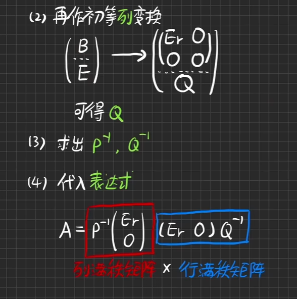

- SVD奇异值分解（singular value decomposition）
  $$
  A=PSQ^T
  $$

  > P,Q为正交矩阵，S为对角矩阵

  以下介绍思想和推导：

  能否将线性变换变为单纯的伸缩（沿坐标轴的方向）和旋转变换？

  

  

  于是$A=QSQ^T$，求S

  

  S主对角线元素叫做奇异值singular value（第二个条件为认为规定）

  

  

  普通的方阵

  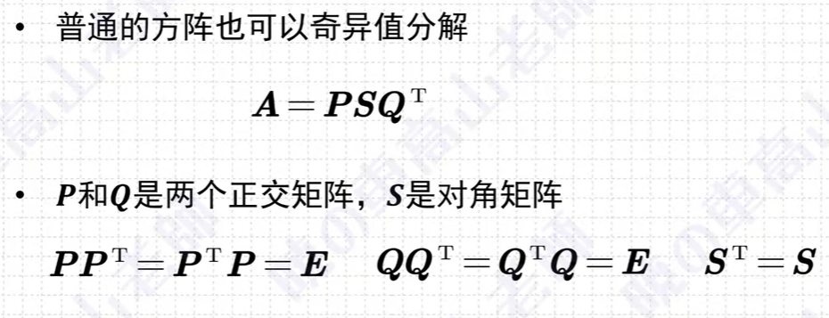

  

  不一定求得的是对的，因为正交矩阵有多个，所以需要校正

  非方阵也可以奇异值分解

  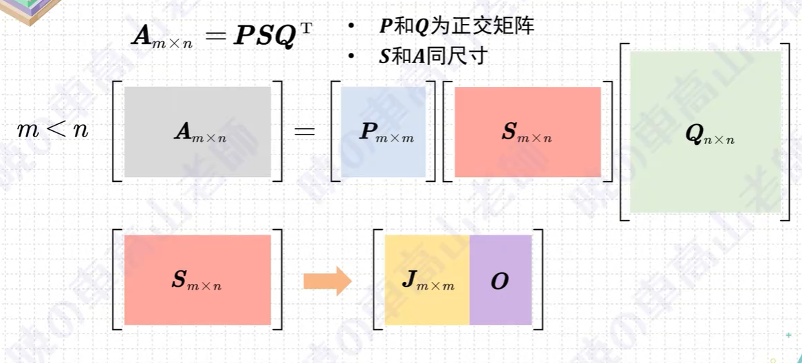

  

  **应用：**

  

  取前若干项即可表示整个图像

  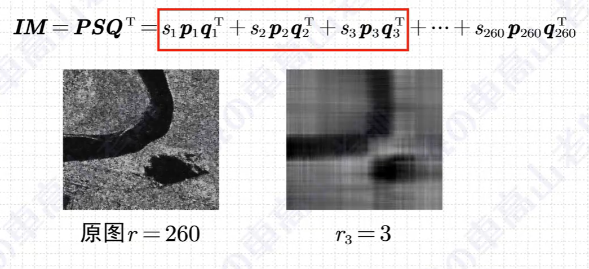

# CH6 矩阵的函数

- 函数矩阵：$A(t)$每个元素都是t的函数

  其导数对每个元素求导

- 矩阵的幂级数

  

  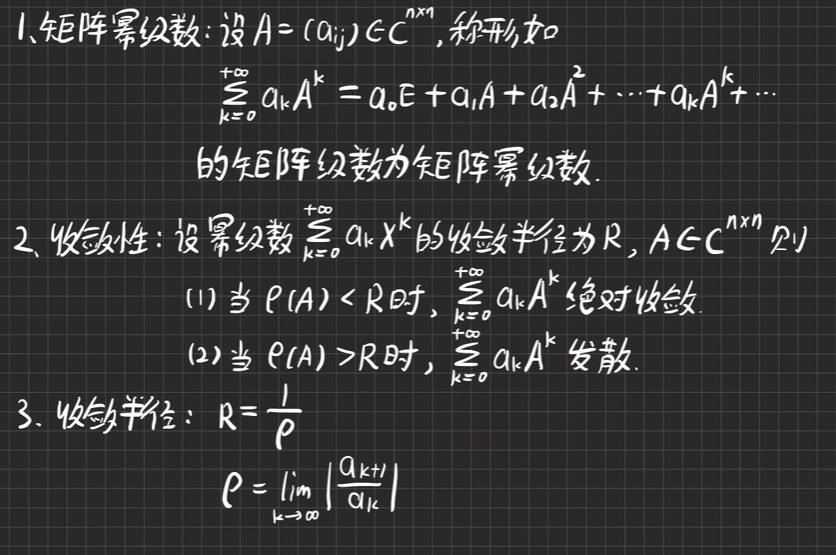

- 矩阵的函数

  

  

  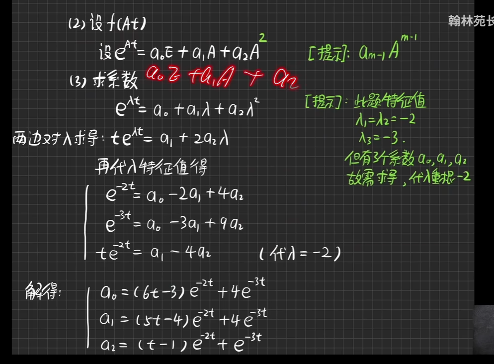

# CH8 矩阵的广义逆

## 概念

 广义逆：

- 定义

  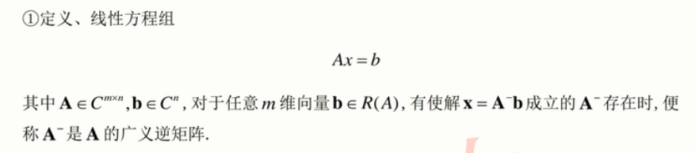

- 求解

  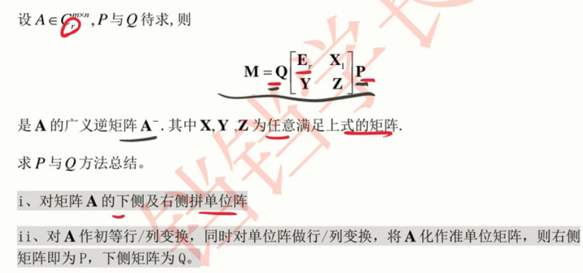

  

- 左右逆

  

  左右逆求解

  

- 伪逆$A^+$，如果A行不满秩，且列不满秩，则需要计算伪逆，它既可以是左逆也可以是右逆

  - 定义

    

  - 求解

    

    法一用来证明

    

    

    法二用来求解

## 解方程问题

过定方程，要得到最小二乘解

**应用**：

# CH9 矩阵的分块

[【2.5】矩阵分块相乘 - 知乎 (zhihu.com)](https://zhuanlan.zhihu.com/p/133330692)

必须要满足一些规则：

- **矩阵分块是否合理只要看第一个矩阵列的划分是否和第二个矩阵行的划分匹配**

# 常见矩阵

- Jacobian雅可比矩阵，函数的一阶偏导数组成的矩阵
  $$
  J_F (x_1,\dots,x_n) = \left[ \begin{matrix} \frac {\partial y_1} {\partial x_1} & \dots & \frac {\partial y_1} {\partial x_n} \\ \vdots & \ddots & \vdots \\ \frac {\partial y_m} {\partial x_1} & \dots & \frac {\partial y_m} {\partial x_n} \end{matrix} \right] \\
  $$
  
- Hessian矩阵

  如果F的所有二阶导数都存在，则F的Hessian矩阵为：
  $$
  H(F)(\boldsymbol{x}) = \left [ \begin{matrix} \frac {\partial^2F} {\partial x_1^2} & \frac {\partial^F} {\partial x_1 \partial x_2} & \cdots & \frac {\partial^F} {\partial x_1 \partial x_n} \\ \frac {\partial^2F} {\partial x_2 \partial x_1} & \frac {\partial^F} {\partial x_2^2} & \cdots & \frac {\partial^F} {\partial x_2 \partial x_n} \\ \vdots & \vdots & \ddots & \vdots \\ \frac {\partial^2F} {\partial x_n \partial x_1} & \frac {\partial^F} {\partial x_n \partial x_2} & \cdots & \frac {\partial^F} {\partial x_n^2} \end{matrix} \right] \\
  $$
  可以用二阶导数的值判断梯度下降的速率。

  [Hessian矩阵](https://zhuanlan.zhihu.com/p/138334587)——包括Hessian矩阵在牛顿法中的应用/判断极值和鞍点

# 求矩阵微分

# References

- [Hessian矩阵](https://zhuanlan.zhihu.com/p/138334587)