# Main Takeaway

离散数学及其应用——速成一下

<!--more-->

[离散数学复习笔记（已完结）_离散数学笔记-CSDN博客](https://blog.csdn.net/qq_51594676/article/details/122138122)

# 命题演算基本规律

永真公式

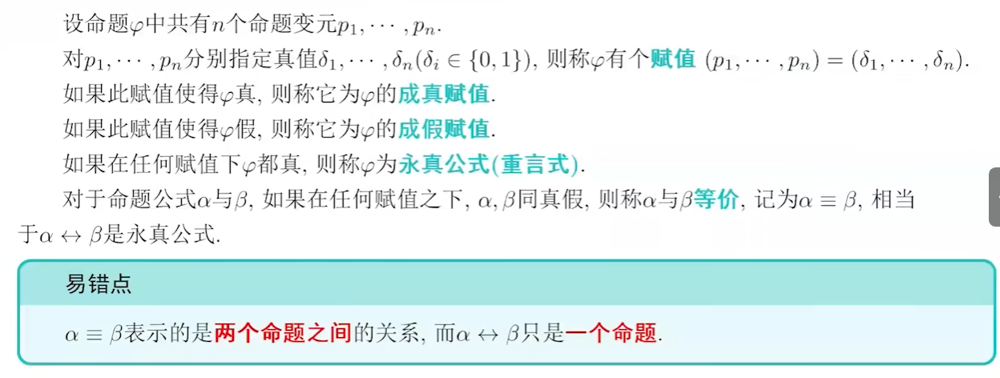

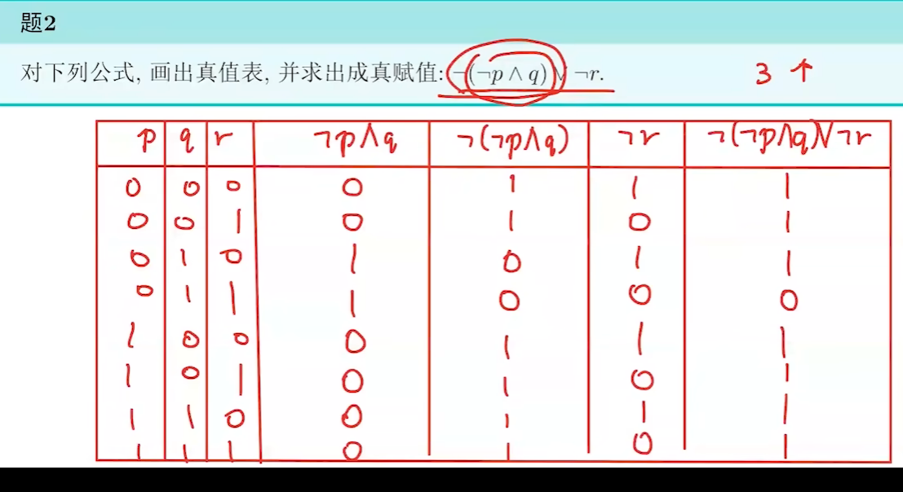

# 析取范式与合取范式

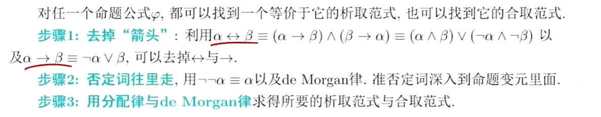

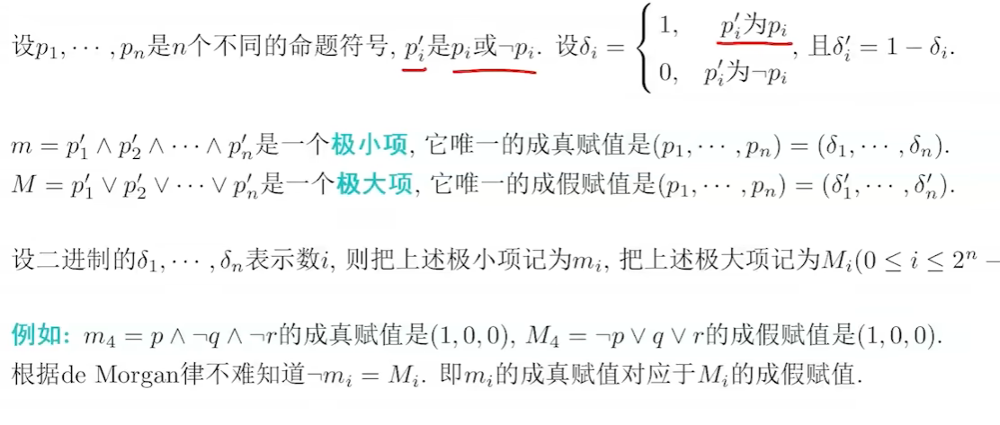

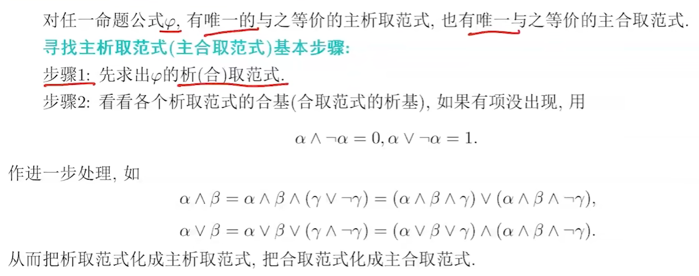

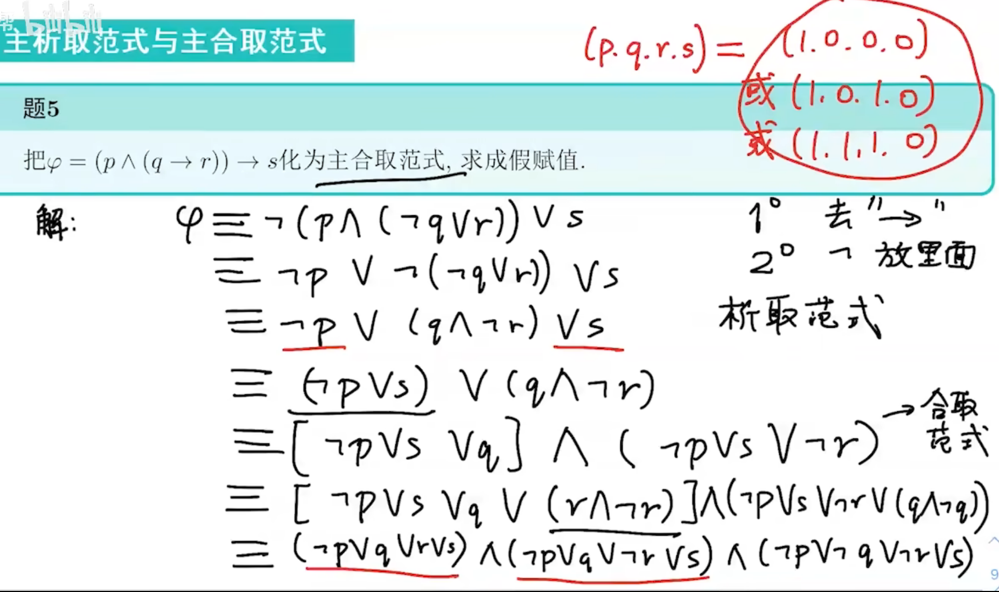

# 全称量词与存在量词

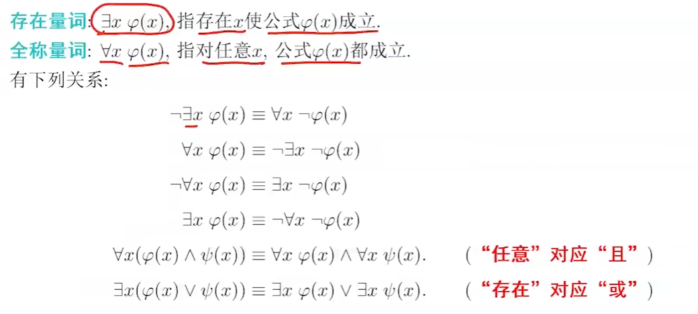

skolem前束范式

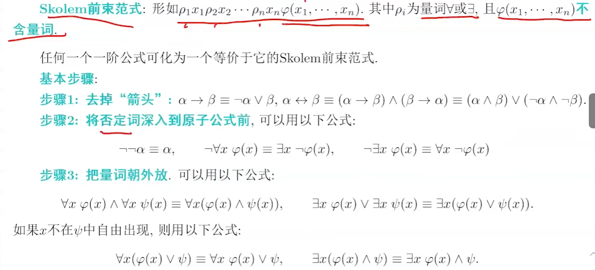

# ZFC公理集合论

ZFC公理体系

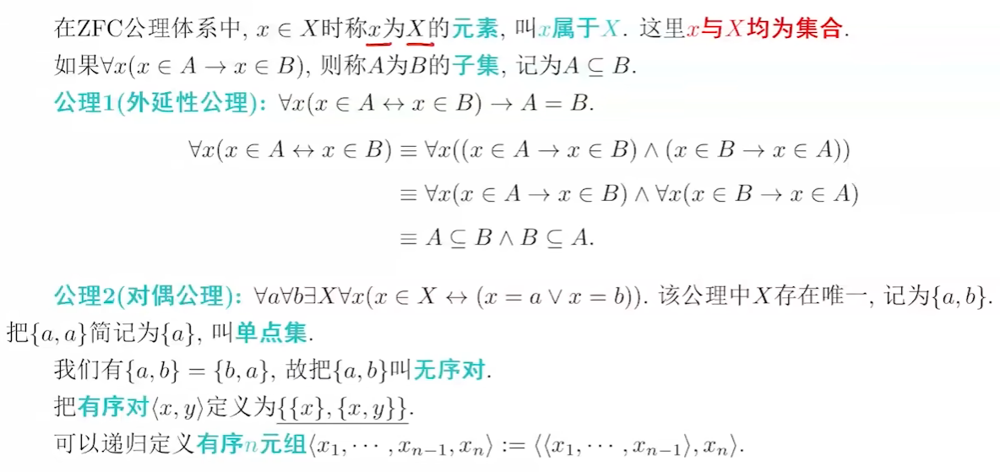

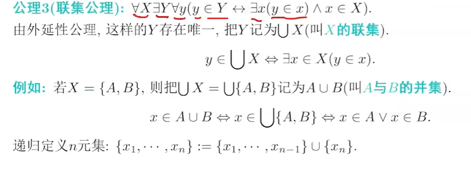

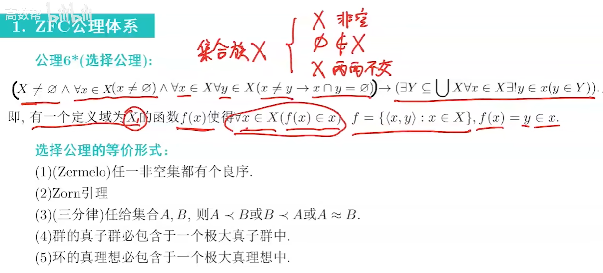

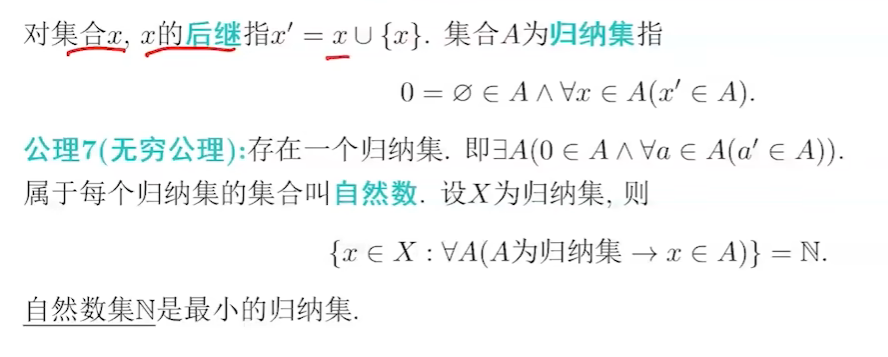

# 关系和映射

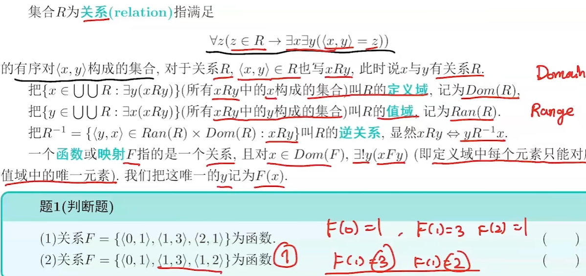

集合的运算

# 等价关系与集合的势

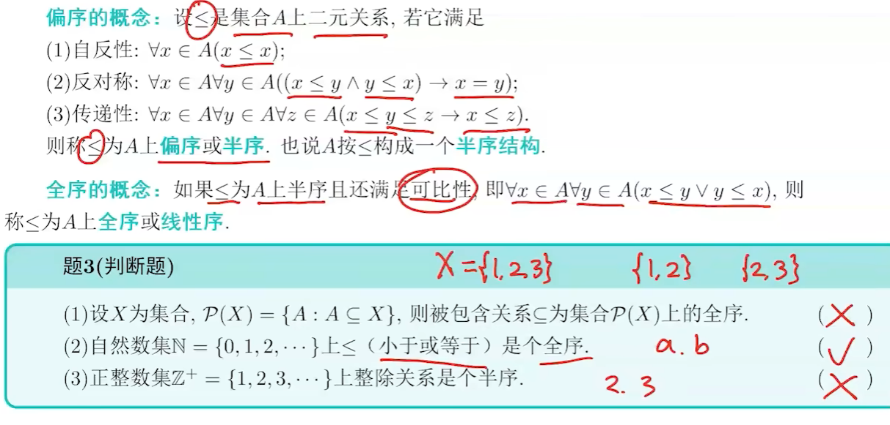

集合的等势

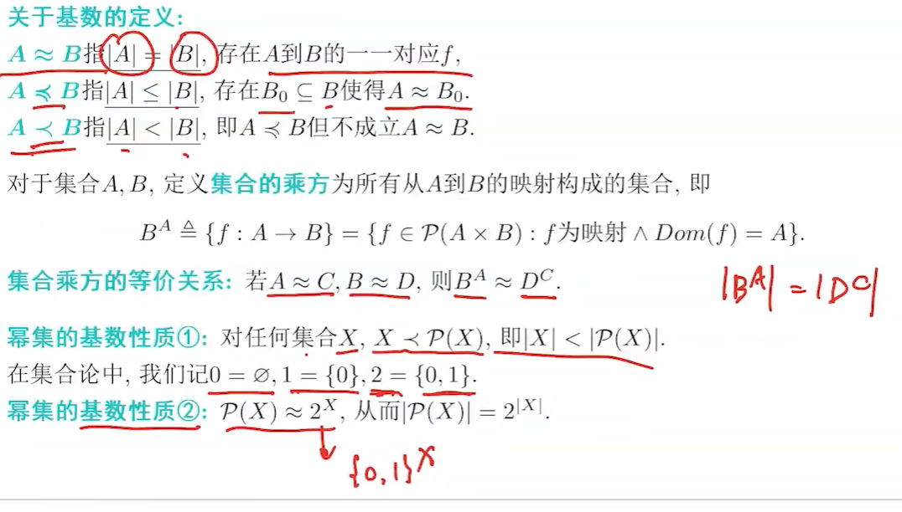

# 图的基本概念

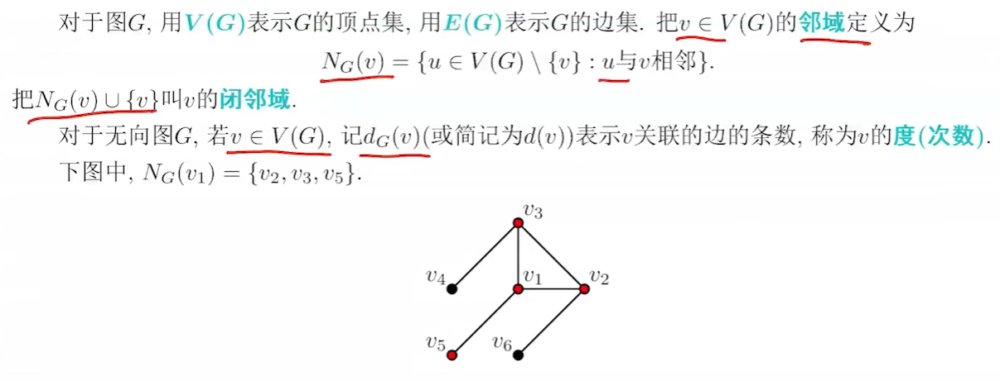

同构：

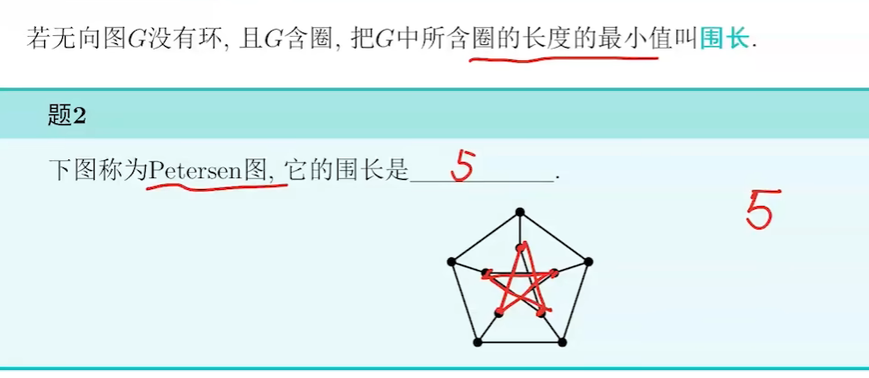

# 连通图和二部图

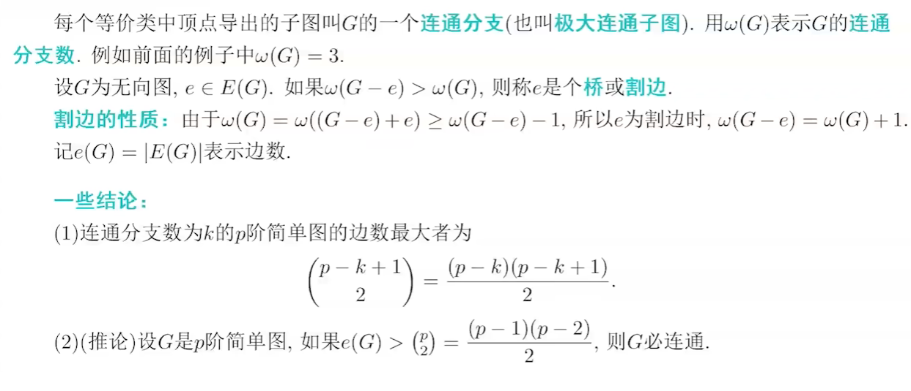

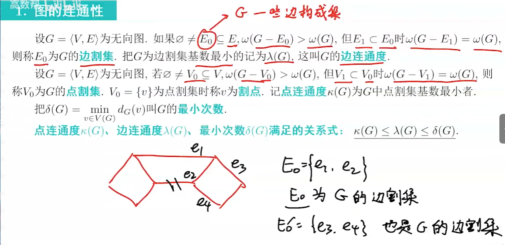

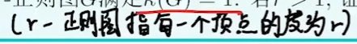

二部图

n是圈的长度

# 握手定理，欧拉图，哈密尔顿图

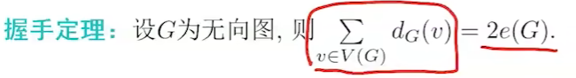

欧拉图：一笔画图

哈密尔顿图

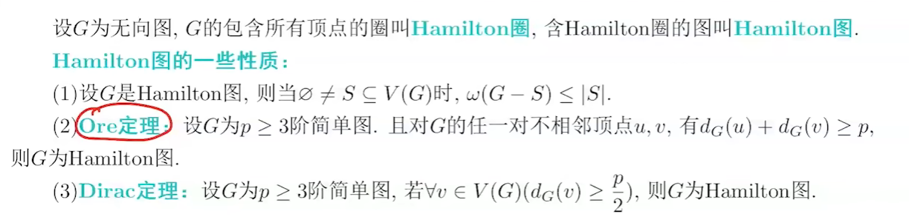

# 树、平面图

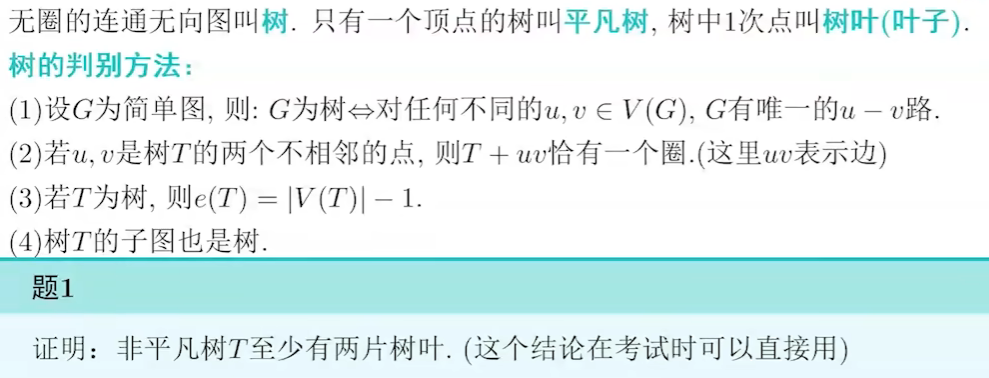

平面图

# 格

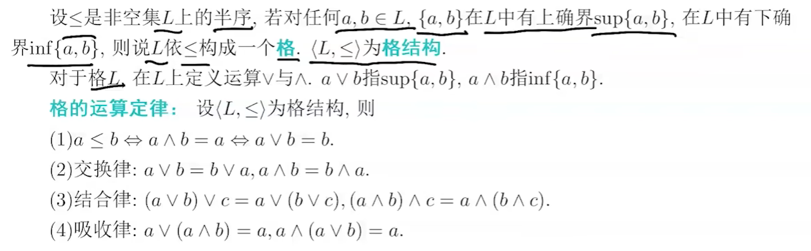

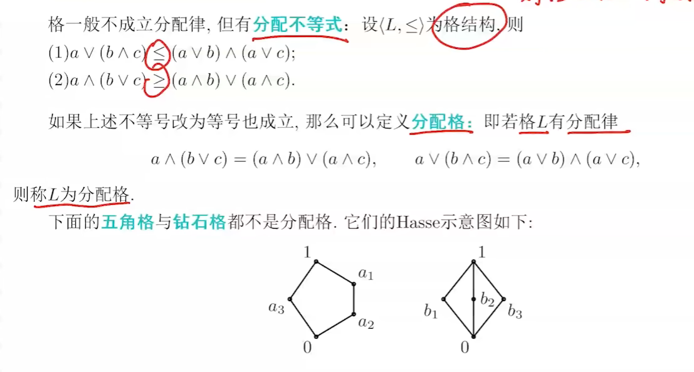

# 布尔代数

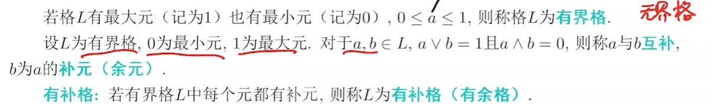

