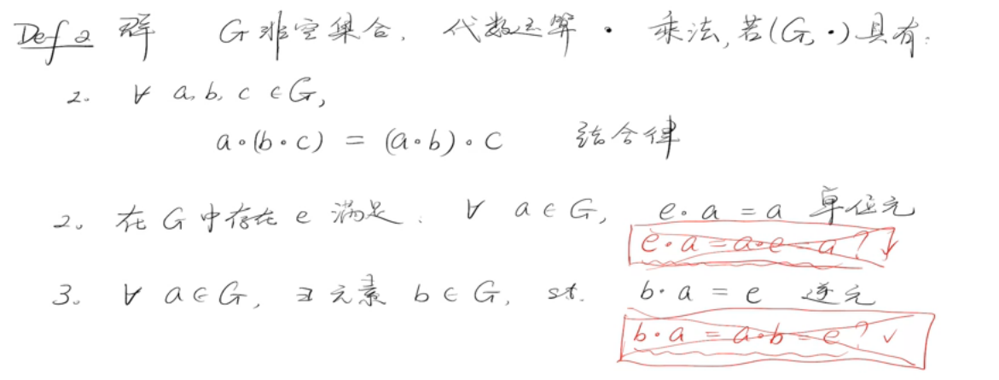
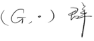

# Main Takeaway

大晚上开始学群论，我大抵是疯了

<!--more-->

# Preview

基本概念

- 代数运算

  

  > 像内积、数乘不是代数运算

- 群

  

  

  集合率+有单位元+存在逆元

  

  若满足四条，则称为交换群。

  > 注意上述只是一个代数运算，可以自己定义，随便用符号来表示
  >
  > 只满足1，称为半群
  >
  > 只满足1，2，称为幺半群

