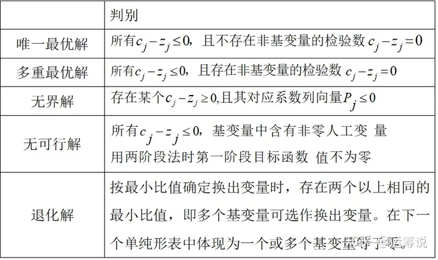
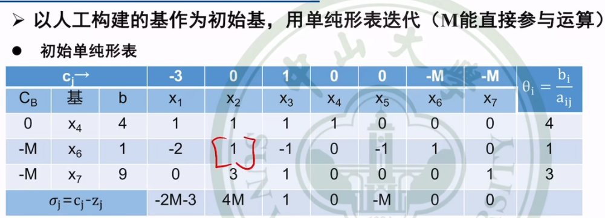
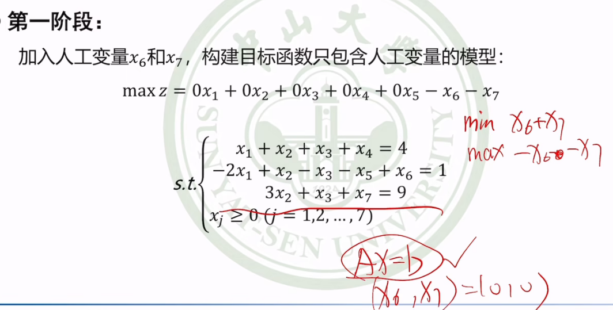

# Main Takeaway

运筹学（operational research,O.R.），运筹就是运算、筹划

**运筹学是一门应用数学和科学技术知识来解决决策问题的学科，涵盖了多个领域的优化方法和模型**

<!--more-->

# 概述

- 运筹学特点：
  - 研究资源调配的决策问题。
    - 目标
    - 约束
    - 实践检验
  - 用数学方法寻找决策策略。
    - 数学模型
    - 优化方法
    - 多学科交叉

  - 需要借助计算机处理。
    - 大型系统
    - 算法求解
    - 人机交互

- 运筹学解题过程：
  1. 提出问题：背景和任务
  2. 建立模型：目标和约束
  3. 求解模型：优化求解
  4. 解的检验：未考虑因素影响下解的质量。
  5. 方案调整：模型修正与解的改进
  6. 方案实施：回到实践中
  7. 后评估：考察问题是否得到完满解决

## 主要内容

- 规划论(programming theory)：用已有资源完成最大目标/用最小资源完成既定目标
  - 各种规划
  - 本质：数学中的最优化技术（optimization technique）

- 图论(graph theory)：以抽象图为工具，进行规划研究

- 决策论(decision theory)：借助一定的理论、方法和工具，科学地选择最优方案的过程

- 对策论(game theory)：指有竞争性的决策称为对策（博弈型决策）

- 排队论(queueing theory)：排队论主要研究各种系统的排队队长，排队的等待时间及所提供的服务等各种参数，以便求得更好的服务。

  它是研究系统随机聚散现象的理论

- 存储论(invertory theory)：研究不同的需求、供货、及到达方式下的订货策略，使订购、存储和缺货的费用最小

- 可靠性理论(reliability theory)：研究系统故障、以提高系统可靠性问题的理论

# 线性规划及单纯形法

## 线性规划问题数学模型

- 一般情况下线性规划问题的数学模型

  $$
  \max(\min) z = c_1x_1 + c_2x_2 + \cdots + c_nx_n \\
  s.t. \\
  \begin{align*}a_{11}x_1 + a_{12}x_2 + \cdots + a_{1n}x_n &\leq (=, \geq) b_1 \\a_{21}x_1 + a_{22}x_2 + \cdots + a_{2n}x_n &\leq (=, \geq) b_2 \\&\vdots \\a_{m1}x_1 + a_{m2}x_2 + \cdots + a_{mn}x_n &\leq (=, \geq) b_m \\x_1, x_2, \cdots, x_n &\geq ( \leq ) 0, \text{free}\end{align*}
  $$

- 简写形式
  $$
  \max(\min) z = \sum_{j=1}^{n} c_j x_j \\
  s.t. \\
  \sum_{j=1}^{n} a_{ij} x_j \leq (=, \geq) b_i \quad (i=1, \cdots, m) \\
  x_j \geq ( \leq ) 0, \text{free} \quad (j=1, \cdots, n)
  $$

- 矩阵形式
  $$
  \max(\min) z = c x \\
  s.t. \\
  A x \leq (=, \geq) b \\
  x \geq ( \leq ) 0, \text{free}
  $$
  其中：

  $$
  x = \begin{bmatrix}x_1 \\x_2 \\\vdots \\x_n\end{bmatrix}
  \quad
  A = \begin{bmatrix}a_{11} & a_{12} & \cdots & a_{1n} \\a_{21} & a_{22} & \cdots & a_{2n} \\\vdots & \vdots & \ddots & \vdots \\a_{m1} & a_{m2} & \cdots & a_{mn}\end{bmatrix}
  \quad
  b = \begin{bmatrix}b_1 \\b_2 \\\vdots \\b_m\end{bmatrix}
  \quad
  c = [c_1, c_2, \cdots, c_n]
  $$

- 向量形式
  $$
  \max(\min) z = c x \\
  s.t. \\
  \sum_{j=1}^{n} p_j x_j \leq (=, \geq) b \\
  x \geq ( \leq ) 0, \text{free}
  $$
  其中：

  $$
  A = [p_1 \quad p_2 \quad \cdots \quad p_n]
  \quad
  p_j = \begin{bmatrix}a_{1j} \\a_{2j} \\\vdots \\a_{mj}\end{bmatrix}
  $$

## 图解法


> 可行域常为凸集。凸集是指在欧几里得空间中，对于集合内的每一对点，连接该对点的直线段上的每个点也在该集合内。
>

- 唯一最优解：常在可行域的顶点上
- 无穷多个最优解：目标函数等值线与可行域的一条边重合

- 无界解：遗漏了约束条件
- 无可行解：约束矛盾

## 单纯形法原理

### Main Takeaway

单纯形法（Simplex Method）是一种用于解决线性规划问题的数值求解方法。该方法的名称来源于其数学基础，即单纯形的概念。

> 单纯形：在数学中，单纯形是指由多个顶点组成的凸包，例如，在一维空间中是一个线段，在二维空间中是一个三角形，在三维空间中是一个四面体等。

单纯形法利用了线性规划问题的可行域是凸集这一特性，通过在可行域的顶点之间进行迭代搜索，以找到最优解。

### 线性规划问题的标准形式

- 线性规划的标准形式

  - 目标函数：max
  - 约束条件：=
  - 变量符号：≥0

  $$
  \begin{align*}\max \quad & z = c x \\\text{s.t.} \quad & A x = b \\& x \geq 0\end{align*}
  $$

  > 两个约束条件

于是我们常常需要将一般数学模型转化为标准形式：

- 变量条件的转化

  $$
  \begin{align*}x_j &\geq 0 & &\text{不变} \\x_j &\leq 0 & &\text{取} \quad x_j' = -x_j \\x_j &\text{无约束} & &\text{取} \quad x_j' \geq 0, \; x_j'' \geq 0, \; x_j = x_j' - x_j''\end{align*}
  $$

  > $x_j=x_j`-x_j``$很重要的思想，最终$x_j$的取值根据优化结果决定

- 约束条件的转化

  $$
  \sum_{j=1}^{n} a_{ij} x_j \leq b_i \quad \quad \quad \sum_{j=1}^{n} a_{ij} x_j + x_{si} = b_i \\
  \sum_{j=1}^{n} a_{ij} x_j \geq b_i \quad \quad \quad \sum_{j=1}^{n} a_{ij} x_j - x_{si} = b_i \\
  x_{sj} \geq 0 \; \text{称为松弛变量}
  $$

- 目标函数的转化

  $$
  \max z = \sum_{j=1}^{n} c_j x_j \quad \quad \text{不变} \\
  \min z = \sum_{j=1}^{n} c_j x_j \quad \quad \text{取} \; z' = -z \\
  加入松弛变量 x_s 时\quad \max z = \sum_{j=1}^{n} c_j x_j + 0 x_{si}
  $$

- 非齐次线性方程组解的情况：

  标准形式：$$\begin{align*}\max \quad & z = c x \\\text{s.t.} \quad & A x = b \\& x \geq 0\end{align*}$$

  令：

  $$
  \bar{A} = [A \,|\, b] \\
  \begin{align*}\text{rank}(A) = \text{rank}(\bar{A}) = n & : \; \text{唯一解} \\\text{rank}(A) = \text{rank}(\bar{A}) < n & : \; \text{无穷多个解} \\\text{rank}(A) < \text{rank}(\bar{A}) & : \; \text{无解}\end{align*}
  $$

### 解的性质

- 可行域——满足两类约束条件的解的集合

  可行域都是凸集：$\Omega=\{x|Ax=b,x\ge0\}$

- 凸集——两点的凸组合仍在集合中

  凸组合：$ax_1+(1-a)x_2\in C,0<a<1$

- 顶点——不能表示为集合内两点的凸组合

  可行域顶点的几何解释：

  

  超平面$\sum {a_jx_j}=b$——线性方程表达一个$n-m$维超平面

  > 例如图中一个资源约束：三个变量一个约束，则在三维空间中可行域是3-1=2维

于是解有如下性质：线性规划如果有最优解，那么这个解肯定能够在可行域的顶点中找到。

下面我们先介绍一下线性规划中一些基本概念：

- 基basis：**基**是约束矩阵 *A* 的一个**线性无关**的列子集，其数量等于约束条件的个数 *m*（假设有 *m* 个约束条件和 *n* 个变量，且 *m*≤*n*）。基的选择决定了当前解的状态
- 基变量basic variables：**基变量**是与基列对应的变量。在标准形式的线性规划问题中，基变量的取值不为零，而非基变量的取值为零。通过选择不同的基，可以得到不同的基变量组合，从而找到不同的可行解
- 非基变量non-basic variables：**非基变量**是那些不在当前基中的变量。在标准形式的线性规划问题中，非基变量的取值为零。通过调整非基变量的取值，可以移动到不同的可行解，从而寻找最优解

- 约束方程中找出线性无关的列向量当作基变量：将非基变量设为0，然后求出基变量——即为基本解（$C_n^m$）

- 基可行解：满足可行域条件的基解——找可行域顶点

  

线性规划最优解性质：

- 定理1 若线性规划问题存在可行解，则问题的可行域是凸集。
- 定理2 线性规划的可行域顶点与**基可行解**一一对应。
- 定理3 若线性规划问题有最优解，一定存在一个最优解是**基可行解**。

### 单纯形法思路

> 建议完整看一遍【基本单纯形法解线性规划问题示例】<https://www.bilibili.com/video/BV11f4y1x7sK?vd_source=93bb338120537438ee9180881deab9c1>

- 求解思路：在顶点中寻找最优解

  ```mermaid
  graph TD
      A[开始] --> B[初始基可行解]
      B --> C{最优解？}
      C -- 是(Y) --> D[结束]
      C -- 否(N) --> E[基可行解迭代]
      E --> B

  ```

- 步骤：

  1. 求初始基可行解，列出初始单纯形表

  1. 将问题化为标准形
  1. 在约束方程的系数矩阵中找到或构造单位矩阵
  1. 以单位矩阵为基，求出初始基可行解；列出单纯形表

  1. 最优性检验

     

     - 检验数的计算：

       $c_j$即目标函数的系数，$z_j=\sum{C_{Bi}a_{ji}}$——对应数相乘再相加
       $$
       检验数:\sigma_j=c_j-z_j,\sigma_j>0,z增大,\sigma_j<0,z减小
       $$

       > Tips：初始单纯形表的检验数行即为目标函数中的系数$c_j$

  1. 转换基可行解

     

     - 入基变量、出基变量
       $$
       入基变量x_k:\sigma_k=max_j\{\sigma_j|\sigma_j>0\}
       $$

       $$
       出基变量x_l:\theta=min_i\{\frac{\bar x_i^{(0)}}{a_{ik}} |a_{ik}>0 \}
       =\frac{b_l}{a_{lk}}
       $$

       > 先根据$\sigma_j$找到入基变量，再根据入基变量选择出基变量

     - 换基+更新单纯形表

       

       > 算$B^{-1}$，其实如果系数为整数，尝试高斯消元即可

  1. 重复 2、3 步直到计算结束。

下面对上述步骤进行说明：

- 单纯形表

  

- $C_B$列：基变量对应的目标函数的系数

- 解的说明：

  

### 退化与循环

- 退化：基变量出现零的现象
  - 如果退化则可能出现循环迭代

### 进阶

- 人工变量法（大M法）

  

  引入人工变量

  人工变量法的目的是为了构造一组基，原模型中只有一个单位列向量，但基的秩为 3，即应找到三个单位列向量，由此我们引入人工变量 $ x_6 $ 和 $ x_7 $。由于这是我们人工引入（实际上并不存在的产品），我们需要控制它最终的值只能为 0，所以在目标函数中，它的价值系数为 $ -M $（其中 $ M $ 是个足够大的数，并假设其能参与运算），代表它每生产一件，都会导致目标函数变得足够小，由此，新的模型标准式为：

  $$
  \max z = -3x_1 + 0x_2 + x_3 + 0x_4 + 0x_5 - Mx_6 - Mx_7
  \\s.t. \quad \begin{cases}x_1 + x_2 + x_3 + x_4 = 4 \\-2x_1 + x_2 - x_3 - x_5 + x_6 = 1 \\3x_2 + x_3 + x_7 = 9 \\x_j \geq 0 \; (j = 1, 2, \ldots, 7)\end{cases}
  $$
  

- 两阶段法

  

  - 第一阶段

    

    > 满足$(x_6,x_7)=(0,0)$，和原问题有相同约束，人工变量不影响

  - 第二阶段

    

# References

- 【【运筹学】应试向基础教程（已完结）{适用范围：本科期末、考研、考博}】<https://www.bilibili.com/video/BV1Uw411f7WM?p=4&vd_source=93bb338120537438ee9180881deab9c1>

- [线性规划的单纯形算法理论——含证明](https://zhuanlan.zhihu.com/p/364011259)

- [(36 封私信 / 80 条消息) 线性规划03-可行域的顶点 - 知乎](https://zhuanlan.zhihu.com/p/718833223)

- 【基本单纯形法解线性规划问题示例】<https://www.bilibili.com/video/BV11f4y1x7sK?vd_source=93bb338120537438ee9180881deab9c1>
