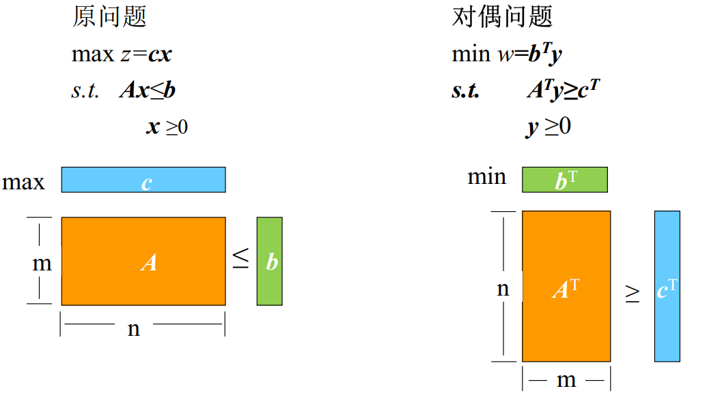
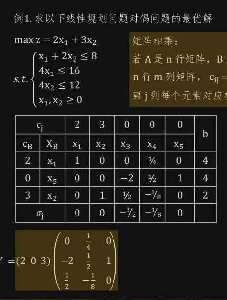
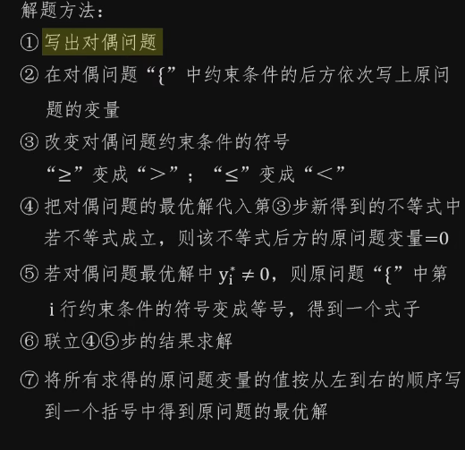

# 线性规划的对偶理论

## 什么是对偶

> 当一个线性规划问题的变量都具有非负约束时，且其约束条件当目标函数求极大值时均取"$\le$"号，目标函数求极小值时均取"$\ge$"号

## 求解思路

- 单纯形法的基本思路

  先寻找到初始基可行解，判断所有检验数是否小于等于 0。若是，查看基变量中是否有人工变量，若无非零人工变量，即找到了最优解；若为否，再找出相邻目标函数值更大的基可行解，并继续判别，直到找出最优解。

- 对偶单纯形法基本思路

  作为原问题的一个解，有两条性质等待满足：**可行性和最优性**。而原问题的解的可行性和最优性，恰好对应对偶问题的最优性和可行性。单纯形法的思路是，先满足可行性，然后逐渐逼近最优性；对偶单纯形法的思路是，先满足最优性，然后逐渐逼近可行性（即先找到对偶问题的可行解，再寻找符合原问题可行性也就是对偶问题最优性的解）。

  - **a)** 最优性看什么？**检验数 $ \sigma_j $**
  - **b)** 可行性看什么？**右端项 $ b_i $**

## 对偶问题的性质

对偶问题的性质：

- 一个问题对偶问题的对偶问题是这个问题本身

- 若原问题是 $ A $，$ A $ 的对偶问题是 $ B $，若 $ A $ 有最优解，则 $ B $ 一定有最优解，且 $ A $ 取最优解时 $ A $ 的目标函数值与 $ B $ 取最优解时 $ B $ 的目标函数值相同

- 若原问题是 $ A $，$ A $ 的对偶问题是 $ B $，则
  $$
  \begin{cases}A \text{的解是无界解时，} \; B \text{无可行解} \\B \text{的解是无界解时，} \; A \text{无可行解}\end{cases}
  $$

- 若原问题是 $ A $，$ A $ 的对偶问题是 $ B $，则
  $$
  \begin{cases}A \text{无可行解时，} \; B \text{的解是无界解或无可行解} \\B \text{无可行解时，} \; A \text{的解是无界解或无可行解}\end{cases}
  $$

- **弱对偶性**：$$cx \leq b^T y$$

- **最优性**：$$cx = b^T y \Rightarrow x, y \text{均为最优解}$$

- **强对偶性**：设 $ x^0, y^0 $ 分别是原始问题和对偶问题的可行解，则必存在最优解 $ x^*, y^* $，且有$$cx^* = b^T y^*$$

- **互补松弛性**：补松弛性是判断一个解是否为最优解的充要条件
  $$
  \begin{align*}(Ax - b)^T y &= 0 \\x^T (A^T y - c^T) &= 0 \\x_s^T y &= 0 \\x^T y_s &= 0\end{align*}
  $$

  > 其中$x_s$和$y_s$分别为原问题和对偶问题的松弛变量

  （双最优解情况下）若原问题中某一约束条件对应的**对偶变量值为非零**，则该约束条件取**严格等式**；若约束条件取**严格不等式**，则其对应的对偶变量**一定为 0**

## 化为对偶问题

1. 确定对偶问题中的变量的个数m

   原大括号中约束条件的个数m等于对偶问题中的变量个数

2. 确定对偶问题的目标函数

   - **若原目标函数是求** **max**，则对偶问题的目标函数为
     $$
     \min \alpha = b_1 \cdot y_1 + b_2 \cdot y_2 + \cdots + b_m \cdot y_m
     $$

   - **若原目标函数是求** **min**，则对偶问题的目标函数为
     $$
     \max \alpha = b_1 \cdot y_1 + b_2 \cdot y_2 + \cdots + b_m \cdot y_m
     $$

   其中，$ b_1, b_2, \ldots, b_m $ 依次对应原大括号中约束条件右端的常数。

3. 确定对偶问题中约束条件的个数n
   $$
   n=原线性规划问题中变量的个数
   $$

4. 确定对偶问题中约束条件左边系数

   在每一个式子的左边写上 $ ? \cdot y_1 + ? \cdot y_2 + \cdots + ? \cdot y_m $

   - 第 1 个式子中的 $ ? $ 从左到右依次对应原来大括号里约束条件中从上到下 $ x_1 $ 的系数
   - 第 2 个式子中的 $ ? $ 从左到右依次对应原来大括号里约束条件中从上到下 $ x_2 $ 的系数

   - 第 $ n $ 个式子中的 $ ? $ 从左到右依次对应原来大括号里约束条件中从上到下 $ x_n $ 的系数

5. 确定对偶问题中约束条件右边常数

   - 第 1 行式子右边的常数是原问题目标函数中 $ x_1 $ 的系数
   - 第 2 行式子右边的常数是原问题目标函数中 $ x_2 $ 的系数

   - 第 $ n $ 行式子右边的常数是原问题目标函数中 $ x_n $ 的系数

6. 确定对偶问题中约束条件中的符号

   - 第 1 行式子的符号由原问题中 $ x_1 $ 的范围决定
   - 第 2 行式子的符号由原问题中 $ x_2 $ 的范围决定

   - 第 $ n $ 行式子的符号由原问题中 $ x_n $ 的范围决定

   | 原问题的 $ x_i $ | 原目标函数 max   | 原目标函数 min   |
   | ---------------- | ---------------- | ---------------- |
   |                  | 对偶问题式子符号 | 对偶问题式子符号 |
   | $  \leq 0  $     | $  \leq  $       | $  \geq  $       |
   | $  \geq 0  $     | $  \geq  $       | $  \leq  $       |
   | 无约束           | $  =  $          | $  =  $          |

7. 确定对偶问题中变量的范围

   - $ y_1 $ 的范围由原大括号中第 1 行约束条件的符号决定
   - $ y_2 $ 的范围由原大括号中第 2 行约束条件的符号决定

   - $ y_m $ 的范围由原大括号中第 $ m $ 行约束条件的符号决定

   | 原问题式子 | 原目标函数 max   | 原目标函数 min   |
   | ---------- | ---------------- | ---------------- |
   |            | 对偶问题变量范围 | 对偶问题变量范围 |
   | $  \leq  $ | $  \geq 0  $     | $  \leq 0  $     |
   | $  \geq  $ | $  \leq 0  $     | $  \geq 0  $     |
   | $  =  $    | 无约束           | 无约束           |

## 求对偶问题的最优解

## 求原问题的最优解

# References

- 【【运筹学】应试向基础教程（已完结）{适用范围：本科期末、考研、考博}】https://www.bilibili.com/video/BV1Uw411f7WM?p=4&vd_source=93bb338120537438ee9180881deab9c1

  

