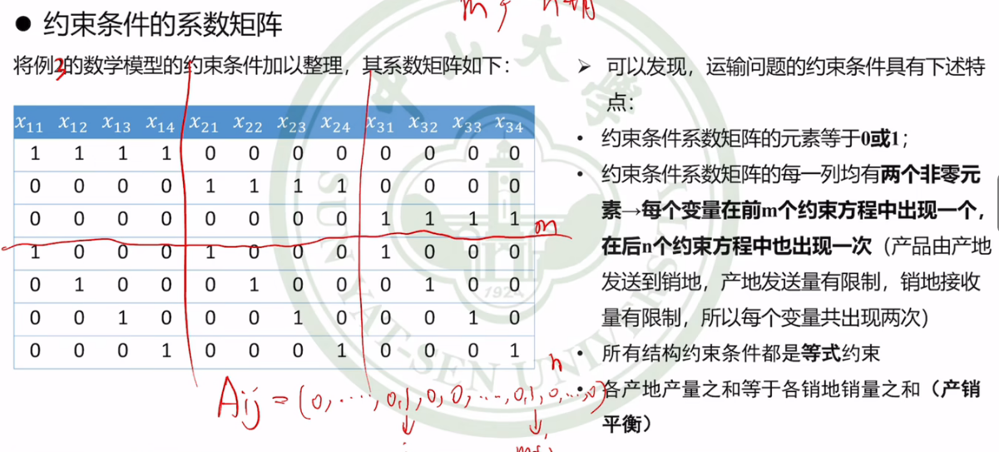
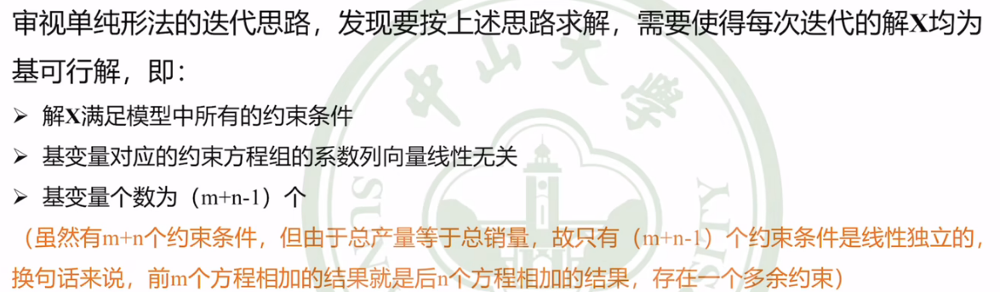
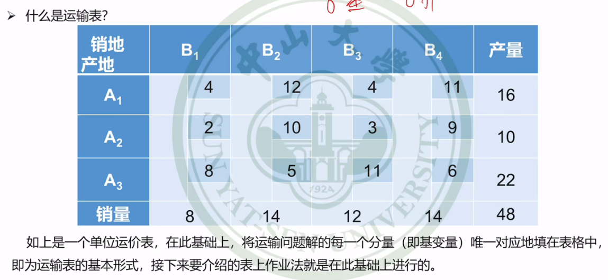
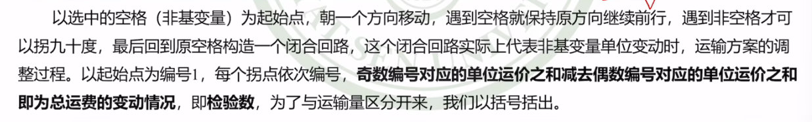
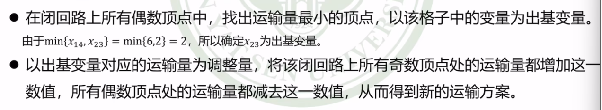
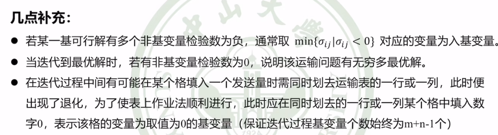
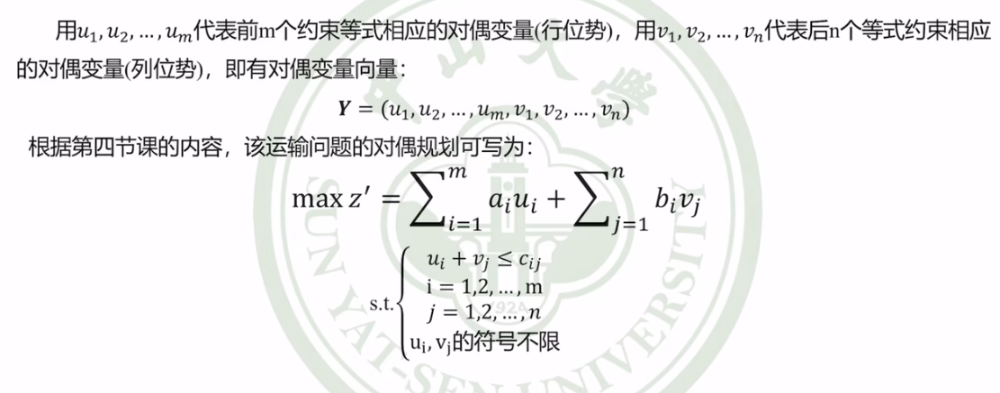

# 运输问题

## 问题提出

|              | 目标       | 条件     |
| ------------ | ---------- | -------- |
| **生产问题** | 获利最大化 | 资源限制 |
| **运输问题** | 成本最小化 | 产销平衡 |

- 目标：成本最小化
- 条件：产销平衡

- 产销不平衡

  > 产量>销量，需设销地；产量<销量，需设产地

- 有转运的运输问题

  > 不管销地/产地，都叫中转站

- 产销不确定

## 数学模型

**目标**：成本最小化

$$
\min z = 4x_{11} + 12x_{12} + 4x_{13} + 11x_{14} + 2x_{21} + 10x_{22} + 3x_{23} + 9x_{24} + 8x_{31} + 5x_{32} + 11x_{33} + 6x_{34}
$$
**条件**：产地的发送限制，销地的接收要求
$$
\begin{align*}x_{11} + x_{12} + x_{13} + x_{14} &= 16 \\x_{21} + x_{22} + x_{23} + x_{24} &= 10 \\x_{31} + x_{32} + x_{33} + x_{34} &= 22 \\x_{11} + x_{21} + x_{31} &= 8 \\x_{12} + x_{22} + x_{32} &= 14 \\x_{13} + x_{23} + x_{33} &= 12 \\x_{14} + x_{24} + x_{34} &= 14 \\x_{ij} &\geq 0 \quad (i = 1,2,3; \, j = 1,2,3,4)\end{align*}
$$
模型特点：

- 解有上下界

- 约束条件的系数矩阵

  

运输问题约束方程的系数矩阵都是由0或1组成的 , 这种矩阵称为稀疏矩阵 , 稀疏矩阵的计算要远远比正常的矩阵更简单

## 运输问题求解

### 基本思想

单位运价表：

### 寻找初始基可行解

#### 西北角法

> 不一定最优
>
> 从左上角开始找一组基可行解

#### 最小元素法

基本步骤：每次有限考虑单位运价最小的运输业务，最大限度满足其运输量

> 在西北角法上进了一步

#### 沃格尔法

计算罚数，每次填罚数最大的那一个

> 以罚数作为一个参考
>
> 利用过的罚数就不再用了

### 最优性判别及迭代

#### 闭回路法

检验数：

> 要找到所有的检验数，

- 在偶数顶点中，找出运输量最小的顶点作为出基变量

#### 位势法

# References

- 【【运筹学】应试向基础教程（已完结）{适用范围：本科期末、考研、考博}】<https://www.bilibili.com/video/BV1Uw411f7WM?p=4&vd_source=93bb338120537438ee9180881deab9c1>
