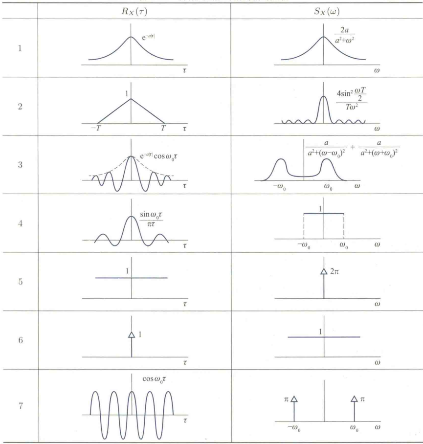

# CH 5 平稳过程

在自然科学和工程技术中经常遇到这样一类过程，它们的统计特性是当过程随时间的推移而变化时，其前后状态间是相互联系的，这种联系不随时间的推移而改变

## 定义

- 严平稳过程：

  - 定义：

    设 $ \{X(t); t \in T\} $ 是随机过程，若对任意常数 $ h $ 和正整数 $ n $，$ t_1, t_2, \cdots, t_n \in T $，$ t_1 + h, t_2 + h, \cdots, t_n + h \in T $，$ (X(t_1), X(t_2), \cdots, X(t_n)) $ 和 $ (X(t_1 + h), X(t_2 + h), \cdots, X(t_n + h)) $ 有相同的联合分布函数，即
    $$
    F(x_1, x_2, \cdots, x_n; t_1, t_2, \cdots, t_n) = F(x_1, x_2, \cdots, x_n; t_1 + h, t_2 + h, \cdots, t_n + h),
    $$
    则称 $ \{X(t); t \in T\} $ 为严平稳过程 (strictly stationary process)

  - 性质

    严平稳过程的任意有限维分布不随时间的推移而改变，从而严平稳过程的**所有一维分布都相同**，即对一切 $  h  $，$  F(x; t) = F(x; t + h)  $。而二维分布只与时间差有关：因为
    $$
    F(x_1, x_2; t_1, t_2) = F(x_1, x_2; t_1 + h, t_2 + h),
    $$
     取 $  h = -t_1  $，则

$$
      F(x_1, x_2; t_1, t_2) = F(x_1, x_2; 0, t_2 - t_1).
$$

因此，若严平稳过程 $ \{X(t); t \in T\} $ 是二阶矩过程，则 $  X(t)  $ 的均值函数和方差函数是常数，自相关函数和自协方差函数只是时间差的函数。

然而实际中随机过程的有限维分布往往是很难确定的，而一阶矩、二阶矩的确定要容易得多，这就引出了在应用上和理论上更为重要的另一种平稳过程：

- 宽平稳过程

  - 定义：

    设 $ \{X(t); t \in T\} $ 是二阶矩过程（$E[X²(t)] <\infty $），如果

    (1) 对任意 $ t \in T $，$ \mu_X(t) = E(X(t)) $ 为常数，记为 $ \mu_X $;

    (2) 对任意 $ s, t \in T $，$ R_X(s, t) = E(X(s) X(t)) $ 只是时间差 $ t - s $ 的函数，记为 $ R_X(t - s) $，

    则称 $ \{X(t); t \in T\} $ 为宽平稳过程 (wide sense stationary process)

    > $D(X)=E(X^2)-[E(X)]^2$

  - 性质：

    当 $ \{X(t); t \in T\} $ 是宽平稳过程时，
    $$
    C_X(s, t) = R_X(s, t) - \mu_X(s) \mu_X(t) = R_X(t - s) - \mu_X^2
    $$
    也只是时间差 $ t - s $ 的函数，记为 $ C_X(t - s) $。显然，若严平稳过程是二阶矩过程，则一定是宽平稳过程，而宽平稳过程不一定是严平稳过程。**对于正态过程而言，宽平稳过程一定是严平稳过程。**

- 两个平稳之间的关系：

  - $$
    严平稳过程+二阶矩存在\Rightarrow 宽平稳过程
    $$

  - $$
    宽平稳过程+正态过程\Rightarrow 严平稳过程
    $$

> 下面介绍的平稳过程没有特殊说明均为宽平稳过程

- 平稳相关（联合平稳）

  设 $ \{X(t); t \in T\} $ 和 $ \{Y(t); t \in T\} $ 都是平稳过程，若互相关函数 $ R_{XY}(t, t + \tau) $ 只是 $ \tau $ 的函数，记为 $ R_{XY}(\tau) $，则称 $ \{X(t)\} $ 和 $ \{Y(t)\} $ 是平稳相关的或联合平稳的。

  当 $ \{X(t)\} $ 和 $ \{Y(t)\} $ 平稳相关时，
  $$
  C_{XY}(t, t + \tau) = R_{XY}(t, t + \tau) - \mu_X(t) \mu_Y(t + \tau) = R_{XY}(\tau) - \mu_X \mu_Y
  $$
  也只是时间差 $ \tau $ 的函数，记为 $ C_{XY}(\tau) $

平稳过程的基本特征是**均值函数是常数，自相关函数是时间差**的函数，因此了解自相关函数与自协方差函数（只相差常数）的性质就显得非常重要。下面介绍一下这些函数的性质：

- 性质 1 设 $\{X(t); t \in T\}$ 是随机过程，则

  $$
  C_X(s, t) = C_X(t, s), \quad R_X(s, t) = R_X(t, s)
  $$
  即自协方差函数和自相关函数满足**对称性**；且对于任给的 $t_1, t_2, \cdots, t_n \in T$ 及实数 $\lambda_1, \lambda_2, \cdots, \lambda_n$，

  $$
  \sum_{k=1}^{n} \sum_{j=1}^{n} C_X(t_k, t_j) \lambda_k \lambda_j \geq 0,
  $$

  $$
  \sum_{k=1}^{n} \sum_{j=1}^{n} R_X(t_k, t_j) \lambda_k \lambda_j \geq 0,
  $$

  即自协方差函数和自相关函数满足**非负定性**。

- 性质 2 设 $\{X(t); t \in T\}$ 是平稳过程，则

  (1) $C_X(0) \geq 0, R_X(0) \geq 0$;

  (2) $C_X(\tau), R_X(\tau)$ 均为偶函数;

  (3) $|C_X(\tau)| \leq C_X(0), |R_X(\tau)| \leq R_X(0)$，即点 $0$ 是最大值点;

  (4) $C_X(\tau), R_X(\tau)$ 均为非负定的，即对任意正整数 $n$，$t_1, t_2, \cdots, t_n \in T$ 和实数 $a_1, a_2, \cdots, a_n$，

  $$
  \sum_{i=1}^{n} \sum_{j=1}^{n} R_X(t_i - t_j) a_i a_j \geq 0,
  $$

  $$
  \sum_{i=1}^{n} \sum_{j=1}^{n} C_X(t_i - t_j) a_i a_j \geq 0.
  $$

  (5) $\{X(t)\}$ 是周期为 $T_0$ 的过程（即 $P(X(t + T_0) = X(t)) = 1$）当且仅当 $R_X(\tau)$ 是周期为 $T_0$ 的函数

- 性质 3 设 $\{X(t); t \in T\}$ 和 $\{Y(t); t \in T\}$ 是平稳相关的，则

  (1) $C_{XY}(\tau) = C_{YX}(-\tau), R_{XY}(\tau) = R_{YX}(-\tau)$;

  (2) $|C_{XY}(\tau)|^2 \leq C_X(0) C_Y(0), |R_{XY}(\tau)|^2 \leq R_X(0) R_Y(0)$.

## 各态历经性

对于平稳随机过程而言，最重要的两个特征指标是**均值函数和自相关函数**，那么如何根据实验记录确定均值函数和自相关函数呢？

首先注意到，若重复大量观测一个平稳过程，就可以获得足够多的样本函数 $  x_k(t)  $, $  k = 1, 2, \cdots, N  $，再用数理统计中的矩估计法，就可以估计均值函数和自相关函数，即

$$
\hat{\mu}_X = \frac{1}{N} \sum_{k=1}^N x_k(t_1), \quad \hat{R}_X(\tau) = \frac{1}{N} \sum_{k=1}^N x_k(t_1)x_k(t_1 + \tau)
$$

其中 $  t_1, t_1 + \tau  $ 均在已观测的范围内。

> 根据大数定理，当$N\to \infty$时，上述两个均依概率收敛，但是实际上没有足够的样本。不过对于平稳过程，我们想要通过一次足够长时间的观测，用一条样本函数信息来估计均值函数和自相关函数，这是有条件的——即均值各态历经性，下面来看看

在介绍均值各态历经性之前，我们先介绍一些预备知识

- 均方收敛

  > 均方收敛为r阶收敛当$r=2$时的一个特例，强于依概率收敛

  - 定义：

    设 $  X_1, X_2, \cdots  $ 是随机变量序列，$  X  $ 是随机变量，$  E(X_n^2) < \infty  $ 且 $  E(X^2) < \infty  $。如果 $ \lim_{n \to \infty} E[(X_n - X)^2] = 0 $，则称 $  X_n  $ 均方收敛到 $  X  $，记为 $  X_n \xrightarrow{L^2} X  $。

  - 性质

    1. 如果 $  X_n \xrightarrow{L^2} a  $，则 $  X_n \xrightarrow{P} a  $。

       证明 如果 $  X_n \xrightarrow{L^2} a  $，则对任意 $ \varepsilon > 0 $，由马尔可夫不等式，
       $$
       P(|X_n - a| \geq \varepsilon) \leq \frac{E[(X_n - a)^2]}{\varepsilon^2} \to 0,
       $$
       因此，$  X_n \xrightarrow{P} a  $。

    2. 如果 $  X_n \xrightarrow{L^2} X  $, $  Y_n \xrightarrow{L^2} Y  $，则对任何常数 $  a, b  $，有
       $$
       aX_n + bY_n \xrightarrow{L^2} aX + bY。
       $$

    3. 如果 $  X_n \xrightarrow{L^2} X  $ 且 $  X_n \xrightarrow{L^2} Y  $，则 $  P(X = Y) = 1  $，即均方收敛极限在以概率 1 相等的意义下唯一

       证明：因为
       $$
       (X - Y)^2 = [(X - X_n) + (X_n - Y)]^2
       $$

       $$
       \leq 2(X - X_n)^2 + 2(X_n - Y)^2,
       $$

       从而

       $$
       0 \leq E[(X - Y)^2]
       $$

       $$
       \leq 2\lim_{n \to \infty} E[(X - X_n)^2] + 2\lim_{n \to \infty} E[(X_n - Y)^2] = 0。
       $$

       这说明 $  E[(X - Y)^2] = 0  $，由此推得 $  P(X = Y) = 1  $。

- 均方可积

  - 定义：

    设 $ \{X(t); a \leq t \leq b\} $ 为二阶矩过程，将 $ [a, b] $ 分割，$ a = t_0 < t_1 < \cdots < t_n = b $，令 $ \Delta t_i = t_i - t_{i-1}, t_i^l \in [t_{i-1}, t_i], i = 1, 2, \cdots, n $。若存在随机变量 $ Y $，使得

    $$
    \lim_{\max \Delta t_i \to 0} E \left( \sum_{i=1}^n X(t_i^l) \Delta t_i - Y \right)^2 = 0,
    $$

    则称 $ X(t) $ 在 $ [a, b] $ 上均方可积，记为 $ Y = \int_a^b X(t) \, \mathrm{d}t $。

    > note：对任何样本点 $ e \in S $，如果样本函数 $ X(t, e) $ 在 $ [a, b] $ 上可积，则 $ Y(e) = \int_a^b X(t, e) \, \mathrm{d}t $。

  - 均方可积准则 $ X(t) $ 在 $ [a, b] $ 上均方可积的充要条件是

    $$
    \int_a^b \int_a^b R_X(t_1, t_2) \, \mathrm{d}t_1 \, \mathrm{d}t_2
    $$

    存在。

  - 均方积分性质 设 $ X(t) $ 在 $ [a, b] $ 上均方可积，则

    1. $ E \left( \int_a^b X(t) \, \mathrm{d}t \right) = \int_a^b E(X(t)) \, \mathrm{d}t $；
    2. $ E \left( \left( \int_a^b X(t) \, \mathrm{d}t \right)^2 \right) = \int_a^b \int_a^b R_X(t_1, t_2) \, \mathrm{d}t_1 \, \mathrm{d}t_2 $

我们将均方收敛引入到平稳过程中，设 $ \{X(t); -\infty < t < \infty\} $ 为平稳过程

- 过程的时间均值：
  $$
  \langle X(t) \rangle = \lim_{T \to \infty} \frac{1}{2T} \int_{-T}^T X(t) \, \mathrm{d}t
  $$
  （均方收敛下的极限），称为过程的时间均值

- 过程的时间相关函数：

  对于任给的 $ \tau $，令

  $$
  \langle X(t)X(t + \tau) \rangle = \lim_{T \to \infty} \frac{1}{2T} \int_{-T}^T X(t)X(t + \tau) \, \mathrm{d}t
  $$

  （均方收敛下的极限），称为过程的时间相关函数。

- 各态历经性：指一个随机过程的统计性质可以通过其样本路径来获取

  - 定义

    - 过程的均值具有各态历经性：时间均值等于均值

      若

      $$
      \langle X(t) \rangle = E[X(t)] = \mu_X
      $$

      以概率 1 成立

    - 过程的自相关函数具有各态历经性

      若对于任给的实数 $ \tau $，

      $$
      \langle X(t)X(t + \tau) \rangle = E[X(t)X(t + \tau)] = R_X(\tau)
      $$

      以概率 1 成立

    - 若 $ X(t) $ 的均值函数和自相关函数都具有各态历经性，则称 $ X(t) $ 是**（宽）各态历经过程**（ergodic process）

  - 判断条件：下面给出几个各态历经性的判断条件

    1. 均值充要条件：设 $ \{X(t); -\infty < t < \infty\} $ 是平稳过程，则 $ X(t) $ 的**均值**具有各态历经性当且仅当
       $$
       \lim_{T \to \infty} \frac{1}{T} \int_0^T C_X(\tau) \, \mathrm{d}\tau = 0.
       $$

    2. 均值充分条件：

       假如 $ \lim_{\tau \to \infty} C_X(\tau) = a $ 存在，则 $ \lim_{T \to \infty} \frac{1}{T} \int_0^T C_X(\tau) \, \mathrm{d}\tau = a $。因此此时均值具有各态历经性当且仅当 $ a = 0 $。注意到 $ C_X(\tau) = R_X(\tau) - \mu_X^2 $，我们得到下面推论：

       若 $ \lim_{\tau \to \infty} R_X(\tau) $ 存在，则 $ \{X(t)\} $ 的均值具有各态历经性当且仅当 $ \lim_{\tau \to \infty} R_X(\tau) = \mu_X^2 $。

       该推论是平稳过程**均值**具有各态历经性的充分条件，它说明当时间间隔充分大时，若状态呈现不相关性，则均值具有各态历经性。

    3. 自相关充要条件：

       设 $ \{X(t); -\infty < t < \infty\} $ 是平稳过程，对任意给定的 $ \tau $，$ \{X(t)X(t + \tau); -\infty < t < \infty\} $ 也是平稳过程，则 $ X(t) $ 的自相关函数具有各态历经性的充要条件是对任意 $ \tau $，

       $$
       \lim_{T \to \infty} \frac{1}{T} \int_0^T (B_\tau(\tau_1) - R_X^2(\tau)) \, \mathrm{d}\tau_1 = 0,
       $$

       其中 $ B_\tau(\tau_1) = E[X(t)X(t + \tau)X(t + \tau_1)X(t + \tau + \tau_1)] $

> 我们来理解一下什么是各态历经性，随机过程某个时刻对应的随机变量所有可能出现的值，也有可能在足够长的时间上，在一次对随机过程的观察中，从随机过程的不同个时刻对应的不同的随机变量出现的值里全部看到（遍历了一次，对吧）。因为随机过程每一个时刻对应的随机变量的概率分布是一样的
>
> 但是各态历经性不一定满足：
>
> 原因在于$\langle X(t) \rangle = E[X(t)] = \mu_X$这种东西可能不相等，为什么呢？比如$X(t) = X$，$P(X=1)=P(X=-1)=\frac{1}{2}$
>
> 那么$\langle X(t) \rangle = X$，$\mu_X = 0$，看出区别了吗。下面给一个形象一点的栗子：
>
> 我在晚上1：00观察中国人，发现$99\%$的人都在睡觉（一条样本函数），那么我们说中国人的所有活动中睡觉占$99\%$，这显然是不正确的

上述定理均为在连续时间下的判断，实际中我们也有如下判定定理

- 设 $ \{X_n; n = 0, \pm 1, \pm 2, \cdots\} $ 是宽平稳序列，则它的均值具有各态历经性当且仅当

  $$
  \lim_{N \to \infty} \frac{1}{N} \sum_{n=0}^N C_X(n) = 0.
  $$

## 功率谱密度

对于平稳过程，前面主要在时间域上对自相关函数的性质展开讨论。除了时间域描述外，还有等价的**频率域描述**。它们之间的联系就是傅里叶（Fourier）变换与逆变换

我们先来看看平均功率的计算：

- 平均功率

  若平稳过程 $ \{X(t); -\infty < t < \infty\} $ 表示随机信号，例如 $ X(t) $ 表示 $ t $ 时刻的电流强度 $ I $ 或电压 $ U $，根据电功率公式 $ W = I^2R = \frac{U^2}{R} $，当电阻 $ R = 1 $ 欧时，$ X^2(t) $ 就表示信号在 $ t $ 时刻的功率，$ E \left( \lim_{T \to \infty} \frac{1}{2T} \int_{-T}^T X^2(t) \, \mathrm{d}t \right) $ 的物理意义为平均功率。计算得

  $$
  E \left( \lim_{T \to \infty} \frac{1}{2T} \int_{-T}^T X^2(t) \, \mathrm{d}t \right) = \lim_{T \to \infty} \frac{1}{2T} \int_{-T}^T E(X^2(t)) \, \mathrm{d}t = R_X(0),
  $$

  即 $ X(t) $ 的平均功率为 $ R_X(0) $，为均方值

下面讨论平均功率的谱表示：

- 谱表示：

  不加证明地有对于平稳过程 $ \{X(t); -\infty < t < \infty\} $，有

  $$
  \lim_{T \to \infty} \frac{1}{2T} \int_{-T}^T X^2(t) \, \mathrm{d}t = \frac{1}{2\pi} \int_{-\infty}^\infty \lim_{T \to \infty} \frac{1}{2T} |F_X(\omega, T)|^2 \, \mathrm{d}\omega,
  $$

  等式两边都是随机变量，故同时取数学期望，此时左边就是平稳过程的平均功率，即

  $$
  R_X(0) = E \left( \lim_{T \to \infty} \frac{1}{2T} \int_{-T}^T X^2(t) \, \mathrm{d}t \right)
  $$

  $$
  = \frac{1}{2\pi} \int_{-\infty}^\infty E \left( \lim_{T \to \infty} \frac{1}{2T} |F_X(\omega, T)|^2 \right) \, \mathrm{d}\omega.
  $$

  记 $ S_X(\omega) = E \left( \lim_{T \to \infty} \frac{1}{2T} |F_X(\omega, T)|^2 \right) $，称为功率谱密度，简称**谱密度**。于是

  $$
  R_X(0) = \frac{1}{2\pi} \int_{-\infty}^\infty S_X(\omega) \, \mathrm{d}\omega,
  $$

  就是平稳过程的平均功率的谱表示式。

  谱密度 $ S_X(\omega) $ 是从频率域描述 $ X(t) $ 的统计规律的最重要数字特征。由平均功率的谱表示式知，它的物理意义为 $ X(t) $ 的平均功率关于频率的分布。

- 功率谱密度的性质

  1. $ S_X(\omega) $ 是 $ \omega $ 的实的、非负的偶函数。
     这是因为 $ |F_X(\omega, T)|^2 $ 是 $ \omega $ 的实的、非负的偶函数，故对其取期望和极限后仍是 $ \omega $ 的实的、非负的偶函数。

  2. 若 $ \int_{-\infty}^\infty |R_X(\tau)| \, \mathrm{d}\tau < \infty $，则 $ S_X(\omega) $ 和 $ R_X(\tau) $ 是傅里叶变换对，即
     $$
     S_X(\omega) = \int_{-\infty}^\infty R_X(\tau) \mathrm{e}^{-\mathrm{i}\omega\tau} \, \mathrm{d}\tau,
     $$

     $$
     R_X(\tau) = \frac{1}{2\pi} \int_{-\infty}^\infty S_X(\omega) \mathrm{e}^{\mathrm{i}\omega\tau} \, \mathrm{d}\omega,
     $$

     它们被称为维纳-辛钦公式。

     此外，由于 $ R_X(\tau) $ 和 $ S_X(\omega) $ 都是偶函数，所以利用欧拉（Euler）公式，维纳-辛钦公式还可以写成如下形式：

     $$
     \begin{cases}
     S_X(\omega) = 2 \int_0^\infty R_X(\tau) \cos \omega \tau \, \mathrm{d}\tau, \\
     R_X(\tau) = \frac{1}{\pi} \int_0^\infty S_X(\omega) \cos \omega \tau \, \mathrm{d}\omega.
     \end{cases}
     $$

     维纳-辛钦公式也称为**平稳过程自相关函数的谱表示式**，它揭示了从时间域描述平稳过程 $ \{X(t)\} $ 的统计规律和从频率域描述 $ \{X(t)\} $ 的统计规律之间的联系。

  3. 在工程中，由于只在正的频率范围内进行测量，因此根据谱密度的偶函数性质，可将负频率范围内的值折算到正频率范围内，得到“单边功率谱”，记为 $ G_X(\omega) $，即

     $$
     G_X(\omega) = \begin{cases}
     2 \lim_{T \to \infty} \frac{1}{T} E \left( \left| \int_0^T X(t) \mathrm{e}^{-\mathrm{i}\omega t} \, \mathrm{d}t \right|^2 \right), & \omega \geq 0, \\
     0, & \omega < 0
     \end{cases}
     $$

     $$
     = \begin{cases}
     2S_X(\omega), & \omega \geq 0, \\
     0, & \omega < 0.
     \end{cases}
     $$

     

- 白噪声过程

  - 定义：

    设 $ \{X(t); -\infty < t < \infty\} $ 为平稳过程，均值为零，谱密度为正常数，即 $ S_X(\omega) = S_0, -\infty < \omega < \infty $，称 $ \{X(t)\} $ 为白噪声过程

  - 性质：

    由于白噪声过程有类似于白光的性质，其**能量谱在各种频率上均匀分布**，故而得名，又由于它的统计特性不随时间推移而改变，因此是平稳过程。

    但其相关函数在通常意义下的傅里叶逆变换不存在，于是，为了对白噪声过程进行频谱分析，引进 $ \delta $ 函数的傅里叶变换。

    > 白噪声过程是一种理想化的数学模型，它的平均功率 $ R_X(0) $ 是无限的。实际中，当噪声在比实际考虑的有用频带宽得多的范围内具有比较“平坦”的谱密度时，就将它近似当作白噪声来处理。

  - $ \delta $ 函数

    $ \delta $ 函数是单位冲激函数（$ \delta(t) $）的简称，它是一种广义函数。狄拉克（Dirac）最早给出了 $ \delta $ 函数的定义：

    $$
    \begin{cases}
    \delta(t) = 0, & t \neq 0, \\
    \int_{-\infty}^\infty \delta(t) \, \mathrm{d}t = 1.
    \end{cases}
    $$

    $ \delta $ 函数的基本性质：对任一在 $ \tau=0 $ 处连续的函数 $ f(\tau) $，有

    $$
    \int_{-\infty}^\infty \delta(\tau) f(\tau) \, \mathrm{d}\tau = f(0).
    $$

    一般地，若函数 $ f(\tau) $ 在 $ \tau_0 $ 处连续，就有

    $$
    \int_{-\infty}^\infty \delta(\tau - \tau_0) f(\tau) \, \mathrm{d}\tau = f(\tau_0).
    $$

    于是，可以得到以下傅里叶变换对：

    $$
    \int_{-\infty}^\infty \delta(\tau) \mathrm{e}^{-\mathrm{i}\omega\tau} \, \mathrm{d}\tau = 1 \Leftrightarrow \delta(\omega) = \frac{1}{2\pi} \int_{-\infty}^\infty \mathrm{e}^{\mathrm{i}\omega\tau} \, \mathrm{d}\omega,
    $$

    $$
    \int_{-\infty}^\infty \mathrm{e}^{-\mathrm{i}\omega\tau} \, \mathrm{d}\omega = 2\pi \delta(\omega) \Leftrightarrow 1 = \frac{1}{2\pi} \int_{-\infty}^\infty 2\pi \delta(\omega) \mathrm{e}^{\mathrm{i}\omega\tau} \, \mathrm{d}\omega.
    $$

    即当自相关函数 $ R_X(\tau) = 1 $ 时，谱密度 $ S_X(\omega) = 2\pi \delta(\omega) $；当自相关函数 $ R_X(\tau) = \delta(\tau) $ 时，对应谱密度 $ S_X(\omega) = 1 $。这说明白噪声过程的自相关函数为 $ R_X(\tau) = S_0 \delta(\tau) $，即过程在 $ t_1 \neq t_2 $ 时，$ X(t_1) $ 与 $ X(t_2) $ 是不相关的。

- 带限白噪声，其谱密度的特点是仅在某些有限频率范围内取正常数。如低通白噪声 $ X(t) $，其谱密度定义为

  $$
  S_X(\omega) = \begin{cases}
  S_0, & |\omega| \leq \omega_1, \\
  0, & |\omega| > \omega_1.
  \end{cases}
  $$

  相应的自相关函数为

  $$
  R_X(0) = \frac{1}{2\pi} \int_{-\infty}^\infty S_X(\omega) \, \mathrm{d}\omega = \frac{S_0 \omega_1}{\pi},
  $$

  $$
  R_X(\tau) = \frac{1}{2\pi} \int_{-\infty}^\infty S_X(\omega) \mathrm{e}^{\mathrm{i}\omega \tau} \, \mathrm{d}\omega = \frac{1}{2\pi} \int_{-\omega_1}^{\omega_1} S_0 \mathrm{e}^{\mathrm{i}\omega \tau} \, \mathrm{d}\omega
  $$

  $$
  = \frac{S_0}{\pi \tau} \sin \omega_1 \tau, \quad \tau \neq 0.
  $$

  当 $ \tau = \frac{k\pi}{\omega_1}, k = \pm 1, \pm 2, \cdots $ 时，$ R_X(\tau) = 0 $。这说明在 $ t_2 - t_1 = \frac{k\pi}{\omega_1} $ 时，$ X(t_1) $ 与 $ X(t_2) $ 是不相关的。

- 互谱密度

  - 定义：

    设 $ \{X(t)\} $ 和 $ \{Y(t)\} $ 是两个平稳相关的随机过程，定义

    $$
    S_{XY}(\omega) = \lim_{T \to \infty} \frac{1}{2T} E(F_X(-\omega, T)F_Y(\omega, T))
    $$

    为平稳过程 $ X(t) $ 和 $ Y(t) $ 的互谱密度

  - 性质：互谱密度不再是 $ \omega $ 的实的、非负的偶函数，其性质如下

    (1) $ S_{XY}(\omega) = \overline{ S_{YX}(\omega) }$，即 $ S_{XY}(\omega) $ 和 $ S_{YX}(\omega) $ 互为共轭函数；
    (2) 在互相关函数 $ R_{XY}(\tau) $ 绝对可积的条件下，有
    $$
    S_{XY}(\omega) = \int_{-\infty}^\infty R_{XY}(\tau) \mathrm{e}^{-\mathrm{i}\omega \tau} \, \mathrm{d}\tau, \quad R_{XY}(\tau) = \frac{1}{2\pi} \int_{-\infty}^\infty S_{XY}(\omega) \mathrm{e}^{\mathrm{i}\omega \tau} \, \mathrm{d}\omega;
    $$

    (3) $ S_{XY}(\omega) $ 和 $ S_{YX}(\omega) $ 的实部是 $ \omega $ 的偶函数，虚部是 $ \omega $ 的奇函数；
    (4) 互谱密度与自谱密度之间成立不等式
    $$
    |S_{XY}(\omega)|^2 \leq S_X(\omega)S_Y(\omega).
    $$

  - 意义：

    互谱密度不像自谱密度那样有明显的物理意义，引进这个概念主要是为了能在频率域上描述两个平稳过程的相关性（比如，对具有零均值的平稳过程 $ X(t) $ 和 $ Y(t) $ 而言，$ S_{XY}(\omega) = 0 $ 等价于 $ X(t) $ 和 $ Y(t) $ 不相关）。在实际应用中，常常利用测定线性系统输入、输出的互谱密度来确定该系统的统计特性。

## 线性系统中的平稳过程

线性系统是工程应用中最常见的一类系统。在一个线性系统中，如果输入一个平稳过程，那么输出的随机过程平稳吗？输入过程与输出过程的相关性又是怎样的呢？下面来探讨一下这些问题。

我们使用算子$L$代表系统的作用：

$$
y(t) = L[x(t)]
$$
然后针对以下几种不同的系统分别进行讨论

1. 线性时不变系统

   我们可以证明微分算子和积分算子是线性时不变的

   由定义可知，系统的线性性质表现在该系统满足叠加原理，系统的时不变性质表现在输出对输入的关系不随时间的推移而改变。在工程应用中，属于这类较简单而又十分重要的系统是输入与输出之间可以用常系数线性微分方程来描述的系统：

   $$
   b_n \frac{d^n y}{d t^n} + b_{n-1} \frac{d^{n-1} y}{d t^{n-1}} + \cdots + b_0 y = a_m \frac{d^m x}{d t^m} + a_{m-1} \frac{d^{m-1} x}{d t^{m-1}} + \cdots + a_0 x,
   $$
   其中 $n \geq m \geq 0, -\infty < t < \infty$。

2. 频率响应与脉冲响应

   定理：设 $L$ 为线性时不变系统，若输入一个谐波信号 $x(t) = e^{i\omega t}$，则输出为
   $$y(t) = L[e^{i\omega t}] = H(\omega)e^{i\omega t}$$，其中 $H(\omega) = L[e^{i\omega t}]\Big|_{t=0}$。

   定理表明，对线性时不变系统输入谐波信号时，其输出也是同频率的谐波，只是振幅和相位有变化，而 $H(\omega)$ 表示了这一变化，将 $H(\omega)$ 称为系统的**频率响应函数**。

   一般地，对于输入 $x(t)$，根据 $\delta$ 函数的性质，$x(t) = \int_{-\infty}^{\infty} x(\tau)\delta(t-\tau) \, \mathrm{d}\tau$，于是，输出
   $$
   y(t) = L[x(t)] = L \left[ \int_{-\infty}^{\infty} x(\tau)\delta(t-\tau) \, \mathrm{d}\tau \right]
   $$

   $$
   = \int_{-\infty}^{\infty} x(\tau)L[\delta(t-\tau)] \, \mathrm{d}\tau = \int_{-\infty}^{\infty} x(\tau)h(t-\tau) \, \mathrm{d}\tau,
   $$

   其中 $h(t-\tau) = L[\delta(t-\tau)]$。

   若输入 $x(t)$ 为表示脉冲的 $\delta$ 函数，即 $x(t) = \delta(t)$，则输出为$$y(t) = \int_{-\infty}^{\infty} \delta(\tau)h(t-\tau) \, \mathrm{d}\tau = h(t)$$，因此将 $h(t)$ 称为系统的**脉冲响应函数**。

注意，经过变量替换有$$y(t) = \int_{-\infty}^{\infty} x(\tau)h(t-\tau) \, \mathrm{d}\tau = \int_{-\infty}^{\infty} x(t-u)h(u) \, \mathrm{d}u.$$

   这表明，从时间域分析，线性时不变系统的输出 $y(t)$ 是输入 $x(t)$ 与脉冲响应 $h(t)$ 的卷积。若设输入 $x(t)$、输出 $y(t)$ 和脉冲响应 $h(t)$ 都满足傅里叶变换条件，且相应的傅里叶变换分别为 $X(\omega), Y(\omega), \widetilde{H}(\omega)$，即
$$X(\omega) = \int_{-\infty}^{\infty} x(t)e^{-i\omega t} \, \mathrm{d}t, \quad x(t) = \frac{1}{2\pi} \int_{-\infty}^{\infty} X(\omega)e^{i\omega t} \, \mathrm{d}\omega,$$
$$Y(\omega) = \int_{-\infty}^{\infty} y(t)e^{-i\omega t} \, \mathrm{d}t, \quad y(t) = \frac{1}{2\pi} \int_{-\infty}^{\infty} Y(\omega)e^{i\omega t} \, \mathrm{d}\omega,$$$$\widetilde{H}(\omega) = \int_{-\infty}^{\infty} h(t)e^{-i\omega t} \, \mathrm{d}t, \quad h(t) = \frac{1}{2\pi} \int_{-\infty}^{\infty} \widetilde{H}(\omega)e^{i\omega t} \, \mathrm{d}\omega,$$

   则 $Y(\omega) = X(\omega)\widetilde{H}(\omega)$。

   可以证明：$\widetilde{H}(\omega) = H(\omega)$，也就是频率响应函数 $H(\omega)$ 即为脉冲响应 $h(t)$ 的傅里叶变换。

3. 输出过程的均值函数和相关函数

   设线性时不变系统输入的平稳过程为 $\{X(t)\}$，且对于 $X(t)$ 的任一样本函数 $x(t)$，有
   $$
   y(t) = \int_{-\infty}^{\infty} h(t-\tau)x(\tau) \, \mathrm{d}\tau = \int_{-\infty}^{\infty} h(\tau)x(t-\tau) \, \mathrm{d}\tau
   $$
   则其输出
   $$
   Y(t) = \int_{-\infty}^{\infty} h(t-\tau)X(\tau) \, \mathrm{d}\tau = \int_{-\infty}^{\infty} h(\tau)X(t-\tau) \, \mathrm{d}\tau
   $$
   $\{Y(t)\}$ 也是随机过程。下面讨论输入过程 $\{X(t)\}$ 的均值函数和相关函数与输出过程的均值函数和相关函数的关系。

   定理：设输入平稳过程 $\{X(t)\}$ 的均值函数为 $\mu_X$，自相关函数为 $R_X(\tau)$，则输出过程 $\{Y(t)\}$ 也是平稳过程，且 $\{X(t)\}$ 和 $\{Y(t)\}$ 是平稳相关的，其数字特征满足
   $$
   \mu_Y = \mu_X \int_{-\infty}^{\infty} h(u) \, \mathrm{d}u
   $$

   $$
   R_{XY}(\tau) = \int_{-\infty}^{\infty} h(u)R_X(\tau-u) \, \mathrm{d}u
   $$

   $$
   R_Y(\tau) = \int_{-\infty}^{\infty} h(v)R_{XY}(\tau+v)
   \\=\int_{-\infty}^{\infty} \int_{-\infty}^{\infty} h(u)h(v)R_X(\tau-u+v) \, \mathrm{d}u \, \mathrm{d}v
   $$

   从中可以看出，$\{Y(t)\}$ 是平稳过程，且 $\{X(t)\}$ 和 $\{Y(t)\}$ 是平稳相关的。

4. 线性时不变系统的谱密度

   定理：设输入过程是谱密度为 $S_X(\omega)$ 的平稳过程 $\{X(t)\}$，输出过程为 $\{Y(t)\}$，系统的频率响应函数为 $H(\omega)$，则 $Y(t)$ 的谱密度为
   $$
   S_Y(\omega) = |H(\omega)|^2 S_X(\omega)
   $$
   $X(t)$ 与 $Y(t)$ 的互谱密度为
   $$
   S_{XY}(\omega) = H(\omega)S_X(\omega)
   $$
   这里称 $|H(\omega)|^2$ 为系统的频率增益因子或频率传输函数。

   

## Sheet

| 时域                                 | 频域                                                         |
| ------------------------------------ | ------------------------------------------------------------ |
| $e^{-a\mid\tau\mid}$                 | $\frac{2a}{a^2+\omega^2}$                                    |
| $S_0\frac{sin\omega_0\tau}{\pi\tau}$ | $\begin{cases}S_0\quad\mid\omega\mid\leq\omega_0\\[2ex]0\quad\mid\omega\mid>\omega_0\end{cases}$ |
| $1$                                  | $2\pi\delta(\omega)$                                         |
| $\delta(\tau)$                       | $1$                                                          |
| $cos\omega_0\tau$                    | $\pi[\delta(\omega+\omega_0)+\delta(\omega-\omega_0)]$       |

$$
\begin{aligned}
e^{j\omega_0 \tau} &= \cos(\omega_0 \tau) + j\sin(\omega_0 \tau) \\
e^{-j\omega_0 \tau} &= \cos(\omega_0 \tau) - j\sin(\omega_0 \tau)
\end{aligned}
$$

因此

$$
\begin{aligned}
\cos(\omega_0 \tau) &= \frac{1}{2}(e^{j\omega_0 \tau} + e^{-j\omega_0 \tau}) \\
\sin(\omega_0 \tau) &= \frac{1}{2j}(e^{j\omega_0 \tau} - e^{-j\omega_0 \tau})
\end{aligned}
$$

