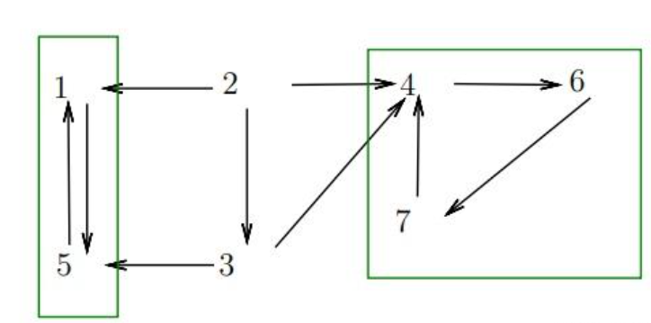
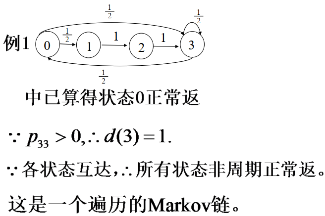

# Main Takeaway

数院1.5学分《随机过程》

内容可以直接看笔记，例题可以看课件，挺多的

<!--more-->

# CH 1 Intro

随机过程是随时间演化的随机现象的数学抽象

下面先进行一些主要预备知识

的复习，主要是概率论（概率论是一门研究随机现象的数量规律性的学科）

> 建议直接看[概率论部分](概率论.md)

n元正态分布

1. 设 $ (X_1, X_2, \cdots, X_n) $ 服从 $ n $ 元正态分布，则它的任意 $ k $ 元 $ (k = 1, 2, \cdots, n) $ 分量 $ (X_{i_1}, X_{i_2}, \cdots, X_{i_k}) $ 服从正态分布。特别地，每一个分量 $ X_i $ 都服从正态分布。反之，若 $ X_i (i = 1, 2, \cdots, n) $ 都服从正态分布，且相互独立，则 $ (X_1, X_2, \cdots, X_n) $ 服从正态分布。
2. $ (X_1, X_2, \cdots, X_n) $ 服从 $ n $ 元正态分布的充要条件是它的 $ n $ 个分量的任意线性组合均服从一元正态分布。
3. （正态分布的线性变换不变性）若 $ (X_1, X_2, \cdots, X_n) $ 服从 $ n $ 元正态分布，设 $ Y_1, Y_2, \cdots, Y_k $ 都是 $ X_1, X_2, \cdots, X_n $ 的线性组合，则 $ (Y_1, Y_2, \cdots, Y_k) $ 也服从正态分布。
4. 若 $ (X_1, X_2, \cdots, X_n) $ 服从 $ n $ 元正态分布，则 $ X_1, X_2, \cdots, X_n $ 相互独立当且仅当它们两两不相关。

积化和差：

$$
\begin{align*}\sin \alpha \cos \beta &= \frac{\sin(\alpha + \beta) + \sin(\alpha - \beta)}{2} \\\cos \alpha \sin \beta &= \frac{\sin(\alpha + \beta) - \sin(\alpha - \beta)}{2} \\\cos \alpha \cos \beta &= \frac{\cos(\alpha + \beta) + \cos(\alpha - \beta)}{2} \\\sin \alpha \sin \beta &= -\frac{\cos(\alpha + \beta) - \cos(\alpha - \beta)}{2}\end{align*}
$$

> 正余余正，正加正减；余余正正，余加负余减。

和差化积：
$$
\begin{align*}\sin \alpha + \sin \beta &= 2 \sin \frac{\alpha + \beta}{2} \cos \frac{\alpha - \beta}{2} \\\sin \alpha - \sin \beta &= 2 \cos \frac{\alpha + \beta}{2} \sin \frac{\alpha - \beta}{2} \\\cos \alpha + \cos \beta &= 2 \cos \frac{\alpha + \beta}{2} \cos \frac{\alpha - \beta}{2} \\\cos \alpha - \cos \beta &= -2 \sin \frac{\alpha + \beta}{2} \sin \frac{\alpha - \beta}{2}\end{align*}
$$

> 帅加帅等于帅哥，
>
> 帅减帅等于哥帅，
>
> 哥加哥等于哥哥，
>
> 哥减哥等于负嫂嫂
>
> 正加正，正在前；
> 正减正，余在前；
> 余加余，余并肩；
> 余减余，负正弦。

# CH 2 Basic Fundamental

## 随机过程定义

先介绍一些基本的定义以及例子

- 随机过程：

  S为样本空间，T为参数集，$T \subset R$，如果对任何$t\in T$，$X(t)$均为S上的随机变量，则称$\{ X(t); t \in T \}$ 为S上的随机过程

  > 在 $T$ 中取任一 $t$ 的随机变量集合。

- 样本函数：

  $\{ X(t); t \in T \}$可看成一个S上的二元函数$X(t,\omega)$，$\omega$为在T上取到的参数，则

  - $X(t,\cdot)$为随机变量
  - $X(\cdot，\omega)$是$t$的函数，为样本函数

  > 对过程的一次具体观察结果就是一条样本函数

- 状态：给定 $t₀$，$X(t₀)$ 是与随机变量相关的值。

- 状态空间：所有可能状态取值构成的集合。

随机过程的分类

- 参数集$T$至多可列，则称为离散时间；

- 如果$T$是一个实数区间，则称为连续时间；
- 状态空间为离散状态和连续状态两种

于是随机过程一共可以分为四类（$2\times 2$）

给一个栗子： (二项过程）

某人在打靶，每次的命中率为p,并且各次的结果相互独立。用$S_n$表示前n次命中的次数。
则$\{S_n=1,2 ...\}$是一个离散时间离散状态的随机过程。状态空间$I=\{0,1,2 ...\}$

其样本函数为$\{(s_1, s_2, s_3, \ldots):s_1 = 0 或 s_1 = 1,s_{i+1} = s_i或 s_{i+1} = s_i + 1\}$

## 随机过程的有限维分布

有限维分布函数族

- 定义：

  - 一维：

    设随机过程 $\{ X(t), t \in T \}$，对每一固定的 $t \in T$，随机变量 $X(t)$ 的分布函数与 $t$ 有关，记为$$F_X(x, t) = P\{X(t) \leq x\},\quad x \in R$$ 

    称为 $\{ X(t), t \in T \}$ 的**一维分布函数**。

    $\{ F_X(x, t), t \in T \}$ 称为**一维分布函数族**。

  - n维：

    对任意 $n\ (n = 2, 3, \cdots)$ 个不同的时刻，$t_1, t_2, \cdots, t_n \in T$，

    $n$ 维随机变量 $(X(t_1), X(t_2), \cdots, X(t_n))$ 的分布函数记为：
    $$
    F_X(x_1, x_2, \cdots, x_n; t_1, t_2, \cdots, t_n) = \\P\{X(t_1) \leq x_1, X(t_2) \leq x_2, \cdots, X(t_n) \leq x_n\}
    $$
    其中 $x_i \in R,\ i = 1, 2, \cdots, n$，

    称为 $\{ X(t), t \in T \}$ 的$n$维分布函数。

    $\{ F_X(x_1, x_2, \cdots, x_n; t_1, t_2, \cdots, t_n), t_i \in T \}$ 称为$n$维分布函数族。

有限维分布函数族完全确定了随机过程的统计特性

下面举一个栗子（感觉挺有意思的）：直接看slides吧（有好几个，都挺有意思的）

甲乙两人游戏,第$i$次甲赢的钱数为$X_i$，设前n次甲赢的总钱数为$S_n$，则游戏一直到甲恰好赢50次为止，问游戏需进行100次以上的概率约为多少？

这里涉及一个事件相等的应用：令$V_n$表示前n次甲赢得总次数，$W_n$表示甲恰好赢n次时游戏进行得次数，则$\{W_{50}>100\} = \{V_{100}<50\}$，为什么有这个结果呢？

直接利用事件相等可以获得（脑子想想），但这里我们来思考一下：
$$
\{W_{k} > n\} = \{V_{n} < k\}
$$

$$
\{W_{k} = n\} = \{V_{n} = k\}
$$

$$
\{V_{n} = k\} \subset  \{W_{k} \le n\}
$$

## 均值函数和协方差函数 

下面介绍给定随机过程$\{X(t),t\in T\}$数字特征

- 均值函数：$\mu_X(t) = E[X(t)]$

- 均方差函数：$\psi^2_X(t) = E[X^2(t)]$

- 方差函数：$\sigma_X^2(t) = D_X(t) = D[X(t)] = E[X^2(t)] - E^2[X(t)]$

  - 离散：$D(t)=\sum [x_k-E(X)]^2p_k$

  - 连续：$D(t)=\int_{-\infty}^{+\infty}[x_k-E(X)]^2f(x)dx$

- 标准差函数：$\sigma_X(t) = \sqrt{\sigma^2_{X}(t)}$

- 自相关函数：这里是工程领域定义不是统计学上的定义（归一化），这样定义直接表示信号的平均功率
  $$
  R_X(t₁, t₂) = E[X(t₁) \cdot X(t₂)]
  $$

- 自协方差函数：描述同一随机过程在**不同时刻**的取值之间的线性关联程度
  $$
  C_X(t₁, t₂) = Cov[X(t₁), X(t₂)] = E[(X(t₁)-\mu_X(t_1)) \cdot (X(t₂)-\mu_X(t_2))] 
  \\ = E[X(t₁) \cdot X(t₂)] - E[X(t₁)] \cdot E[X(t₂)]
  $$
  协方差性质：
  $$
  Cov(aX,bY) = ab\cdot Cov(X,Y) \\
  Cov(X_1+X_2,Y) = Cov(X_1,Y)+Cov(X_2,Y)
  $$

- 相互之间的关系

  - $\psi^2_X(t) = R_X(t,t)$

  - $C_X(t_1,t_2) =  R_X(t_1,t_2) - \mu_X(t_1)\mu_X(t_2)$

  - $\sigma^2_X(t) = C_X(t,t) = R_X(t,t) - \mu^2_X(t)$

  - $D(X(t_1)+X(t_2)) = D_X(t_1)+D_X(t_2)+2C_X(t_1,t_2)$

  - 一个随机过程$X(t)$，导数$Y(t) = X'(t)$，他们均值和自相关函数的关系：
    $$
    \mu_Y = \frac{d}{dt}\mu_X \\
    R_Y(t_1,t_2) = \frac{\partial^2}{\partial t_1 \partial t_2} R_X(t_1,t_2)
    $$

- 互相关函数
  $R_{XY}(t₁, t₂) = E[X(t₁) \cdot Y(t₂)]$
  $R_{YX}(t₁, t₂) = E[Y(t₁) \cdot X(t₂)]$

- 互协方差函数
  $$
  C_{XY}(t₁, t₂) = Cov[X(t₁), Y(t₂)] = E[X(t₁) \cdot Y(t₂)] - E[X(t₁)] \cdot E[Y(t₂)] \\
   =R_{XY}(t_1,t_2)  - \mu_X(t_1) \mu_Y (t_2)
  $$

  $$
  C_{YX}(t₁, t₂) = Cov[Y(t₁), X(t₂)] = E[Y(t₁) \cdot X(t₂)] - E[Y(t₁)] \cdot E[X(t₂)] \\
   =R_{YX}(t_1,t_2)  - \mu_Y(t_1) \mu_X (t_2)
  $$

  若$C_{XY}(t_1,t_2)==0$，则不相关

- 二阶矩过程

  随机过程$\{X(t),t∈T\}$，如果对每一 $t∈T,$ $E[X²(t)]$都存在即$E[X²(t)]<\infty$，则称$X(t)$是二阶矩过程。二阶矩过程的**均值函数和相关函数**总是存在的

- 正态过程

  随机过程$\{X(t),t∈T\}$，如果对每一 $t∈T,$ $X(t)$都服从正态分布，则为正态过程

  正态过程的全部统计特性完全由它的均值函数和自协方差函数所确定。

  > 注意一下证明时的数学用语：
  >
  > A，B时相互独立的正态变量，故$(A,B)$是二维正态变量
  > 对任意$t_1,t_2,...,t_n \in T$，定义：
  > $$
  >    X(t_i) = A\cos t_i + B\sin t_i \quad (i=1,2,...,n)
  >  $$
  > 
  > 
  >根据正态分布的线性变换不变性：
  >$$
  > (X(t_1),X(t_2)...X(t_n))服从n维正态分布
  > $$
  > 
  > 故$\{X(t)\}$是正态过程。
  >

- 两个随机过程之间的关系

  - 二维随机过程：

    设 $X(t), Y(t)$ 是依赖于同一参数 $t \in T$ 的随机过程，称 $\{ X(t), Y(t) \mid t \in T \}$ 为**二维随机过程**。

  - 多维分布函数

    $t_1, t_2, \cdots, t_n; t_1', t_2', \cdots, t_m'$ 是 $T$ 中任意两组实数，
    则 $n+m$ 维随机变量$$\left( X(t_1), X(t_2), \cdots, X(t_n); Y(t_1'), Y(t_2'), \cdots, Y(t_m') \right)$$的分布函数：
    $$
    F(x_1, x_2, \cdots, x_n; t_1, t_2, \cdots, t_n; y_1, y_2, \cdots, y_m; t_1', t_2', \cdots, t_m')
    $$
    称为二维随机过程的 **$n+m$ 维分布函数**。

  - 独立性

    对任意的正整数 $n, m$，任意的数组$t_1, t_2, \cdots, t_n \in T; t_1', t_2', \cdots, t_m' \in T$，
    若 $n$ 维随机变量 $\left( X(t_1), X(t_2), \cdots, X(t_n) \right)$ 与$m$ 维随机变量 $\left( Y(t_1'), Y(t_2'), \cdots, Y(t_m') \right)$**相互独立**，则称随机过程 $\{ X(t) \}$ 和 $\{ Y(t) \}$ 相互独立。

## Others

- $x\sim N(\mu,\sigma^2)$，那么$f(x) = \frac{1}{\sigma\sqrt{2\pi}} e^{-\frac{(x-\mu)^2}{2\sigma^2}}$

  经下述推导有对数正态分布$E[e^{x}] = e^{\mu+\frac{1}{2}\sigma^2}$

  [(29 封私信 / 80 条消息) x服从正态分布,求e^x的期望](https://www.zhihu.com/question/38754314)

  Moment Generating Function

# CH 3 Markov Chain

## 马尔可夫链的定义

- Markov性（无记忆性）：知道现在状态的条件下，过去与将来相互独立。

  > 马尔可夫性并不是指过去与将来相互独立

  更一般地：
  - 对任意 $k \geq 1$ 和时刻序列 $n_0 < n_1 < \cdots < n_{k+1}$，
  - 任意状态 $i_0, i_1, \ldots, i_{k-1}, i, j$，有

  $$
  P\left( S_{n_{k+1}} = j \mid \begin{aligned}
      & S_{n_0} = i_0, \\
      & S_{n_1} = i_1, \\
      & \quad\vdots \\
      & S_{n_k} = i 
  \end{aligned} \right) = P\left( S_{n_{k+1}} = j \mid S_{n_k} = i \right)
  $$

- Markov Chain：设随机过程$\{X_n:n=0,1,...\}$的状态空间$I$有限或可列，如果其具有Markov性则称其为Markov Chain

  状态空间有限的马尔可夫链称为有限马尔可夫链

- 转移概率：在 $m$ 时处于状态 $i$ 的条件下，到 $n$ 时转移到状态 $j$ 的概率：
  $$
  P(X_n = j \mid X_m = i) \stackrel{\text{记为}}{=} p_{ij}(m, n)
  $$

  > 注意边界转移概率常不同

- 转移矩阵 $\mathbf{P}$ 满足：

  - 各元素非负：$p_{ij}(m, n) \geq 0$

  - 各行元素之和为1：$\sum_j p_{ij}(m, n) = 1$

  记$P(m,m+n) = (p_{ij}(m,m+n))_{I\times I}$为对应的n步转移矩阵

- 时齐 Markov 链

  若 $\forall i, j$，转移概率满足：
  $$
  P(X_{n+1} = j \mid X_n = i) \stackrel{\text{记为}}{=} p_{ij} \quad (\text{不依赖} \ n)
  $$
  则称 $\{ X_n \}$ 为**时齐 Markov 链**。核心特征是**状态转移概率不随时间变化**

  - 一步转移概率：$P(X_{n+1} = j \mid X_n = i) \stackrel{\text{记为}}{=} p_{ij}$

  - 一步转移矩阵：$P= [p_{ij}]_{I\times I}$

  - $m$ 步转移概率：$P(X_{n+m} = j \mid X_{n} = i) \stackrel{\text{记为}}{=} p_{ij}^{(m)}$

    要得到$m$ 步转移概率，可以计算$m$步转移矩阵或者直接使用C-K方程得到

  - $m$ 步转移矩阵：$\mathbf{P}^{(m)} = \left[ p_{ij}^{(m)} \right]_{I \times I} = P\times P\times ...\times P(m个)$

## 有限维分布的确定

从这一节开始，我们都只考虑时齐马尔可夫链

- C-K方程（Chapman-Kolmogorov）

  对 $\forall m, n, l \geq 0$ 和 $i, j \in I$，有：
  $$
  p_{ij}(m, m+n+l) = \sum_{k \in I} p_{ik}(m, m+n) \cdot p_{kj}(m+n, m+n+l)
  $$
  

  时齐 Markov 链的有限维分布由初始分布和一步转移矩阵决定

  - 对任意 $n \geq 1$，有
     $$P(X_n = j) = \sum_i P(X_0 = i) \cdot p_{ij}^{(n)}$$

  - 对任意 $n_1 < n_2 < \cdots < n_k$，有

  $$
  P(X_{n_1} = i_1, \ldots, X_{n_k} = i_k) = P(X_{n_1} = i_1) \cdot p_{i_1 i_2}^{(n_2 - n_1)} \cdots p_{i_{k-1} i_k}^{(n_k - n_{k-1})}
  $$

  >通过验证C-K方程是否成立，可判断随机过程是否具备马尔可夫性

## 常返和暂留

- 常返和暂留

  首中时：$\tau_i = \min(n\ge 1;X_n = i)$为首次击中状态i的时间

  设 $f_{ij}^{(n)}$ 为从状态 $i$ 出发，在 $n$ 步首次到达状态 $j$ 的概率

  $$f_{ij} = P(\tau_j \le \infty\mid X_0 = i)$$为从状态$i$出发在有限步能够击中状态$j$的概率，显然有$f_{ij} = \sum f_{ij}^{(n)}$  

  - 常返：从状态 $i$ 出发能在有限时间内返回，即 
    $$
    f_{ii} = P(\tau_i < \infty \mid X_0 = i) = 1
    $$

    - 正常返：从$i$出发不但以概率1在有限时间内返回状态$i$，而且平均回转时有限
    - 零常返：从$i$出发虽然以概率1在有限时间内返回状态$i$，但平均回转时无限
  
    常返等价描述：$i$常返$\leftrightarrow \sum_{n=0}^{\infty}P_{ii}^{(n)} = \infty \leftrightarrow$从$i$出发以概率1返回状态$i$无穷多次
  
  - 暂留：从状态 $i$ 出发不能在有限时间内返回，即 $f_{ii} = P(\tau_i < \infty \mid X_0 = i) < 1$
  
    暂留等价描述：$i$暂留$\leftrightarrow \sum_{n=0}^{\infty}P_{ii}^{(n)} < \infty \leftrightarrow$从$i$出发以概率0返回状态$i$无穷多次
  
  - 平均回转时：
  
    若$i$常返，则$\mu_i = E(\tau_i \mid X_0 =i)$为$i$的平均回转时
  
    $$
    \mu_i = \sum_n n f_{ii}^{(n)} = 
    \begin{cases} 
    < \infty & \text{正常返} \\
    = \infty & \text{零常返}
    \end{cases}
    $$

- 判断常返的类型：
  (1) 状态 $  i  $ 是正常返的，当且仅当以下条件之一成立：
  $$
  \lim_{n \to \infty} \frac{1}{n} \sum_{k=1}^{n} p_{ii}^{(k)} > 0 \quad \text{或} \quad \limsup_{n \to \infty} p_{ii}^{(n)} > 0.
  $$

  (2) 状态 $  i  $ 是零常返的，当且仅当：

  $$
  \sum_{n=0}^{\infty} p_{ii}^{(n)} = \infty \quad \text{但} \quad \lim_{n \to \infty} p_{ii}^{(n)} = 0.
  $$

---

  但是这样的计算会很复杂，接下来我们介绍使用互达的关系来判断

- 状态空间的划分

  - 可达：$i \to j$：从状态 $i$ 能到达状态 $j$。

  - 互达：$i \leftrightarrow j$：$i \to j$ 且 $j \to i$。

  - 互达等价类：所有互达状态构成的集合，状态空间可划分为互不相交的互达等价类的并集。

    

    我们先来看看$\leftrightarrow$的性质，其具有自反性，对称性，传递性，

    因此互达是一个等价关系。对任何状态$i$的互达等价类与$j$的互达等价类不是相等就是互斥。因此，状态空间可表示成互不相交的互达等价类的并

    下面给出互达等价类的一些性质，如果$i\leftrightarrow j$则

    - $d(i) = d(j)$
    - $i$常返当且仅当$j$常返
    - $i$正常返当且仅当$j$正常返

    > 互达等价类中各状态具有相同的周期和常返性，因此判断一个状态的性质时，可以从它的等价类中找出一个容易判断的状态来判断——给一个栗子
    >
    > 

  - Markov链不可约性：若状态空间中任意两状态互达，则 Markov 链$\{X_n\}$为**不可约**。

  - 闭类：若某互达等价类无法转移到其他等价类，则称为闭类。

  - 周期：$d(i)$ 为状态 $i$ 可返回步数的最大公约数。$\{n\ge 1:p_{ii}^{n}>0\}$

    > 不可返回即集合为空集则定义$d(i) = 0$

    - 称 $i$ 为非周期状态：若 $d(i) = 1$
    
      > 所有能自返的都是非周期
    
    - 称$\{X_n\}$常返（暂留，正常返，零常返，非周期）：若所有状态常返（暂留，正常返，零常返，非周期）
    
    - 称$i$遍历：若非周期正常返
    
    - 称$\{X_n\}$遍历：若$\{X_n\}$不可约非周期正常返

## 平稳分布

我们的关键是研究转移概率的极限，主要关注

1. 任意的$i,j\in S$,$\lim_{n\to \infty} p_{ij}^{(n)}$是否存在，如果存在，极限是否与$i$无关
2. 什么条件下$\lim_{n\to \infty} p_{ij}^{(n)}$存在且与$i$无关

下面我们来介绍一下平稳分布

- 核心：将Markov Chain转换为**初始分布与一步之后的分布相同**的平稳分布，便于研究。解决数据统计特性随时间变化带来的分析和预测难题

我们先来观察$P(X_n = j) = \sum_{i}P(X_{n - 1} = i)p(i, j)$，如果我们设q是一个行向量，其中$q_i = P(X_0 = i)$，那么可以得到$qP^n$就是第n步的分布结果，这里P是转移矩阵即$(qP^n)_i = P(X_n = i)$于是我们定义平稳分布：

- 定义：分布 $\pi = (\pi_1, \pi_2, \dots)$ 代表稳态时各个状态的含量。满足

  - $\pi = \pi \mathbf{P}$，其中 $\mathbf{P}$ 为一步转移矩阵。

  - $\sum \pi_i = 1$

- 不可约 Markov 链的性质

  1. $\{X_n\}$存在平稳分布当且仅当$\{X_n\}$正常返

  2. 若 $\{X_n\}$ 正返，则 $π$ 存在且唯一，且
     $$
     \lim_{n\to \infty}\frac{1}{n}\sum_{k=1}^{n}p_{ij}^{(k)} = π_j = \frac{1}{\mu_j}
     $$

  3. 若 $\{X_n\}$ 遍历，则 $∀i, j$，有
     $$
     \lim_{n→∞} p^{(n)}_{ij} = π_j \quad ⇒ \quad \lim_{n→∞} P(X_n = j) = π_j
     $$

     > 极限与出发点无关

     1. 若状态空间有限，则$\{X_n\}$必正常返。
     

- 可约 Markov 链的性质

  1. 若状态 $i $ 的互达等价类不闭 $\rightarrow$ $i$ 暂留；
     若 $i$ 常返 $\rightarrow$ $i$ 的互达等价类闭。
  2. 若状态 $i$ 的互达等价类是有限闭集 $\rightarrow$ $i$ 正常返。
  3. 若状态 $j $ 暂留或零常返，则 $∀i$，有$\lim_{n \to \infty} p_{ij}^{(n)} = 0$
  
- 闭集：在状态空间$I$的子集C满足，对于任意状态 $  i \in C  $ 和任意状态 $  j \notin C  $，有 $  p_{ij} = 0$，即从C中的状态出发不会转移到C外的状态（封闭），称$C$为闭集

  - 判断：

    1. 如果常返，则 $i$ 的互达等价类是闭的
    2. 如果 $i$ 的互达等价类是有限闭集，则正常返

  - 性质：

    若C是闭集且 $  P(X_0 \in C) = 1  $，则
    $$
    P(X_n \in C,\ \forall n) = 1
    $$
    此时马尔可夫链 $ \{X_n\} $ 可视为状态空间C上的马尔可夫链

  - 根据闭集的性质，我们可以将有限Markov链进行状态分解
    $$
    I = T \cup C_1 \cup C_2 \cup \ldots \cup C_k
    $$
    这里 $  C_1, C_2, \ldots, C_k  $ 是所有闭的互达等价类，T 是余下的状态则：

    1. $  C_1, C_2, \ldots, C_k  $ 中各状态正常返，T 中各状态暂留
    2. 如果 $  X_0  $ 在某个 $  C_i  $ 中，则此 Markov 链永不离开 $  C_i  $。
       可将 $ \{X_n\} $ 限制在 $  C_i  $ 上得到一个不可约正常返的 Markov 链
    3. 如果 $  X_0 \in T  $，则此 Markov 链最终会进入某个 $  C_i  $ 并将不再离开

- 平稳分布的意义
  设初始分布为平稳分布$\pi = (\pi_1, \pi_2, \dots)$，则

  - 严平稳过程：

    1. 所有$X_n$的分布均为$\pi$

    2. 对 $k ≥ 2，(X_{n_1}, ..., X_{n_k})$ 的分布仅与时间差$ n_2 - n_1, ..., n_k - n_{k-1}$ 有关，与时间起点无关。
       当初始分布为平稳分布时，Markov 链为严平稳过程。

       严平稳过程的任意有限维分布都不随时间的推移而改变。然而实际中随机过程的有限维分布往往很难确定，所以我们一般研究的平稳过程，都是在数字特征尤其是一阶矩和二阶矩中体现出的平稳性

  - 宽平稳过程

    1. 均值函数为常数，即$\mu_X(t) == \mu \ne \infty,t\in T$
    2. 自相关函数仅与时间差有关，即$r_X(s,t) = R_X(s,t)$

  严平稳过程和宽平稳过程的关系我们只需要记住以下两条：

  1. 如果严平稳过程的二阶矩存在且有限，那么它一定是宽平稳过程，反之则不一定。
  2. 如果宽平稳过程是正态过程，那么它一定是严平稳过程。

## 吸收概率与平均吸收时间

因为有限 Markov 链的状态分解

$$
I = T \cup C_1 \cup C_2 \cup \ldots \cup C_k
$$

- 这里 $T$ 是所有暂留状态，$  C_1, C_2, \ldots, C_k  $ 是所有闭的常返互达等价类
- 如果 $  X_0 \in T  $，则最终会进入某个 $  C_i  $ 并将不再离开

于是我们自然提出问题：
1. 进入 $  C_1, \ldots, C_k  $ 的概率分别是多少？
2. 进入 $  C = C_1 \cup \ldots \cup C_k  $ 的平均时间是多少？

下面先给出一些符号的定义

- 对状态 $i$，令$T_i = \min\{n \geq 0: X_n = i\}$为首次访问状态 i 的时刻

- 对 $I$ 的子集 A，令$T_A = \min\{n \geq 0: X_n \in A\}$为首次访问子集 A 的时刻

- 约定 $ \min \emptyset = \infty $

求解问题的步骤：当Markov链有多个闭集时，我们可以利用Markov性和全概率公式，利用**1步分析法**建立方程，计算被某一个特定闭集吸收的概率. 也用类似的方法来计算平均吸收时间

- 1步分析法：设状态$a$为吸收态，$P $为状态进入状态$a $的概率/时间，则$P_b = \sum p_{bc_i} P_{c_i}$（求平均步数需+1) 其中 $p_{bc_i}$ 为一步转移概率。

  > 一步转移矩阵竖着相加

- 求达到a之前没达到b的概率，这与他们之后的过程均没有关系，故均可堪称吸收态

一个赌徒输光的栗子：见教材

## 做题

1. 画出状态转移图，写出一步转移矩阵。观察状态转移图：
2. 只要某几个状态两两互达，则为一互达等价类。若任一状态常返，则闭；反之不闭。
3. 对周期的判断则看返回步数的所有可能取值，若出现质数，则非周期；反之，周期为其最大公约数。 
4. 若某一状态一旦出去就回不来了，则暂留；若还能回来，则正常返。
5. 求平均回转时可先进行状态分解，在互达等价类内部求平稳分布$\pi$，平均回转时即倒数。
6. 求$n$步转移概率/稳态概率，方法同5。若某一状态暂留，则$n$步后到该状态的概率/稳态概率为0；反之为对应的$\pi$值。

真实问题：

1. 给定$\{X_n\}$说明其为时齐Markov Chain

# 期末

- [随机过程 - 浙江大学课程攻略共享计划 (qsctech.github.io)](https://qsctech.github.io/zju-icicles/随机过程/)
- [22-23回忆卷](https://www.cc98.org/topic/5643156)
- [2023-2024](https://www.cc98.org/topic/5930307)

- [2022-2023](https://www.cc98.org/topic/5643156)

- [2019-2020](https://www.cc98.org/topic/4958697)

- [2018-2019](https://www.cc98.org/topic/4855261) (随机过程与排队论)

- [2017](https://www.cc98.org/topic/4728993) (随机过程与排队论)

- [2016](https://www.cc98.org/topic/4641632) (随机过程与排队论)