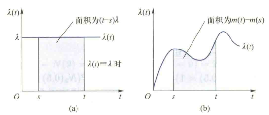
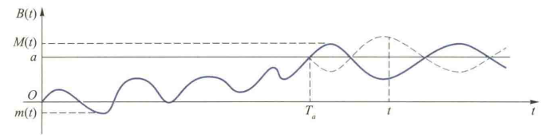
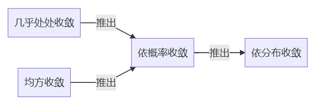

# CH 4 泊松过程与布朗运动

在现实生活中，人们会发现这样的例子：某个时间段热线电话接到的呼叫次数与前个时间段接到的呼叫次数没有关系；这个时间段有多少顾客进商场购物与之前该商场已有多少顾客无关等。如果考虑$(0,t]$时间段内的电话呼叫次数、进商场的顾客数、股价的涨幅等随机过程，那么它们有一个共同的特点：**在互不重叠的时间段上增加的量是相互独立的**，这就是我们下面要介绍的独立增量过程

## 平稳独立增量过程

设 $ \{X(t); t \in T\} $ 为一随机过程。对 $ t > s $，称 $ X(t) - X(s) $ 为此过程在 $ (s, t] $ 上的增量。

- 独立增量过程：若对任意整数 $ n \geq 2 $ 和 $ t₀ < t₁ < \cdots < tₙ $，增量
  $$
  X(t₁) - X(t₀),\ X(t₂) - X(t₁),\ \ldots,\ X(tₙ) - X(t_{n-1})
  $$
  相互独立，则称 $ \{X(t)\} $ 为独立增量过程。

- 平稳增量过程：若对一切 $ s < t $，增量 $ X(t) - X(s) $ 的分布仅依赖于 $ t - s $（即对任何 $ h $，$ X(t + h) - X(s + h) $ 与 $ X(t) - X(s)  $同分布），则称 $ \{X(t)\} $ 有平稳增量。

- 平稳独立增量过程：具有平稳增量的独立增量过程称为平稳独立增量过程。

**独立增量过程的有限维分布性质**

若 $  0 \in T \subseteq [0, \infty)  $，且独立增量过程 $ \{X(t); t \in T\} $ 满足 $  X(0) = 0  $，则其有限维分布由增量 $  X(t) - X(s)  $ 的分布完全确定。证明：
对任意 $  n \geq 1  $ 和 $  t_1 < t_2 < \cdots < t_n  $，$  t_0 = 0  $，构造：增量序列
$$
Y_i = X(t_i) - X(t_{i-1}) \quad (i = 1, 2, \ldots, n)
$$
则

1. $  Y_1, Y_2, \ldots, Y_n  $ **相互独立**

2. $  (Y_1, Y_2, \ldots, Y_n)  $ 的联合分布由其边际分布唯一确定

3. 原过程可表示为累加形式：
   $$
   X(t_i) = \sum_{k=1}^i Y_k \quad (i = 1, 2, \ldots, n)
   $$
   由此可得 $  (X(t_1), X(t_2), \ldots, X(t_n))  $ 的联合分布由 $  (Y_1, Y_2, \ldots, Y_n)  $ 的联合分布唯一确定

- 性质 设 $0 \in T \subseteq [0, \infty)$，$X(0) = 0$，$\{X(t); t \in T\}$ 不但是独立增量过程而且是二阶矩过程，则
  $$
  C_X(s, t) = D_X(\min\{s, t\})
  $$

下面给出一个栗子

设 $  X_1, X_2, \cdots  $ 相互独立，$  S_0 = 0  $。对 $  n \geq 1  $，定义 $  S_n = \sum_{i=1}^{n} X_i  $，则随机过程 $  \{S_n; n = 0, 1, \cdots \}  $ 是独立增量过程。

进一步地，若 $  X_1, X_2, \cdots  $ 独立同分布，则 $  \{S_n\}  $ 是平稳独立增量过程。此时若 $  D(X_1) = \sigma^2  $，则对任意 $  0 \leq m \leq n  $，有

$$
C_S(m, n) = \text{Cov}(S_m, S_n) = D(S_m) = m\sigma^2
$$

## 泊松过程

泊松过程又分成齐次泊松过程和非齐次泊松过程，其中齐次泊松过程有平稳增量，而非齐次泊松过程则不具有平稳增量

### 齐次泊松过程定义

我们先介绍一个计数过程：设 $  N(t)  $ 表示在时间区间 $  (0, t]  $ 内发生的事件数，称随机过程 $  \{N(t); t \geq 0\}  $ 为**计数过程**。$N(t)$的状态空间$I = \{0, 1, 2, \cdots\}$，对任意 $  0 \leq s \leq t  $，有$N(s) \leq N(t)$，且区间 $  (s, t]  $ 内的事件数为$N(t) - N(s)$

> 商场顾客统计：$  N(t)  $ 表示到时刻 $  t  $ 为止进入商场的顾客总数

- 泊松分布：$X\sim P(\lambda):P\{X=k\}=\frac{\lambda^k}{k!}e^{-\lambda},k=0,1,2...$

  > 上述仅针对$t=1$，我们常求$N(t) = k$的概率即为$\frac{(t\lambda)^k}{k!}e^{-(t\lambda)}$

  泊松分布为计数过程，时间间隔为指数分布，比如均值为30mins的指数分布，则其计数过程为1小时2即$\lambda = 2$

- 齐次泊松过程：计数过程$  \{N(t); t \geq 0\}  $若满足以下条件，则为强度为$\lambda$的齐次泊松过程。满足单位时间内平均出现的事件数即强度是常数

  > 强度$\lambda$的含义是单位时间内平均出现的“事件”数

  1. $N(0)  =0$
  2. $  \{N(t); t \geq 0\}  $是独立增量过程
  3. 对任意$t\ge 0$和充分小的$\Delta t > 0$有
     - 稀有性：$P(N(t + \Delta t) - N(t) = 1) = \lambda \Delta t + o(\Delta t)$
     - 相继性：$P(N(t + \Delta t) - N(t) \geq 2) = o(\Delta t)$

  下面我们来详细分析一下稀有性和相继性

  稀有性是指当$\Delta t>0$充分小时，在$(t,t+\Delta t]$内有一个时间发生的概率几乎与时间长度$\Delta t$正比，而且比例系数恒为$\lambda$，与$t$无关——that`s why 齐次，如果比例系数与$t$相关就成了非齐次泊松过程

  对任意 $  t > s \geq 0  $，将 $  (s, t]  $ 进行 $  n  $ 等分，设为 $  s = t_0 < t_1 < \cdots < t_n = t  $。令 $  h = \frac{t-s}{n}  $，则 $  t_i = s + ih  $。而且当 $  n \to \infty  $ 时，
  $$
  n \cdot o(h) = nh \frac{o(h)}{h} = (t-s) \frac{o(h)}{h} \to 0
  $$
  根据相继性，此时

$$
    P\left( \exists \, 0 \leq i \leq n-1 \text{ 使得 } N(t_{i+1}) - N(t_i) \geq 2 \right)\\ \leq \sum_{i=0}^{n-1} P(N(t_{i+1}) - N(t_i) \geq 2) \leq n \cdot o(h) \to 0
$$

因此相继性蕴涵了事件的发生有**先后顺序**，不会有两件或两件以上事件同时发生。进一步地，根据独立增量性，$  N(t_1) - N(t_0), N(t_2) - N(t_1), \cdots, N(t_n) - N(t_{n-1})  $ 相互独立。再结合稀有性，当 $  n  $ 足够大时，

$$
    N(t) - N(s) = \sum_{i=0}^{n-1} \left( N(t_{i+1}) - N(t_i) \right)
$$

近似服从 $  B(n, \lambda h + o(h))  $。令 $  n \to \infty  $，得到 $  N(t) - N(s)  $ 应该服从 $  \pi(\lambda (t-s))  $。经过推导，我们可以将上述齐次泊松过程条件3换为：

对$0\le s< t$，有
$$
  P(N(t) - N(s) = k) = \frac{[\lambda (t-s)]^k e^{-\lambda (t-s)}}{k!}, \quad k = 0, 1, 2, \cdots
$$
即$N(t) - N(s) \sim \pi(\lambda (t-s))$

- 泊松过程的数字特征

  1. 均值函数：$\mu_N(t) = E(N(t)) = \lambda t$
  1. 方差函数：$D_N(t) = \text{Var}(N(t)) = \lambda t$
  1. 协方差函数：$C_N(s, t) = D_N(\min\{s,t\}) = \lambda \min\{s, t\}$
  1. 自相关函数：$R_N(s, t) = E(N(S)N(t)) = \lambda \min\{s, t\} + \lambda^2 st$

- 非齐次泊松过程：单位时间内平均出现的事件数即强度随时间的推移而变化

### 齐次泊松过程的合成与分解

我们先介绍泊松分布的可加性和可分性，它们是泊松过程具有可加性和可分性的重要原因

1. 设随机变量 $  X \sim \pi(\lambda_1), Y \sim \pi(\lambda_2)  $，且 $  X  $ 和 $  Y  $ 相互独立，则 $  X + Y \sim \pi(\lambda_1 + \lambda_2)  $；
2. 设事件发生总数 $  N \sim \pi(\lambda)  $，这 $  N  $ 个事件独立地以概率 $  p  $ 是类型 1，以概率 $  1 - p  $ 是类型 2，令 $  X  $ 和 $  Y  $ 分别表示类型 1 和类型 2 发生的数目，则 $  X \sim \pi(\lambda p), Y \sim \pi(\lambda (1 - p))  $，且 $  X  $ 和 $  Y  $ 相互独立

然后我们来看看泊松过程的可加性和可分性

- 可加性：设 $ \{X(t); t \geq 0\} $ 和 $ \{Y(t); t \geq 0\} $ 是两个相互独立的、分别具有强度 $ \lambda $ 和 $ \mu $ 的泊松过程，$ N(t) = X(t) + Y(t) $，则 $ \{N(t); t \geq 0\} $ 是强度为 $ \lambda + \mu $ 的泊松过程

  证明：首先，$ \{N(t); t \geq 0\} $ 是计数过程，因此只要证明其满足定义的三个条件即可

  (1) $ N(0) = X(0) + Y(0) = 0 $.

  (2) 因为 $ \{X(t)\} $ 和 $ \{Y(t)\} $ 是两个相互独立的独立增量过程，所以 $ N(t) = X(t) + Y(t) $ 也是独立增量过程.

  (3) 对任意 $ t > s $,

$$
   X(t) - X(s) \sim \pi(\lambda (t - s)),
$$

$$
   Y(t) - Y(s) \sim \pi(\mu (t - s)),
$$

  且它们相互独立。由泊松分布可加性知$ N(t) - N(s) \sim \pi((\lambda + \mu)(t - s)) $

- 可分性：设$N(t)(t\ge 0)$表示$(0,t]$内出现的“事件”数，而每次“事件”的发生又分为情形A（概率为$p$）或B（概率为$1-p$），各“事件”属于$A~or~B$相互独立。$X(t)$表示$(0,t]$内出现情形$A$的次数，$Y(t)$表示$(0,t]$内出现情形$B$的次数，那么有

  若 $ \{N(t); t \geq 0\} $ 是强度为 $ \lambda $ 的泊松过程，则 $ \{X(t); t \geq 0\} $ 是强度为 $ \lambda p $ 的泊松过程，$ \{Y(t); t \geq 0\} $ 是强度为 $ \lambda (1 - p) $ 的泊松过程，且过程 $ \{X(t); t \geq 0\} $ 与 $ \{Y(t); t \geq 0\} $ 相互独立

### 时间间隔与等待时间

设 $ \{N(t); t \geq 0\} $ 是强度为 $ \lambda $ 的泊松过程，相应的“事件”出现的随机时刻 $ t_1, t_2, \cdots $ 称为强度为 $ \lambda $ 的泊松流。以 $ W_n $ 表示第 $ n $ 次“事件”发生的时刻，即 $ W_n = t_n $，也称为第 $ n $ 次“事件”发生的等待时间。特别地，$ W_0 = 0 $。下图是泊松过程的一条样本轨道

令 $ T_n $ 表示从第 $ n - 1 $ 次“事件”发生到第 $ n $ 次“事件”发生的时间间隔，也称为点间间距，$ n = 1, 2, \cdots $。图为相应的时间间隔和等待时间示意图，有
$$
W_n = T_1 + T_2 + \cdots + T_n, \quad T_n = W_n - W_{n-1}.
$$

下面我们来讨论$T_n$和$W_n$的分布

- $T_n$分布：$ \{N(t)\} $ 是强度为 $ \lambda $ 的泊松过程当且仅当时间间隔 $ T_1, T_2, \cdots $ 相互独立，且同服从均值为 $ \frac{1}{\lambda} $ 的指数分布。
  $$
  F_{T_{n+1}|T_{n}}(t|s) = P(T_{n+1}\le t| T_{n}=s) = 1- e^{-\lambda t}
  $$

  > 指数分布：
  >
  > - 密度函数：$f(x)=\lambda e^{-\lambda x},x>0,\lambda>0,记为X\sim E(\lambda)$
  >
  > - 分布函数：$F(x)=1-e^{-\lambda x},x>0$
  >
  > - 无记忆性：$P\{X>t_0+t\}=P\{X>t_0\}+P\{X>t\}$
  > - 期望：$\frac{1}{\lambda}$
  > - 方差：$\frac{1}{\lambda^2}$

  因此，要确定一个计数过程是否为泊松过程，只要用统计方法检验点间间距是否相互独立并服从同一个指数分布即可。而指数分布均值的倒数就是泊松过程的强度

- $W_n$分布：$$ W_n \sim \Gamma(n, \lambda) $$

  下面考虑 $ W_n $ 的分布：

  $$
  F_{W_n}(t) = P(W_n \leq t) = P(N(t) \geq n) \\
  = \sum_{k=n}^{\infty} \frac{(\lambda t)^k}{k!} e^{-\lambda t}, \quad t \geq 0,
  $$

  $$
  F_{W_n}(t) = 0, \quad t < 0.
  $$

  因此，$ W_n $ 的密度函数为

  $$
    f_{W_n}(t) \quad= \begin{cases}
    \sum_{k=n}^{\infty} \frac{\lambda (\lambda t)^{k-1}}{(k-1)!} e^{-\lambda t} - \sum_{k=n}^{\infty} \frac{\lambda (\lambda t)^k}{k!} e^{-\lambda t}, & t > 0, \\
    0, & t \leq 0
    \end{cases} \\

     = \begin{cases}
    \frac{\lambda (\lambda t)^{n-1}}{(n-1)!} e^{-\lambda t}, & t > 0, \\
    0, & t \leq 0,
    \end{cases}

  $$

### 非齐次泊松过程

非齐次泊松过程事件发生的速率可能会随着时间推移而改变。下面给出定义

- 计数过程 $ \{N(t); t \geq 0\} $ 称为强度函数为 $ \lambda(t)(t \geq 0) $ 的泊松过程，如果

  (1) $ N(0) = 0 $;

  (2) $ \{N(t); t \geq 0\} $ 是独立增量过程；

  (3) 对 $ t \geq 0 $ 和 $ \Delta t > 0 $，有

$$
   P(N(t + \Delta t) - N(t) = 1) = \lambda(t) \Delta t + o(\Delta t),
$$

$$
   P(N(t + \Delta t) - N(t) \geq 2) = o(\Delta t).
$$

  类似于齐次泊松过程，我们有如下定理：

  计数过程 $ \{N(t); t \geq 0\} $ 是强度函数为 $ \lambda(t)(t \geq 0) $ 的泊松过程，当且仅当

  (1) $ N(0) = 0 $;

  (2) $ \{N(t); t \geq 0\} $ 是独立增量过程；

  (3) 对 $ t > s \geq 0 $，有 $ N(t) - N(s) \sim \pi \left( \int_s^t \lambda(h) \, dh \right) $

  令$m(t) = \int_s^t \lambda(h) \, dh$，则$E(N(t)) = m(t)$，平均强度

  

- 非齐次泊松过程的数字特征

  - 均值函数：$\mu_N(t) = E(N(t)) =\int_{0}^{t} \lambda(u) du$

  - 方差函数：$D_N(t) = \text{Var}(N(t)) =\int_{0}^{t} \lambda(u) du$

  - 协方差函数：$C_N(s, t) = D_N(\min\{s,t\}) = \int_{0} ^{\min\{s, t\}} \lambda(u)du$
    $$
    \begin{align*} \text{Cov}(N(s), N(t)) &= \text{Cov}(N(s), N(s) + [N(t) - N(s)]) \\ &= \text{Var}[N(s)] + \text{Cov}(N(s), N(t) - N(s)) \\ &= \int_0^s \lambda(u) du + 0 \quad (\text{独立增量}) \\ &= \int_0^{\min(s,t)} \lambda(u) du \quad (\text{因 } s = \min(s,t)). \end{align*}
    $$

  - 自相关函数：$R_N(s, t) = E(N(S)N(t)) = \int_{0} ^{\min\{s, t\}} \lambda(u)du + \mu_N(s)\mu_N(t)$

- 类似于齐次泊松过程，我们有非齐次泊松过程的合成和分解定理

  - 可加性：设 $ \{X(t); t \geq 0\} $ 和 $ \{Y(t); t \geq 0\} $ 是两个相互独立的泊松过程，分别具有强度函数 $ \lambda_1(t) $ 和 $ \lambda_2(t) $，则 $ \{X(t) + Y(t); t \geq 0\} $ 是强度函数为 $ \lambda_1(t) + \lambda_2(t) $ 的泊松过程

- 可分性：设 $ \{N(t); t \geq 0\} $ 是强度函数为 $ \lambda(t) $ 的泊松过程。各事件所属类型相互独立，且独立于 $ \{N(t)\} $，在 $ t $ 时刻发生的事件以概率 $ p(t) $ 为类型 1，以概率 $ 1 - p(t) $ 为类型 2. 令 $ N_1(t) $ 和 $ N_2(t) $ 分别表示到 $ t $ 为止类型 1 和类型 2 事件发生的个数，则 $ \{N_1(t); t \geq 0\} $ 和 $ \{N_2(t); t \geq 0\} $ 分别是强度函数为 $ \lambda(t)p(t) $ 和 $ \lambda(t)(1 - p(t)) $ 的泊松过程，且相互独立

  > attention: 非齐次泊松过程的时间间隔不再具有独立性和同分布性

- 下面的定理说明任何泊松过程都可以看成强度为 1 的齐次泊松过程的时间变换

  定理：设 $ \{N(t)\} $ 是强度为 1 的齐次泊松过程，令 $ \lambda(u) $ 是 $ [0, \infty) $ 上非负的、在任何有界区间上可积的函数. 令 $ m(t) = \int_0^t \lambda(u) \, du $ 和 $ X(t) = N(m(t)) $，则 $ \{X(t)\} $ 是强度函数为 $ \lambda(t) $ 的泊松过程

### 复合泊松过程

当事件按照泊松过程发生，各次事件带来的收益独立同分布时，对应的收益过程可以用下面的复合泊松过程来描述.

定义：随机过程 $ \{X(t); t \geq 0\} $ 称为复合泊松过程，如果它可以表示为

$$
 X(t) = \sum_{k=1}^{N(t)} Y_k \quad (\text{约定 } \sum_{k=1}^{0} Y_k = 0),
$$

其中 $ \{N(t); t \geq 0\} $ 是强度为 $ \lambda $ 的齐次泊松过程，$ \{Y_k; k \geq 1\} $ 是独立于 $ \{N(t); t \geq 0\} $ 的一组独立同分布随机变量.

## 布朗运动

### 定义与背景

- 背景

  考虑一直线上的简单对称的随机游动，设质点从原点出发沿数轴运动，每隔 $ \Delta t $ 时间等概率地向左或向右移动距离 $ \Delta x $，且每次移动相互独立，记

$$
   X_i = \begin{cases}
  1, & \text{第 } i \text{ 次质点右移}, \\
  -1, & \text{第 } i \text{ 次质点左移},
  \end{cases} \quad i = 1, 2, \cdots.
$$

  $ X(t) $ 表示 $ t $ 时刻质点的位置，则有

$$
   X(t) = \Delta x (X_1 + X_2 + \cdots + X_{\left[\frac{t}{\Delta t}\right]}),
$$

  其中 $ \left[\frac{t}{\Delta t}\right] $ 表示不超过 $ \frac{t}{\Delta t} $ 的最大整数

  显然，$ E(X_i) = 0, D(X_i) = 1 $，因此，

$$
   E(X(t)) = 0, \quad D(X(t)) = (\Delta x)^2 \left[\frac{t}{\Delta t}\right].
$$

以上的简单随机游动可作为微粒子在 $ x $ 轴上做不规则运动的近似。实际上，粒子的不规则运动是连续进行的，即考虑 $ \Delta t \to 0 $ 的极限情形。由物理实验知，通常当 $ \Delta t \to 0 $ 时，$ \Delta x \to 0 $，且在许多情形下设 $ \Delta x = \sigma \sqrt{\Delta t} $. 此时，当 $ \Delta t \to 0 $ 时，

  (Ⅰ) $ E(X(t)) = 0, D(X(t)) = \sigma^2 t $，且由中心极限定理知，$ X(t) \sim N(0, \sigma^2 t) $;

  (Ⅱ) $ \{X(t); t \geq 0\} $ 有独立增量，这是由于随机游动的质点在不重叠时间区间中的变动是独立的;

  (Ⅲ) $ \{X(t); t \geq 0\} $ 有平稳增量，因为随机游动在任一时间区间中位置变化的分布只依赖于区间长度，即对于 $ 0 \leq s < t $，

$$
  X(t) - X(s) \sim N(0, \sigma^2 (t - s))
$$
$$
\Phi(0.5) = 0.69, \Phi(1) = 0.84, \Phi(2) = 0.98, \Phi(2.5) = 0.99
$$

故引出以下定义：

- 定义：随机过程 $ \{X(t); t \geq 0\} $ 称为布朗运动（Brownian motion）（或称为维纳过程），若该过程满足以下四条：

  1. $ X(0) = 0 $;

  2. $ \{X(t); t \geq 0\} $ 是独立增量过程；

     > Tips: 对$0<s<t$，有$B(s)$与$B(t)$不独立，我们常将$B(t)$转为$B(t)-B(s)$，根据独立增量性，有$B(s)$与$B(t)-B(s)$相互独立

  3. 对于 $ 0 \leq s < t $, $ X(t) - X(s) \sim N(0, \sigma^2 (t - s)) $;

  4. 样本轨道是连续的，下图是布朗运动的一条样本轨道

  

- 标准布朗运动：当 $ \sigma = 1 $ 时，称 $ \{X(t); t \geq 0\} $ 为标准布朗运动。由于对任一布朗运动 $ \{X(t)\} $，$ \left\{\frac{X(t)}{\sigma}; t \geq 0\right\} $ 就是标准布朗运动，故今后如不特别指明，讨论的都是标准布朗运动，并记为 $ \{B(t); t \geq 0\} $

  根据布朗运动的自相似性：$\forall~a>0,\{\frac{1}{a}B(a^2 t);t\ge 0 \}$仍是标准布朗运动。

- 布朗运动的数字特征：设 $ \{B(t); t \geq 0\} $ 是标准布朗运动，则

  1. 均值函数 $ \mu_B(t) = E(B(t)) = 0 $;
  2. 方差函数 $ D_B(t) = E(B^2(t)) = t $;
  3. (自) 协方差函数 $ C_B(s, t) = D_B(\min\{s, t\}) = \min\{s, t\} $;
  4. (自) 相关函数 $ R_B(s, t) = C_B(s, t) = \min\{s, t\} $

- 补充正态分布的密度函数
  $$
  f(x) = \frac{1}{\sigma\sqrt{2\pi }} \exp\left(-\frac{(x-\mu)2}{2\sigma^2}\right)
  $$

### 性质

1. 设 $ \{X(t); t \geq 0\} $ 是一样本轨道连续的随机过程，则 $ \{X(t); t \geq 0\} $ 是标准布朗运动当且仅当它是正态过程且 $ \mu_X(t) = 0, R_X(s, t) = \min\{s, t\} $

   > Tips: 常利用性质1来证明一个随机过程为标准布朗运动

2. 设 $ \{B(t); t \geq 0\} $ 是标准布朗运动

   1. 马尔可夫性：对任何 $ \tau > 0 $，$ \{B(t + \tau) - B(\tau); t \geq 0\} $ 也是标准布朗运动；

   2. 自相似性：对任何常数 $ c \neq 0 $，$ \left\{\frac{1}{c} B(c^2 t); t \geq 0\right\} $ 是标准布朗运动；

   3. 时间上 $ 0 $ 与 $ \infty $ 的对称性：定义
      $$
      \widetilde{B}(t) = \begin{cases}
      t B \left(\frac{1}{t}\right), & t > 0, \\
      0, & t = 0,
      \end{cases}
      $$
      则 $ \{\widetilde{B}(t); t \geq 0\} $ 也是标准布朗运动

      > Tips: 当求条件概率时，我们常根据3.来转换条件

      下面举一个栗子：

      设 $ \{B(t); t \geq 0\} $ 是标准布朗运动。计算：

      (1) $ P(B(0.5) \leq 1 \mid B(1) = 1, B(2) = 2) $;

      解 (1) 利用性质 2 的 (3)，$ \{\widetilde{B}(t)\} $ 也是标准布朗运动。所以，
      $$
      P(B(0.5) \leq 1 \mid B(1) = 1, B(2) = 2)
      $$

      $$
      = P \left( 0.5 \widetilde{B}(2) \leq 1 \mid \widetilde{B}(1) = 1, 2 \widetilde{B} \left(\frac{1}{2}\right) = 2 \right)
      $$

      $$
      = P(\widetilde{B}(2) \leq 2 \mid \widetilde{B}(1) = 1, \widetilde{B}(0.5) = 1)
      $$

      $$
        = P(\widetilde{B}(2) - \widetilde{B}(1) \leq 1 \mid \widetilde{B}(1) = 1, \widetilde{B}(0.5) = 1)
      $$

      $$
      = P(\widetilde{B}(2) - \widetilde{B}(1) \leq 1) = \Phi(1) = 0.8413.
      $$

3. 在许多实际问题中，往往要讨论随机过程在起点和终点状态给定的条件下，中间过程的性质，即考虑 $ \{X(t); t_1 \leq t \leq t_2 \mid X(t_1) = x_1, X(t_2) = x_2\} $ 的性质

   对于布朗运动，若记
   $$
   X(t) = B(t - t_1) + x_1 + \frac{t - t_1}{t_2 - t_1} [x_2 - x_1 - B(t_2 - t_1)]
   $$
   则 $ X(t_1) = x_1, X(t_2) = x_2 $，即随机过程 $ \{X(t); t_1 \leq t \leq t_2\} $ 的任何路径必经过 $ (t_1, x_1), (t_2, x_2) $ 两点，仿佛两端固定的桥梁。

4. 对标准布朗运动 $ \{B(t); t \geq 0\} $，通常称条件随机过程 $ \{B(t); 0 \leq t \leq 1 \mid B(1) = 0\} $ 为布朗桥过程，布朗桥过程是正态过程。

   给一个典型的标准布朗桥过程：$X(t) = B(t) -tB(1)$

   布朗桥过程的数字特征：

   (1) 均值函数：$ E(B(t) \mid B(1) = 0) = 0 $;

   (2) 方差函数：$ D(B(t) \mid B(1) = 0) = t(1 - t) $;

   (3) (自) 协方差函数：对 $ 0 \leq s \leq t \leq 1 $,

$$
   \operatorname{Cov}(B(s), B(t) \mid B(1) = 0) = s(1 - t).
$$

   > Tips：要证明一个过程是布朗桥过程，即需要验证其为正态过程且满足上述均值和协方差的数字特征

### 首中时和最大值的分布

设 $ \{B(t); t \geq 0\} $ 是标准布朗运动，$ a \neq 0 $。令

$$
 T_a = \inf\{t > 0; B(t) = a\},
$$

它表示 $ \{B(t)\} $ 首次击中 $ a $ 的时刻，即 $ a $ 的首中时。注意到

$$
T_a = \inf\{t > 0; B(t) = a\} = \inf\{t > 0; -B(t) = -a\}
$$

根据自相似性，$ \{-B(t)\} $ 也是标准布朗运动，所以 $ T_a $ 与 $ T_{-a} $ 同分布。令

$$
 M(t) = \max_{0 \leq s \leq t} B(s), \quad m(t) = \min_{0 \leq s \leq t} B(s),
$$

它们分别表示 $ \{B(s)\} $ 在 $ [0, t] $ 的最大值和最小值。由于 $ \{-B(s)\} $ 也是标准布朗运动并且

$$
 m(t) = -\max_{0 \leq s \leq t} (-B(s)),
$$

因而 $ m(t) $ 与 $ -M(t) $ 是同分布的。

- 定理：对 $ a > 0 $ 和 $ t > 0 $，有
  $$
  P(M(t) \geq a) = P(T_a \leq t) = 2P(B(t) \geq a) = 2 \left(1 - \Phi \left(\frac{a}{\sqrt{t}}\right)\right).
  $$
  证明：由于布朗运动样本轨道是连续的，因而 $ M(t) \geq a $ 当且仅当 $ T_a \leq t $。这推出 $ P(M(t) \geq a) = P(T_a \leq t) $。由 $ B(t) \geq a $ 推得 $ T_a \leq t $，因此

$$
   P(B(t) \geq a) = P(B(t) \geq a \mid T_a \leq t) P(T_a \leq t).
$$

又由布朗运动的对称性，在 $ \{T_a \leq t\} $（此时 $ B(T_a) = a $）条件下，$ \{B(t) \geq a\} $ 与 $ \{B(t) < a\} $ 是等可能的，即

  

$$
   P(B(t) \geq a \mid T_a \leq t) = P(B(t) < a \mid T_a \leq t) = 0.5,
$$

  所以

$$
  P(T_a \leq t) = 2P(B(t) \geq a) = 2 \left(1 - \Phi \left(\frac{a}{\sqrt{t}}\right)\right)
$$

根据上述定理得到：对 $ a \neq 0 $，有$T_a$的分布函数

$$
F_{T_a}(t) = F_{T_{|a|}}(t) = \begin{cases}
2 \left(1 - \Phi \left(\frac{|a|}{\sqrt{t}}\right)\right), & t > 0, \\
0, & t \leq 0,
\end{cases}
$$

$$
P(T_a < \infty) = \lim_{t \to \infty} P(T_a \leq t) = \lim_{t \to \infty} 2 \left(1 - \Phi \left(\frac{|a|}{\sqrt{t}}\right)\right) = 1.
$$

通过对分布函数 $ F_{T_a}(t) $ 求导得到 $ T_a $ 的概率密度函数为

$$
 f_{T_a}(t) = \begin{cases}
\frac{|a|}{\sqrt{2\pi}} t^{-3/2} \exp \left\{-\frac{a^2}{2t}\right\}, & t > 0, \\
0, & t \leq 0.
\end{cases}
$$

所以

$$
 E(T_a) = \int_0^{\infty} t \frac{|a|}{\sqrt{2\pi}} t^{-3/2} \exp \left\{-\frac{a^2}{2t}\right\} \, dt = \infty.
$$

这说明 $ \{B(t)\} $ 以概率 1 在有限时间内击中状态 $ a $，但平均所需时间却为无穷大。由 $ a $ 的任意性知

$$
P(\max_{ s \ge  0} B(s) = \infty) = P(\min_{s \ge 0} B(s) = -\infty) = 1.
$$

进一步地，注意到布朗运动的样本轨道是连续的，所以它在有界区间 $ [0, t] $ 取有限界，因此对任意 $ t \geq 0 $ 都有
$$
P(\max_{ s \ge  t} B(s) = \infty) = P(\min_{s \ge t} B(s) = -\infty) = 1.
$$

再次利用轨道连续性得到，对任何 $ a $，$ \{B(t)\} $ 以概率 1 在有限时间内击中状态 $ a $ 无穷次。

由定理知，对于 $ a > 0 $，

$$
 P(M(t) \geq a) = 2P(B(t) \geq a) = P(|B(t)| \geq a).
$$

又由于 $ M(t) $ 与 $ |B(t)| $ 都是取值非负的随机变量，所以 $ M(t) $ 与 $ |B(t)| $ 同分布，它们都是连续型的随机变量，具有概率密度函数

$$
f_{M_t}(x) = f_{|B_t|}(x) = \begin{cases}
\sqrt{\frac{2}{\pi t}} e^{-\frac{x^2}{2t}}, & x > 0, \\
0, & x \leq 0.
\end{cases}
$$

### 数字特征求解

下面给出几个例子：

1. 已知 $  B(t)  $ 是标准正态函数，则 $  \sum_{k=1}^{n} B(k)  $ 符合 $  N\left(0, \frac{k(k+1)(2k+1)}{6}\right)  $ 分布，$  X(t) = e^{B(t)}  $ 的均值函数是 $  e^{\frac{t}{2}}  $。

   解析：

   $  \sum_{k=1}^{n} B(k)  $ 符合 $  N\left(0, \frac{k(k+1)(2k+1)}{6}\right)  $ 分布，$  X(t) = e^{B(t)}  $ 的均值函数是 $  e^{\frac{t}{2}}  $

   对数正态分布的均值函数是

   $$
   E[e^X] = e^{\mu + \frac{1}{2}\sigma^2}
   $$
   $\sum_{k=1}^{n}B(k)$符合$N(0,\frac{k(k+1)(2k+1)}{6})$分布，$X(t)=e^{B(t)}$的均值函数是$e^{\frac{t}{2}}$

   ---

   对于布朗运动 $B(t)$，我们知道 $B(k) \sim \mathcal{N}(0, k)$，并且$B(k)$ 与 $B(k-1)$ **不独立**（因为是一个过程）；改写成增量的形式

   $$
   B(k) = \sum_{i=1}^{k} \left[ B(i) - B(i-1) \right], \text{ 其中 } B(i)-B(i-1) \sim \mathcal{N}(0,1), \text{ 相互独立}
   $$

   所以 $\sum_{k=1}^n B(k)$ 是这些正态变量的**线性组合**。我们将其写为：
   $$
   \begin{align*}
   \sum_{k=1}^n B(k) &= \sum_{k=1}^n \sum_{j=1}^k (B(j) - B(j-1)) = \sum_{j=1}^n (n - j + 1)(B(j) - B(j-1))\\
   &= \sum_{j=1}^n (n - j + 1) \cdot \Delta B_j, \quad \Delta B_j := B(j) - B(j-1)
   \end{align*}
   $$

   因为每个 $\Delta B_j \sim \mathcal{N}(0, 1)$ 且独立 ⇒ 此和是**均值为 0 的正态分布**

   方差为：
   $$
   \operatorname{Var} \left( \sum_{j=1}^n (n - j + 1) \cdot \Delta B_j \right) = \sum_{j=1}^n (n - j + 1)^2\\
   = \sum_{k=1}^n k^2 = \frac{n(n+1)(2n+1)}{6}
   $$

# FAQ

- 一个随机过程的n维分布如何求？不好确定？算一/二阶矩？

- 两两不相关与独立

  - 独立：两随机变量 $X$ 和 $Y$ 独立 ⇨ 联合分布等于各自分布的乘积：
    $$
    P(X \leq x, Y \leq y) = P(X \leq x)P(Y \leq y)
    $$
    独立意味着变量间完全无任何关系（包括非线性关系）

  - 两两不相关：两随机变量 $X$ 和 $Y$ 不相关 ⇨ 协方差（或相关系数）为零
    $$
     \text{Cov}(X,Y) = E(XY) - E(X)E(Y) = 0
    $$
    不相关仅表示无线性关系，但可能存在非线性依赖

- 各种收敛（强/弱收敛）：[依分布收敛、依概率收敛、均方收敛、几乎处处收敛](https://blog.csdn.net/KKKKKKOK/article/details/115674372)

  

# References

- [如何证明泊松分布的间隔时间符合指数分布？](https://www.zhihu.com/question/33311259)
