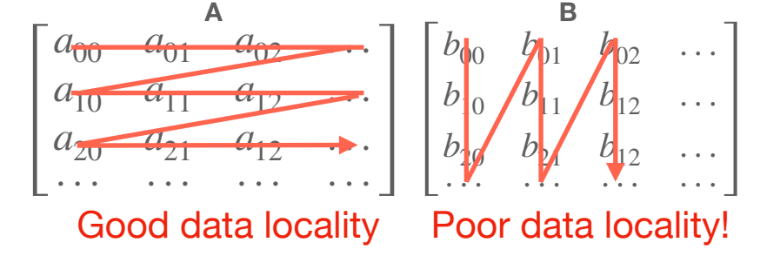

# Parallel Processing

## Loop optimization

Optimize locality and reduce branching overhead.

### Loop reordering

Optimizes locality by reordering the sequence of loops.

Loop reordering—also called **loop interchange**—is a loop transformation that *swaps the nesting order* of two (or more) loops while preserving the program’s semantics. It is one of the most fundamental optimizations in parallel processing.

- Data movement (cache miss) is much more expense.

### Loop tiling

Reduces memory access by partitioning a loop`s iteration space.

**Loop tiling** is a transformation that partitions large iteration spaces into smaller “tiles” (blocks). The goal is to improve **data locality**, reduce **cache misses**, and expose **parallelism**. It is used in CPU multi-core systems, vector processors, GPUs, and distributed-memory models.

- motivation:

  Modern memory hierarchies have several layers:

  - registers
  - L1 cache
  - L2 cache
  - L3 cache
  - DRAM

  Programs must **reuse data while it is still in the faster memory levels**. However, naive loops often exceed cache capacity and cause capacity and conflict misses.

  Loop tiling restructures loops so that each block of data **fits in cache**, maximizing reuse before moving to the next block.

### Loop unrolling

Reduces branching overhead at the expense of its binary size.

## SIMD (single instruction, multiple data) programming

Performs the same operation on multiple data points simultaneously.

## Multithreading

Concurrent execution of multiple threads within a single process.

## CUDA programming

Use GPUs to accelerate computation.

- what: **CUDA (Compute Unified Device Architecture)** is NVIDIA’s parallel computing and programming platform. It enables developers to use NVIDIA GPUs for **general-purpose computing (GPGPU)** instead of only graphics.

  CUDA provides a **software stack** consisting of:

  - **CUDA C/C++**, Python bindings, and other language APIs.
  - **Runtime and driver APIs**.
  - Highly optimized libraries (cuBLAS, cuDNN, NCCL, etc.).

  CUDA exposes the GPU’s **massively parallel hardware** to programmers through a clear execution model.

## References

- [MIT slide](https://www.dropbox.com/scl/fi/z1980bzepegz85ara200n/Lec11-TinyEngine.pdf?rlkey=5evtfesbourbo03nlhazmiy1r&e=1&st=ehihqr5t&dl=0)