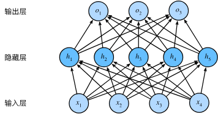
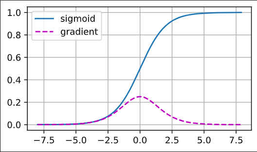
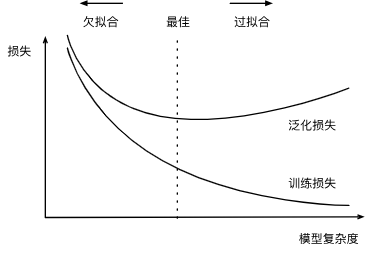

# DL Basics

This note introduces the first truly deep models we use: **multilayer perceptrons (MLPs)**. We also cover the core issues of **underfitting**, **overfitting**, model selection, regularization techniques (weight decay and dropout), numerical stability in parameter initialization, and basic data preprocessing.

<!--more-->

## Multilayer Perceptrons

An MLP stacks multiple fully connected layers. Each hidden unit applies a nonlinear activation to a weighted sum of inputs, giving the network capacity to model complex functions beyond linear decision boundaries.

## Activation Functions

- **ReLU** (rectified linear unit) is popular for its simplicity and ability to reduce vanishing gradients:
  $$
  \operatorname{ReLU}(x) = \max(x, 0).
  $$
  Many variants exist (Leaky ReLU, PReLU, etc.).

- **Sigmoid** squashes inputs from \((-\infty, \infty)\) to \((0, 1)\):
  $$
  \operatorname{sigmoid}(x) = \frac{1}{1 + \exp(-x)}, \qquad
  \frac{d}{dx} \operatorname{sigmoid}(x) = \operatorname{sigmoid}(x)\left(1 - \operatorname{sigmoid}(x)\right).
  $$
  Gradients vanish when the input magnitude is large.
  

- **tanh** maps inputs to \((-1, 1)\):
  $$
  \operatorname{tanh}(x) = \frac{1 - \exp(-2x)}{1 + \exp(-2x)}, \qquad
  \frac{d}{dx} \operatorname{tanh}(x) = 1 - \operatorname{tanh}^2(x).
  $$

## Underfitting and Overfitting

- **Model capacity** depends on parameter count, parameter scale, and training set size. More parameters or large weights increase the risk of overfitting; tiny models may underfit even small datasets.

- **Model selection**: compare candidate models or hyperparameters using a held-out validation set.

- **K-fold cross-validation** (when data is scarce): split training data into \(K\) folds, train on \(K-1\) folds, validate on the remaining fold, and average the \(K\) validation scores.

- **Underfitting**: both training and validation errors are high and close; the model is too simple or under-trained.

- **Overfitting**: training error is much lower than validation error; the model memorizes noise instead of generalizing.

## Improving Generalization

- **Noise injection**: adding small random noise to inputs during training acts like a smoothness-inducing regularizer (a form of Tikhonov regularization).

- **Dropout**: inject multiplicative noise by randomly zeroing activations with probability \(p\) during training. To keep the expected activation unchanged, scale retained activations by \(1/(1-p)\):
  $$
  h' =
  \begin{cases}
  0 & \text{with prob. } p,\\
  \dfrac{h}{1-p} & \text{with prob. } 1-p,
  \end{cases}
  \qquad E[h'] = h.
  $$
  - Applied after activations, often with lower dropout rates near the input layer.
  - Disabled at test time for deterministic predictions (sometimes used at test time to estimate uncertainty via Monte Carlo dropout).

## Norms and Regularization

- **\(L_1\) regularization (lasso)** encourages sparsity by driving many weights to zero, effectively performing feature selection.

- **\(L_2\) regularization (ridge, weight decay)** penalizes large weights to control model complexity:
  $$
  L(\mathbf{w}, b) = \frac{1}{n} \sum_{i=1}^n \frac{1}{2}(\mathbf{w}^\top \mathbf{x}^{(i)} + b - y^{(i)})^2
  + \frac{\lambda}{2}\|\mathbf{w}\|^2,
  $$
  where \(\lambda \ge 0\) trades off data fit vs. weight size. The SGD update with weight decay is
  $$
  \mathbf{w} \leftarrow (1 - \eta \lambda)\mathbf{w}
  - \frac{\eta}{|\mathcal{B}|} \sum_{i \in \mathcal{B}} \mathbf{x}^{(i)} \big(\mathbf{w}^\top \mathbf{x}^{(i)} + b - y^{(i)}\big).
  $$
  Bias terms are sometimes excluded from regularization, especially in output layers.

## Parameter Initialization

Breaking symmetry and keeping activations/gradients well-scaled are critical when stacking layers.

- **Random initialization** with small variance often works for moderate tasks.

- **Xavier/Glorot initialization** keeps forward and backward variances balanced for symmetric activations (sigmoid, tanh). For a layer with \(n_{\text{in}}\) inputs and \(n_{\text{out}}\) outputs, choose variance
  $$
  \sigma^2 = \frac{2}{n_{\text{in}} + n_{\text{out}}},
  $$
  e.g., sample \(w_{ij} \sim \mathcal{N}(0, \sigma^2)\) or uniformly
  $$
  w_{ij} \sim U\!\left(-\sqrt{\frac{6}{n_{\text{in}} + n_{\text{out}}}}, \sqrt{\frac{6}{n_{\text{in}} + n_{\text{out}}}}\right).
  $$
  For ReLU-like activations, **He (Kaiming) initialization** with variance \(2/n_{\text{in}}\) is typically better.

## Data Preprocessing

- **Missing values**: impute with the feature mean (or other statistics) and standardize features to a common scale:
  $$
  x \leftarrow \frac{x - \mu}{\sigma}.
  $$

- **Categorical features**: use one-hot encoding.

## References

- Detailed CNN primer: <https://cs231n.github.io/convolutional-networks/>
