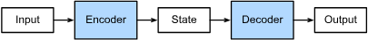

# Main Takeaway

卷积神经网络可以有效地处理空间信息，那么循环神经网络（recurrent neural network，RNN）则可以更好地处理序列信息。

这里我们重点介绍语言模型

<!--more-->

# In a nutshell

- **使命**：建模序列 $P(x_t\mid x_{<t})$，用**隐状态**汇总历史。
- **三件宝**：Embedding（查表学语义） / BPTT（截断+裁剪） / Warm-up（先滚状态再计分）。
- **现代替代**：长依赖 → 门控（LSTM/GRU）、注意力/Transformer。

# Working with Sequences

预测$x_t$：

$$
x_t \sim P(x_t \mid x_{t-1}, \ldots, x_1).
$$

## 统计工具

### 自回归模型

序列模型的估计需要专门的统计工具，现在常用的两个方法：

- 自回归模型：假设在现实情况下相当长的序列$x_{t-1}, \ldots, x_1$可能是不必要的，因此我们只需要满足某个长度为$\tau$的时间跨度，即使用观测序列$x_{t-1}, \ldots, x_{t-\tau}$。当下获得的最直接的好处就是参数的数量总是不变的，至少在$t > \tau$时如此，这就使我们能够训练一个上面提及的深度网络。因为它们是对自己执行回归。

- 隐变量自回归模型：是保留一些对过去观测的总结$h_t$，并且同时更新预测$\hat{x}_t$和总结$h_t$。这就产生了基于$\hat{x}_t = P(x_t \mid h_{t})$估计$x_t$，以及公式$h_t = g(h_{t-1}, x_{t-1})$更新的模型。由于$h_t$从未被观测到，这类模型也被称为隐变量自回归模型（latent autoregressive models）。

  

统计学家称不变的动力学为*静止的*（stationary）。因此，整个序列的估计值都将通过以下的方式获得：

$$
P(x_1, \ldots, x_T) = \prod_{t=1}^T P(x_t \mid x_{t-1}, \ldots, x_1).
$$

### 马尔可夫模型

对于直到时间步$t$的观测序列，其在时间步$t+k$的预测输出是“$k$步预测”。随着我们对预测时间$k$值的增加，会造成误差的快速累积和预测质量的极速下降。

回想一下，在自回归模型的近似法中，我们使用$x_{t-1}, \ldots, x_{t-\tau}$而不是$x_{t-1}, \ldots, x_1$来估计$x_t$。只要这种是近似精确的，我们就说序列满足*马尔可夫条件*（Markov condition）。特别是，如果$\tau = 1$，得到一个*一阶马尔可夫模型*（first-order Markov model），$P(x)$由下式给出：

$$
P(x_1, \ldots, x_T) = \prod_{t=1}^T P(x_t \mid x_{t-1}) \text{ 当 } P(x_1 \mid x_0) = P(x_1).
$$
当假设$x_t$仅是离散值时，这样的模型特别棒，因为在这种情况下，使用动态规划可以沿着马尔可夫链精确地计算结果。例如，我们可以高效地计算$P(x_{t+1} \mid x_{t-1})$：

$$
\begin{aligned}
P(x_{t+1} \mid x_{t-1})
&= \frac{\sum_{x_t} P(x_{t+1}, x_t, x_{t-1})}{P(x_{t-1})}\\
&= \frac{\sum_{x_t} P(x_{t+1} \mid x_t, x_{t-1}) P(x_t, x_{t-1})}{P(x_{t-1})}\\
&= \sum_{x_t} P(x_{t+1} \mid x_t) P(x_t \mid x_{t-1})
\end{aligned}
$$

利用这一事实，我们只需要考虑过去观察中的一个非常短的历史：$P(x_{t+1} \mid x_t, x_{t-1}) = P(x_{t+1} \mid x_t)$。隐马尔可夫模型中的动态规划超出了本节的范围，而动态规划这些计算工具已经在控制算法和强化学习算法广泛使用。

# Converting Raw Text into Sequence Data

text_preprocessing我们将解析文本的常见预处理步骤。

1. 将文本作为字符串加载到内存中。

2. 将字符串拆分为词元（如单词和字符）。

   - 词元是文本的基本单位（类型是字符串）

3. 建立一个词表，将拆分的词元映射到数字索引。

   构建一个字典，通常也叫做*词表*（vocabulary），用来将字符串类型的词元映射到从$0$开始的数字索引中

   1. 先将训练集中的所有文档合并在一起，对它们的唯一词元进行统计，得到的统计结果称之为*语料*（corpus）
   2. 然后根据每个唯一词元的出现频率，为其分配一个数字索引
   3. 很少出现的词元通常被移除，这可以降低复杂性。另外，语料库中不存在或已删除的任何词元都将映射到一个特定的未知词元“&lt;unk&gt;”
   4. 我们可以选择增加一个列表，用于保存那些被保留的词元，例如：填充词元（“&lt;pad&gt;”）；序列开始词元（“&lt;bos&gt;”）；序列结束词元（“&lt;eos&gt;”）。

4. 将文本转换为数字索引序列，方便模型操作。

   最后再转换为独热编码，将每个词元表示为更具表现力的特征向量

# Language Models

在给定这样的文本序列时，*语言模型*（language model）的目标是估计序列的联合概率

$$
P(x_1, x_2, \ldots, x_T).
$$
例如，只需要一次抽取一个词元$x_t \sim P(x_t \mid x_{t-1}, \ldots, x_1)$，一个理想的语言模型就能够基于模型本身生成自然文本。

如果$P(x_{t+1} \mid x_t, \ldots, x_1) = P(x_{t+1} \mid x_t)$，则序列上的分布满足一阶马尔可夫性质。阶数越高，对应的依赖关系就越长。这种性质推导出了许多可以应用于序列建模的近似公式：
$$
\begin{aligned}
P(x_1, x_2, x_3, x_4) &=  P(x_1) P(x_2) P(x_3) P(x_4),\\
P(x_1, x_2, x_3, x_4) &=  P(x_1) P(x_2  \mid  x_1) P(x_3  \mid  x_2) P(x_4  \mid  x_3),\\
P(x_1, x_2, x_3, x_4) &=  P(x_1) P(x_2  \mid  x_1) P(x_3  \mid  x_1, x_2) P(x_4  \mid  x_2, x_3).
\end{aligned}
$$

通常，涉及一个、两个和三个变量的概率公式分别被称为*一元语法*（unigram）、*二元语法*（bigram）和*三元语法*（trigram）模型。

单词的频率满足*齐普夫定律*（Zipf's law），即第$i$个最常用单词的频率$n_i$为：

$$
n_i \propto \frac{1}{i^\alpha},
$$
等价于

$$
\log n_i = -\alpha \log i + c,
$$
其中$\alpha$是刻画分布的指数，$c$是常数。

假设我们将使用神经网络来训练语言模型，模型中的网络一次处理具有预定义长度（例如$n$个时间步）的一个小批量序列。现在的问题是如何[**随机生成一个小批量数据的特征和标签以供读取。**]，以下提供两种策略

- *随机采样*（random sampling）：(**在随机采样中，每个样本都是在原始的长序列上任意捕获的子序列。**)
  在迭代过程中，来自两个相邻的、随机的、小批量中的子序列不一定在原始序列上相邻。对于语言建模，目标是基于到目前为止我们看到的词元来预测下一个词元，因此**标签是移位了一个词元的原始序列**。
- *顺序分区*（sequential partitioning）：我们还可以[**保证两个相邻的小批量中的子序列在原始序列上也是相邻的**]。这种策略在基于小批量的迭代过程中保留了拆分的子序列的顺序，因此称为顺序分区。

# Recurrent Neural Networks

为了运用到时间维度上信息，人们设计了**递归神经网络** (RNN, Recurssion Neural Network)

- 隐状态：

  我们介绍了 $  n  $ 元语法模型，其中单词 $  x_t  $ 在时间步 $  t  $ 的条件概率仅取决于前面 $  n-1  $ 个单词。对于时间步 $  t-(n-1)  $ 之前的单词，如果我们想将其可能产生的影响合并到 $  x_t  $ 上，需要增加 $  n  $，然而模型参数的数量y使用隐变量模型：

  $$
  P(x_t \mid x_{t-1}, \ldots, x_1) \approx P(x_t \mid h_{t-1}),
  $$
  其中 $  h_{t-1}  $ 是隐状态（hidden state），也称为隐藏变量（hidden variable），它存储了到时间步 $  t-1  $ 的序列信息。通常，我们可以基于当前输入 $  x_t  $ 和先前隐状态 $  h_{t-1}  $ 来计算时间步 $  t  $ 处的任何时间的隐状态：$$h_t = f(x_t, h_{t-1}).$$

- 有隐状态的RNN：

  具体地说，当前时间步隐藏变量由当前时间步的输入与前一个时间步的隐藏变量一起计算得出：
  $$
  \mathbf{H}_t = \phi(\mathbf{X}_t \mathbf{W}_{xh} + \mathbf{H}_{t-1} \mathbf{W}_{hh} + \mathbf{b}_h).
  $$
  > 计算$H_t$的层称为循环层，RNN的参数开销不会随着时间步的增加而增加

  对于时间步 $  t  $，输出层的输出类似于多层感知机中的计算：

  $$
  \mathbf{O}_t = \mathbf{H}_t \mathbf{W}_{hq} + \mathbf{b}_q.
  $$

使用过tanh函数作为激活函数：因为当元素在实数上满足均匀分布时，tanh函数的平均值为0

## 困惑度（Perplexity）

- 衡量一个语言模型的好坏可以用平均交叉熵

  > 语言模型可以看成一个分类模型（把下一个词看成一个类别），当然可以用交叉熵来衡量
  >
  > 语言模型预测n个词，那当然取平均来看

  $$
  \pi = \frac{1}{n} \sum_{i=1}^{n} -\log p(x_t \mid x_{t-1}, \ldots)
  $$

  $  p  $ 是语言模型的预测概率，$  x_t  $ 是真实词

- 历史原因 NLP 使用困惑度 $  \exp(\pi)  $ 来衡量，是平均每次可能选项

  - 1 表示完美，无穷大是最差情况

## 梯度剪裁

- why：迭代中计算这 $  T  $ 个时间步上的梯度，在反向传播过程中产生长度为 $  O(T)  $ 的矩阵乘法链，导致数值不稳定（梯度爆炸or梯度消失）

一般来说，当解决优化问题时，我们对模型参数采用更新步骤。假定在向量形式的$\mathbf{x}$中，或者在小批量数据的负梯度$\mathbf{g}$方向上。例如，使用$\eta > 0$作为学习率时，在一次迭代中，我们将$\mathbf{x}$更新为$\mathbf{x} - \eta \mathbf{g}$。如果我们进一步假设目标函数$f$表现良好，即函数$f$在常数$L$下是*利普希茨连续的*（Lipschitz continuous）。也就是说，对于任意$\mathbf{x}$和$\mathbf{y}$我们有：

$$
|f(\mathbf{x}) - f(\mathbf{y})| \leq L \|\mathbf{x} - \mathbf{y}\|.
$$
在这种情况下，我们可以安全地假设：如果我们通过$\eta \mathbf{g}$更新参数向量，则
$$
|f(\mathbf{x}) - f(\mathbf{x} - \eta\mathbf{g})| \leq L \eta\|\mathbf{g}\|,
$$
这意味着我们不会观察到超过$L \eta \|\mathbf{g}\|$的变化。这既是坏事也是好事。坏的方面，它限制了取得进展的速度；好的方面，它限制了事情变糟的程度，尤其当我们朝着错误的方向前进时。有时梯度可能很大，从而优化算法可能无法收敛。我们可以通过降低$\eta$的学习率来解决这个问题。但是如果我们很少得到大的梯度呢？在这种情况下，这种做法似乎毫无道理。一个流行的替代方案是通过将梯度$\mathbf{g}$投影回给定半径（例如$\theta$）的球来裁剪梯度$\mathbf{g}$。如下式：

$$
\mathbf{g} \leftarrow \min\left(1, \frac{\theta}{\|\mathbf{g}\|}\right) \mathbf{g}.
$$
通过这样做，我们知道梯度范数永远不会超过$\theta$，并且更新后的梯度完全与$\mathbf{g}$的原始方向对齐。它还有一个值得拥有的副作用，即限制任何给定的小批量数据（以及其中任何给定的样本）对参数向量的影响，这赋予了模型一定程度的稳定性。
梯度裁剪提供了一个快速修复梯度爆炸的方法，虽然它并不能完全解决问题，但它是众多有效的技术之一。

- 梯度裁剪能有效预防梯度爆炸（不能应对梯度消失），如果梯度长度超过 $  \theta  $，那么拖影回长度 $  \theta  $

$$
\mathbf{g} \leftarrow \min \left( 1, \frac{\theta}{\|\mathbf{g}\|} \right) \mathbf{g}
$$

## 预测

- 预热期：

  - what：在训练或推断一段序列时，RNN 的隐状态通常从一个“欠信息”的初始值开始（全零、可学习向量或上一次批次的残留）。**预热期**指在序列的**前 k 个时间步只前向传播、更新隐状态，但不把它们计入损失/评价**；从第 k+1k{+}1k+1 步开始才计算 loss 或做评估/生成。
    直觉：先让隐藏状态“进入状态”，再开始真正打分或学习。

  - why

    **减轻初始隐状态偏差**：从全零开始时，前几步的预测往往差；丢弃它们可减少噪声和梯度偏差。

    **更稳定的梯度**：避免把“冷启动”误差传回去影响参数更新。

    **贴近真实使用**：很多推断要用“前文”来把状态带入（如语言模型用一个前缀、时序预测用最近一段历史）。

  - how

    - **语言模型**：用一个前缀（prefix）把隐状态预热后再开始计算下一个词/字的损失或进行采样。
    - **时序预测**（如电力负荷、传感器、金融）：用历史窗口先暖机，再对未来区间计 loss。
    - **截断 BPTT**：长序列被切成小块时，常在每块的开头留若干步 warm-up，只前向不计损失，随后几步才计损失并反传。

## 缺点

- 长期依赖问题：递归神经网络只能处理我们需要较接近的上下文的情况：
- 梯度消失问题：神经网络的权重/偏置梯度极小，导致神经网络参数调整速率急剧下降
- 梯度爆炸问题：神经网络的权重/偏置梯度极大，导致神经网络参数调整幅度过大，矫枉过正
- 可以处理序列数据，同时对序列也很敏感

# Backpropagation Through Time

到目前为止，我们已经反复提到像*梯度爆炸*或*梯度消失*，以及需要对循环神经网络*分离梯度*。这里我们将更深入地探讨序列模型反向传播的细节，以及相关的数学原理。我们将回顾序列模型梯度的计算方式，它的工作原理没有什么新概念，毕竟我们使用的仍然是链式法则来计算梯度。

- *通过时间反向传播*（backpropagation through time，BPTT） :cite:`Werbos.1990`实际上是循环神经网络中反向传播技术的一个特定应用。它要求我们将循环神经网络的计算图一次展开一个时间步，以获得模型变量和参数之间的依赖关系。
- 然后，基于链式法则，应用反向传播来计算和存储梯度。

由于序列可能相当长，因此依赖关系也可能相当长。例如，某个1000个字符的序列，其第一个词元可能会对最后位置的词元产生重大影响。这在计算上是不可行的（它需要的时间和内存都太多了），并且还需要超过1000个矩阵的乘积才能得到非常难以捉摸的梯度。这个过程充满了计算与统计的不确定性。在下文中，我们将阐明会发生什么以及如何在实践中解决它们。

## 循环神经网络的梯度分析

:label:`subsec_bptt_analysis`

在这个简化模型中，我们将时间步$t$的隐状态表示为$h_t$，输入表示为$x_t$，输出表示为$o_t$。输入和隐状态可以拼接后与隐藏层中的一个权重变量相乘。因此，我们分别使用$w_h$和$w_o$来表示隐藏层和输出层的权重。每个时间步的隐状态和输出可以写为：

$$
\begin{aligned}h_t &= f(x_t, h_{t-1}, w_h),\\o_t &= g(h_t, w_o),\end{aligned}
$$
其中$f$和$g$分别是隐藏层和输出层的变换。因此，我们有一个链$\{\ldots, (x_{t-1}, h_{t-1}, o_{t-1}), (x_{t}, h_{t}, o_t), \ldots\}$，它们通过循环计算彼此依赖。前向传播相当简单，一次一个时间步的遍历三元组$(x_t, h_t, o_t)$，然后通过一个目标函数在所有$T$个时间步内评估输出$o_t$和对应的标签$y_t$之间的差异：

$$
L(x_1, \ldots, x_T, y_1, \ldots, y_T, w_h, w_o) = \frac{1}{T}\sum_{t=1}^T l(y_t, o_t).
$$
对于反向传播，问题则有点棘手，特别是当我们计算目标函数$L$关于参数$w_h$的梯度时。具体来说，按照链式法则：

$$
\begin{aligned}\frac{\partial L}{\partial w_h}  & = \frac{1}{T}\sum_{t=1}^T \frac{\partial l(y_t, o_t)}{\partial w_h}  \\& = \frac{1}{T}\sum_{t=1}^T \frac{\partial l(y_t, o_t)}{\partial o_t} \frac{\partial g(h_t, w_o)}{\partial h_t}  \frac{\partial h_t}{\partial w_h}.\end{aligned}
$$
其中乘积的第一项和第二项很容易计算，而第三项$\partial h_t/\partial w_h$是使事情变得棘手的地方，因为我们需要循环地计算参数$w_h$对$h_t$的影响。根据 :eqref:`eq_bptt_ht_ot`中的递归计算，$h_t$既依赖于$h_{t-1}$又依赖于$w_h$，其中$h_{t-1}$的计算也依赖于$w_h$。因此，使用链式法则产生：

$$
\frac{\partial h_t}{\partial w_h}= \frac{\partial f(x_{t},h_{t-1},w_h)}{\partial w_h} +\frac{\partial f(x_{t},h_{t-1},w_h)}{\partial h_{t-1}} \frac{\partial h_{t-1}}{\partial w_h}.
$$
为了导出上述梯度，假设我们有三个序列$\{a_{t}\},\{b_{t}\},\{c_{t}\}$，当$t=1,2,\ldots$时，序列满足$a_{0}=0$且$a_{t}=b_{t}+c_{t}a_{t-1}$。对于$t\geq 1$，就很容易得出：

$$
a_{t}=b_{t}+\sum_{i=1}^{t-1}\left(\prod_{j=i+1}^{t}c_{j}\right)b_{i}.
$$
基于下列公式替换$a_t$、$b_t$和$c_t$：

$$
\begin{aligned}a_t &= \frac{\partial h_t}{\partial w_h},\\
b_t &= \frac{\partial f(x_{t},h_{t-1},w_h)}{\partial w_h}, \\
c_t &= \frac{\partial f(x_{t},h_{t-1},w_h)}{\partial h_{t-1}},\end{aligned}
$$
公式 :eqref:`eq_bptt_partial_ht_wh_recur`中的梯度计算满足$a_{t}=b_{t}+c_{t}a_{t-1}$。因此，对于每个 :eqref:`eq_bptt_at`，我们可以使用下面的公式移除:eqref:`eq_bptt_partial_ht_wh_recur`中的循环计算

$$
\frac{\partial h_t}{\partial w_h}=\frac{\partial f(x_{t},h_{t-1},w_h)}{\partial w_h}+\sum_{i=1}^{t-1}\left(\prod_{j=i+1}^{t} \frac{\partial f(x_{j},h_{j-1},w_h)}{\partial h_{j-1}} \right) \frac{\partial f(x_{i},h_{i-1},w_h)}{\partial w_h}.
$$
 :eqref:`eq_bptt_partial_ht_wh_gen`

虽然我们可以使用链式法则递归地计算$\partial h_t/\partial w_h$，但当$t$很大时这个链就会变得很长。我们需要想想办法来处理这一问题.

### 完全计算 ###

显然，我们可以仅仅计算 :eqref:`eq_bptt_partial_ht_wh_gen`中的全部总和，然而，这样的计算非常缓慢，并且可能会发生梯度爆炸，因为初始条件的微小变化就可能会对结果产生巨大的影响。也就是说，我们可以观察到类似于蝴蝶效应的现象，即初始条件的很小变化就会导致结果发生不成比例的变化。这对于我们想要估计的模型而言是非常不可取的。毕竟，我们正在寻找的是能够很好地泛化高稳定性模型的估计器。因此，在实践中，这种方法**几乎从未使用过**。

### 截断时间步 ###

或者，我们可以在$\tau$步后截断 :eqref:`eq_bptt_partial_ht_wh_gen`中的求和计算。
这是我们到目前为止一直在讨论的内容，例如在 :numref:`sec_rnn_scratch`中分离梯度时。这会带来真实梯度的*近似*，只需将求和终止为$\partial h_{t-\tau}/\partial w_h$。在实践中，这种方式工作得很好。它通常被称为截断的通过时间反向传播 :cite:`Jaeger.2002`。这样做导致该模型**主要侧重于短期影响，而不是长期影响。这在现实中是可取的，因为它会将估计值偏向更简单和更稳定的模型。**

### 随机截断 ###

最后，我们可以用一个随机变量替换$\partial h_t/\partial w_h$，该随机变量在预期中是正确的，但是会截断序列。这个随机变量是通过使用序列$\xi_t$来实现的，序列预定义了$0 \leq \pi_t \leq 1$，
其中$P(\xi_t = 0) = 1-\pi_t$且$P(\xi_t = \pi_t^{-1}) = \pi_t$，因此$E[\xi_t] = 1$。我们使用它来替换 :eqref:`eq_bptt_partial_ht_wh_recur`中的梯度$\partial h_t/\partial w_h$得到：
$$
z_t= \frac{\partial f(x_{t},h_{t-1},w_h)}{\partial w_h} +\xi_t \frac{\partial f(x_{t},h_{t-1},w_h)}{\partial h_{t-1}} \frac{\partial h_{t-1}}{\partial w_h}.
$$
从$\xi_t$的定义中推导出来$E[z_t] = \partial h_t/\partial w_h$。每当$\xi_t = 0$时，递归计算终止在这个$t$时间步。这导致了不同长度序列的加权和，其中长序列出现的很少，所以将适当地加大权重。这个想法是由塔莱克和奥利维尔 :cite:`Tallec.Ollivier.2017`提出的。

### 比较策略

当基于循环神经网络使用通过时间反向传播分析《时间机器》书中前几个字符的三种策略：

- 第一行采用随机截断，方法是将文本划分为不同长度的片断；
- 第二行采用常规截断，方法是将文本分解为相同长度的子序列。
  这也是我们在循环神经网络实验中一直在做的；
- 第三行采用通过时间的完全反向传播，结果是产生了在计算上不可行的表达式。

遗憾的是，虽然随机截断在理论上具有吸引力，但很可能是由于多种因素在实践中并不比常规截断更好。

- 首先，在对过去若干个时间步经过反向传播后，观测结果足以捕获实际的依赖关系。

- 其次，增加的方差抵消了时间步数越多梯度越精确的事实。

- 第三，我们真正想要的是只有短范围交互的模型。

  因此，模型需要的正是截断的通过时间反向传播方法所具备的轻度正则化效果。

# RNN-Modern

例如，循环神经网络在实践中一个常见问题是数值不稳定性。尽管我们已经应用了梯度裁剪等技巧来缓解这个问题，但是仍需要通过设计更复杂的序列模型来进一步处理它。具体来说，我们将引入两个广泛使用的网络，即*门控循环单元*（gated recurrent units，GRU）和*长短期记忆网络*（long short-term memory，LSTM）。然后，我们将基于一个单向隐藏层来扩展循环神经网络架构。我们将描述具有多个隐藏层的深层架构，并讨论基于前向和后向循环计算的双向设计。现代循环网络经常采用这种扩展。在解释这些循环神经网络的变体时，我们将继续考虑 :numref:`chap_rnn`中的语言建模问题。

事实上，语言建模只揭示了序列学习能力的冰山一角。在各种序列学习问题中，如自动语音识别、文本到语音转换和机器翻译，输入和输出都是任意长度的序列。为了阐述如何拟合这种类型的数据，我们将以机器翻译为例介绍基于循环神经网络的“编码器－解码器”架构和束搜索，并用它们来生成序列。

- [GRU](./DL4-RNN_GRU.md)

- [LSTM](./DL4-RNN_LSTM.md)

然而，由于序列的长距离依赖性，训练长短期记忆网络和其他序列模型（例如门控循环单元）的成本是相当高的。在后面的内容中，我们将讲述更高级的替代模型，如Transformer。

- [deep_rnn](./DL4-RNN_deep_rnn.md)
- [bi-rnn](./DL4-RNN_bi_rnn.md)

# Machine Translation

## Dataset

我们关注点是神经网络机器翻译方法，强调的是端到端的学习。与单一语言的语言模型问题存在不同，机器翻译的数据集是**由源语言和目标语言的文本序列对**组成的。因此，我们需要一种完全不同的方法来预处理机器翻译数据集，而不是复用语言模型的预处理程序。

数据处理见d2l

## The Encoder–Decoder Architecture

机器翻译是序列转换模型的一个核心问题，其输入和输出都是**长度可变**的序列。为了处理这种类型的输入和输出，我们可以设计一个包含两个主要组件的架构：

> 把输入序列先**读懂**（编码成“摘要”），再根据这个摘要**逐步说出来**（解码成目标序列）

- 第一个组件是一个*编码器*（encoder）：它接受一个长度可变的序列作为输入，并将其转换为具有固定形状的编码状态。

  - 从技术上讲，编码器将长度可变的输入序列转换成形状固定的上下文变量$\mathbf{c}$，并且将输入序列的信息在该上下文变量中进行编码。

  - 可以使用循环神经网络来设计编码器。考虑由一个序列组成的样本（批量大小是$1$）。假设输入序列是$x_1, \ldots, x_T$，其中$x_t$是输入文本序列中的第$t$个词元。在时间步$t$，循环神经网络将词元$x_t$的输入特征向量$\mathbf{x}_t$和$\mathbf{h} _{t-1}$（即上一时间步的隐状态）转换为$\mathbf{h}_t$（即当前步的隐状态）。使用一个函数$f$来描述循环神经网络的循环层所做的变换：
    $$
    \mathbf{h}_t = f(\mathbf{x}_t, \mathbf{h}_{t-1}).
    $$
    总之，编码器通过选定的函数$q$，将所有时间步的隐状态转换为上下文变量(装下读懂的摘要)：

    $$
    \mathbf{c} =  q(\mathbf{h}_1, \ldots, \mathbf{h}_T).
    $$

    > 比如，当选择$q(\mathbf{h}_1, \ldots, \mathbf{h}_T) = \mathbf{h}_T$时，上下文变量仅仅是输入序列在最后时间步的隐状态$\mathbf{h}_T$。

- 第二个组件是*解码器*（decoder）：它将固定形状的编码状态映射到长度可变的序列。

  - 编码器输出的上下文变量$\mathbf{c}$对整个输入序列$x_1, \ldots, x_T$进行编码。
  - 来自训练数据集的输出序列$y_1, y_2, \ldots, y_{T'}$，对于每个时间步$t'$（与输入序列或编码器的时间步$t$不同），解码器输出$y_{t'}$的概率取决于先前的输出子序列$y_1, \ldots, y_{t'-1}$和上下文变量$\mathbf{c}$，即$P(y_{t'} \mid y_1, \ldots, y_{t'-1}, \mathbf{c})$。

  - 为了在序列上模型化这种条件概率，我们可以使用另一个循环神经网络作为解码器。
    $$
    每一步：(y_{t-1},s_{t-1})\rightarrow s_t \rightarrow 分布p(y_t|...)
    $$
    在输出序列上的任意时间步$t^\prime$，循环神经网络将来自上一时间步的输出$y_{t^\prime-1}$和上下文变量$\mathbf{c}$作为其输入，然后在当前时间步将它们和上一隐状态$\mathbf{s}_{t^\prime-1}$转换为隐状态$\mathbf{s}_{t^\prime}$。因此，可以使用函数$g$来表示解码器的隐藏层的变换：
    $$
    \mathbf{s}_{t^\prime} = g(y_{t^\prime-1}, \mathbf{c}, \mathbf{s}_{t^\prime-1}).
    $$
    在获得解码器的隐状态之后，我们可以使用输出层和softmax操作来计算在时间步$t^\prime$时输出$y_{t^\prime}$的条件概率分布$P(y_{t^\prime} \mid y_1, \ldots, y_{t^\prime-1}, \mathbf{c})$。

  - 当实现解码器时，我们直接使用编码器最后一个时间步的隐状态来初始化解码器的隐状态。

    > 这就要求使用循环神经网络实现的编码器和解码器具有相同数量的层和隐藏单元。

  - 为了进一步包含经过编码的输入序列的信息，上下文变量在所有的时间步与解码器的输入进行拼接（concatenate）。为了预测输出词元的概率分布，在循环神经网络解码器的**最后一层使用全连接层来变换隐状态**。

这被称为*编码器-解码器*（encoder-decoder）架构，

“编码器－解码器”体系架构中的术语*状态*会启发人们使用具有状态的神经网络来实现该架构。在下一节中，我们将学习如何应用循环神经网络，来设计基于“编码器－解码器”架构的序列转换模型。

## seq2seq

特定的“&lt;eos&gt;”表示序列结束词元。一旦输出序列生成此词元，模型就会停止预测。在循环神经网络解码器的初始化时间步，有两个特定的设计决定：

- 首先，特定的“&lt;bos&gt;”表示序列开始词元，它是解码器的输入序列的第一个词元。
- 其次，使用循环神经网络编码器最终的隐状态来初始化解码器的隐状态。

# Beam Search

定义搜索问题。在任意时间步$t'$，解码器输出$y_{t'}$的概率取决于时间步$t'$之前的输出子序列$y_1, \ldots, y_{t'-1}$和对输入序列的信息进行编码得到的上下文变量$\mathbf{c}$。

我们还将输出序列的最大词元数指定为$T'$。因此，我们的目标是从所有$\mathcal{O}(\left|\mathcal{Y}\right|^{T'})$个可能的输出序列中寻找理想的输出。当然，对于所有输出序列，在“&lt;eos&gt;”之后的部分（非本句）将在实际输出中丢弃。

- 贪心搜索：每一步都取概率最高的词元。常无法获得最优序列

- 穷举搜索：太多，算不了

- 束搜索：*束搜索*（beam search）是贪心搜索的一个改进版本。它有一个超参数，名为*束宽*（beam size）$k$。在时间步$1$，我们选择具有最高条件概率的$k$个词元。这$k$个词元将分别是$k$个候选输出序列的第一个词元。在随后的每个时间步，基于上一时间步的$k$个候选输出序列，我们将继续从$k\left|\mathcal{Y}\right|$个可能的选择中挑出具有最高条件概率的$k$个候选输出序列。

  

# References

- [(39 封私信 / 80 条消息) 史上最详细循环神经网络讲解（RNN/LSTM/GRU）](https://zhuanlan.zhihu.com/p/123211148)
- [8.1. 序列模型 — 动手学深度学习 2.0.0 documentation](https://zh-v2.d2l.ai/chapter_recurrent-neural-networks/sequence.html)
- [(39 封私信 / 80 条消息) 从反向传播推导到梯度消失and爆炸的原因及解决方案（从DNN到RNN，内附详细反向传播公式推导） - 知乎](https://zhuanlan.zhihu.com/p/76772734)
