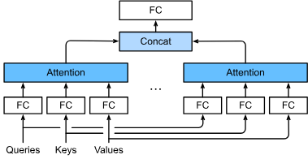

# Main Takeaway

Attention Mechanisms and Transformers

<!--more-->

首先回顾一个经典注意力框架，解释如何在视觉场景中展开注意力。受此框架中的**注意力提示**（attention cues）的启发，我们将设计能够利用这些注意力提示的模型。1964年的Nadaraya-Waston核回归（kernel regression）正是具有**注意力机制**（attention mechanism）的机器学习的简单演示。

然后继续介绍的是注意力函数，它们在深度学习的注意力模型设计中被广泛使用。具体来说，我们将展示如何使用这些函数来设计**Bahdanau注意力**。Bahdanau注意力是深度学习中的具有突破性价值的注意力模型，它双向对齐并且可以微分。

最后将描述仅仅基于注意力机制的**Transformer**架构，该架构中使用了**多头注意力**（multi-head attention）和**自注意力**（self-attention）。自2017年横空出世，Transformer一直都普遍存在于现代的深度学习应用中，


# Attention Cues

人类的注意力方式：

- 自主性注意力
- 非自主性注意力：主观意愿推动

下面来看看如何通过这两种注意力提示，用神经网络来设计注意力机制的框架

- 考虑一个相对简单的状况，即只使用非自主性提示。要想将选择偏向于感官输入，则可以简单地使用参数化的全连接层，甚至是非参数化的最大汇聚层或平均汇聚层。

  > “是否包含自主性提示”将注意力机制与全连接层或汇聚层区别开来。

- 在注意力机制的背景下，自主性提示被称为**查询**（query）。给定任何查询，注意力机制通过**注意力汇聚**（attention pooling）将选择引导至**感官输入**（sensory inputs，例如中间特征表示）。在注意力机制中，这些感官输入被称为**值**（value）。更通俗的解释，每个值都与一个**键**（key）配对，这可以想象为感官输入的非自主提示。


可以通过设计注意力汇聚的方式，便于给定的查询（自主性提示）与键（非自主性提示）进行匹配（得到注意力权重），这将引导得出最匹配的值（感官输入）


# Attention Pooling

- what: 给定一组向量 x1,…,xnx_1,\dots,x_nx1,…,xn（比如序列中的 token 表示、图的邻居节点、CNN 的空间/通道特征），Attention Pooling 通过**可学习的注意力权重**把它们**加权汇聚**成一个摘要向量

我们可以从Nadaraya-Watson核回归中得到启示，得到一个更加通用的attention pooling公式：
$$
f(x) = \sum_{i=1}^n \alpha(x, x_i) y_i
$$
其中$x$是查询，$(x_i, y_i)$是键值对。注意力汇聚是$y_i$的加权平均。将查询$x$和键$x_i$之间的关系建模为**注意力权重**（attention weight）$\alpha(x, x_i)$，这个权重将被分配给每一个对应值$y_i$。对于任何查询，模型在所有键值对注意力权重都是一个有效的概率分布：它们是非负的，并且总和为1。

- 注意力汇聚可以分为非参数型和带参数型。


## 批量矩阵乘法

批量矩阵乘法（batched matmul）

- what：一次性对**一批**矩阵对进行乘法：给定$A^{(b)} \in \mathbb{R}^{n \times m}$,$B^{(b)} \in \mathbb{R}^{m \times p}$对批索引 $b=1 \ldots B$，输出$C^{(b)} = A^{(b)}B^{(b)} \in \mathbb{R}^{n \times p}$，堆叠得到 $C \in \mathbb{R}^{B \times n \times p}$

  标准：`A: [B, n, m]` × `B: [B, m, p]` → `C: [B, n, p]`

- how：

  - **`torch.bmm(A, B)`**  
    - 仅 3D：`[B, n, m] @ [B, m, p] -> [B, n, p]`
  - **`torch.matmul(A, B)` 或 `A @ B`**  
    - 支持更高维与**广播**：`[..., n, m] @ [..., m, p] -> [..., n, p]`
  - **`torch.einsum('... n m, ... m p -> ... n p', A, B)`**  
    - 显式指定维度关系，最直观
  - **`torch.baddbmm(C, A, B, beta=1, alpha=1)`**  
    - 计算 `C = beta*C + alpha*(A @ B)`，融合加法更高效

# Attention Scoring Functions

- what: Attention Scoring Functions 打分函数$s(q,k_i)$度量二者相关性

`sec_nadaraya-watson`使用了高斯核来对查询和键之间的关系建模。:eqref:`eq_nadaraya-watson-gaussian`中的高斯核指数部分可以视为**注意力评分函数**（attention scoring function），简称**评分函数**（scoring function），然后把这个函数的输出结果输入到softmax函数中进行运算。通过上述步骤，将得到与键对应的值的概率分布（即注意力权重）。最后，注意力汇聚的输出就是基于这些注意力权重的值的加权和。

由于注意力权重是概率分布，因此加权和其本质上是加权平均值。


用数学语言描述，假设有一个查询$\mathbf{q} \in \mathbb{R}^q$和$m$个“键－值”对$(\mathbf{k}_1, \mathbf{v}_1), \ldots, (\mathbf{k}_m, \mathbf{v}_m)$，其中$\mathbf{k}_i \in \mathbb{R}^k$，$\mathbf{v}_i \in \mathbb{R}^v$。注意力汇聚函数$f$就被表示成值的加权和：
$$
f(\mathbf{q}, (\mathbf{k}_1, \mathbf{v}_1), \ldots, (\mathbf{k}_m, \mathbf{v}_m)) = \sum_{i=1}^m \alpha(\mathbf{q}, \mathbf{k}_i) \mathbf{v}_i \in \mathbb{R}^v,
$$
其中查询$\mathbf{q}$和键$\mathbf{k}_i$的注意力权重（标量）是通过注意力评分函数$a$将两个向量映射成标量，再经过softmax运算得到的：
$$
\alpha(\mathbf{q}, \mathbf{k}_i) = \mathrm{softmax}(a(\mathbf{q}, \mathbf{k}_i)) = \frac{\exp(a(\mathbf{q}, \mathbf{k}_i))}{\sum_{j=1}^m \exp(a(\mathbf{q}, \mathbf{k}_j))} \in \mathbb{R}.
$$
下面介绍两种不同的注意力评分函数

> 这里提出mask softmax，即过滤一些没有意义的词元，将任何超出有效长度的位置都掩蔽置0

- 加性注意力

  一般来说，当查询和键是不同长度的矢量时，可以使用加性注意力作为评分函数。给定查询$\mathbf{q} \in \mathbb{R}^q$和键$\mathbf{k} \in \mathbb{R}^k$，**加性注意力**（additive attention）的评分函数为
  $$
  a(\mathbf q, \mathbf k) = \mathbf w_v^\top \text{tanh}(\mathbf W_q\mathbf q + \mathbf W_k \mathbf k) \in \mathbb{R},
  $$
  其中可学习的参数是$\mathbf W_q\in\mathbb R^{h\times q}$、$\mathbf W_k\in\mathbb R^{h\times k}$和$\mathbf w_v\in\mathbb R^{h}$。将查询和键连结起来后输入到一个多层感知机（MLP）中，感知机包含一个隐藏层，其隐藏单元数是一个超参数$h$。通过使用$\tanh$作为激活函数，并且禁用偏置项。

- 缩放的“点－积”注意力

  使用点积可以得到计算效率更高的评分函数，但是点积操作要求查询和键具有相同的长度$d$。假设查询和键的所有元素都是独立的随机变量，并且都满足零均值和单位方差，那么两个向量的点积的均值为$0$，方差为$d$。为确保无论向量长度如何，点积的方差在不考虑向量长度的情况下仍然是$1$，我们再将点积除以$\sqrt{d}$，则**缩放点积注意力**（scaled dot-product attention）评分函数为：
  $$
  a(\mathbf q, \mathbf k) = \mathbf{q}^\top \mathbf{k}  /\sqrt{d}.
  $$
  在实践中，我们通常从小批量的角度来考虑提高效率，例如基于$n$个查询和$m$个键－值对计算注意力，其中查询和键的长度为$d$，值的长度为$v$。查询$\mathbf Q\in\mathbb R^{n\times d}$、键$\mathbf K\in\mathbb R^{m\times d}$和值$\mathbf V\in\mathbb R^{m\times v}$的缩放点积注意力是：
  $$
  \mathrm{softmax}\left(\frac{\mathbf Q \mathbf K^\top }{\sqrt{d}}\right) \mathbf V \in \mathbb{R}^{n\times v}.
  $$

当查询和键是不同长度的矢量时，可以使用可加性注意力评分函数。当它们的长度相同时，使用缩放的“点－积”注意力评分函数的计算效率更高。

# The Bahdanau Attention Mechanism


- Sequence-to-sequence model: reasonable for short sequences but struggled whit lbng ones


- The Bahdanau Attention Mechanism

  - 没有严格单项对齐限制的可微注意力模型。dynamically focus

    在预测词元时，如果不是所有输入词元都相关，模型将仅对齐（或参与）输入序列中与当前预测相关的部分。这通过将上下文变量视为注意力集中的输出来实现的。

  - what:

    

    1. **Encoder Outputs** 
       The encoder processes the input sequence $(x_1, x_2, ..., x_T)$ and produces hidden states:  $ h_1, h_2, ..., h_T $

    2. **Attention Scores (Alignment Model)** 
       At each decoder time step $ t $, the decoder hidden state $ s_{t-1} $ is compared with each encoder hidden state $ h_i $ to produce an **alignment score**: 
       $$
       e_{ti} = a(s_{t-1}, h_i)
       $$
       where $ a(\cdot) $ is a small feed-forward neural network (hence “additive” attention).使用加性注意力打分函数

    3. **Attention Weights** 
       The alignment scores are normalized using a **softmax** function: 
       $$
       \alpha_{ti} = \frac{\exp(e_{ti})}{\sum_{k}\exp(e_{tk})}
       $$
       These weights represent how much attention the decoder should pay to each input position.

       > These weights depend on both the current decoding context $(s_{t-1})$and the encoder outputs $(h_i)$.
       >
       > Therefore, **for each word being generated**, the model “looks” at **different parts of the input sequence**
       
    4. **Context Vector** 
  
       A **context vector** is computed as a weighted sum of encoder hidden states:  
       $$
       c_t = \sum_{i} \alpha_{ti} h_i
       $$

    5. **Decoder Update** 

       The context vector $ c_t $ and the previous decoder state $ s_{t-1} $ are combined to produce the new decoder state $ s_t $, which then predicts the next output token.
  
  - how:
  
    - 初始化解码器状态
      - 编码器在所有时间步的最终层隐状态，将作为注意力的键和值；
      - 上一时间步的编码器全层隐状态，将作为初始化解码器的隐状态；
      - 编码器有效长度（排除在注意力池中填充词元）。
  
    
  

# Multi-Head Attention

- why:当给定相同的查询、键和值的集合时，我们希望模型可以基于相同的注意力机制学习到不同的行为，然后将不同的行为作为知识组合起来，捕获序列内各种范围的依赖关系

  > **子空间表示**（representation subspaces）

- what

  用独立学习得到的$h$组不同的**线性投影**（linear projections）来变换查询、键和值。然后，这$h$组变换后的查询、键和值将并行地送到注意力汇聚中。最后，将这$h$个注意力汇聚的输出拼接在一起，并且通过另一个可以学习的线性投影进行变换，以产生最终输出。

  

  每个注意力头$\mathbf{h}_i$（$i = 1, \ldots, h$）的计算方法为：
  $$
  \mathbf{h}_i = f(\mathbf W_i^{(q)}\mathbf q, \mathbf W_i^{(k)}\mathbf k,\mathbf W_i^{(v)}\mathbf v) \in \mathbb R^{p_v},
  $$

  - 其中，可学习的参数包括$\mathbf W_i^{(q)}\in\mathbb R^{p_q\times d_q}$、$\mathbf W_i^{(k)}\in\mathbb R^{p_k\times d_k}$和$\mathbf W_i^{(v)}\in\mathbb R^{p_v\times d_v}$，以及代表注意力汇聚的函数$f$（可以是加性注意力和缩放点积注意力）

  - 多头注意力的输出需要经过另一个线性转换，它对应着$h$个头连结后的结果，因此其可学习参数是$\mathbf W_o\in\mathbb R^{p_o\times h p_v}$：
    $$
    \mathbf W_o \begin{bmatrix}\mathbf h_1\\\vdots\\\mathbf h_h\end{bmatrix} \in \mathbb{R}^{p_o}.
    $$

  基于这种设计，每个头都可能会关注输入的不同部分

- how

  - 通过张量操作，可以实现多头注意力的并行计算

    > 把 batch 与 head 两个维度合并（通过 reshape/permute），把原本为 h 个头分别计算的注意力在同一张量上一次性做点积注意力（DotProductAttention），这样能利用张量化操作和并行矩阵乘法实现高效并行

# Self-Attention and Positional Encoding

> A **token** is a **unit of text** that a language model processes as a single element of input or output.
>
> Depending on how text is tokenized, a token might represent:
>
> - A **word** (e.g., “apple”)
> - A **subword or word-piece** (e.g., “ap” + “ple”)
> - A **character** (e.g., “a”, “p”, “p”, “l”, “e”)
> - Or even **punctuation and spaces**

- what: **Self-attention** (also called **intra-attention**) is a mechanism that allows a model to **relate different positions of the \*same sequence\*** to compute a richer representation of that sequence.

  给定一个由词元组成的输入序列$\mathbf{x}_1, \ldots, \mathbf{x}_n$，其中任意$\mathbf{x}_i \in \mathbb{R}^d$（$1 \leq i \leq n$）。该序列的自注意力输出为一个长度相同的序列$\mathbf{y}_1, \ldots, \mathbf{y}_n$，其中：
  $$
  \mathbf{y}_i = f(\mathbf{x}_i, (\mathbf{x}_1, \mathbf{x}_1), \ldots, (\mathbf{x}_n, \mathbf{x}_n)) \in \mathbb{R}^d
  $$
  attention pooling $f$。

- how: 

  1. Starting Point: Token Embeddings

     Suppose we have a sequence of tokens:$ [x_1, x_2, ..., x_n] $.Each token is first represented as an **embedding vector** of dimension $  d_{\text{model}}  $:$ x_i \in \mathbb{R}^{d_{\text{model}}} $All these embeddings form a matrix:

     $$
     X = \begin{bmatrix}x_1^T \\x_2^T \\\vdots \\x_n^T\end{bmatrix}\in \mathbb{R}^{n \times d_{\text{model}}}
     $$

  2. Linear Projections — Creating Q, K, and V

     Self-attention needs to compare tokens (to decide which tokens to pay attention to).
     For that, we derive **three different views** of each token:

     - **Query (Q)** → represents what this token is looking for
     - **Key (K)** → represents what this token offers
     - **Value (V)** → represents the content of the token

     Mathematically, we create them by **multiplying the embeddings by learned weight matrices**:

     $$
     \begin{aligned}
     
     Q = X W_Q \\
     K = X W_K \\
     V = X W_V
     
     \end{aligned}
     $$
     Where:

     - $  W_Q, W_K, W_V \in \mathbb{R}^{d_{\text{model}} \times d_k}  $
     - $  d_k  $ is the dimensionality of the Query/Key/Value space (often $  d_k = \frac{d_{\text{model}}}{h}  $ for multi-head attention with $  h  $ heads)

     

  

## Comparing CNNs, RNNs, and Self-Attention


> Note: that sequential operations prevent parallel computation, while a shorter path between any combination of sequence positions makes it easier to learn long-range dependencies within the sequence

- Conclustion: Both CNNs and self-attention enjoy **parallel computation** and self-attention has the **shortest maximum path length**. However, the **quadratic computational complexity** with respect to the sequence length makes self-attention prohibitively slow for very long sequences.


- parallel computation

  - RNN: To compute the hidden state at time step $t$, you need the state at $t-1$.This means computations **cannot run in parallel** — they must happen one step after another.

  - Self-Attention: There is **no dependency on previous steps** when computing relationships.

    Every token is turned into three vectors: $Q,K,V$.
    $$
    Z = softmax(\frac{QK^T}{\sqrt{d_k}})V
    $$
    Since this uses matrix operations, **all pairwise interactions between tokens can be computed simultaneously** on GPUs or TPUs.


## Positional Encoding

- why: **Positional encoding** handles “where each token is.”

- Common Types of Positional Encoding

  - **Sinusoidal Encoding** (used in the original Transformer)

    - what: Suppose that the input representation $\mathbf{X} \in \mathbb{R}^{n \times d}$ contains the $d$-dimensional embeddings for $n$ tokens of a sequence.The positional encoding outputs$\mathbf{X} + \mathbf{P}$using a positional embedding matrix $\mathbf{P} \in \mathbb{R}^{n \times d}$ of the same shape,whose element on the $i^\textrm{th}$ row and the $(2j)^\textrm{th}$or the $(2j + 1)^\textrm{th}$ column is
      $$
      \begin{aligned} p_{i, 2j} &= \sin\left(\frac{i}{10000^{2j/d}}\right),\\p_{i, 2j+1} &= \cos\left(\frac{i}{10000^{2j/d}}\right).\end{aligned}
      $$

    - **Absolute Positional Information**: monotonically decreased frequency along the encoding dimension relates to absolute positional information

    - **Relative Positional Information**: For any fixed position offset $\delta$, the positional encoding at position $i + \delta$ can be represented by a linear projection of that at position $i$.

      Denoting$\omega_j = 1/10000^{2j/d}$, any pair of $(p_{i, 2j}, p_{i, 2j+1})$ can be linearly projected to $(p_{i+\delta, 2j}, p_{i+\delta, 2j+1})$for any fixed offset $\delta$:
      $$
      \begin{aligned}
      
      \begin{bmatrix} \cos(\delta \omega_j) & \sin(\delta \omega_j) \\  -\sin(\delta \omega_j) & \cos(\delta \omega_j) \\ \end{bmatrix}
      
      \begin{bmatrix} p_{i, 2j} \\  p_{i, 2j+1} \\ \end{bmatrix}
      
      =&\begin{bmatrix} \cos(\delta \omega_j) \sin(i \omega_j) + \sin(\delta \omega_j) \cos(i \omega_j) \\  -\sin(\delta \omega_j) \sin(i \omega_j) + \cos(\delta \omega_j) \cos(i \omega_j) \\ \end{bmatrix}\\
      
      =&\begin{bmatrix} \sin\left((i+\delta) \omega_j\right) \\  \cos\left((i+\delta) \omega_j\right) \\ \end{bmatrix}\\
      
      =& 
      
      \begin{bmatrix} p_{i+\delta, 2j} \\  p_{i+\delta, 2j+1} \\ \end{bmatrix},
      
      \end{aligned}
      $$
      where the $2\times 2$ projection matrix does not depend on any position index $i$.

    - Space-Efficient

      - **Fixed-dimensional representation** regardless of sequence length.
      - **No need to store a large lookup table** — can compute on the fly.

  - Learnable Positional Embeddings

    Instead of fixed sinusoids, the model learns one embedding vector per position — similar to word embeddings.


# The Transformer Architecture

- why: Notably, self-attention enjoys both parallel computation and the shortest maximum path length.Therefore, it is appealing to design deep architecturesby using self-attention solely based on attention mechanisms whitout CNNs,RNNs.

- what: As an instance of the encoder--decoder architecture

  

> Despite its pervasive applications in computer vision,batch normalization is usually empirically less effective than layer normalization in natural language processing tasks, where the inputs are often variable-length sequences.

# Transformers for Vision

- why: adapt Transformer models to image data.

  人类的探索精神

- what

  

not so good.This is because Transformers **lack** those useful principles in convolution, such as translation invariance and locality

# Large-Scale Pretraining with Transformers

This concept is the bridge between the **Transformer architecture** you’ve just learned about and the **large language models (LLMs)** like BERT, GPT, and T5 that dominate modern AI research.

## Motivation

Before Transformers, NLP systems often trained a model **from scratch** on each task — translation, sentiment analysis, question answering, etc.  
This approach had two major problems:

- **Limited labeled data** for each task  
- **Poor generalization** across tasks  

The key idea behind *large-scale pretraining* is to **train one big Transformer model** on **massive amounts of unlabeled text**, and then **fine-tune** it for specific downstream tasks.

> This approach mirrors how humans learn language:  
>
> We learn general knowledge from reading and listening before applying it to specific problems.

## Summary Diagram

```
Unlabeled Text  ──► Pretraining (Self-Supervised Learning)
                          │
                          ▼
                  Pretrained Transformer
                          │
           ┌──────────────┼──────────────┐
           ▼              ▼              ▼
    Fine-tune on     Fine-tune on     Fine-tune on
    Classification   QA/NER Tasks     Text Generation
```

- The Transformer as the Backbone

  The **Transformer architecture** (Vaswani et al., 2017) is perfectly suited for large-scale pretraining because it:

  - Supports **massive parallel computation** (no recurrence)
  - Handles **long-range dependencies**
  - Can be scaled efficiently across GPUs/TPUs

  Both **encoder-based** (BERT-type) and **decoder-based** (GPT-type) pretrained models rely on the Transformer.

- Two Main Types of Pretraining

  - Encoder-based Models — *e.g., BERT*

    Use the **Transformer encoder** to build bidirectional representations.

    **Pretraining tasks:**

    - **Masked Language Modeling (MLM)** 
      Randomly mask 15% of tokens and train the model to predict them from surrounding context.
    - **Next Sentence Prediction (NSP)** 
      Train the model to determine whether two sentences appear consecutively in the original text.

    **Goal:** 
    Learn *deep bidirectional contextual representations* — every token’s embedding reflects information from both its left and right context.

  - Decoder-based Models — *e.g., GPT*

    Use only the **Transformer decoder** and train it as a **language model**:
    $$
    P(w_t | w_1, w_2, ..., w_{t-1})
    $$
    **Pretraining task:**

    - **Autoregressive Language Modeling (next-token prediction)**

    **Goal:** 
    Learn to *generate text* and *model sequences causally*, one token at a time.

- Fine-Tuning: Transferring to Downstream Tasks

  During fine-tuning:

  - The pretrained parameters are used as initialization.  
  - A small task-specific layer (e.g., classifier head) is added.  
  - Training is much faster and more data-efficient.


## Benefits

| Benefit                     | Description                                                  |
| --------------------------- | ------------------------------------------------------------ |
| **Data Efficiency**         | Learns language structure from unlabeled data before supervised fine-tuning. |
| **Generalization**          | Transfers linguistic and world knowledge to diverse tasks.   |
| **Scalability**             | Larger models consistently perform better (scaling laws).    |
| **Zero-/Few-shot Learning** | Models like GPT-3 can perform tasks with no or few examples. |


