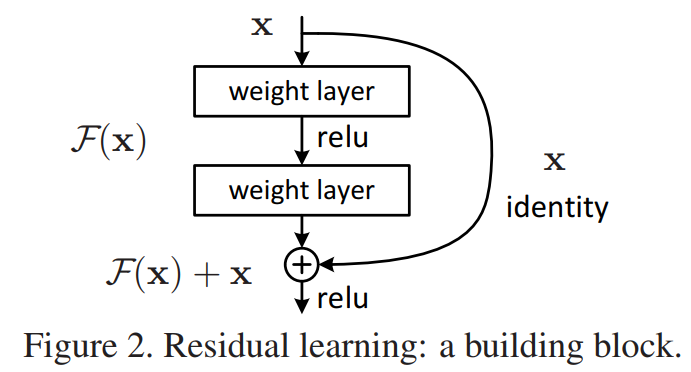
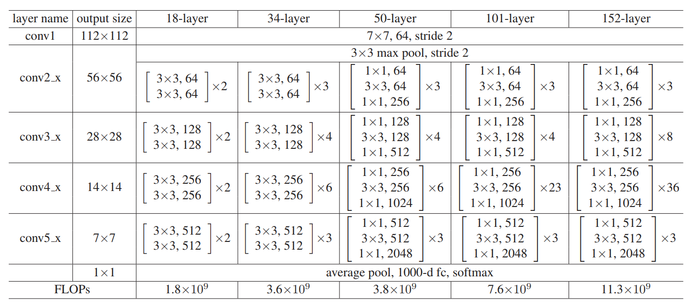
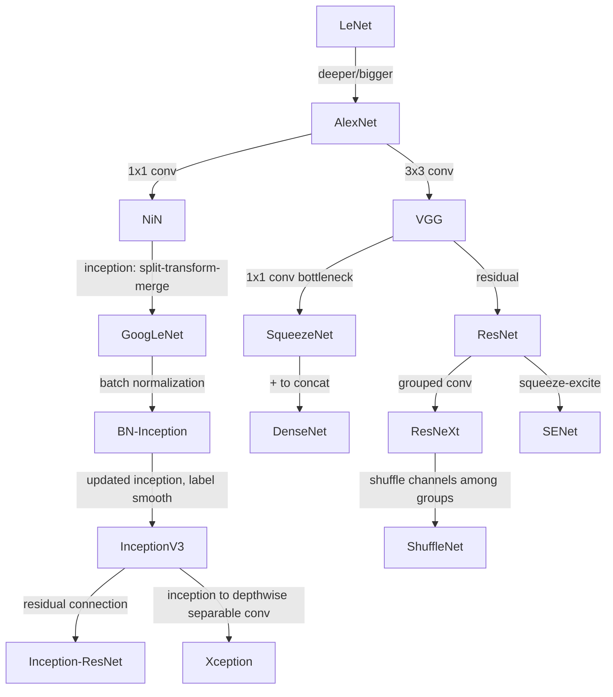

# Milestone Networks in Deep Learning

- **Deep learning**. LeCun Yann et.al. **Nature**, **2015-5-27**, ([pdf](..\..\..\papers\models\Deep_learning.pdf))([link](https://doi.org/10.1038/nature14539)).

  - 监督学习就是“定义可微损失 + 反向传播算梯度 +（小批量）SGD 优化 + 测试集检验泛化”

  - 高维非凸里，真正的绊脚石多是鞍点而非“坏极小值”，因此带噪声的小批量 SGD、本质上的随机性与动量等会有帮助穿过鞍点

    > 当然现在优化器有更多，例如AdamW,LAMB等

  - ReLU 在多层网络中通常学得更快，（直观理解）ReLU 是分段线性、计算简单；其“零–正”两段让很多激活在任一前向传播中为 0，形成**稀疏激活**

  - CNN:local connections, shared weights, pooling and the use of many layers

  - Distributed representations:特征由向量表示（每个维度代表一个微特征），彼此并不排斥，能因子化复杂的输入——输出关系

  - 到端的“CNN+RNN+强化学习”的主动感知/视觉决策

- **Gradient-based learning applied to document recognition**. Lecun Y. et.al. **Proc. IEEE**, **1998**, ([pdf](..\..\..\papers\models\Gradient-based_learning_applied_to_document_recognition.pdf))([link](https://doi.org/10.1109/5.726791)).
  - LeNet-5

- **ImageNet classification with deep convolutional neural networks**. Krizhevsky Alex et.al. **Commun. ACM**, **2017-5-24**, ([pdf](..\..\..\papers\models\AlexNet.pdf))([link](https://doi.org/10.1145/3065386)).
  - AlexNet：论文比较工程，效果在ImageNet上比较好
    
  - 使用数据增广来获得更多训练样本，通过平移、灰度变换等增广方式来扩充数据，使网络适应更多情况
  - 对网络中间层加入Dropout， 即随机使部分神经元不工作，提升模型对于整体特征的学习能力， 避免过拟合问题，提高泛化能力
  - 采用ReLU函数来替代Sigmoid函数，降低了计算量的同时，还避免了极端输入导致的梯度消失
  - 使用动量参数和学习率降低策略来加速收敛， 每当学习陷入瓶颈时学习率就会降低（手动）

- **Very Deep Convolutional Networks for Large-Scale Image Recognition**. Karen Simonyan et.al. **arxiv**, **2014**, ([pdf](..\..\..\papers\models\Very_Deep_Convolutional_Networks_for_Large-Scale_Image_Recognition.pdf))([link](http://arxiv.org/abs/1409.1556v6)).
  - VGGNet
  - 不同于以往的大卷积核，此网络中卷积核尺寸均为3× 3，相对于更大的卷积核而言减少了参数， 使得网络的层数能够得到加深，这样也能更好地保留图像的特征

- **Going deeper with convolutions**. Szegedy Christian et.al. **No journal**, **2015-6**, ([pdf](..\..\..\papers\models\GoogleNet.pdf))([link](https://doi.org/10.1109/cvpr.2015.7298594)).
  - GoogLeNet (Inception v1)

- **Deep Residual Learning for Image Recognition**. He Kaiming et.al. **No journal**, **2016-6**,([pdf](..\..\..\papers\models\Deep_Residual_Learning_for_Image_Recognition.pdf))([link](https://doi.org/10.1109/cvpr.2016.90)).
  - ResNet：从求导来看即使梯度小，因为是加法所以还是能进行训练的

    

    

  - bottleneck的设计：右边先降维，再升维，这样就能做得更深

    做得深，就可以使用更多的通道数（可看作特征），用更复杂的特征向量来表示

    

- **Densely Connected Convolutional Networks**. Huang Gao et.al. **No journal**, **2017-7**, ([pdf](..\..\..\papers\models\Densely_Connected_Convolutional_Networks.pdf))([link](https://doi.org/10.1109/cvpr.2017.243)).
  - DenseNet

- **Rethinking the Inception Architecture for Computer Vision**. Szegedy Christian et.al. **No journal**, **2016-6**, ([pdf](..\..\..\papers\models\Rethinking_the_Inception_Architecture_for_Computer_Vision.pdf))([link](https://doi.org/10.1109/cvpr.2016.308)).
  - Inception-v3

- **Attention Is All You Nee**{{1706.03762v7}}([pdf](..\..\..\papers\models\Attention_Is_All_You_Need.pdf))

# Relations

TODO:




# Cmd

```
set PYTHONUTF8=1
autoliter -i ./Milestone_Networks_in_Deep_Learning.md -o ../../../papers/models/
```
