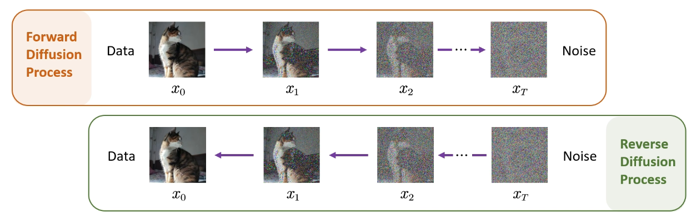
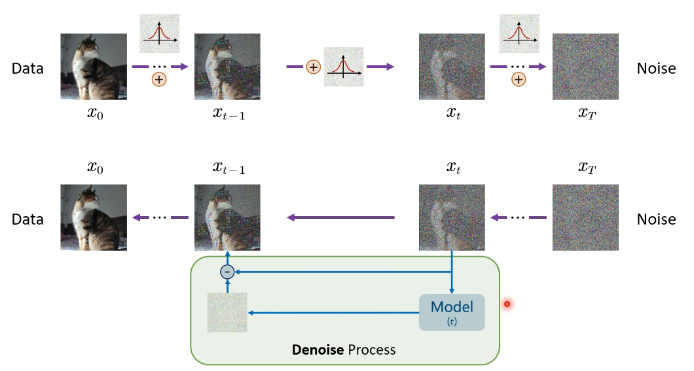
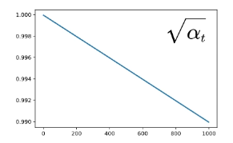
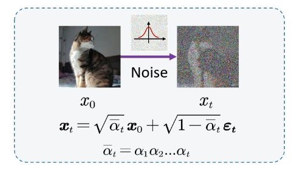
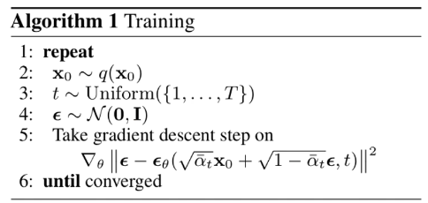
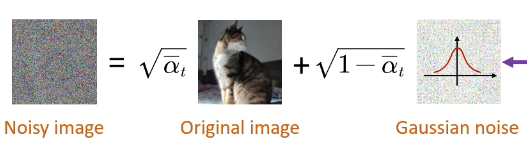

# Main Takeaway

之前看到一个使用diffusion model做的LLM，其生成的快速性直接打爆一众现有的LLM模型，是深度生成模型中新的SOTA

在此记录一下学习diffusion model

<!--more-->

# What are Diffusion Models?

扩散模型实现从噪声（采样自简单的分布）生成目标数据样本

其核心是通过逐步添加噪声（正向过程）和反向去噪（逆向过程）来生成数据（如图像、音频等）。它通过模拟数据的扩散过程，最终学习如何从噪声中重建目标数据。

我们先来介绍Diffusion Model中的经典模型DDPM(stands for Denoising Diffusion Probabilistic Models)

> The sculpture is already complete within the marble block before I start my work. It is already there, I just have to chisel away the superfluous material——Michelangelo

来看看Diffusion Model到底是怎么实现的

Diffusion Model就分为两步：

1. 前向添加噪声

   对每个$x_{t}$反复添加高斯噪声，最后得到一个纯噪声的目标，具有Markov性

2. 反向去除噪声

   实际上我们得到一张纯噪声的东西，然后通过训练过的神经网络来进行噪声的预测，从而从$x_t$中减去这个噪声得到$x_{t-1}$，这个过程就叫Denoise Process，反复使用就能得到$x_0$

下面我们来详细介绍这两步具体的数学推导

# How to derive the diffusion model mathematically

- Forward Diffusion Process

  我们先来探究一下每个步是如何添加噪声的：

  

  > 引理：对任何$z\sim N(\mu,\sigma^2)$都可以表示成$z=\mu +\sigma \cdot \epsilon$，其中$\epsilon\sim N(0,1)$

  在每一步$x_{t-1}$中添加高斯噪声，最后得到的图像是也是高斯分布的，当然不是单纯地添加噪声，而是以一种线性组合的方式相加
  $$
  \mathbf{x}_t = \sqrt{\alpha_t} \mathbf{x}_{t-1} + \sqrt{1 - \alpha_t} \mathbf{\epsilon}_{t-1}
  $$

  $$
  q(\mathbf{x}_t | \mathbf{x}_{t-1}) = \mathcal{N}\left(\mathbf{x}_t; \sqrt{\alpha_t} \mathbf{x}_{t-1}, (1 - \alpha_t) \mathbf{I}\right)
  $$

  其中$\sqrt{\alpha_t}$取值如下，这样能让每一步噪声的影响不太大，使得$x_t$和$x_{t+1}$看起来比较一致，当样本变得愈加噪声时，可让其承担越来越大噪声。最后使其变为各向同性高斯分布的纯噪声的图像

  

  下面我们来进一步推导一下前向加噪的过程
  $$
  \begin{equation}
  \begin{split}
  \mathbf{x}_t &=\sqrt{\alpha_t} \mathbf{x}_{t-1} + \sqrt{1 - \alpha_t} \mathbf{\epsilon}_{t-1}	\\
  &	=\sqrt{\alpha_t} \left( \sqrt{\alpha_{t-1}} x_{t-2} + \sqrt{1 - \alpha_{t-1}} \mathbf{\epsilon}_{t-2} \right) + \sqrt{1 - \alpha_t} \mathbf{\epsilon}_{t-1}	\\
  &	= \sqrt{\alpha_t \alpha_{t-1}} x_{t-2} + \left( \sqrt{\alpha_t - \alpha_t \alpha_{t-1}} \mathbf{\epsilon}_{t-2} + \sqrt{1 - \alpha_t} \mathbf{\epsilon}_{t-1} \right)	\\
  &	= \sqrt{\alpha_t \alpha_{t-1} \cdots \alpha_1} \mathbf{x}_0 + \sqrt{1 - \alpha_t \alpha_{t-1} \cdots \alpha_1} \mathbf{\epsilon}	\\
  &	 = \sqrt{\bar{\alpha_t}}x_0 + \sqrt{1-\bar{\alpha}_t}\epsilon	
  \end{split}
  \end{equation}
  $$
  

- Reverse Diffusion Process

  然后我们来看一下反向过程，我们能否像前向过程一样寻找一个$q(x_{t-1}|x_t)$来得到$x_{t-1}$呢？实际上是数学上推导式非常难因此想用NN来进行拟合得到$$p_\theta(x_{t-1}|x_t)$$

  > Assume : the output is gaussian

  $$
  \text{Target Distribution} \quad q(x_{t-1} | x_t) = \mathcal{N}(x_{t-1}; \mu_t(x_t), \Sigma_t(x_t))
  $$

  $$
  \text{Approximated Distribution} \quad p_\theta(x_{t-1} | x_t) = \mathcal{N}(x_{t-1}; \mu_\theta(x_t, t), \Sigma_\theta(x_t, t))
  $$

  我们的目标是拟合这两个高斯模型的分布。根据极大似然原理MLE，我们实际上要优化的是：
  $$
  \arg \max \prod_{i=1}^t p_{\theta}(x_i) = \arg \max \sum_{i=1}^t \log p_{\theta}(x_i)
  $$
  经过化简可得

  > 这里的KL divergence用于度量两个概率分布之间的距离
  >
  > ELBO为变分推断中的变分下界，推导详情见统计学习

  $$
  \min -\log p_\theta(x_0) \leq -\log p_\theta(x_0) + D_{KL} (q(x_{1:T} | x_0) || p_\theta(x_{1:T} | x_0))
  $$

  $$
  \min -\log p_\theta(x_0) \leq \mathbb{E}_{q(x_{1:T} | x_0)} \left[ \log \frac{q(x_{1:T} | x_0)}{p_\theta(x_{0:T})} \right] \quad \text{ELBO}
  $$

  $$
  \min -\log p_\theta(x_0) \leq \mathbb{E}_{ q(x_{1:T} | x_0)} [\underbrace{D_{KL} (q(x_T | x_0) || p_\theta(x_T))}_{L_T}] + \\ \sum_{t=2}^T \underbrace{ D_{KL} (q(x_{t-1} | x_t, x_0) || p_\theta(x_{t-1} | x_t))}_{L_t} - \underbrace{ \log p_\theta(x_0 | x_1)}_{L_0} = L_{VLB}
  $$

  $L_{VLB}$中得KL项（除$L_0$）都用于比较两个高斯分布，因此都可采用闭式运算，因为$L_T$为常数，因此训练器件可忽略，而$x_T$为高斯噪声，所以我们只需要关注$L_t$即可

  然后我们来关注一下$\sum_{t=2}^T D_{KL} (q(x_{t-1} | x_t, x_0) || p_\theta(x_{t-1} | x_t))$，其描述了一个原始$q$的分布（但多了$x_0$）和我们神经网络拟合的关系，需要通过其来计算神经网络的loss

  来探究一下$q(x_{t-1} | x_t, x_0)$，它是在$q(x_{t-1} | x_t)$还多给了$x_0$，相当于不仅给了$x_t$还给了标准答案让你去求$x_{t-1}$
  $$
  q(x_{t-1} | x_t, x_0) = \frac{q(x_{t-1}, x_t, x_0)}{q(x_t, x_0)} = \frac{q(x_t | x_{t-1}) q(x_{t-1} | x_0) q(x_0)}{q(x_t | x_0) q(x_0)}\\ = \frac{q(x_t | x_{t-1}) q(x_{t-1} | x_0)}{q(x_t | x_0)}
  $$
  根据前向加噪的推导有
  $$
  q(x_t | x_{t-1}) \sim \mathcal{N}(x_t; \sqrt{\alpha_t} x_{t-1}, 1 - \alpha_t) \\
  q(x_{t-1} | x_0) \sim \mathcal{N}(x_{t-1}; \sqrt{\bar{\alpha}_{t-1}} x_0, 1 - \bar{\alpha}_{t-1}) \\
  q(x_t | x_0) \sim \mathcal{N}(x_t; \sqrt{\bar{\alpha}_t} x_0, 1 - \bar{\alpha}_t)
  $$

  代入可得
  $$
  q(\mathbf{x}_{t-1} | \mathbf{x}_t, \mathbf{x}_0) = \mathcal{N} \left( \mathbf{x}_{t-1};  \underbrace{ \frac{\sqrt{\alpha_t} (1 - \bar{\alpha}_{t-1}) \mathbf{x}_t + \sqrt{\bar{\alpha}_{t-1}} (1 - \alpha_t) \mathbf{x}_0}{1 - \bar{\alpha}_t} }_{\mu_q(x_t,t)},
  \underbrace{  \frac{(1 - \alpha_t) (1 - \bar{\alpha}_{t-1})}{1 - \bar{\alpha}_t} \mathbf{I}}_{\sum_q(t)}
  \right)
  $$
  根据公式我们
  $$
  D_{KL}(\mathcal{N}(\mathbf{x}; \mathbf{\mu}_x, \Sigma_x) || \mathcal{N}(\mathbf{y}; \mathbf{\mu}_y, \Sigma_y)) = \frac{1}{2} \left[ \log \frac{|\Sigma_y|}{|\Sigma_x|} - d + \text{tr}(\Sigma_y^{-1} \Sigma_x) + (\mathbf{\mu}_y - \mathbf{\mu}_x)^T \Sigma_y^{-1} (\mathbf{\mu}_y - \mathbf{\mu}_x) \right]
  $$

  这里我们假设方差${\sum_q(t)}$是一个定值，那么代入公式可得

  $$
  \underset{\theta}{\text{argmin}} \, D_{KL}(q(\mathbf{x}_{t-1} | \mathbf{x}_t, \mathbf{x}_0) || p_\theta(\mathbf{x}_{t-1} | \mathbf{x}_t)) \\
  = \underset{\theta}{\text{argmin}} \frac{1}{2 \sigma_q^2(t)} [||\mathbf{\mu}_\theta - \mathbf{\mu}_q||_2^2]
  $$

  但其中$\mu_q$包含$x_0$，实际上我们在运用diffusion model时是不知道的，所以我们需要消除$x_0$

  已知
  $$
  \quad \mathbf{x}_t = \sqrt{\bar{\alpha}_t} \mathbf{x}_0 + \sqrt{1 - \bar{\alpha}_t} \mathbf{\epsilon}_t \quad \rightarrow \quad \mathbf{x}_0 = \frac{\mathbf{x}_t - \sqrt{1 - \bar{\alpha}_t} \mathbf{\epsilon}_t}{\sqrt{\bar{\alpha}_t}}
  $$

  于是$\mu_q$可化简为如下形式，这样就可以消除$x_0$了

  $$
  \frac{\sqrt{\alpha_t} (1 - \bar{\alpha}_{t-1}) \mathbf{x}_t + \sqrt{\bar{\alpha}_{t-1}} (1 - \alpha_t) \mathbf{x}_0}{1 - \bar{\alpha}_t} \quad \rightarrow \quad \frac{1}{\sqrt{\alpha_t}} \left( \mathbf{x}_t - \frac{1 - \alpha_t}{\sqrt{1 - \bar{\alpha}_t}} \mathbf{\epsilon}_t \right) \quad \text{noise predictor}
  $$

  > 这里引申一个问题：为什么都有$\mathbf{x}_0 = \frac{\mathbf{x}_t - \sqrt{1 - \bar{\alpha}_t} \mathbf{\epsilon}_t}{\sqrt{\bar{\alpha}_t}}$这个$x_0$的表达式了，不能直接预测$x_0$
  >
  > 因为如果一步直接用神经网络预测得到噪声的分布效果非常不好，实际运用中是每次预测一步，然后进行修正，循环进行

  然后我们就可以进行training了，即
  $$
  \underset{\theta}{\text{argmin}} \frac{1}{2 \sigma_q^2(t)} [||\mathbf{\mu}_\theta - \mathbf{\mu}_q||_2^2]
  $$

  $$
  \underset{\theta}{\text{argmin}} \frac{1}{2 \sigma_q^2(t)} \frac{(1 - \alpha_t)^2}{(1 - \bar{\alpha}_t) \alpha_t} [||\mathbf{\epsilon}_t - \hat{\mathbf{\epsilon}}_\theta(\mathbf{x}_t, t)||_2^2]
  $$

  > 在原论文中训练时直接将系数$\frac{1}{2 \sigma_q^2(t)} \frac{(1 - \alpha_t)^2}{(1 - \bar{\alpha}_t) \alpha_t}$去掉了
  >
  > 

  在得到训练的模型后我们可以进行反向denoise了
  $$
  \mathbf{x}_{t-1} = \frac{1}{\sqrt{\alpha_t}} \left( \mathbf{x}_t - \frac{1 - \alpha_t}{\sqrt{1 - \bar{\alpha}_t}} \mathbf{\epsilon}_\theta(\mathbf{x}_t, t) \right) + \sigma_t \mathbf{z}
  $$
  

# How to train a diffusion model and infer it

有了上面的数学推导我们来举一个完整的过程实现diffusion model的训练和推理

- illustration of training

  1. Randomly select a time step and encode it.

     

  2. Add noise to image

     

  3. Train the UNet

     

     将Gaussian noise和推理出的Predicted noise进行$L_{L2}$损失反向传播

- illustration of sampling

  1. Iteratively denoise the image (T = 1000)

     > 注意这里有$+\sqrt{\beta_t} \epsilon$，加回了一部分噪声，即不完全信任神经网络的结果

  2. Iteratively denoise the image (T = 999.. 2)

  3. Iteratively denoise the image (T = 1)

     

     

## Model Architecture

There are two common backbone architecture choices for diffusion models: U-Net and Transformer

- U-Net: consists of a downsampling stack and an upsampling stack

  the architecture is as folows

  

  DDPM使用的Unet是time-condition Unet，采用正弦位置编码（Sinusoidal Positional Embeddings），既需要位置编码有界又需要两个时间步长之间的距离与句子长度无关，很容易想到$sin$ and $cos$

  

  

- Diffusion Transformer

  

# Other Models

原始扩散模型的三个主要缺点，采样速度慢，最大化似然差、数据泛化能力弱

于是关于diffusion models改进研究就分为对应的三类：采样速度提升、最大似然增强和数据泛化增强

> TODO

# Application

建议直接看原文[[2209.00796\] Diffusion Models: A Comprehensive Survey of Methods and Applications (arxiv.org)](https://arxiv.org/abs/2209.00796)

- Image Super Resolution, Inpainting, Restoration, Translation, and Editing
-  Text-to-Image Generation（文本生成图像）
- Scene Graph to Image Generation
- 高度可控的图像生成
- Text-to-video generation/editing
- 3D点云生成
- Text-to-3D generation
- Text-to-motion generation
- 文本生成
- 基于diffusion model的时间序列，时序信号生成
- 进行药物分子和蛋白质分子、抗体的生成

# References

- [What are Diffusion Models? | Lil'Log (lilianweng.github.io)](https://lilianweng.github.io/posts/2021-07-11-diffusion-models/#forward-diffusion-process)

- 推导挺清晰的：[【大白话01】一文理清 Diffusion Model 扩散模型 | 原理图解+公式推导](https://www.bilibili.com/video/BV1xih7ecEMb/?spm_id_from=333.337.search-card.all.click&vd_source=3a8e3df5af30a81c441200ce3c96e8fc)

- [[2209.00796\] Diffusion Models: A Comprehensive Survey of Methods and Applications (arxiv.org)](https://arxiv.org/abs/2209.00796)

- [扩散模型(Diffusion Model)首篇综述-Diffusion Models: A Comprehensive Survey of Methods and Applications](https://zhuanlan.zhihu.com/p/562389931)