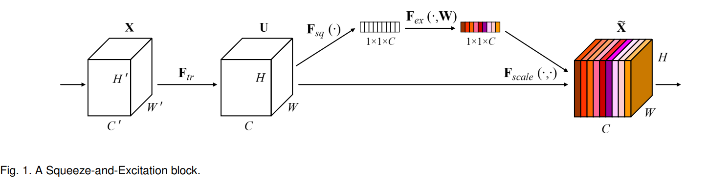
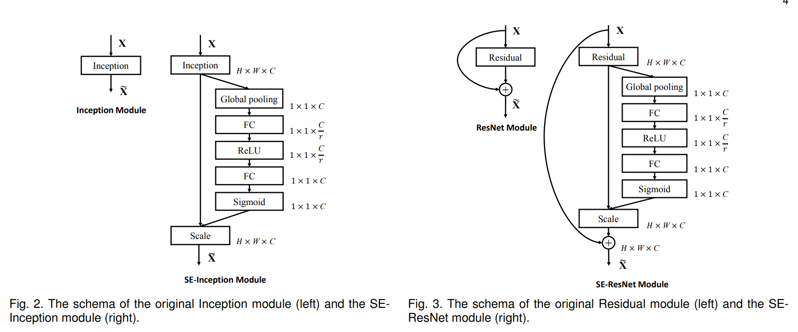

# Module Design

introduce different module design

<!--more-->

## Shortcut

- Takeaway: The shortcut ensures information and gradients can bypass the bottleneck stack, improving optimization stability.


- How:

  - If the input and output shapes match, it is identity.
  - If they differ (different stride or number of channels), a low-cost projection shortcut is used.

  ```python
  # in GhostNet
  if (in_chs == out_chs and self.stride == 1):
      self.shortcut = nn.Sequential()
  else:
      self.shortcut = nn.Sequential(
          nn.Conv2d(in_chs, in_chs, dw_kernel_size, stride=stride,
                 padding=(dw_kernel_size-1)//2, groups=in_chs, bias=False),
          nn.BatchNorm2d(in_chs),
          nn.Conv2d(in_chs, out_chs, 1, stride=1, padding=0, bias=False),
          nn.BatchNorm2d(out_chs),
      )
  ```

## Depthwise Separable Convolutions(DSC)

- **MobileNets: Efficient Convolutional Neural Networks for Mobile Vision Applications**. Andrew G. Howard et.al. **arxiv**, **2017**, ([link](https://arxiv.org/abs/1704.04861v1)).

- Why: The main reason for using DSC is **efficiency**. It significantly reduces the computational cost and the number of parameters compared to standard convolutions. And it also maintain performance.(a bit worse)

- What: Depthwise Separable Convolutions (DSC) are a variant of the standard convolution operation used in Convolutional Neural Networks (CNNs). Unlike regular convolutions, DSC splits the convolution operation into two parts:

  1. A **depthwise grouped convolution**, w[here](https://pytorch.org/docs/stable/generated/torch.nn.Conv2d.html) the number of input channels m is equal to the number of output channels such that each output channel is affected only by a single input channel. In PyTorch, this is called a "grouped" convolution.
  2. A **pointwise convolution** (filter size=1), which operates like a regular convolution such that each of the n filters operates on all m input channels to produce a single output value.

- How: For an input feature map of size \( $H \times W \times C $\) (Height x Width x Channels):

  - **Standard Convolution** would use $ K_h \times K_w \times C_{in} \times C_{out} $ parameters, where $ K_h $  and $ K_w $ are the height and width of the kernel, $ C_{in} $ is the number of input channels, and $ C_{out} $ is the number of output channels.

  - **Depthwise Separable Convolution** would use:
    - $$ K_h \times K_w \times C_{in} $$ parameters for the depthwise convolution
    - $$ 1 \times 1 \times C_{in} \times C_{out} $$ parameters for the pointwise convolution.

  This reduces the number of parameters and the computational complexity.

  ```
  # a tiny example
  class DepthwiseSeparableConv(nn.Module):
      def __init__(self, in_channels, out_channels, kernel_size, stride=1, padding=0):
          super(DepthwiseSeparableConv, self).__init__()
  
          # Depthwise Convolution
          self.depthwise = nn.Conv2d(in_channels, in_channels, kernel_size=kernel_size,
                                      stride=stride, padding=padding, groups=in_channels)
  
          # Pointwise Convolution
          self.pointwise = nn.Conv2d(in_channels, out_channels, kernel_size=1)
  
      def forward(self, x):
          # Apply depthwise convolution
          x = self.depthwise(x)
          # Apply pointwise convolution
          x = self.pointwise(x)
          return x
  
  # Example of using the Depthwise Separable Convolution layer
  input_tensor = torch.randn(1, 3, 64, 64)  # Example input with batch size 1, 3 channels, 64x64 image
  model = DepthwiseSeparableConv(in_channels=3, out_channels=16, kernel_size=3, stride=1, padding=1)
  output_tensor = model(input_tensor)
  
  print(f'Output shape: {output_tensor.shape}')
  ```

- Pros:
  - It significantly reduces the computational cost and the number of parameters compared to standard convolutions. And it also maintain performance.(a bit worse)
- Cons
  - The calculation/memory usage ratio of Depthwise Convolution is much smaller than that of conventional convolution, which means that Depthwise Convolution spends more time on memory access. This shortcoming means that I/O-intensive devices will not be able to achieve maximum computational efficiency, making it not easy to implement on hardware devices.

## Squeeze and Excitation

- **Squeeze-and-Excitation Networks**. Jie Hu et.al. **arxiv**, **2017**, ([link](https://arxiv.org/abs/1709.01507v4)).

- Takeaway:  **Squeeze-and-Excitation (SE)** is a lightweight attention mechanism. Its purpose is to let the network **reweight feature channels adaptively**, so that important channels are emphasized and unimportant ones are suppressed.

  In essence, SE is **channel-wise attention**.

- Motivation: Some channels are more discriminative than others. SE want the network to learn what channels are important for the current input.

- Core Mechanism: The SE module has three steps:

  

  

  1. Squeeze (Global Information Embedding): Perform global average pooling(better than max) to compress spatial information into a compact **channel descriptor**:
     $$
     z_c = \frac{1}{HW} \sum_{i=1}^{H} \sum_{j=1}^{W} X_c(i, j)
     $$

  2. Excitation (Channel Dependency Modeling): Apply a small two-layer MLP to learn how important each channel is and amplify/suppress them.
     $$
     s = \sigma \left( W_2\, \delta( W_1 z ) \right),\quad \sigma~ \text{stands for sigmoid},\delta~ \text{stands for ReLU}
     $$

  3. Reweight Channels: Rescale the original feature channels:
     $$
     \hat{X}_c = s_c \cdot X_c
     $$

- Pros
  - Very small parameter overhead and significant accuracy improvement
  - Easy to integrate into any CNN. Plug-and-play.
- Cons
  - Adds a small amount of latency
  - Only models **channel attention**, not spatial attention

## AdderNet

### Papers

- **CVPR 20 (Oral)：**AdderNet: Do We Really Need Multiplications in Deep Learning?
- **NeurIPS 20 (Spotlight)：**Kernel Based Progressive Distillation for Adder Neural Networks
- **CVPR 21 (Oral)：**AdderSR: Towards Energy Efficient Image Super-Resolution

### Takeaway

CNN 中的卷积是计算特征和卷积核之间的互相关性，而这个互相关性可以理解为一种距离的度量，衡量的是 **方向一致性的强弱**。

- AdderNet的核心思想：把乘法相似换成加法距离。使用基于$L_1$距离的距离度量

- Adder filter：
  $$
  Y = - \sum_{i,j}|X_{i,j}-W_{i,j}|
  $$
  这里我们要求的导数包含绝对值，是**无法直接求导**的，这里我们直接采用分类讨论。

  > [!NOTE]
  >
  > 在深度学习中，要解决**目标函数无法求导**的问题，我们一般有2种方法：
  >
  > 1. [近端梯度下降Proximal Gradient Descent](https://zhuanlan.zhihu.com/p/277041051)
  > 2. 分类讨论

- 但AdderNet特征的 很大(有证明)，为了防止爆炸，作者使用超级经典的Batch Normalization对特征进行归一化。但是Batch Normalization一用，发现梯度消失了(有证明)，为了解决这个难题，作者设计了自适应学习率。

- 用AdderNet替换CNN之后精度还是有损失的，所以作者想通过知识蒸馏操作，实现把知识从CNN转移到ANN上。但是传统的KD无法使用，因为CNN和ANN的输出特征差异很大。

  > [!NOTE]
  >
  > $L_1$ 正则先验分布是 Laplace 分布， $L_2$ 正则先验分布是 Gaussian 分布。因此我们可以看到ANN参数权重分布跟接近于Laplace分布，而CNN的权重分布更接近Gaussian分布。

  所以作者使用Kernel method，把输入特征和卷积核(滤波器)映射到高维空间上，使用小的temperature，和一个linear transformation，以缩小CNN和ANN的输出特征的差异。

  最后，用渐进式蒸馏的办法同时更新CNN和ANN的参数。

  > [!CAUTION]
  >
  > 但疑惑是核函数虽然能把输入特征和卷积核(滤波器)映射到高维空间上，但是文中的操作能否保证CNN和ANN的输出特征没有差异？这点缺乏理论的佐证。


## References

- [AdderNet on Zhihu](https://zhuanlan.zhihu.com/p/262260391)

