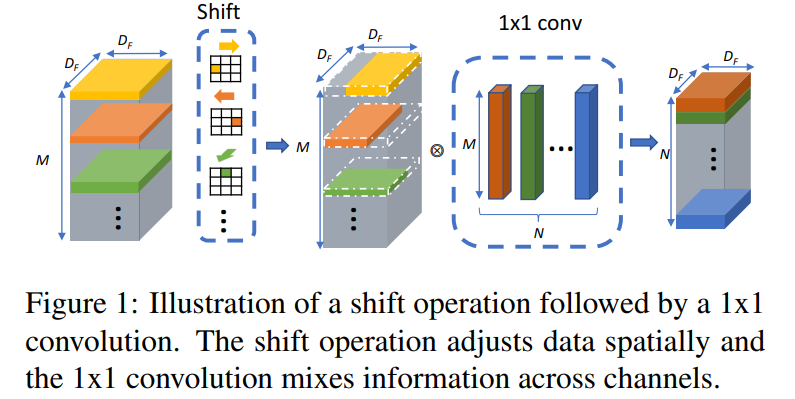
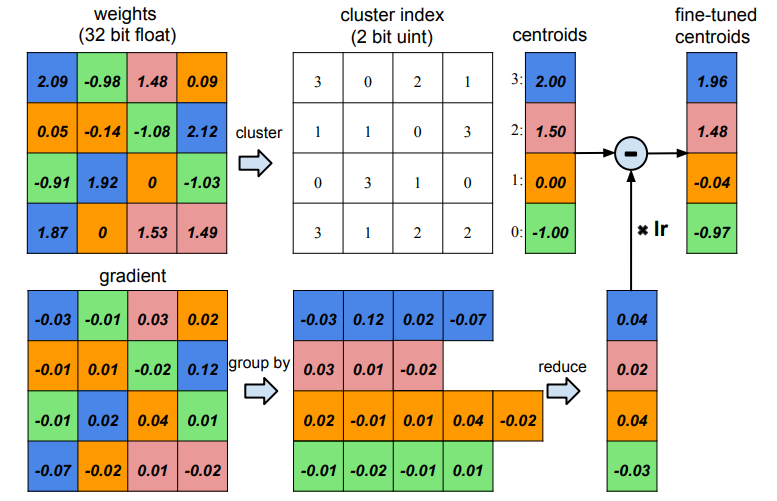

# Operation Design

[TOC]

## Shift

- **Shift: A Zero FLOP, Zero Parameter Alternative to Spatial Convolutions**. Bichen Wu et.al. **arxiv**, **2017**, ([link](https://arxiv.org/abs/1711.08141v2)).

- Takeaway: Shift replaces spatial convolution by simply shifting feature channels in different directions. It has zero parameters, zero FLOPs, and relies on a following 1×1 convolution to mix information. This makes it extremely lightweight while still enabling spatial feature extraction.

- Motivation: Depthwise convolution reduces some cost but remains **memory-bound** and still requires multiplications. Therefore, we hope to have an operation that can:
  - Reduce the number of learnable parameters.
  - Keep the ratio of computation/memory access unchanged.

- Core Mechanism: Each channel is assigned a spatial offset: up / down / left / right / diagonal / no-shift.
  $$
  \tilde{G}_{k,l,m}
  =
  \sum_{i,j}
  \tilde{K}_{i,j,m}
  \, F_{k+i,\,l+j,\,m}
  $$

  The shift operation kernel $\tilde{K} \in \mathbb{R}^{D_F \times D_F \times M}$ is defined as:

  $$
  \tilde{K}_{i,j,m} =
  \begin{cases}
  1, & \text{if } i = i_m \text{ and } j = j_m, \\
  0, & \text{otherwise}.
  \end{cases}
  $$
  These shifted channels collectively emulate the receptive field of a 3×3 convolution. A **1×1 convolution** is applied afterward to mix channel information.

  

  > [!IMPORTANT]
  >
  > The channel domain is the hierarchical diffusion of spatial domain information.

- Pipeline

  ```mermaid
  flowchart LR
  
  A[Channel Assignment<br/>Divide channels into groups<br/>Assign each group a shift direction]
      --> B[Spatial Shift<br/>Apply fixed spatial offsets<br/>Zero parameters, zero FLOPs]
  
  B --> C[Channel Mixing 1x1 Conv<br/>Learnable mixing of shifted channels<br/>Restores expressive power]
  
  C --> D[Stack Shift Blocks<br/>Compose multiple Shift + 1x1 Conv units<br/>Build deeper spatial representations]
  
  ```

- Pros

  - Efficient on resource-constrained hardware

- Cons

  - Lower representational power than 3×3 conv. Weaker performance on large-scale tasks
  - May incur memory-movement overhead: Some hardware penalizes data shifts more than arithmetic.


### Development

- **CVPR 2019：**All you need is a few shifts: Designing efficient convolutional neural networks for image classification

  shift needs memory movement. Those memory movements can be reduced if meaningless Shift operations are eliminated.

- **WACV 2019：**AddressNet: Shift-based Primitives for Efficient Convolutional Neural Networks

  A neural network with a smaller number of parameters (params.) or computational effort (FLOPs) does not always lead to a reduction in direct neural network inference time (inference time), because many of the core operations introduced by these state-of-the-art compact architectures cannot be efficiently implemented on GPU-based machines.

- **Arxiv：**Deepshift: Towards multiplication-less neural networks

  Keep the idea of the Shift operation, just perform it bitwise.

- **NeurIPS 2020：**ShiftAddNet: A Hardware-Inspired Deep Network

  combine shift and AdderNet

## Structural Reparameterization

- Takeaway: Train with complex multi-branch blocks → deploy as single-path conv.

  Example: Mobileone

## Huffman Coding

- Frequent weights: use less bits to represent

## Dynamic Inference / Conditional Computation

- Early exiting (e.g., BranchyNet)
- Dynamic depth (skip layers)
- Dynamic width (Adaptive channel selection)
- Token pruning for Transformers
- Mixture-of-Experts routing

## Activation Compression

- Activation quantization
- Activation sparsification
- Checkpointing for memory reductions
- Reversible networks (RevNets)

## Progressive Compression / Multi-Stage Methods

- Prune → retrain → quantize → distill
- Compound compression pipelines

## Weight Sharing

 Weight sharing by scalar quantization (top) and centroids fine-tuning (bottom).




- HashNet-style weight hashing
- Shared-weight architectures (Cell-based NAS blocks)

## Efficient Attention Mechanisms

(Used especially for Vision Transformers)

- Linformer
- Performer (kernelized attention)
- Nyströmformer
- Sparse or block attention
- Low-rank attention


## References

- [shift](https://zhuanlan.zhihu.com/p/312348288)
