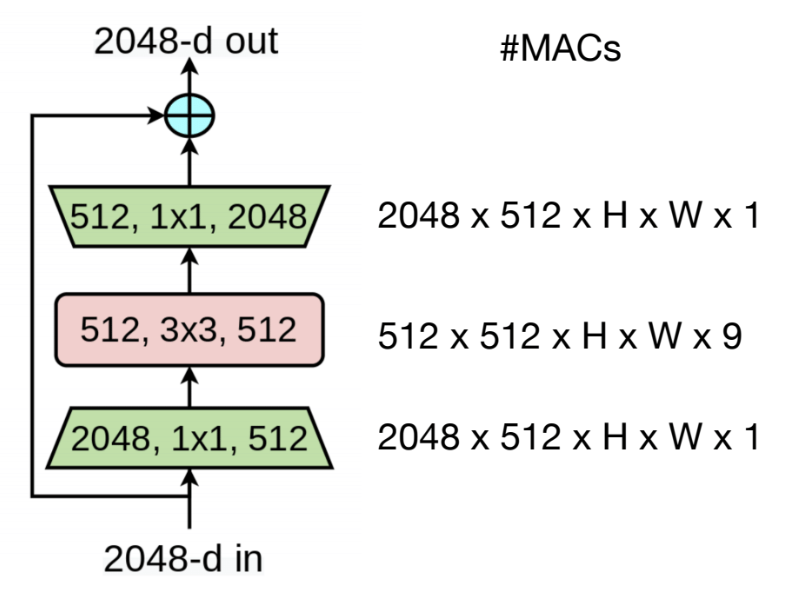
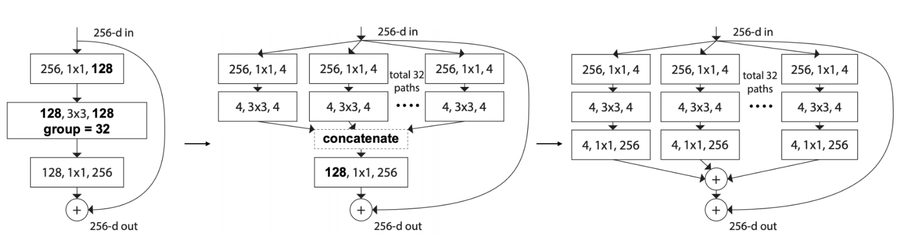
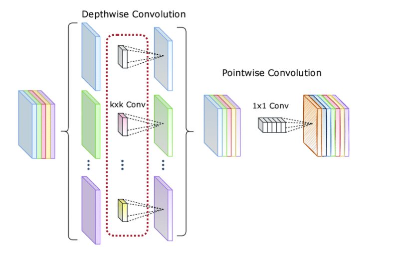
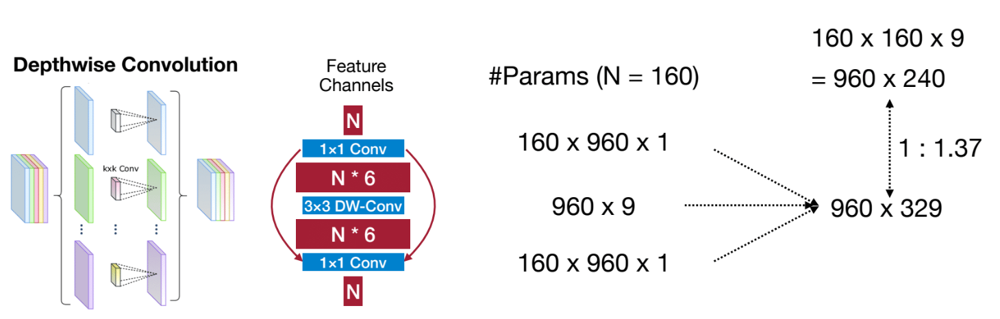
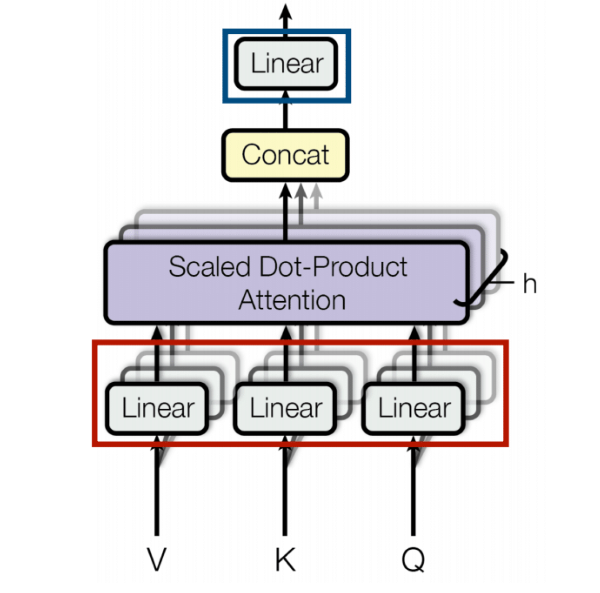

# Neural Architecture Search (NAS)

[TOC]

## Primitive operations

MACs (batch size n = 1)

| Layer                 | MACs                                                         |
| --------------------- | ------------------------------------------------------------ |
| Linear Layer          | $c_o \cdot c_i$                                              |
| Convolution           | $c_o \cdot c_i \cdot k_h \cdot k_w \cdot h_o \cdot w_o$      |
| Grouped Convolution   | $\dfrac{c_o \cdot c_i \cdot k_h \cdot k_w \cdot h_o \cdot w_o}{g}$ |
| Depthwise Convolution | $c_o \cdot k_h \cdot k_w \cdot h_o \cdot w_o$                |
| 1×1 Convolution       | $c_o \cdot c_i \cdot h_o \cdot w_o$                          |

> Tips: Bias is ignored.

> Notes: the grouped convolution like $g=32,c_i=128,c_o=128$, divided the input and output channels averagely. So each group will get 4 input and output channels.

Notations

| Symbol     | Meaning             |
| ---------- | ------------------- |
| $n$        | Batch Size          |
| $c_i$      | Input Channels      |
| $c_o$      | Output Channels     |
| $h_i, h_o$ | Input/Output Height |
| $w_i, w_o$ | Input/Output Width  |
| $k_h, k_w$ | Kernel Height/Width |
| $g$        | Groups              |

## Classic building blocks

- ResNet50: bottleneck block

  

  - Firstly reduce the number of channels by $4\times$ via $1\times 1$ convolution, and at lat expand the number of channels via $1\times 1$ convolution
  - the whole MACs is $512\times 512 \times H \times W \times 17$ compared to directly use $3\times 3$ convolution $2048\times 2048 \times H \times W \times 9$, which lead to about $8.5\times$ reduction.

- ResNeXSt: grouped convolution

  - Replace 3x3 convolution with 3x3 grouped convolution
  - Equivalent to a multi-path block

  

- MobileNet: depwise-separable block

  

  - Depthwise convolution is an extreme case of group convolution where the group number equalsthe number of input channels.(much lower capacity)
  - Use depthwise convolution to capture spatial information.
  - Use 1x1 convolution to fuse/exchange information across different channels

- MobileNetV2: inverted bottleneck block

  

  - Increase the depthwise convolution's input and output channels to improve its capacity.
  - Depthwise convolution’s cost only grows linearly. Therefore, the cost is still affordable.
  - Con: However, this design is not memory-efficient for both inference and training.
  
- ShuffleNet: $1\times 1$ group convolution & channel shuffle

  

  - Further reduce the cost by replacing 1x1 convolution with 1x1 group convolution.
  - Exchange information across different groups via channel shuffle.

- Transformer: Multi-Head Self-Attention (MHSA)

  

## Introduction to NAS

### What is NAS

Hand-designed architectures (ResNet, MobileNet, ViT) are often sub-optimal for specific tasks and specific hardware.
 NAS automates the design of neural networks to optimize for:

- Task accuracy
- Latency on target hardware (e.g., GPU, mobile, embedded)
- Model size and FLOPs
- Energy consumption
- Other constraints (e.g., memory, throughput)

**Goal:** The goal of NAS is to find the best neural network architecture in the search space, maximizing the objective of interest (e.g., accuracy, efficiency, etc).

### Search space

- what: Search space is a set of candidate neural network architectures.

- how:
  - Cell-level search space: consider step by step
  - Network-level search space:
    - depth dimension
    - resolution dimension
    - width dimension
    - kernel size dimension
    - topology connection
- why: Search space design is crucial for NAS performance

### Design the search space

Now we design the search space for TinyML, where memory is important for TinyML.

- Analyzing FLOPs distribution of satisfying models: Larger FLOPs -> Larger model capacity -> More likely to give higher accuracy
- ?

### Search strategy

- what: Search strategy defines how to explore the search space
- how
  - grid search 
  - random search
  - reinforcement search
  - gradient search
  - evolutionary search

## Efficient and hard-aware NAS

## NAS applications

## References

- [NAS1](https://www.dropbox.com/scl/fi/hxhjhxonwqyw2hfoywzcp/Lec07-Neural-Architecture-Search-I.pdf?rlkey=o6s5dglazyb2o2nrc897ccppg&e=1&st=dcjyr42l&dl=0)
- [NAS2](https://www.dropbox.com/scl/fi/kaia5vvmdwb2bj0xnbihm/Lec08-Neural-Architecture-Search-II.pdf?rlkey=vkp9i12ljbk4jmdfp05j3ctdy&e=1&st=hincmob7&dl=0)