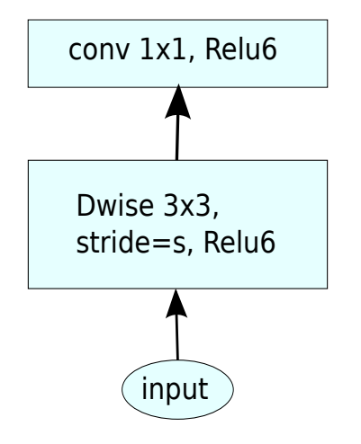
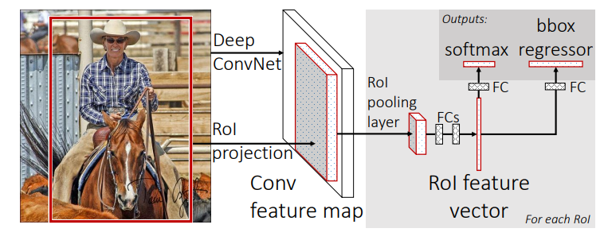
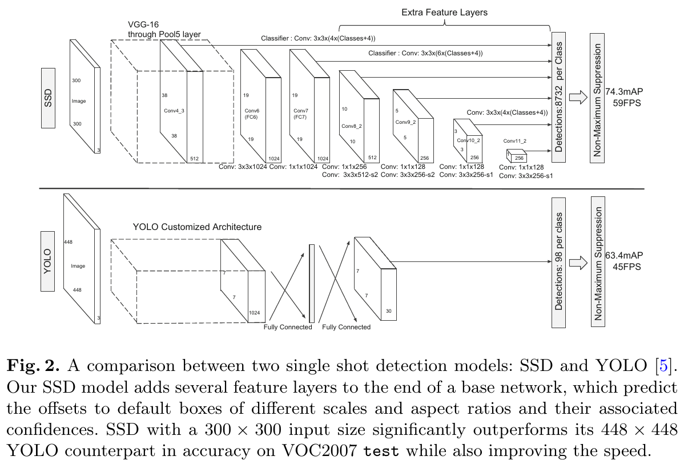

# Lightweight Models

Focus on lightweight models and their optimizations for embedded systems.

- ResNet (residual learning)
- MobileNet v1 (depthwise conv)
- MobileNet wv2 (Inverted Residual + Linear Bottleneck)
- ShuffleNet (channel shuffle)
- GhostNet (Ghost Module – Cheap Operations)

[TOC]

## Lightweight Nets

- **MobileNets: Efficient Convolutional Neural Networks for Mobile Vision Applications**. Andrew G. Howard et.al. **arxiv**, **2017**, ([link](https://arxiv.org/abs/1704.04861v1)).

  - [Depthwise Separable Convolutions(DSC)](06-Module-Design.md#Depthwise Separable Convolutions(DSC))

  - two simple global hyperparameters that efficiently trade off between latency and accuracy

    - width multiplier $\alpha$: thinner models, controls the number of channels in each layer

    - resolution multiplier $\rho$: reduce the computational cost, controls the input image resolution
      $$
      D_K \times D_K \times \alpha M \times \rho D_F \times \rho D_F+\alpha M \times \alpha N \times  \rho D_F \times \rho D_F
      $$
      

  - less regularization and data augmentation techniques because small models have less trouble with overfitting

- **MobileNetV2: Inverted Residuals and Linear Bottlenecks**. Mark Sandler et.al. **arxiv**, **2018**, ([link](https://arxiv.org/abs/1801.04381v4)).

  - linear bottlenecks

    A **Linear Bottleneck** refers to the **final 1×1 convolution layer** in the inverted residual block, but with a **key difference**: it **does not use a non-linearity** (like ReLU) after this convolution.

  - Inverted residuals

    - Normal bottleneck use $1\times 1$ layers to reduce and then increase(restore) dimensions, which helps in reducing computational cost. However, this comes with a trade-off, as you need to balance the reduction in dimensions with the need to preserve sufficient information.
    - Inverted residuals use $1\times 1$ layers to increase and then reduce dimensions

  - a novel layer module: the inverted residual with linear bottleneck

    1. **Expansion**:
        The input is first passed through a **1×1 convolution** that **expands** the number of channels, increasing the model’s representational capacity.
    2. **Depthwise Separable Convolution**:
        After the expansion, a **depthwise separable convolution** (which is more computationally efficient than a regular convolution) is applied. This operation is performed on each channel separately, rather than combining all channels together, reducing the number of parameters and computation.
    3. **Projection (Linear Bottleneck)**:
        The **output** of the depthwise separable convolution is then passed through a **1×1 convolution** that **projects** the feature map back to a smaller number of channels.

    

    > Notes: ReLU6: $y = min(max(x,0),6)$, cut the value in 6

  - remove non-linearities in the narrow layers in order to maintain representational power

- MobileNetV3[code_link](https://github.com/d-li14/mobilenetv3.pytorch)

- **ShuffleNet: An Extremely Efficient Convolutional Neural Network for Mobile Devices**. Xiangyu Zhang et.al. **arxiv**, **2017**, ([link](https://arxiv.org/abs/1707.01083v2)).

  - Group convolutions and shuffling

    

- **GhostNet: More Features from Cheap Operations**. Kai Han et.al. **arxiv**, **2019**, ([link](https://arxiv.org/abs/1911.11907v2)).

- **Rich feature hierarchies for accurate object detection and semantic segmentation**. Ross Girshick et.al. **arxiv**, **2013**, ([link](https://arxiv.org/abs/1311.2524v5)).

  > R-CNN: Regions with CNN features

  - CNN on region proposals (Selective Search).

    

    -  Module design: Region proposals(Selective Search) + Feature extraction(4096-dimensional vector using pre-trained CNN) +  classspecific linear SVMs
    - drawback: multi-stage / non end-to-end, slow, require large disk space

  - To solve the labeled datais scarce: use unsupervised pre-training, followed by supervised fine-tuning/supervised pre-training on a large auxiliary dataset (ILSVRC), followed by domainspecific fine-tuning on a small dataset(is also effective)

- **Fast R-CNN**. Ross Girshick et.al. **arxiv**, **2015**, ([link](https://arxiv.org/abs/1504.08083v2)).

  - Run the CNN once per image to get a feature map, then use **ROI pooling** to reuse convolutional features for all proposals. Train classification and bbox regression jointly with a single softmax + regression head.

    

    > how to project: using the network’s total stride sss to map box coordinates from image space to feature-map space: divide coordinates by sss, then crop that sub-region from the conv feature map.

    - Joint loss: classification cross-entropy + smooth L1 bbox regression loss.
    - The RoI pooling layer uses max pooling to convert the features inside any valid region of interest into a small feature map with a fixed spatial extent of H × W (e.g., 7 × 7).

  - drawbacks:
    - Proposals are the test-time computational bottleneck in state-of-the-art detection systems.

- **Faster R-CNN: Towards Real-Time Object Detection with Region Proposal Networks**. Shaoqing Ren et.al. **arxiv**, **2015**, ([link](https://arxiv.org/abs/1506.01497v3)). 

  - Introduce the **Region Proposal Network (RPN)** that uses the same convolutional feature maps as the detector to predict proposals (objectness + bbox) in a fully convolutional way. This removes external proposal methods and makes proposal generation almost free.

    

    Faster R-CNN is a single, unified network for object detection. The RPN module serves as the ‘attention’ of this unified network.

  - drawbacks: 

    - relatively heavy / two-stage: 1.RPN to generate proposals. 2.ROI head to classify and refine them.
    - Anchor-based design: many hyperparameters, inefficiency

- **SSD: Single Shot MultiBox Detector**. Liu Wei et.al. **No journal**, **2016**, ([link](https://doi.org/10.1007/978-3-319-46448-0_2)).

  - Architecture

    

    - SSD extracts several feature maps of different scales. On each feature map, SSD attaches a **detection head** that predicts:

      > [!TIP]
      >
      > This is why it's called **single-shot**: All predictions happen in **one forward pass**, **on multiple scales**.
      
      - classification scores
      - bounding box offsets
      - for multiple anchor boxes (priors)

  - Pros:

    - Eliminate proposal generation and resampling entirely.
    - Base Network + Extra Feature Layers(a **pyramid of feature maps**)

  - Cons:

    - Performance on **very small objects** is weaker than some later methods (e.g., FPN-based detectors), since SSD relies on relatively shallow high-resolution maps with limited semantics.
    - Using **VGG-16** as backbone is parameter-heavy and not as efficient as later ResNet/MobileNet/ResNeXt backbones.
    - The hand-designed scales/aspect ratios of default boxes require tuning for new datasets.

- **Mask R-CNN**. Kaiming He et.al. **arxiv**, **2017**, ([link](https://arxiv.org/abs/1703.06870v3)).

- **MobileOne: An Improved One millisecond Mobile Backbone**. Pavan Kumar Anasosalu Vasu et.al. **arxiv**, **2022**, ([link](https://arxiv.org/abs/2206.04040v2)).

  - The relationship between these two indicators( floating-point operations (FLOPs) and parameter count) and the specific latency of the model is not so clear. For the specific latency, we should also consider memory access cost(MAC) and degree of parallelism.

  - Architectural Blocks(MobileOne block)

    

    - Use structural re-parameterization to decouple the *training* architecture from the *inference* architecture

      - training time: each of those convs (depthwise and pointwise) is expanded into a multi-branch structure (over-parameterized)

      - inference time: all these branches are algebraically fused into a single conv per stage, so the runtime block is very simple

        > Straight cylinder shape： this structure is chosen to minimize latency and memory access cost on mobile hardware.

      - the DSC module is integrated by "scale branch", "skip branch" and "conv branches"

        - `rbr_scale`: center-only 1×1 path (after padding) that improves channel-wise scaling flexibility
        - `rbr_skip`: identity + BN path providing residual-like behavior and extra affine freedom
        - `rbr_conv`: main expressive conv paths (3×3 or 1×1)

    

    - using shallower early stages where input resolution is larger as these layers are significantly slower compared to later stages which operate on smaller input resolution

- **GhostNet: More Features from Cheap Operations**. Kai Han et.al. **arxiv**, **2019**, ([link](https://arxiv.org/abs/1911.11907v2))([code link](https://github.com/huawei-noah/Efficient-AI-Backbones)).

  - Takeaway: GhostNet dramatically reduces the cost of convolution by observing that many feature maps in standard CNNs are *redundant* and can be generated by cheap linear transformations instead of expensive convolutions.

  - Motivation: Standard CNNs generate feature maps like:$Y = Conv(X)$. But analysis shows:

    - Many feature maps are **highly correlated**
    - Much of the computation is **producing redundant information**
    - Depthwise conv reduces compute but becomes **memory-bound**
    - Mobile models (MobileNetV1/V2/V3) still require substantial 1×1 conv operations

  - Core Mechanism: Ghost Module

    

    GhostModule proposes that output feature maps consist of:

    - **Intrinsic features:** small set of essential feature maps (computed by real convolution)

    - **Ghost features:** redundant maps derived from intrinsic ones (via cheap ops)

      > [!NOTE]
      >
      > Here cheap operation is actually group convolution, group number = input channel number, which is equivalent to depthwise separable convolution. Of course,we can apply other ops like affine transformation, wavelet transformation, shift etc.

    GhostBottleneck

    

    ```
    Input
      → GhostModule (expand)
        → DepthwiseConv (if stride=2)
          → Squeeze-and-Excitation (optional)
            → GhostModule (project)
    + Shortcut (identity or depthwise+pointwise)
    ```

    > [!TIP]
    >
    > We found that the construction process of GhostNet is to use Ghost bottleneck to replace the bottleneck in MobileNetV3.

  - Pipeline

    ```mermaid
    flowchart LR
    
    A[Intrinsic Feature Generation<br/>Apply standard 1x1 or 3x3 conv<br/>Produce a small set of intrinsic feature maps]
        --> B[Ghost Feature Generation<br/>Apply cheap linear ops -- DW conv etc.<br/>Generate additional ghost feature maps]
    
    B --> C[Concatenation<br/>Merge intrinsic + ghost features<br/>Match full conv output dimensions]
    
    C --> D[Optional Squeeze-and-Excitation<br/>Channel attention to refine features]
    
    D --> E[Stack Ghost Bottlenecks<br/>Form GhostNet blocks and full network]
    
    ```

  - Pros

    - Massive reduction of FLOPs
    - Generalizable: Ghost Module can replace conv in ResNet, MobileNet, etc.

  - Cons

    - Depthwise convolution is memory-bound: Latency improvements may vary by hardware.
    - Harder to scale to large capacity networks


## Module Design

chech the [Module Design](../Model-Compression/06-Module-Design.md)

## References

- [Depthwise Convolution explanation]( https://towardsdatascience.com/a-basic-introduction-to-separable-convolutions-b99ec3102728)
- [MobileNetv2 explanation]( https://ai.googleblog.com/2018/04/mobilenetv2-next-generation-of-on.html)
- [MobileNetV2 explained video](https://www.youtube.com/watch?v=DkNIBBBvcPs)
- [MobileNetV1](https://research.google/blog/mobilenets-open-source-models-for-efficient-on-device-vision/?_gl=1)
- https://learnopencv.com/selective-search-for-object-detection-cpp-python/
