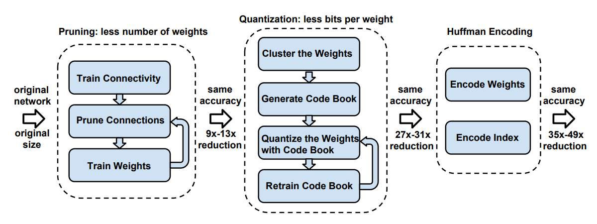
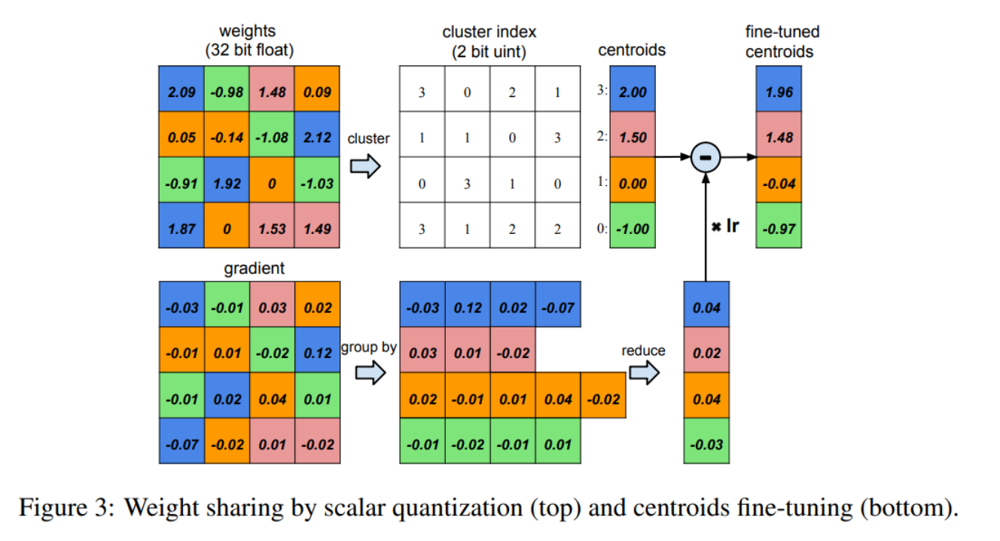

# Model Compression

Model compression techniques aim to make deep learning models smaller, faster, and more efficient, without severely sacrificing accuracy. The objective is to reduce computational and storage costs while maintaining acceptable performance.

## Core Compression Taxonomy

| Technique                                       | Main Idea                                                    | Advantages                                                   | Challenges                                                   |
| ----------------------------------------------- | ------------------------------------------------------------ | ------------------------------------------------------------ | ------------------------------------------------------------ |
| **Pruning / Sparsification**                    | Remove redundant weights, channels, or blocks to reduce model size and compute. | Reduces parameters and FLOPs; can preserve accuracy; structured pruning accelerates inference. | Unstructured pruning often yields no real speedup; requires retraining; hardware support varies. |
| **Quantization**                                | Lower numerical precision of weights/activations (FP32 → FP16/INT8/INT4). | Large memory savings; significant latency speedups on CPUs/NPUs; PTQ is simple. | Accuracy drop (especially INT8/INT4); requires calibration; QAT increases training complexity. |
| **Low-Rank Factorization**                      | Approximate weight matrices/tensors using low-rank decompositions (SVD, CP, Tucker). | Theoretically grounded; reduces parameters and compute; often preserves structure. | Hard to apply across all layers; rank selection is nontrivial; may require extensive fine-tuning. |
| **Knowledge Distillation**                      | Train a smaller “student” model to mimic a larger “teacher” model’s predictions/features. | Strong accuracy retention; model-agnostic; useful for large-to-small transfer. | Needs a high-quality teacher; training cost increases; unstable for some architectures. |
| **Efficient Architecture Design**               | Build models intrinsically efficient (e.g., depthwise convs, inverted bottlenecks, attention variants). | High accuracy–efficiency tradeoff; no complex compression pipeline; hardware-friendly. | Requires expert design or NAS; sometimes less flexible; may underperform large models without scaling. |
| **Neural Architecture Search (NAS)**            | Automatically search architectures optimized for accuracy, FLOPs, latency, or multi-objective constraints. | Can discover superior architectures; adaptable to specific devices; scalable. | Expensive search cost; requires hardware profiling; architectures may overfit to search space. |
| **Structural Reparameterization**               | Train with multi-branch blocks; merge branches into a single conv at inference (e.g., RepVGG). | Improves training stability and deployment speed; no accuracy loss; hardware-friendly. | Limited to specific architectures; adds complexity to training pipeline. |
| **Dynamic Inference / Conditional Computation** | Adjust compute at inference time (skip layers, prune tokens, early exit, MoE routing). | Saves substantial runtime compute; adaptive to input difficulty. | Hard to make stable; requires special hardware/compilers; unpredictable latency. |
| **Activation Compression**                      | Quantize, sparsify, or compress intermediate activations to reduce memory. | Reduces peak memory; enables large models on small devices; useful for training. | Hard to avoid accuracy degradation; complicates backprop; not always supported in deployment. |

## Latency benchmarking

Latency benchmark measure wall-clock inference time in ms. FLOPs reduction does not guarantee actual speedup. Latency benchmarking is the *only* way to verify true performance.

## References

- **Deep Compression: Compressing Deep Neural Networks with Pruning, Trained Quantization and Huffman Coding**. Song Han et.al. **arxiv**, **2015**, ([link](https://arxiv.org/abs/1510.00149v5)).

  -  “deep compression”, a three stage pipeline: pruning, trained quantization and Huffman coding

    
    
    - pruning: For each layer $l$, compute weight standard deviation $\sigma_l$. Define a **threshold** $t_l = s\cdot \sigma_l$ to filter the weights.
    
    - quantization and weight shared
    
      
    
      1. Centroid initialization: **Linear initialization** between min and max weight values is reported best
      2. Run 1D **k-means** clustering to obtain **centroids**
    
    - Huffman coding

- [MIT course](https://hanlab.mit.edu/courses/2024-fall-65940)，[HW](https://github.com/yan-roo/MIT-6.5940)