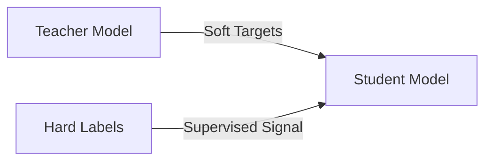

# Knowledge Distillation

### Concept

Knowledge distillation transfers the knowledge from a large, well-trained *teacher model* to a smaller *student model*. The student learns to approximate the teacher’s output distributions rather than merely the hard labels.

### Motivation

Teacher models often encode inter-class relationships within their soft output probabilities, known as *dark knowledge*. This information helps the student learn more efficiently.

### Mathematical Formulation

The student minimizes a combined loss:
$$
\mathcal{L} = (1 - \alpha) \mathcal{L}_{\text{CE}}(y, p_s) + \alpha T^2 \mathcal{L}_{\text{KL}}(p_t(T), p_s(T)),
$$
where

- $$ p_t, p_s $$: teacher and student outputs,
- $$ T $$: temperature for softening probabilities,
- $$ \alpha $$: balance coefficient between standard and distillation losses.

This schematic shows how a student network learns both from hard labels and the teacher’s softened predictions.

### Advantages

- The student achieves comparable accuracy with significantly fewer parameters.
- Enables efficient deployment without retraining large models.

### Applications

- Model compression for large-scale natural language processing and computer vision models.
- Transfer learning when labeled data are limited.
