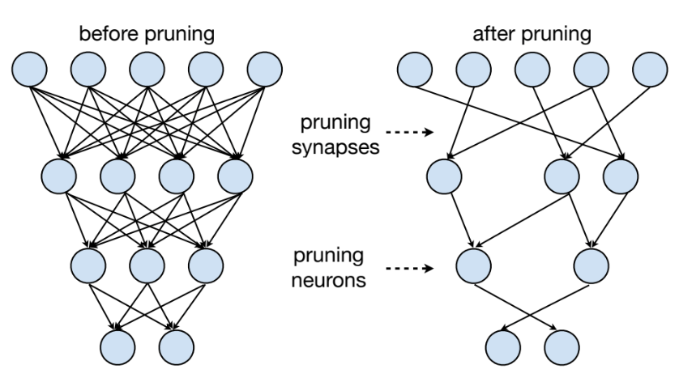
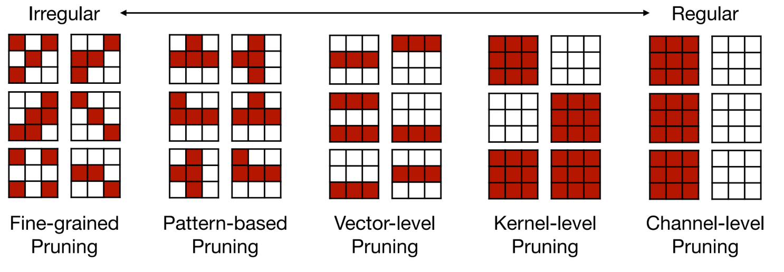
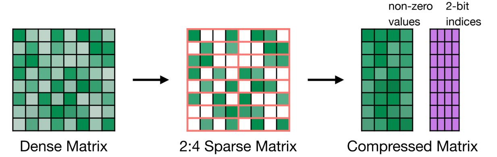
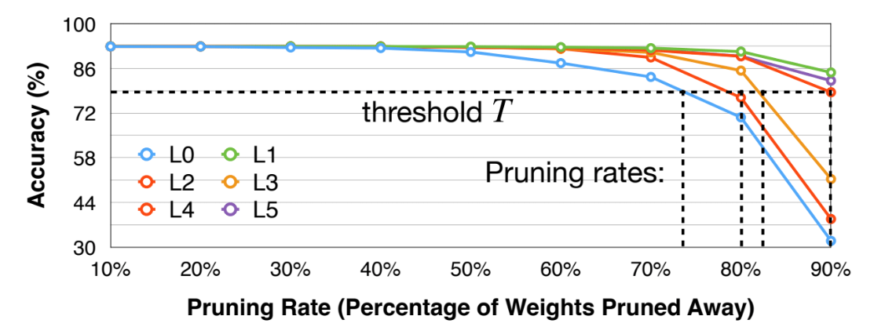
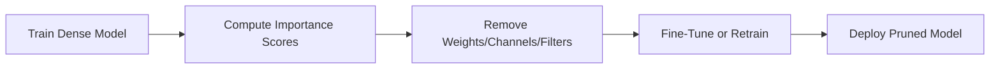
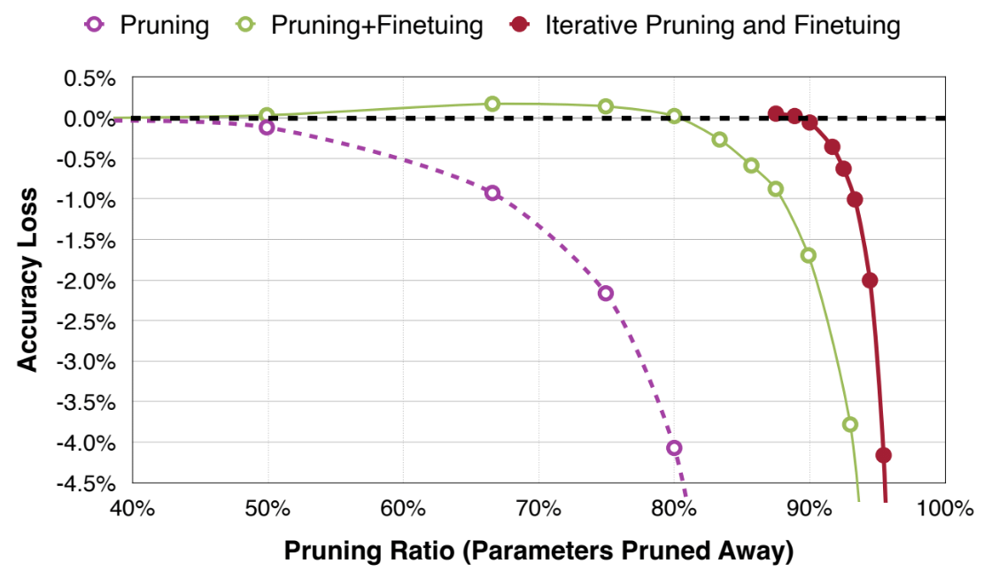

# Pruning and Sparsity

[TOC]

## Basic Concepts

- Pruning: Pruning removes redundant or unimportant parameters, such as neurons or weights, from a neural network to reduces model size and inference latency.

  - The underlying idea is that many parameters in large neural networks contribute little to the final predictions.

- Sparsity: Sparsity refers to the presence of many zero-valued weights or structured elements in a model after pruning.

  A model with sparsity level S% contains S% zeros in its parameters or operations.

  - Sparsity enables efficient inference because zero-valued computations can be skipped, especially with hardware or sparse kernel support.

## Pruning Granularity

> In what pattern should we prune the neural network?

- **Unstructured pruning**: Remove individual weights. Produces high sparsity but irregular patterns; harder to accelerate on standard hardware.

- **Structured pruning**

  - Remove entire:

  - Channels (filter pruning)
  - Filters
  - Blocks: Produces dense but smaller networks; more hardware-friendly.

- **Block or group pruning**

  -  Remove small groups of weights (e.g., 4×4 blocks).
  -  A compromise between unstructured and structured pruning.

- **Dynamic pruning**

  -  Prune during inference based on activation magnitude or input content.

Let’s look into some cases:

- Fine-grained Pruning

  - Flexible pruning indices
  - Usually larger compression ratio since we can flexibly find “redundant” weights (we will laterdiscuss how we find them)
  - Can deliver speed up on some custom hardware (e.g., EIE) but not GPU (easily)

- Pattern-based Pruning: N:M sparsity

  - N:M sparsity means that in each contiguous M elements, N of them is pruned
  - A classic case is 2:4 sparsity (50% sparsity)
  - It is supported by NVIDIA’s Ampere GPU Architecture, which delivers up to 2x speed up
  - Usually maintains accuracy (tested on varieties of tasks)

  

- Channel Pruning

  - Pro: Direct speed up due to reduced channel numbers (leading to an NN with smaller#channels)
  - Con: smaller compression ratio

## Pruning Criterion

> What synapses/neurons should we prune?

| Pruning Criterion                           | Description                                                  | Idea                                                         | How                                                          |
| ------------------------------------------- | ------------------------------------------------------------ | ------------------------------------------------------------ | ------------------------------------------------------------ |
| Magnitude-Based Pruning                     | Removes parameters with smallest absolute values; simple and widely used. | Weights with small absolute values contribute less to the network’s output and can be safely removed. | $\text{importance}(w) = |w|$ Remove those below a global or per-layer threshold. |
| Gradient-Based Pruning                      | Uses gradients to measure sensitivity of loss to each parameter. | If removing a weight does not significantly affect the loss, it is safe to prune. | $\text{importance}(w) = |w\cdot \frac{\partial L}{\partial w}|$ Prune weights with smallest scores. |
| Taylor-Based Pruning                        | Uses Taylor series approximation to estimate how removing a weight affects the loss. More theoretically grounded. **Less used in large-scale modern networks.** | Estimate the loss increase if a weight is removed (typically by setting it to zero). | First/Second-order approximation                             |
| BatchNorm Scaling Factor ($\gamma$) Pruning | Uses BN scaling factors to estimate channel importance in Conv–BN structures. Commonly used in Conv → BN → ReLU | The BatchNorm layer’s scaling factor γ\gammaγ indicates the relative importance of a channel. | Prune channels with the smalle values $\gamma$               |
| FLOPs-/Latency-Aware Pruning                | Prioritizes pruning components that most reduce computational cost or runtime on target hardware. | Prune components that yield the **largest reduction in FLOPs or inference time**, even if their magnitude or gradient seems significant. | Compute sensitivity score$\text{score} = \frac{\text{importance}}{\text{FLOPs contribution}}$ |
| Percentage-of-Zero-Based Pruning            | ReLU activation will generate zeros in the output activation. Similar to magnitude of weights, the Average Percentage of Zero activations (APoZ) can be exploited to measure the importance of the neurons. | The smaller APoZ is, the more importance the neuron has      | $\text{APoZ} = \frac{all ~ zeros}{all}$                      |
| Regression-based Pruning                    | Instead of considering the pruning error of the objective function, regression-based pruning minimizes the reconstruction error of the corresponding layer’s outputs | Minimize reconstruction error of the corresponding layer’s outputs | Solve the problem by: •Fix $W$ solve $\beta $ for channel selection •Fix $\beta$, solve $W$ to minimize reconstruction error |

## Pruning Ratio

> What should target sparsity be for each layer?

Non-uniform pruning is better than uniform shrinking. So we need to find Pruning Ratios at each layer.

- Analyze the sensitivity of each layer to determine the per-layer pruning ratio

  - Repeat checking the accuracy using different prune ratio for all layers
  - drawback: do not consider the interaction between layers

  

- Automatic Pruning: AMC: AutoML for Model Compression

  Pruning as a reinforcement learning problem.

## Fine-tune/Train Pruned Neural Network

> How should we improve performance of prunedmodels?

## Sparsity and Efficient Inference

### When Sparsity Helps

Sparsity helps inference only when:

- The model uses **structured sparsity**, or
- The hardware/library includes **sparse kernels**, or
- The hardware has **sparse execution units**.

### Sparse Kernel Support

Sparse kernels:

- Store weights in compressed formats (CSR, COO, block-sparse).
- Iterate only over non-zero elements.
- Skip zero multiplications.

### Hardware Support

Examples:

- **NVIDIA Ampere/Hopper**: 2:4 structured sparsity and Sparse Tensor Cores.
- **CPUs**: MKL/oneDNN sparse GEMM kernels.
- **Mobile accelerators (TPUs/NPUs)**: block sparsity, channel pruning, zero-skipping circuits.

## References

- [MIT slide1](https://www.dropbox.com/scl/fi/6qspcmk8qayy7mft737gh/Lec03-Pruning-I.pdf?rlkey=9jpifc92be0sitiknpbhn9ggf&e=1&st=lml94lam&dl=0)
