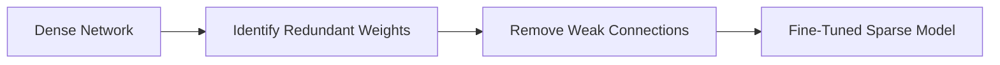

# Pruning

### Concept

Pruning removes redundant or unimportant parameters, such as neurons or weights, from a neural network. The underlying idea is that many parameters in large neural networks contribute little to the final predictions.

### Types

- **Weight Pruning:** Remove weights with magnitudes below a threshold.
- **Neuron/Filter Pruning:** Remove entire neurons or filters with low contribution.
- **Structured vs Unstructured Pruning:**
  - *Unstructured pruning* removes individual connections, resulting in sparse matrices that are difficult to optimize for hardware.
  - *Structured pruning* removes entire filters or channels, making models more hardware-friendly.

### Process

1. Train a large model.
2. Identify redundant weights or structures.
3. Prune them and fine-tune the model.

This figure represents how pruning eliminates weak or redundant connections in a neural network.

### Benefits

- Reduces model size and inference latency.
- Facilitates deployment on low-resource devices.

### Challenges

- Risk of accuracy degradation if pruning is too aggressive.
- Requires careful fine-tuning to recover lost performance.
