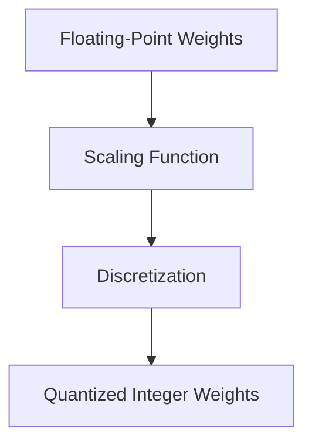

# Quantization

### Concept

Quantization converts high-precision (e.g., 32-bit floating point) weights and activations into lower-precision representations (e.g., 8-bit integers). This reduces both memory and computational demands.

### Techniques

- **Post-training Quantization:** Quantize after training a full-precision model.
- **Quantization-aware Training (QAT):** Simulate quantization effects during training to retain accuracy.
- **Dynamic Quantization:** Quantize weights while keeping activations in higher precision.

### Mathematical Formulation

Let a weight $$ w \in \mathbb{R} $$ be quantized into an integer $$ q \in \mathbb{Z} $$ using a scale factor $$ s $$:
$$
w \approx s \times q.
$$
This representation allows the model to perform integer arithmetic efficiently.

This figure shows how quantization maps continuous weights into discrete levels.

### Benefits

- Reduces memory footprint.
- Accelerates inference on hardware optimized for low-precision operations.
- Lowers power consumption.

### Trade-offs

- Possible loss of accuracy, especially for extremely low-bit quantization.
- Some operations (e.g., batch normalization) are difficult to quantize accurately.

## References

- <https://arxiv.org/pdf/2004.09602>
