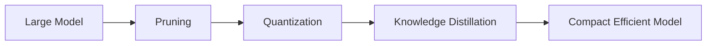

# Binary and Ternary Networks

### Concept

Binary and ternary networks restrict weights and activations to discrete values such as $$ \{-1, +1\} $$ or $$ \{-1, 0, +1\} $$. This represents an extreme form of quantization.

### Methods

- **BinaryConnect / BinaryNet:** Replace real-valued weights with sign values.
- **XNOR-Net:** Approximate convolutions using bitwise XNOR operations and bitcounting.

### Mathematical Approximation

For binary weights $$ w_b \in \{-1, +1\} $$, the forward computation approximates
$$
W * X \approx \alpha (\text{sign}(W) \odot X),
$$
where $$ \alpha $$ is a scaling factor to preserve the magnitude.

This illustration shows how binary networks perform efficient computations using binary arithmetic.

### Benefits

- Extremely small model size (up to 32× reduction).
- Fast inference using bitwise operations.

### Drawbacks

- Significant accuracy degradation for complex tasks.
- Partial binarization (keeping some layers full-precision) is often used to mitigate accuracy loss.

---

# Combining Techniques

In practice, model compression techniques are often combined for optimal results:

- **Pruning + Quantization:** Remove redundancy and reduce precision simultaneously.
- **Distillation + Quantization:** Use distillation to preserve accuracy in a quantized model.
- **AutoML / Neural Architecture Search (NAS):** Automate discovery of efficient architectures under compression constraints.

**Combined Compression Pipeline**: This pipeline diagram illustrates how compression techniques can be applied sequentially.

## References

- <https://arxiv.org/pdf/1603.05279>
- <https://arxiv.org/pdf/1511.00363>