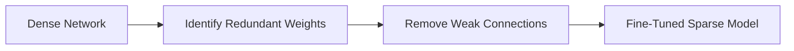
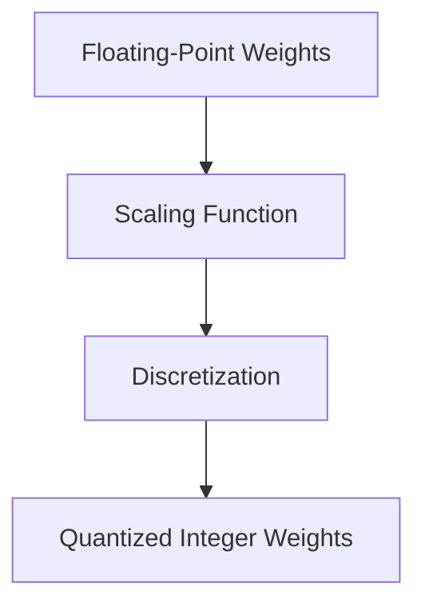
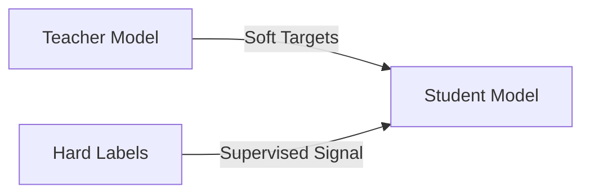
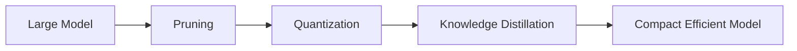

# Model Compression

Model compression techniques aim to make deep learning models smaller, faster, and more efficient, without severely sacrificing accuracy. The objective is to reduce computational and storage costs while maintaining acceptable performance.

---

# Pruning

### Concept

Pruning removes redundant or unimportant parameters, such as neurons or weights, from a neural network. The underlying idea is that many parameters in large neural networks contribute little to the final predictions.

### Types

- **Weight Pruning:** Remove weights with magnitudes below a threshold.
- **Neuron/Filter Pruning:** Remove entire neurons or filters with low contribution.
- **Structured vs Unstructured Pruning:**
  - *Unstructured pruning* removes individual connections, resulting in sparse matrices that are difficult to optimize for hardware.
  - *Structured pruning* removes entire filters or channels, making models more hardware-friendly.

### Process

1. Train a large model.
2. Identify redundant weights or structures.
3. Prune them and fine-tune the model.

This figure represents how pruning eliminates weak or redundant connections in a neural network.

### Benefits

- Reduces model size and inference latency.
- Facilitates deployment on low-resource devices.

### Challenges

- Risk of accuracy degradation if pruning is too aggressive.
- Requires careful fine-tuning to recover lost performance.

---

# Quantization

### Concept

Quantization converts high-precision (e.g., 32-bit floating point) weights and activations into lower-precision representations (e.g., 8-bit integers). This reduces both memory and computational demands.

### Techniques

- **Post-training Quantization:** Quantize after training a full-precision model.
- **Quantization-aware Training (QAT):** Simulate quantization effects during training to retain accuracy.
- **Dynamic Quantization:** Quantize weights while keeping activations in higher precision.

### Mathematical Formulation

Let a weight $$ w \in \mathbb{R} $$ be quantized into an integer $$ q \in \mathbb{Z} $$ using a scale factor $$ s $$:
$$
w \approx s \times q.
$$
This representation allows the model to perform integer arithmetic efficiently.

This figure shows how quantization maps continuous weights into discrete levels.

### Benefits

- Reduces memory footprint.
- Accelerates inference on hardware optimized for low-precision operations.
- Lowers power consumption.

### Trade-offs

- Possible loss of accuracy, especially for extremely low-bit quantization.
- Some operations (e.g., batch normalization) are difficult to quantize accurately.

---

# Knowledge Distillation

### Concept

Knowledge distillation transfers the knowledge from a large, well-trained *teacher model* to a smaller *student model*. The student learns to approximate the teacher’s output distributions rather than merely the hard labels.

### Motivation

Teacher models often encode inter-class relationships within their soft output probabilities, known as *dark knowledge*. This information helps the student learn more efficiently.

### Mathematical Formulation

The student minimizes a combined loss:
$$
\mathcal{L} = (1 - \alpha) \mathcal{L}_{\text{CE}}(y, p_s) + \alpha T^2 \mathcal{L}_{\text{KL}}(p_t(T), p_s(T)),
$$
where

- $$ p_t, p_s $$: teacher and student outputs,
- $$ T $$: temperature for softening probabilities,
- $$ \alpha $$: balance coefficient between standard and distillation losses.

This schematic shows how a student network learns both from hard labels and the teacher’s softened predictions.

### Advantages

- The student achieves comparable accuracy with significantly fewer parameters.
- Enables efficient deployment without retraining large models.

### Applications

- Model compression for large-scale natural language processing and computer vision models.
- Transfer learning when labeled data are limited.

---

# Binary and Ternary Networks

### Concept

Binary and ternary networks restrict weights and activations to discrete values such as $$ \{-1, +1\} $$ or $$ \{-1, 0, +1\} $$. This represents an extreme form of quantization.

### Methods

- **BinaryConnect / BinaryNet:** Replace real-valued weights with sign values.
- **XNOR-Net:** Approximate convolutions using bitwise XNOR operations and bitcounting.

### Mathematical Approximation

For binary weights $$ w_b \in \{-1, +1\} $$, the forward computation approximates
$$
W * X \approx \alpha (\text{sign}(W) \odot X),
$$
where $$ \alpha $$ is a scaling factor to preserve the magnitude.

This illustration shows how binary networks perform efficient computations using binary arithmetic.

### Benefits

- Extremely small model size (up to 32× reduction).
- Fast inference using bitwise operations.

### Drawbacks

- Significant accuracy degradation for complex tasks.
- Partial binarization (keeping some layers full-precision) is often used to mitigate accuracy loss.

---

# Combining Techniques

In practice, model compression techniques are often combined for optimal results:

- **Pruning + Quantization:** Remove redundancy and reduce precision simultaneously.
- **Distillation + Quantization:** Use distillation to preserve accuracy in a quantized model.
- **AutoML / Neural Architecture Search (NAS):** Automate discovery of efficient architectures under compression constraints.

**Combined Compression Pipeline**: This pipeline diagram illustrates how compression techniques can be applied sequentially.

---

# Applications

| Application            | Objective                                 | Typical Techniques         |
| ---------------------- | ----------------------------------------- | -------------------------- |
| Mobile and Embedded AI | Reduce memory and latency                 | Quantization, pruning      |
| Edge Computing         | Efficient deployment on low-power devices | Pruning, distillation      |
| Large Language Models  | Minimize inference cost                   | Distillation, quantization |
| Autonomous Systems     | Real-time inference                       | Structured pruning         |

---

# Summary

| Technique               | Main Idea                          | Advantages                     | Challenges             |
| ----------------------- | ---------------------------------- | ------------------------------ | ---------------------- |
| Pruning                 | Remove redundant weights           | Reduces size, faster inference | Needs fine-tuning      |
| Quantization            | Lower numerical precision          | Memory and energy efficiency   | Accuracy degradation   |
| Knowledge Distillation  | Transfer from large to small model | High efficiency                | Requires teacher model |
| Binary/Ternary Networks | Extreme quantization               | Maximum compression            | Accuracy drop          |

# References

- [(39 封私信 / 80 条消息) 量化、剪枝、蒸馏、二值化](https://zhuanlan.zhihu.com/p/1888965050078839746)
- <https://arxiv.org/pdf/1603.05279>
  <https://arxiv.org/pdf/2004.09602>
  <https://arxiv.org/pdf/1511.00363>
  <https://static.googleusercontent.com/media/research.google.com/en//pubs/archive/37631.pdf>
