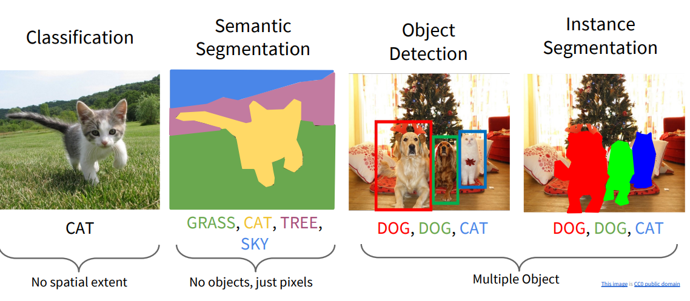

# Object Detection Basics

- **Objective**: Understand the core principles of object detection, including bounding boxes, IoU, and evaluation metrics.

- **Key Concepts**:
  - **Bounding boxes and Intersection over Union (IoU)**
  - **Precision, recall, and F1-score** for object detection
  - **One-stage vs. Two-stage detectors** (YOLO vs. Faster R-CNN)

<!--more-->

## Computer Vision Tasks

## Bounding boxes

- what: Bounding boxes (bboxes) are the fundamental representation used in object detection to localize objects in an image. A bounding box is typically defined as an axis-aligned rectangle.
- why:
  - Provide spatial localization of objects.
  - Serve as the basis for regression targets in detection networks (YOLO, Faster R-CNN, SSD).
  - Essential for computing evaluation metrics such as IoU, AP, and mAP.
- how: common parameterizations
  - Corner format: $(x_{min},y_{min},x_{max},y_{max})$
  - Center format: $(x_{center},y_{center},w,h)$
  - YOLO format (normalized): $(x_{center},y_{center},w,h)\in [0,1]$

- bbox regression
  - what: **Bounding box regression** is a small regression module that, given features for a box, predicts a **refinement** (offsets) that moves the box closer to the ground-truth object box.
  - why: Region proposals (Selective Search, RPN anchors, etc.) are **rough** boxes:
    - They often overlap the object but are not perfectly aligned.
    - Classification alone (“this ROI is a car”) does not fix misalignment.

## Object Detection Evaluation Metrics

|                | Positive Prediction | Negative Prediction |
| -------------- | ------------------- | ------------------- |
| Positive Class | True Positive (TP)  | False Negative (FN) |
| Negative Class | False Positive (FP) | True Negative (TN)  |

| Metric                     | What It Measures                                             | How It’s Computed                                            | Why It’s Important                                           |
| -------------------------- | ------------------------------------------------------------ | ------------------------------------------------------------ | ------------------------------------------------------------ |
| **IoU**                    | Overlap quality between predicted and ground-truth boxes     | $\text{IoU} = \frac{\text{Intersection}}{\text{Union}}$      | Determines TP/FP, basis for AP/mAP, used in IoU-based losses |
| **Precision**              | Correctness of detections                                    | $\frac{TP}{TP + FP}$                                         | Reflects false positives; high precision = fewer wrong detections |
| **Recall**                 | Coverage of true objects                                     | $\frac{TP}{TP + FN}$                                         | Reflects false negatives; high recall = finds more objects   |
| **F1-score**               | Balance between precision and recall                         | $F1= 2\cdot\frac{P\cdot R}{P + R}$                           | Single score for threshold tuning; helpful for model deployment |
| **PR Curve**               | Relationship between precision and recall across confidence levels | Plot Precision vs. Recall after sorting detections by confidence | Shows trade-off behavior; used to compute AP                 |
| **AP (Average Precision)** | Area under PR Curve for one class                            | COCO: integral of PR curve; VOC: 11-point interpolation      | Class-wise performance combining precision, recall, IoU      |
| **mAP (mean AP)**          | Mean of AP over all classes                                  | $mAP=\frac{1}{N}\sum_{c=1}^N AP_c$                           | Primary benchmark metric; standard for VOC/COCO              |
| **AR (Average Recall)**    | Mean recall at various IoU thresholds and detection limits   | COCO AR@1, AR@10, AR@100                                     | Measures detection coverage (ability to find GTs)            |

## One-Stage Object Detectors

- what: One-stage object detectors are a category of detection architectures that **directly predict bounding boxes and class probabilities in a single forward pass**, without a separate region proposal stage. 

  Examples include: YOLO / SSD / RetinaNet / FCOS / EfficientDet

- why:

  - Advantages
    1. **High Speed**: Suitable for real-time tasks
    2. **Simpler Architecture**
       - Easier to deploy on embedded and mobile devices.
       - Fewer components and fewer dependencies.
    3. **End-to-End Training**
       - Direct optimization of detection outputs.
       - Often more stable and faster to train.
    4. **Better for Dense Predictions**: like Autonomous driving / Robotics / Surveillance / Embedded edge devices

  - Limitations
    1. Historically lower localization accuracy than two-stage models (narrowed significantly with FCOS, YOLOv8).
    2. Sensitive to class imbalance (RetinaNet solved this via Focal Loss).
    3. Dense predictions → many overlapping boxes → need strong NMS strategies.

- how:
  - pipeline: A single-stage detector consists of three major components:
    1. Backbone
       - Feature extractor (e.g., ResNet, MobileNet, CSPDarknet).
       - Produces multi-scale feature maps.
    2. Neck (optional but common)
       - FPN, PANet, BiFPN, etc.
       - Enhances multi-level features, important for small-object detection.
    3. Head: Directly outputs:
       - Bounding box regression
       - Object/confidence score
       - Class probabilities

### Representative Models

- **YOLO series**: Strong speed-accuracy tradeoff; widely used.
- **SSD**: Early one-stage detector leveraging multi-scale feature maps.
- **RetinaNet**: Introduced *Focal Loss* to solve foreground-background imbalance.
- **FCOS**: First popular anchor-free detector; uses center-based prediction.
- **YOLOv8/future models**: Fully anchor-free, decoupled heads, IoU losses.

## Two-Stage Object Detectors

Faster R-CNN

- what: 

  1. Stage 1: Find possible object regions called **region proposals**.
     The model scans the image and proposes a small set of *candidate regions* that *might* contain objects.

  2. Stage 2: Classify + refine each region
      For each proposed region, another network:

     - classifies what object it might be

     - adjusts the bounding box to be more accurate

- why:
  - Advantages
    1. **High Accuracy**
    2. **Better for complex scenes**: Useful when objects overlap densely or vary strongly in scale.
    3. **Flexible and easily extended**: Mask R-CNN adds segmentation with minimal modifications.
  - Limitations
    1. Slower than one-stage detectors
    2. Heavier architectures
    3. Harder to deploy on mobile or edge devices

- how

  Stage 1: Region Proposal Network (RPN)

  - Takes backbone feature maps.
  - Predicts objectness scores + bounding box offsets for anchor boxes.
  - Produces ~200–300 high-quality proposals.

  Stage 2: ROI Head

  - Extract features for each proposal using ROI Pooling / ROI Align.
  - Feed into a small **classifier + regressor**.
  - Outputs: $\text{bbox offsets},\text{class probabilities}$

## Comparison: One-Stage vs Two-Stage

| Aspect       | One-Stage                                    | Two-Stage                     |
| ------------ | -------------------------------------------- | ----------------------------- |
| Architecture | Single feedforward                           | Region proposals + refinement |
| Speed        | Very fast                                    | Slower                        |
| Accuracy     | High but slightly below top two-stage models | Traditionally higher accuracy |
| Complexity   | Simpler                                      | More complex                  |
| Anchors      | Common (YOLO/SSD)                            | Yes (Faster R-CNN)            |
| Deployment   | Embedded-friendly                            | Heavy models not ideal        |

## FPN(Feature Pyramid Network)

- what: FPN is a **multi-scale feature extraction architecture** designed to help detectors recognize objects of different sizes by combining:

  1. **high-resolution, low-semantic features** (good for small objects)
  2. **low-resolution, high-semantic features** (good for large objects)

  It constructs a **feature pyramid** from a single input image, similar to classical computer vision image pyramids.

- Why FPN Is Needed: CNN backbones (ResNet, VGG, CSPDarknet) naturally produce a hierarchy of feature maps:

  - Early layers:
    - High spatial resolution
    - Low semantic meaning
  - Deeper layers:
    - Low spatial resolution
    - High semantic meaning

  This is a problem for detection because:

  - Small objects need high-resolution features
  - Large objects need deep semantic features

  FPN solves this by producing **multi-scale feature maps with strong semantics at all scales**.

## Anchor-Based

Anchor-based methods rely heavily on heuristics.

### What Are Anchors

Anchors are **predefined bounding boxes** placed densely and uniformly over feature maps at multiple FPN levels.

Each anchor is defined by:

- scale $s$
- aspect ratio $r = \frac{w}{h}$
- center location $(x,y)$

Thus, each feature location corresponds to **k anchors**, typically:

- YOLOv3: k=3 per level
- SSD: k=6
- RetinaNet: k=9
- Faster R-CNN (RPN): k=3

Formally, each anchor \(a\) is parameterized as:

$$
a = (x_a, y_a, w_a, h_a)
$$

The model predicts an offset relative to the anchor:

$$
t = (\Delta x, \Delta y, \Delta w, \Delta h)
$$

Bounding box decoding:

$$
x = x_a + \Delta x w_a,\quad y = y_a + \Delta y h_a \\
w = w_a \exp(\Delta w),\quad h = h_a \exp(\Delta h)
$$

### Why Anchor-Based?

Historically anchors solved:

1. **Scale variation**: multiple anchor sizes detect multi-scale objects
2. **Aspect ratio variation**
3. **Training stability**: early detectors needed predefined priors
4. **Dense predictions**: systematizes regression targets on feature grids

However, anchors have downsides:

- require careful hyperparameter tuning
- complex matching strategies
- many negative samples → class imbalance
- anchor design affects model accuracy and convergence

### How Anchor-Based Label Assignment Works

Anchor-based methods need a **matching rule** to decide which anchor corresponds to which ground-truth box.

**Common assignment (RetinaNet, YOLOv3, RPN):**

- Positive if IoU(anchor, GT) ≥ threshold (e.g., 0.5)
- Negative if IoU(anchor, GT) < low threshold (e.g., 0.4)
- Ignore the rest

This process is called: label assignment / anchor matching / positive/negative sampling

The training target for each anchor includes:

- objectness
- class label
- box regression offsets

This creates **dense** prediction tasks: tens of thousands of anchors per image.

## Anchor-Free

### What Are Anchors-Free

Anchor-free detectors directly predict bounding box coordinates **without predefined anchor priors**.

Typical formulations:

- Keypoint-based (CornerNet, CenterNet)
- Center-based (FCOS, YOLOv8, YOLOX)
- Point-based (DETR)

### Why Anchor-Free?

Anchor-free advantages:

1. Cleaner formulation
2. Better generalization
3. Less hyperparameters
4. Better small-object performance
5. Simpler and faster training
6. Naturally compatible with transformers (DETR)

Modern top detectors (YOLOv8, YOLOX, FCOS) are now predominantly anchor-free.

### Label Assignment in Anchor-Free

Anchor-free detectors use **center sampling** or **mask-based assignment**.

### Representative Models

- Anchor-Based

  - **Faster R-CNN** (anchor-based RPN)

  - **RetinaNet** (anchor-based dense regression + Focal Loss)

  - **YOLOv2/3** (hand-designed anchor priors)

  - **SSD** (multi-scale anchor mechanism)

- Anchor-Free

  - **FCOS** (center-based, dense regression)

  - **CornerNet/CenterNet** (keypoint-based)

  - **YOLOX / YOLOv8** (center-based + OTA assignment)

  - **DETR** (query-based transformer; no NMS, no anchors)

## NMS(Non-maximum suppression)

NMS removes redundant bounding boxes in object detection. It does so by removing boxes with an **overlap greater than a threshold** which we set manually.

The overlap treshold determines the overlap in area two bounding boxes are allowed to have. If they overlap more, then one of the two will be discarded.

## References

- https://cs231n.stanford.edu/slides/2024/lecture_9.pdf?utm_source=chatgpt.com

- [NMS](https://towardsdatascience.com/non-maxima-suppression-139f7e00f0b5/)
- [Anchor Boxes](https://towardsdatascience.com/anchor-boxes-the-key-to-quality-object-detection-ddf9d612d4f9/)

- practice: https://docs.pytorch.org/tutorials/intermediate/torchvision_tutorial.html

 	
