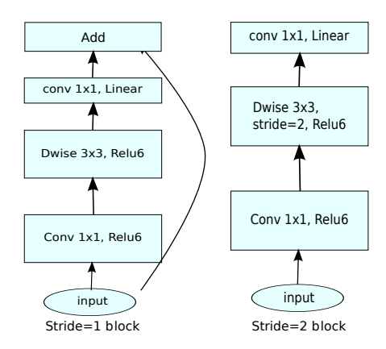
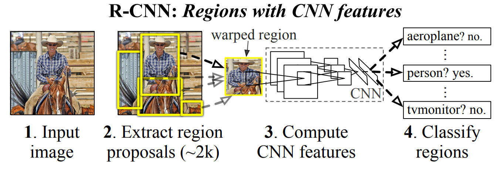
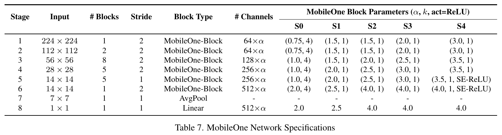
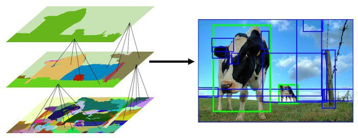

# Lightweight Models

Focus on lightweight models and their optimizations for embedded systems.

- ResNet (residual learning)
- MobileNet v1 (depthwise conv)
- MobileNet wv2 (Inverted Residual + Linear Bottleneck)
- ShuffleNet (channel shuffle)
- GhostNet (Ghost Module – Cheap Operations)

## Lightweight Nets

- **MobileNets: Efficient Convolutional Neural Networks for Mobile Vision Applications**. Andrew G. Howard et.al. **arxiv**, **2017**, ([link](https://arxiv.org/abs/1704.04861v1)).

  - Depthwise Separable Convolutions(DSC)

  - two simple global hyperparameters that efficiently trade off between latency and accuracy

    - width multiplier $\alpha$: thinner models, controls the number of channels in each layer

    - resolution multiplier $\rho$: reduce the computational cost, controls the input image resolution
      $$
      D_K \times D_K \times \alpha M \times \rho D_F \times \rho D_F+\alpha M \times \alpha N \times  \rho D_F \times \rho D_F
      $$
      

  - less regularization and data augmentation techniques because small models have less trouble with overfitting

- **MobileNetV2: Inverted Residuals and Linear Bottlenecks**. Mark Sandler et.al. **arxiv**, **2018**, ([link](https://arxiv.org/abs/1801.04381v4)).

  - linear bottlenecks

    A **Linear Bottleneck** refers to the **final 1×1 convolution layer** in the inverted residual block, but with a **key difference**: it **does not use a non-linearity** (like ReLU) after this convolution.

  - Inverted residuals

    - Normal bottleneck use $1\times 1$ layers to reduce and then increase(restore) dimensions, which helps in reducing computational cost. However, this comes with a trade-off, as you need to balance the reduction in dimensions with the need to preserve sufficient information.
    - Inverted residuals use $1\times 1$ layers to increase and then reduce dimensions

  - a novel layer module: the inverted residual with linear bottleneck

    1. **Expansion**:
        The input is first passed through a **1×1 convolution** that **expands** the number of channels, increasing the model’s representational capacity.
    2. **Depthwise Separable Convolution**:
        After the expansion, a **depthwise separable convolution** (which is more computationally efficient than a regular convolution) is applied. This operation is performed on each channel separately, rather than combining all channels together, reducing the number of parameters and computation.
    3. **Projection (Linear Bottleneck)**:
        The **output** of the depthwise separable convolution is then passed through a **1×1 convolution** that **projects** the feature map back to a smaller number of channels.

    

    > Notes: ReLU6: $y = min(max(x,0),6)$, cut the value in 6

  - remove non-linearities in the narrow layers in order to maintain representational power

- **ShuffleNet: An Extremely Efficient Convolutional Neural Network for Mobile Devices**. Xiangyu Zhang et.al. **arxiv**, **2017**, ([link](https://arxiv.org/abs/1707.01083v2)).

  - Group convolutions and shuffling

    

- **GhostNet: More Features from Cheap Operations**. Kai Han et.al. **arxiv**, **2019**, ([link](https://arxiv.org/abs/1911.11907v2)).

- **Rich feature hierarchies for accurate object detection and semantic segmentation**. Ross Girshick et.al. **arxiv**, **2013**, ([link](https://arxiv.org/abs/1311.2524v5)).

  > R-CNN: Regions with CNN features

  - CNN on region proposals (Selective Search).

    

    -  Module design: Region proposals(Selective Search) + Feature extraction(4096-dimensional vector using pre-trained CNN) +  classspecific linear SVMs
    - drawback: multi-stage / non end-to-end, slow, require large disk space

  - To solve the labeled datais scarce: use unsupervised pre-training, followed by supervised fine-tuning/supervised pre-training on a large auxiliary dataset (ILSVRC), followed by domainspecific fine-tuning on a small dataset(is also effective)

- **Fast R-CNN**. Ross Girshick et.al. **arxiv**, **2015**, ([link](https://arxiv.org/abs/1504.08083v2)).

  - Run the CNN once per image to get a feature map, then use **ROI pooling** to reuse convolutional features for all proposals. Train classification and bbox regression jointly with a single softmax + regression head.

    

    > how to project: using the network’s total stride sss to map box coordinates from image space to feature-map space: divide coordinates by sss, then crop that sub-region from the conv feature map.

    - Joint loss: classification cross-entropy + smooth L1 bbox regression loss.
    - The RoI pooling layer uses max pooling to convert the features inside any valid region of interest into a small feature map with a fixed spatial extent of H × W (e.g., 7 × 7).

  - drawbacks:
    - Proposals are the test-time computational bottleneck in state-of-the-art detection systems.

- **Faster R-CNN: Towards Real-Time Object Detection with Region Proposal Networks**. Shaoqing Ren et.al. **arxiv**, **2015**, ([link](https://arxiv.org/abs/1506.01497v3)). 

  - Introduce the **Region Proposal Network (RPN)** that uses the same convolutional feature maps as the detector to predict proposals (objectness + bbox) in a fully convolutional way. This removes external proposal methods and makes proposal generation almost free.

    

    Faster R-CNN is a single, unified network for object detection. The RPN module serves as the ‘attention’ of this unified network.

  - drawbacks: 

    - relatively heavy / two-stage: 1.RPN to generate proposals. 2.ROI head to classify and refine them.
    - Anchor-based design: many hyperparameters, inefficiency

- **SSD: Single Shot MultiBox Detector**. Liu Wei et.al. **No journal**, **2016**, ([link](https://doi.org/10.1007/978-3-319-46448-0_2)).

  - Architecture

    

    - Eliminate proposal generation and resampling entirely.
    - Base Network + Extra Feature Layers(a **pyramid of feature maps**)

  - drawbacks:

    - Performance on **very small objects** is weaker than some later methods (e.g., FPN-based detectors), since SSD relies on relatively shallow high-resolution maps with limited semantics.
    - Using **VGG-16** as backbone is parameter-heavy and not as efficient as later ResNet/MobileNet/ResNeXt backbones.
    - The hand-designed scales/aspect ratios of default boxes require tuning for new datasets.

- **Mask R-CNN**. Kaiming He et.al. **arxiv**, **2017**, ([link](https://arxiv.org/abs/1703.06870v3)).

- **MobileOne: An Improved One millisecond Mobile Backbone**. Pavan Kumar Anasosalu Vasu et.al. **arxiv**, **2022**, ([link](https://arxiv.org/abs/2206.04040v2)).

  - The relationship between these two indicators( floating-point operations (FLOPs) and parameter count) and the specific latency of the model is not so clear. For the specific latency, we should also consider memory access cost(MAC) and degree of parallelism.

  - Architectural Blocks(MobileOne block)

    

    - Use structural re-parameterization to decouple the *training* architecture from the *inference* architecture

      - training time: each of those convs (depthwise and pointwise) is expanded into a multi-branch structure (over-parameterized)

      - inference time: all these branches are algebraically fused into a single conv per stage, so the runtime block is very simple

        > Straight cylinder shape： this structure is chosen to minimize latency and memory access cost on mobile hardware.

      - the DSC module is integrated by "scale branch", "skip branch" and "conv branches"

        - `rbr_scale`: center-only 1×1 path (after padding) that improves channel-wise scaling flexibility
        - `rbr_skip`: identity + BN path providing residual-like behavior and extra affine freedom
        - `rbr_conv`: main expressive conv paths (3×3 or 1×1)

    

    - using shallower early stages where input resolution is larger as these layers are significantly slower compared to later stages which operate on smaller input resolution

## Some useful structure

### Depthwise Separable Convolutions(DSC)

> - **Evaluation Of Trainable Parameters**
> - **Evaluation Of Computational Cost**

- why: The main reason for using DSC is **efficiency**. It significantly reduces the computational cost and the number of parameters compared to standard convolutions. And it also maintain performance.(a bit worse)

- what: Depthwise Separable Convolutions (DSC) are a variant of the standard convolution operation used in Convolutional Neural Networks (CNNs). Unlike regular convolutions, DSC splits the convolution operation into two parts:

  1. A **depthwise grouped convolution**, w[here](https://pytorch.org/docs/stable/generated/torch.nn.Conv2d.html) the number of input channels m is equal to the number of output channels such that each output channel is affected only by a single input channel. In PyTorch, this is called a "grouped" convolution.
  2. A **pointwise convolution** (filter size=1), which operates like a regular convolution such that each of the n filters operates on all m input channels to produce a single output value.

- how: For an input feature map of size \( $H \times W \times C $\) (Height x Width x Channels):

  - **Standard Convolution** would use $ K_h \times K_w \times C_{in} \times C_{out} $ parameters, where $ K_h $  and $ K_w $ are the height and width of the kernel, $ C_{in} $ is the number of input channels, and $ C_{out} $ is the number of output channels.

  - **Depthwise Separable Convolution** would use:
    - $$ K_h \times K_w \times C_{in} $$ parameters for the depthwise convolution
    - $$ 1 \times 1 \times C_{in} \times C_{out} $$ parameters for the pointwise convolution.

  This reduces the number of parameters and the computational complexity.

  ```
  # a tiny example
  class DepthwiseSeparableConv(nn.Module):
      def __init__(self, in_channels, out_channels, kernel_size, stride=1, padding=0):
          super(DepthwiseSeparableConv, self).__init__()
  
          # Depthwise Convolution
          self.depthwise = nn.Conv2d(in_channels, in_channels, kernel_size=kernel_size,
                                      stride=stride, padding=padding, groups=in_channels)
  
          # Pointwise Convolution
          self.pointwise = nn.Conv2d(in_channels, out_channels, kernel_size=1)
  
      def forward(self, x):
          # Apply depthwise convolution
          x = self.depthwise(x)
          # Apply pointwise convolution
          x = self.pointwise(x)
          return x
  
  # Example of using the Depthwise Separable Convolution layer
  input_tensor = torch.randn(1, 3, 64, 64)  # Example input with batch size 1, 3 channels, 64x64 image
  model = DepthwiseSeparableConv(in_channels=3, out_channels=16, kernel_size=3, stride=1, padding=1)
  output_tensor = model(input_tensor)
  
  print(f'Output shape: {output_tensor.shape}')
  ```

### Selective Search

The most straightforward way to generate smaller sub-regions (patches) is called the Sliding Window approach. However, the sliding window approach has several limitations. These limitations are overcome by a class of algorithms called the “Region Proposal” algorithms. Selective Search is one of the most popular Region Proposal algorithms.

Region proposal algorithm work by grouping pixels into a smaller number of segments.

Selective Search algorithm takes these oversegments as initial input and performs the following steps

1. Add all bounding boxes corresponding to segmented parts to the list of regional proposals
2. Group adjacent segments based on similarity
3. Go to step 1

At each iteration, larger segments are formed and added to the list of region proposals. Hence we create region proposals from smaller segments to larger segments in a bottom-up approach. This is what we mean by computing “hierarchical” segmentations using Felzenszwalb and Huttenlocher’s oversegments.




## References

- [Depthwise Convolution explanation]( https://towardsdatascience.com/a-basic-introduction-to-separable-convolutions-b99ec3102728)
- [MobileNetv2 explanation]( https://ai.googleblog.com/2018/04/mobilenetv2-next-generation-of-on.html)
- [MobileNetV2 explained video](https://www.youtube.com/watch?v=DkNIBBBvcPs)
- [MobileNetV1](https://research.google/blog/mobilenets-open-source-models-for-efficient-on-device-vision/?_gl=1)
- https://learnopencv.com/selective-search-for-object-detection-cpp-python/
