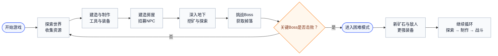
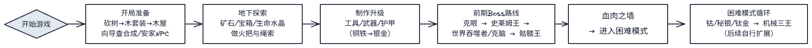

# 泰拉瑞亚新手攻略

## 一、游戏简介
《泰拉瑞亚》（Terraria）是一款2D沙盒冒险游戏，融合了探索、建造、生存与战斗等要素。玩家在随机生成的世界中采集资源、建造房屋、击败怪物、挑战Boss，并逐步推进世界的发展阶段。

主要玩法包括：
- 探索地表、地下、海洋、天空岛、地狱等多层地图
- 建造与制作各类工具、武器、护甲与家具
- 招募NPC提供服务与交易
- 挑战Boss并解锁更高阶段的内容

---

## 二、游戏基本逻辑

## 三、新手入门指南

### 1. 开局准备
- 创建角色与世界（建议普通难度，中型地图）
- 初始向导NPC可提供合成配方查询
- 第一天主要任务：
  - 使用斧头砍树
  - 制作基础工具
  - 建造木屋（防怪与NPC入住）

房屋要求：
- 封闭的墙壁
- 一扇门
- 一张桌子和一把椅子
- 光源（火把或灯）

---

### 2. 探索与采矿
- 从地表向下挖掘，收集矿石（铜、铁、银、金等）
- 制作更好的工具与护甲
- 寻找宝箱与心形水晶（提升生命值）
- 注意陷阱与岩浆，保持照明

---

### 3. 战斗与成长
- 怪物掉落材料可制作更强装备
- 探索腐化/血腥地等特殊区域以获得稀有材料
- 初期Boss推荐：
  - 史莱姆王（Slime King）
  - 克苏鲁之眼（Eye of Cthulhu）
- 击败Boss后可制作更强装备并解锁新区域

---

### 4. 招募与建设
NPC入住条件与功能如下：

| NPC    | 招募条件     | 功能           |
| ------ | ------------ | -------------- |
| 商人   | 拥有50银币   | 售卖基础物品   |
| 护士   | 使用生命水晶 | 回复生命       |
| 军火商 | 拥有枪支     | 售卖枪械与子弹 |
| 向导   | 默认存在     | 提供合成帮助   |

建议为不同NPC分区建房，以提升幸福度和降低商店价格。

---

### 5. 进入困难模式
击败“血肉之墙”（Wall of Flesh）后进入困难模式，解锁：
- 新矿石（钴、秘银、钛金）
- 新Boss与怪物
- 新生物群系
- 新装备与NPC

这是游戏的中后期阶段，内容复杂且挑战更高。

---

## 四、新手实用建议
1. 火把与绳索是必备工具，用于照明与攀爬。
2. 使用迷你地图定位与导航。
3. 定期将金钱存入储物箱，防止死亡掉落。
4. 合理布置NPC房屋，方便购买药水与装备。
5. 使用床设置重生点，减少死亡惩罚。
6. 死亡是学习的一部分，不必过度担心。

---

## 五、新手推荐装备

| 阶段       | 推荐武器           | 推荐护甲       |
| ---------- | ------------------ | -------------- |
| 初期       | 木剑、铁剑、长矛   | 铜或铁护甲     |
| 中期       | 火焰之剑、弓、手枪 | 银或金护甲     |
| 前期Boss后 | 草之刃、恶魔镰刀   | 暗影或熔岩护甲 |

---

## 六、角色发展路线
玩家可根据喜好选择发展方向：

| 流派     | 特点               |
| -------- | ------------------ |
| 战士流   | 近战攻击与高防御   |
| 射手流   | 远程弓箭与枪械     |
| 法师流   | 使用魔法武器与法杖 |
| 召唤流   | 召唤随从协助战斗   |
| 探险家流 | 以建造与探索为主   |

---

## 七、探索路线概览
从出生点出发，向下探索的主要层次如下：

1. 出生点（森林地表）  
2. 地穴（浅层矿石与怪物）  
3. 地下层（宝箱、矿石、蘑菇洞）  
4. 地狱（高风险区域，通往困难模式的入口）

推荐在深入前充分准备装备与药水。
