## Main Takeaway

我要将健身变成我一个终身都会进行的运动，这里记录一下

<!--more-->

# Intro

科学健身，先要了解身体部位以及不同的肌肉

下面我要分别介绍不同的身体肌肉，以及如何使用不同的器械进行锻炼

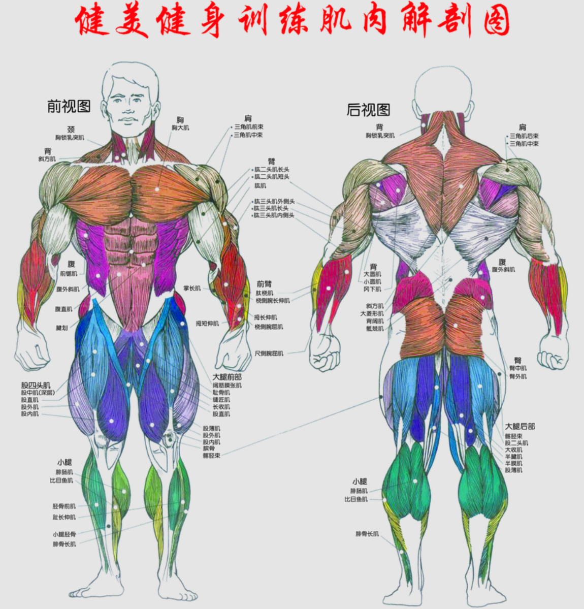

效率至上

# 胸

- 卧推

- 上斜推胸

- 下斜推胸：提升厚度和轮廓

  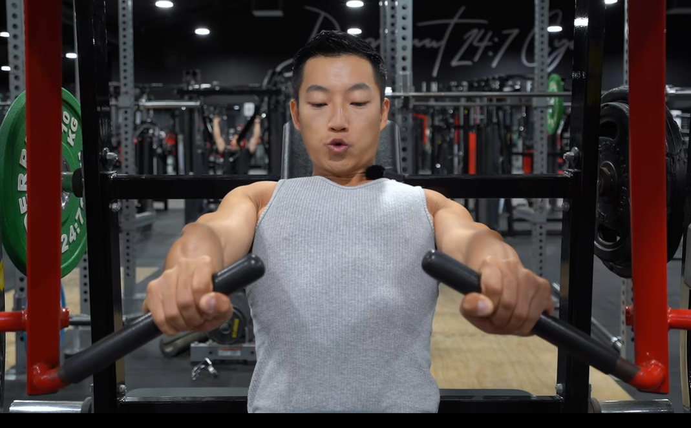

  - 坐姿：调整高度握把在下胸部位即可
  - 握把：窄握收缩会更明显，握外侧对胸肌外侧刺激会更明显（肩关节和肱三头肌也会参与）
  - 推：顶峰保持再回收
  - 4组，每组10~12次，组间2mins即可

# 肩

# 背

背部是一个非常庞大的肌群，包括：背阔肌，斜方肌，大圆肌，小圆肌，菱形肌，竖脊肌

- 引体向上：多功能多肌肉参与

  - 原理：

    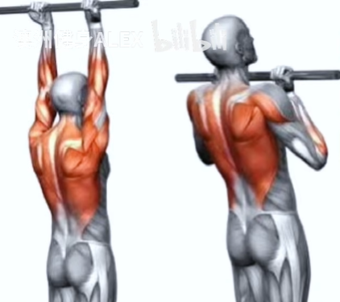

    基本上肢都会参与，背部+手臂，肩膀胸肌核心，肌肉协调性也很重要

  - challenge1：克服身体的摆动——静态悬挂，手臂+核心，训练稳定性

    - 4\~5组，每组20\~30s，组间1min即可

  - challenge2：慢速下降

    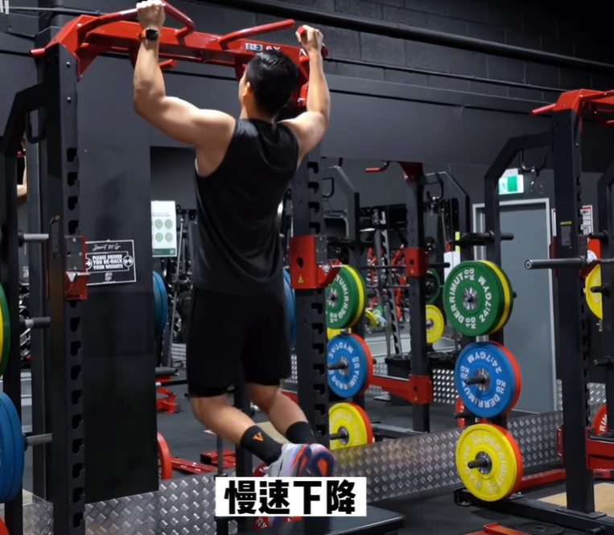

    - 每组8\~10次，组件1min即可，下降2\~3秒即可

  - challenge3：辅助引体向上

- 杠铃划船：

  > 需要腘绳肌

  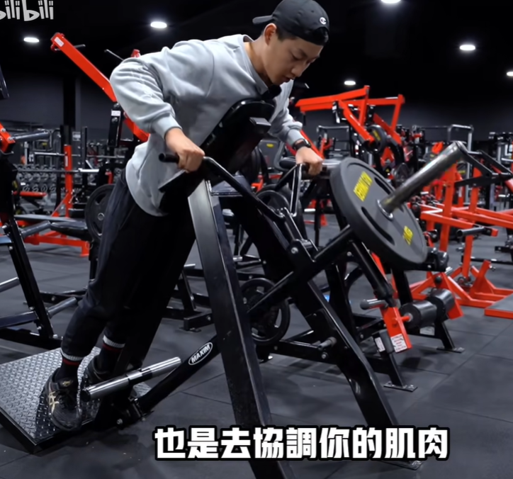

  因为斜方肌和菱形肌非常主动去参与，所以常会出现挺胸身体向后的动作，如果是为了训练背阔肌，需要控制，可以稍微含胸

- 负重划船：刺激背阔肌的长度（倒三角）

  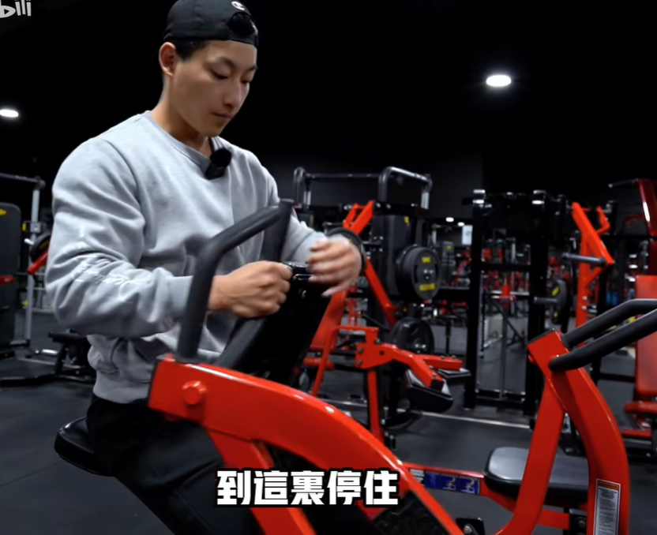

- 分立高位下拉：刺激背阔肌的长度

  > 龙门架高位下拉见下

  寻找背阔肌的拉伸与收缩，尽量少让斜方肌和菱形肌的参与

  经常也会手酸，感受到背阔肌收缩即可不用拉得过多

  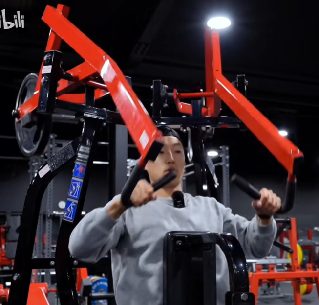

  > 寻找肌肉的感觉，不然白练了

- 山羊挺身：下背+臀部+腘绳肌

  > 腰突患者得好好练

  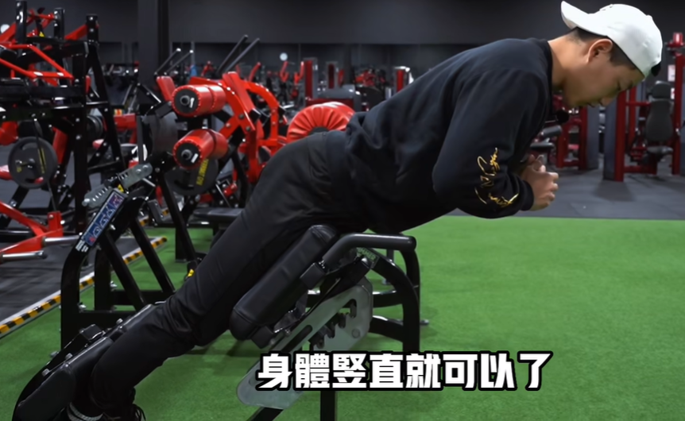

  - 根据高度不同刺激不同的刺激，如果练腰器械只比腰低一点点即可。

  - 脚踩得宽则脚尖朝外刺激臀部+腘绳肌较多，踩得窄更多刺激腰部

  - 不需要起身太多，身体一条线即可，下去也只需比水平面略低一点

  下面介绍负重的山羊挺身

  - 拿住随着身体上下即可，不要手臂上下伸缩

- 坐姿绳索划船：背阔肌中下位

  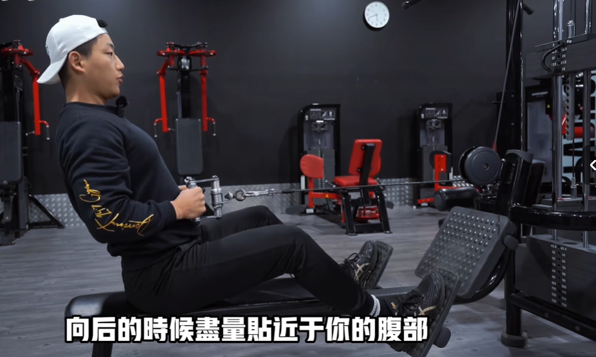

  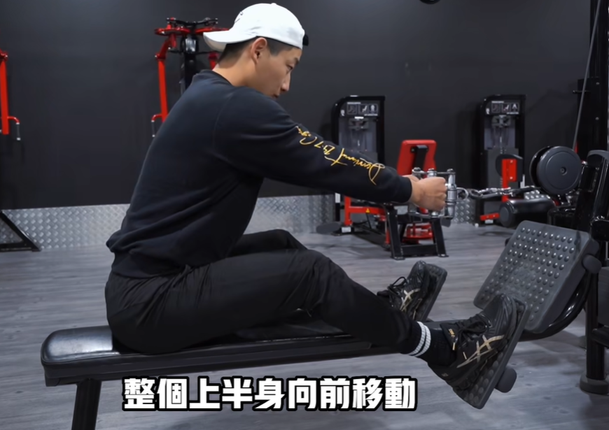

  - 起始位：脚踩踏板，膝盖微曲

  - 收缩：向后时尽量贴近于腹部

  - 拉伸：将整个上半身当成一个整体，不要只移动手臂

    > Tips：注意放的时候不要太快，不要故意去挺胸

- 高位下拉

  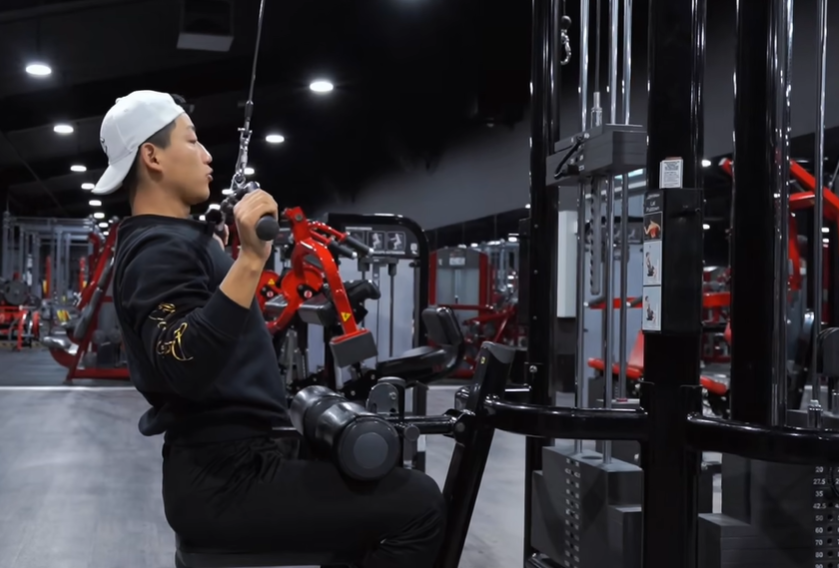

  - 宽握把不同宽度对肌肉有不同的刺激

    - 拉下时：横杆略低于下巴，略高于胸口

      > Tips：不要用力过猛，控制

    - 想象使用肘关节向下拉稍向内，不要用手臂

  - V握把（TODO）

- 鹦鹉螺

  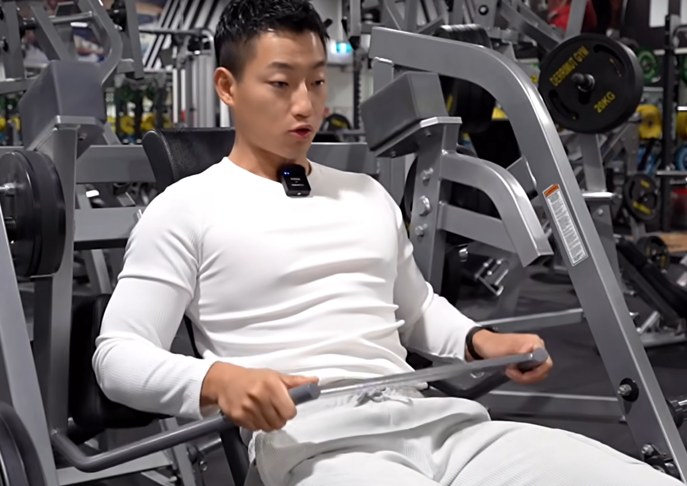

  上肢综合刺激

# 手臂

# 腿

# 腰腹

# 拉伸

# References

- B站Alex健身频道
- [全身肌肉解剖图汇总及肌肉功能](https://zhuanlan.zhihu.com/p/365466916)
