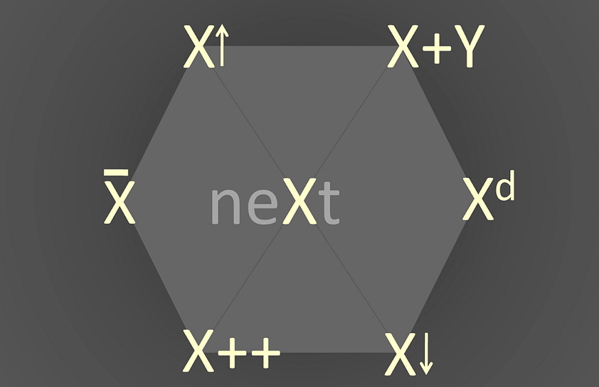

# How to Find Ideas

[The Idea Hexagon: A Framework for Innovation](https://medium.com/spotprobe/the-hexagon-of-ideas-02e5b770d75e)

1. Bottom-Up Discovery

   Turn a concrete understanding of existing research's failings to a higher-level experimental question.

2. Top-down Design

   Move from a higher-level question to a lower-level concrete testing of that question.

## References

- [The Idea Hexagon: A Framework for Innovation](https://medium.com/spotprobe/the-hexagon-of-ideas-02e5b770d75e)

