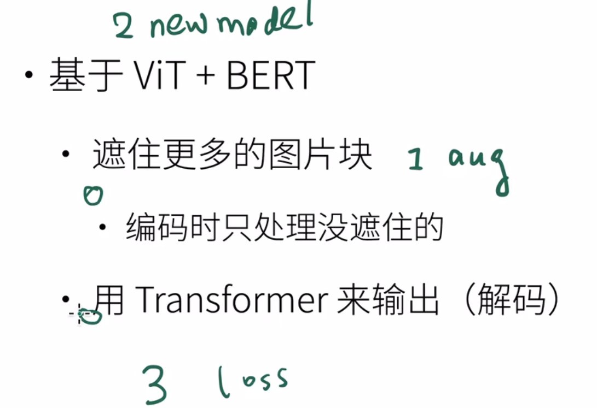

# How to Find Ideas
[TOC]

## 如何系统地产生创新

根据References[1]，提出一个**帮助人系统地产生创新想法的思维框架**

- Takeaway: 创新不是一次性的灵感爆发，而是持续不断地追问“**在 X 之后，下一个是什么？** 文中提出了六种方法

- Motivation: 创新并不是神秘的天赋，而是可以被框架化训练的思维动作

- Core Mechanism: 这里来详细介绍六种方法

  

  1. “Generalizing to Another Dimension（X → Xd）”，把一个已有概念推广到新的维度。关注的是“**扩展边界**”

     eg: 把“数据”扩展到文本、音频、图像和视频等不同表达形式

  2. “Fusion of the Dissimilar（X + Y）”，把两个看起来差异很大的事物结合起来，产生新方案

     方法缝合，跨领域拼接不同

  3. “Finding All Nails for a Hammer”，把一种技术迁移到多个问题上。**技术外溢**：一项技术成熟后，真正的价值往往来自它被重新用在别的场景

  4. “Finding All Hammers for a Nail”，围绕一个问题去寻找多种可能的解决工具

  5. “Adding an Adjective（X++）”，这类创新不是完全推翻原有事物，而是给已有系统加上一个重要的新性质

     作者提到的关键词包括 **adaptive（自适应）**、**hierarchical（层级化）**、**personalized（个性化）**。这说明创新并不总是“发明一个全新东西”，也可以是让原有系统变得更聪明、更灵活、更贴近个人需求。它本质上是在问：这个 X 还能更怎样？

  6. “Doing Exactly the Opposite”，也就是反向思考

     很多颠覆式创新都来自反向思考

从这里开始如何对研究方向产生idea然后写paper

## Method 1 -- 打补丁法

打补丁法，顾名思义，就是对以后的工作做一些改进，主要是要思考他们在什么地方做了什么，如果我来做试试其他的什么方法可能会有效果。

- 读论文的时候读到的是一个故事，因此我们寻找idea就需要把这篇文章知识蒸馏出来，看到底做了啥

  > 所以每次我的takeaway, core mechanism是最好一句话/两句话概括

- 尽量在最新的开创性工作上打补丁，不要在已经是一篇打补丁的文章上再打补丁

- 对于最后的几个补丁开始写文章，最重要的是讲好一个完整的故事，有时一些不重要的补丁需要舍去

下面是沐深对MAE这篇文章给出的一些思考

## Others

1. Bottom-Up Discovery

   Turn a concrete understanding of existing research's failings to a higher-level experimental question.

2. Top-down Design

   Move from a higher-level question to a lower-level concrete testing of that question.

## References

- [The Idea Hexagon: A Framework for Innovation](https://medium.com/spotprobe/the-hexagon-of-ideas-02e5b770d75e)
- 【如何找研究想法 1【论文精读】】 https://www.bilibili.com/video/BV1qq4y1z7F2/?share_source=copy_web&vd_source=93bb338120537438ee9180881deab9c1

