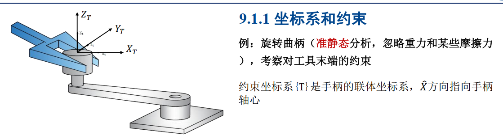
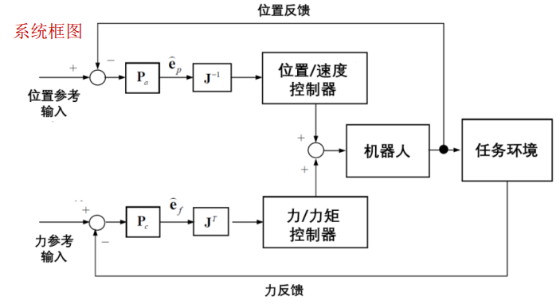
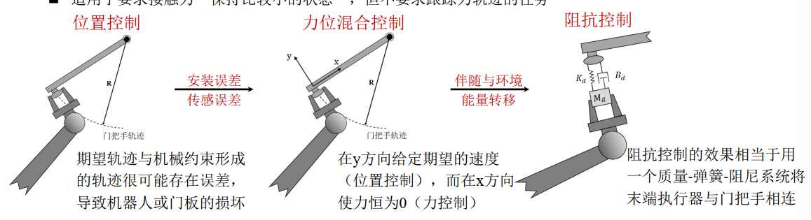
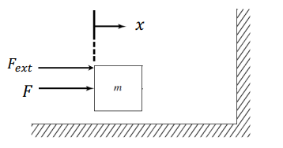
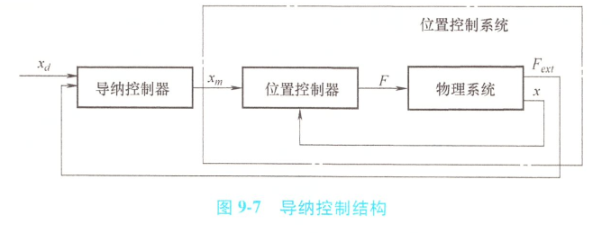
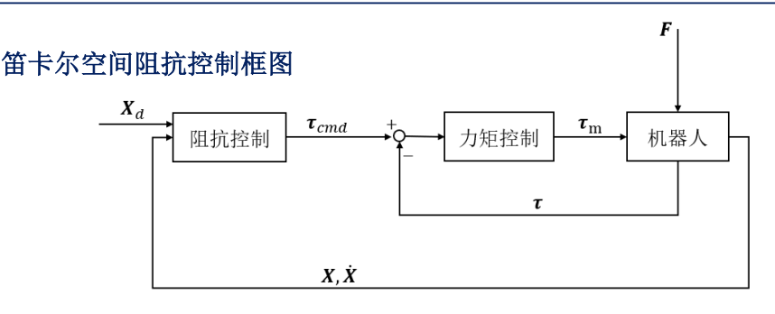
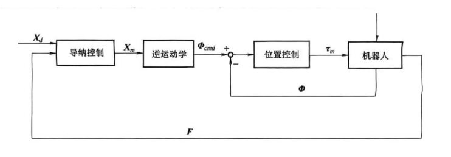
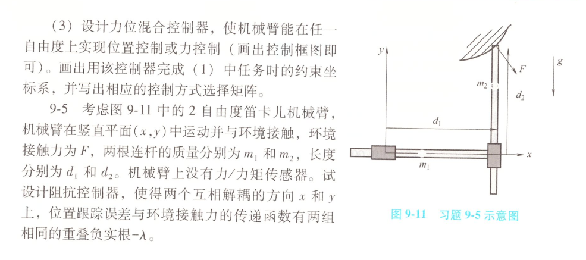
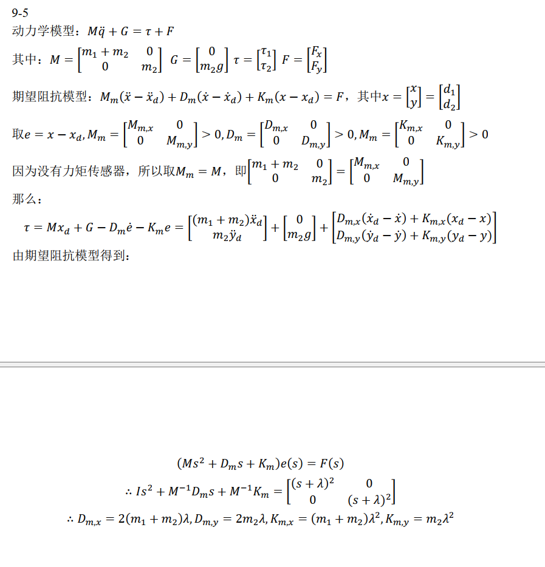

# 机器人力控制

若机械臂的工作需要末端执行器与工作环境发生接触，则需考虑力控制：

力位混合控制（基本），阻抗控制（柔顺性），导纳控制，关节力/力矩控制

## 力位混合控制

力位混合控制（Hybrid Position/Force Control）是指当环境的几何约束已知时，可以在未约束的任务方向上控制位置、在约束的任务方向上控制力，来跟踪给定的日标位置轨迹和力轨迹，更好地与环境进行交互。

### 坐标系和约束

我们现在需要约束的工件建立坐标系称为柔性坐标系（也叫约束坐标系），在这个坐标系中一般受到两种约束

- **自然约束**：由环境物理特性自动生成的约束

  - 与几何/机械特性相关

    例：粉笔垂直黑板方向的位置约束

  - 数学表达式：$\Delta p_c = 0 \in \mathbb{R}^6$

- **人工约束**：任务目标决定的人工约束

  - 描述预期运动或施力轨迹

    例：沿黑板平面书写轨迹

  - 数学表达式：$\Delta p_a = \delta p_a \in \mathbb{R}^6$

下面举一个栗子：

- 同一约束种类的轴方向在静力学和运动学中都彼此正交
- 不同约束种类的轴方向在静力学和运动学中都相同
- 可行运动空间$V_a$与约束空间$V_c$互为正交补空间

下面介绍一下虚功原理

- 机器人末端执行器受到的六维力/力矩向量表示为 $F \in \mathbb{R}^6$
- 无穷小位移表示为 $\Delta p \in \mathbb{R}^6$

分解力和运动

- 力分解：$F = F_c + F_a$（约束力 $F_c$ 和主动力 $F_a$）
- 位移分解：$\Delta p = \Delta p_c + \Delta p_a$（约束位移 $\Delta p_c$ 和自由位移 $\Delta p_a$）

因为正交补空间的定义有：$F_a\perp \Delta p_c,F_c\perp \Delta p_a$，所以$F_a^T \Delta p_c=0,F_c^T \Delta p_a=0$

功的计算
$$
\Delta W = F^T \Delta p = \underbrace{F_c^T \Delta p_c}_{\text{约束功}} + \underbrace{F_a^T \Delta p_a}_{\text{主动功}}
$$

要使无穷小位移$\Delta p$为虚位移$\delta p$，则它在约束空间中的分量必须为零，即$\Delta p_c=0$。在此情况下$\Delta p_a=\delta p_a$为虚位移，而功退化为虚功：
$$
\Delta W = F_a^T \Delta p_a
$$

由于系统始终处于静态平衡状态，根据虚功原理可知，所有施加的外力与任意满足约束条件的虚位移乘积所得到的虚功总和为0，即
$$
\Delta W = F_a^T \delta p_a = 0
$$
对于任意满足约束的虚位移，式子都成立，所以可行运动空间的力恒为0。由此可得静力学中的自然约束为
$$
F_a = 0 \quad \text{且} \quad F_a \in V_a
$$
在功的计算中，约束空间内的位移$\Delta p_c=0$，所以在约束空间内无论施加多大的力，静态平衡条件始终满足。这意味着为了实现特定的任务目标，可以在约束空间内施加任意大小的力和力矩。由此可得静力学中的人工约束为
$$
F_c\in V_c，可为任意值
$$
将无穷小的位移转换为速度，即可推出运动学中的自然约束和人工约束为
$$
\dot p_a\in V_a，可为任意值
$$

$$
\dot{p}_c = 0 \quad \text{且} \quad \dot{p}_c \in V_c
$$

上述约束称为梅森规则：

| **类型**     | **运动学**                          | **静力学**                  |
| ------------ | ----------------------------------- | --------------------------- |
| **自然约束** | $\dot{p}_c = 0,\ \dot{p}_c \in V_c$ | $F_a = 0,\ F_a \in V_a$     |
| **人工约束** | $\dot{p}_a \in V_a$（可取任意值）   | $F_c \in V_c$（可取任意值） |

根据梅森规则，自然约束和人工约束在运动学和静力学上始终具有**正交性**，且静力学中人工约束对应的子空间与运动学中人工约束对应的子空间也彼此正交。因此，可以在这两个彼此正交的子空间内**分别采取位置控制和力控制**

根据梅森规则，可以设计力位混合控制器，上方的控制回路是位置控制环，其参考输入为运动学中的人工约束。下方的控制回路是力控制环，其参考输入为静力学中的人工约束

当任务较复杂时，运动空间无法简单地划分为可行运动空间和约束空间：使用梅森规则来划分子空间（对实际问题的简化）

### 控制器设计

末端执行器与环境接触的不同状态

- 无接触状态：6个自由度方向自由运动
- 黏在墙面上：有6个**自然位置约束**，可以在6个自由度上对目标施加力和力矩
- 一般情况：在部分约束任务环境中进行力控制。需要在某些自由度进行位置控制，另一些自由度进行力控制

力位混合控制器需要解决的问题：

- 在存在自然力约束的方向进行操作臂的位置控制。
- 在存在自然位置约束的方向进行操作臂的力控制。
- 沿着任意坐标系$\{C\}$的正交自由度方向进行任意位置和力的混合控制

下面给出系统框图：

根据梅森规则，我们得到的约束均是在约束坐标系下的，因此在控制回路中，反馈信号也需要在约束坐标系下进行描述。

在实际物理世界中，我们无法保证位置反馈信号完全处于可行运动空间，力反馈信号完全处于约束空间，因此信号可能被错误反馈的不对应的控制器，为了过滤这些冲突的信号，我们可以将反馈误差投影到位置控制和里控制各自对应的子空间：

位置误差$e_𝑝$被投影到可行运动空间$V_a$ ，力误差$e_f$被投影到约束空间$𝑉_c$ 。在方框图中这些滤波器用投影矩阵$P_a$和$P_c$表示
$$
\hat{e}_p = P_a e_p \quad \text{（投影到可行运动空间 } V_a \text{）}
$$

$$
  \hat{e}_f = P_c e_f \quad \text{（投影到约束空间 } V_c \text{）}
$$

当约束坐标系的各轴与位置/力控制回路方向一致时，满足对角矩阵：
$$
P_a = \text{diag}(0 \text{或} 1), \quad P_c = \text{diag}(0 \text{或} 1)
$$

举一个栗子：

末端执行器需要在沿𝑥, 𝑦轴平动方向和绕𝑥, 𝑦轴旋转方向使用力控制，在沿𝑧轴平动方向和绕𝑧轴旋转方向使用位置控制，则投影矩阵：
$$
P_a = \text{diag}(0,0,1,0,0,1) \quad (\text{可行运动空间})
$$

$$
P_c = \text{diag}(1,1,0,1,1,0) \quad (\text{约束空间})
$$

关节空间的反馈误差：
$$
{e}_p = J^{-1} \hat e_p \quad (\text{位置反馈误差})
$$

$$
{e}_\tau = J^{-1} \hat e_\tau  \quad (\text{力反馈误差})
$$

## 阻抗控制

### 概述

先谈谈力位混合控制的弊端：

力约束和位置约束相互正交（该结论在机器人和环境没有摩擦且都为完全刚性的理想条件下成立）

而在在许多情况下，交互过程往往伴随着**能量的转移**，这时单一的位置、速度或力控制就不足以控制交互过程的能量流动

因此我们提出阻抗控制：设计控制器使交互力与机械臂位置之间呈现出期望的关系，从而实现柔顺控制

- 这种关系即机械阻抗，一般用一组质量-弹簧-阻尼系统表示
- 不显式给出环境形变与接触力之间的关系
- 适用于要求接触力“保持比较小的状态”，**但不要求跟踪力轨迹的任务**

阻抗控制可以分为两种形式：阻抗控制（Impedance Control）和导纳控制（Admittance Control），在一些文献中，这两种形式被成为**基于力的阻抗控制**和**基于位置的阻抗控制**

### 阻抗控制器

这节先介绍一下什么是阻抗控制器

- 机械阻抗（Mechanical Impedance）：阻抗控制器调节任务空间中机器人动力学特性与其所受外力之间的关系

  定义为复频域内作用力与速度的比值，倒数称为机械导纳
  $$
  机械阻抗Z(s)=\frac{F(s)}{\dot{X}(s)}
  $$
  假设一个质量-弹簧-阻尼系统可以用以下微分方程描述：

  $$
  M\ddot{x} + B\dot{x} + Kx = F
  $$

  则该系统的机械阻抗为：

  $$
  Z(s) = \frac{F(s)}{V(s)} = Ms + B + \frac{K}{s}
  $$
  机械阻抗与频率相关，低频时主要由弹性项$K$决定，高频时主要由惯性项$M$决定

  - **理想的位置控制器**对应高阻抗（需抵抗外力干扰保持位置稳定）
    $$
    \dot{X}(s) = \frac{F(s)}{\infty} =0
    $$

  - **理想的力控制器**对应低阻抗（需适应形变保持恒力输出）
    $$
    F(s) = 0\dot{X}(s)
    $$

  - **理想控制特性**：

    - 位置控制可视为阻抗无穷大时的特例
    - 力控制可视为阻抗为零时的特例

  - **工程约束**：实际机器人可实现阻抗范围有限（受执行器带宽、传感器精度等限制）

- 阻抗控制

  考虑一个简单的一自由度系统：一个质量块与环境进行接触，质量块位移为 $x$，质量为 $m$，$F_{\text{ext}}$ 和 $F$ 分别为环境施加的力和控制力，

  

  质量块的运动方程为：
  $$
  m\ddot{x} = F + F_{\text{ext}}
  $$
  若质量块期望轨迹为 $x_d(t)$，令 $\tilde{x}(t) = x(t) - x_d(t)$ 表示运动的跟踪误差，则**阻抗控制目标**可以表示为

  $$
    M_d \ddot{\tilde{x}} + B_d \dot{\tilde{x}} + K_d \tilde{x} = F_{\text{ext}}
  $$

  式中，$M_d$，$B_d$，$K_d$ 分别表示期望的惯量、阻尼和刚度，可以通过调整来调节质量块与环境接触时的机械阻抗。

  三个中任意一个较大时，成为高阻抗；若三个参数都很小，则称为低阻抗。

阻抗控制可以分为两种形式：阻抗控制（Impedance Control）和导纳控制（Admittance Control），在一些文献中，这两种形式被成为**基于力的阻抗控制**和**基于位置的阻抗控制**。下面我们来分别进行介绍：

- 阻抗控制的两种形式

  - 阻抗控制：基于测量的位置来控制外力，发送关节力矩

    阻抗控制率
    $$
    m\ddot{x} = F + F_{\text{ext}}
    $$

    阻抗控制的目标为：
    $$
       M_d \ddot{\tilde{x}} + B_d \dot{\tilde{x}} + K_d \tilde{x} = F_{\text{ext}}

    $$

    则
    $$
    F = m\ddot{x} - F_{\text{ext}} = m\ddot{x} - M_d \ddot{\tilde{x}} - B_d \dot{\tilde{x}} - K_d \tilde{x}
    $$

    $$
       \tilde{x} = x - x_d \quad \Rightarrow \quad m\ddot{x} = m\ddot{x}_d + m\ddot{\tilde{x}}

    $$

    阻抗控制律：
    $$
    F = m\ddot{x}_d + (m - M_d)\ddot{\tilde{x}} - \left( B_d \dot{\tilde{x}} + K_d \tilde{x} \right)
    $$

    > 含有跟踪误差的二阶导数

    在阻抗控制中，传感器测量当前位置与目标位置的偏差，并调整控制力的大小来达到预期的阻抗关系，基本控制律为：
    $$
    F = m\ddot{x}_d + (m - M_d)\ddot{\tilde{x}} - \left( B_d \dot{\tilde{x}} + K_d \tilde{x} \right)
    $$
    上式出现了跟踪误差的二阶导数，这可能会引入严重的测量噪声。如果能测量环境力，则可以修改控制律以消去二阶导数项：
    $$
    F = m\ddot{x}_d  -\frac{m}{M_d} \left( B_d \dot{\tilde{x}} + K_d \tilde{x} \right)+ (\frac{m}{M_d} - 1)F_{ext}
    $$
    

    - 控制器表现为机械阻抗
    - 物理系统表现为机械导纳（输入力，输出运动信号）

  - 导纳控制：基于测量的外力来控制位置，只需要发送位置/速度指令

    在导纳控制器中，环境力$𝐹_{𝑒𝑥𝑡}$（已知量）通过二阶导纳模型生成一个附加的运动信号，将预期的运动轨迹$x_d$变为新的运动轨迹$x_m$，下面我们来求解$x_m$

    导纳控制方程：
    $$
    M_d (\dot{x}_m - \dot{x}_d) + B_d \dot{x} + K_d \tilde{x} = F_{\text{ext}}
    $$
    加速度计算：

    $$
    \ddot{x}_m = \ddot{x}_d + \frac{1}{M_d} \left( F_{\text{ext}} - B_d \dot{\tilde{x}} - K_d \tilde{x} \right)
    $$
    再对所求得的加速度做两次积分，得到新的运动轨迹并送入位置控制环，来完成最终的控制

    

    可以发现，当环境力$F=0$时有$(x_m-x_a)\rightarrow0$，只通过位置控制对期望轨迹进行跟踪。当环境力不为零时，能否实现期望的阻抗关系取决于内环位置控制的精度。

### 机器人阻抗控制

这节介绍如何在机械臂中应用阻抗控制器

#### 笛卡尔空间阻抗控制

当存在环境力时，关节空间动力学模型
$$
M(\Phi) \ddot{\Phi} + V(\Phi, \dot{\Phi}) + G(\Phi) = \tau + J^T(\Phi) F
$$
其中$J^T(\Phi)F$是由于末端执行器与环境接触而引起的关节负荷力/力矩向量。 $V = C\dot \Phi +B\dot \Phi$是与科里奥利力、离心力和摩擦力有关的向量，因为不考虑关节摩檫力的影响即$B = 0$。

在笛卡尔空间阻抗控制中，希望保持机器人末端执行器的位移与环境力之间的关系，因此利用分析雅可比矩阵，
$$
J^T(\Phi) F = J_a^T(\Phi) F_a
$$
其中$F_a = T_a^{-T}F$表示对$\dot X$做功的广义力，$T_a^T$为两个雅可比矩阵之间的转换矩阵

建立笛卡尔空间的动力学模型
$$
M_X(\Phi) \ddot{X} + V_X(\Phi, \dot{\Phi}) + G_X(\Phi) = J_a^{-T}(\Phi) \tau + F_a
$$

使用内环/外环控制架构设计阻抗控制律。内环控制器实现笛卡尔空间的反馈线性化，令
$$
\tau = J_a^T(\Phi) \left[ M_X(\Phi) a_d + V_X(\Phi, \dot{\Phi}) + G_X(\Phi) - F_a \right]
$$

$$
\ddot{X} = a_d
$$

将上式代入动力学方程后，得到的闭环系统是笛卡尔空间中的一个双积分系统， 令末端期望运动轨迹分别为$X_d(t),M_d,B_d,K_d$分别表示期望惯量、阻尼和刚度矩阵，$\tilde{X}(t) = X(t)-X_d(t)$表示跟踪误差，则期望的阻抗关系为：
$$
M_d \ddot{\tilde X} +B_d \dot{\tilde X} +K_d\tilde X =F_a
$$
取外环控制律
$$
a_d = \ddot{X}_d + M_d^{-1} \left[ -B_d \dot{\tilde{X}} - K_d \tilde{X} + F_a \right]
$$

为了将各个分量解耦，通常将期望惯量、阻尼和刚度矩阵都取为对角阵。最终经过计算可得关节空间阻抗控制率为：
$$
\tau = M(\Phi) J_a^{-1}(\Phi) \left[ \ddot{X}_d - \dot{J}_a(\Phi) \dot{\Phi} + M_d^{-1} \left( -B_d \dot{\tilde{X}} - K_d \tilde{X} \right) \right]\\ + V(\Phi, \dot{\Phi}) + G(\Phi) + J_a^T(\Phi) \left[ M_X(\Phi) M_d^{-1} - I \right] F_a
$$

下面详细介绍一下式子中我们的设定量（阻抗参数）如何选取

- $X_d(t)$选取：根据任务情况选取期望末端轨迹。在一些人机交互任务中，期望位姿是一个常量，设定了机器人在自由空间中的静息位置。在打磨、抛光等任务中，常会略微设定在环境表面之内
- $K_d$反映末端执行器的刚度大小，为主要调节的控制参数，决定了环境接触力大小
- $B_d$变化一般不影响稳态，可以用来调节与环境交互的动态过程，决定响应过程
- $M_d$惯性参数一般不需要进行调节，根据实际情况进行选取
- 以互补的方式匹配环境的动态特征（特别是环境阻抗的估计值）
- 避免环境的未知几何特征造成的大冲击力，防止机械系统的损坏
- 模仿人类手臂的动作：自由运动时快速、刚性，在有限制的环境中慢速、柔性
  - 在预期会与环境发生接触的方向上选择较小的$K_{d,i}$，使得接触力不会太大
  - 在预期能够自由运动的方向上选择较大的$K_{d,i}$，以减小轨迹跟踪的误差

#### 笛卡尔空间导纳控制

- 阻抗控制弊端：属于隐式力控制，无法用于跟踪特定的力轨迹
- 导纳控制中， 物理系统接收位置输入，表现出机械阻抗的特性；控制器可以被视为机械导纳，测量环境力并给出运动信号
- 导纳控制必须有环境接触力反馈，因此机械臂需要装备力/力矩传感器

位置控制环通常具有较高的增益，从稳定性的角度分析，在选取阻抗参数时需要设置较大的刚度和阻尼（应当大于环境的刚度），因此导纳控制在无接触时有较高的位置控制精度，而在环境刚度较大时可能会出现振荡现象。

基于测量的外力来控制位置，只需要发送位置/速度指令，机器人通常都有位置控制模式：
$$
M_d \ddot{X} + B_d \dot{X} + K_d X = F_a
$$

如果我们想要跟踪接触力向量$F_r$，需要将期望阻抗模型中的接触力替换为接触力误差$F_e=F_r-F$则新的阻抗关系为：

> $F_r$为跟踪接触力向量，实际应用中常为定值

$$
M_d \ddot{X} + B_d \dot{\tilde{X}} + K_d\tilde X = F_e
$$

因为$F_r$一般为定值，可将笛卡儿空间中一个方向的阻抗动力关系提出来，简化的阻抗动力关系
$$
m\ddot{x} + b\dot{x} + k(x - x_d) = e \quad \text{其中} \quad e = f_r - f
$$

力的跟踪涉及两个方面：机器人和环境，在许多场景中可以使用线性弹簧环境建模
$$
F = K_e (X - X_e) \quad \Rightarrow \quad x = \frac{1}{k_e} f + x_e = \frac{1}{k_e} (f_r - e) + x_e
$$

环境参数

- $  K_e  $: 环境以及末端力/力矩传感器的等效刚度矩阵
- $  X_e  $: 未发生形变的环境表面位置

$$
\ddot{x} = -\frac{1}{k_e} \dot{e}, \quad \dot{x} = -\frac{1}{k_e} e
$$

在模型中代入阻抗关系可得阻抗控制关系
$$
m\ddot{e} + b\dot{e} + (k + k_e) e = kf_r - k_e k(x_d - x_e)
$$

稳态误差：
$$
e_{ss} = k_{eq}(\frac{f_r}{k_e}+x_e-x_d)
$$
若能够设定参考位置为$x_d = x_e+\frac{f_r}{k_e}$，则稳态误差为0

下面给出一个栗子：

## 关节力/力矩控制

- 电流环控制

  在使用直驱电机或减速比很小的情况下， 关节力矩与电流之间基本成**正比关系**$\tau = k_T I$，可以通过控制电流对输出力矩进行控制

  实现简单且成本较低， 但是只适用于减速比很小的情况

- 应变片式力矩控制器

  在带有减速器的电机中， 一种常见的方案是使用**谐波减速器**，谐波减速器具有较高的减速比， 且**能够基本消除空程**的问题

  通过在弹性体上安装应变片的方式， 可以对减速箱输出端的力矩进行测量， 并经过反馈回路对电机电流进行调节， 来产生期望的力矩

  优缺点：测量精度较高， 但工艺比较复杂、 成本较高， 而且存在温漂、 零漂等问题

- 串联弹性驱动器

  串联弹性驱动器（Series Elastic Actuator, SEA）同样包括电机、减速箱（通常为谐波减速器）和输出端的弹性体，但弹性体的刚度远小于使用应变片的情况

  SEA实际输出力矩通过反馈控制器调节电机电流，产生期望的力矩

  优缺点：SEA中的弹性体柔性较强，因此适用于人-机器人交互的任务， 但这种结构同样会使得关节构型更加复杂，而弹性体也增加了高频和高速运动的控制难度
