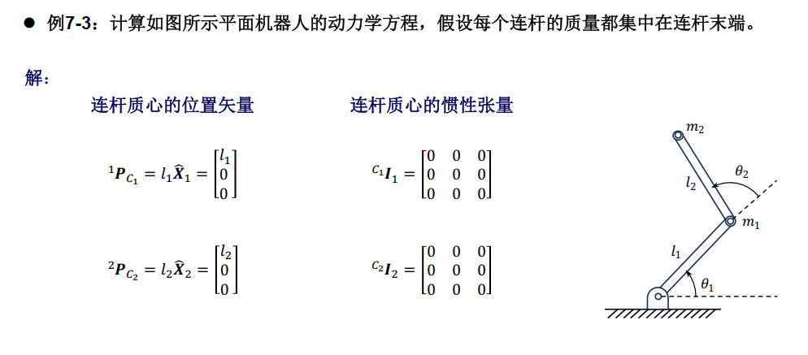
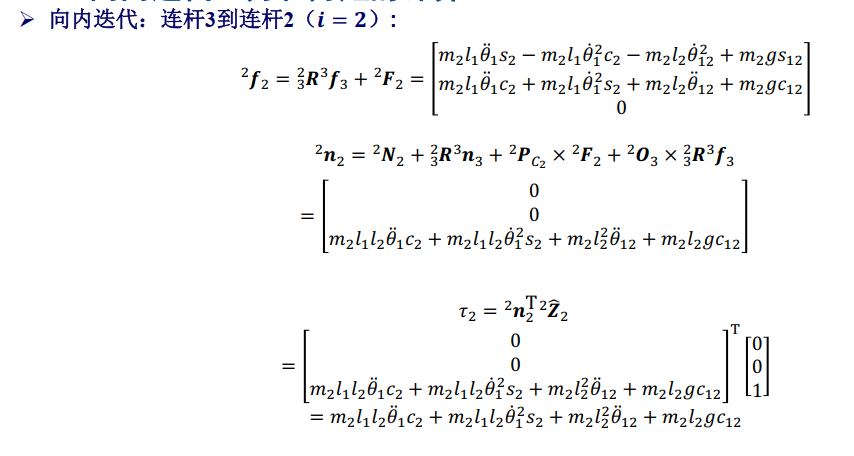
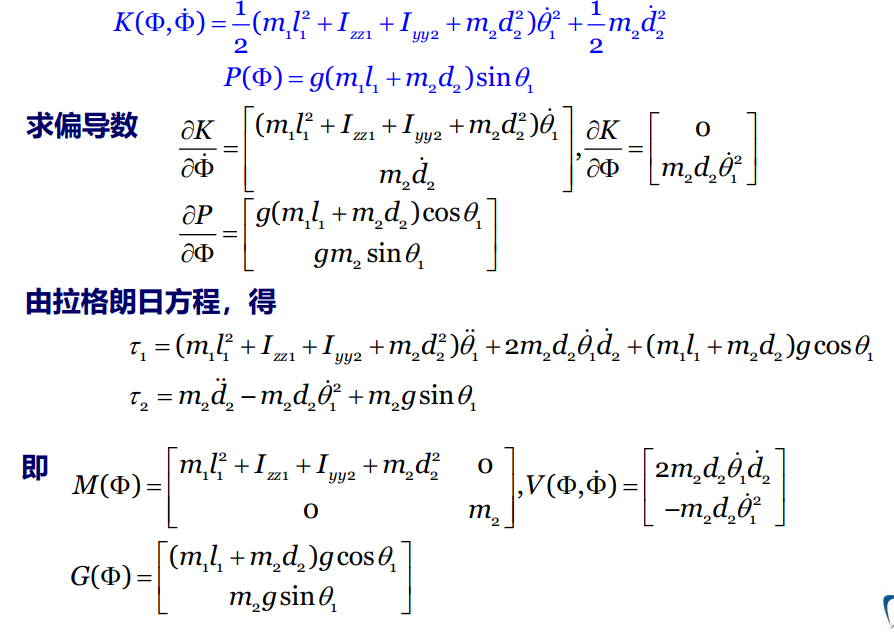
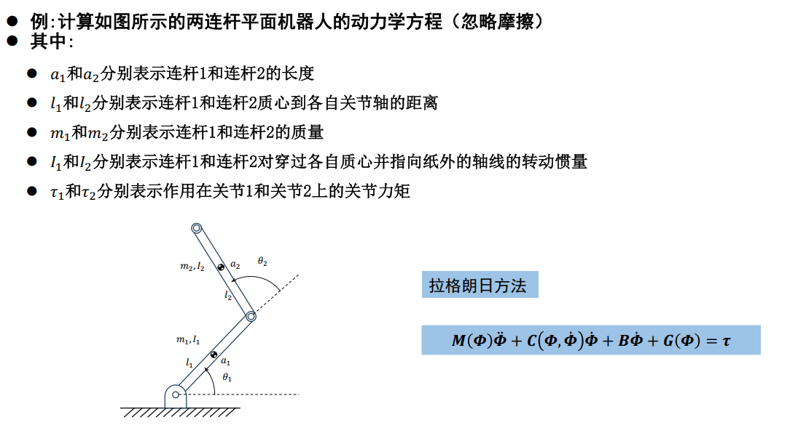
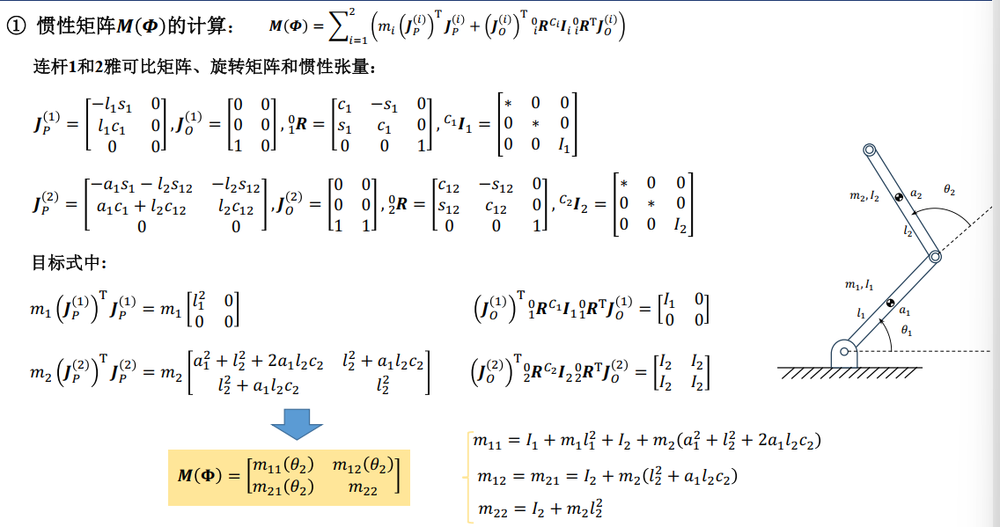
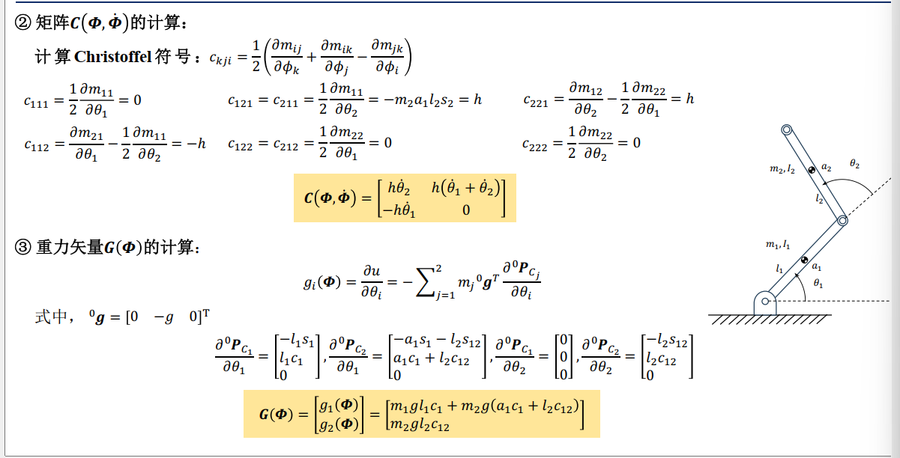

# 机械臂动力学

## 刚体的加速度传递

$$
{^AV_Q} = {^AV_{BORG}+{^A_B \dot{R}}{^BQ}+{^A_B {R}}{^BV_Q}}\\
\quad={^AV_{BORG}+{^A_B {R}}{^BV_Q}+{^A\Omega_B }\times {^A}R_B {^BQ}}
$$

线加速度公式：

$$
\begin{align*}
^A\dot{V}_Q &= ^A\dot{V}_{BORG} + ^A_B R ^B\dot{V}_Q + 2 ^A\Omega_B \times ^A_B R ^BV_Q + ^A\dot{\Omega}_B \times ^A_B R ^B Q + ^A\Omega_B \times (^A\Omega_B \times ^A_B R ^B Q) \\
\end{align*}
$$

当 $ ^B Q $ 是常数，即

$$
^B V_Q = ^B \dot{V}_Q = 0
$$

加速度的推导公式化简为：

$$
\begin{align*}
^A\dot{V}_Q &= ^A\dot{V}_{BORG} + ^A\dot{\Omega}_B \times ^A_B R ^B Q + ^A\Omega_B \times (^A\Omega_B \times ^A_B R ^B Q)
\end{align*}
$$

$$
^A \Omega_C = ^A \Omega_B + {^A_B R} {^B \Omega_C}
$$

角加速度公式：

$$
^A\dot{\Omega}_C = ^A\dot{\Omega}_B + ^A_B R ^B\dot{\Omega}_C + ^A\Omega_B \times ^A_B R ^B\Omega_C
$$

## 惯性张量与欧拉方程

惯性：物体保持其原有运动状态不变的性质

> 惯性张量是绕着一个点；转动惯量是绕着一个轴

**惯性张量**在固连于刚体的坐标系中的定义：

$$
^A I = \begin{bmatrix}
I_{xx} & -I_{xy} & -I_{xz} \\
-I_{xy} & I_{yy} & -I_{yz} \\
-I_{xz} & -I_{yz} & I_{zz}
\end{bmatrix}
$$

$$
^AI = \sum m_i[(r_A^Tr_A)I_3-r_Ar_A^T]
$$

惯量矩（转动惯量）
$$
\begin{align*}
I_{xx} &= \iiint_V (y^2 + z^2) \rho \, dv \\
I_{yy} &= \iiint_V (x^2 + z^2) \rho \, dv \\
I_{zz} &= \iiint_V (x^2 + y^2) \rho \, dv
\end{align*}
$$

惯量积（离心矩）
$$
\begin{align*}
I_{xy} &= \iiint_V xy \, \rho \, dv \\
I_{xz} &= \iiint_V xz \, \rho \, dv \\
I_{yz} &= \iiint_V yz \, \rho \, dv
\end{align*}
$$

$$
{^CI} =
\begin{bmatrix}
\sum m_i (y_i^2 + z_i^2) & -\sum m_i x_i y_i & -\sum m_i x_i z_i \\
-\sum m_i x_i y_i & \sum m_i (x_i^2 + z_i^2) & -\sum m_i y_i z_i \\
-\sum m_i x_i z_i & -\sum m_i y_i z_i & \sum m_i (x_i^2 + y_i^2)
\end{bmatrix}
=
\begin{bmatrix}
I_{xx} & -I_{xy} & -I_{xz} \\
-I_{xy} & I_{yy} & -I_{yz} \\
-I_{xz} & -I_{yz} & I_{zz}
\end{bmatrix}
$$
刚体由无限小体积元 $  dv  $ 组成，其密度为 $  \rho  $，每个体积元的位置坐标为：
$$
\boldsymbol{r} = \begin{bmatrix}
x \\
y \\
z
\end{bmatrix}
$$

其中 $  V  $ 表示刚体占据的空间体积。

平行移轴定理：假设$\{C\}$是以刚体质心为原点的坐标系，$\{A\}$为任意平移后的坐标系。矢量$P_c=\begin{bmatrix} x_c\\y_c\\ z_c\end{bmatrix}$表示刚体质心在坐标系$\{A\}$中的位置，则有
$$
{^AI}={^C I}+m[P_c^TP_cI_3-P_cP_c^T]
$$

- 如果由坐标系的两个坐标轴构成的平面为刚体质量分布的对称平面，则正交于这个对称平面的坐标轴与另一个坐标轴的惯量积为0
- 惯量矩永远是正值，而惯量积可能正，可能负

下面介绍一下欧拉方程：
$$
{^CN} = {^CI}{^C\dot \omega_C}+{^C\omega_C}\times {^CI}{^C\omega_C}
$$
描述了作用在刚体上的力矩$^CN$与刚体旋转角速度和角加速度之间的关系

质心是唯一的：$\sum_i m_iP_i = 0 $

> **标量三重积**：
>
> $$
> [\vec{a} \vec{b} \vec{c}] = \vec{a} \cdot (\vec{b} \times \vec{c}) = (\vec{a} \times \vec{b}) \cdot \vec{c}
> $$
>
>
> $$
> [\vec{a} \vec{b} \vec{c}] = \begin{vmatrix}
> a_x & a_y & a_z \\
> b_x & b_y & b_z \\
> c_x & c_y & c_z
> \end{vmatrix}
> $$
>
> **矢量三重积**：
> $$
> \vec{a} \times (\vec{b} \times \vec{c}) = (\vec{a} \cdot \vec{c}) \vec{b} - (\vec{a} \cdot \vec{b}) \vec{c}\\
> (\vec{a} \times \vec{b}) \times \vec{c} = (\vec{a} \cdot \vec{c}) \vec{b} - (\vec{a} \cdot \vec{b}) \vec{c}
> $$
>

## 牛顿-欧拉方法

由关节运动计算关节力矩的完整算法由两部分组成：

1. 向外迭代计算各连杆的速度和加速度
2. 向内迭代计算各连杆的力和力矩以及关节力矩

向外迭代计算各连杆的速度和加速度

- 当关节$i+1$是旋转关节时
  $$
  {^{i+1}\omega_{i+1}} = {^{i+1}_i}R{^i\omega_i}+\dot{\theta}_{i+1}{^{i+1}Z_{i+1}}
  $$

  $$
  ^{i+1}\dot{\omega}_{i+1}= {}\prescript{i+1}{i}R^{i}\dot{\omega}_{i}+\ddot{\theta}_{i+1}{}^{i+1}\hat{Z}_{i+1}+{}_{i}^{i+1}R^{i}\omega_{i}\times\dot{\theta}_{i+1}{}^{i+1}\hat{Z}_{i+1}
  $$

  > - ${^{i+1}Z_{i+1}} = [0,0,1]^\top$是轴i+1在$\{i+1\}$中的表示
  > - $\dot{\theta}_{i+1}$是旋转关节i+1的关节转速即为${^i\omega_i}$
  > - ${^BQ} = {^iP_{i+1}}$为$\{i+1\}$的原点在$\{i\}$中的表示，是定常向量，因此${^B V_Q}=0$

  $$
  {^{i+1}\nu_{i+1}} = {^{i+1}_i}R({^i\nu_i}+{^{i}\omega}_{i}\times{^{i}P_{i+1}})
  $$

  $$
  ^{i+1}\dot{\upsilon}_{i+1}={}_{i}^{i+1}R[{}^{i}\dot{\upsilon}_{i}+{}^{i}\dot{\omega}_{i}\times{}^{i}P_{i+1}+{}^{i}\omega_{i}\times({}^{i}\omega_{i}\times{}^{i}P_{i+1})]
  $$

- 当关节$i+1$是移动关节时
  $$
  {^{i+1}\omega_{i+1}} = {^{i+1}_i}R{^i\omega_i}
  $$

  $$
  ^{i+1}\dot{\omega}_{i+1}={}_{i}^{i+1}R^{i}\dot{\omega}_{i}
  $$

  $$
  {^{i+1}\nu_{i+1}} = {^{i+1}_i}R({^i\nu_i}+{^{i}\omega}_{i}\times{^{i}P_{i+1}})+\dot{d}_{i+1} {^{i+1}Z_{i+1}}
  $$

  $$
  ^{i+1}\dot{\upsilon}_{i+1}=_{i}^{i+1}R[^{i}\dot{\upsilon}_{i}+^{i}\dot{\omega}_{i}\times^{i}P_{i+1}+^{i}\omega_{i}\times(^{i}\omega_{i}\times^{i}P_{i+1})]+\ddot{d}_{i+1}{}^{i+1}\hat{Z}_{i+1}+2~{}^{i+1}\omega_{i+1}\times\dot{d}_{i+1}{}^{i+1}\hat{Z}_{i+1}
  $$

  > $\dot{d}_{i+1} $是移动关节$i+1$的平移速度

基座保持不动$^0w_0 = 0,^0\dot w_0 = 0$，考虑重力$^0v_0=0,^0\dot v_0 =gY_0=\begin{bmatrix}0\\g\\0 \end{bmatrix}$

> note：以下的讨论中并没有谈及重力，这是因为可以考虑惯性系中连杆坐标系0以加速度G 运动，即${^0\dot \nu _0} = G$，这里G与重力矢量大小相等、方向相反，其产生的效果就与重力作用的效果是一样的。

然后进行连杆质心的线加速度的传递

平行的$\{i\}$和$\{C_i\}$是同一刚体的联体坐标系，其中$C_i$为连杆i的质心

> 取坐标系$\{C_i\}$的各坐标轴方向与原连杆坐标系$\{i\}$方向相同

$$
{}^i\dot{v}_{C_i}={}^i\dot{\omega}_i\times{}^iP_{C_i}+{}^i\omega_i\times({}^i\omega_i\times{}^iP_{C_i})+{}^i\dot{v}_i\\
{^i\omega_{C_i}} = {^i\omega_{i}}~,~{^i\dot\omega_{C_i}} = {^i\dot\omega_{i}}\\
$$
计算出每个连杆质心的线加速度和角加速度之后，运用牛顿欧拉公式计算出作用在连杆质心上的**惯性力和力矩**：
$$
\begin{aligned}
 & ^iF_i=m_i{}^i\dot{v}_{C_i} \\
 & ^iN_i={}^{C_i}I_i{}^i\dot{\omega}_i+{}^i\omega_i\times{}^{C_i}I_i{}^i\omega_i
\end{aligned}
$$
科里奥利力是质点在旋转参照系中做直线运动情形下出现的一种惯性力

然后向内迭代计算各连杆的力和力矩。最后重新排列力和力矩方程：
$$
^i f_i = \prescript{i}{i+1} R~ {^{i+1} f_{i+1}} + ^i F_i
$$

$$
^i n_i = ^i N_i + \prescript{i}{i+1} R~ {^{i+1} n_{i+1}} + {^i P_{C_i}} \times ^i F_i + {^i P_{i+1}} \times \prescript{i}{i+1} R ~{^{i+1} f_{i+1}}
$$

> 对一个在自由空间中运动的机器人来说，${^{n+1}f_{n+1}},{^{n+1}n_{n+1}}$等于零

然后可求得关节力矩

旋转关节：
$$
主动力矩为\tau_i{^iZ_i},其中~\tau_i = {^in_i^\top} {^iZ_i}
$$
移动关节：
$$
主动力矩为\tau_i{^iZ_i},其中~\tau_i = {^if_i^\top} {^iZ_i}
$$

下面举一个栗子：

## 操作臂动力学方程的结构

$$
\Phi=\begin{bmatrix}
q_1\\
q_2\\
...\\
q_n
\end{bmatrix},
\tau=\begin{bmatrix}
\tau_1\\
\tau_2\\
...\\
\tau_n
\end{bmatrix}
$$

牛顿-欧拉方程在操作臂动力学分析中的形式：

$$
\tau = M(\Phi) \ddot{\Phi} + V(\Phi, \dot{\Phi}) + G(\Phi)
$$

- $  M(\Phi)  $：操作臂的质量矩阵（$ n \times n $）
- $  V(\Phi, \dot{\Phi})  $：离心力和哥氏力矢量（$ n \times 1 $）
- $  G(\Phi)  $：重力矢量（$ n \times 1 $）

位形空间方程：

将速度项写成另一种形式：

$$
\tau = M(\Phi) \ddot{\Phi} + B(\Phi) [\dot{\Phi} \dot{\Phi}] + E(\Phi) [\dot{\Phi}^2] + G(\Phi)
$$

- $  B(\Phi)  $：哥氏力系数矩阵（$  n \times \frac{n(n-1)}{2}  $）
- $  E(\Phi)  $：离心力系数矩阵（$  n \times n  $）

符号说明

- $  [\dot{\Phi} \dot{\Phi}]  $：表示由 $ \dot{\Phi} $ 构成的向量，元素为 $ \dot{q}_i \dot{q}_j $
- $  [\dot{\Phi}^2]  $：表示 $ \dot{\Phi} $ 各元素的平方

> $  M(\Phi)  $、$  B(\Phi)  $、$  E(\Phi)  $、$  G(\Phi)  $ 随操作臂的运动不断更新

## 拉格朗日方程

拉格朗日力学是基于能量项对系统变量及时间的微分的方法，对于维数较高的机器人系统建模，拉格朗日方法比牛顿-欧拉方法简单

> 对于一个机器人来说，两种方法得到的运动方程是相同的

- 拉格朗日函数$L$的定义是一个机械系统的动能$E_k$和势能$E_q$的差
  $$
  L=E_k-E_q
  $$
  拉格朗日方程

  $$
  \xi_i = \frac{d}{dt}\frac{\partial L}{\partial{\dot q_i}}-\frac{\partial L}{\partial{ q_i}}
  $$
  假设机器人末端执行器与环境不接触，则有$\xi=\tau-B\dot\Phi$

  对于机械臂则有动力学方程：
  $$
  \tau-B\dot\Phi = \frac{d}{dt}\frac{\partial K}{\partial{\dot \Phi}}-\frac{\partial K}{\partial{ \Phi}}+\frac{\partial u}{\partial{ \Phi}}
  $$
  其中$B=diag(b_1,...b_n)$，$b_i$为折算到关节$i$的粘滞摩擦系数

拉格朗日的计算也可以直接计算
$$
M(\Phi)\ddot{\Phi}+C(\Phi,\dot{\Phi})\dot\Phi +B\dot \Phi+G(\Phi)=\tau
$$

- 连杆i的动能表达式：

$$
k_i = \frac{1}{2} m_i v_{C_i}^T v_{C_i} + \frac{1}{2} {^i{\omega}_i^T}~ {^{C_i} I_i} ~{^i{\omega}_i}

   =  \frac{1}{2} m_i v_{C_i}^T v_{C_i} + \frac{1}{2} {\omega}_i^T{^0_iR}~ {^{C_i} I_i} ~{^0_iR^T}{\omega}_i
$$

> 这里的$v_{C_i}$是质心相对于基座标系的速度

通过雅可比矩阵转换：

$$
\begin{aligned}
  v_{C_i} &= J_{v_i}(\Phi) \dot{\Phi}={\omega_C} \times r_i \\
  \dot{\omega}_i &= J_{\omega_i}(\Phi) \dot{\Phi}
  \end{aligned}
$$

  > 这里对$^i\dot{\omega}_i$的计算，两个课件写的不一样？

  系统总动能表达式：

$$
  K(\Phi, \dot{\Phi}) = \sum_{i=1}^n k_i = \frac{1}{2} \dot{\Phi}^T M(\Phi) \dot{\Phi}
$$
  其中$M(\Phi)$为对称且正定的矩阵，称为惯性矩阵
$$
M(\Phi) = \sum(m_i (J_P^{(i)})^TJ_P^{(i)}+(J_O^{(i)})^T {^0_iR}{^{C_i}I_i}{^0_iR^T} J_O^{(i)})
$$
  因为机器人的总动能非负，且仅在$\dot \Phi =0$时总动能为零，所以惯性矩阵为正定矩阵

  然后进行连杆势能的计算：先是几个假设：

- $^0g$表示世界坐标系中的重力加速度响铃

    eg：如果以y轴为竖直向上方向则$^0g=[0,-g,0]^T$

- $P_{C_i}$是连杆$i$质心的位置矢量

连杆势能与拉格朗日方程：

$$
  u_i = -m_i \, ^0g^T \, ^0P_{C_i}
$$

- $ ^0g $：基坐标系下的重力加速度矢量（3×1）
- $ ^0P_{C_i} $：第i个连杆质心在基坐标系的位置矢量（依赖于$\Phi$）

  总势能表达式：

$$
  u(\Phi)=P(\Phi) = \sum_{i=1}^n u_i
$$

由前述推得的机器人的总动能方程和总势能方程可得到完整的机器人动力学方程：
$$
\frac{d}{dt}\frac{\partial k}{\partial \dot{\phi_i}}=\sum_{j=i}^{N} \sum_{k=1}^N \frac{\partial m_{ij}}{\partial \phi_k}\dot{\phi_k}\dot{\phi_j}+\sum_{j=1}^N m_{ij}\ddot{\phi_j}
$$

$$
\frac{\partial k}{\partial {\phi_i}}=\frac{1}{2}\sum_{j=i}^{N} \sum_{k=1}^N \frac{\partial m_{jk}}{\partial \phi_i}\dot{\phi_k}\dot{\phi_j}
$$

$$
\frac{\partial u}{\partial {\phi_i}} = -\sum m_j {^0g^T}\frac{\partial ~{^0P_{C_j}}}{\partial \phi_j}=g_i(\Phi)
$$

于是得到：
$$
\sum_{j=1}^{N} m_{ij} \ddot{\phi}_j +
\sum_{j=1}^{N} \sum_{k=1}^{N} \left( \frac{\partial m_{ij}}{\partial \phi_k} - \frac{1}{2} \frac{\partial m_{jk}}{\partial \phi_i} \right) \dot{\phi}_k \dot{\phi}_j +
g_i(\Phi) = \tau_i - b_i \dot{\phi}_i, \quad i = 1, 2, \ldots, N
$$
又因为
$$
\sum_{j=1}^{N} \sum_{k=1}^{N} \left( \frac{\partial m_{ij}}{\partial \phi_k} \right) \dot{\phi}_k \dot{\phi}_j =
\frac{1}{2}
\sum_{j=1}^{N} \sum_{k=1}^{N} \left( \frac{\partial m_{ij}}{\partial \phi_k} + \frac{\partial m_{ik}}{\partial \phi_j} \right) \dot{\phi}_k \dot{\phi}_j
$$
于是上式可以写成：
$$
\sum_{j=1}^{N} \sum_{k=1}^{N} \left( \frac{\partial m_{ij}}{\partial \phi_k} - \frac{1}{2} \frac{\partial m_{jk}}{\partial \phi_i} \right) \dot{\phi}_k \dot{\phi}_j  =
\sum_{j=1}^{N} \sum_{k=1}^{N} c_{kji} \dot{\phi}_k \dot{\phi}_j
$$
其中
$$
c_{kji}=\frac{1}{2}(\frac{\partial m_{ij}}{\partial \phi_k}+\frac{\partial m_{ik}}{\partial \phi_k}-\frac{\partial m_{jk}}{\partial \phi_k})=c_{jki}
$$
$c_{kji}$称为（第一类） Christoffel符号，将拉格朗日写为更简洁的形式：

于是得到：
$$
\sum_{j=1}^{N} m_{ij} \ddot{\phi}_j + \sum_{j=1}^{N} \sum_{k=1}^{N} c_{kji} \dot{\phi}_k \dot{\phi}_j + g_i(\Phi) = \tau_i - b_i \dot{\phi}_i, \quad i = 1, 2, \ldots, N
$$

写成矩阵表示形式：
$$
\begin{bmatrix}
m_{11} & m_{12} & \cdots & m_{1N} \\
m_{21} & m_{22} & \cdots & m_{2N} \\
\vdots & \vdots & \ddots & \vdots \\
m_{N1} & m_{N2} & \cdots & m_{NN}
\end{bmatrix}
\begin{bmatrix}
\ddot{\phi}_1 \\
\ddot{\phi}_2 \\
\vdots \\
\ddot{\phi}_N
\end{bmatrix}
+
\begin{bmatrix}
b_1 & 0 & \cdots & 0 \\
0 & b_2 & \cdots & 0 \\
\vdots & \vdots & \ddots & \vdots \\
0 & 0 & \cdots & b_N
\end{bmatrix}
\begin{bmatrix}
\dot{\phi}_1 \\
\dot{\phi}_2 \\
\vdots \\
\dot{\phi}_N
\end{bmatrix}
+
\begin{bmatrix}
\sum_kc_{k11}\dot{\phi_k} & \sum_kc_{k21}\dot{\phi_k} & \cdots & \sum_kc_{kN1}\dot{\phi_k} \\
\sum_kc_{k12}\dot{\phi_k} & \sum_kc_{k22}\dot{\phi_k} & \cdots & \sum_kc_{kN2}\dot{\phi_k} \\
\vdots & \vdots & \ddots & \vdots \\
\sum_kc_{k1N}\dot{\phi_k} & \sum_kc_{k2N}\dot{\phi_k} & \cdots & \sum_kc_{kNN}\dot{\phi_k}
\end{bmatrix}
\begin{bmatrix}
{\phi}_1 \\
{\phi}_2 \\
\vdots \\
{\phi}_N
\end{bmatrix}
+
\begin{bmatrix}
g_1(\Phi) \\
g_2(\Phi) \\
\vdots \\
g_N(\Phi)
\end{bmatrix}
=
\begin{bmatrix}
\tau_1 \\
\tau_2 \\
\vdots \\
\tau_N
\end{bmatrix}
$$

$$
M(\Phi)\ddot{\Phi} + C(\Phi,\dot{\Phi}) + B\dot{\Phi} + G(\Phi) = \tau
$$

矩阵C的第$(i,j)$项元素被定义为：$c_{ij}=\sum_kc_{kji}\dot{\phi_k}$

> 注意这里下标为的ij在公式中旋转了一下

动力学方程的性质：

质量矩阵 $  M(\Phi)  $ 的元素对时间的求导：

$$
\dot{m}_{ij} = \sum_{k=1}^{N} \frac{\partial m_{ij}}{\partial \phi_k} \dot{\phi}_k
$$

则矩阵$\dot M(\Phi)-2C(\Phi,\dot{\Phi})$的第$(i,j)$项元素是：
$$
\dot{m}_{ij} - 2c_{ij} = \sum_{k=1}^{N} \left( \frac{\partial m_{ij}}{\partial \phi_k} - \underbrace{\left( \frac{\partial m_{ik}}{\partial \phi_j} + \frac{\partial m_{jk}}{\partial \phi_i} - \frac{\partial m_{ij}}{\partial \phi_k} \right)}_{2c_{jki}} \right) \dot{\phi}_k
$$

第$(j,i)$项元素是：
$$
\dot{m}_{ji} - 2c_{ji} = \sum_{k=1}^{N} \left( \frac{\partial m_{ji}}{\partial \phi_k} - \underbrace{\left( \frac{\partial m_{jk}}{\partial \phi_i} + \frac{\partial m_{ik}}{\partial \phi_j} - \frac{\partial m_{ji}}{\partial \phi_k} \right)}_{2c_{ikj}} \right) \dot{\phi}_k
$$

$$
(\dot{M} - 2C)^\top = -(\dot{M} - 2C)
$$

所以矩阵$\dot M(\Phi)-2C(\Phi,\dot{\Phi})$为反对称矩阵

举个栗子：

再举个栗子：

## 笛卡尔状态空间方程

应用笛卡尔变量的一般形式建立操作臂的动力学方程：

$$
F = M_{\chi}(\Phi) \ddot{\chi} + V_{\chi}(\Phi, \dot{\Phi}) + G_{\chi}(\Phi)
$$

- $  F  $：末端执行器虚拟操作力-力矩矢量（6×1）
- $  \chi  $：笛卡尔空间末端位姿矢量（6×1）
- $  M_{\chi}(\Phi)  $：笛卡尔质量矩阵（6×6，时变对称正定）
- $  V_{\chi}(\Phi, \dot{\Phi})  $：速度相关项（离心力/科氏力，6×1）
- $  G_{\chi}(\Phi)  $：重力补偿项（6×1）

$$
F=J^{-T}\tau=J^{-T}(M(\Phi) \ddot{\Phi} + V(\Phi, \dot{\Phi}) + G(\Phi))
$$

$$
\begin{aligned}
\dot{\chi} &= J \dot{\Phi} \\
\ddot{\chi} &= J \ddot{\Phi} + \dot{J} \dot{\Phi} \\
\implies \ddot{\Phi} &= J^{-1} (\ddot{\chi} - \dot{J} \dot{\Phi})
\end{aligned}
$$

于是
$$
\begin{aligned}
M_{\chi}(\Phi) &= J^{-T}(\Phi) M(\Phi) J^{-1}(\Phi) \\
V_{\chi}(\Phi, \dot{\Phi}) &= J^{-T}(\Phi) (V(\Phi, \dot{\Phi}) - M(\Phi) {J^{-1}}(\Phi)\dot J \dot{\Phi}) \\
G_{\chi}(\Phi) &= J^{-T}(\Phi) G(\Phi)
\end{aligned}
$$
$J(\Phi),F,\chi$在同一坐标系下，**这个坐标系的选择是任意的**

> 当操作臂达到奇异位置时，笛卡尔空间动力学方程中的某些量将趋于无穷大
