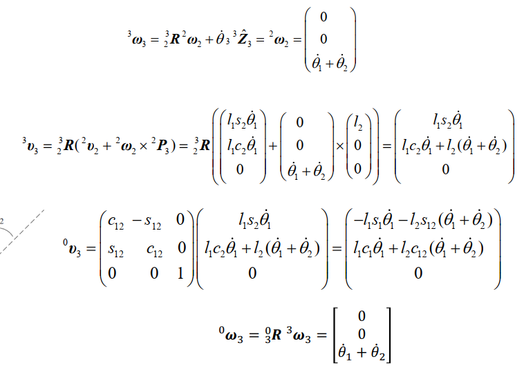
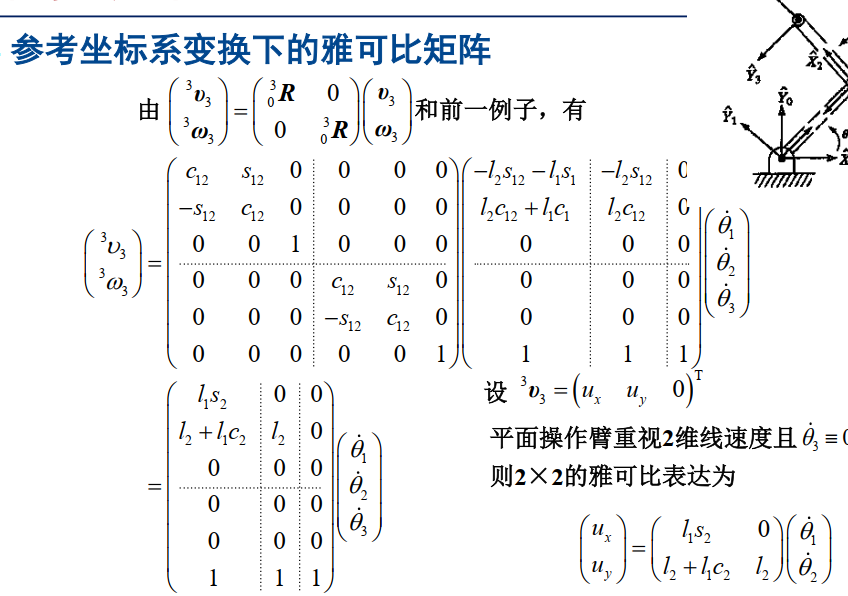
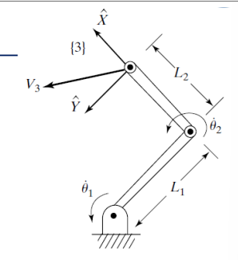
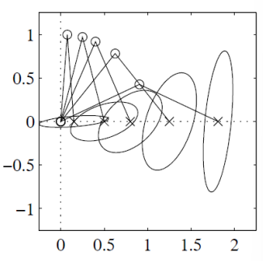
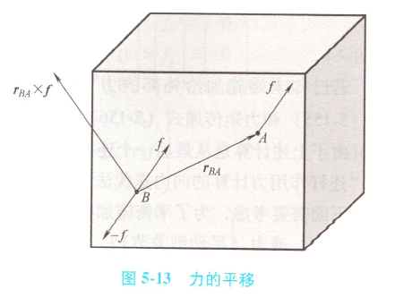
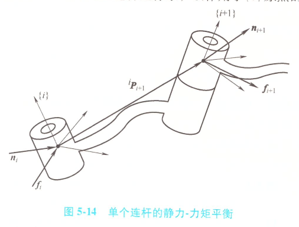
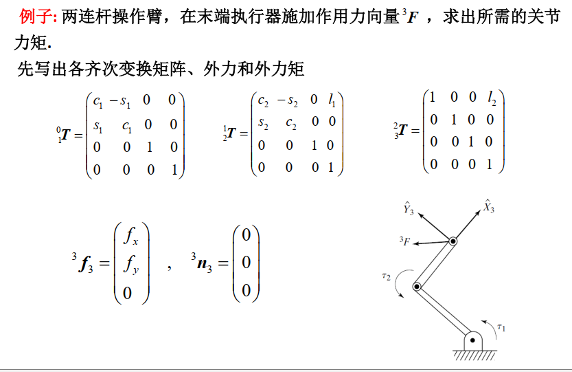
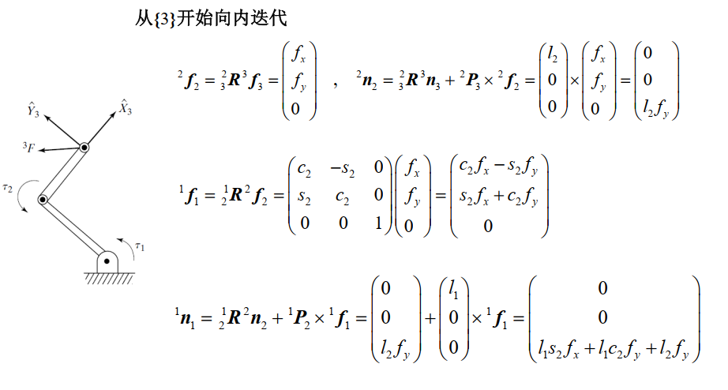
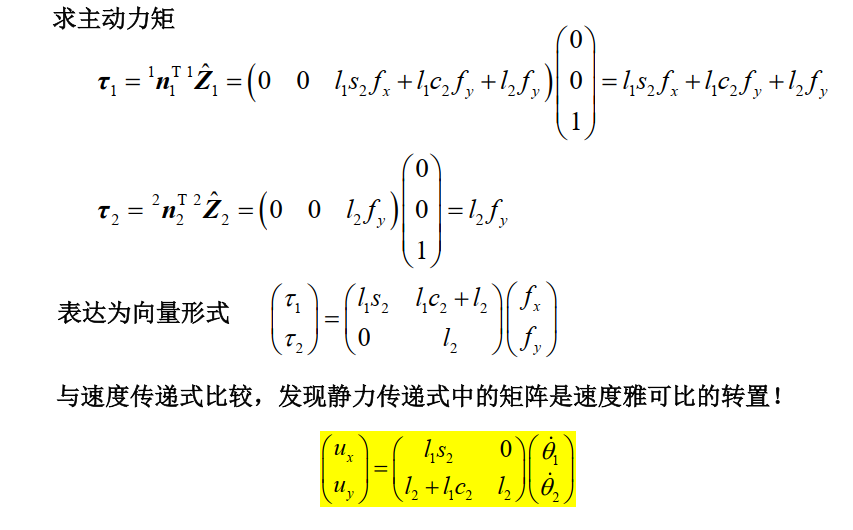

# 微分运动学与静力学

## 时变位姿的表示

先介绍线速度向量

矢量$^BQ$的微分表示为：
$$
^BV_Q = \frac{d}{dt}{^BQ} = \lim_{\Delta t \to 0} \frac{^BQ(t + \Delta t) - {^BQ}(t)}{\Delta t}
$$
若$^BQ$是某点的位置矢量，则该点关于坐标系{B}的速度为$^BV_Q$。

---

速度矢量的坐标系转换

速度矢量$^BV_Q$可在任意坐标系中描述，转换到坐标系{A}的表达式为：
$$
^{A}(^BV_Q) = {^{A}R_{B}} \cdot {^BV_Q} = \frac{^{A}d}{dt}{^BQ} = \lim_{\Delta t \to 0} {^{A}_BR(t)} \left( \frac{^BQ(t + \Delta t) - {^BQ}(t)}{\Delta t} \right)
$$

---

关键区别说明

需特别注意$^{A}(^BV_Q)$与绝对速度$^{A}V_Q$的区别：
$$
^{A}V_Q = \lim_{\Delta t \to 0} \frac{^{A}Q(t + \Delta t) - {^{A}Q}(t)}{\Delta t}
$$
展开后包含坐标系{B}的位移变化：
$$
^{A}V_Q = \lim_{\Delta t \to 0} \frac{
\begin{aligned}
&^{A}P_{Borg}(t + \Delta t) + {^{A}_BR}(t + \Delta t)^BQ(t + \Delta t)
- {^{A}P_{Borg}}(t) - {^{A}_BR(t)}{^BQ(t)}
\end{aligned}
}{\Delta t}
$$

当描述坐标系与参考坐标系相同时：
$$
^{B}(^BV_Q) = ^BV_Q
$$
此时无需重复标注外层坐标系上标。

经常讨论的是一个坐标系原点相对于世界坐标系{U}的速度，对于这种情况，定义一个缩写符号：
$$
v_c = {^UV_{CORG}}
$$

$$
attention: {^A \nu_C} = {^A_U R} \nu_C = {^A_UR} {^UV_{\text{CORG}}} \neq {^A V_{\text{CORG}}}
$$

> $$
> 线位移标量{\stackrel{微分}\longrightarrow}线速度标量
> $$
>
> $$
> 角位移标量{\stackrel{微分}\longrightarrow}角速度标量
> $$
>
> $$
> 线位移向量{\stackrel{微分}\longrightarrow}线速度向量
> $$
>
> $$
> 角位移向量{\stackrel{微分}\longrightarrow}\ne角速度向量
> $$

然后介绍角速度向量

姿态的变化可用角速度向量表示，但刚体姿态表示方法多故角速度向量并不由姿态表达式的微分得到而是由刚体旋转运动定义

仅考虑刚体（或{B}）的定点转动，令 $ ^A P_{Borg} = 0 $，{B}与{A}原点重合。
由理论力学知：在任一瞬间，{B}在{A}中的定点转动可以看作是绕**瞬时转动轴**（简称瞬轴）的转动，瞬轴上的每个点在该瞬时相对于{A}的速度为零。

**瞬轴与角速度矢量**

- 瞬轴的位置可随时间变化，但原点始终在瞬轴上。
- 在{A}中描述{B}的定点转动可用**角速度矢量** $ ^A \Omega_B $：
  - **方向**：瞬轴在{A}中的方向（右手螺旋定则）
  - **大小**：在{A}中{B}绕瞬轴的旋转速度
- 数学表达式：

$$
^A V_Q = ^A \Omega_B \times ^A Q \quad (\forall Q \in \text{刚体})
$$

$$
^C({^A \Omega_B}) = {^C_AR}{^A\Omega_B}
$$

> 表示坐标系$\{B\}$相对坐标系$\{A\}$的角速度在坐标系$\{C\}$中的描述

**角速度定义**：动坐标系{C}相对于世界坐标系{U}的角速度定义为：
$$
\omega_C = {}^U \Omega_C
$$
在坐标系{A}中观测的角速度表示：
$$
^A \omega_C = {^A_U R} \omega_C = {^A_U R} ^U \Omega_C \quad (\neq \, ^A \Omega_C)
$$

### 刚体的线速度和角速度

在介绍刚体的线速度和角速度之前先说明一下旋转矩阵$R$的一些性质

$$
RR^T = I_n
$$

其中，$I_n$ 是 $n \times n$ 单位阵。对于旋转矩阵，$n$ 为 3。

对式子求导得：

$$
\dot{R}R^T + R\dot{R}^T = \dot{R}R^T + (\dot{R}R^T)^T = 0_n
$$

若定义 $S = \dot{R}R^T$，则由上式可知，$S$ 是一个反对称阵 (skew-symmetric matrix)，满足：

$$
S + S^T = 0_n
$$

因此知道，旋转矩阵的微分与某个反对称阵之间存在如下特性：

$$
S = \dot{R}R^{-1} =\begin{bmatrix}
0 & -\Omega_z & \Omega_y \\
\Omega_z & 0 & -\Omega_x \\
-\Omega_y & \Omega_x & 0
\end{bmatrix}
$$
称$S$为角速度矩阵

> 向量$a$的反对称矩阵记为$a\verb|^|$，则有$a\times b = a\verb|^| b$

Q是空间中的动点，{A}和{B}是动坐标系，则(这个部分直接给出结论了)
$$
{^AV_Q} = {^AV_{BORG}+{^A_B \dot{R}}{^BQ}+{^A_B {R}}{^BV_Q}}\\
\quad={^AV_{BORG}+{^A_B {R}}{^BV_Q}+{^A\Omega_B }\times {^A}R_B {^BQ}}
$$

$$
{^A_B \dot{R}} = {^A_BS}{^A_B {R}}={^A\Omega_B }\times {^A}R_B
$$

$$
{^A_B \dot{R}}{^A_B {R}}^T = {^A_BS}
$$

对应角速度向量${^A\Omega_B = \begin{bmatrix}
\Omega_x \\
\Omega_y \\
\Omega_z
\end{bmatrix}}$定义角速度矩阵${^A_BS} = \begin{bmatrix}
0 & -\Omega_z & \Omega_y \\
\Omega_z & 0 & -\Omega_x \\
-\Omega_y & \Omega_x & 0
\end{bmatrix}$
$$
{^A_BS}= {^A\Omega_B}\textasciicircum
$$
对任意三维向量$P$，有
$$
{^A_BS}P= {^A\Omega_B}\textasciicircum P = {^A\Omega_B}\times P
$$

$$
A\times B=
\begin{bmatrix}
a_2b_3-a_3b_2 \\
a_3b_1-a_1b_3 \\
a_1b_2-a_2b_1
\end{bmatrix}=
\begin{bmatrix}
0 & -a_3 & a_2 \\
a_3 & 0 & -a_1 \\
-a_2 & a_1 & 0
\end{bmatrix}
\begin{bmatrix}
b_1 \\
b_2 \\
b_3
\end{bmatrix}\in\mathbb{R}^3
$$

接着我们来探究运动坐标系$\{A\},\{B\},\{C\}$之间角速度向量之间的关系：
$$
^A \Omega_C = ^A \Omega_B + {^A_B R} {^B \Omega_C}
$$

这表明在同一坐标中，角速度向量可以相加

## 连杆间速度传递

在操作臂工作过程中，基座静止，因此通常将{0}坐标系作为世界坐标系{U}使用。

对于连杆i的联体坐标系{i}，其速度和角速度在局部坐标系中的表达式为：
$$
^i v_i = {^i_U R} v_i = {}^i_U R {}^UV_{\text{iORG}} = {}^i_0 R{}^0 V_{\text{iORG}}
$$

$$
^i \omega_i = {}^i_U R \omega_i ={}^i_U R {}^U\Omega_i = {}^i_0 R {}^0 \Omega_i
$$

对于第i+1个连杆，其运动参数可表示为：
$$
^{i+1} v_i = {^{i+1}_U R} v_i = {}^{i+1}_U R {}^UV_{\text{iORG}} = {}^{i+1}_0 R{}^0 V_{\text{iORG}}
$$

$$
^{i+1} \omega_i = {}^{i+1}_U R \omega_i ={}^{i+1}_U R {}^U\Omega_i = {}^{i+1}_0 R {}^0 \Omega_i
$$

通过坐标系转换关系可得：
$$
^{i+1} v_i = {}{^{i+1}_i R^i} v_i
$$

$$
^{i+1} \omega_i = {}^{i+1}_i R^i \omega_i
$$

- 当关节$i+1$是旋转关节时
  $$
  {^{i+1}\omega_{i+1}} = {^{i+1}_i}R{^i\omega_i}+\dot{\theta}_{i+1}{^{i+1}Z_{i+1}}
  $$

  > 连杆$i+1$针对世界坐标系的角速度在连杆坐标系$\{i+1\}$中的表示

  > - ${^{i+1}Z_{i+1}} = [0,0,1]^\top$是轴i+1在$\{i+1\}$中的表示
  > - $\dot{\theta}_{i+1}$是旋转关节i+1的关节转速即为${^i\omega_i}$
  > - ${^BQ} = {^iP_{i+1}}$为$\{i+1\}$的原点在$\{i\}$中的表示，是定常向量，因此${^B V_Q}=0$

  $$
  {^{i+1}\nu_{i+1}} = {^{i+1}_i}R({^i\nu_i}+{^{i}\omega}_{i}\times{^{i}P_{i+1}})
  $$

- 当关节$i+1$是移动关节时
  $$
  {^{i+1}\omega_{i+1}} = {^{i+1}_i}R{^i\omega_i}
  $$

  $$
  {^{i+1}\nu_{i+1}} = {^{i+1}_i}R({^i\nu_i}+{^{i}\omega}_{i}\times{^{i}P_{i+1}})+\dot{d}_{i+1} {^{i+1}Z_{i+1}}
  $$

  > $\dot{d}_{i+1} $是移动关节$i+1$的平移速度

### 向外迭代法

若已知每个关节，最后可求得${^N\omega_N}~and ~ {^N\nu _N}$，进一步可得
$$
\nu_N ={^0_NR}{^N\nu _N},\quad{\omega_N} = {^0_NR}{^N\omega_N}
$$

> 基坐标系速度为0，${^0\omega_0}=0~and ~ {^0\nu _0}=0 $

向外迭代本质是计算机器人的几何雅可比矩阵

下面给出一个栗子：

## 雅可比矩阵

### 几何雅可比

**在机器人学中，雅克比矩阵主要是用来求末端执行器的角速度和线速度（ΔX）**

在机器人学中，雅克比矩阵主要是用来求末端执行器的角速度和线速度（ΔX）雅可比矩阵 有大问题[学习笔记之——Jacobian matrix（雅可比矩阵）](https://blog.csdn.net/gwplovekimi/article/details/104977255)

雅可比矩阵的重要性在于它体现了一个可微方程与给出点的最优线性逼近。因此，雅可比矩阵类似于多元函数的导数。
$$
J(X) = \begin{bmatrix}
\frac{\partial f_1}{\partial x_1}(X) & \frac{\partial f_1}{\partial x_2}(X) & \cdots & \frac{\partial f_1}{\partial x_n}(X) \\
\frac{\partial f_2}{\partial x_1}(X) & \frac{\partial f_2}{\partial x_2}(X) & \cdots & \frac{\partial f_2}{\partial x_n}(X) \\
\vdots & \vdots & \ddots & \vdots \\
\frac{\partial f_m}{\partial x_1}(X) & \frac{\partial f_m}{\partial x_2}(X) & \cdots & \frac{\partial f_m}{\partial x_n}(X)
\end{bmatrix}
$$

$$
\dot{Y} = J(x) \dot{X}
$$

$$
(v~~~\omega)^T = J(\Phi)\dot{\Phi}
$$

雅可比矩阵的维数与机器人的构型有关，它的行数为机器人在笛卡儿空间的自由度数量，列数为机器人的关节数量

> 注意：这里的$\omega = (\omega_x~~~\omega_y~~~\omega_z)^T$不能直接由基座标系下的末端姿态最小表示（如欧拉角）求导得到

求解雅可比矩阵的方法：

| 方法       | 特点                             |
| ---------- | -------------------------------- |
| 位置求导法 | 运动方程直接求导                 |
| 矢量积法   | 适量方法求解，表达形式简单       |
| 微分变换法 | 相对动坐标系的微分运动           |
| 速度递推法 | 从基座递推到各连杆线速度和角速度 |

- 位置求导法：找到位置关系，直接求导

- 矢量积法：通过将机器人各关节在末端产生的速度进行叠加得到操作速度

  假设其他关节固定不动，只有第i个关节绕其轴的转速为$\dot \theta_i$，则由此产生的连杆N的线速度和角速度分别为：

  平移关节
  $$
  \begin{align*}
  v_N^{(i)} &= \dot{d}_i \hat{Z}_i \\
  \omega_N^{(i)} &= 0
  \end{align*}
  $$

  旋转关节
  $$
  \begin{align*}
  v_N^{(i)} &= \dot{\theta}_i \hat{Z}_i \times (P_N - P_i) \\
  \omega_N^{(i)} &= \dot{\theta}_i \hat{Z}_i
  \end{align*}
  $$
  末端实际线速度和角速度就是各关节造成的线速度和角速度的总和:

$$
   \nu_N = \sum_{i=1}^{N} \nu_N^{(i)}, \quad \omega_N = \sum_{i=1}^{N} \omega_N^{(i)}
$$

  定义笛卡尔速度矢量$  \nu_N = \begin{bmatrix} \nu_N \\ \omega_N \end{bmatrix} \in \mathbb{R}^6  $ 和关节空间角速度矢量$  \dot{\Theta} = \begin{bmatrix} \dot{\theta}_1 \\ \dot{\theta}_2 \\ \vdots \\ \dot{\theta}_N \end{bmatrix} \in \mathbb{R}^N  $

  则：

$$
\nu_N = \begin{bmatrix} \hat{Z}_1 \times (P_N - P_1) & \hat{Z}_2 \times (P_N - P_2) & \cdots & \hat{Z}_{N-1} \times (P_N - P_{N-1}) & 0 \\ \hat{Z}_1 & \hat{Z}_2 & \cdots & \hat{Z}_{N-1} & \hat{Z}_N \end{bmatrix} \dot{\Theta}
$$

$$
  = J(\Theta) \dot{\Theta},  J(\Theta) \in \mathbb{R}^{6 \times N}
$$

即为雅可比矩阵

> 其中$\hat Z_{i}$表示坐标系{i}的z轴单位向量在坐标系{0}中的表示，直接是$_i^0T$的第三列
>
> $P_i$直接是$_i^0T$的第四列
>
> 若是移动关节$\hat Z_{i}$等于$[0~~~0~~~0]^T$

对于任意已知的操作臂位形，关节速度和操作臂末端速度的关系是线性的，然而这种线性关系仅仅是瞬时的，因为在下一刻，雅可比矩阵就会有微小的变化。

  

参考坐标系变换下的雅可比矩阵

若关心 $\{i\}$ 中的笛卡尔速度向量，则
$$
\begin{pmatrix}
^i \mathbf{v}_N \\
^i \mathbf{\omega}_N
\end{pmatrix}
=
\begin{pmatrix}
^i_0 \mathbf{R} & 0 \\
0 & ^i_0 \mathbf{R}
\end{pmatrix}

\begin{pmatrix}
\mathbf{v}_N \\
\mathbf{\omega}_N
\end{pmatrix}
=
\begin{pmatrix}
^i_0 \mathbf{R} & 0 \\
0 & ^i_0 \mathbf{R}
\end{pmatrix}
\mathbf{J}(\mathbf{\Theta}) \dot{\mathbf{\Theta}}
$$
变换后的雅可比矩阵表示为
$$
^i \mathbf{J}(\mathbf{\Theta}) =
\begin{pmatrix}
^i_0 \mathbf{R} & 0 \\
0 & ^i_0 \mathbf{R}
\end{pmatrix}
\mathbf{J}(\mathbf{\Theta})
$$
最终速度向量表达式为
$$
\begin{pmatrix}
^i \mathbf{v}_N \\
^i \mathbf{\omega}_N
\end{pmatrix}
= ^i \mathbf{J}(\mathbf{\Theta}) \dot{\mathbf{\Theta}}
$$

- 微分变换法[【机器人学】微分变换与雅可比矩阵 - 简书 (jianshu.com)](https://www.jianshu.com/p/94213f4fe544)

  $$
  \begin{bmatrix}
  v\\
  \omega
  \end{bmatrix} = J\dot{\theta}
  $$

  - 先正运动学得到末端位姿表示$T=\begin{bmatrix}
    R & p\\
    0&1
    \end{bmatrix}$

  - 线速度雅可比：$J_v$直接p对每个关节求偏导

  - 角速度雅可比：$J_{\omega}$为关节角速度对每个关节求偏导

    对应角速度向量${\omega = \begin{bmatrix}
    \omega_x \\
    \omega_y \\
    \omega_z
    \end{bmatrix}}$定义角速度矩阵${S} = \begin{bmatrix}
    0 & -\omega_z & \omega_y \\
    \omega_z & 0 & -\omega_x \\
    -\omega_y & \omega_x & 0
    \end{bmatrix}$
    $$
    \dot R =SR,so~~S=\dot R R^T
    $$

    $$
    \omega = vec(\dot R R^T)
    $$

    所以实际运用时为：
    $$
    \omega_i = vec(\frac{\partial R}{\partial \theta_i}  R^T)
    $$

    $$
    J_w = [\omega_1,...,\omega_n]
    $$

    > 矩阵R如何对$\theta_i$求偏导？
    >
    > 旋转矩阵 R 由各关节变换矩阵连乘得到$R=R_1(\theta_1)...R_n(\theta_n)$，对R求$\theta_i$的偏导时，只需关注第$i$个关节的旋转分量即可，和正常求导一样
    > $$
    > \frac{\partial R}{\partial \theta_i}=R_1...(\frac{\partial R_i}{\partial \theta_i})...R_n
    > $$
    >
    > $$
    > 如果R_i(\theta_i) = \begin{bmatrix} c\theta_i& -s\theta_i&0\\
    > s\theta_i&c\theta_i&0\\
    > 0&0&1
    > \end{bmatrix},\\则\frac{\partial R_i}{\partial \theta_i} = \begin{bmatrix}
    > -s\theta_i& -c\theta_i&0\\
    > c\theta_i& -s\theta_i&0\\
    > 0&0&1
    > \end{bmatrix}
    > $$

  - $$
    J =\begin{bmatrix}
    J_v\\
    J_\omega
    \end{bmatrix}
    $$

  以下是一个例子：

  

  机器人的微分运动指的是机器人的微小运动，可以用它推导不同部件之间的速度关系。因此，如果在一个小的时间段内测量或计算这个运动，就能得到速度关系。

  B点的位置方程为：

  $$
  \begin{aligned}
  x_b &= l_1 \cos\theta_1 + l_2 \cos(\theta_1 + \theta_2) \\
  y_b &= l_1 \sin\theta_1 + l_2 \sin(\theta_1 + \theta_2)
  \end{aligned}
  $$

  全微分方程为：

  $$
  \begin{aligned}
  dx_b &= \left[ -l_1 \sin\theta_1 - l_2 \sin(\theta_1+\theta_2) \right] d\theta_1 - l_2 \sin(\theta_1+\theta_2) d\theta_2 \\
  dy_b &= \left[ l_1 \cos\theta_1 + l_2 \cos(\theta_1+\theta_2) \right] d\theta_1 + l_2 \cos(\theta_1+\theta_2) d\theta_2
  \end{aligned}
  $$

---

  矩阵形式表示
$$
  \begin{bmatrix}
  dx_b \\
  dy_b
  \end{bmatrix}
  =
  \underbrace{
  \begin{bmatrix}
  -l_1 \sin\theta_1 - l_2 \sin(\theta_1+\theta_2) & -l_2 \sin(\theta_1+\theta_2) \\
  l_1 \cos\theta_1 + l_2 \cos(\theta_1+\theta_2) & l_2 \cos(\theta_1+\theta_2)
  \end{bmatrix}
  }_{\text{雅可比矩阵 } J}
  \begin{bmatrix}
  d\theta_1 \\
  d\theta_2
  \end{bmatrix}
$$

  两边同时除以$dt$就能得到速度关系

  B点的微分运动通过雅可比矩阵与关节的微分运动联系：

$$
  \begin{bmatrix}
  \dot{x}_b \\
  \dot{y}_b
  \end{bmatrix}
  = J
  \begin{bmatrix}
  \dot{\theta}_1 \\
  \dot{\theta}_2
  \end{bmatrix}
$$

  其中对时间求导关系：

$$
  dx_b = \dot{x}_b dt, \quad d\theta_1 = \dot{\theta}_1 dt
$$

---

  扩展应用

  对于多自由度机器人（如 $n$ 关节机器人），广义雅可比矩阵可表示为：

$$
  J \in \mathbb{R}^{m \times n} \quad (m: \text{操作空间维度}, n: \text{关节数})
$$

  该矩阵建立了关节速度到末端执行器速度的映射：

$$
  v_{\text{end}} = J \dot{\theta}
$$

- 向外迭代法：见上节

  主要是要使用${^0\nu_N},{^0\omega_N}$

- 内推法：得到的力域$J^T$，是在末端坐标系下

### 参考坐标系变换下的雅可比矩阵

雅可比矩阵可以在不同的参考坐标系下表示。若在关节坐标系中表达机器人末端笛卡儿速度向量，则
$$
\begin{pmatrix}
\dot{v}_N \\
\dot{\omega}_N
\end{pmatrix}
=
\begin{pmatrix}
{}_0^i R & 0 \\
0 & {}_0^i R
\end{pmatrix}
\begin{pmatrix}
v_N \\
\omega_N
\end{pmatrix}
=
\begin{pmatrix}
{}_0^i R & 0 \\
0 & {}_0^i R
\end{pmatrix}
J(\Phi) \dot{\Phi}
$$

$$
{}^i J(\Phi) = \begin{pmatrix}
{}_0^i R & 0 \\
0 & {}_0^i R
\end{pmatrix} J(\Phi)
$$

$$
\begin{pmatrix}
\dot{v}_N \\
\dot{\omega}_N
\end{pmatrix}
= {}^i J(\Phi) \dot{\Phi}
$$

### 分析雅可比

分析雅可比$J_a(\theta)$基于对末端执行器姿态的最小表示

分析雅可比矩阵：通过操作臂末端的最小表示的运动学方程对关节变量的微分计算得到的雅可比矩阵

令$  X = \begin{bmatrix} d \\ \phi \end{bmatrix}  $表示末端执行器的位姿，其中$  d  $为基座坐标系原点到末端执行器坐标系原点的一般向量，$  \phi  $为末端执行器坐标系相对于基座坐标系姿态的最小表示（例如固定角表示或欧拉角表示）。分析雅可比满足以下形式：

$$
 \dot{X} = \begin{bmatrix} \dot{d} \\ \dot{\phi} \end{bmatrix} = J_a(\Theta) \dot{\Theta}
$$

为讨论分析雅可比矩阵与几何雅可比矩阵之间的关系，我们先介绍刚体姿态用欧拉角（或固定角）表示时，刚体角速度与相应的欧拉角速率之间的转换计算公式。

**刚体角速度与欧拉角速率的关系：**

刚体姿态矩阵（SO(3)群元素）：

$$
R = \begin{pmatrix}
r_{11} & r_{12} & r_{13} \\
r_{21} & r_{22} & r_{23} \\
r_{31} & r_{32} & r_{33}
\end{pmatrix} \in \mathbb{R}^{3\times3}
$$

旋转矩阵微分方程：$$ \dot{R}R^T = S(\omega) $$其中反对称矩阵：
$$
S(\omega) = \begin{pmatrix}
0 & -\omega_z & \omega_y \\
\omega_z & 0 & -\omega_x \\
-\omega_y & \omega_x & 0
\end{pmatrix}
$$
通过矩阵运算提取角速度分量：

$$
\omega = \begin{pmatrix}
\omega_x \\
\omega_y \\
\omega_z
\end{pmatrix} = \begin{pmatrix}
\dot{r}_{31}r_{21} + \dot{r}_{32}r_{22} + \dot{r}_{33}r_{23} \\
\dot{r}_{11}r_{31} + \dot{r}_{12}r_{32} + \dot{r}_{13}r_{33} \\
\dot{r}_{21}r_{11} + \dot{r}_{22}r_{12} + \dot{r}_{23}r_{13}
\end{pmatrix}
$$

这里假设刚体姿态采用**Z-Y-Z欧拉角**表示：$$ \Psi = (\alpha,\ \beta,\ \gamma)^T $$，欧拉角速率$\dot\Psi = (\alpha,\ \beta,\ \gamma)^T$

总旋转矩阵为三次旋转的复合：$$ R = R_{Z\prime Y\prime Z\prime }(\alpha,\beta,\gamma) = R_z(\alpha)R_y(\beta)R_z(\gamma) $$

对$\omega_x$的详细展开：$\omega_y,\omega_z$同理

$$
\omega_x = \left(\frac{\partial r_{31}}{\partial \alpha}r_{21} + \frac{\partial r_{32}}{\partial \alpha}r_{22} + \frac{\partial r_{33}}{\partial \alpha}r_{23}\right)\dot{\alpha} + \\
\left(\frac{\partial r_{31}}{\partial \beta}r_{21} + \frac{\partial r_{32}}{\partial \beta}r_{22} + \frac{\partial r_{33}}{\partial \beta}r_{23}\right)\dot{\beta} + \\
\left(\frac{\partial r_{31}}{\partial \gamma}r_{21} + \frac{\partial r_{32}}{\partial \gamma}r_{22} + \frac{\partial r_{33}}{\partial \gamma}r_{23}\right)\dot{\gamma}\\
=-s\alpha\dot{\beta}+c\alpha s\beta \dot{\gamma} = (0\quad -s\alpha
\quad c\alpha s\beta)\dot\Psi
$$

$$
\omega = \begin{pmatrix}
\omega_x \\
\omega_y \\
\omega_z
\end{pmatrix} = B(\Psi) \dot{\Psi}
$$

$$
B(\Psi) = \begin{pmatrix}
0 & -\sin\alpha & \cos\alpha\sin\beta \\
0 & \cos\alpha & \sin\alpha\sin\beta \\
1 & 0 & \cos\beta
\end{pmatrix}
$$

> 其中符号简写：
> $s\alpha = \sin\alpha,\ c\alpha = \cos\alpha,\ s\beta = \sin\beta$

则针对Z-Y-Z欧拉角，角速度与欧拉角速率的关系为 （欧拉运动学方程）：
$$
\omega =B(\Psi)\dot{\Psi}
$$
几何雅可比与分析雅可比矩阵的转换：
$$
\begin{bmatrix} v \\ \omega \end{bmatrix} = \begin{bmatrix} \dot{d} \\ {\omega} \end{bmatrix} = J(\Theta) \dot{\Theta}
$$

$$
J(\Theta) \dot{\Theta} = \begin{bmatrix} v \\ \omega \end{bmatrix} = \begin{bmatrix} \dot{d} \\ B(\phi) \dot{\phi} \end{bmatrix} = \begin{bmatrix} I & 0 \\ 0 & B(\phi) \end{bmatrix} \begin{bmatrix} \dot{d} \\ \dot{\phi} \end{bmatrix} = \begin{bmatrix} I & 0 \\ 0 & B(\phi) \end{bmatrix} J_a(\Theta) \dot{\Theta}
$$

$$
 J_a(\Theta) = \begin{bmatrix} I & 0 \\ 0 & B^{-1}(\phi) \end{bmatrix} J(\Theta)
$$

要求$  B  $矩阵可逆，记$  T_a = \begin{bmatrix} I & 0 \\ 0 & B^{-1}(\phi) \end{bmatrix}  $则$  J_a(\Theta) = T_a J(\Theta)  $

由关系可知几何雅可比矩阵的所有奇异位形都是分析雅可比矩阵的奇异位形，但当$B$不可逆时，这是由欧拉角表示造成的分析雅可比矩阵的奇异点与欧拉角奇异点一致

因此$B$的奇异点也称为分析雅可比矩阵的表示奇异点

### 逆运动学数值解

机器人逆运动学的一种数值解法可以作为分析雅可比矩阵应用的一个例子

逆运动学问题：给定$N$自由度机器人期望的齐次变换矩阵$T^d$,求关节变量 $\Phi=\begin{bmatrix}\phi_1&\phi_2&\cdots&\phi_N\end{bmatrix}^\mathrm{T}$
$$_N^0\boldsymbol{T}={}_1^0\boldsymbol{T}(\phi_1){}_2^1\boldsymbol{T}(\phi_2)\cdots{}_N^{N-1}\boldsymbol{T}(\phi_N)=\boldsymbol{T}^d$$
记末端执行器的位姿为$X(\boldsymbol{\Phi})$,期望位姿为$X^d$ ,则问题转化为求关节向量 $\boldsymbol{\varphi}$ 满足$X(\boldsymbol{\Phi})=X^d$

利用牛顿-拉夫逊(Newton-Raphson)法可以迭代求解上述方程。
记期望的关节变量为$\boldsymbol{\Phi}^d$,即$X\left(\boldsymbol{\Phi}^d\right)=X^d$ ,牛顿-拉夫逊法是从一个猜测的初始关节变量$\boldsymbol{\Phi}^{0}$开始，迭代计算$\Phi^k$,最终逼近 $\boldsymbol{\Phi}^d$ 过程中需要利用末端位姿关于关节变量的微分，这正是分析雅可比矩阵。
记$\delta\boldsymbol{\Phi}^k=\boldsymbol{\Phi}^d-\boldsymbol{\Phi}^k$ ,$\delta X\left(\boldsymbol{\Phi}^k\right)=X\left(\boldsymbol{\Phi}^d\right)-X\left(\boldsymbol{\Phi}^k\right)$ ,则由一阶泰勒展开近似得到
$X\left(\boldsymbol{\varphi}^d\right)=X\left(\boldsymbol{\varphi}^k\right)+\frac{\partial\boldsymbol{X}}{\partial\boldsymbol{\varphi}}\left(\boldsymbol{\varphi}^k\right)\delta\boldsymbol{\Phi}^k+\mathcal{O}\left(\left(\delta\boldsymbol{\varphi}^k\right)^2\right)$
$\delta X\left(\boldsymbol{\Phi}^k\right)=\frac{\partial\boldsymbol{X}}{\partial\boldsymbol{\varphi}}\left(\boldsymbol{\Phi}^k\right)\delta\boldsymbol{\Phi}^k=\boldsymbol{J}_a\left(\boldsymbol{\Phi}^k\right)\delta\boldsymbol{\Phi}^k$

由此得到迭代计算式$$\boldsymbol{\Phi}^{k+1}=\boldsymbol{\Phi}^k+\boldsymbol{J}_a^{-1}\left(\boldsymbol{\Phi}^k\right)\delta\boldsymbol{X}\left(\boldsymbol{\Phi}^k\right)$$

> 这里使用$J_a^{-1}$，若是冗余机械臂则为行满秩，使用右逆矩阵$J_a^+$

每步迭代可以在冗余自由度中引入零空间优化目标（如避障，能耗最小化等），即
$$
\boldsymbol{\Phi}^{k+1}=\boldsymbol{\Phi}^k+\boldsymbol{J}_a^{+}\left(\boldsymbol{\Phi}^k\right)\delta\boldsymbol{X}\left(\boldsymbol{\Phi}^k\right) + (I - J^+J)Z^k
$$
其中$Z^k$为零空间优化项，可通过二次规划求解

## 逆微分运动学

当机械臂关节角处于$\theta$时：

- 正向速度关系：
  末端执行器的笛卡尔空间速度 $v_N$（含线速度与角速度）可表示为：$$ v_N = J(\theta)\dot{\theta} $$

- 逆向速度求解：
  已知末端速度 $v_N$ 时，关节角速度可通过雅可比逆矩阵计算：$$ \dot{\theta} = J^{-1}(\theta)v_N $$

对于冗余机械臂（关节数 > 任务空间维度）和欠驱动机械臂（关节数 < 任务空间维度），雅可比矩阵不是方阵，需要考虑雅可比矩阵的伪逆（广义逆）

对于维度为 $m \times n$ 的满秩矩阵 $A$，伪逆矩阵 $A^+$ 的计算方式：

| 条件 | 类型             | 计算公式               |
| ---- | ---------------- | ---------------------- |
| m>n  | 左逆矩阵，列满秩 | $A^+ = (A^TA)^{-1}A^T$ |
| m<n  | 右逆矩阵，行满秩 | $A^+ = A^T(AA^T)^{-1}$ |

- 过定方程组（m > n），通常方程组无解，此时使得$||Ax-b||^2$最小的x为方程的最小二乘解，由左伪逆计算：
  $$
  x^* =A^+b=A^{-1}_{left}b =  (A^TA)^{-1}A^Tb
  $$

  $$
  \begin{bmatrix} 1 \\ 1 \end{bmatrix} x = \begin{bmatrix} 0 \\ 2 \end{bmatrix}，x^* = \left( \begin{bmatrix} 1 & 1 \end{bmatrix} \begin{bmatrix} 1 \\ 1 \end{bmatrix} \right)^{-1} \begin{bmatrix} 1 & 1 \end{bmatrix} \begin{bmatrix} 0 \\ 2 \end{bmatrix}=1
  $$

- 欠定方程组（m < n），通常方程组可能存在无数个解，此时所有解中使得x范数最小的x为方程的最小范数解，由右伪逆计算：
  $$
  x^* =A^+b=A^{-1}_{right}b =  A^T(AA^T)^{-1}b
  $$

  $$
  \begin{bmatrix} 1 & 1 \end{bmatrix} \begin{bmatrix} x_1 \\ x_2 \end{bmatrix} = 2，\begin{bmatrix} x_1^* \\ x_2^* \end{bmatrix} = \begin{bmatrix} 1 \\ 1 \end{bmatrix} \underbrace{\left( \begin{bmatrix} 1 & 1 \end{bmatrix} \begin{bmatrix} 1 \\ 1 \end{bmatrix} \right)^{-1}}_{2^{-1}} 2=\begin{bmatrix} 1 \\ 1 \end{bmatrix}
  $$

A的零空间定义如下$$ \mathcal{N}(A) = \{x \in \mathbb{R}^n: Ax = 0\} $$

| 矩阵维度 | 秩条件 | 零空间特性   | 计算示例                                       |
| -------- | ------ | ------------ | ---------------------------------------------- |
| m ≥ n    | 列满秩 | 仅含零向量   | $A = \begin{bmatrix}1 \\ 1\end{bmatrix},\ x=0$ |
| m < n    | 行满秩 | 非平凡解空间 | $\tilde{x} = (I - A^T(AA^T)^{-1}A)x$           |

$$
 P = I - A^+A = \begin{cases}
I - (A^TA)^{-1}A^TA & (m \geq n) \\
I - A^T(AA^T)^{-1}A & (m < n)
\end{cases}
$$

所以逆微分运动总结如下：

1. 无冗余情况（操作空间=关节数）：$$ \dot{\theta} = J^{-1}(\theta)v_N $$

   正常情况可逆，但是需要判断矩阵条件数（可用可操作度来进行度量）防止关节角度无穷大，加正则化进行避免

2. 冗余情况（操作空间<关节数）

   其中满足关节速度范数最小的一个特解（最小范数特解）：
   $$
   \dot{\theta}_r = J^T(JJ^T)^{-1}v_N
   $$
   通解表达式：
   $$
   \dot{\theta} = \underbrace{J^T(JJ^T)^{-1}v_N}_{特解} + \underbrace{(I - J^T(JJ^T)^{-1}J)\dot{\Phi}_f}_{零空间解}
   $$
   其中$\dot{\Phi}_f$便利所有的关节速度向量

   此时零空间解只影响机器人的内部运动，可以对机器人的位形进行重新配置，但不改变末端位姿

3. 欠驱动情况（操作空间>关节数）

   此时若雅可比矩阵是列满秩的，则最小二乘解：
   $$
   \dot{\theta} = (J^TJ)^{-1}J^Tv_N
   $$

## 奇异性

$$
\dot \theta = J^{-1} (\theta)\nu_N
$$

若$J(\theta)$可逆，则可以计算出各关节的转速。

使$J$都有使得其不可逆的值，这些$\theta$值所对应的位姿称为机构的**奇异位形或简称奇异状态**

$$
rank(J(\Phi))<\min(m,N)
$$

> 平面机器人只需要关心平面二维线速度部分的雅可比矩阵即可

奇异位形影响：

- 当机械手处于奇异位型时，会出现自由度缺失的情况，末端执行器的灵活性变差；
- 当机械手处于奇异位型时，逆运动学问题可能出现无穷解；
- 当接近奇异位型时，操作空间中细微的速度会导致关节空间中出现很大的速度。

奇异位形分类：

- 工作空间边界的奇异位形：出现在操作臂完全展开或者收回使得末端执行器处于或非常接近空间边界的情况
- 工作空间内部的奇异位形。 出现在远离工作空间的边界，**通常是由于两个或两个以上的关节轴线共线**引起的

> 所有的操作臂在工作空间的边界都存在奇异位形，并且大多数操作臂在它们的工作空间也有奇异位形
>
> 对于平面机械臂，判断奇异性时，平面机械臂只需关心平面二维线速度部分的雅可比矩阵

**可操作度**：衡量机器人位形与奇异位形距离的一种度量方式

> 由于欠驱动机器人的逆微分运动只有最小二乘解，一般只讨论无冗余和冗余机器人的可操作性问题

若机械臂处于某位形时关节向量为$\boldsymbol{\Phi}$,关节速度取为单位速度向量$\dot{\boldsymbol{\Phi}}_e$ ,满足 $\dot{\boldsymbol{\Phi}}_e^\mathrm{T}\dot{\boldsymbol{\Phi}}_e=1$

$\dot \Phi_e$可以看成高维单位球面上的一点

此时，机器人末端速度记为$\nu_{_e}$,则满足

- 机器人无冗余：$v_e^\mathrm{T}\left(\boldsymbol{J}(\boldsymbol{\Phi})\boldsymbol{J}(\boldsymbol{\Phi})^\mathrm{T}\right)^{-1}v_e=1$

  说明此时末端速度$v_e$在末端速度空间中的高维椭球面上，椭球体的形状和姿态由$\left(\boldsymbol{J}(\boldsymbol{\Phi})\boldsymbol{J}(\boldsymbol{\Phi})^\mathrm{T}\right)^{-1}$确定

- 机器人冗余：针对其逆微分运动的最小范数解由$v_e^\mathrm{T}\left(J(\boldsymbol{\Phi})\boldsymbol{J}(\boldsymbol{\Phi})^\mathrm{T}\right)^{-1}v_e\leq1$

  说明此时末端速度$v_e$在末端速度空间中的高维椭球面中

当机器人处于某位形时，限制关节速度为单位速度向量，机器人末端速度所构成的空间称作该位形的**可操作椭球体**

假设机器人

- 关节数：$N$
- 末端操作空间维度：$m$（满足 $N \geq m$）

$m\times N$雅可比矩阵的奇异值分解为$$ J = U\Sigma V^T $$，$U,V$为正交矩阵，$\Sigma$为对角阵

| 矩阵     | 维度         | 组成要素                          |
| -------- | ------------ | --------------------------------- |
| $U$      | $m \times m$ | $JJ^T$ 的特征向量$u_i$张成        |
| $V$      | $N \times N$ | $J^TJ$ 的特征向量$v_i$张成        |
| $\Sigma$ | $m \times N$ | 奇异值矩阵（对角元素 $\sigma_i$） |

$\Sigma=diag(\sigma_1,...\sigma_m)$其主对角线外的元素均为零，主对角上的每个元素为$J$的奇异值

$$ \sigma_i = \sqrt{\lambda_i(JJ^T)} \quad (i = 1,\cdots,m) ,\sigma_1\ge \sigma_2\ge...\ge\sigma_m\ge 0$$

> 即 $\lambda_i$ 为 $JJ^T$ 的特征值

由此得到
$$
\boldsymbol{v}_e^\mathrm{T}\left(\boldsymbol{J}\boldsymbol{J}^\mathrm{T}\right)^{-1}\boldsymbol{v}_e=\left(\boldsymbol{U}^\mathrm{T}\boldsymbol{v}_e\right)^\mathrm{T}\boldsymbol{\Sigma}^{-2}\left(\boldsymbol{U}^\mathrm{T}\boldsymbol{v}_e\right)
$$
其中，$\Sigma^{-2}=diag\left(\sigma_1^{-2},\sigma_2^{-2},\cdots,\sigma_m^{-2}\right)$,记 $\alpha = U^\mathrm{T} \boldsymbol{\nu }_e$ 则

$$
v_e^\mathrm{T}\left(\boldsymbol{J}\boldsymbol{J}^\mathrm{T}\right)^{-1}\boldsymbol{v}_e=\boldsymbol{\alpha}^\mathrm{T}\boldsymbol{\Sigma}^{-2}\boldsymbol{\alpha}=\sum_{i=1}^m\frac{\alpha_i^2}{\sigma_i^2}\leq1
$$
为标准的椭球体方程，表明机器人此位形的可操作椭球体的轴由向量$\sigma_i u_i$给出

机器人关节速度取单位速度时：

1. 可操作椭球体轴的长度越大，在该轴方向上，所得到的末端速度越大，表明在该方向上运动能力越强；
2. 可操作椭球体轴的长度越小，在该轴方向上，所得到的末端速度越小，表明在该方向上运动能力越弱。

因此机器人位形的可操作椭球体描述了机器人改变末端位姿的能力。

为更直观的衡量机器人位形与奇异位形之间的距离，可以使用可操作椭球体的**体积**作
为度量。可操作椭球体的体积与雅可比矩阵$J$的奇异值的连乘 $\sigma_1\sigma_2\cdots\sigma_m$成比例。
定义机器人处于位形$\Phi$时的可操作度为 $\kappa(\boldsymbol{\Phi})$
$$
\kappa(\boldsymbol{\Phi})=\sigma_1\sigma_2\cdots\sigma_m=\sqrt{\det\left(\boldsymbol{J}(\boldsymbol{\Phi})\boldsymbol{J}^\mathrm{T}(\boldsymbol{\Phi})\right)}
$$

1. 在奇异位形，$JJ^\mathrm{T}$不是满秩的，因此可操作度$\kappa=0$
2. 在非奇异位形，可操作度$\kappa>0$ ,而且$\kappa$越大，机器人改变末端位姿的可操作性越好

当机器人无冗余时，雅可比矩阵$J$为方阵，则 det$\left(\boldsymbol{JJ}^\mathrm{T}\right)=\left(\det\boldsymbol{J}\right)^2$，此时机器人位形$\Phi$的可操作度为$$\kappa(\boldsymbol{\Phi})=\left|\det(\boldsymbol{J}(\boldsymbol{\Phi}))\right|$$

当然上述定义的是速度可操作度，我们同样可以定义力可操作度，使用力可操作椭球体来衡量：$f = J^{-T}\tau$，$J^{{-T}}$的奇异值是$J$奇异值的倒数，因此两个椭球体轴方向一致但轴长度成反比

例子 计算如图所示的两连杆机器人的可操作度。

该机器人是无冗余的平面机器人，因此$\kappa=\left|\det(\boldsymbol{J})\right|=l_1l_2\left|s_2\right|$ 右图描述了两连杆平面机器人几种不同位形的可操作椭球体当$\theta_{_2}=\pm\frac\pi2$时，该两连杆平面机器人末端具有最大的可操作度可操作度，可以用于机器人结构的辅助设计。
若需设计两连杆平面机器人，当连杆总长度$l_1+l_2$为定值时，如何设计连杆长度使机器人具有最大的可操作性？由该机器人的可操作度$\kappa$ 的表达式可知应当使乘积$l_1l_2$ 最大化，故取连杆长度$l_1=l_2$可达到相应的目标。

## 机器人的静力

操作臂在静态平衡（静止或匀速直线运动）状态下，考虑力和力矩如何从一个连杆向下一个连杆传递

> 静力可以想象为操作臂的自由末端在工作空间推某个物体，该物体未动

在最后一个连杆受外部力/力矩时，为了保持操作臂的静态平衡，计算出需要对各关节轴依次施加多大的静力矩

> 垂直于$^iP$和$^if$所在平面的矩方向意味着“矩使刚体产生绕$^iP×^if$旋转的趋势
>
> 力偶：两个大小相等、方向相反且不共线的平行力组成的力系。只改变刚体的转动状态，其转动效应可用力偶矩来度量。力偶$(\vec{f},-\vec{f})$对点O的矩为：
> $$
> \vec{OA}\times \vec{f} + \vec{OB}\times (-\vec{f}) = \vec{BA}\times \vec{f}
> $$

对刚体上的任何点，该力偶矩不变，可在刚体上任意转移

力的平移：作用于刚体A点的力可以平移到刚体上任一点B同时附加一个力偶（其力偶矩等于原力对新作用点的矩）

$f$为作用在A点的力，则转移到B点，B点受力$f$且附加一个$r_{BA}\times f$的力偶矩

**刚体静态平衡的条件**： 作用在刚体上的全部力的向量和为零且作用在刚体上的全部力矩的向量和为零，即$f_{\Sigma} =0,n_{\Sigma} = 0$

### 坐标系间力/力矩传递公式

$$
{^Bf} = {_A^BR}{^Af}\\
{^B\tau} = {^BP_A\times {^Bf}}+{_A^BR {^A\tau}}
$$

本章不考虑重力

- $f_i=$连杆i-1施加在连杆i上的力
- $n_i=$连杆i-1施加在连杆i上的力矩

在机器人动力学（如牛顿-欧拉法）中，相邻坐标系间的力和力矩传递关系可表示为：

$$
^i \mathbf{f}_i = \,_{i+1}^{i}\mathbf{R} \cdot ^{i+1}\mathbf{f}_{i+1} \quad \text{(力的传递)}
$$

$$
^i \mathbf{n}_i = \,_{i+1}^{i}\mathbf{R} \cdot ^{i+1}\mathbf{n}_{i+1} + \,^i\mathbf{P}_{i+1} \times \,^i\mathbf{f}_i \quad \text{(力矩的传递)}
$$

> 这里${^i P_{i+1}}$是坐标系$\{i+1\}$在坐标系$\{i\}$的原点表示

### 向内迭代法

若已知末端施加给外部的力${^{N+1}f_{N+1}}$和力矩${^{N+1}n_{N+1}}$ ，从连杆N开始，依次应用这些公式，可以计算出作用在每一个连杆上的力${^{i}f_{i}}$和力矩${^{i}n_{i }}$

为了平衡施加在连杆上的力和力矩，需要在关节提供多大的力矩?

旋转关节：

${^if_i}$不是主动力而是约束力，它阻止连杆i作直线运动

${^in_i}$阻止连杆i作旋转运动，在$\{i\}$中对${^in_i}$进行正交分解，可得1个沿${^iZ_i}$的力矩矢量（主动力矩，需要关节i提供）和1个垂直于${^i Z_i}$的力矩矢量（约束力矩）
$$
主动力矩为\tau_i{^iZ_i},其中~\tau_i = {^in_i^\top} {^iZ_i}
$$
移动关节：
$$
主动力矩为\tau_i{^iZ_i},其中~\tau_i = {^if_i^\top} {^iZ_i}
$$

这样算出来$\tau$代入后得到的雅可比矩阵J（求转置后）为末端坐标系内的雅可比矩阵，真正的雅可比矩阵为：
$$
J_{real}=\begin{bmatrix}
{^0_n}R & 0\\
0&{^0_n}R
\end{bmatrix} J
$$

下面是一个栗子：

### 力域中的雅可比

与速度传递式比较，发现静力传递式中的矩阵是速度雅可比的转置
$$
\tau = J^\top F
$$
力域也有奇异性问题，如：奇异位形下，末端在某些方向得不到期望的静力

虚功原理：理想约束下，系统保持静止的条件：所有作用于该系统的主动力对质点系的虚位移所作的功的和为零。

- $\delta X = [\delta X_1,...\delta X_m]$表示末端虚位移
- $\delta q = [\delta q_1,...\delta q_n]$表示关节驱动虚位移

根据虚功原理建立虚功方程:
$$
\delta W = \tau ^T \delta =F^T {\delta X}
$$
由机器人运动微分关系可知：
$$
\delta X = J \delta q
$$
联立式(1)、式(2)可得：
$$
(\tau ^T-F^T J)\delta q =0
$$
因为$ \delta q $是独立关节变量，因此有：
$$
\tau = J^T F
$$

> 对偶关系，力传递的是末端到关节空间，速度传递的是关节空间到末端

关节空间与操作空间映射关系
$$
Ax=B,range ~space域空间\\
Ax=0,null~space 零空间
$$

| 空间维度       | 数学定义                                   | 物理意义                                         |
| -------------- | ------------------------------------------ | ------------------------------------------------ |
| **关节零空间** | $  N(J) = \{ \dot{q} \mid J\dot{q}=0 \}  $ | - 关节运动不改变末端位姿 - 冗余自由度优化方向 |
| **操作零空间** | $  N(J^T) = \{ F \mid J^T F=0 \}  $        | - 外力不产生关节力矩 - 环境约束力方向         |

- **维度关系**：

$$
 \text{dim}(N(J)) = n - m \quad (\text{关节自由度} - \text{操作维度})
$$

- **正交补关系**：

$$
V^n = R(J^T) \oplus N(J)
$$

$$
V^m = R(J) \oplus N(J^T)
$$

- **冗余控制**：在零空间中实现避障/能耗优化
- **力位混合控制**：分离运动控制与力控方向
- **奇异规避**：通过零空间调整保持雅可比矩阵满秩

