# Main Takeaway

课程研究

> 本课程只讨论机械臂

<!--more-->

# 绪论

机械臂：

- 通过关节将（刚性）连杆连接
- 关节：转动或滑动
- 驱动：电机或液压
- 末端执行器安装在操作臂的自由端

- 目的：在4D空间完成4D任务

## 机械臂结构

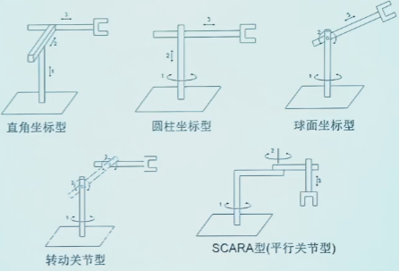

> SCARA型工业用的很多

## 发展

- 示教再现

- 机电部分
- 传感部分
- 控制部分

分类

- 伺服servo：闭环控制
- 非伺服non-servo：开环控制

按应用领域分类

- 工业机器人
- 服务机器人
- 特征机器人

## 主要技术参数

- 自由度
- 工作精度
  - 定位精度：实际达到的位置和设计的理想位置之间的差异
  - 重复定位精度：机器人重复到达某一目标位置的差异
- 工作范围
- 工作速度
- 承载能力：负载自重比

关键参数

- 臂力：1.5~3.0的安全系数

## 机械臂的轴数

- 主轴（1-3）：定位腕部
- 从轴（4-6）：确定工具位置
- 冗余（7-n）：绕开障碍物，避免不理想姿态

# 空间描述和变换

## 坐标系与向量

- 符号约定

  $_{B}^{A}R$​表示坐标系B在坐标系A中的描述

  三角函数：$\sin \theta_1=s\theta_1=s_1,\cos \theta_1=c\theta_1=c_1$
  
- 坐标系：空间笛卡尔坐标系，采用相同长度的度量单位

- 向量：

  $$
  ^AP=\begin{bmatrix}
  p_x \\
  p_y \\
  p_z
  \end{bmatrix},
  ^AQ=\begin{bmatrix}
  q_x \\
  q_y \\
  q_z
  \end{bmatrix}
  $$
  两者内积(标量)为
  $$
  \overrightarrow{OP}\cdot \overrightarrow{OQ}= {^AP} \cdot {^A Q}=
  {^AP}^T \space {^A Q}=\begin{bmatrix}
  p_x &
  p_y &
  p_z
  \end{bmatrix}
  \begin{bmatrix}
  q_x \\
  q_y \\
  q_z
  \end{bmatrix}
  $$
  将向量$r_{OP}$向单位向量$r_{OQ}$作投影得到的投影向两位$(r_{OP}\cdot r_{OQ})r_{OQ}$
  
  两者外积${^AW}$，$r_{OW} =r_{OP}\times r_{OQ} = -r_{OQ}\times r_{OP} $
  
  向量叉积的三种计算方法：
  
  方法一：分量展开式
  $$
  \begin{align*}
  w_x &= p_y q_z - p_z q_y \\
  w_y &= p_z q_x - p_x q_z \\
  w_z &= p_x q_y - p_y q_x
  \end{align*}
  $$
  
  方法二：反对称矩阵形式
  $$
  ^A W = \begin{bmatrix}
  0 & -p_z & p_y \\
  p_z & 0 & -p_x \\
  -p_y & p_x & 0
  \end{bmatrix}
  \begin{bmatrix}
  q_x \\
  q_y \\
  q_z
  \end{bmatrix} = {^AP \textasciicircum } {^AQ}
  $$
  
  方法三：行列式形式
  $$
  \mathbf{w} = \begin{vmatrix}
  \mathbf{i} & \mathbf{j} & \mathbf{k} \\
  p_x & p_y & p_z \\
  q_x & q_y & q_z
  \end{vmatrix}
  $$
  
  展开后各分量对应：
  - $  w_x  $：删去i列后的代数余子式
  - $  w_y  $：删去j列后的代数余子式
  - $  w_z  $：删去k列后的代数余子式
  
  > 机器人学中用法二最多——反对称矩阵
  >
  > $a×b$方向右手定则，食指指向a，向b弯曲

## 点和刚体的描述

- 点：用向量来描述

- 刚体：

  - 由位置+姿态共同描述

    位置：向量

    姿态：旋转矩阵

    在 \{A\} 中表示出 \{B\} 的姿态：

    
    $$
    \left( \hat{X}_B, \hat{Y}_B, \hat{Z}_B \right) = \left( \hat{X}_A, \hat{Y}_A, \hat{Z}_A \right) {}^A_B R
    $$
    
    
    其中：
    
    
    $$
    \hat{X}_B = \left( \hat{X}_A, \hat{Y}_A, \hat{Z}_A \right) \begin{pmatrix} r_{11} \\ r_{21} \\ r_{31} \end{pmatrix}
    $$
    
    $$
    \hat{Y}_B = \left( \hat{X}_A, \hat{Y}_A, \hat{Z}_A \right) \begin{pmatrix} r_{12} \\ r_{22} \\ r_{32} \end{pmatrix}
    $$
    
    $$
    \hat{Z}_B = \left( \hat{X}_A, \hat{Y}_A, \hat{Z}_A \right) \begin{pmatrix} r_{13} \\ r_{23} \\ r_{33} \end{pmatrix}
    $$
    
    
    旋转矩阵 $  {}^A_B R  $ 为：
    
    $$
    {}^A_B R   = 
    \begin{pmatrix} 
    r_{11} & r_{12} & r_{13} \\ 
    r_{21} & r_{22} & r_{23} \\ 
    r_{31} & r_{32} & r_{33} 
    \end{pmatrix} = ({^AX_B\quad{^AY_B}\quad{^AZ_B}})
    $$
    
  - 联体坐标系：物体上任意一点在联体坐标系中位置已知且始终不变

    需要将联体坐标系在固定坐标系中描述出来，旋转矩阵${^A_BR}$用9个量描述三维

    - $SO(3)$(一个李群)是所有旋转矩阵的集合，每个旋转矩阵与刚体的不同姿态一一对应

    $for~R\in SO(3),~R~ can~ be~ inversed~and~R^{-1}=R^T$

    - $SO(3)$​中任意一个矩阵都是正交矩阵

      > 行列式为1为右手坐标系中的旋转矩阵
    >
      > 行列式为-1为左手坐标系中的旋转矩阵

- 齐次变换矩阵：平移+旋转——在{A}中表示{B}的位姿
  $$
  P_A={_B^AR} P_B+{^AO_B}
  $$

  $$
  {_B^AT}=
  \left[
  \begin{array}{ccc|c}
  & {_B^AR} &  & {^AO_B} \\ \hline
  0 & 0 & 0 & 1 \\
  \end{array} 
  \right]
  \in R^{4×4}
  $$

  $$
  SE(3) = \left\{ 
  \begin{bmatrix} 
  ^A_B R & ^A O_B \\ 
  0 & 1 
  \end{bmatrix} 
  \,\bigg|\, 
  ^A_B R \in SO(3),\ ^A O_B \in \mathbb{R}^3 
  \right\}
  $$
  
  

## 坐标系几何关系！！！

- 对$R\in SO(3)$，由$R(P\times Q) = RP\times RQ$

- $$
  {_A^BR}={_B^AR}^T={_B^AR}^{-1}
  $$

- 
  $$
  {^BO_A}=-{_B^AR}{^AO_B}
  $$
  
  > $$
  > r_{O_AO_B}=\begin{align}[\hat{X}_A && \hat{Y}_A && \hat{Z}_A]\end{align}\space {^AO_B}\\
  > $$
  >
  > $$
  > r_{O_BO_A}=\begin{align}[\hat{X}_B && \hat{Y}_B && \hat{Z}_B]\end{align}\space {^BO_A}
  > $$
  >
  > 所以$r_{O_AO_B} = -r_{O_BO_A}$
  
- $$
  {_A^BT}={_B^AT}^{-1}
  $$

- $$
  {T}=
  \left[
  \begin{array}{ccc|c}
  & {R} &  & {O} \\ \hline
  0 & 0 & 0 & 1 \\
  \end{array} 
  \right],
  T^{-1}=
  \left[
  \begin{array}{ccc|c}
  & {R^T} &  & {- R^T O} \\ \hline
  0 & 0 & 0 & 1 \\
  \end{array} 
  \right]
  $$

**坐标系B中一个向量如何在坐标系A中表示：**
$$
{^AP}={^AO_B}+{_B^AR}\space{^BP}
$$

$$
注意:{^A_BR}{^BP} = {^A r_{BP}}
$$

$$
\left[
\begin{array}{}
{^AP}  \\
1 
\end{array}
\right]=
\left[
\begin{array}{ccc|c}
& {_B^AR} &  & {^AO_B} \\ \hline
0 & 0 & 0 & 1 \\
\end{array} 
\right]
\left[
\begin{array}{}
{^BP}  \\
1 
\end{array}
\right]
=
{_B^AT} \left[
\begin{array}{}
{^BP}  \\
1 
\end{array}
\right]
$$

- 链乘法则——好算

  ${_C^AR}={_B^AR}\space{_C^BR}$

  ${_C^AT}={_B^AT}\space{_C^BT}$

## 一些旋转表达方式

[彻底搞懂“旋转矩阵/欧拉角/四元数”，让你体会三维旋转之美_欧拉角判断动作](https://blog.csdn.net/weixin_45590473/article/details/122884112)

旋转矩阵9个矩阵元素有6个约束

### 基本旋转矩阵

矢量旋转与坐标系旋转的旋转矩阵是一致的，但物理意义不同

- 绕Z轴旋转

$$
R_z(\theta) = \begin{bmatrix}
\cos\theta & -\sin\theta & 0 \\
\sin\theta & \cos\theta & 0 \\
0 & 0 & 1
\end{bmatrix}
$$

- 绕Y轴旋转

$$
R_y(\theta) = \begin{bmatrix}
\cos\theta & 0 & \sin\theta \\
0 & 1 & 0 \\
-\sin\theta & 0 & \cos\theta
\end{bmatrix}
$$

- 绕X轴旋转

$$
R_x(\theta) = \begin{bmatrix}
1 & 0 & 0 \\
0 & \cos\theta & -\sin\theta \\
0 & \sin\theta & \cos\theta
\end{bmatrix}
$$

旋转矩阵属于$SO(3)$，因此满足每个向量模长为1，且$m_1\times m_2 = m_3$

### 欧拉角和固定角

任何姿态都可由3个基本旋转操作的相乘来表示

从数学上证明刚体定点转动欧拉角中章动角的取值范围是[0,π\] - 知乎 (zhihu.com)](https://zhuanlan.zhihu.com/p/145675121)

$$
R_{z\prime y\prime x\prime}(\alpha ,\beta ,\gamma)=R_z(\alpha)R_y(\beta)R_x(\gamma)=R_{xyz}(\gamma,\beta,\alpha  )
$$

> 右乘联体左乘基：称为欧拉角表示和固定叫表示
>
> 注意下标和顺序，加了$\prime$是联体坐标系，没加是基础坐标系

一共12种欧拉角表示（6种对称型，6种非对称型）

- ABC型欧拉角

  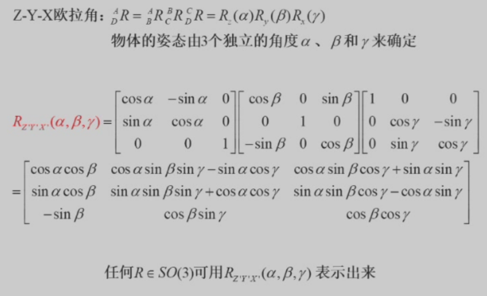

- ABA型欧拉角

  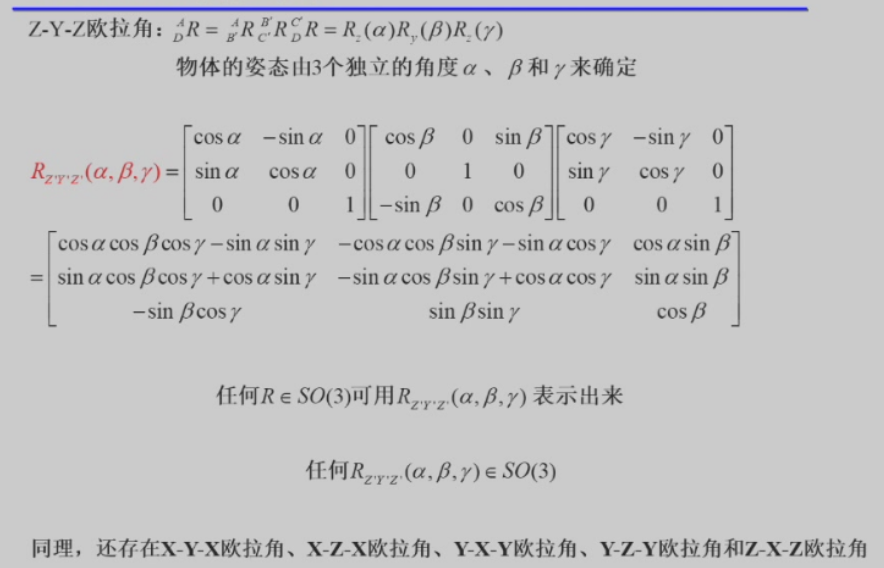

但是这种表达方式是存在缺点的：

虽然方便理解和操作，但是给定一个旋转其欧拉角并不唯一，且存在万向锁现象，绕第一个轴旋转$\pm \frac{\pi}{2}$就会使得自由度减一

范围证明如下：

$$
R_z(\pm \pi + \alpha) R_y(\pm \pi - \beta) R_x(\pm \pi + \gamma) = R_z(\alpha) R_y(\beta) R_x(\gamma)
$$
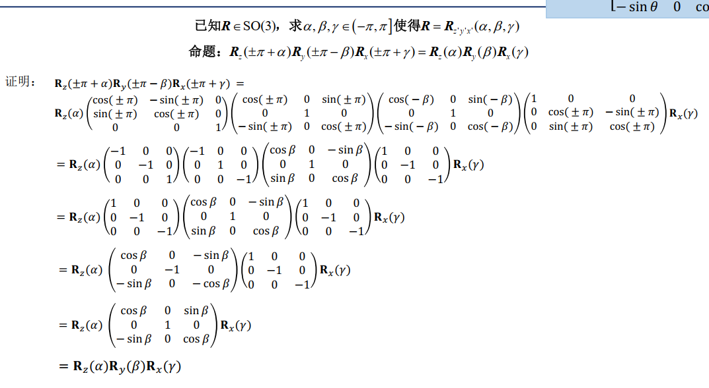

下面是另一种证明

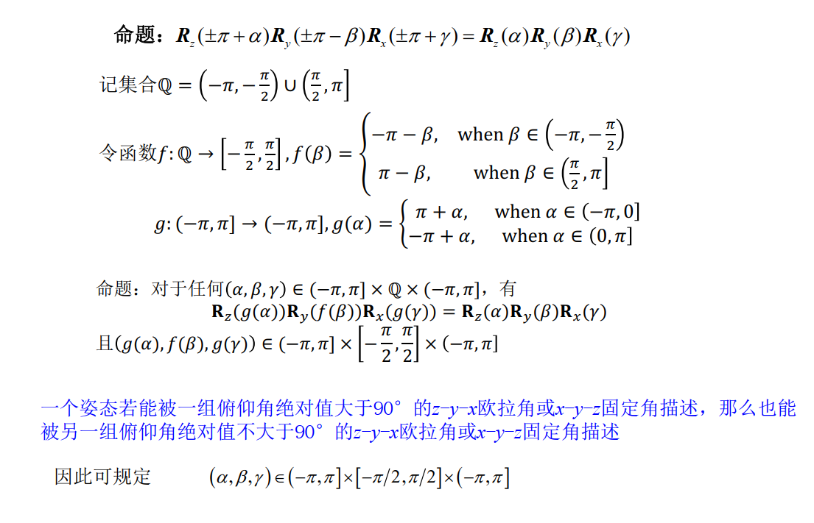

对于任何 $(\alpha, \beta, \gamma) \in (-\pi, \pi] \times (-\pi, \pi] \times (-\pi, \pi]$，有
$$
R_z(g(\alpha)) R_y(f(\beta)) R_x(g(\gamma)) = R_z(\alpha) R_y(\beta) R_x(\gamma)
$$
且 $(g(\alpha), f(\beta), g(\gamma)) \in (-\pi, \pi] \times [-\pi/2, \pi/2] \times (-\pi, \pi]$。

这个命题表明：一个姿态若能被一组俯仰角绝对值大于 $\pi/2$ 的 $z-y-x$ 欧拉角或 $x-y-z$ 固定角描述，那么也能被另一组俯仰角绝对值不大于 $\pi/2$ 的 $z-y-x$ 欧拉角或 $x-y-z$ 固定角描述。这样，可进一步规定 $(\alpha, \beta, \gamma) \in (-\pi, \pi] \times [-\pi/2, \pi/2] \times (-\pi, \pi]$。

因此在计算的时候我们常用双变量反正切函数$\theta =\arctan2(y,x) \in[-\pi,\pi]$

> 矩阵左乘行变换，右乘列变换

根据矩阵求解三个欧拉角：

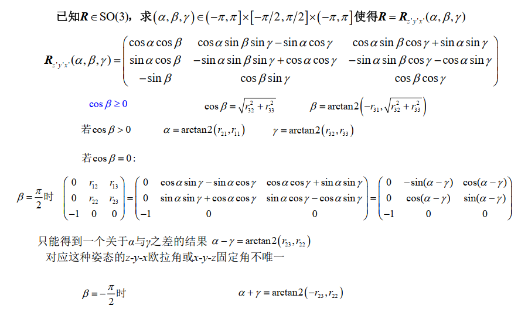

- 当$\beta=\pm\pi/2$时，没有唯一解

### 等效轴角的表示

[绕任意轴的旋转矩阵 - 知乎 (zhihu.com)](https://zhuanlan.zhihu.com/p/462935097)

[等效轴角坐标系表示法 | M.Z's blog (mazhengg.github.io)](https://mazhengg.github.io/2018/03/30/等效轴角坐标系表示法/)

刚体定点转动的前后姿态可以通过一次定轴转动实现

对于等效轴角表示，称$(k_x\quad k_y\quad k_z)^T$为等效轴（单位向量），$\theta$表示旋转角

旋转矩阵 $  R_r(\theta)  $ 定义为：

$$
R_r(\theta) = \begin{bmatrix}
k_x^2 v\theta + c\theta & k_x k_y v\theta - k_z s\theta & k_x k_z v\theta + k_y s\theta \\
k_x k_y v\theta + k_z s\theta & k_y^2 v\theta + c\theta & k_y k_z v\theta - k_x s\theta \\
k_x k_z v\theta - k_y s\theta & k_y k_z v\theta + k_x s\theta & k_z^2 v\theta + c\theta
\end{bmatrix}
$$

其中，

$$
c\theta = \cos\theta,\quad s\theta = \sin\theta,\quad v\theta = 1 - \cos\theta
$$

角度 $ \theta $ 由右手定则确定（大拇指指向单位向量 $ \hat{r} $ 的正方向）。

- 定点转动：在三维空间里，运动刚体的内部或外延部分至少有一点固定不动，称此运动为定点转动

  将联体坐标系原点设在此固定点，刚体姿态变、位置不变

- 罗德里格斯公式
  $$
  ^AX_{B(1)}={^AX_{B(0)}}\cos{\theta}+(^AX_{B(0)}\cdot {^AK}){^AK}(1-\cos{\theta})+({^AK}\times {^AX_{B(0)}})\sin{\theta}
  $$

  $$
  % 在导言区需要添加 \usepackage{amsmath} 以支持矩阵环境
  ^{A}_{B(0)}\mathbf{R} = 
  \begin{pmatrix}
  k_x^2 \nu \theta + \cos\theta & k_x k_y \nu \theta - k_z \sin\theta & k_x k_z \nu \theta + k_y \sin\theta \\
  k_x k_y \nu \theta + k_z \sin\theta & k_y^2 \nu \theta + \cos\theta & k_y k_z \nu \theta - k_x \sin\theta \\
  k_x k_z \nu \theta - k_y \sin\theta & k_y k_z \nu \theta + k_x \sin\theta & k_z^2 \nu \theta + \cos\theta
  \end{pmatrix}
  = \mathbf{R}_K(\theta)
  $$

  其中$\nu \theta = 1-\cos{\theta}$。已知$R_K(\theta)$反解如下：
  $$
  \mathbf{R}_K(\theta) = \mathbf{R}_{-K}(-\theta)
  $$
  因此规定$$\theta \in [0, \pi]$$
  $$
  \theta = \arccos\left(\frac{\mathrm{tr}(\mathbf{R}) - 1}{2}\right) = \arccos\left(\frac{r_{11} + r_{22} + r_{33} - 1}{2}\right)
  $$
  旋转轴求解

  - 当 $θ ∈ (0, π)$ 时，旋转轴单位向量：
    $$
    \begin{bmatrix}
    k_x \\ 
    k_y \\
    k_z
    \end{bmatrix}
    = \frac{1}{2 \sin\theta}
    \begin{bmatrix}
    r_{32} - r_{23} \\
    r_{13} - r_{31} \\
    r_{21} - r_{12}
    \end{bmatrix}
    \quad (\text{唯一解})
    $$

  - 当 $θ = π$ 时
    $$
    \begin{bmatrix}
    k_x \\ 
    k_y \\
    k_z
    \end{bmatrix}
    = \pm
    \begin{bmatrix}
    \sqrt{(r_{11}+1)/2} \\
    r_{12}/\sqrt{2(r_{11}+1)} \\
    r_{13}/\sqrt{2(r_{11}+1)}
    \end{bmatrix}
    \quad (\text{两组解})
    $$

  - 当 $θ = 0$ 时，任意单位向量均可，无穷组解

下面给出一个具体的计算栗子：
在参考系 \{A\} 中，初始向量 $ \boldsymbol{P}(0) = \begin{pmatrix} 3 & 2 & 1 \end{pmatrix}^T $ 绕单位向量 $ \boldsymbol{K} = \begin{pmatrix} 0.8 & 0 & 0.6 \end{pmatrix}^T $ 旋转 $ \pi/4 $ 后得到 $ \boldsymbol{P}(1) $，求 $ \boldsymbol{P}(1) $。
引入辅助坐标系 \{B\}，其原点与 \{A\} 重合且初始姿态相同，绕 $ \boldsymbol{K} $ 旋转 $ \pi/4 $ 后的姿态矩阵为：
$$
{}_B^A \boldsymbol{R} = \boldsymbol{R}_K(\theta) = \begin{pmatrix} 
0.8946 & -0.4243 & 0.1406 \\ 
0.4243 & 0.7071 & -0.5657 \\ 
0.1406 & 0.5657 & 0.8125 
\end{pmatrix}
$$

由于 \{B\} 与旋转向量固连且初始重合，有 $ {}^B \boldsymbol{P} = \begin{pmatrix} 3 & 2 & 1 \end{pmatrix}^T $。根据坐标系变换关系：

$$
{}^A \boldsymbol{P} = {}_B^A \boldsymbol{R} {}^B \boldsymbol{P} = \begin{pmatrix} 
0.8946 & -0.4243 & 0.1406 \\ 
0.4243 & 0.7071 & -0.5657 \\ 
0.1406 & 0.5657 & 0.8125 
\end{pmatrix} \begin{pmatrix} 
3 \\ 
2 \\ 
1 
\end{pmatrix} = \begin{pmatrix} 
1.9757 \\ 
2.1213 \\ 
2.3657 
\end{pmatrix}
$$

最终结果：

$$
\boldsymbol{P}(1) = \begin{pmatrix} 1.9757 & 2.1213 & 2.3657 \end{pmatrix}^T
$$

### 四元数

【四元数的可视化】https://www.bilibili.com/video/BV1SW411y7W1?vd_source=93bb338120537438ee9180881deab9c1

- 四元数的基本运算与性质：

  四元数可视为复数的一种推广。复数有一个单位为 $ i $ 的虚部，规定虚部单位满足 $ i^2 = -1 $。四元数有 3 个单位分别为 $ i $、$ j $ 和 $ k $ 的虚部，规定虚部单位满足：

$$
  i^2 = j^2 = k^2 = ijk = -1 \tag{2-115}
$$

  由此规定，可推导：

$$
  ij = k, \quad ji = -k, \quad jk = i, \quad kj = -i, \quad ki = j, \quad ik = -j \tag{2-116}
$$

  四元数写为 $ \eta + i\epsilon_1 + j\epsilon_2 + k\epsilon_3 $，其中 $ \eta $、$ \epsilon_1 $、$ \epsilon_2 $ 和 $ \epsilon_3 $ 均为实数。记 $ \mathbb{H} $ 为全体四元数构成的集合。

  乘法公式：

  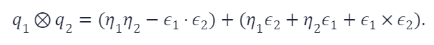

- 单位四元数

  由单位四元数转旋转矩阵：
  $$
  \boldsymbol{R}_\epsilon(\eta) = \begin{pmatrix}
  2(\eta^2 + \epsilon_1^2) - 1 & 2(\epsilon_1 \epsilon_2 - \eta \epsilon_3) & 2(\epsilon_1 \epsilon_3 + \eta \epsilon_2) \\
  2(\epsilon_1 \epsilon_2 + \eta \epsilon_3) & 2(\eta^2 + \epsilon_2^2) - 1 & 2(\epsilon_2 \epsilon_3 - \eta \epsilon_1) \\
  2(\epsilon_1 \epsilon_3 - \eta \epsilon_2) & 2(\epsilon_2 \epsilon_3 + \eta \epsilon_1) & 2(\eta^2 + \epsilon_3^2) - 1
  \end{pmatrix}
  $$
  对任何单位四元数，$R_{\epsilon}(\eta)$都是旋转矩阵

  对任何旋转矩阵R，都存在两个互为相反数的单位四元数$\pm(\eta+i\epsilon_1+j\epsilon_2 +k\epsilon_3)$使得$R = R_{\epsilon}(\eta)$

  且单位四元数对任何姿态不会出现无穷多组解的问题
  
  旋转矩阵转单位四元数
  
  - 若$r_{11}+r_{22}+r_{33}>-1$
    $$
    \begin{bmatrix} \eta \\ \varepsilon \end{bmatrix} =\pm \frac{1}{2} \begin{bmatrix} \sqrt{r_{11} + r_{22} + r_{33} + 1} \\ \text{sgn}(r_{32} - r_{23}) \sqrt{r_{11} - r_{22} - r_{33} + 1} \\ \text{sgn}(r_{13} - r_{31}) \sqrt{r_{22} - r_{33} - r_{11} + 1} \\ \text{sgn}(r_{21} - r_{12}) \sqrt{r_{33} - r_{11} - r_{22} + 1} \end{bmatrix}
    $$
  
  - 若$r_{11}+r_{22}+r_{33}=-1$
  
    因为$r_{ii}$不会同时$=-1$，则这里假设$r_{11}\ne -1$
    $$
    \begin{bmatrix} \eta \\ \varepsilon \end{bmatrix} = \pm\frac{1}{2} \begin{bmatrix} 0 \\ \sqrt{r_{11} - r_{22} - r_{33} + 1} \\ \text{sgn}(r_{12}) \sqrt{r_{22} - r_{33} - r_{11} + 1} \\ \text{sgn}(r_{13}) \sqrt{r_{33} - r_{11} - r_{22} + 1} \end{bmatrix}
    $$
    

旋转变换。对单位四元数 $\eta + i\epsilon_1 + j\epsilon_2 + k\epsilon_3$，设三维向量 $\epsilon = (\epsilon_1, \epsilon_2, \epsilon_3)^T$，并设该单位四元数所描述的是绕单位向量 $K$ 旋转 $\theta$ 角的旋转变换。由关于 $\boldsymbol{R}_\epsilon(\eta)$ 与 $\boldsymbol{R}_K(\theta)$ 间联系的讨论式 (2-133) ~ 式 (2-142)，该单位四元数以如下方式描述旋转变换：

$$
\eta = \cos \frac{\theta}{2}\\ \epsilon = K \sin \frac{\theta}{2}
$$

### 欧拉参数

- [科学网—刚体姿态的数学表达(二)：欧拉参数与四元数 - 刘延柱的博文 (sciencenet.cn)](https://blog.sciencenet.cn/blog-3452605-1304318.html)

用 4 个欧拉参数表示刚体姿态仍只有 3 个独立变量，因为欧拉参数之间存在关系：
$$
\lambda^2_0+\lambda^2_1+\lambda^2_2+\lambda^2_3=1
$$

基于等效轴角表示的单位向量 $(k_x, k_y, k_z)^\top$ 和旋转角 $\theta \in \mathbb{R}$，定义欧拉参数：
$$
\left( \eta, \ \epsilon_1, \ \epsilon_2, \ \epsilon_3 \right)^\top
$$
其中：
$$
\eta = \cos\frac{\theta}{2}, \quad
\epsilon = \begin{pmatrix} \epsilon_1 \\ \epsilon_2 \\ \epsilon_3 \end{pmatrix} = \begin{pmatrix} k_x \\ k_y \\ k_z \end{pmatrix} \sin\frac{\theta}{2}
$$

约束条件：一个标量和一个长度不超过1的三维向量满足约束：
$$
\eta^2 + \epsilon_1^2 + \epsilon_2^2 + \epsilon_3^2 = 1
$$

集合与对应关系：记 $U$ 为由全体欧拉参数构成的集合，$U$ 是 $\mathbb{R}^4$ 中的单位超球面。单位四元数与欧拉参数一一对应。
$$
\epsilon_1 = k_x \sin\frac{\theta}{2},\quad \epsilon_2 = k_y \sin\frac{\theta}{2},\quad \epsilon_3 = k_z \sin\frac{\theta}{2}
$$
将欧拉参数代入旋转矩阵公式：
$$
\mathbf{R}_{K}(\theta) = \begin{pmatrix}
2(\eta^2 + \epsilon_1^2) - 1 & 2(\epsilon_1 \epsilon_2 - \eta \epsilon_3) & 2(\epsilon_1 \epsilon_3 + \eta \epsilon_2) \\
2(\epsilon_1 \epsilon_2 + \eta \epsilon_3) & 2(\eta^2 + \epsilon_2^2) - 1 & 2(\epsilon_2 \epsilon_3 - \eta \epsilon_1) \\
2(\epsilon_1 \epsilon_3 - \eta \epsilon_2) & 2(\epsilon_2 \epsilon_3 + \eta \epsilon_1) & 2(\eta^2 + \epsilon_3^2) - 1
\end{pmatrix}=R_{\epsilon}(\eta)
任意旋转矩阵 $\mathbf{R} \in \mathrm{SO}(3)$ 都存在四元数表示：
$$

$$
\mathbf{R}_\epsilon(\eta) = \mathbf{R},\quad \text{其中 } \eta + i\epsilon_1 + j\epsilon_2 + k\epsilon_3 \in S^3
$$

**Grassmann积**格拉斯曼积——即四元数的乘积（不是内积）

在$\mathbb{R}^4$中定义Grassmann积
$$
\left(\begin{array}{c}\eta \\ \varepsilon \end{array}\right) \oplus\left(\begin{array}{c}\xi \\ \delta\end{array}\right) =

\left(\begin{array}{cc}
\eta \xi-\epsilon^T \delta \\
\eta \delta+\xi \epsilon+\epsilon \times \delta
\end{array}\right)=

\left(\begin{array}{cccc}
\eta & -\varepsilon_1 & -\varepsilon_2 & -\varepsilon_3 \\ 
\varepsilon_1 & \eta & -\varepsilon_3 & \varepsilon_2 \\ 
\varepsilon_2 & \varepsilon_3 & \eta & -\varepsilon_1 \\ 
\varepsilon_3 & -\varepsilon_2 & \varepsilon_1 & \eta
\end{array}\right)
\left(\begin{array}{c}
\xi \\ 
\delta_1 \\ 
\delta_2 \\ 
\delta_3
\end{array}\right)
= A\left(\begin{array}{c}
\xi \\ 
\delta_1 \\ 
\delta_2 \\ 
\delta_3
\end{array}\right)
$$

- $H$中的乘法对应$\mathbb{R}^4$中的Grassmann积
- 若$\left(\begin{array}{c}\eta \\ \epsilon\end{array}\right) \in U$，则满足正交条件$A^T A=I$
- 如果还有$\left(\begin{array}{c}\xi \\ \delta\end{array}\right) \in U$，则积运算保持闭合性：
  $$
  \left(\begin{array}{c}\xi & \delta^T\end{array}\right) A^T A\left(\begin{array}{c}\xi \\ \delta\end{array}\right)=1
  $$

即$\left(\begin{array}{cc}
\eta \xi-\epsilon^T \delta \\
\eta \delta+\xi \epsilon+\epsilon \times \delta
\end{array}\right)  \in U$，U中任意两个向量的Grassmann积仍是U中的向量

**参数分解**：
令$\zeta = \eta \xi - \epsilon^T \delta = \eta \xi - \sum_{i=1}^3 \epsilon_i \delta_i$

定义旋转参数：
$$
\rho=\left(\begin{array}{c}
\rho_1 \\ 
\rho_2 \\ 
\rho_3
\end{array}\right)=\eta \delta+\xi \epsilon+\epsilon \times \delta=\left(\begin{array}{l}
\eta \delta_1 + \varepsilon_1 \xi + \varepsilon_2 \delta_3 - \varepsilon_3 \delta_2 \\
\eta \delta_2 - \varepsilon_1 \delta_3 + \varepsilon_2 \xi + \varepsilon_3 \delta_1 \\
\eta \delta_3 + \varepsilon_1 \delta_2 - \varepsilon_2 \delta_1 + \varepsilon_3 \xi
\end{array}\right)
$$

**几何意义**：

1. $U$中的Grassmann积对应$SO(3)$旋转群运算
2. 欧拉参数通过Grassmann积直接描述：
   - 三维刚体姿态
   - 坐标系旋转变换
   - 保持$\det(A)=1$的特殊正交性

## 理解

**右乘联体左乘基**——适用于齐次变换矩阵

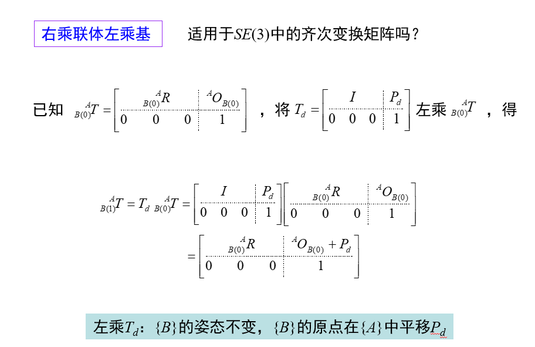

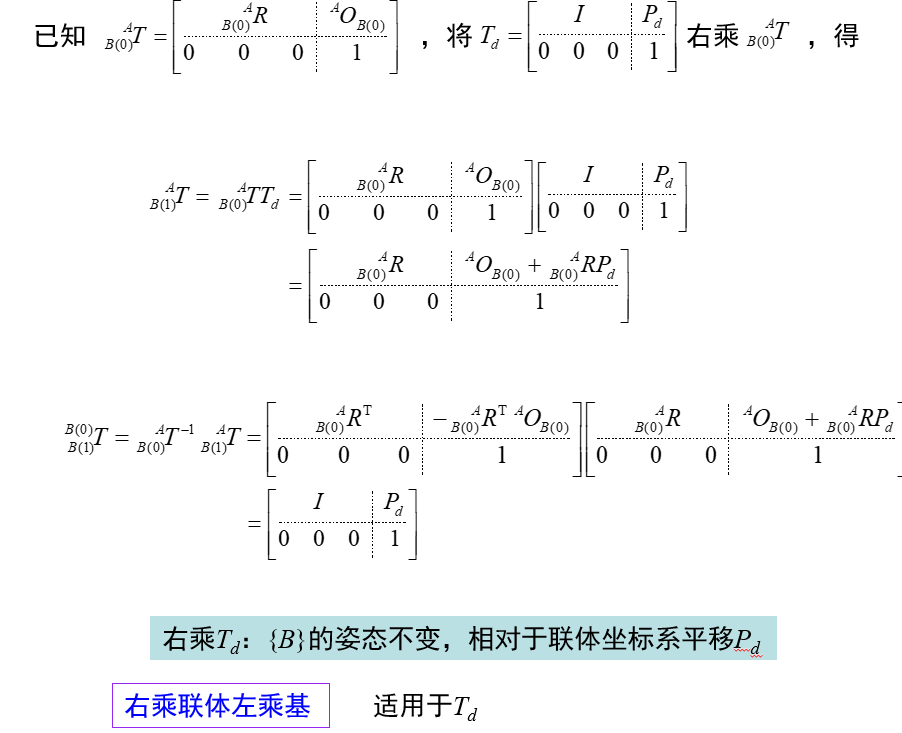

齐次变换矩阵需要注意：

- 右乘是先平移、后旋转；
- 左乘是先旋转、后平移；

- 相对于基础坐标系的旋转（左乘旋转），可能会产生平移

> A的基，B对A的旋转矩阵，B对A的齐次变换矩阵，
>
> 旋转矩阵or姿态矩阵？运动观点表示旋转，静止观点表示姿态
>
> 齐次变换矩阵or位姿矩阵？运动观点表示旋转和平移，静止观点表示姿态和位置

**齐次变换矩阵也具有类似的性质，不过左乘齐次变换矩阵相当于先旋转后平移，而右乘齐次变换矩阵相当于先平移后旋转。**

# 机械臂运动学

- 连杆
- 低副

[操作臂的运动学 - 知乎 (zhihu.com)](https://zhuanlan.zhihu.com/p/654935667)

下面是一些**基本运动学参量**的定义：

- 轴i表示关节i的轴线：转动型关节轴为旋转轴中心线，平动型关节为平移轴中心线

- 定义两个关节轴相对位置：

  - 连杆的长度$a$：取公垂线段$r_{O_{i-1}P_i}$为几何连杆，其长度为$a_{i-1}$

    > 当连杆的长度$a_{i-1}=0$时，我们并不将零长度的$r_{O_{i-1}P_i}$视为传统的零向量，而是在与轴$i-1$和轴$i$同时垂直的方向中选一个作为$r_{O_{i-1}P_i}$的正方向

  - 连杆扭距角 $\alpha$：过轴$i-1$作一个平面垂直于$r_{O_{i-1}P_i}$，然后将轴$i$投影到该平面上，按照轴$i-1$绕$r_{O_{i-1}P_i}$旋转到轴$i$投影的思路以右手螺旋法则确定轴$i-1$与轴$i$夹角的值，此夹角即为连杆转角$\alpha_{i-1}$

- 用来描述相邻连杆之间连接关系的两个参数：
  - 连杆偏距$d_i$：从$P_i$到$O_i$的轴向距离
  - 关节角$\theta_i$：过$r_{O_{i-1}P_i}$作一个平面垂直于轴$i$，然后将$r_{O_{i}P_{i+1}}$，投影到该平面上，在平面内按照$r_{O_{i-1}P_i}$绕轴$i$旋转到$r_{O_{i}P_{i+1}}$，投影的思路以右手螺旋法则确定$r_{O_{i-1}P_{i}}$与$r_{O_{i}P_{i+1}}$夹角的值，此旋转角度即为关节角$\theta_i$

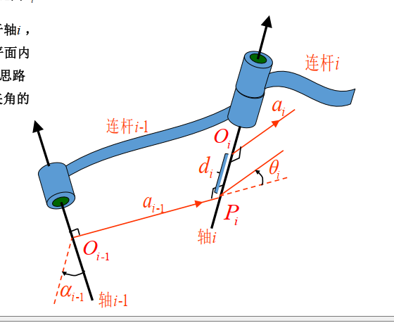

> 对于转动关节，$\theta_i$为关节变量（取d为0）；对于移动关节，$d_i$为关节变量（取$\theta$为0）；其余三个连杆参数是固定的
>
> **Prismatic Joint**平移关节

- 首关节的运动学参量

  - 设定一个虚拟的轴0和轴1重合，即取$a_0=0,\alpha_0=0$

    > 当然也可以不设定重合，实际就是世界坐标系到轴1坐标系的转换

  - 若关节1是转动关节，取$d_1=0$，而$r_{O_{0}P_1}$的方向则任取与轴1垂直的某个方向。**取$r_{O_{0}P_1}$的方向就是决定$r_{O_{1}P_2}$的零位方向**

  - 若关节1是滑动关节，取$θ_1=0$，而$r_{O_{0}P_1}$的位置则任取轴1上的某个点，**取$r_{O_{0}P_1}$的位置就是决定$r_{O_{1}P_2}$的零位位置**

  - $r_{O_{0}P_1}$是一个固定不动的几何连杆

- 末关节的运动学参量

  - 已知轴 $N-1$ 和轴 $N$ 的存在，$a_{N-1}$（连杆长度）和 $\alpha_{N-1}$（连杆扭角）为已知参数。需选取连杆 $N$ 上任意长度的向量 $r_{O_N P_{N+1}}$。

  - **转动关节**：
    - 偏距 $d_N = 0$。
    - 方向向量 $r_{O_N P_{N+1}}$ 可任取与连杆 $N$ 固连的方向。
    - 关节角 $\theta_N$ 由 $r_{O_N P_{N+1}}$ 与 $r_{O_{N-1} P_N}$ 的夹角定义。
  - **滑动关节**：
    - 关节角 $\theta_N = 0$。
    - 点 $O_N$ 在轴 $N$ 上任取与连杆 $N$ 固连的位置。
    - 偏距 $d_N$ 由点 $O_N$ 与 $P_N$ 的相对位移确定。

Denavit-Hartenberg参数，D-H法——两次平移，两次旋转。分为SDH和MDH

1. DH参数可以把关节角映射为末端执行器的位置和姿态
2. 雅克比矩阵可以把关节转速映射为笛卡尔空间的速度和角速度

MDH运动学参量表：

- **固定参数**：
  
  - $a_{i-1}$（连杆长度）
  - $\alpha_{i-1}$（连杆扭角）
  - *不随关节运动变化*
  
- **关节类型相关参数**：
  - **转动关节**：
    - 固定参数：$d_i$（偏距）
    - 关节变量：$\theta_i$（关节角）
    - 参数组成：
      $$
      3\ \text{连杆参数}:\ a_{i-1},\ \alpha_{i-1},\ d_i \\
      1\ \text{关节变量}:\ \theta_i
      $$

  - **滑动关节**：
    
    - 固定参数：$\theta_i$（关节角）
    - 关节变量：$d_i$（偏距）
    - 参数组成：
      $$
      3\ \text{连杆参数}:\ a_{i-1},\ \alpha_{i-1},\ \theta_i \\
      1\ \text{关节变量}:\ d_i
      $$

- **总参量计算**：
  - 关节数量：$N$
  - 总运动学参量：$4N$ 个
    - 固定参数占比：$3N$（连杆参数）
    - 可变参数占比：$N$（关节变量）

## 建立坐标系

### MDH

如何建模：

1. 先画出所有$z_i$轴
2. 再确定$x_i$轴（下面是MDH的细节）
   - 当$z_i$与$z_{i+1}$平行时，从$x_i$的原点指向$x_{i+1}$的原点方向。（即此轴指向下一轴的原点方向）
   - 当$z_i$与$z_{i+1}$不平行时，由叉乘右手定则确定$x_i$的方向。（$x_i = z_i × z_{i+1}$）
3. 最后右手定则确定$y_i$轴

建立连杆联体坐标系：（不唯一）

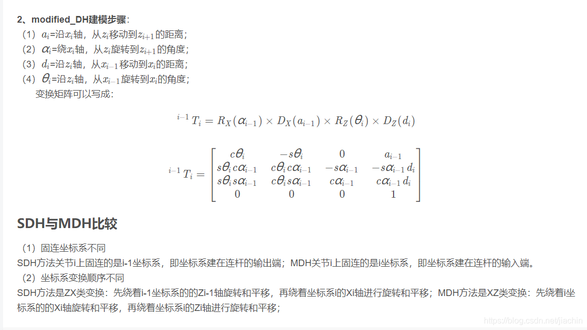

- Z轴根据关节轴确定
- X轴必须垂直于当前Z轴，且垂直于前一个Z轴（规则不适用于第0关节），常为r
- Y轴根据X、Z轴通过右手坐标系确定

SDH方法将连杆的坐标系固定在连杆的后端，MDH方法将连杆的坐标系固定在连杆的前端

这里需要强调连杆i的坐标系是建立在传动关节也就是靠近末端执行器\\一侧的关节处，也就是说坐标系$\(O_{i-1}x_{i-1}y_{i-1}z_{i-1}\)（简称\(\{O_{i-1}\}\)）$是与$\(Link_{i-1}\)\\$固连在一起的，坐标系$\(\{O_{i}\}\)是与\(Link_{i}\)$固连在一起的，在后面的介绍中请各位一定牢记，否则你会觉得整个坐标系变换都很奇怪

### SDH

## 正运动学计算

### MDH

下面是MDH参数设定顺序：$\alpha_{i-1}\to a_{i-1}\to \theta_i\to d_i$

1. **绕 $X_{i-1}$ 轴旋转 $\alpha_{i-1}$**
   - 旋转角度：$\alpha_{i-1}$（连杆扭角，固定参数）
   - 目的：调整 $Z_{i-1}$ 轴与 $Z_i$ 轴的相对方向。

2. **沿 $X_{i-1}$ 轴平移 $a_{i-1}$**
   - 平移距离：$a_{i-1}$（连杆长度，固定参数）
   - 目的：将坐标系原点移动到与关节 $i$ 轴线垂直的位置。

3. **绕 $Z_i$ 轴旋转 $\theta_i$**
   - 旋转角度：$\theta_i$（关节角，转动关节的变量，滑动关节的固定参数）
   - 目的：对齐 $X_{i-1}$ 轴与 $X_i$ 轴的方向（转动关节）或固定方向（滑动关节）。

4. **沿 $Z_i$ 轴平移 $d_i$**
   - 平移距离：$d_i$（偏距，滑动关节的变量，转动关节的固定参数）
   - 目的：沿关节 $i$ 的轴线移动坐标系原点至最终位置。

齐次变换矩阵为：
$$
_{i}^{i-1}T = 
\underbrace{\text{Rot}(X_{i-1}, \alpha_{i-1})}_{第1步} \cdot 
\underbrace{\text{Trans}(X_{i-1}, a_{i-1})}_{第2步} \cdot 
\underbrace{\text{Rot}(Z_i, \theta_i)}_{第3步} \cdot 
\underbrace{\text{Trans}(Z_i, d_i)}_{第4步}
$$
正运动学问题：已知各关节变量的值，以基座坐标系为参考系，求末端工具联体坐标系的位姿
$$
{^{i-1}_i}T = 
\begin{bmatrix}
\cos\theta_i & -\sin\theta_i & 0 & a_{i-1} \\
\sin\theta_i\cos\alpha_{i-1} & \cos\theta_i\cos\alpha_{i-1} & -\sin\alpha_{i-1} & -\sin\alpha_{i-1}d_i \\
\sin\theta_i\sin\alpha_{i-1} & \cos\theta_i\sin\alpha_{i-1} & \cos\alpha_{i-1} & \cos\alpha_{i-1}d_i \\
0 & 0 & 0 & 1
\end{bmatrix}
$$

### SDH

下面是SDH参数设定顺序：$\theta_i \to d_i \to a_i \to \alpha_i$

1. **绕 $Z_i$ 轴旋转 $\theta_i$**
   - 旋转角度：$\theta_i$（关节角，转动关节的变量，滑动关节的固定参数）
   - 目的：对齐 $X_{i-1}$ 轴与 $X_i$ 轴的方向（转动关节）或固定方向（滑动关节）。

2. **沿 $Z_i$ 轴平移 $d_i$**
   - 平移距离：$d_i$（偏距，滑动关节的变量，转动关节的固定参数）
   - 目的：沿关节 $i$ 的轴线移动坐标系原点至与关节 $i+1$ 轴线垂直的位置。

3. **沿 $X_i$ 轴平移 $a_i$**
   - 平移距离：$a_i$（连杆长度，固定参数）
   - 目的：将坐标系原点移动到与关节 $i+1$ 轴线垂直的位置。

4. **绕 $X_i$ 轴旋转 $\alpha_i$**
   - 旋转角度：$\alpha_i$（连杆扭角，固定参数）
   - 目的：调整 $Z_i$ 轴与 $Z_{i+1}$ 轴的相对方向。

齐次变换矩阵为：

$$
_{i+1}^{i}T = \underbrace{\text{Rot}(Z_i, \theta_i)}_{第1步} \cdot \underbrace{\text{Trans}(Z_i, d_i)}_{第2步} \cdot \underbrace{\text{Trans}(X_i, a_i)}_{第3步} \cdot \underbrace{\text{Rot}(X_i, \alpha_i)}_{第4步}
$$
正运动学问题：已知各关节变量的值，以基座坐标系为参考系，求末端工具联体坐标系的位姿

$$
{^{i}_{i+1}}T = \begin{bmatrix}\cos\theta_i & -\sin\theta_i \cos\alpha_i & \sin\theta_i \sin\alpha_i & a_i \cos\theta_i \\\sin\theta_i & \cos\theta_i \cos\alpha_i & -\cos\theta_i \sin\alpha_i & a_i \sin\theta_i \\0 & \sin\alpha_i & \cos\alpha_i & d_i \\0 & 0 & 0 & 1\end{bmatrix}
$$

## 逆运动学

- 封闭解法：代数解法+几何解法
- 数值解法

### 可解性

$$
^0_6 T = {}^0_1 T(\theta_1) \cdot {}^1_2 T(\theta_2) \cdot {}^2_3 T(\theta_3) \cdot {}^3_4 T(\theta_4) \cdot {}^4_5 T(\theta_5) \cdot {}^5_6 T(\theta_6)
$$

上述等式总共给出6个方程，其中含有6个未知量  

这些方程为非线性超越方程，要考虑其解的存在性、多重解性以及求解方法  

工作空间和解的存在性  

- 可达可行空间：机器人末端工具以至少一种姿态到达的区域  
- 灵巧工作空间：机器人末端工具能够以任何姿态到达的区域

多解可能性：取“最短行程”解，计算最短行程需要加权，使得选择侧重于移动小连杆而不是移动大连杆

关于运动学逆解的几个结论

- 所有包含转动关节和移动关节的串联型6自由度操作臂都是可解的，但这种解一般是**数值解**
- 对于6自由度操作臂来说，只有在特殊情况下才有解析解。这种存在解析解（封闭解）的操作臂具有如下特性：存在几个正交关节轴或者有多个$\alpha_i =0 ~or~ \pm90°$
- 具有6个旋转关节的操作臂存在封闭解的充分条件是相邻的三个关节轴线相交于一点

表 6R 机器人逆运动学解的数量与连杆长度参数 $  a_i  $ 的关系

| 连杆参数条件              | 逆运动学解数目上限 |
| ------------------------- | ------------------ |
| $  a_1 = a_3 = a_5 = 0  $ | ≤ 4                |
| $  a_3 = a_5 = 0  $       | ≤ 8                |
| $  a_3 = 0  $             | ≤ 16               |
| 所有 $  a_i \neq 0  $     | ≤ 16               |

### 代数解法

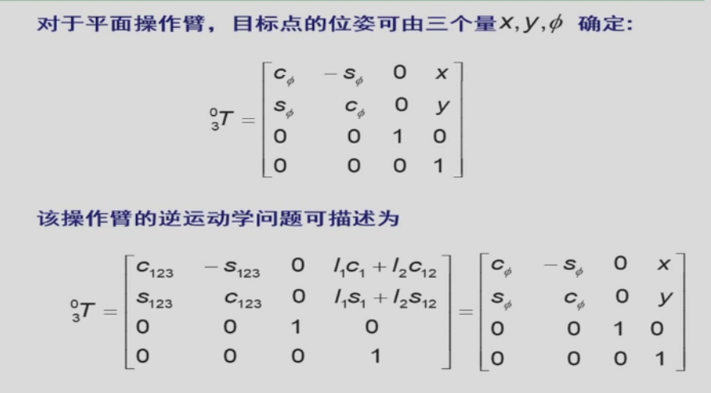

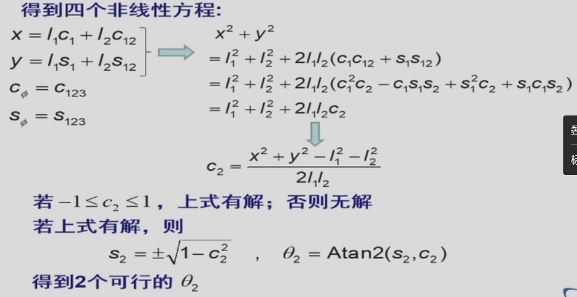
$$
x=k_2c_2-k_2s_1
$$

$$
y=k_1s_1+k_2c_1
$$

求解这种类型的方程，进行变量代换

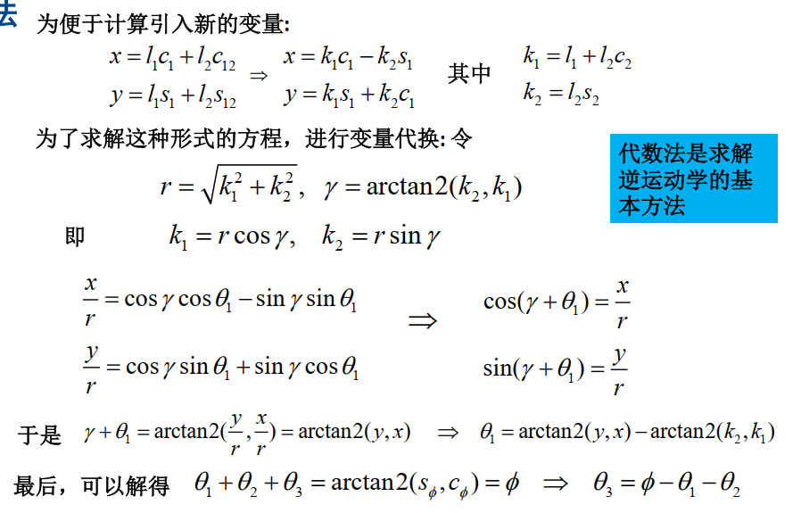

代数解法求解高自由度机械臂，尝试不断左乘${^0_1T}$矩阵，一个关节一个关节求解

### 几何解法

几何解法需要将臂分解为多个平面几何结构，这种分解在连杆转角为$\alpha_i =0 ~or~ \pm90°$最方便

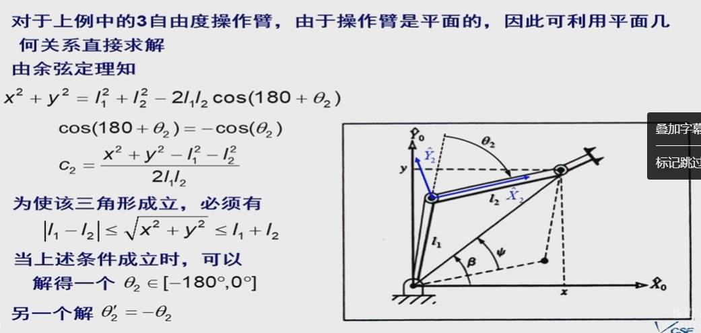

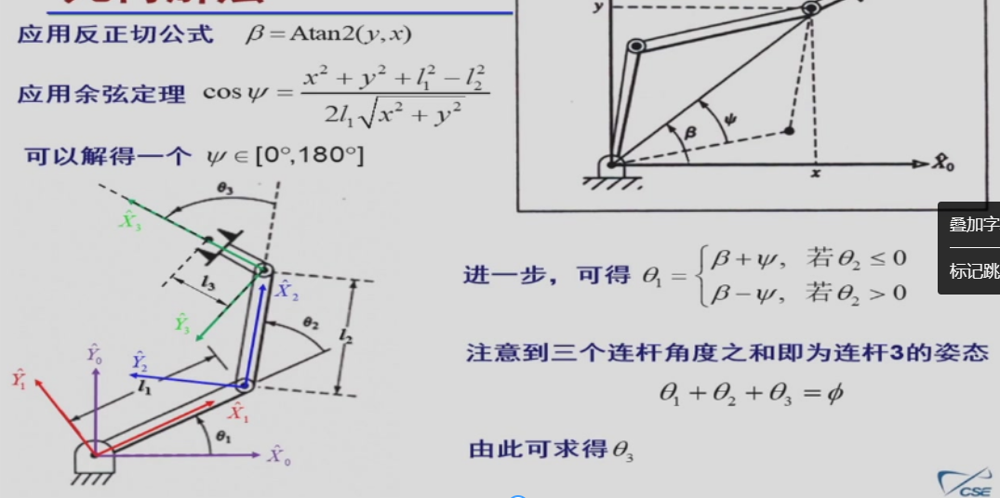

### n不大于4

### PIEPER解法

PIEPER研究了3个相邻的轴相交于一点的6自由度操作臂（包括3个相邻的轴平行的情况）。

PIEPER的方法主要针对**6个关节均为旋转关节的操作臂，且后面3个轴正交**

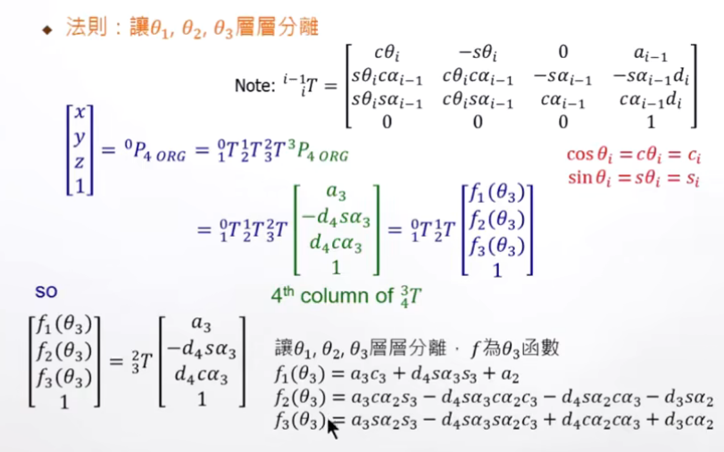

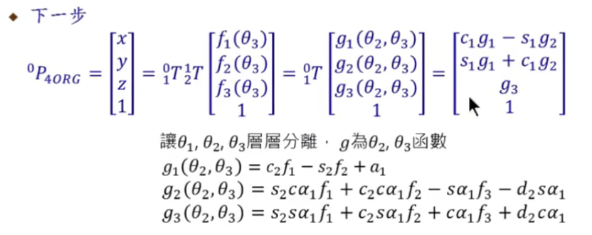

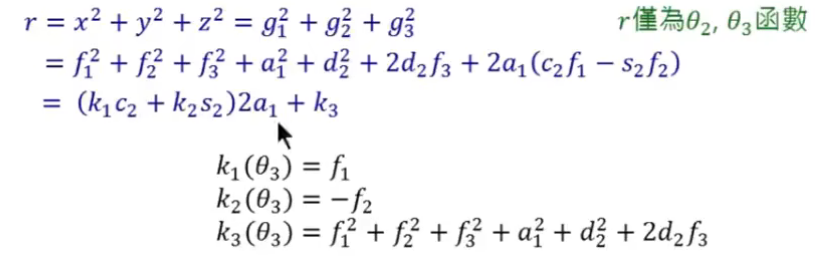

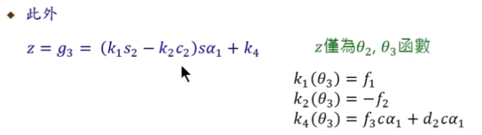

取出来交汇出 $r$ 和 $z$ 的函数

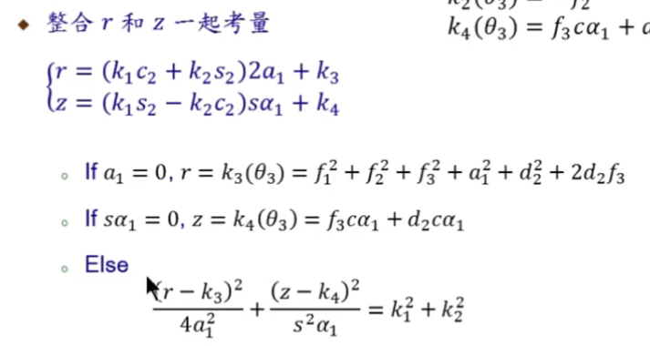

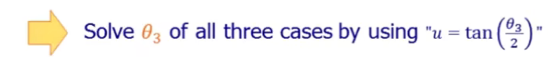

直接解出$\theta_3$

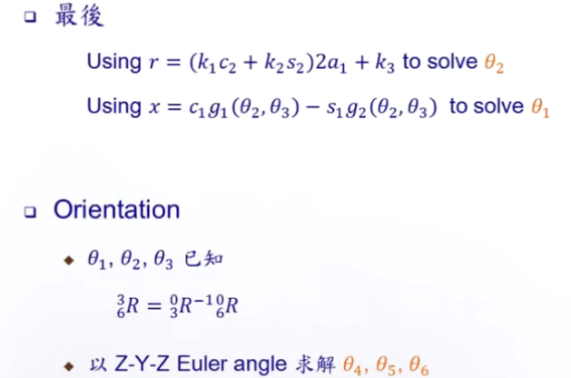

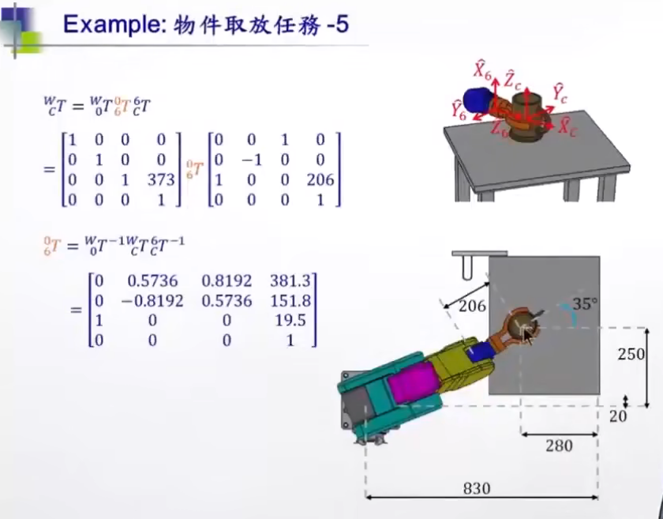

### 数值解

### 逆解相关问题

- 解的存在性和工作空间

- 反解唯一性和最优性

  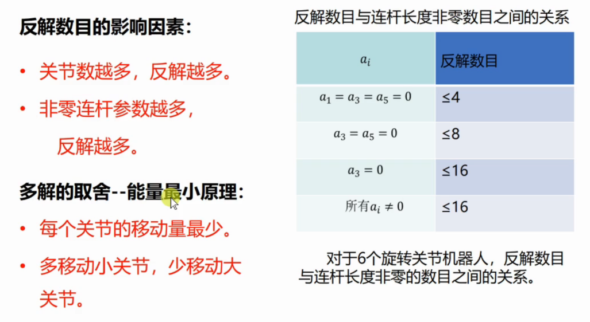

## 轨迹规划

### 路径和轨迹

- 路径： 机器人位形的一个特定序列， 而不考虑机器人位形的时间因素
- 轨迹： 与何时到达路径中的每个部分有关， 强调了时间性和连续性

### 关节空间规划

- 三次多项式

  基本约束方程

  $$
  \phi(0) = \phi_0, 
  \phi(t_f) = \phi_f, \\
  \dot{\phi}(0) = \dot{\phi}_0, 
  \dot{\phi}(t_f) = \dot{\phi}_f
  $$

  三次多项式形式
  $$
  \phi(t) = a_0 + a_1 t + a_2 t^2 + a_3 t^3
  $$

  通过4个边界条件可唯一确定$ a_0,a_1,a_2,a_3 $
  $$
  a_0=\phi_0,a_1=\dot{\phi}_0,a_2=-\frac{3\phi_0-3\phi_f+2\dot{\phi}_0t_f+\dot{\phi}_ft_f}{t_f^2},\\a_3=\frac{2\phi_0-2\phi_f+\dot{\phi}_0t_f+\dot{\phi}_ft_f}{t_f^3}
  $$

- 五次多项式

  基本约束方程
  $$
  \phi(0) = \phi_0, 
  \phi(t_f) = \phi_f, \\
  \dot{\phi}(0) = \dot{\phi}_0, 
  \dot{\phi}(t_f) = \dot{\phi}_f\\
  \ddot{\phi}(0) = \ddot{\phi}_0, 
  \ddot{\phi}(t_f) = \ddot{\phi}_f\\
  $$
  五次多项式形式
  $$
  \phi(t) = a_0 + a_1 t + a_2 t^2 + a_3 t^3+a_4t^4 +a_5t^5
  $$
  通过6个边界条件可唯一确定系数
  $$
  \begin{aligned}
   & a_{0}=\phi_{0} \\
   & a_{1}=\dot{\phi}_{0} \\
   & a_{2}=\frac{\ddot{\phi}_0}{2} \\
   & a_{3}=\frac{20\phi_f-20\phi_0-(8\dot{\phi}_f+12\dot{\phi}_0)t_f-(3\ddot{\phi}_0-\ddot{\phi}_f)t_f^2}{2t_f^3} \\
   & a_{4}=\frac{30\phi_{0}-30\phi_{f}+(14\dot{\phi}_{f}+16\dot{\phi}_{0})t_{f}+(3\ddot{\phi}_{0}-2\ddot{\phi}_{f})t_{f}^{2}}{2t_{f}^{4}} \\
   & a_{5}=\frac{12\phi_{f}-12\phi_{0}-(6\dot{\phi}_{f}+6\dot{\phi}_{0})t_{f}-(\ddot{\phi}_{0}-\ddot{\phi}_{f})t_{f}^{2}}{2t_{f}^{5}}
  \end{aligned}
  $$

- 考虑关节中间点的三次多项式轨迹

  确定中间点（避免奇异位形）的期望关节速度：根据工具坐标系的笛卡尔速度确定中间点的速度。通常可利用在中间点上计算出的操作臂的雅克比逆矩阵，把中间点的笛卡尔期望速度“映射”为期望的关节速度——下面我们介绍几种确定的方法：

  > 我们通常难以在中间点给出笛卡尔期望速度

  1. 将相邻的关节中间点用直线相连，则该直线的斜率就是两个相邻关节中间点的平均速度

     如果某一关节中间点前后两段直线的斜率符号相反，则可将该点的速度取为0

     如果某一关节中间点前后两段直线的斜率符号相同， 则可将该点的速度取为两者的平均值

  2. 不直接指定关节中间点处的速度， 而是以保证相邻两段三次多项式**加速度连续**为原则选取三次多项式系数

- 带抛物线过渡的直线段

  轨迹中间段为直线， 使机器人关节以恒定速度在起点和终点位置之间运动。为使起点和终点处速度连续， 起点和终点附近区域用抛物线进行过渡， **在过渡区域内加速度恒定**

  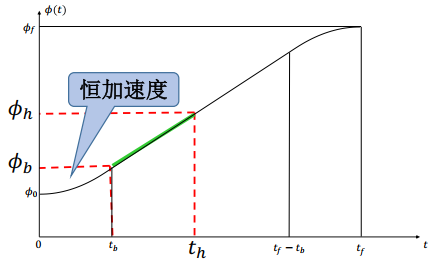

  基础方程
  $$
  \ddot{\phi} t_b^2 - \dot{\phi} t_f t_b + (\phi_f - \phi_0) = 0
  $$

  解的解析式
  $$
  t_b = \frac{t_f}{2} - \sqrt{\frac{\dot{\phi}^2 t_f^2 - 4\ddot{\phi}(\phi_f - \phi_0)}{2\ddot{\phi}}}
  $$

  解存在性条件，要求$\ddot{\phi}$足够大
  $$
  \ddot{\phi} \geq \frac{4(\phi_f - \phi_0)}{t_f^2}
  $$
  下面举一个栗子：

  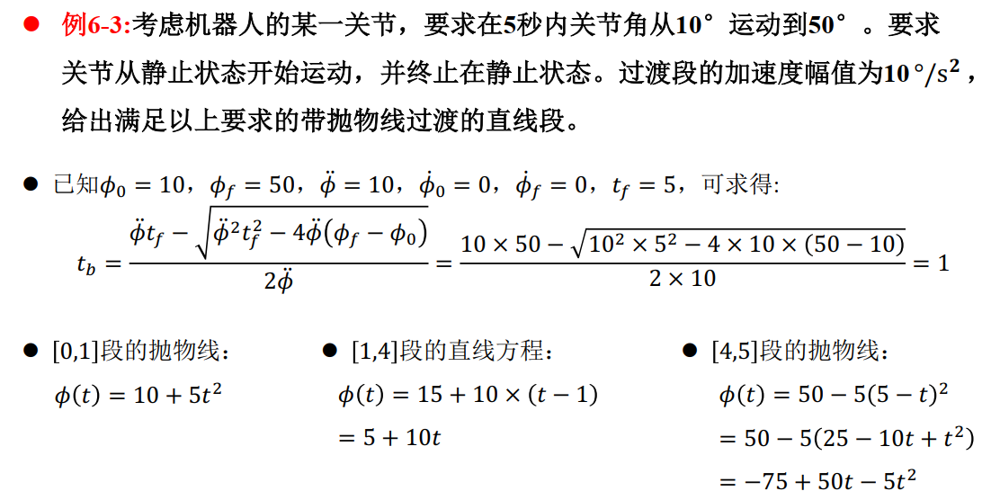

- 考虑中间点的带抛物线过渡的直线段

  注意始、中间点、末的计算分别不相同

  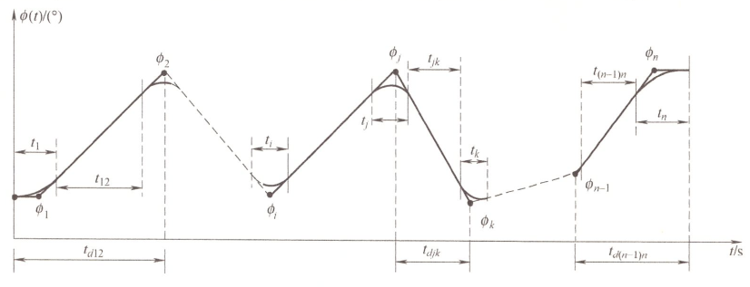

  - 过渡段$j$和直线段$jk$：

    过渡段 $j$ 加速度

    $$
    \ddot{\phi}_j = \text{SGN}(\dot{\phi}_{jk} - \dot{\phi}_{ij}) \cdot |\ddot{\phi}_j|
    $$
    过渡段 $j$ 时间间隔
    $$
    t_j = \frac{\dot{\phi}_{jk} - \dot{\phi}_{ij}}{\ddot{\phi}_j}
    $$
    直线段 $jk$ 速度
    $$
    \dot{\phi}_{jk} = \frac{\phi_k - \phi_j}{t_{djk}}
    $$
    直线段时间 $jk$ 间隔
    $$
    t_{jk} = t_{djk} - \frac{1}{2} t_j - \frac{1}{2} t_k
    $$

  - 过渡段$1$和直线段$12$：

    过渡段 $1$ 加速度
    $$
    \ddot{\phi}_1 = \text{SGN}(\phi_2 - \phi_1) \cdot |\ddot{\phi}_1|
    $$
    过渡段 $1$ 时间间隔
    $$
    \frac{\phi_2-\phi_1}{t_{d12} - \frac{1}{2} t_1} = \ddot{\phi}_1 t_1
    $$

    解得：

    $$
    t_1 = t_{d12} - \sqrt{t_{d12}^2 - \frac{2(\phi_2 - \phi_1)}{\ddot{\phi}_1}}
    $$
    直线段 $12$ 速度
    $$
    \dot{\phi}_{12} = \frac{\phi_2 - \phi_1}{t_{d12}-\frac{1}{2}t_1}
    $$

  - 过渡段$n$和直线段$(n-1)n$：

    过渡段 $n$ 加速度

    $$
    \ddot{\phi}_n = \text{SGN}(\phi_n - \phi_{n-1}) \cdot |\ddot{\phi}_n|
    $$
    过渡段 $n$ 时间间隔
    $$
    t_n = t_{d(n-1)n} - \sqrt{t_{d(n-1)n}^2 - \frac{2(\phi_n - \phi_{n-1})}{\ddot{\phi}_n}}
    $$
    直线段 $(n-1)n$ 速度
    $$
    \dot{\phi}_{(n-1)n} = \frac{\phi_n - \phi_{n-1}}{t_{d(n-1)n} - \frac{1}{2} t_n}
    $$
    直线段 $(n-1)n$ 时间间隔
    $$
    t_{(n-1)n} = t_{d(n-1)n} - t_n - \frac{1}{2} t_{n-1}
    $$

  注意这种方法计算得到的轨迹并不会经过关节中间点，如果一定要严格经过某中间点，需要在其两侧添加两个伪关节中间点，使该点位于两个伪关节中间点的连线上，关节轨迹通过改点的速度就是连接两个伪关节中间点的直线段斜率

  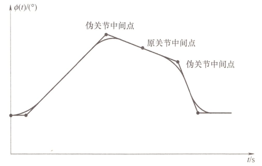

  下面举一个栗子：

  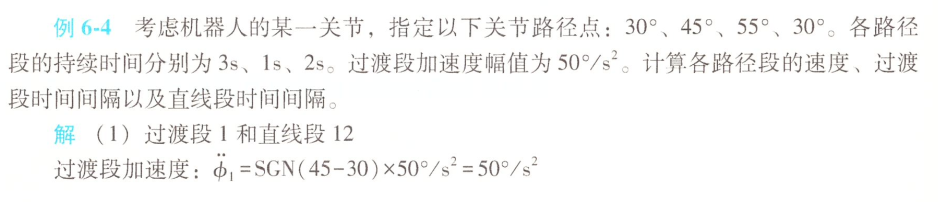

  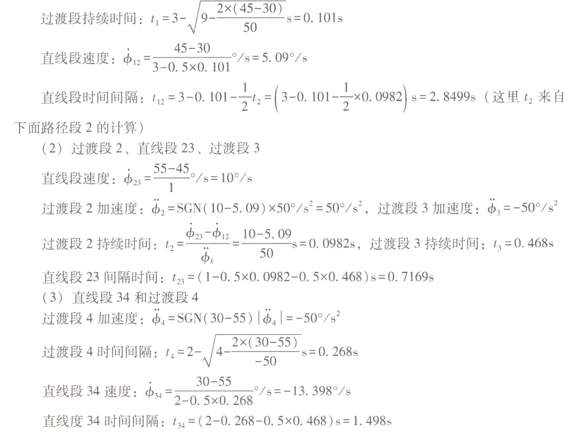

### 笛卡尔空间规划

初始位姿
$$
T(0) = \begin{bmatrix}
R(0) & P(0) \\
0 & 1
\end{bmatrix},\quad 
P(0) = \begin{bmatrix}
x_0 \\
y_0 \\
z_0
\end{bmatrix}
$$

终止位姿
$$
T(1) = \begin{bmatrix}
R(1) & P(1) \\
0 & 1
\end{bmatrix},\quad 
P(1) = \begin{bmatrix}
x_1 \\
y_1 \\
z_1
\end{bmatrix}
$$

求解目标中间位姿，求取归一化时间参数 $  t \in [0,1]  $ 对应的：
$$
T(t) = \begin{bmatrix}
R(t) & P(t) \\
0 & 1
\end{bmatrix}
$$

- 对于末端位置轨迹$P_t$， 可以运用前面的多项式或带抛物线过渡直线段的插值方法来获得

- 姿态的轨迹：不能直接用于对$R(t)$进行插值， 因为插值得到的矩阵一般不满足旋转矩阵的性质

  1. 采用等效轴角表示姿态，然后用前面的插值方法获得轨迹

     > 等效轴角表示并不唯一。插值时,通常应该选择使得$\left\|
     > \begin{bmatrix}
     > k_{0x} \\
     > k_{0y} \\
     > k_{0z}
     > \end{bmatrix}-(\theta+360n)
     > \begin{bmatrix}
     > \widehat{k}_{1x} \\
     > \widehat{k}_{1y} \\
     > \widehat{k}_{1z}
     > \end{bmatrix}\right\|$最小的n

  2. 四元数插值Slerp：Spherical Linear Interpolation

     用两个欧拉参数来表示姿态：
     $$
     r_0=[\eta\quad\varepsilon_1\quad\varepsilon_2\quad\varepsilon_3]^T \\r_1=[\xi\quad\delta_1\quad\delta_2\quad\delta_3]^T
     $$

     | 符号         | 意义               | 约束条件                     |
     | ------------ | ------------------ | ---------------------------- |
     | $  r_0  $    | 初始姿态四元数     | 单位四元数（$ \|r_0\|=1 $）  |
     | $  r_1  $    | 终止姿态四元数     | 单位四元数（$ \|r_1\|=1 $）  |
     | $  \theta  $ | 四元数间最小旋转角 | $  0 \leq \theta \leq \pi  $ |
     | $  t  $      | 归一化时间参数     | $  t \in [0,1]  $            |

     $r_0$和$r_1$确定了$R^4$中的一个平面，该平面上的任何一个元素都可以表示为$r_0$和$r_1$的线性组合，而且两个欧拉参数的内积等于它们夹角的余弦值$r_0\cdot r_1 = \cos \theta$

     则有
     $$
     r_t\cdot r_1=\cos((1-t)\theta)\\
     
     r_0\cdot r_t=\cos(t\theta)
     $$
     同时，$r_t$可以表示为$r_0$和$r_1$的线性组合，即$$r_t=k_0r_0+k_1r_1$$，代入上面公式
     $$
     \cos(t \theta) = r_0 \cdot (k_0 r_0 + k_1 r_1) = k_0 \|r_0\|^2 + k_1 r_0 \cdot r_1 = k_0 + k_1 \cos \theta
     $$

     $$
     \cos((1-t) \theta) = (k_0 r_0 + k_1 r_1) \cdot r_1 = k_0 r_0 \cdot r_1 + k_1 \|r_1\|^2 = k_0 \cos \theta + k_1
     $$
     得：
     $$
     k_0 = \frac{\sin((1-t)\theta)}{\sin \theta}, \quad k_1 = \frac{\sin(t \theta)}{\sin \theta}
     $$

     $$
     r(t) = \frac{\sin[(1-t)\theta]}{\sin\theta} r_0 + \frac{\sin[t\theta]}{\sin\theta} r_1 \\
     \theta = \arccos(r_0\cdot r_1)
     $$

     Slerp的**钝角处理**：注意到单位四元数𝒓和-𝒓表示三维空间中的同一姿态

     所以$\text{Slerp}(r_0, r_1) \equiv \text{Slerp}(r_0, -r_1)$，最终三维空间姿态一样

     若$r_0\cdot r_1 <0$，则改$r_1$为$-r_1$

     一般应该选取最短路径进行球面线性插值。如果两四元数的夹角为钝角， 则可通过将其中一个四元数取负， 再对得到的两个夹角为锐角的四元数进行球面线性插值
     
     problem：若要求终末状态的角速度均为0则因为直接使用Slerp的旋转角速度是定值，此时直接应用Slerp公式进行规划是不行的
     
     - 好处：四元数通过超复数描述旋转，不会因轴重合丢失自由度（没有固定旋转顺序的约束）支持任意方向的平滑旋转，无突变
     
     - 坏处：不如欧拉角直观

> 尽量使用关节空间，笛卡尔空间问题有点多

# 奇异点处理

[一篇文章讲透：机械臂的奇异点及其规避方法](https://zhuanlan.zhihu.com/p/620035856)

**在数学上，机械臂的奇异位姿意味着Jacobian矩阵不再满秩**。可以用Jacobian矩阵来判断机械臂是否处于奇异状态

- 腕关节奇异点
- 肘关节奇异点
- 肩关节奇异点

一种是在路径规划中尽可能避免机械臂经过奇异点，二是利用Jacobian矩阵的**伪逆**，保证奇异点附近**逆运动学算法**的稳定性

[【矩阵原理】伪逆矩阵（pseudo-inverse）](https://blog.csdn.net/Uglyduckling911/article/details/126853700)

# 构型

- SRS[针对关节限位优化的7自由度机械臂逆运动学解法 (tsinghuajournals.com)](http://jst.tsinghuajournals.com/CN/rhhtml/20201206.htm)

# 期末

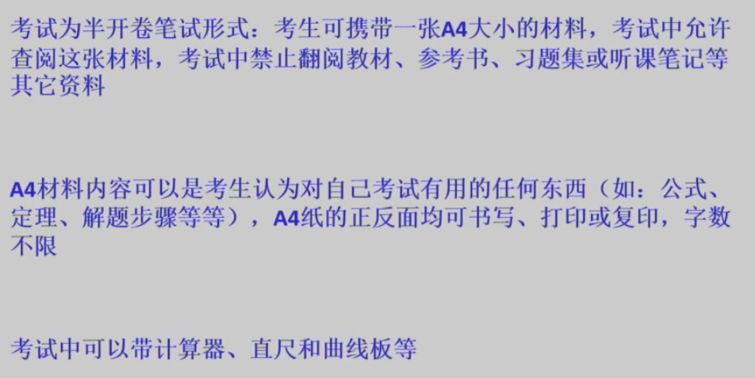

- [机器人建模与控制 2023-2024春 回忆卷 - CC98论坛](https://www.cc98.org/topic/5871439)

- 得看看自控地内容（二阶系统，阻尼比等概念）

- 注意集中控制中各种算法，例如重力补偿PD控制

  前馈补偿得到双积分系统，如何设计参数

- 系统稳定位置稳态误差的计算

