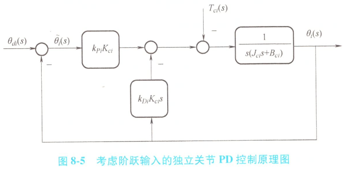
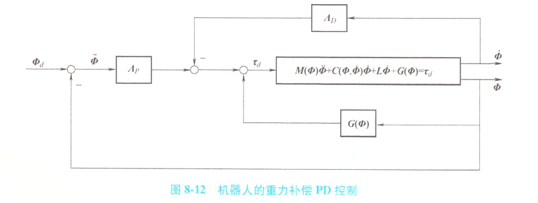
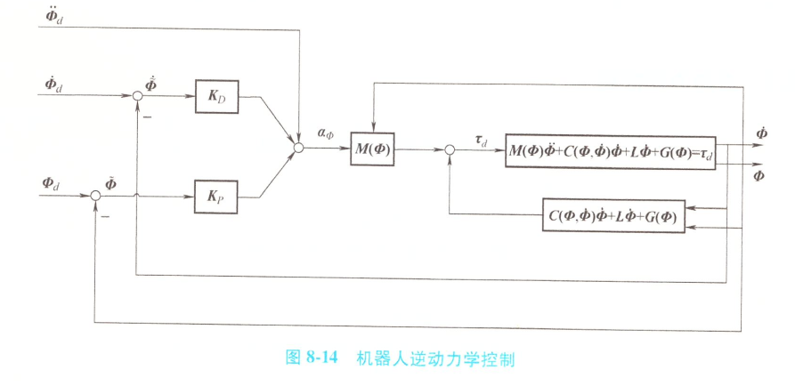
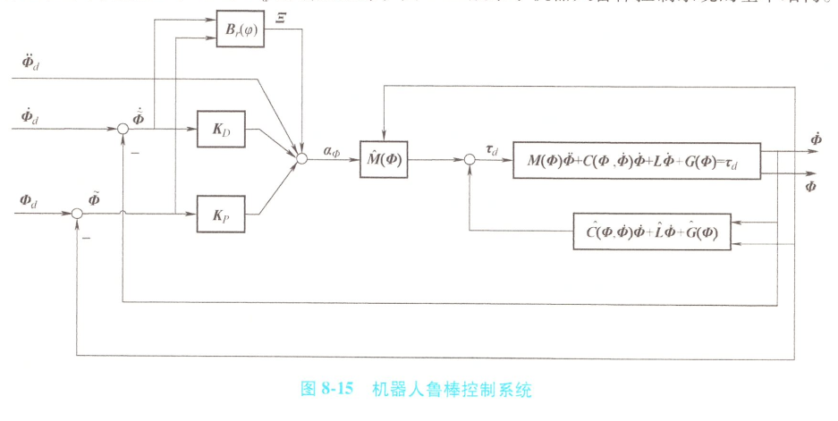

# 机器人运动控制

首先定义一下什么是机器人的运动控制：机器人末端与环境无接触的情况下，如何设计用于实时计算关节执行器输人的闭环控制律（也称闭环控制器），使得各关节较好地跟踪期望轨迹

关于机器人运动的闭环控制律，有两种设计思路：

- 一种是将带执行器的机器人作为多输人多输出的受控对象，设计出利用全部关节期望轨迹及反馈信息计算全部关节执行器输人的控制器，即集中控制；
- 另一种是分别将每个关节作为单输人单输出的受控对象，设计出利用本关节期望轨迹及反馈信息计算本关节执行器输人的单变量控制器，即独立关节控制。

## 独立关节控制

- 电机及电机驱动器

  直流有刷电机结构：

  - 定子（固定磁场） + 转子（电枢绕组）

  在第i关节电机的点数两端施加电枢电压$U_{mi}(t)$，则产生电枢电流 $  I_{mi}(t)  $，其在定子磁场中产生定子对转子的力矩$T_{ei}(t)$。

  **电磁转矩**：
  $$
   T_{ei}(t) = C_{Ti} I_{mi}(t) \quad (C_{Ti}: \text{转矩系数})
  $$
  
  转子转动时，电枢切割定子磁力线，电枢电路中出现**反电动势**：
  $$
   E_{mi}(t) = k_{ei} \omega_{mi}(t) \quad (k_{ei}: \text{电动势系数})
  $$
  
  **电枢电路方程**（忽略电枢电感）：
  $$
   U_{mi}(t) = R_{mi} I_{mi}(t) + E_{mi}(t) \quad (R_{mi}: \text{电枢电阻})
  $$
  
  电机驱动器可视为电压放大模块：
  $$
  U_{mi}(t) = k_{ui} U_{ci}(t)
  $$
  
  $$
   k_{ui}: \text{电压放大倍数}，U_{ci}(t)为第i关节控制电压
  $$
  
  **转速公式**
  $$
  \omega_{mi} = \frac{k_{ui}}{k_{ei}} U_{ci} - \frac{R_{mi}}{k_{ei}} I_{mi}
  $$
  转矩公式和转速公式构成了带驱动器的直流有刷电机模型

- 减速器及关节模型

  一般来说，机器人关节电机的额定转速远高于其关节的设计转速，而机器人关节电机的额定力矩远低于其关节的设计力矩。这就需要减速器在电机与关节之间进行匹配

  摩擦：干摩擦、边界摩擦、流体（粘性）摩擦
  
  - 干摩擦：摩擦副表面直接接触 = 法向力$\times$干摩擦系数
  - 粘性摩擦：流体润滑状态下的摩擦 = 物体相对运动速度$\times$粘性摩擦系数

  

  电机$i$的转子通过传动比为$\eta_i:1$的齿轮减速器与第$i$连杆相连

  电机转角与关节角度的关系：
  
  $$
  \theta_{mi}(t) = \eta_i \theta_i(t)
  $$
  $T_{li}(t)$为输出齿轮对转子反作用力形成的力矩
  $T_{ai}(t)$是输入齿轮对关节作用力形成的力矩（关节力矩）
  $$
  T_{ai}(t) = \eta_i T_{li}(t)
  $$
  由$\mathrm{d}\theta_i/\mathrm{d}t = \omega_i$及$\mathrm{d}\theta_{mi}/\mathrm{d}t = \omega_{mi}$，知减速器的减速公式为
  
  $$
  \omega_{mi}(t) = \eta_i \omega_i(t)
  $$
  电机转子侧的动力学方程为
  
  $$
  J_{mi} \dot{\omega}_{mi} = T_{ei} - T_{li} - b_{mi} \omega_{mi}
  $$

  $J_{mi}$是转子侧刚体绕电机轴的转动惯量；$b_{mi}$是转子轴承的粘滞摩擦系数

  关节侧的动力学方程为
  
  $$
  J_{ai} \dot{\omega}_i = T_{ai} - T_{ci} - b_{ai} \omega_i
  $$

  $J_{ai}$是关节侧关于关节轴的等效转动惯量；$b_{ai}$是关节轴承的粘滞摩擦系数，$T_{ci}$是干扰力矩

  > 注意这里的粘性摩擦是力矩$\tau_d = -b\dot{\theta}$
  
  基于前述公式，有
  
  $$
  T_{ei} = \frac{C_{Ti} k_{ui}}{R_{mi}} U_{ci} - \frac{\eta_i C_{Ti} k_{ei}}{R_{mi}} \omega_i
  $$
  并进一步得到关节模型
  
  $$
  J_{ci} \ddot{\theta}_i + B_{ci} \dot{\theta}_i = J_{ci} \dot{\omega}_i + B_{ci} \omega_i = K_{ci} U_{ci} - T_{ci}
  $$
  式中，关节$i$的总等效惯量$J_{ci}$、等效阻尼$B_{ci}$和控制系数$K_{ci}$的表达式为
  
  $$
  J_{ci} = J_{ai} + \eta_i^2 J_{mi}
  $$
  
  $$
  B_{ci} = b_{ai} + \eta_i^2 b_{mi} + \frac{\eta_i^2 C_{Ti} k_{ei}}{R_{mi}}
  $$
  
  $$
  K_{ci} = \frac{\eta_i C_{Ti} k_{ui}}{R_{mi}}
  $$
  
  从形式上看，单关节模型是一个控制输入为$U_{ci}$、干扰输入为$T_{ci}$、输出为$\theta_i$的线性系统

- 旋转编码器及关节传递函数模型

  对关节模型 $J_{ci} \ddot{\theta}_i + B_{ci} \dot{\theta}_i = K_{ci} U_{ci} - T_{ci}$ 进行拉普拉斯变换：

  $$
  J_{ci} s^2 \theta_i(s) + B_{ci} s \theta_i(s) = K_{ci} U_{ci}(s) - T_{ci}(s)
  $$
  整理得到关节的传递函数模型：

  $$
  \theta_i(s) = \frac{K_{ci}}{s(J_{ci} s + B_{ci})} U_{ci}(s) - \frac{1}{s(J_{ci} s + B_{ci})} T_{ci}(s)
  $$
  

  旋转编码器：脉冲技术，测量角位移/角速度，根据A，B相信号关系判断旋转方向

  测量原理关键是光栅圆盘

  电机编码器还可以测量电机的转速。当转速较高时，适合用频率法或M法测速，即通过计算单位时间内的脉冲数得到转速值。当转速较低时，适合用周期法或T法测速，即通过计算相邻脉冲之间的时间间隔得到转速值。将前两种方法相结合形成的**M/T**法，在低速和高速段都有满意的分辨率，广泛应用于实际测速。

- 考虑阶跃输入的PD控制器设计

  我们将各关节的期望规划视为一个阶跃信号，阶跃输入的$s\theta_{di}(s) = 0$

  PD控制方程：
  $$
    U_{ci}(s) = k_{P} \tilde{\theta}_i(s) - k_{D} \omega_i(s)
  $$

    其中：

    - $\tilde{\theta}_i(s) = \theta_{di}(s) - \theta_i(s)$（角度偏差信号）
    - $\theta_{di}$ 为期望关节角度轨迹
    - $k_{P}$ 为比例增益，$k_{D}$ 为微分增益

  

  输出响应方程：
  $$
  \theta_i(s) = \frac{k_{P} K_{ci}}{D(s)} \theta_{di}(s) - \frac{1}{D(s)} T_{ci}(s)
  $$

  系统特征多项式：

  $$
    D(s) = J_{ci} s^2 + (B_{ci} + k_{D} K_{ci})s + k_{P} K_{ci}
  $$
  等效闭环特征多项式
  $$
    s^2 + \frac{B_{ci} + k_{D} K_{ci}}{J_{ci}}s + \frac{k_{P} K_{ci}}{J_{ci}} = 0
  $$
  根据劳斯判据，当满足：
  $$
  k_P > 0, \quad k_D > 0
  $$

  系统保持稳定（所有极点位于左半平面）

  闭环系统特征方程：
  $$
  s^2 + \frac{B_{ci} + k_{D} K_{ci}}{J_{ci}} s + \frac{k_{P} K_{ci}}{J_{ci}} = s^2 + 2\zeta\omega_0 s + \omega_0^2
  $$

  - 自然频率 $\omega_0$：

  $$
    \omega_0 = \sqrt{\frac{k_{P} K_{ci}}{J_{ci}}}
  $$

  - 阻尼比 $\zeta$：

  $$
  \zeta = \frac{B_{ci} + k_{D} K_{ci}}{2\sqrt{J_{ci} k_{P} K_{ci}}}
  $$

  如何设计：

  - **无振荡响应**：通常 $\zeta = 1$ 以避免系统振荡
  - **频率调整**：$\omega_0$ 值需在快速响应和电压限制之间权衡。$\omega_0$越高越快速，但是过高的 $\omega_0$ 会导致系统控制电压$U_{ci}$饱和，影响稳定性

  1. **设定目标**：选择合适的 $\zeta$ 和 $\omega_0$
  2. **反推参数**：根据选定的 $\zeta$ 和 $\omega_0$，计算 $k_P$ 和 $k_D$：

  $$
    k_P = \frac{\omega_0^2 J_{ci}}{K_{ci}}
  $$

  $$
    k_D = \frac{2\zeta\omega_0 \sqrt{J_{ci} k_{P} K_{ci}} - B_{ci}}{K_{ci}}
  $$

  接下来我们来考虑PD控制的静态误差，将输出响应方程代入计算获得误差公式
  $$
  \tilde\theta_i(s) = \frac{D(s) -k_{P} K_{ci}}{D(s)} \theta_{di}(s) + \frac{1}{D(s)} T_{ci}(s)
  $$
  若扰动输人为零，系统对单位阶跃参考输人的静态误差可由终值定理计算得
  $$
  \lim_{t \to \infty} \tilde{\theta}_i(t) = \lim_{s \to 0} \frac{J_{ci} s^2 + (B_{ci} + k_{DI} K_{ci}) s}{J_{ci} s^2 + (B_{ci} + k_{DI} K_{ci}) s + k_{PI} K_{ci}} \cdot \frac{1}{s} = 0 
  $$

  这表明在无扰动情况下，独立关节PD控制可以做到阶跃响应无静差。若扰动输人为单位阶跃信号，类似可得系统对阶跃参考输人的静态误差为

  $$
  \lim_{t \to \infty} \tilde{\theta}_i(t) = \lim_{s \to 0} \frac{1}{J_{ci} s^2 + (B_{ci} + k_{DI} K_{ci}) s + k_{PI} K_{ci}} \cdot \frac{1}{s} = \frac{1}{k_{Pi} K_{ci}}
  $$
  可见独立关节PD控制无法最终消除阶跃扰动的影响，$k_{Pi}$越大对阶跃扰动的抑制越好。

- 考虑阶跃输入的PID控制器设计

  

  PID控制算法控制律方程
  $$
  U_{ci}(s) = \left( k_{P} + \frac{k_{I}}{s} \right) \tilde{\theta}_i(s) - k_{D} \omega_i(s)
  $$

  闭环系统模型：

  $$
  \theta_i(s) = \frac{\frac{k_{P} K_{ci}}{J_{ci}} s + \frac{k_{I} K_{ci}}{J_{ci}}}{D(s)} \theta_{di}(s) - \frac{s}{D(s)} T_{ci}(s)
  $$

  $$
  D(s) =s^3 + \frac{B_{ci} + k_{D} K_{ci}}{J_{ci}} s^2 + \frac{k_{P} K_{ci}}{J_{ci}} s + \frac{k_{I} K_{ci}}{J_{ci}}
  $$

  分母为闭环特征多项式多项式 $D(s) = s^3 + a s^2 + b s + c$

  注意到 $  J_{ci}  $、$  B_{ci}  $ 和 $  K_{ci}  $ 都是大于零的参数，由劳斯判据可知：设计 $  k_{PI}  $、$  k_{DI}  $ 为正系数且

$$
  (B_{ci} + k_{DI} K_{ci}) k_{PI} > J_{ci} k_{DI} \tag{1}
$$
在阶跃扰动下，独立关节PID控制仍可做到阶跃响应无静差

工业界有多种简单易用的PID参数设计调试策略，在独立关节PID控制中常用的一个策略是先做PD控制设计，即先取$k_I=0$，设计$k_P$和$k_D$以达到满意的动态性能，然后在式（1）约束范围内选择合适的$k_I$，以在动态性能基本不变的情况下消除静态误差。

- 考虑二阶可导输入的PID控制器设计

  前面介绍的PD控制和PID控制主要适用于机器人**点对点运动**。在大多数情况下，要求机器人沿光滑的期望轨迹运动，特别是各关节沿轨迹规划所设计的二阶可导轨迹（如五次多项式轨迹）运动。

  针对二阶可导输入，在PD控制或PID控制中通过**前馈**引入期望轨迹的1阶导数和2阶导数信息，即形成适合于二阶可导输入的独立关节运动控制方案：

  

  独立关节带前馈的PID控制算法
  $$
  U_{ci}(s) = \underbrace{\left( k_{P} + \frac{k_{I}}{s} \right) \tilde{\theta}_i(s)}_{\text{PI控制项}} - \underbrace{k_{D} \omega_i(s)}_{\text{D控制项}} + \underbrace{\frac{J_{ci}}{K_{ci}} s^2 \theta_{di}(s) + \left( \frac{B_{ci}}{K_{ci}} + k_{D} \right) s \theta_{di}(s)}_{\text{前馈补偿项}}
  $$
  闭环系统模型
  $$
  \theta_i(s) = \theta_{di}(s) - \frac{s}{s^3 + \frac{B_{ci} + k_{D} K_{ci}}{J_{ci}} s^2 + \frac{k_{P} K_{ci}}{J_{ci}} s + \frac{k_{I} K_{ci}}{J_{ci}}} T_{ci}(s)
  $$
  特征多项式没有改变，因此前馈的引入并没有改变稳定性和闭环极点，PID值的设计和之前一样。误差模型：
  $$
  \tilde \theta_i(s) = \frac{s}{s^3 + \frac{B_{ci} + k_{D} K_{ci}}{J_{ci}} s^2 + \frac{k_{P} K_{ci}}{J_{ci}} s + \frac{k_{I} K_{ci}}{J_{ci}}} T_{ci}(s)
  $$
  在引入合适的前馈后，完全消除了参考输入对偏差的影响，再加上积分的作用，带前馈的PID控制可以使关节具有如下跟踪特性：

  在阶跃扰动下，**无静差跟踪**任何二阶可导的期望轨迹时，对任意的二次可导参考轨迹，跟踪误差以**渐近方式趋于零**

## 计算转矩前馈控制

实际机器人的关节干扰往往比阶跃干扰复杂得多

利用所有关节运动的期望指令信息**对关节干扰进行推算**，并在推算结果的基础上，增加补偿控制量主动消减干扰的影响，这就是计算转矩前馈控制的思路  

势能计算
$$
u = m_1 g l_1 s_1 + m_2 g (a_1 s_1 + l_2 s_{12}) + m_{r2} g a_1 s_1
$$

连杆1动能：
$$
 
k_1 = \frac{1}{2} (m_1 l_1^2 + J_1) \dot{\theta}_1^2
$$

- 组成：平移动能（$  \frac{1}{2} m_1 (l_1 \dot{\theta}_1)^2  $） + 旋转动能（$  \frac{1}{2} J_1 \dot{\theta}_1^2  $）

连杆2动能：
$$
 
k_2 = \frac{1}{2} A \dot{\theta}_2^2 + B \dot{\theta}_1 \dot{\theta}_2 + \frac{1}{2} C \dot{\theta}_1^2
$$

- 系数：
  - $  A = m_2 a_1^2 + 2 m_2 a_1 l_2 c_2 + m_2 l_2^2 + J_2  $
  - $  B = m_2 a_1 l_2 c_2 + m_2 l_2^2 + J_2  $
  - $  C = m_2 l_2^2 + J_2  $

关节电机动能：

- 电机1转子：

$$
  k_{r1} = \frac{1}{2} \eta_1^2 J_{r1} \dot{\theta}_1^2 
$$

- 电机2转子：

$$
k_{r2} = \frac{1}{2}(m_{r2}  a_1^2 + J_{r2}^2) \dot{\theta}_2^2 +\eta_2 J_{r2}\dot{\theta_1}\dot{\theta_2} +  \frac{1}{2} \eta_2^2 J_{r2} \dot{\theta}_2^2
$$

所以得到机器人的动能为：
$$
k = \frac{1}{2} D \dot{\theta}_1^2 + E \dot{\theta}_1 \dot{\theta}_2 + \frac{1}{2} F \dot{\theta}_2^2
$$

- 系数：
  - $  D = m_1 l_1^2 + m_2 a_1^2 + 2 m_2 a_1 l_2 c_2 + m_2 l_2^2 + J_1 + J_2 + \eta_1^2 J_{r1} + \eta_2^2 J_{r2}  $
  - $  E = m_2 a_1 l_2 c_2 + m_2 l_2^2 + J_2 + \eta_2^2 J_{r2}  $
  - $  F = m_2 l_2^2 + J_2 + \eta_2^2 J_{r2}  $

干扰转矩计算有亿点复杂。后面的计算建议直接看书

当操作速度快，或者电机减速比小时，干扰会非常大

引入计算转矩前馈控制，因关节期望运动与实际运动的差异，往往无法保证干扰力矩实时估计的准确性，致使机器人出现较大的跟踪误差

机器人独立关节控制方法以单输人单输出线性模型为基础，将非线性项、关节耦合和重力等未能在线性模型中显现的因素均纳入干扰，具有设计简单方便的优点。但对于操作速度快或采用减速比；较小甚至直接驱动的机器人，剧烈的干扰远超独立关节控制的抗扰能力，即使加入转矩前馈控制，也常出现较大的跟踪误差

建议采用以多输入多输出非线性模型为基础的集中控制方法

## 集中控制

集中控制是将各关节电机视为出力部件，重点关注转矩$T_{ei}$。——控制电流

在介绍集中控制之前，我们先讨论一下电机电流反馈的问题

### 电机电流反馈

电流反馈普遍采用比例/比例积分控制，下面我们以电流比例控制为栗子

先列出电机模型的两大公式

转矩公式
$$
T_{ei} = C_{Ti} I_{mi}
$$

- $  T_{ei}  $：电磁转矩 (N·m)
- $  C_{Ti}  $：转矩常数 (N·m/A)
- $  I_{mi}  $：电机电流 (A)

转速公式
$$
\omega_{mi} = \left( \frac{k_{ui}}{k_{ei}} U_{ci} - \frac{R_{mi}}{k_{ei}} \right) I_{mi}
$$

- $  \omega_{mi}  $：电机转速 (rad/s)
- $  k_{ui}  $：电压常数 (V/A)
- $  k_{ei}  $：反电动势常数 (V·s/rad)
- $  R_{mi}  $：电机电阻 (Ω)

然后设计比例电流反馈控制律
$$
U_{ci} = \pi_{pi} (V_{ci} - I_{mi})
$$

- $  V_{ci}  $：期望电流指令 (A)
- $  \pi_{pi}  $：比例控制系数

代入转速公式可得
$$
\omega_{mi} = \frac{k_{ui} \pi_{pi} V_{ci} - k_{ui} \pi_{pi} + R_{mi}}{k_{ci}}
$$

$$
T_{ci} = \frac{C_{Ti} k_{ui} \pi_{pi}}{k_{ui} \pi_{pi} + R_{mi}} V_{ci} - \frac{\eta_1 C_{Ti} k_{ui}}{k_{ui} \pi_{pi} + R_{mi}} \omega_{mi}
$$

电流反馈下的关节模型动态方程：

$$
J_{ci} \dot{\omega}_i + B_{ci} \omega_i = K_{ci} V_{ci} - T_{ci} 
$$

在引入电流反馈之后，原等效阻尼$B_{ci}$和原控制系数$K_{ci}$分别变为：

$$
\bar{B}_{ci} = b_{ui} + \eta_1^2 b_{mi} + \frac{\eta_i C_{Ti} k_{ei}}{k_{ui} \pi_{pi} + R_{mi}} 
$$

$$
\bar{K}_{ci} = \frac{\eta_i C_{Ti} k_{ui} \pi_{pi}}{k_{ui} \pi_{pi} + R_{mi}}
$$

在无电流反馈中传递函数：

$$
G_{Ti}(s) = \frac{\omega_i}{T_{ci}} = \frac{1}{J_{ci} s + B_{ci}} = \frac{K_{Ti}}{T_{Ji} s + 1}
$$

$$
T_{Ji} = \frac{J_{ci}}{B_{ci}}
$$

$$
K_{Ti} = \frac{1}{B_{ci}}
$$

含电流反馈的传递函数：

$$
\bar{G}_{Ti}(s) = \frac{\omega_i}{T_{ci}} = \frac{1}{\bar{J}_{ci} s + \bar{B}_{ci}} = \frac{\bar{K}_{Ti}}{\bar{T}_{Ji} s + 1}
$$

$$
\bar T_{Ji} = \frac{J_{ci}}{\bar B_{ci}}
$$

$$
\bar K_{Ti} = \frac{1}{\bar B_{ci}}
$$

接着我们来分析一下，$\bar B_{ci}<B_{ci}$，$\bar K_{Ti}>K_{Ti}$使得干扰对输出的影响更大，因此在独立关节控制中不使用电流反馈，但是在集中控制中要使用

### 集中控制的被控对象模型

仍然以上述比例电流控制率，代入转速模型，则简化电流模型为
$$
I_{mi} = \frac{k_{ui} \pi_{pi} V_{ci} - k_{ei}\omega_{mi}}{k_{ui} \pi_{pi} + R_{mi}}
$$

因为 $  k_{ui} \pi_{pi} \gg R_{mi}  $ ：
$$
I_{mi} \approx V_{ci} - \frac{k_{ei}}{k_{ui} \pi_{pi}+R_{mi}} \omega_{mi}
$$

再考虑转矩公式，$\omega_{mi}=\eta_i\omega_i$以及$\dot{\theta_i} = \omega_i$，得到综合转矩公式：
$$
\eta_i T_{ei} = \eta_i C_{Ti} V_{ci} - \eta_i^2 \frac{C_{Ti} k_{ei}}{k_{ui} \pi_{pi} + R_{mi}} \dot{\theta}_i
$$

其中$\eta_i T_{ei}$是第$i$个关节电机（含减速器）对机器人的驱动转矩，记

$$
\tau = \begin{bmatrix}
\eta_1 T_{e1} \\
\vdots \\
\eta_N T_{eN}
\end{bmatrix}
,
\tau_d = \begin{bmatrix}
\eta_1 C_{T1} V_{c1} \\
\vdots \\
\eta_N C_{TN} V_{cN}
\end{bmatrix}
$$

$$
B_e = \begin{bmatrix}
\frac{\eta_1^2 C_{T1} k_{e1}}{k_{u1} \pi_{p1} + R_{m1}} & & \\
& \ddots & \\
& & \frac{\eta_N^2 C_{TN} k_{eN}}{k_{uN} \pi_{pN} + R_{mN}}
\end{bmatrix},

\Phi = \begin{bmatrix}
\dot\theta_1 \\
\vdots \\
\dot \theta_N
\end{bmatrix}
$$

对于全部关节电机有：$\tau = \tau_d-B_e\dot{\Phi}$，将上式代入动力学方程
$$
M(\Phi)\ddot{\Phi} + C(\Phi,\dot{\Phi})\dot{\Phi} + B\Phi + G(\Phi) = \tau
$$

得到集中控制的被控对象模型：
$$
M(\Phi)\ddot{\Phi} + C(\Phi,\dot{\Phi})\dot{\Phi} + L\dot\Phi + G(\Phi) = \tau_d
$$

式中，$L = B + B_e$为正定对角矩阵

集中控制任务：设计控制律 $  \tau_d  $ 使关节状态 $  \Phi = [\theta_1,\dot{\theta}_1,\cdots,\theta_N,\dot{\theta}_N]^T  $ 跟踪期望轨迹 $  \Phi_d  $

### 重力补偿PD控制

> 重力补偿PD控制适合于机器人的点从一种静止位形运动到另一种静止位形的作业场合

控制律定义
$$
\tau_d = \Lambda_p (\Phi_d - \Phi) - \Lambda_D \dot{\Phi} + G(\Phi)
$$

使用PD控制加上$G(\Phi)$进行重力补偿。下面我们来证明这种控制率可以使$\Phi$收敛于$\Phi_d$

设 $\widetilde{\Phi} =   \Phi_d - \Phi  $，将控制律代入系统方程得：

$$
M \ddot{\Phi} = \Lambda_p \widetilde{\Phi} - \underbrace{(C + L + \Lambda_D)}_{等效阻尼} \dot{\Phi}
$$

状态空间表示，定义状态向量 $  \xi = [\widetilde{\Phi}^T, \dot{\Phi}^T]^T  $，得到：
$$
\dot{\xi} = \begin{bmatrix}
0 & -I \\
M^{-1}\Lambda_p & -M^{-1}(C + L + \Lambda_D)
\end{bmatrix} \xi
$$

这是一个自治系统且原点是系统的平衡状态  

构造李雅普诺夫函数：

$$
V_L = \frac{1}{2} \xi^T \begin{bmatrix}
\Lambda_p & 0 \\
0 & M
\end{bmatrix} \xi
$$

$$
\dot{V}_L(\tilde{\Phi}, \dot{\tilde{\Phi}}) = \dot{\tilde{\Phi}}^T M \dot{\tilde{\Phi}} + \frac{1}{2} \dot{\tilde{\Phi}}^T \dot{M} \tilde{\Phi} + \dot{\tilde{\Phi}}^T \Lambda_p \tilde{\Phi}
$$

$$
= \dot{\tilde{\Phi}}^T (\Lambda_p \tilde{\Phi} - (C + L + \Lambda_D) \dot{\tilde{\Phi}}) + \frac{1}{2} \dot{\tilde{\Phi}}^T M \dot{\tilde{\Phi}} - \dot{{\Phi}}^T \Lambda_p \tilde{\Phi}
$$

$$
= \frac{1}{2} \dot{{\Phi}}^T (\dot{M} - 2C) \dot{\Phi} - \dot{{\Phi}}^T (L + \Lambda_D) \dot{{\Phi}} 
$$

注意到 $ \dot{M} - 2C $ 的反对称性使得 $ \dot{{\Phi}}^T (\dot{M} - 2C) \dot{\Phi} = 0 $，于是

$$
\dot{V}_L = -\dot{{\Phi}}^T (L + \Lambda_D) \dot{{\Phi}}
$$
说明$\dot V_L$半负定，且反证法可证其不恒为零，所以可得

其原点平衡状态是大范围渐近稳定的，所以对任意初态有：
$$
\lim_{t\to \infty}\widetilde{\Phi}=0,so\quad \lim_{t\to \infty}{\Phi}=\Phi_d
$$

重力补偿PD控制适合于机器人的点从一种静止位形运动到另一种静止位形的作业场合。

### 逆动力学控制

分析集中控制的被控对象模型，发现直接针对复杂的多变量非线性模型式进行反馈控制器设计难度颇大。一种较容易的方法是先设计非线性反馈将其变换为N个彼此无耦合的单变量线性模型，然后针对各单变量线性模型进行线性反馈控制设计。

逆动力学控制：

- 核心思想：先设计非线性反馈式子将复杂的多变量非线性模型式变换为N个彼此无耦合的单变量线性模型，然后后针对各单变量模型进行线性反馈设计
  
- 缺点：系统参数必须精确已知

动力学方程：
$$
M(\Phi)\ddot{\Phi} + C(\Phi, \dot{\Phi})\dot{\Phi} + L\dot{\Phi} + G(\Phi) = \tau_d
$$

我们想采用如下非线性反馈作为内环控制律：
$$
\tau_d = M(\Phi)\alpha_\Phi + C(\Phi, \dot{\Phi})\dot{\Phi} + L\dot{\Phi} + G(\Phi)
$$
其中$\alpha_\Phi$是待求得N维向量，将上式代入动力学方程可得$\ddot \Phi = \alpha_\Phi$，这是N个独立的双积分系统，且N个单变量系统之间不存在耦合

对每个双积分系统，又很多成熟的线性控制率，比如可实施“前馈+PD控制”

“前馈+PD控制”的外环控制律：

$$
\alpha_\Phi = \ddot{\Phi}_d + K_p(\Phi_d - \Phi) + K_D(\dot{\Phi}_d - \dot{\Phi})
$$

其中$K_P$和$K_D$均为对角矩阵

下面举一个栗子：

以二阶系统的控制为例：如果二阶机械系统的响应并不满足我们的要求。 假定求得的系统是欠阻尼系统或振荡系统，而我们需要临界阻尼系统； 或者系统的弹性完全消失(k=0) ，因此当受到扰动时，系统永远也不能返回到x=0的位置  

在控制反馈作用下，通过设定控制增益$k_p$和$k_v$可以使闭环系统呈现期望的二阶阻尼特性（比如临界阻尼ζ =1）  

为了设计更为复杂的系统的控制规律，把控制器分为**基于模型控制部分**和**位置校正部分**。并使得系统的参数仅出现在基于模型的部分，而与位置校正控制部分是完全独立的。

下面介绍一种$\alpha-\beta$分解运动控制方法：

1. 先利用反馈将模型化为单位质量模型$\ddot x=F$
2. 再对单位质量模型设计$k_p$和$k_v$

一个质量-弹簧-阻尼系统，作用在质量块上的外力f是输入，质量块的位置是输出，该二阶线性系统的动力学模型：
$$
m\ddot{x}+b\dot{x}+kx=f
$$

$$
m\ddot{x}+b\dot{x}+kx=\alpha f\prime+\beta
$$

取$\beta=b\dot{x}+kx,\alpha=m$，则$\ddot x=f\prime$，简化为质量模型

设计控制率$f\prime = -k_v\dot x-k_p x$代入可得：
$$
\ddot x + k_v\dot x + k_p x=0
$$
根据期望的控制性能确定$k_p$和$k_v$  

### 鲁棒控制

机器人逆动力学控制的一个缺点是，系统参数必须是精确已知的。实际机器人难免因建模误差和未知负载等导致参数无法获取精确值，如此并不能保证设计出来的逆动力学控制器可实现理想性能。既然系统的参数值无法精确获取，**设计者可以基于其对参数的合理估计值完成控制器设计**

对于逆动力学方程中的内环控制率变为

$$
\tau_d = \hat{M}(\Phi)a_\Phi + \hat{C}(\Phi,\dot{\Phi})\dot{\Phi} + \hat{L}\ddot{\Phi} + \hat{G}(\Phi)
$$

> 带$\hat M$的都是对参数的估计，以$\tilde M$代表各项的偏差

将控制率代入动力学方程可得

$$
\ddot{\Phi} = a_\Phi - M^{-1}(\Phi)(\tilde{M}(\Phi)a_0 + \tilde{C}(\Phi,\dot{\Phi})\dot{\Phi} + \tilde{L}\ddot{\Phi} + \tilde{G}(\Phi)) = a_\Phi - \Delta
$$

> 其中$\Delta$代表不确定性。

然后我们采用和逆动力学类似的外环控制率，但是因为出现了不确定性$\Delta$，因此需要增加一项$\Xi$

于是设计外环控制律 $a_\Phi = \ddot{\Phi}_d + K_p(\Phi_d - \Phi) + K_D(\dot{\Phi}_d - \dot{\Phi}) + \Xi$

通过实时计算的$\Xi$保证对$\Delta$的鲁棒性，使其依旧能稳定跟踪二阶可导的$\Phi_d$

接下来我们介绍如何使用鲁棒控制进行设计：

由 $\widetilde{\Phi} = {\Phi}_d - \Phi$，有闭环系统方程：$\ddot{\widetilde{\Phi}} = -K_P\widetilde{\Phi} - K_D\dot{\widetilde{\Phi}} + (\Delta - \Xi)$

令 $\varphi = \begin{pmatrix}
\widetilde{\Phi} \\
\dot{\widetilde{\Phi}}
\end{pmatrix}$，有闭环状态方程：
$$
\dot{\varphi} = \begin{pmatrix}
0 & I \\
-K_P & -K_D
\end{pmatrix}\varphi + \begin{pmatrix}
0 \\
I
\end{pmatrix}(\Delta - \Xi) = \tilde{A}\varphi + \begin{pmatrix}
0 \\
I
\end{pmatrix}(\Delta - \Xi)
$$

首先设计$K_p$和$K_D$使得$\bar{A}$的特征值具有负实部，保证$\Xi = \Delta$时线性自治系统在原点处大范围渐进稳定

然后设计$\Xi = B_r(\varphi)$应对$\Delta$
$$
\Xi = B_r(\varphi) = \begin{cases} 
(\rho_1 + \rho_2 \|\varphi\|) \frac{\bar{B}^T P_L \varphi}{\|\bar{B}^T P_L \varphi\|}, & \text{当 } \|\bar{B}^T P_L \varphi\| \neq 0 \text{ 时} \\
0, & \text{当 } \|\bar{B}^T P_L \varphi\| = 0 \text{ 时}
\end{cases} 
$$
保证在不确定性$\Delta$下$\Phi$对$\Phi_d$的渐近跟踪。

> 上述式子的推导详见课本

### 自适应控制

自适应控制是在鲁棒控制的基础上进行的改进，在机器人鲁棒控制中，对于参数的估计项始终保持不变。控制工程经验告诉我们，在长期运行的控制系统中，随着收集到的数据越来越多，关于各参数的信息也会越来越多。利用控制过程中的数据信息更新各估计项，不断减小不确定性，也是一个有用的克服不确定性影响的思路，这正是自适应控制的思路。

在机器人自适应控制中， 被控对象模型采用**参数线性化**形式

现有的动力学方程是一个多输入多输出复杂非线性系统，因此我们先对其进行参数线性化：
$$
Y(\Phi,\dot{\Phi},\ddot{\Phi})\Psi = M(\Phi)\ddot{\Phi} + C(\Phi,\dot{\Phi})\dot{\Phi} + L\dot{\Phi} + G(\Phi) =\tau_d
$$
其中$\Psi$包含机器人的全部未知参数

下面举一个参数线性化的栗子：

由动力学方程可以写成如下形式
$$
\begin{pmatrix}
\Psi_1+2\Psi_2\cos{\theta_2} & \Psi_3+\Psi_2\cos{\theta_2} \\
\Psi_3+\Psi_2\cos{\theta_2} & \Psi_3
\end{pmatrix}
\begin{pmatrix}
\ddot{\theta}_1 \\
\ddot{\theta}_2
\end{pmatrix}
+ 
\begin{pmatrix}
-\Psi_2\sin{\theta_2}\dot{\theta_2} & -\Psi_2\sin{\theta_2}\dot{\theta_1}--\Psi_2\sin{\theta_2}\dot{\theta_2} \\
\Psi_2\sin{\theta_2}\dot{\theta_1} & 0
\end{pmatrix}
\begin{pmatrix}
\dot{\theta}_1 \\
\dot{\theta}_2
\end{pmatrix}
+
\begin{pmatrix}
\Psi_4\cos{\theta_1}+\Psi_5\cos{(\theta_1+\theta_2)}   \\
\Psi_5\cos{(\theta_1+\theta_2)}
\end{pmatrix}
$$

$$
=% 参数化形式（回归矩阵表示）
\begin{pmatrix}
\ddot{\theta}_1 & \cos \theta_2 (2\ddot{\theta}_1 + \ddot{\theta}_2) - \sin \theta_2 (2\dot{\theta}_1 \dot{\theta}_2 + \dot{\theta}_2^2) & \ddot{\theta}_2 & \cos \theta_1 & \cos (\theta_1 + \theta_2) \\
0 & \cos \theta_2 \ddot{\theta}_1 + \sin \theta_2 \dot{\theta}_1^2 & \ddot{\theta}_1 + \ddot{\theta}_2 & 0 & \cos (\theta_1 + \theta_2)
\end{pmatrix}
\begin{pmatrix}
\Psi_1 \\
\Psi_2 \\
\Psi_3 \\
\Psi_4 \\
\Psi_5
\end{pmatrix}
= Y(\Phi, \dot{\Phi}, \ddot{\Phi}) \Psi
$$

其中：
$$
\begin{aligned}
\Psi_1 &= m_1 l_1^2 + m_2(a_1^2 + l_2^2) + I_1 + I_2 \\
\Psi_2 &= m_2 a_1 l_2 \\
\Psi_3 &= m_2 l_2^2 + I_2 \\
\Psi_4 &= (m_1 l_1 + m_2 a_1)g \\
\Psi_5 &= m_2 l_2 g
\end{aligned}
$$
在参数线性化得到$Y(\Phi,\dot{\Phi},\ddot{\Phi})\Psi$后，因为$M,C,L,G$业未知，所以不能求解$\Psi$。于是我们想要构造$\hat M(\Phi)\ddot{\Phi} + \hat C(\Phi,\dot{\Phi})\dot{\Phi} + \hat L\dot{\Phi} + \hat G(\Phi)=Y(\Phi,\dot{\Phi},\ddot{\Phi})\hat \Psi$

其中$Y$需要测量机器人各关节获得，时变的$\hat \Psi$是对$\Psi$的估计，然后我们基于对$\Psi$的估计改进逆动力学控制：

内环控制律：
$$
% 内环控制律
\tau_d = Y(\Phi, \dot{\Phi}, \alpha_\Phi) \hat{\Psi} 
= \hat{M}(\Phi) \alpha_\Phi + \hat{C}(\Phi, \dot{\Phi}) \dot{\Phi} + \hat{L} \dot{\Phi} + \hat{G}(\Phi)
$$
外环控制律：仍和之前的控制率一致
$$
% 外环控制律
\alpha_\Phi = \ddot{\Phi}_d 
+ \underbrace{K_P (\Phi_d - \Phi)}_{\text{比例项}} 
+ \underbrace{K_D (\dot{\Phi}_d - \dot{\Phi})}_{\text{微分项}}
$$
由上述条件，我们可以证明：
$$
\ddot{\widetilde\Phi} = -K_D\dot{\widetilde\Phi}-K_P{\widetilde\Phi}+\hat M^{-1}(\Phi)Y(\Phi,\dot{\Phi},\ddot{\Phi})\widetilde\Psi
$$
令$\phi = \begin{pmatrix}
\widetilde \Phi \\
\dot {\widetilde \Phi}
\end{pmatrix}$，得状态方程：
$$
% 状态方程 (误差动态)
\dot{\phi} = 
\begin{pmatrix}
0 & I \\
-K_P & -K_D
\end{pmatrix}
\phi + 
\begin{pmatrix}
0 \\
I
\end{pmatrix}
\hat{M}^{-1}(\phi) Y(\phi, \dot{\phi}, \ddot{\phi}) \tilde{\Psi}
= \bar{A} \phi + \bar{D} \tilde{\Psi}
$$
设计$K_P,K_D$使得$\bar{A}$得特征值具有负实部，给定两个正定矩阵$Q_L,~\Gamma$，则
$$
% 李雅普诺夫稳定性分析

\exists P_L > 0,\ \text{s.t.满足李雅普诺夫方程}\ \bar{A}^T P_L + P_L \bar{A} = -Q_L \\
$$
自适应控制的核心在于时变的$\hat{\Psi}$，设计估计更新率$\dot{\hat{\Psi}} = \Gamma^{-1} \bar{D}^T P_L \phi \quad$

因$\dot \Psi = 0$，可得闭环系统模型如下
$$
\begin{pmatrix}
\dot{\varphi} \\
\dot{\tilde{\Psi}}
\end{pmatrix}
=
\begin{pmatrix}
\bar{A} & \bar{D} \\
-\Gamma^{-1} \bar{D}^T P_L & 0
\end{pmatrix}
\begin{pmatrix}
\varphi \\
\tilde{\Psi}
\end{pmatrix}
$$
针对闭环系统模型构造正定得李雅普诺夫函数：$V_L(\phi, \tilde{\Psi}) = \phi^T P_L \phi + \tilde{\Psi}^T \Gamma \tilde{\Psi}$

于是我们可以证明$\dot{V}_L = -\phi^T Q_L \phi \quad$是半负定的。

因此$\Phi$能够渐进跟踪$\Phi_d$，参数估计误差$\widetilde{\Psi}$是有界的。

