# Main Takeaway

课程研究


> 本课程只讨论机械臂


<!--more-->


# 绪论

[机器人学关于SE（3）、se（3）、SO（3）、so（3）的理解_se(3)](https://blog.csdn.net/weixin_36965307/article/details/123546945#:~:text=SO3和SE)

机械臂：

- 通过关节将（刚性）连杆连接
- 关节：转动或滑动
- 驱动：电机或液压
- 末端执行器安装在操作臂的自由端

- 目的：在4D空间完成4D任务

## 机械臂结构


> SCARA型工业用的很多


## 发展

- 示教再现

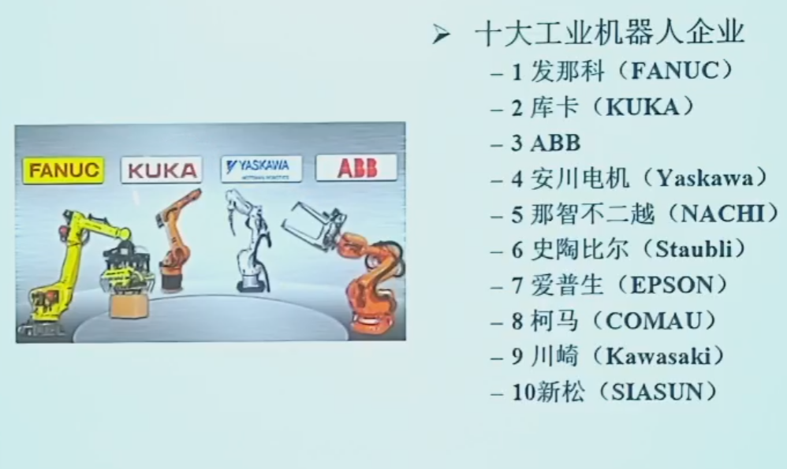

- 机电部分
- 传感部分
- 控制部分


## 主要技术参数

- 自由度
- 工作精度
  - 定位精度：实际达到的位置和设计的理想位置之间的差异
  - 重复定位精度：机器人重复到达某一目标位置的差异
- 工作范围
- 工作速度
- 承载能力：负载自重比


### 关键参数

- 臂力：1.5~3.0的安全系数


## 机械臂的轴数

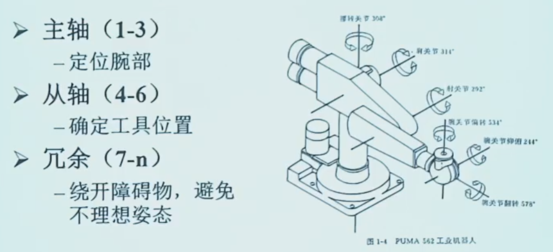


## 机械臂设计的主要内容

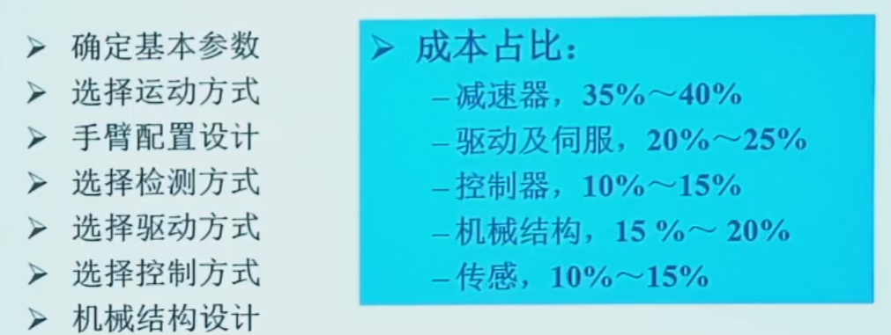


# 空间描述和变换


## 坐标系与向量

- 符号约定

  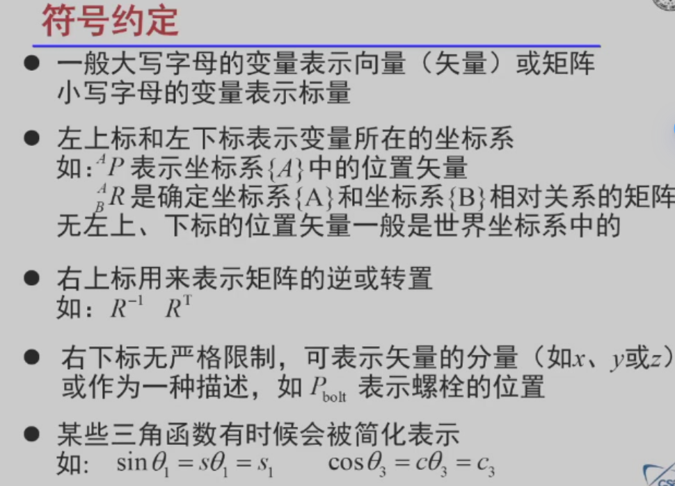

  > $_{B}^{A}R$​表示坐标系B在坐标系A中的描述
  >
  > 三角函数：$\sin \theta_1=s\theta_1=s_1,\cos \theta_1=c\theta_1=c_1$

- 坐标系：空间笛卡尔坐标系，采用相同长度的度量单位

- 向量：

  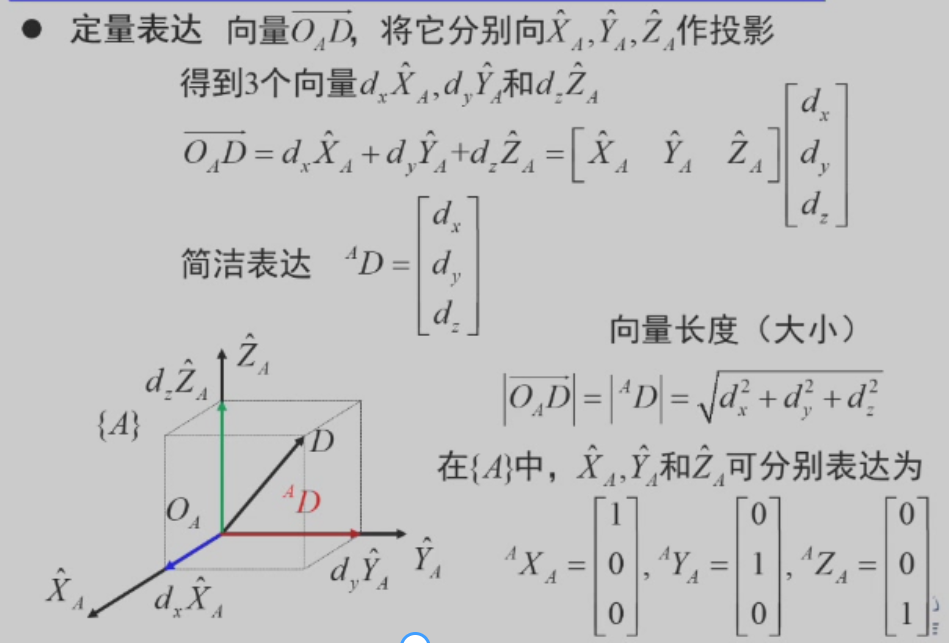
  $$
  ^AP=\begin{bmatrix}
  p_x \\
  p_y \\
  p_z
  \end{bmatrix},
  ^AQ=\begin{bmatrix}
  q_x \\
  q_y \\
  q_z
  \end{bmatrix}
  $$
  两者内积为
  $$
  \overrightarrow{OP}\cdot \overrightarrow{OQ}= {^AP} \cdot {^A Q}=
  {^AP}^T \space {^A Q}=\begin{bmatrix}
  p_x &
  p_y &
  p_z
  \end{bmatrix}
  \begin{bmatrix}
  q_x \\
  q_y \\
  q_z
  \end{bmatrix}
  $$
  两者外积${^AW}$

  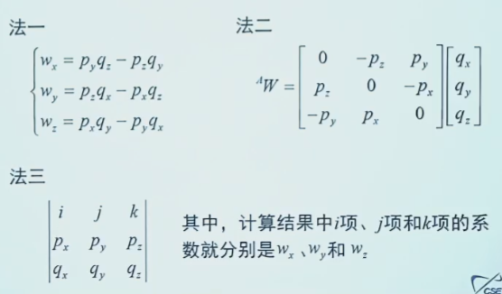

  > 机器人学中用法二最多——反对称矩阵
  >
  > [真一文搞懂：内积、外积及其衍生（内积：点积、数量积、标量积；外积：叉积、叉乘、向量积、张量积）](https://zhuanlan.zhihu.com/p/685184693#:~:text=首先说明一下， 内积 和 外积,都是一种 广义的称呼，我们 最常见的内积是点积 （数量积、标量积和点积定义相同），即对应元素乘然后累加；而我们最容易弄错外积的定义，我们理解的两个向量运算得到第三个向量，且其方向垂直于另外两个向量的运算严格上叫叉积、叉乘、向量积而非外积， 外积有其单独定义，其对向量运算的结果为矩阵。)
  >
  > $a×b$方向右手定则，食指指向a，向b弯曲


## 点和刚体的描述

- 点：用向量来描述

- 刚体：

  - 联体坐标系：物体上任意一点在联体坐标系中位置已知且始终不变

    需要将联体坐标系在固定坐标系中描述出来，旋转矩阵${^A_BR}$用9个量描述三维

    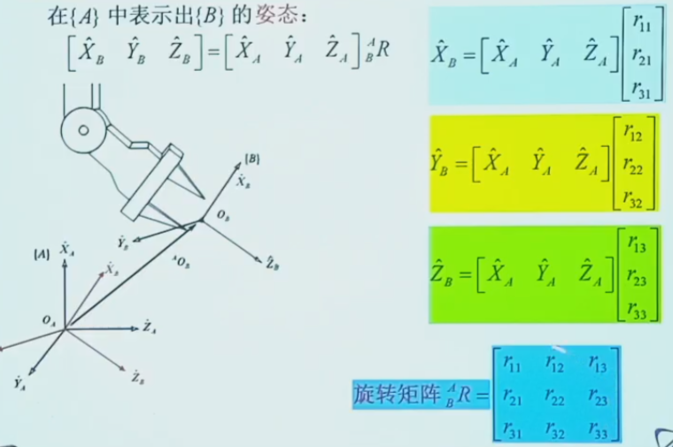

    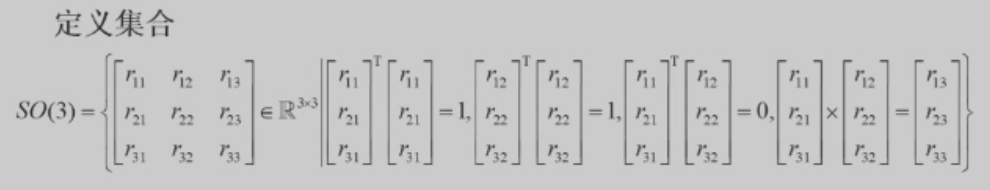

    - $SO(3)$(一个李群)是所有旋转矩阵的集合，每个旋转矩阵与刚体的不同姿态一一对应

    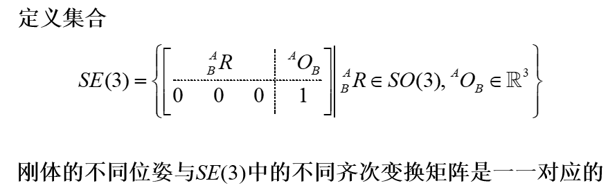

    $for~R\in SO(3),~R~ can~ be~ inversed~and~R^{-1}=R^T$

    - $SO(3)$​中任意一个矩阵都是正交矩阵
    
      > 行列式为1为右手坐标系中的旋转矩阵
      >
      > 行列式为-1为左手坐标系中的旋转矩阵

- 齐次变换矩阵：平移+旋转——在{A}中表示{B}的位姿
  $$
  P_A={_B^AR} P_B+{^AO_B}
  $$

  $$
  {_B^AT}=
  \left[
  \begin{array}{ccc|c}
  & {_B^AR} &  & {^AO_B} \\ \hline
  0 & 0 & 0 & 1 \\
  \end{array} 
  \right]
  \in R^{4×4}
  $$

  


## 坐标系几何关系！！！

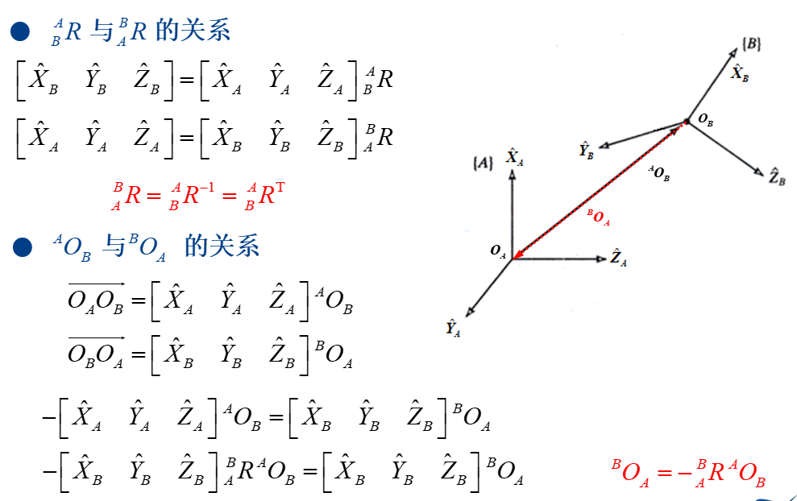

- $$
  {_A^BR}={_B^AR}^T={_B^AR}^{-1}
  $$

- 
  $$
  {^BO_A}=-{_B^AR}{^AO_B}
  $$
  
  > $$
  > \overrightarrow{O_AO_B}=\begin{align}[\hat{X_A} && \hat{Y_A} && \hat{Z_A}]\end{align}\space {^AO_B}
  > $$
  
- $$
  {_A^BT}={_B^AT}^{-1}
  $$

- $$
  {T}=
  \left[
  \begin{array}{ccc|c}
  & {R} &  & {O} \\ \hline
  0 & 0 & 0 & 1 \\
  \end{array} 
  \right],
  T^{-1}=
  \left[
  \begin{array}{ccc|c}
  & {R^T} &  & {- R^T O} \\ \hline
  0 & 0 & 0 & 1 \\
  \end{array} 
  \right]
  $$


**坐标系B中一个向量如何在坐标系A中表示：**

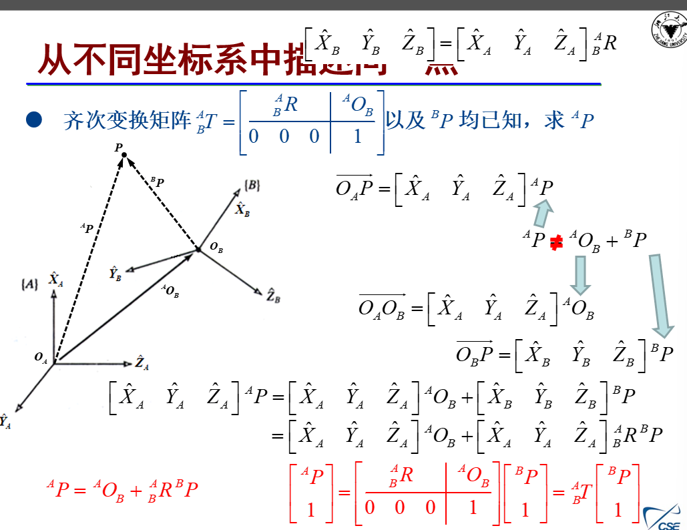
$$
{^AP}={^AO_B}+{_B^AR}\space{^BP}
$$

$$
\left[
\begin{array}{}
{^AP}  \\
1 
\end{array}
\right]=
\left[
\begin{array}{ccc|c}
& {_B^AR} &  & {^AO_B} \\ \hline
0 & 0 & 0 & 1 \\
\end{array} 
\right]
\left[
\begin{array}{}
{^BP}  \\
1 
\end{array}
\right]
=
{_B^AT} \left[
\begin{array}{}
{^BP}  \\
1 
\end{array}
\right]
$$


- 链乘法则——好算

  ${_C^AR}={_B^AR}\space{_C^BR}$

  ${_C^AT}={_B^AT}\space{_C^BT}$


## 一些旋转表达方式

[彻底搞懂“旋转矩阵/欧拉角/四元数”，让你体会三维旋转之美_欧拉角判断动作](https://blog.csdn.net/weixin_45590473/article/details/122884112)

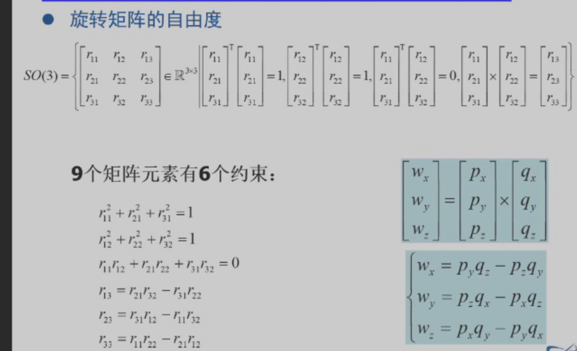

9个矩阵元素有6个约束

### 基本旋转矩阵

矢量旋转与坐标系旋转的旋转矩阵是一致的，但物理意义不同，

**矢量“向前”旋转相当于坐标系“向后”旋转**

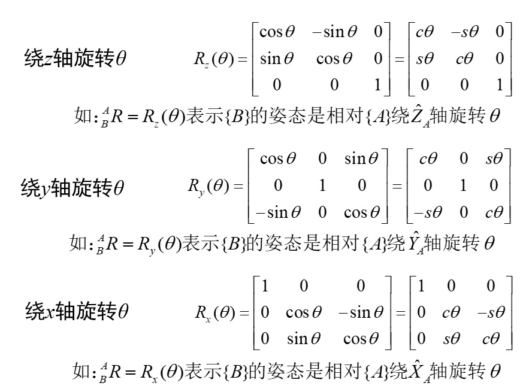

> one example:
>
> 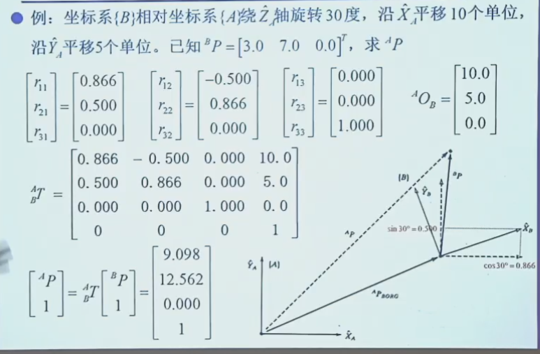


### 四元数

【四元数的可视化】https://www.bilibili.com/video/BV1SW411y7W1?vd_source=93bb338120537438ee9180881deab9c1

[彻底搞懂“旋转矩阵/欧拉角/四元数”，让你体会三维旋转之美_欧拉角判断动作-CSDN博客](https://blog.csdn.net/weixin_45590473/article/details/122884112)

- 四元数的基本运算与性质：[四元数Quaternion的基本运算 - DECHIN - 博客园 (cnblogs.com)](https://www.cnblogs.com/dechinphy/p/quaternion-calc.html#四元数共轭)

  乘法公式：

  

四元数就是用来表示三维空间中的旋转的

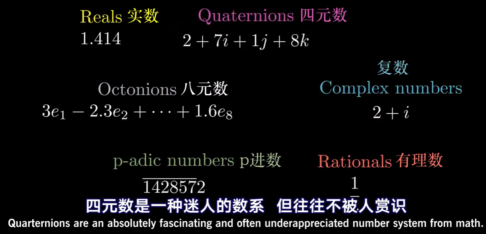

单位球面上的任意四元数都与虚数$i$​​等价

四元数包含了四个实参数以及三个虚部（一个实部三个虚部）

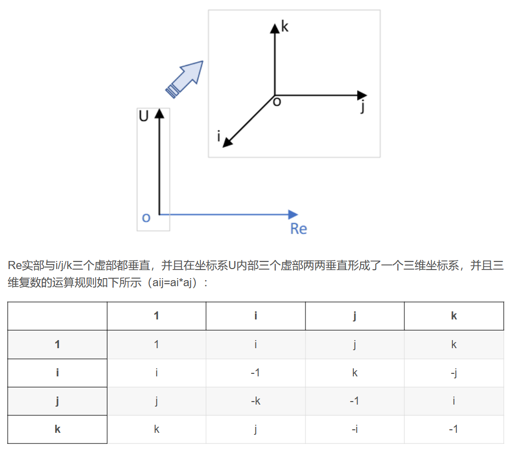


### 欧拉角和固定角

右乘联体左乘基

任何姿态都可由3个基本旋转操作的相乘来表示

从数学上证明刚体定点转动欧拉角中章动角的取值范围是[0,π\] - 知乎 (zhihu.com)](https://zhuanlan.zhihu.com/p/145675121)

$$
R_{z\prime y\prime x\prime}(\alpha ,\beta ,\gamma)=R_z(\alpha)R_y(\beta)R_x(\gamma)=R_{xyz}(\gamma,\beta,\alpha  )
$$

> 注意下标和顺序，加了$\prime$是联体坐标系，没加是基础坐标系

一共12种欧拉角表示（6种对称型，6种非对称型）

- ABC型欧拉角

  

- ABA型欧拉角

  


**固定角**：固定坐标系左乘

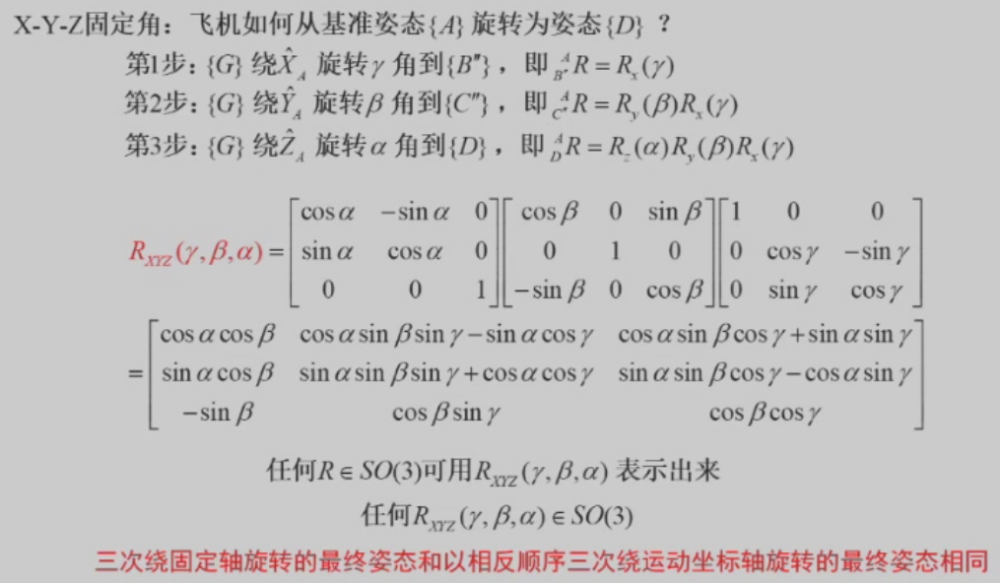

> **三次绕固定轴旋转的额最终姿态和以相反顺序三次绕运动坐标轴旋转的最终姿态相同**

范围证明如下：

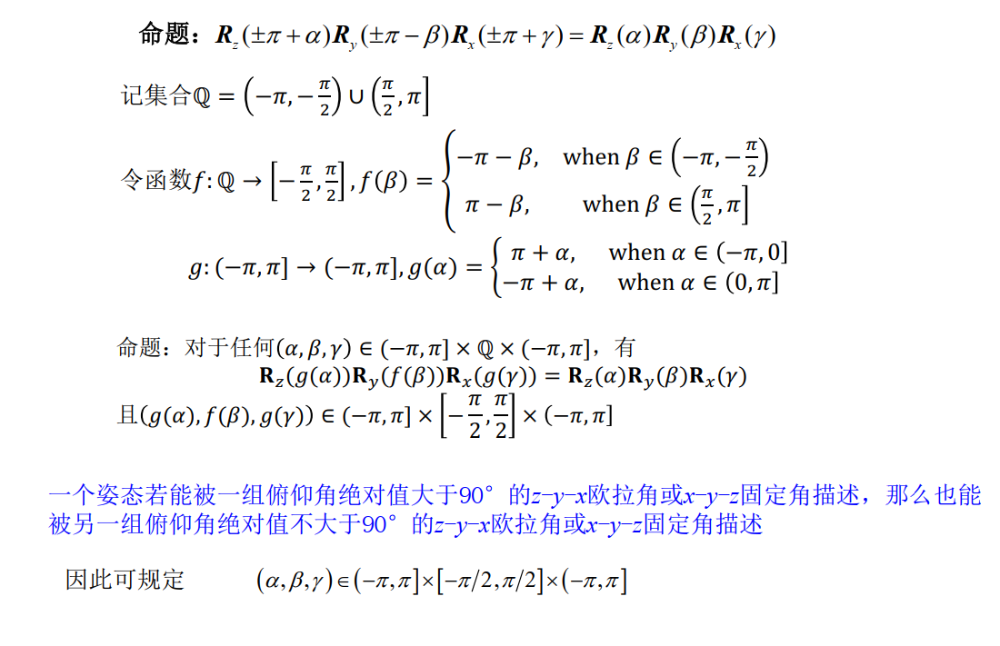

### 欧拉角与固定角的对偶及其推广

**右乘联体左乘基**

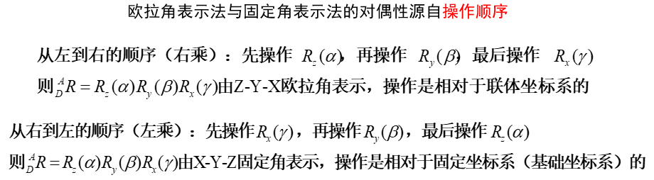

缺点：

两种反正切函数
$$
\theta=Arctan(x)=Atan(x),值域:(-\pi/2,\pi/2)
$$

$$
\theta=Arctan2(y,x),值域:(-\pi,\pi)
$$

> 矩阵左乘行变换，右乘列变换


下面是另一种证明


根据矩阵求解三个欧拉角：


- 当$\beta=\pm\pi/2$时，没有唯一解


### 等效轴角的表示

[绕任意轴的旋转矩阵 - 知乎 (zhihu.com)](https://zhuanlan.zhihu.com/p/462935097)

[等效轴角坐标系表示法 | M.Z's blog (mazhengg.github.io)](https://mazhengg.github.io/2018/03/30/等效轴角坐标系表示法/)

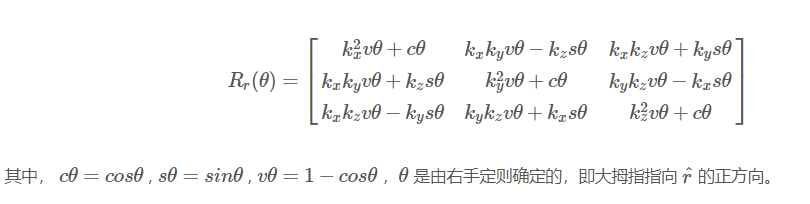

飞机能否仅1次旋转从基准姿态运动到任意姿态?——即飞机绕1个合适的轴旋转1个合适的角度

- 定点转动：在三维空间里，运动刚体的内部或外延部分至少有一点固定不动，称此运动为定点转动

  将联体坐标系原点设在此固定点，刚体姿态变、位置不变

- 欧拉旋转定理：

  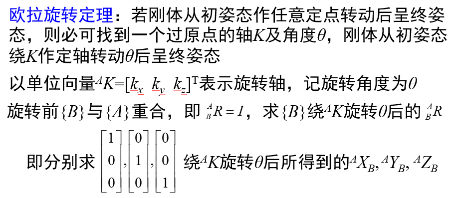

- 罗德里格斯公式
  $$
  ^AX_{B(1)}={^AX_{B(0)}}\cos{\theta}+(^AX_{B(0)}\cdot {^AK}){^AK}(1-\cos{\theta})+({^AK}\times {^AX_{B(0)}})\sin{\theta}
  $$

  $$
  % 在导言区需要添加 \usepackage{amsmath} 以支持矩阵环境
  ^{A}_{B(0)}\mathbf{R} = 
  \begin{pmatrix}
  k_x^2 \nu \theta + \cos\theta & k_x k_y \nu \theta - k_z \sin\theta & k_x k_z \nu \theta + k_y \sin\theta \\
  k_x k_y \nu \theta + k_z \sin\theta & k_y^2 \nu \theta + \cos\theta & k_y k_z \nu \theta - k_x \sin\theta \\
  k_x k_z \nu \theta - k_y \sin\theta & k_y k_z \nu \theta + k_x \sin\theta & k_z^2 \nu \theta + \cos\theta
  \end{pmatrix}
  = \mathbf{R}_K(\theta)
  $$

  其中$\nu \theta = 1-\cos{\theta}$。已知$R_K(\theta)$反解如下：
  $$
  \mathbf{R}_K(\theta) = \mathbf{R}_{-K}(-\theta)
  $$
  因此规定$$\theta \in [0, \pi]$$
  $$
  \theta = \arccos\left(\frac{\mathrm{tr}(\mathbf{R}) - 1}{2}\right) = \arccos\left(\frac{r_{11} + r_{22} + r_{33} - 1}{2}\right)
  $$
  旋转轴求解

  - 当 $θ ∈ (0, π)$ 时，旋转轴单位向量：
    $$
    \begin{bmatrix}
    k_x \\ 
    k_y \\
    k_z
    \end{bmatrix}
    = \frac{1}{2 \sin\theta}
    \begin{bmatrix}
    r_{32} - r_{23} \\
    r_{13} - r_{31} \\
    r_{21} - r_{12}
    \end{bmatrix}
    \quad (\text{唯一解})
    $$

  - 当 $θ = π$ 时
    $$
    \begin{bmatrix}
    k_x \\ 
    k_y \\
    k_z
    \end{bmatrix}
    = \pm
    \begin{bmatrix}
    \sqrt{(r_{11}+1)/2} \\
    r_{12}/\sqrt{2(r_{11}+1)} \\
    r_{13}/\sqrt{2(r_{11}+1)}
    \end{bmatrix}
    \quad (\text{两组解})
    $$

  - 当 $θ = 0$ 时，任意单位向量均可，无穷组解


### 欧拉参数

- [科学网—刚体姿态的数学表达(二)：欧拉参数与四元数 - 刘延柱的博文 (sciencenet.cn)](https://blog.sciencenet.cn/blog-3452605-1304318.html)

用 4 个欧拉参数表示刚体姿态仍只有 3 个独立变量，因为欧拉参数之间存在关系：
$$
\lambda^2_0+\lambda^2_1+\lambda^2_2+\lambda^2_3=1
$$

基于等效轴角表示的单位向量 $(k_x, k_y, k_z)^\top$ 和旋转角 $\theta \in \mathbb{R}$，定义欧拉参数：
$$
\left( \eta, \ \epsilon_1, \ \epsilon_2, \ \epsilon_3 \right)^\top
$$
其中：
$$
\eta = \cos\frac{\theta}{2}, \quad
\epsilon = \begin{pmatrix} \epsilon_1 \\ \epsilon_2 \\ \epsilon_3 \end{pmatrix} = \begin{pmatrix} k_x \\ k_y \\ k_z \end{pmatrix} \sin\frac{\theta}{2}
$$

约束条件：一个标量和一个长度不超过1的三维向量满足约束：
$$
\eta^2 + \epsilon_1^2 + \epsilon_2^2 + \epsilon_3^2 = 1
$$

集合与对应关系：记 $U$ 为由全体欧拉参数构成的集合，$U$ 是 $\mathbb{R}^4$ 中的单位超球面。单位四元数与欧拉参数一一对应。
$$
\epsilon_1 = k_x \sin\frac{\theta}{2},\quad \epsilon_2 = k_y \sin\frac{\theta}{2},\quad \epsilon_3 = k_z \sin\frac{\theta}{2}
$$
将欧拉参数代入旋转矩阵公式：
$$
\mathbf{R}_{K}(\theta) = \begin{pmatrix}
2(\eta^2 + \epsilon_1^2) - 1 & 2(\epsilon_1 \epsilon_2 - \eta \epsilon_3) & 2(\epsilon_1 \epsilon_3 + \eta \epsilon_2) \\
2(\epsilon_1 \epsilon_2 + \eta \epsilon_3) & 2(\eta^2 + \epsilon_2^2) - 1 & 2(\epsilon_2 \epsilon_3 - \eta \epsilon_1) \\
2(\epsilon_1 \epsilon_3 - \eta \epsilon_2) & 2(\epsilon_2 \epsilon_3 + \eta \epsilon_1) & 2(\eta^2 + \epsilon_3^2) - 1
\end{pmatrix}=R_{\epsilon}(\eta)
任意旋转矩阵 $\mathbf{R} \in \mathrm{SO}(3)$ 都存在四元数表示：
$$

$$
\mathbf{R}_\epsilon(\eta) = \mathbf{R},\quad \text{其中 } \eta + i\epsilon_1 + j\epsilon_2 + k\epsilon_3 \in S^3
$$

**Grassmann积**

在$\mathbb{R}^4$中定义Grassmann积
$$
\left(\begin{array}{c}\eta \\ \varepsilon \end{array}\right) \oplus\left(\begin{array}{c}\xi \\ \delta\end{array}\right) =

\left(\begin{array}{cc}
\eta \xi-\epsilon^T \delta \\
\eta \delta+\xi \epsilon+\epsilon \times \delta
\end{array}\right)=

\left(\begin{array}{cccc}
\eta & -\varepsilon_1 & -\varepsilon_2 & -\varepsilon_3 \\ 
\varepsilon_1 & \eta & -\varepsilon_3 & \varepsilon_2 \\ 
\varepsilon_2 & \varepsilon_3 & \eta & -\varepsilon_1 \\ 
\varepsilon_3 & -\varepsilon_2 & \varepsilon_1 & \eta
\end{array}\right)
\left(\begin{array}{c}
\xi \\ 
\delta_1 \\ 
\delta_2 \\ 
\delta_3
\end{array}\right)
= A\left(\begin{array}{c}
\xi \\ 
\delta_1 \\ 
\delta_2 \\ 
\delta_3
\end{array}\right)
$$

- $H$中的乘法对应$\mathbb{R}^4$中的Grassmann积
- 若$\left(\begin{array}{c}\eta \\ \epsilon\end{array}\right) \in U$，则满足正交条件$A^T A=I$
- 如果还有$\left(\begin{array}{c}\xi \\ \delta\end{array}\right) \in U$，则积运算保持闭合性：
  $$
  \left(\begin{array}{c}\xi & \delta^T\end{array}\right) A^T A\left(\begin{array}{c}\xi \\ \delta\end{array}\right)=1
  $$

即$\left(\begin{array}{cc}
\eta \xi-\epsilon^T \delta \\
\eta \delta+\xi \epsilon+\epsilon \times \delta
\end{array}\right)  \in U$，U中任意两个向量的Grassmann积仍是U中的向量


**参数分解**：
令$\zeta = \eta \xi - \epsilon^T \delta = \eta \xi - \sum_{i=1}^3 \epsilon_i \delta_i$

定义旋转参数：
$$
\rho=\left(\begin{array}{c}
\rho_1 \\ 
\rho_2 \\ 
\rho_3
\end{array}\right)=\eta \delta+\xi \epsilon+\epsilon \times \delta=\left(\begin{array}{l}
\eta \delta_1 + \varepsilon_1 \xi + \varepsilon_2 \delta_3 - \varepsilon_3 \delta_2 \\
\eta \delta_2 - \varepsilon_1 \delta_3 + \varepsilon_2 \xi + \varepsilon_3 \delta_1 \\
\eta \delta_3 + \varepsilon_1 \delta_2 - \varepsilon_2 \delta_1 + \varepsilon_3 \xi
\end{array}\right)
$$

**几何意义**：

1. $U$中的Grassmann积对应$SO(3)$旋转群运算
2. 欧拉参数通过Grassmann积直接描述：
   - 三维刚体姿态
   - 坐标系旋转变换
   - 保持$\det(A)=1$的特殊正交性


## 理解

**右乘联体左乘基**——适用于齐次变换矩阵


齐次变换矩阵需要注意：

1）右乘是先平移、后旋转；

2）左乘是先旋转、后平移；

3）相对于基础坐标系的旋转（左乘旋转），可能会产生平移

> A的基，B对A的旋转矩阵，B对A的齐次变换矩阵，
>
> 旋转矩阵or姿态矩阵？运动观点表示旋转，静止观点表示姿态
>
> 齐次变换矩阵or位姿矩阵？运动观点表示旋转和平移，静止观点表示姿态和位置

​    **齐次变换矩阵也具有类似的性质，不过左乘齐次变换矩阵相当于先旋转后平移，而右乘齐次变换矩阵相当于先平移后旋转。**


# 机械臂运动学

- 连杆
- 低副

[操作臂的运动学 - 知乎 (zhihu.com)](https://zhuanlan.zhihu.com/p/654935667)

下面是一些**基本运动学参量**的定义：

- 轴i表示关节i的轴线：转动型关节轴为旋转轴中心线，平动型关节为平移轴中心线

- 定义两个关节轴相对位置：

  - 连杆的长度$a$：取公垂线段$r_{O_{i-1}P_i}$为几何连杆，其长度为$a_{i-1}$

    > 当连杆的长度$a_{i-1}=0$时，我们并不将零长度的$r_{O_{i-1}P_i}$视为传统的零向量，而是在与轴$i-1$和轴$i$同时垂直的方向中选一个作为$r_{O_{i-1}P_i}$的正方向

  - 连杆扭距角 $\alpha$：过轴$i-1$作一个平面垂直于$r_{O_{i-1}P_i}$，然后将轴$i$投影到该平面上，按照轴$i-1$绕$r_{O_{i-1}P_i}$旋转到轴$i$投影的思路以右手螺旋法则确定轴$i-1$与轴$i$夹角的值，此夹角即为连杆转角$\alpha_{i-1}$

- 用来描述相邻连杆之间连接关系的两个参数：
  - 连杆偏距$d_i$：从$P_i$到$O_i$的又向距离
  - 关节角$\theta_i$：过$r_{O_{i-1}P_i}$作一个平面垂直于轴$i$，然后将$r_{O_{i}P_{i+1}}$，投影到该平面上，在平面内按照$r_{O_{i-1}P_i}$绕轴$i$旋转到$r_{O_{i}P_{i+1}}$，投影的思路以右手螺旋法则确定$r_{O_{i-1}P_{i}}$与$r_{O_{i}P_{i+1}}$夹角的值，此旋转角度即为关节角$\theta_i$


> 对于转动关节，$\theta_i$为关节变量（取d为0）；对于移动关节，$d_i$为关节变量（取$\theta$为0）；其余三个连杆参数是固定的
>
> **Prismatic Joint**平移关节

- 首关节的运动学参量

  - 设定一个虚拟的轴0和轴1重合，即取$a_0=0,\alpha_0=0$

  - 若关节1是转动关节，取$d_1=0$，而$r_{O_{0}P_1}$的方向则任取与轴1垂直的某个方向。**取$r_{O_{0}P_1}$的方向就是决定$r_{O_{1}P_2}$的零位方向**
  - 若关节1是滑动关节，取$θ_1=0$，而$r_{O_{0}P_1}$的位置则任取轴1上的某个点，**取$r_{O_{0}P_1}$的位置就是决定$r_{O_{1}P_2}$的零位位置**
  - $r_{O_{0}P_1}$是一个固定不动的几何连杆

- 末关节的运动学参量

  - 已知轴 $N-1$ 和轴 $N$ 的存在，$a_{N-1}$（连杆长度）和 $\alpha_{N-1}$（连杆扭角）为已知参数。需选取连杆 $N$ 上任意长度的向量 $r_{O_N P_{N+1}}$。

  - **转动关节**：
    - 偏距 $d_N = 0$。
    - 方向向量 $r_{O_N P_{N+1}}$ 可任取与连杆 $N$ 固连的方向。
    - 关节角 $\theta_N$ 由 $r_{O_N P_{N+1}}$ 与 $r_{O_{N-1} P_N}$ 的夹角定义。
  - **滑动关节**：
    - 关节角 $\theta_N = 0$。
    - 点 $O_N$ 在轴 $N$ 上任取与连杆 $N$ 固连的位置。
    - 偏距 $d_N$ 由点 $O_N$ 与 $P_N$ 的相对位移确定。

Denavit-Hartenberg参数，D-H法——两次平移，两次旋转。分为SDH和MDH

1. DH参数可以把关节角映射为末端执行器的位置和姿态
2. 雅克比矩阵可以把关节转速映射为笛卡尔空间的速度和角速度

MDH运动学参量表：

- **固定参数**：
  
  - $a_{i-1}$（连杆长度）
  - $\alpha_{i-1}$（连杆扭角）
  - *不随关节运动变化*
  
- **关节类型相关参数**：
  - **转动关节**：
    - 固定参数：$d_i$（偏距）
    - 关节变量：$\theta_i$（关节角）
    - 参数组成：
      $$
      3\ \text{连杆参数}:\ a_{i-1},\ \alpha_{i-1},\ d_i \\
      1\ \text{关节变量}:\ \theta_i
      $$

  - **滑动关节**：
    
    - 固定参数：$\theta_i$（关节角）
    - 关节变量：$d_i$（偏距）
    - 参数组成：
      $$
      3\ \text{连杆参数}:\ a_{i-1},\ \alpha_{i-1},\ \theta_i \\
      1\ \text{关节变量}:\ d_i
      $$

- **总参量计算**：
  - 关节数量：$N$
  - 总运动学参量：$4N$ 个
    - 固定参数占比：$3N$（连杆参数）
    - 可变参数占比：$N$（关节变量）

## 建立坐标系

如何建模看这个就好了：[机器人学：MDH建模](https://www.cnblogs.com/s206/p/16067661.html)

1. 先画出所有$z_i$轴
2. 再确定$x_i$轴（下面是MDH的细节）
   - 当$z_i$与$z_{i+1}$平行时，从$x_i$的原点指向$x_{i+1}$的原点方向。（即此轴指向下一轴的原点方向）
   - 当$z_i$与$z_{i+1}$不平行时，由叉乘右手定则确定$x_i$的方向。（$x_i = z_i × z_{i+1}$）
3. 最后右手定则确定$y_i$轴


建立连杆联体坐标系：（不唯一）


- Z轴根据关节轴确定
- X轴必须垂直于当前Z轴，且垂直于前一个Z轴（规则不适用于第0关节），常为r
- Y轴根据X、Z轴通过右手坐标系确定


这里需要强调连杆i的坐标系是建立在传动关节也就是靠近末端执行器\\一侧的关节处，也就是说坐标系$\(O_{i-1}x_{i-1}y_{i-1}z_{i-1}\)（简称\(\{O_{i-1}\}\)）$是与$\(Link_{i-1}\)\\$固连在一起的，坐标系$\(\{O_{i}\}\)是与\(Link_{i}\)$固连在一起的，在后面的介绍中请各位一定牢记，否则你会觉得整个坐标系变换都很奇怪

## 正运动学计算

下面是MDH参数设定顺序：$\alpha_{i-1}\to a_{i-1}\to \theta_i\to d_i$

1. **绕 $X_{i-1}$ 轴旋转 $\alpha_{i-1}$**
   - 旋转角度：$\alpha_{i-1}$（连杆扭角，固定参数）
   - 目的：调整 $Z_{i-1}$ 轴与 $Z_i$ 轴的相对方向。

2. **沿 $X_{i-1}$ 轴平移 $a_{i-1}$**
   - 平移距离：$a_{i-1}$（连杆长度，固定参数）
   - 目的：将坐标系原点移动到与关节 $i$ 轴线垂直的位置。

3. **绕 $Z_i$ 轴旋转 $\theta_i$**
   - 旋转角度：$\theta_i$（关节角，转动关节的变量，滑动关节的固定参数）
   - 目的：对齐 $X_{i-1}$ 轴与 $X_i$ 轴的方向（转动关节）或固定方向（滑动关节）。

4. **沿 $Z_i$ 轴平移 $d_i$**
   - 平移距离：$d_i$（偏距，滑动关节的变量，转动关节的固定参数）
   - 目的：沿关节 $i$ 的轴线移动坐标系原点至最终位置。


齐次变换矩阵为：
$$
_{i}^{i-1}T = 
\underbrace{\text{Rot}(X_{i-1}, \alpha_{i-1})}_{第1步} \cdot 
\underbrace{\text{Trans}(X_{i-1}, a_{i-1})}_{第2步} \cdot 
\underbrace{\text{Rot}(Z_i, \theta_i)}_{第3步} \cdot 
\underbrace{\text{Trans}(Z_i, d_i)}_{第4步}
$$
正运动学问题：已知各关节变量的值，以基座坐标系为参考系，求末端工具联体坐标系的位姿
$$
{^{i-1}_i}T = 
\begin{bmatrix}
\cos\theta_i & -\sin\theta_i & 0 & a_{i-1} \\
\sin\theta_i\cos\alpha_{i-1} & \cos\theta_i\cos\alpha_{i-1} & -\sin\alpha_{i-1} & -\sin\alpha_{i-1}d_i \\
\sin\theta_i\sin\alpha_{i-1} & \cos\theta_i\sin\alpha_{i-1} & \cos\alpha_{i-1} & \cos\alpha_{i-1}d_i \\
0 & 0 & 0 & 1
\end{bmatrix}
$$

$$
^{i-1}_iT(\theta_i) = 
\begin{matrix}
\cos{\theta_i} & -\sin{\theta_i} & 0 & l_i\\
\sin{\theta_i} & \cos{\theta_i} & 0 & 0\\
0 & 0 & 1 & 0\\
0 & 0 & 0 & 1
\end{matrix}
$$


## 逆运动学

- 封闭解法：代数解法+几何解法
- 数值解法

### 可解性

$$
^0_6 T = {}^0_1 T(\theta_1) \cdot {}^1_2 T(\theta_2) \cdot {}^2_3 T(\theta_3) \cdot {}^3_4 T(\theta_4) \cdot {}^4_5 T(\theta_5) \cdot {}^5_6 T(\theta_6)
$$

上述等式总共给出6个方程，其中含有6个未知量  

这些方程为非线性超越方程，要考虑其解的存在性、多重解性以及求解方法  

工作空间和解的存在性  

- 可达可行空间：机器人末端工具以至少一种姿态到达的区域  
- 灵巧工作空间：机器人末端工具能够以任何姿态到达的区域

多解可能性：取“最短行程”解，计算最短行程需要加权，使得选择侧重于移动小连杆而不是移动大连杆

关于运动学逆解的几个结论

- 所有包含转动关节和移动关节的串联型6自由度操作臂都是可解的，但这种解一般是数值解
- 对于6自由度操作臂来说，只有在特殊情况下才有解析解。这种存在解析解（封闭解）的操作臂具有如下特性：存在几个正交关节轴或者有多个$\alpha_i =0 ~or~ \pm90°$
- 具有6个旋转关节的操作臂存在封闭解的充分条件是相邻的三个关节轴线相交于一点


### 代数解法


$$
x=k_2c_2-k_2s_1
$$

$$
y=k_1s_1+k_2c_1
$$

求解这种类型的方程，进行变量代换


### 几何解法

几何解法需要将臂分解为多个平面几何结构，这种分解在连杆转角为$\alpha_i =0 ~or~ \pm90°$最方便


### n不大于4


### PIEPER解法

PIEPER研究了3个相邻的轴相交于一点的6自由度操作臂（包括3个相邻的轴平行的情况）。

PIEPER的方法主要针对**6个关节均为旋转关节的操作臂，且后面3个轴正交**


取出来交汇出 $r$ 和 $z$ 的函数


直接解出$\theta_3$


### 数值解


### 逆解相关问题

- 解的存在性和工作空间

- 反解唯一性和最优性

  


## 轨迹规划

位置、速度、加速度、Jerk、Snap

四阶求导，则得到了Snap函数：

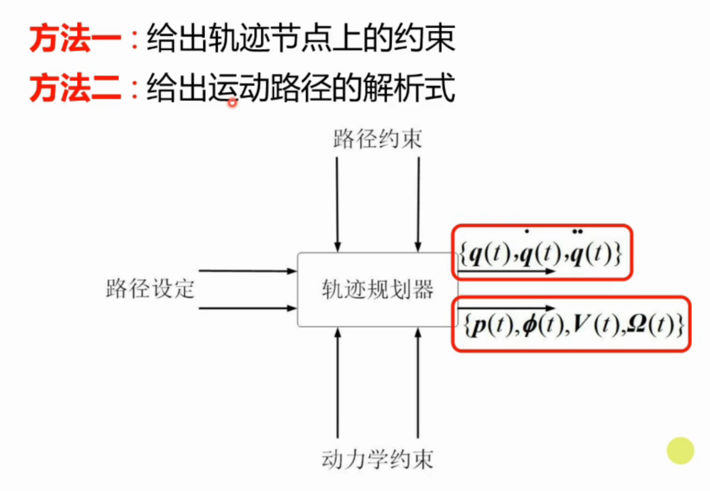

- cubic polynomials——多级三次多项式cubic polynomials，

trajectory plan中分别在joint-space和Cartesian space两种空间中的解法

三次限制位置+速度

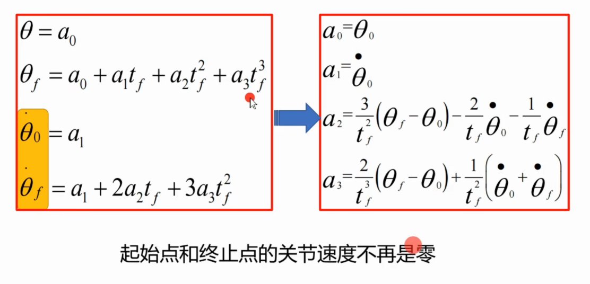

特殊：下面为起始和末端速度为0的情况

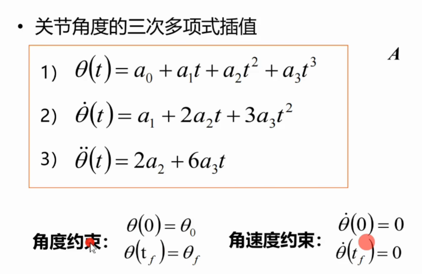

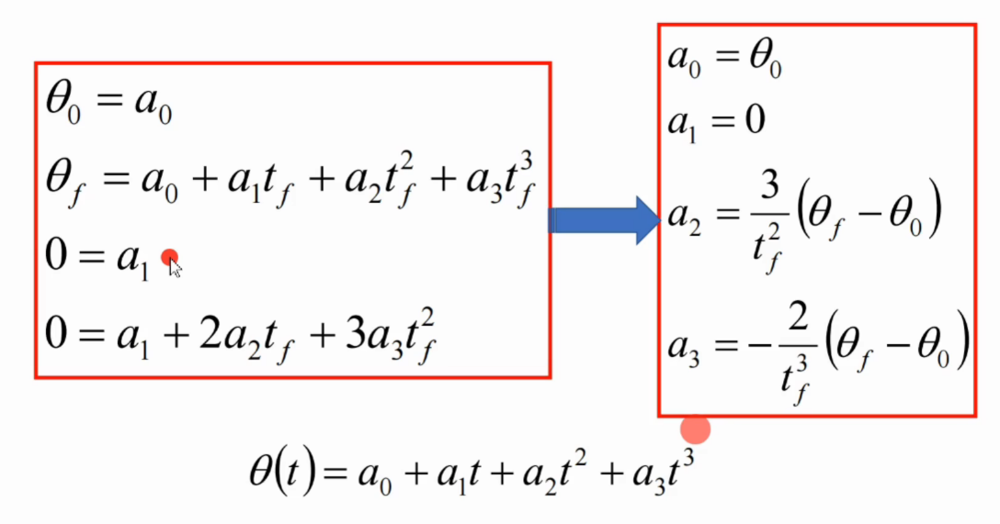

过路径：

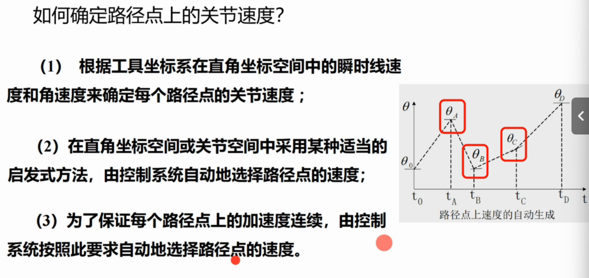

连接路径上的点，看两端的斜率：符号相反该点速度设为0，相同，设为两端斜率平均值


- 五次多项式曲线 Quintic Polynomial

五次限制位置+速度+加速度


### 笛卡尔空间

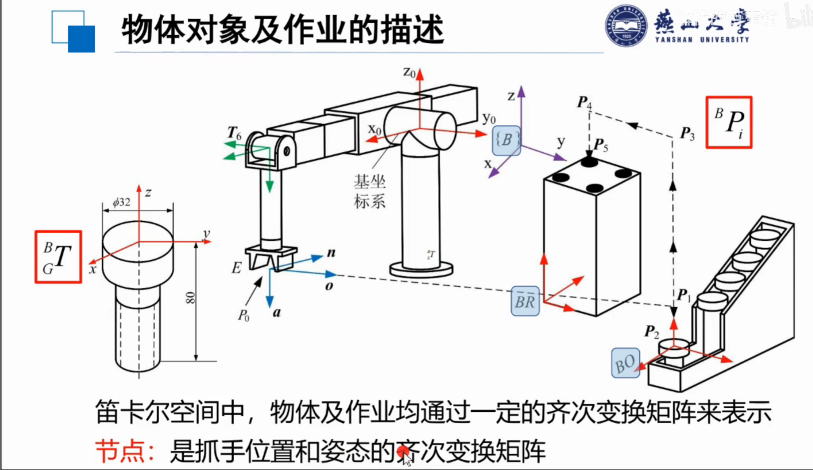

各运动点的运动方程

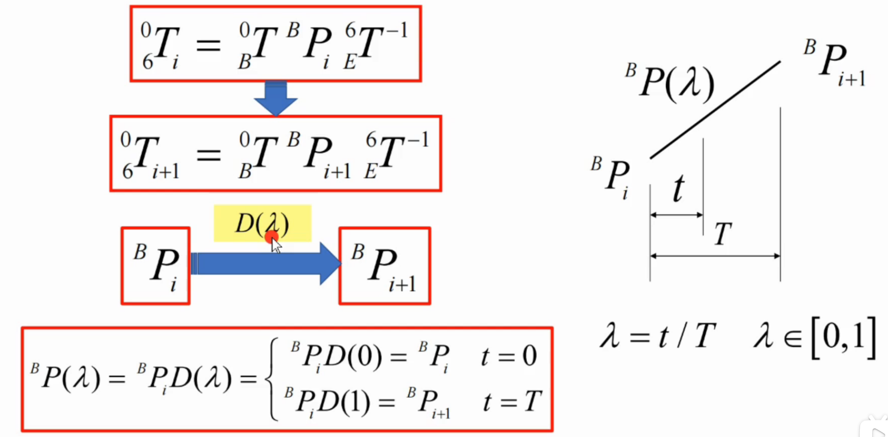

构造驱动变换矩阵

即求$D(\lambda)$

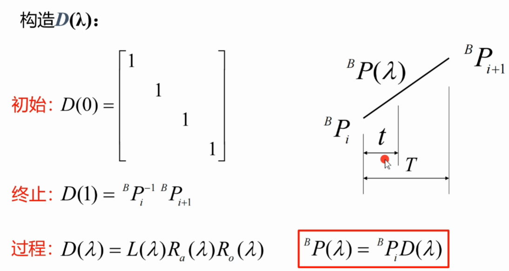

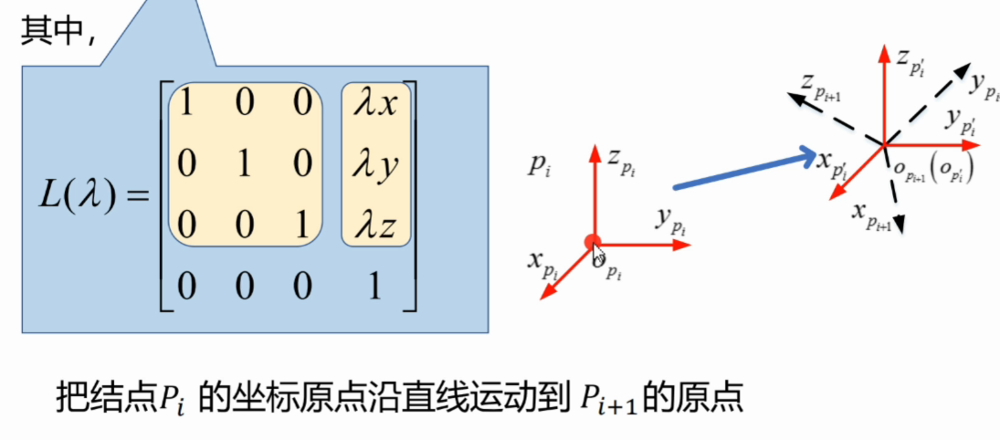

旋转得到

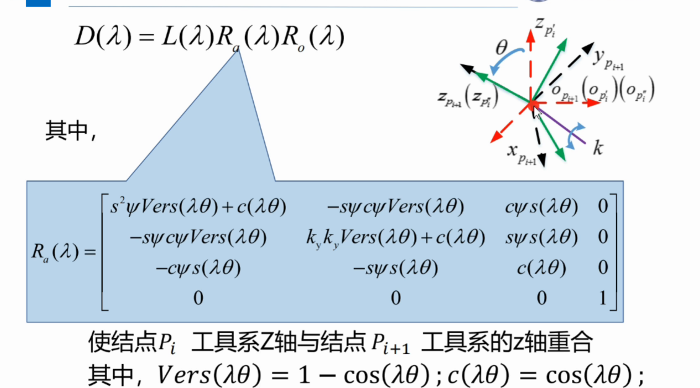

为了使结点$P_i$的z轴与节点$P_{i+1}$的z轴重合，我们需要绕k轴旋转$\lambda$，而k轴的确定是绕z轴旋转$\psi$得到的

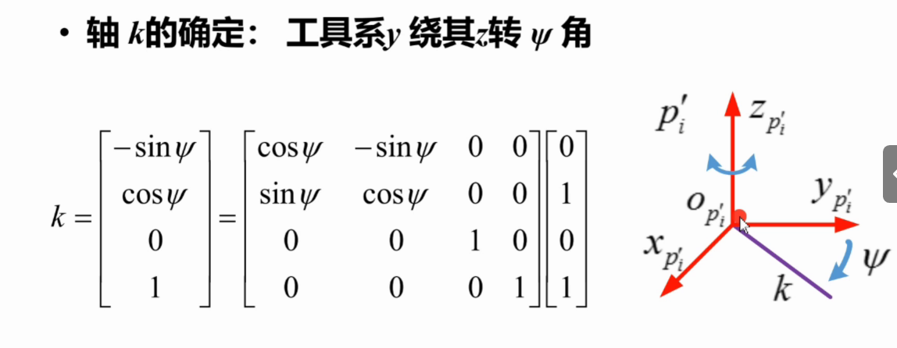

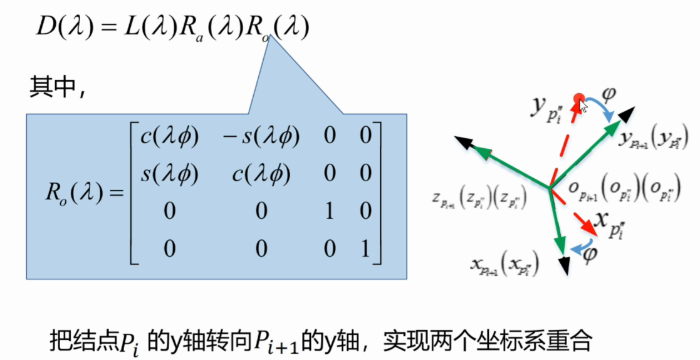

得到$D(\lambda)$的表达式，代入起始和末端$D(\lambda)$的值，可算出

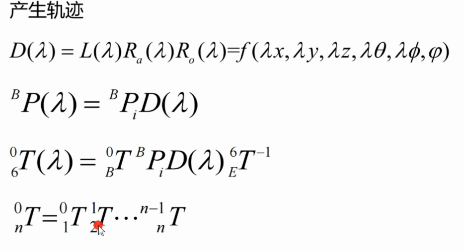

两段直线路径的过渡

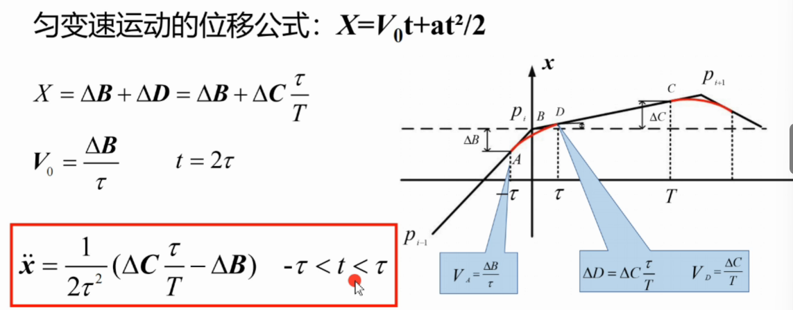


姿态规划：四元数球面线性插值Slerp  


反解的相关问题：

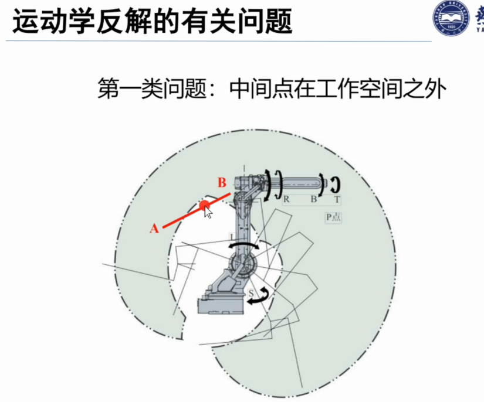

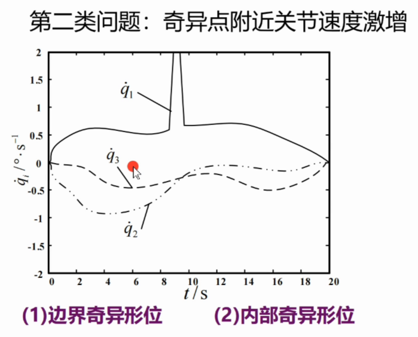

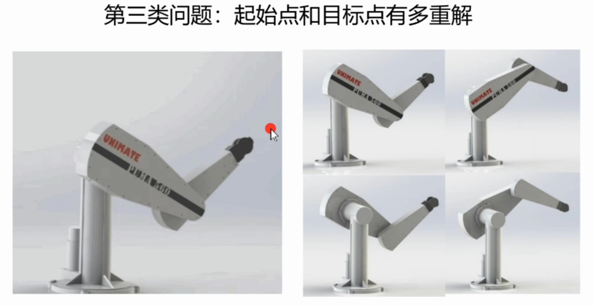

> 尽量使用关节空间，笛卡尔空间问题有点多


# 微分运动学与静力学


## 时变位姿的表示

1. 矢量$^BQ$的微分定义

矢量$^BQ$的微分表示为：
$$
^BV_Q = \frac{d}{dt}{^BQ} = \lim_{\Delta t \to 0} \frac{^BQ(t + \Delta t) - {^BQ}(t)}{\Delta t}
$$
若$^BQ$是某点的位置矢量，则该点关于坐标系{B}的速度为$^BV_Q$。

---

2. 速度矢量的坐标系转换

速度矢量$^BV_Q$可在任意坐标系中描述，转换到坐标系{A}的表达式为：
$$
^{A}(^BV_Q) = {^{A}R_{B}} \cdot {^BV_Q} = \frac{^{A}d}{dt}{^BQ} = \lim_{\Delta t \to 0} {^{A}_BR(t)} \left( \frac{^BQ(t + \Delta t) - {^BQ}(t)}{\Delta t} \right)
$$

---

3. 关键区别说明

需特别注意$^{A}(^BV_Q)$与绝对速度$^{A}V_Q$的区别：
$$
^{A}V_Q = \lim_{\Delta t \to 0} \frac{^{A}Q(t + \Delta t) - {^{A}Q}(t)}{\Delta t}
$$
展开后包含坐标系{B}的位移变化：
$$
^{A}V_Q = \lim_{\Delta t \to 0} \frac{
\begin{aligned}
&^{A}P_{Borg}(t + \Delta t) + {^{A}_BR}(t + \Delta t)^BQ(t + \Delta t) 
- {^{A}P_{Borg}}(t) - {^{A}_BR(t)}{^BQ(t)}
\end{aligned}
}{\Delta t}
$$

---

4. 特殊简化情形

当描述坐标系与参考坐标系相同时：
$$
^{B}(^BV_Q) = ^BV_Q
$$
此时无需重复标注外层坐标系上标。

经常讨论的是一个坐标系原点相对于世界坐标系{U}的速度，对于这种情况，定义一个缩写符号：
$$
v_c = {^UV_{CORG}}
$$

$$
attention: {^A \nu_C} = {^A_U R} \nu_C = {^A_UR} {^UV_{\text{CORG}}} \neq {^A V_{\text{CORG}}}
$$


> $$
> 线位移标量{\stackrel{微分}\longrightarrow}线速度标量
> $$
>
> $$
> 角位移标量{\stackrel{微分}\longrightarrow}角速度标量
> $$
>
> $$
> 线位移向量{\stackrel{微分}\longrightarrow}线速度向量
> $$
>
> $$
> 角位移向量{\stackrel{微分}\longrightarrow}\ne角速度向量
> $$
>

**刚体的运动均可以描述为原点的移动+绕原点的转动**

**刚体定点转动描述**

仅考虑刚体（或{B}）的定点转动，令 $ ^A P_{Borg} = 0 $，{B}与{A}原点重合。
由理论力学知：在任一瞬间，{B}在{A}中的定点转动可以看作是绕**瞬时转动轴**（简称瞬轴）的转动，瞬轴上的每个点在该瞬时相对于{A}的速度为零。

**瞬轴与角速度矢量**

- 瞬轴的位置可随时间变化，但原点始终在瞬轴上。
- 在{A}中描述{B}的定点转动可用**角速度矢量** $ ^A \Omega_B $：
  - **方向**：瞬轴在{A}中的方向（右手螺旋定则）
  - **大小**：在{A}中{B}绕瞬轴的旋转速度
- 数学表达式：

$$
^A V_Q = ^A \Omega_B \times ^A Q \quad (\forall Q \in \text{刚体})
$$
$$
^C({^A \Omega_B}) = {^C_AR}{^A\Omega_B}
$$

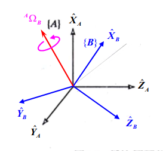

**角速度定义**：动坐标系{C}相对于世界坐标系{U}的角速度定义为：
$$
\omega_C = {}^U \Omega_C
$$
---

**符号说明**：

1. 在坐标系{A}中观测的角速度表示：

$$
^A \omega_C = {^A_U R} \omega_C = {^A_U R} ^U \Omega_C \quad (\neq \, ^A \Omega_C)
$$

2. 关键区别说明

- $ ^A \Omega_C $：坐标系{C}相对于{A}的真实角速度
- $ ^A \omega_C $：通过{U}到{A}的旋转矩阵间接转换的角速度表示
- **不等号**（$ \neq $）强调直接观测与间接转换的差异

### 刚体的线速度和角速度

Q是空间中的动点，{A}和{B}是动坐标系，则(这个部分直接给出结论了)
$$
{^AV_Q} = {^AV_{BORG}+{^A_B \dot{R}}{^BQ}+{^A_B {R}}{^BV_Q}}
$$

$$
{^A_B \dot{R}} = {^A_BS}{^A_B {R}}={^A\Omega_B }\times {^A}P_B
$$

$$
{^A_B \dot{R}}{^A_B {R}}^T = {^A_BS}
$$

对应角速度向量${^A\Omega_B = \begin{bmatrix}
\Omega_x \\
\Omega_y \\
\Omega_z
\end{bmatrix}}$定义角速度矩阵${^A_BS} = \begin{bmatrix}
0 & -\Omega_z & \Omega_y \\
\Omega_z & 0 & -\Omega_x \\
-\Omega_y & \Omega_x & 0
\end{bmatrix}$
$$
A\times B=
\begin{bmatrix}
a_2b_3-a_3b_2 \\
a_3b_1-a_1b_3 \\
a_1b_2-a_2b_1
\end{bmatrix}=
\begin{bmatrix}
0 & -a_3 & a_2 \\
a_3 & 0 & -a_1 \\
-a_2 & a_1 & 0
\end{bmatrix}
\begin{bmatrix}
b_1 \\
b_2 \\
b_3
\end{bmatrix}\in\mathbb{R}^3
$$

$$
^A \Omega_C = ^A \Omega_B + {^A_B R} {^B \Omega_C}
$$

### 连杆间速度传递

在操作臂工作过程中，基座静止，因此通常将{0}坐标系作为世界坐标系{U}使用。

对于连杆i的联体坐标系{i}，其速度和角速度在局部坐标系中的表达式为：
$$
^i v_i = {^i_U R} v_i = {}^i_U R {}^UV_{\text{iORG}} = {}^i_0 R{}^0 V_{\text{iORG}}
$$
$$
^i \omega_i = {}^i_U R \omega_i ={}^i_U R {}^U\Omega_i = {}^i_0 R {}^0 \Omega_i
$$

对于第i+1个连杆，其运动参数可表示为：
$$
^{i+1} v_i = {^{i+1}_U R} v_i = {}^{i+1}_U R {}^UV_{\text{iORG}} = {}^{i+1}_0 R{}^0 V_{\text{iORG}}
$$
$$
^{i+1} \omega_i = {}^{i+1}_U R \omega_i ={}^{i+1}_U R {}^U\Omega_i = {}^{i+1}_0 R {}^0 \Omega_i
$$

通过坐标系转换关系可得：
$$
^{i+1} v_i = {}{^{i+1}_i R^i} v_i
$$
$$
^{i+1} \omega_i = {}^{i+1}_i R^i \omega_i
$$

- 当关节$i+1$是旋转关节时
  $$
  {^{i+1}\omega_{i+1}} = {^{i+1}_i}R{^i\omega_i}+\dot{\theta}_{i+1}{^{i+1}Z_{i+1}}
  $$

  > - ${^{i+1}Z_{i+1}} = [0,0,1]^\top$是轴i+1在$\{i+1\}$中的表示
  > - $\dot{\theta}_{i+1}$是旋转关节i+1的关节转速即为${^i\omega_i}$
  > - ${^BQ} = {^iP_{i+1}}$为$\{i+1\}$的原点在$\{i\}$中的表示，是定常向量，因此${^B V_Q}=0$

  $$
  {^{i+1}\nu_{i+1}} = {^{i+1}_i}R({^i\nu_i}+{^{i}\omega}_{i}\times{^{i}P_{i+1}})
  $$

- 当关节$i+1$是移动关节时
  $$
  {^{i+1}\omega_{i+1}} = {^{i+1}_i}R{^i\omega_i}
  $$

  $$
  {^{i+1}\nu_{i+1}} = {^{i+1}_i}R({^i\nu_i}+{^{i}\omega}_{i}\times{^{i}P_{i+1}})+\dot{d}_{i+1} {^{i+1}Z_{i+1}}
  $$

  > $\dot{d}_{i+1} $是移动关节$i+1$的平移速度


## **向外迭代法**  

若已知每个关节，最后可求得${^N\omega_N}~and ~ {^N\nu _N}$，进一步可得
$$
\nu_N ={^0_NR}{^N\nu _N},\quad{\omega_N} = {^0_NR}{^N\omega_N}
$$

> 基坐标系速度为0，${^0\omega_0}=0~and ~ {^0\nu _0}=0 $

下面给出一个栗子：

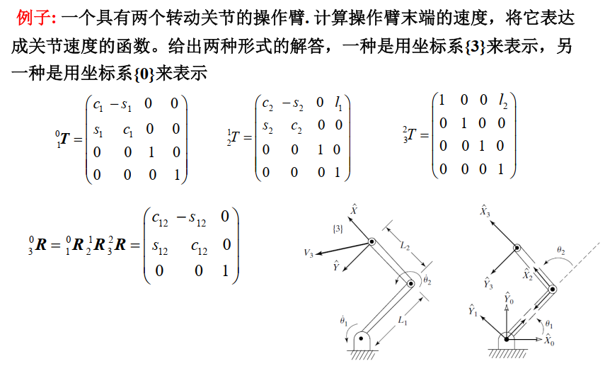

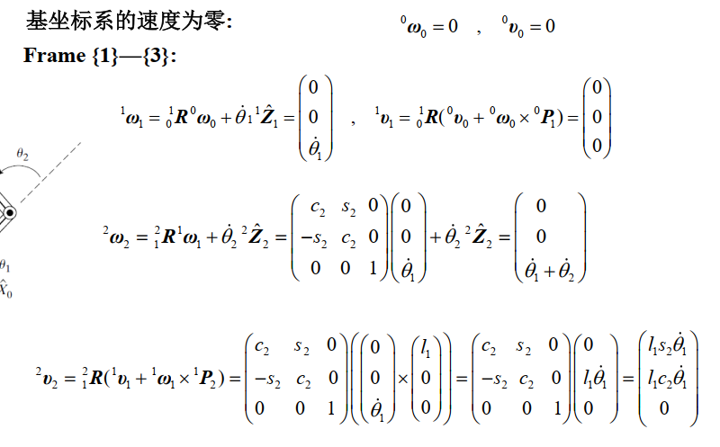


## 雅可比法

### 几何雅可比

**在机器人学中，雅克比矩阵主要是用来求末端执行器的角速度和线速度（ΔX）**

在机器人学中，雅克比矩阵主要是用来求末端执行器的角速度和线速度（ΔX）雅可比矩阵 有大问题[学习笔记之——Jacobian matrix（雅可比矩阵）](https://blog.csdn.net/gwplovekimi/article/details/104977255)

雅可比矩阵的重要性在于它体现了一个可微方程与给出点的最优线性逼近。因此，雅可比矩阵类似于多元函数的导数。
$$
J(X) = \begin{bmatrix}
\frac{\partial f_1}{\partial x_1}(X) & \frac{\partial f_1}{\partial x_2}(X) & \cdots & \frac{\partial f_1}{\partial x_n}(X) \\
\frac{\partial f_2}{\partial x_1}(X) & \frac{\partial f_2}{\partial x_2}(X) & \cdots & \frac{\partial f_2}{\partial x_n}(X) \\
\vdots & \vdots & \ddots & \vdots \\
\frac{\partial f_m}{\partial x_1}(X) & \frac{\partial f_m}{\partial x_2}(X) & \cdots & \frac{\partial f_m}{\partial x_n}(X)
\end{bmatrix}
$$

$$
\dot{Y} = J(x) \dot{X}
$$

求解雅可比矩阵的方法：

| 方法       | 特点                             |
| ---------- | -------------------------------- |
| 位置求导法 | 运动方程直接求导                 |
| 矢量积法   | 适量方法求解，表达形式简单       |
| 微分变换法 | 相对动坐标系的微分运动           |
| 速度递推法 | 从基座递推到各连杆线速度和角速度 |

- 位置求导法：找到位置关系，直接求导

- 矢量积法：通过将机器人各关节在末端产生的速度进行叠加得到操作速度

  假设其他关节固定不动，只有第i个关节绕其轴的转速为$\dot \theta_i$，则由此产生的连杆N的线速度和角速度分别为：
  $$
  v_N^{(i)} =\dot \theta_i Z_i\times(P_N-P_i)
  $$

  $$
  \omega_N^{(i)} =\dot \theta_i Z_i
  $$
  
  末端实际线速度和角速度就是各关节造成的线速度和角速度的总和:


$$
   \nu_N = \sum_{i=1}^{N} \nu_N^{(i)}, \quad \omega_N = \sum_{i=1}^{N} \omega_N^{(i)}
$$

  定义笛卡尔速度矢量$  \nu_N = \begin{bmatrix} \nu_N \\ \omega_N \end{bmatrix} \in \mathbb{R}^6  $ 和关节空间角速度矢量$  \dot{\Theta} = \begin{bmatrix} \dot{\theta}_1 \\ \dot{\theta}_2 \\ \vdots \\ \dot{\theta}_N \end{bmatrix} \in \mathbb{R}^N  $

  则：


$$
\nu_N = \begin{bmatrix} \hat{Z}_1 \times (P_N - P_1) & \hat{Z}_2 \times (P_N - P_2) & \cdots & \hat{Z}_{N-1} \times (P_N - P_{N-1}) & 0 \\ \hat{Z}_1 & \hat{Z}_2 & \cdots & \hat{Z}_{N-1} & \hat{Z}_N \end{bmatrix} \dot{\Theta}
$$

$$
  = J(\Theta) \dot{\Theta},  J(\Theta) \in \mathbb{R}^{6 \times N}
$$

即为雅可比矩阵

> 其中$\hat Z_{i}$表示坐标系{i}的z轴单位向量在座标系{0}中的表示

对于任意已知的操作臂位形，关节速度和操作臂末端速度的关系是线性的，然而这种线性关系仅仅是瞬时的，因为在下一刻，雅可比矩阵就会有微小的变化。

  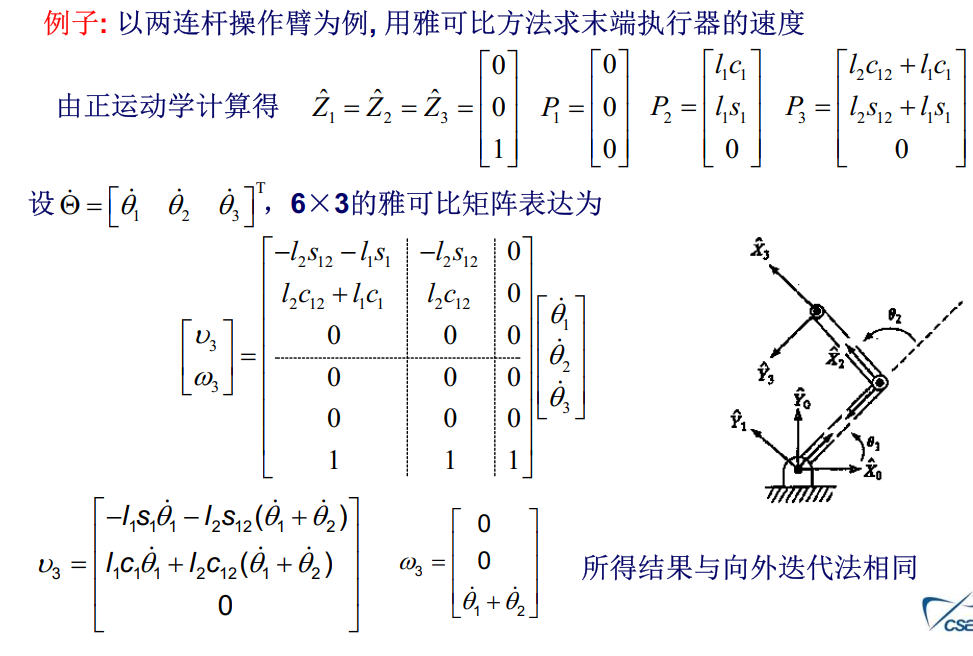

参考坐标系变换下的雅可比矩阵  

若关心 $\{i\}$ 中的笛卡尔速度向量，则
$$
\begin{pmatrix}
^i \mathbf{v}_N \\
^i \mathbf{\omega}_N
\end{pmatrix}
=
\begin{pmatrix}
^i_0 \mathbf{R} & 0 \\
0 & ^i_0 \mathbf{R}
\end{pmatrix}

\begin{pmatrix}
\mathbf{v}_N \\
\mathbf{\omega}_N
\end{pmatrix}
=
\begin{pmatrix}
^i_0 \mathbf{R} & 0 \\
0 & ^i_0 \mathbf{R}
\end{pmatrix}
\mathbf{J}(\mathbf{\Theta}) \dot{\mathbf{\Theta}}
$$
变换后的雅可比矩阵表示为
$$
^i \mathbf{J}(\mathbf{\Theta}) = 
\begin{pmatrix}
^i_0 \mathbf{R} & 0 \\
0 & ^i_0 \mathbf{R}
\end{pmatrix}
\mathbf{J}(\mathbf{\Theta})
$$
最终速度向量表达式为
$$
\begin{pmatrix}
^i \mathbf{v}_N \\
^i \mathbf{\omega}_N
\end{pmatrix}
= ^i \mathbf{J}(\mathbf{\Theta}) \dot{\mathbf{\Theta}}
$$


- 微分变换法[【机器人学】微分变换与雅可比矩阵 - 简书 (jianshu.com)](https://www.jianshu.com/p/94213f4fe544)

  微分变换的等价变换，是指基座坐标系的微分变换到末端执行器的微分变换之间的关系

  #### Coordinate System Infinitesimal Transformation

  The infinitesimal transformation of a coordinate system involves both translation and rotation. If we use $T$ to represent the original coordinate system and assume that the change in the coordinate system $T$ due to infinitesimal transformation is represented by $\mathrm{d}T$, then:
  $$
  T + \mathrm{d}T = \text{Trans}(dx, dy, dz) \ast \text{Rot}(q, d\theta) \ast T
  $$
  The differential change $\mathrm{d}T$ can be expressed as:
  $$
  \mathrm{d}T = \left[ \text{Trans}(dx, dy, dz) \ast \text{Rot}(q, d\theta) - I \right] \ast T = \Delta T
  $$
  Here, $\Delta$ is referred to as the infinitesimal operator(微分算子). Its value is the difference between the infinitesimal translation and rotation matrices minus the identity matrix. By applying the infinitesimal operator to the coordinate system, it results in changes to the coordinate system. We can derive:
  $$
  T_{\text{new}} = T + \mathrm{d}T
  $$
  The expression for $\Delta$ is:
  $$
  \Delta = \begin{bmatrix}
  0 & -\delta_z & \delta_y & dx \\
  \delta_z & 0 & -\delta_x & dy \\
  -\delta_y & \delta_x & 0 & dz \\
  0 & 0 & 0 & 0
  \end{bmatrix}
  $$
  **Key Definitions**:
  - $\text{Trans}(dx, dy, dz)$: Differential translation operator
  - $\text{Rot}(q, d\theta)$: Differential rotation operator about axis $q$ with angle $d\theta$
  - $\delta_x, \delta_y, \delta_z$: Angular displacements about respective axes
  
  #### Coordinate System Infinitesimal Transformation
  
  The infinitesimal operator represents an infinitesimal change relative to a fixed reference coordinate system. However, it can also represent an infinitesimal change relative to the current coordinate system itself. This allows for the calculation of changes in the current coordinate system.
  
  Given that the new infinitesimal operator is relative to the current coordinate system, to find the change in the coordinate system, we must use the new infinitesimal operator. Since both describe the same change in the coordinate system, the results should be identical. Therefore:
  $$
  \mathrm{d}T = \Delta \ast T = T \ast T_\Delta
  $$
  
  $$
  T^{-1} \ast \Delta \ast T = T_\Delta
  $$
  The expressions for $T^{-1}$ and $T_\Delta$ are:
  $$
  T^{-1} = \begin{bmatrix}
  n_x & n_y & n_z & -p \cdot n \\
  o_x & o_y & o_z & -p \cdot o \\
  a_x & a_y & a_z & -p \cdot a \\
  0 & 0 & 0 & 1
  \end{bmatrix}
  $$
  
  $$
  T_\Delta = \begin{bmatrix}
  0 & -T_{\delta_z} & T_{\delta_y} & T_{d_x} \\
  T_{\delta_z} & 0 & -T_{\delta_x} & T_{d_y} \\
  -T_{\delta_y} & T_{\delta_x} & 0 & T_{d_z} \\
  0 & 0 & 0 & 0
  \end{bmatrix}
  $$
  **Parameter Definitions**:
  - $T_{\delta_x} = \delta \cdot n$
  - $T_{\delta_y} = \delta \cdot o$
  - $T_{\delta_z} = \delta \cdot a$
  - $T_{d_x} = n \cdot (\delta \times p + d)$
  - $T_{d_y} = o \cdot (\delta \times p + d)$
  - $T_{d_z} = a \cdot (\delta \times p + d)$
  
  **Key Notations**:
  - $\delta = [\delta_x, \delta_y, \delta_z]^\top$: Angular displacement vector
  - $d = [d_x, d_y, d_z]^\top$: Linear displacement vector
  - $n, o, a$: Orthonormal basis vectors of the coordinate system
  - $p$: Position vector of the coordinate system origin
  
  #### 坐标系下和平移旋转微分量之间的关系
  
  微分运动在不同坐标系下的转换关系可通过以下矩阵方程描述：
  
  **微分运动转换方程**：
  
  $$
  \begin{bmatrix}
  ^T \, dx \\
  ^T \, dy \\
  ^T \, dz \\
  ^T \, \delta_x \\
  ^T \, \delta_y \\
  ^T \, \delta_z
  \end{bmatrix}
  =
  \begin{bmatrix}
  n_x & n_y & n_z & (p \times n)_x & (p \times n)_y & (p \times n)_z \\
  o_x & o_y & o_z & (p \times o)_x & (p \times o)_y & (p \times o)_z \\
  a_x & a_y & a_z & (p \times a)_x & (p \times a)_y & (p \times a)_z \\
  0 & 0 & 0 & n_x & n_y & n_z \\
  0 & 0 & 0 & o_x & o_y & o_z \\
  0 & 0 & 0 & a_x & a_y & a_z
  \end{bmatrix}
  \begin{bmatrix}
  dx \\
  dy \\
  dz \\
  \delta_x \\
  \delta_y \\
  \delta_z
  \end{bmatrix}
  $$
  
  
  **紧凑矩阵表示**：
  
  $$
  \begin{bmatrix}
  ^T \, d \\
  ^T \, \delta
  \end{bmatrix}
  =
  \begin{bmatrix}
  R^T & -R^T \, S(p) \\
  0 & R^T
  \end{bmatrix}
  \begin{bmatrix}
  d \\
  \delta
  \end{bmatrix}
  $$
  
  
  **逆变换关系**：
  
  $$
  \begin{bmatrix}
  dx \\
  dy \\
  dz \\
  \delta_x \\
  \delta_y \\
  \delta_z
  \end{bmatrix}
  =
  \begin{bmatrix}
  n_x & o_x & a_x & (p \times n)_x & (p \times o)_x & (p \times a)_x \\
  n_y & o_y & a_y & (p \times n)_y & (p \times o)_y & (p \times a)_y \\
  n_z & o_z & a_z & (p \times n)_z & (p \times o)_z & (p \times a)_z \\
  0 & 0 & 0 & n_x & o_x & a_x \\
  0 & 0 & 0 & n_y & o_y & a_y \\
  0 & 0 & 0 & n_z & o_z & a_z
  \end{bmatrix}
  \begin{bmatrix}
  T \, dx \\
  T \, dy \\
  T \, dz \\
  T \, \delta_x \\
  T \, \delta_y \\
  T \, \delta_z
  \end{bmatrix}
  $$
  
  
  **逆变换紧凑形式**：
  
  $$
  \begin{bmatrix}
  d \\
  \delta
  \end{bmatrix}
  =
  \begin{bmatrix}
  R & -S^T(p) \, R \\
  0 & R
  \end{bmatrix}
  \begin{bmatrix}
  T \, d \\
  T \, \delta
  \end{bmatrix}
  $$
  
  
  ---
  
  #### 矩阵定义
  
  1. **旋转矩阵**：
  
  
  
  $$
     R = \begin{bmatrix}
     n_x & o_x & a_x \\
     n_y & o_y & a_y \\
     n_z & o_z & a_z
     \end{bmatrix}
   
  $$
  
     - 其中 $  n, o, a  $ 为坐标系的正交单位基向量
  
  2. **斜对称矩阵**：
  
  
  
  $$
     S(p) = \begin{bmatrix}
     0 & -p_z & p_y \\
     p_z & 0 & -p_x \\
     -p_y & p_x & 0
     \end{bmatrix}
   
  $$
  
     - 与位置向量 $  p = [p_x, p_y, p_z]^\top  $ 相关
     - 满足性质 $  S(p) q = p \times q  $（叉乘运算）
  
  **微分变换具有无序性**
  
  **雅可比矩阵与微分运动关系分析**
  
  雅可比矩阵建立了笛卡尔空间与关节空间的速度映射关系：
  
  $$
  \begin{bmatrix}
  \mathbf{v} \\
  \mathbf{\omega}
  \end{bmatrix}
  = 
  \begin{bmatrix}
  J_{11} & J_{12} & \cdots & J_{1n} \\
  J_{21} & J_{22} & \cdots & J_{2n} \\
  \vdots & \vdots & \ddots & \vdots \\
  J_{61} & J_{62} & \cdots & J_{6n}
  \end{bmatrix}
  \begin{bmatrix}
  \dot{q}_1 \\
  \dot{q}_2 \\
  \vdots \\
  \dot{q}_n
  \end{bmatrix}
  $$
  
  - $\mathbf{v}$: 末端执行器线速度矢量
  - $\mathbf{\omega}$: 末端执行器角速度矢量
  - $\dot{q}_i$: 第$i$个关节速度
  
  微分运动量关系表达式：
  
  $$
  d\mathbf{x} = 
  \begin{bmatrix}
  \mathbf{d} \\
  \mathbf{\delta}
  \end{bmatrix}
  = J(\mathbf{q}) \, d\mathbf{q}
  $$
  
  - $\mathbf{d}$: 微分平移矢量
  - $\mathbf{\delta}$: 微分旋转矢量
  
  对于转动关节的微分运动分析：
  
  $$
  ^{i}\mathbf{d} = 
  \begin{bmatrix}
  0 \\
  0 \\
  0
  \end{bmatrix}, \quad 
  ^{i}\mathbf{\delta} = 
  \begin{bmatrix}
  0 \\
  0 \\
  1
  \end{bmatrix} \dot{q}_i
  $$
  
  对应的连杆坐标系雅可比向量：
  
  $$
  ^{i}J_i = [\,0\ \ 0\ \ 0\ \ 0\ \ 0\ \ 1\,]^\top
  $$
  
  
  #### 4. 坐标系转换关系
  基坐标系下的雅可比分量计算：
  
  $$
  J_i = 
  \begin{bmatrix}
  (\mathbf{p}_i \times \mathbf{a}_i)_x \\
  (\mathbf{p}_i \times \mathbf{a}_i)_y \\
  (\mathbf{p}_i \times \mathbf{a}_i)_z \\
  a_{ix} \\
  a_{iy} \\
  a_{iz}
  \end{bmatrix}
  $$
  
  - $\mathbf{p}_i$: 第$i$关节坐标系原点位置
  - $\mathbf{a}_i$: 第$i$关节z轴方向单位矢量
  
  
  
  以下是一个例子：
  
  
  
  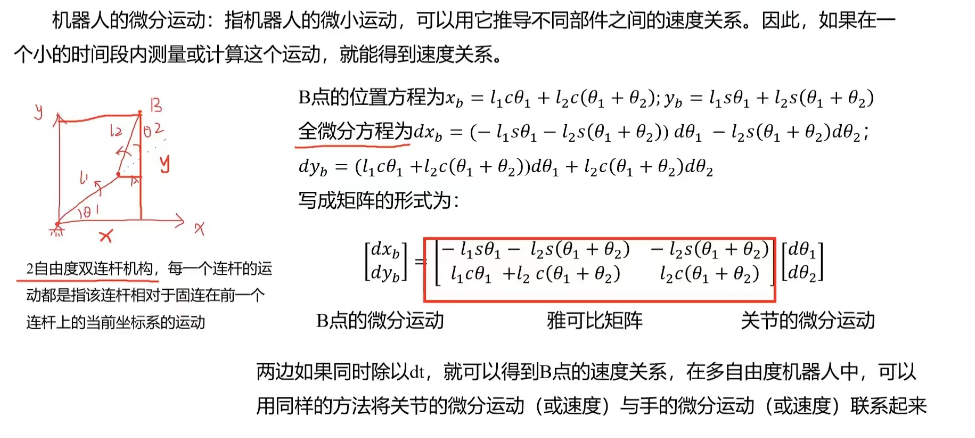
  
  机器人的微分运动指的是机器人的微小运动，可以用它推导不同部件之间的速度关系。因此，如果在一个小的时间段内测量或计算这个运动，就能得到速度关系。
  
  B点的位置方程为：
  
  $$
  \begin{aligned}
  x_b &= l_1 \cos\theta_1 + l_2 \cos(\theta_1 + \theta_2) \\
  y_b &= l_1 \sin\theta_1 + l_2 \sin(\theta_1 + \theta_2)
  \end{aligned}
  $$
  
  全微分方程为：
  
  $$
  \begin{aligned}
  dx_b &= \left[ -l_1 \sin\theta_1 - l_2 \sin(\theta_1+\theta_2) \right] d\theta_1 - l_2 \sin(\theta_1+\theta_2) d\theta_2 \\
  dy_b &= \left[ l_1 \cos\theta_1 + l_2 \cos(\theta_1+\theta_2) \right] d\theta_1 + l_2 \cos(\theta_1+\theta_2) d\theta_2
  \end{aligned}
  $$
  
  
  ---
  
  矩阵形式表示
  $$
  \begin{bmatrix}
  dx_b \\
  dy_b
  \end{bmatrix}
  = 
  \underbrace{
  \begin{bmatrix}
  -l_1 \sin\theta_1 - l_2 \sin(\theta_1+\theta_2) & -l_2 \sin(\theta_1+\theta_2) \\
  l_1 \cos\theta_1 + l_2 \cos(\theta_1+\theta_2) & l_2 \cos(\theta_1+\theta_2)
  \end{bmatrix}
  }_{\text{雅可比矩阵 } J}
  \begin{bmatrix}
  d\theta_1 \\
  d\theta_2
  \end{bmatrix}
  $$
  
  两边同时除以$dt$就能得到速度关系
  
  B点的微分运动通过雅可比矩阵与关节的微分运动联系：
  
  $$
  \begin{bmatrix}
  \dot{x}_b \\
  \dot{y}_b
  \end{bmatrix}
  = J 
  \begin{bmatrix}
  \dot{\theta}_1 \\
  \dot{\theta}_2
  \end{bmatrix}
  $$
  
  其中对时间求导关系：
  
  $$
  dx_b = \dot{x}_b dt, \quad d\theta_1 = \dot{\theta}_1 dt
  $$
  
  
  ---
  
  扩展应用
  
  对于多自由度机器人（如 $n$ 关节机器人），广义雅可比矩阵可表示为：
  
  $$
  J \in \mathbb{R}^{m \times n} \quad (m: \text{操作空间维度}, n: \text{关节数})
  $$
  
  该矩阵建立了关节速度到末端执行器速度的映射：
  
  $$
  v_{\text{end}} = J \dot{\theta}
  $$
  
- 向外迭代法：见上节


### 分析雅可比

分析雅可比$J_a(\theta)$基于对末端执行器姿态的最小表示

分析雅可比矩阵：通过操作臂末端的最小表示的运动学方程对关节变量的微分计算得到的雅可比矩阵

令$  X = \begin{bmatrix} d \\ \phi \end{bmatrix}  $表示末端执行器的位姿，其中$  d  $为基座坐标系原点到末端执行器坐标系原点的一般向量，$  \phi  $为末端执行器坐标系相对于基座坐标系姿态的最小表示（例如固定角表示或欧拉角表示）。分析雅可比满足以下形式：


$$
 \dot{X} = \begin{bmatrix} \dot{d} \\ \dot{\phi} \end{bmatrix} = J_a(\Theta) \dot{\Theta}
$$

**刚体角速度与欧拉角速率的关系：**

刚体姿态矩阵（SO(3)群元素）：

$$
R = \begin{pmatrix}
r_{11} & r_{12} & r_{13} \\
r_{21} & r_{22} & r_{23} \\
r_{31} & r_{32} & r_{33}
\end{pmatrix} \in \mathbb{R}^{3\times3}
$$


旋转矩阵微分方程：$$ \dot{R}R^T = S(\omega) $$其中反对称矩阵：
$$
S(\omega) = \begin{pmatrix}
0 & -\omega_z & \omega_y \\
\omega_z & 0 & -\omega_x \\
-\omega_y & \omega_x & 0
\end{pmatrix}
$$
通过矩阵运算提取角速度分量：

$$
\omega = \begin{pmatrix}
\omega_x \\
\omega_y \\
\omega_z
\end{pmatrix} = \begin{pmatrix}
\dot{r}_{31}r_{21} + \dot{r}_{32}r_{22} + \dot{r}_{33}r_{23} \\
\dot{r}_{11}r_{31} + \dot{r}_{12}r_{32} + \dot{r}_{13}r_{33} \\
\dot{r}_{21}r_{11} + \dot{r}_{22}r_{12} + \dot{r}_{23}r_{13}
\end{pmatrix}
$$


刚体姿态采用**Z-Y-Z欧拉角序列**表示：$$ \Psi = (\alpha,\ \beta,\ \gamma)^T $$，欧拉角速率$\dot\Psi = (\alpha,\ \beta,\ \gamma)^T$

总旋转矩阵为三次旋转的复合：$$ R = R_{Z\prime Y\prime Z\prime }(\alpha,\beta,\gamma) = R_z(\alpha)R_y(\beta)R_z(\gamma) $$


对$\omega_x$的详细展开：$\omega_y,\omega_z$同理

$$
\omega_x = \left(\frac{\partial r_{31}}{\partial \alpha}r_{21} + \frac{\partial r_{32}}{\partial \alpha}r_{22} + \frac{\partial r_{33}}{\partial \alpha}r_{23}\right)\dot{\alpha} + \\
\left(\frac{\partial r_{31}}{\partial \beta}r_{21} + \frac{\partial r_{32}}{\partial \beta}r_{22} + \frac{\partial r_{33}}{\partial \beta}r_{23}\right)\dot{\beta} + \\
\left(\frac{\partial r_{31}}{\partial \gamma}r_{21} + \frac{\partial r_{32}}{\partial \gamma}r_{22} + \frac{\partial r_{33}}{\partial \gamma}r_{23}\right)\dot{\gamma}\\
=-s\alpha\dot{\beta}+c\alpha s\beta \dot{\gamma} = (0\quad -s\alpha 
\quad c\alpha s\beta)\dot\Psi
$$
$$
\omega = \begin{pmatrix}
\omega_x \\
\omega_y \\
\omega_z
\end{pmatrix} = B(\Psi) \dot{\Psi}
$$
$$
B(\Psi) = \begin{pmatrix}
0 & -\sin\alpha & \cos\alpha\sin\beta \\
0 & \cos\alpha & \sin\alpha\sin\beta \\
1 & 0 & \cos\beta
\end{pmatrix}
$$

> 其中符号简写：
> $s\alpha = \sin\alpha,\ c\alpha = \cos\alpha,\ s\beta = \sin\beta$

则针对Z-Y-Z欧拉角，角速度与欧拉角速率的关系为 （欧拉运动学方程）：
$$
\omega =B(\Psi)\dot{\Psi}
$$
几何雅可比与分析雅可比矩阵的转换：
$$
\begin{bmatrix} v \\ \omega \end{bmatrix} = \begin{bmatrix} \dot{d} \\ {\omega} \end{bmatrix} = J(\Theta) \dot{\Theta}
$$

$$
J(\Theta) \dot{\Theta} = \begin{bmatrix} v \\ \omega \end{bmatrix} = \begin{bmatrix} \dot{d} \\ B(\phi) \dot{\phi} \end{bmatrix} = \begin{bmatrix} I & 0 \\ 0 & B(\phi) \end{bmatrix} \begin{bmatrix} \dot{d} \\ \dot{\phi} \end{bmatrix} = \begin{bmatrix} I & 0 \\ 0 & B(\phi) \end{bmatrix} J_a(\Theta) \dot{\Theta}
$$

$$
 J_a(\Theta) = \begin{bmatrix} I & 0 \\ 0 & B^{-1}(\phi) \end{bmatrix} J(\Theta)
$$

要求$  B  $矩阵可逆，记$  T_a = \begin{bmatrix} I & 0 \\ 0 & B^{-1}(\phi) \end{bmatrix}  $则$  J_a(\Theta) = T_a J(\Theta)  $

### 逆运动学数值解

机器人逆运动学的一种数值解法可以作为分析雅可比矩阵应用的一个例子

逆运动学问题：给定$N$自由度机器人期望的齐次变换矩阵$T^d$,求关节变量 $\Phi=\begin{bmatrix}\phi_1&\phi_2&\cdots&\phi_N\end{bmatrix}^\mathrm{T}$
$$_N^0\boldsymbol{T}={}_1^0\boldsymbol{T}(\phi_1){}_2^1\boldsymbol{T}(\phi_2)\cdots{}_N^{N-1}\boldsymbol{T}(\phi_N)=\boldsymbol{T}^d$$
记末端执行器的位姿为$X(\boldsymbol{\Phi})$,期望位姿为$X^d$ ,则问题转化为求关节向量 $\boldsymbol{\varphi}$ 满足$X(\boldsymbol{\Phi})=X^d$

利用牛顿-拉夫逊(Newton-Raphson)法可以迭代求解上述方程。
记期望的关节变量为$\boldsymbol{\Phi}^d$,即$X\left(\boldsymbol{\Phi}^d\right)=X^d$ ,牛顿-拉夫逊法是从一个猜测的初始关节变量$\boldsymbol{\Phi}^{0}$开始，迭代计算$\Phi^k$,最终逼近 $\boldsymbol{\Phi}^d$ 过程中需要利用末端位姿关于关节变量的微分，这正是分析雅可比矩阵。
记$\delta\boldsymbol{\Phi}^k=\boldsymbol{\Phi}^d-\boldsymbol{\Phi}^k$ ,$\delta X\left(\boldsymbol{\Phi}^k\right)=X\left(\boldsymbol{\Phi}^d\right)-X\left(\boldsymbol{\Phi}^k\right)$ ,则由一阶泰勒展开近似得到
$X\left(\boldsymbol{\varphi}^d\right)=X\left(\boldsymbol{\varphi}^k\right)+\frac{\partial\boldsymbol{X}}{\partial\boldsymbol{\varphi}}\left(\boldsymbol{\varphi}^k\right)\delta\boldsymbol{\Phi}^k+\mathcal{O}\left(\left(\delta\boldsymbol{\varphi}^k\right)^2\right)$
$\delta X\left(\boldsymbol{\Phi}^k\right)=\frac{\partial\boldsymbol{X}}{\partial\boldsymbol{\varphi}}\left(\boldsymbol{\Phi}^k\right)\delta\boldsymbol{\Phi}^k=\boldsymbol{J}_a\left(\boldsymbol{\Phi}^k\right)\delta\boldsymbol{\Phi}^k$


由此得到迭代计算式$$\boldsymbol{\Phi}^{k+1}=\boldsymbol{\Phi}^k+\boldsymbol{J}_a^{-1}\left(\boldsymbol{\Phi}^k\right)\delta\boldsymbol{X}\left(\boldsymbol{\Phi}^k\right)$$


## 逆微分运动学

当机械臂关节角处于$\theta$时：

- **正向速度关系**：
  末端执行器的笛卡尔空间速度 $v_N$（含线速度与角速度）可表示为：
  $$ v_N = J(\theta)\dot{\theta} $$

- **逆向速度求解**：
  已知末端速度 $v_N$ 时，关节角速度可通过雅可比逆矩阵计算：
  $$ \dot{\theta} = J^{-1}(\theta)v_N $$

对于冗余机械臂（关节数 > 任务空间维度）和欠驱动机械臂（关节数 < 任务空间维度），雅可比矩阵不是方阵，需要考虑雅可比矩阵的伪逆（广义逆）

对于维度为 $m \times n$ 的满秩矩阵 $A$，伪逆矩阵 $A^+$ 的计算方式：

| 条件 | 类型     | 计算公式               |
| ---- | -------- | ---------------------- |
| m>n  | 左逆矩阵 | $A^+ = (A^TA)^{-1}A^T$ |
| m<n  | 右逆矩阵 | $A^+ = A^T(AA^T)^{-1}$ |

- 过定方程组（m > n），通常方程组无解，此时使得$||Ax-b||^2$最小的x为方程的最小二乘解，由左伪逆计算：
  $$
  x^* =A^+b=A^{-1}_{left}b =  (A^TA)^{-1}A^Tb
  $$

  $$
  \begin{bmatrix} 1 \\ 1 \end{bmatrix} x = \begin{bmatrix} 0 \\ 2 \end{bmatrix}，x^* = \left( \begin{bmatrix} 1 & 1 \end{bmatrix} \begin{bmatrix} 1 \\ 1 \end{bmatrix} \right)^{-1} \begin{bmatrix} 1 & 1 \end{bmatrix} \begin{bmatrix} 0 \\ 2 \end{bmatrix}=1
  $$

  

- 欠定方程组（m < n），通常方程组可能存在无数个解，此时所有解中使得x范数最小的x为方程的最小范数解，由右伪逆计算：
  $$
  x^* =A^+b=A^{-1}_{right}b =  A^T(AA^T)^{-1}b
  $$

  $$
  \begin{bmatrix} 1 & 1 \end{bmatrix} \begin{bmatrix} x_1 \\ x_2 \end{bmatrix} = 2，\begin{bmatrix} x_1^* \\ x_2^* \end{bmatrix} = \begin{bmatrix} 1 \\ 1 \end{bmatrix} \underbrace{\left( \begin{bmatrix} 1 & 1 \end{bmatrix} \begin{bmatrix} 1 \\ 1 \end{bmatrix} \right)^{-1}}_{2^{-1}} 2=\begin{bmatrix} 1 \\ 1 \end{bmatrix}
  $$

A的零空间定义如下$$ \mathcal{N}(A) = \{x \in \mathbb{R}^n: Ax = 0\} $$

| 矩阵维度 | 秩条件 | 零空间特性   | 计算示例                                       |
| -------- | ------ | ------------ | ---------------------------------------------- |
| m ≥ n    | 列满秩 | 仅含零向量   | $A = \begin{bmatrix}1 \\ 1\end{bmatrix},\ x=0$ |
| m < n    | 行满秩 | 非平凡解空间 | $\tilde{x} = (I - A^T(AA^T)^{-1}A)x$           |

$$
 P = I - A^+A = \begin{cases}
I - (A^TA)^{-1}A^TA & (m \geq n) \\
I - A^T(AA^T)^{-1}A & (m < n)
\end{cases} 
$$

所以逆微分运动总结如下：

1. 无冗余情况（操作空间=关节数）

$$ \dot{\theta} = J^{-1}(\theta)v_N $$

2. 冗余情况（操作空间<关节数）

其中满足关节速度范数最小的一个特解（最小范数特解）：
$$
\dot{\theta}_r = J^T(JJ^T)^{-1}v_N
$$
通解表达式：
$$
\dot{\theta} = \underbrace{J^T(JJ^T)^{-1}v_N}_{特解} + \underbrace{(I - J^T(JJ^T)^{-1}J)\dot{\Phi}_f}_{零空间解}
$$
其中$\dot{\Phi}_f$便利所有的关节速度向量

3. 欠驱动情况（操作空间>关节数）

此时若雅可比矩阵是列满秩的，则最小二乘解：
$$
\dot{\theta} = (J^TJ)^{-1}J^Tv_N
$$


## 奇异性

$$
\dot \theta = J^{-1} (\theta)\nu_N
$$

若$J(\theta)$可逆，则可以计算出各关节的转速。

使$J$都有使得其不可逆的值，这些$\theta$值所对应的位姿称为机构的**奇异位形或简称奇异状态**

奇异位形影响：

- 当机械手处于奇异位型时，会出现自由度缺失的情况，末端执行器的灵活性变差；
- 当机械手处于奇异位型时，逆运动学问题可能出现无穷解；
- 当接近奇异位型时，操作空间中细微的速度会导致关节空间中出现很大的速度。


奇异位形分类：

- 工作空间边界的奇异位形：出现在操作臂完全展开或者收回使得末端执行器处于或非常接近空间边界的情况
- 工作空间内部的奇异位形。 出现在远离工作空间的边界，**通常是由于两个或两个以上的关节轴线共线**引起的

> 所有的操作臂在工作空间的边界都存在奇异位形，并且大多数操作臂在它们的工作空间也有奇异位形
>
> 对于平面机械臂，判断奇异性时，平面机械臂只需关心平面二维线速度部分的雅可比矩阵


**可操作度**：衡量机器人位形与奇异位形距离的一种度量方式

> 由于欠驱动机器人的逆微分运动只有最小二乘解，一般只讨论无冗余和冗余机器人的可操作性问题  

若机械臂处于某位形时关节向量为$\boldsymbol{\Phi}$,关节速度取为单位速度向量$\dot{\boldsymbol{\Phi}}_e$ ,满足 $\dot{\boldsymbol{\Phi}}_e^\mathrm{T}\dot{\boldsymbol{\Phi}}_e=1$

此时，机器人末端速度记为$\nu_{_e}$,则满足

(1)机器人无冗余：$v_e^\mathrm{T}\left(\boldsymbol{J}(\boldsymbol{\Phi})\boldsymbol{J}(\boldsymbol{\Phi})^\mathrm{T}\right)^{-1}\boldsymbol{\nu}_e=1$

(2)机器人冗余：$v_e^\mathrm{T}\left(J(\boldsymbol{\Phi})\boldsymbol{J}(\boldsymbol{\Phi})^\mathrm{T}\right)^{-1}\boldsymbol{\nu}_e\leq1$

当机器人处于某位形时，限制关节速度为单位速度向量，机器人末端速度所构成的空间称作该位形的**可操作椭球体**

- 关节数：$N$
- 末端操作空间维度：$m$（满足 $N \geq m$）

$m\times N$雅可比矩阵的奇异值分解为$$ J = U\Sigma V^T $$

| 矩阵     | 维度         | 组成要素                          |
| -------- | ------------ | --------------------------------- |
| $U$      | $m \times m$ | $JJ^T$ 的特征向量$u_i$张成        |
| $V$      | $N \times N$ | $J^TJ$ 的特征向量$v_i$张成        |
| $\Sigma$ | $m \times N$ | 奇异值矩阵（对角元素 $\sigma_i$） |

$\Sigma=diag(\sigma_1,...\sigma_m)$其主对角线外的元素均为零，主对角上的每个元素为$J$的奇异值

$$ \sigma_i = \sqrt{\lambda_i(JJ^T)} \quad (i = 1,\cdots,m) ,\sigma_1\ge \sigma_2\ge...\ge\sigma_m\ge 0$$
> 即 $\lambda_i$ 为 $JJ^T$ 的特征值

由此得到
$$
\boldsymbol{v}_e^\mathrm{T}\left(\boldsymbol{J}\boldsymbol{J}^\mathrm{T}\right)^{-1}\boldsymbol{v}_e=\left(\boldsymbol{U}^\mathrm{T}\boldsymbol{v}_e\right)^\mathrm{T}\boldsymbol{\Sigma}^{-2}\left(\boldsymbol{U}^\mathrm{T}\boldsymbol{v}_e\right)
$$
其中，$\Sigma^{-2}=diag\left(\sigma_1^{-2},\sigma_2^{-2},\cdots,\sigma_m^{-2}\right)$,记 $\alpha = U^\mathrm{T} \boldsymbol{\nu }_e$ 则

$$
v_e^\mathrm{T}\left(\boldsymbol{J}\boldsymbol{J}^\mathrm{T}\right)^{-1}\boldsymbol{v}_e=\boldsymbol{\alpha}^\mathrm{T}\boldsymbol{\Sigma}^{-2}\boldsymbol{\alpha}=\sum_{i=1}^m\frac{\alpha_i^2}{\sigma_i^2}\leq1
$$
为标准的椭球体方程，表明机器人此位形的可操作椭球体的轴由向量$\sigma_i u_i$给出  

机器人关节速度取单位速度时：

1. 可操作椭球体轴的长度越大，在该轴方向上，所得到的末端速度越大，表明在该方向上运动能力越强；
2. 可操作椭球体轴的长度越小，在该轴方向上，所得到的末端速度越小，表明在该方向上运动能力越弱。

机器人位形的可操作椭球体描述了机器人改变末端位姿的能力。
为更直观的衡量机器人位形与奇异位形之间的距离，可以使用可操作椭球体的**体积**作
为度量。
可操作椭球体的体积与雅可比矩阵$J$的奇异值的连乘 $\sigma_1\sigma_2\cdots\sigma_m$成比例。
定义机器人处于位形$\Phi$时的可操作度为 $\kappa(\boldsymbol{\Phi})$
$$
\kappa(\boldsymbol{\Phi})=\sigma_1\sigma_2\cdots\sigma_m=\sqrt{\det\left(\boldsymbol{J}(\boldsymbol{\Phi})\boldsymbol{J}^\mathrm{T}(\boldsymbol{\Phi})\right)}
$$

1. 在奇异位形，$JJ^\mathrm{T}$不是满秩的，因此可操作度$\kappa=0$
2. 在非奇异位形，可操作度$\kappa>0$ ,而且$\kappa$越大，机器人改变末端位姿的可操作性越好

当机器人无冗余时，雅可比矩阵$J$为方阵，则 det$\left(\boldsymbol{J}^\mathrm{T}\right)=\left(\det\boldsymbol{J}\right)^2$
当机器人无冗余时，机器人位形$\Phi$的可操作度为$$\kappa(\boldsymbol{\Phi})=\left|\det(\boldsymbol{J}(\boldsymbol{\Phi}))\right|$$

例子 计算如图所示的两连杆机器人的可操作度。
该机器人是无冗余的平面机器人，因此$\kappa=\left|\det(\boldsymbol{J})\right|=l_1l_2\left|s_2\right|$ 右图描述了两连杆平面机器人几种不同位形的可操作椭球体当$\theta_{_2}=\pm\frac\pi2$时，该两连杆平面机器人末端具有最大的可操作度可操作度可以用于机器人结构的辅助设计。
若需设计两连杆平面机器人，当连杆总长度$l_1+l_2$为定值时，如何设计连杆长度使机器人具有最大的可操作性？由该机器人的可操作度$\kappa$ 的表达式可知应当使乘积$l_1l_2$ 最大化，故取连杆长度$l_1=l_2$可达到相应的目标。

<center class="half">


</center>


## 作用在操作臂上的静力

操作臂在静态平衡（静止或匀速直线运动）状态下，考虑力和力矩如何从一个连杆向下一个连杆传递
操作臂的自由末端在工作空间推某个物体，该物体未动

在最后一个连杆受外部力/力矩时，为了保持操作臂的静态平衡，计算出需要对各关节轴依次施加多大的静力矩

> 垂直于$^iP$和$^if$所在平面的矩方向意味着“矩使刚体产生绕$^iP×^if$旋转的趋势”
>
> 力偶：两个大小相等、方向相反且不共线的平行力组成的力系。只改变刚体的转动状态，其转动效应可用力偶矩来度量。力偶$(\vec{f},-\vec{f})$对点O的矩为：
> $$
> \vec{OA}\times \vec{f} + \vec{OB}\times (-\vec{f}) = \vec{BA}\times \vec{f}
> $$
> 对刚体上的任何点，该力偶矩不变，可在刚体上任意转移

**刚体静态平衡的条件**： 作用在刚体上的全部力的向量和为零且作用在刚体上的全部力矩的向量和为零

为相邻连杆所施加的力和力矩定义以下特殊符号：

- 3维矢量$f_i$=连杆i-1施加在连杆i上的力 

- 3维矢量$n_i$=连杆i-1施加在连杆i上的力矩

于是有

### 坐标系间力/力矩传递公式

- $f_i=$连杆i-1施加在连杆i上的力
- $n_i=$连杆i-1施加在连杆i上的力矩

在机器人动力学（如牛顿-欧拉法）中，相邻坐标系间的力和力矩传递关系可表示为：


$$
^i \mathbf{f}_i = \,_{i+1}^{i}\mathbf{R} \cdot ^{i+1}\mathbf{f}_{i+1} \quad \text{(力的传递)}
$$

$$
^i \mathbf{n}_i = \,_{i+1}^{i}\mathbf{R} \cdot ^{i+1}\mathbf{n}_{i+1} + \,^i\mathbf{P}_{i+1} \times \,^i\mathbf{f}_i \quad \text{(力矩的传递)}
$$


### 向内迭代法

若已知末端施加给外部的力${^{N+1}f_{N+1}}$和力矩${^{N+1}n_{N+1}}$ ，从连杆N开始，依次应用这些公式，可以计算出作用在每一个连杆上的力${^{i}f_{i}}$和力矩${^{i}n_{i }}$

为了平衡施加在连杆上的力和力矩，需要在关节提供多大的力矩?

对于旋转关节：

${^if_i}$不是主动力而是约束力，它阻止连杆i作直线运动

${^in_i}$阻止连杆i作旋转运动，在$\{i\}$中对${^in_i}$进行正交分解，可得1个沿${^iZ_i}$的力矩矢量（主动力矩，需要关节i提供）和1个垂直于${^i Z_i}$的力矩矢量（约束力矩）
$$
主动力矩为\tau_i{^iZ_i},其中~\tau_i = {^in_i^\top} {^iZ_i}
$$
移动关节：
$$
主动力矩为\tau_i{^iZ_i},其中~\tau_i = {^if_i^\top} {^iZ_i}
$$

下面是一个栗子：


### 力域中的雅可比

与速度传递式比较，发现静力传递式中的矩阵是速度雅可比的转置
$$
\tau = J^\top f
$$
力域也有奇异性问题，如：奇异位形下，末端在某些方向得不到期望的静力

虚功原理：理想约束下，系统保持静止的条件：所有作用于该系统的主动力对质点系的虚位移所作的功的和为零。

- $\delta X = [\delta X_1,...\delta X_m]$表示末端虚位移
- $\delta q = [\delta q_1,...\delta q_n]$表示关节驱动虚位移

根据虚功原理建立虚功方程:
$$
\delta W = \tau ^T \delta =F^T {\delta X}
$$
由机器人运动微分关系可知：
$$
\delta X = J \delta q
$$
联立式(1)、式(2)可得：
$$
(\tau ^T-F^T J)\delta q =0
$$
因为$ \delta q $是独立关节变量，因此有：
$$
\tau = J^T F
$$

> 对偶关系，力传递的是末端到关节空间，速度传递的是关节空间到末端

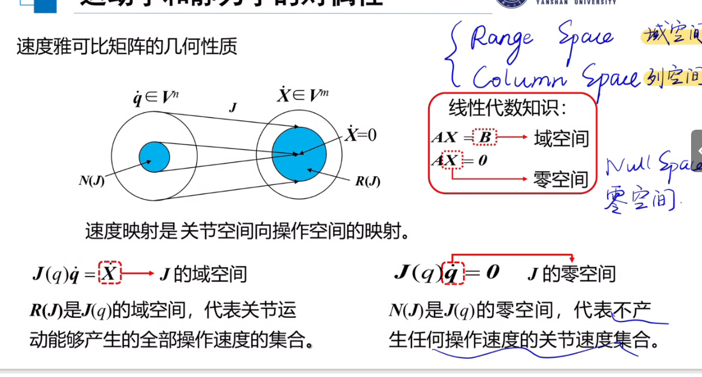

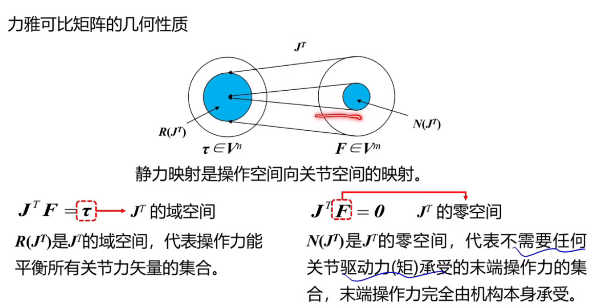

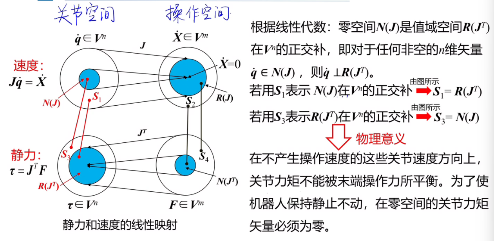

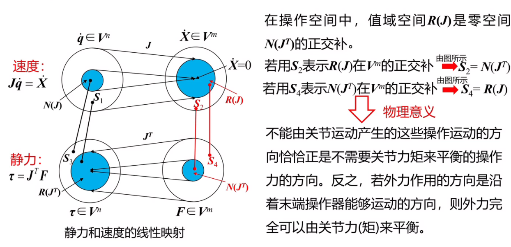


# 机械臂动力学


## 速度与静力

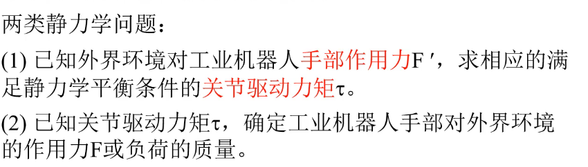

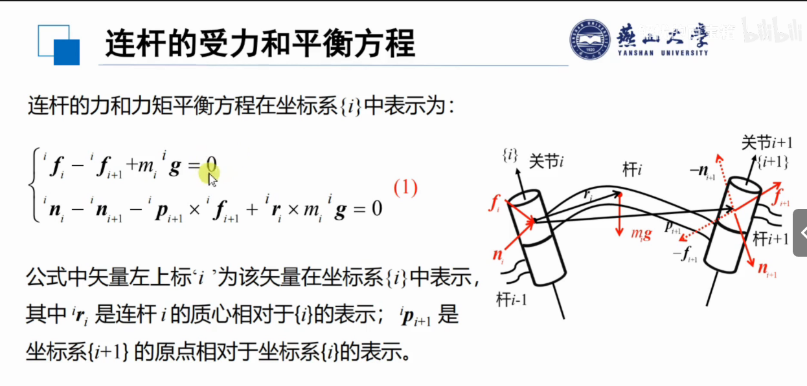

- 力平衡
- 力矩平衡

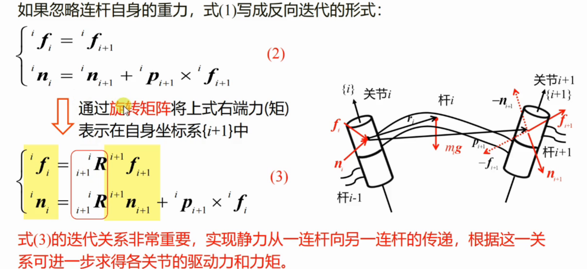


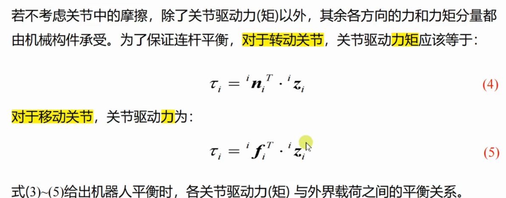

力传递矩阵恰为速度雅可比矩阵的转置
$$
\tau =J^T(q)F
$$


## 动力学


### 刚体转动的惯性

惯性：物体保持其原有运动状态不变的性质


- 刚体的转动惯量（定轴）：保持匀速转动

  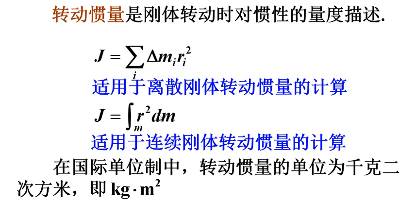

- 刚体的惯性张量（定点）

  

  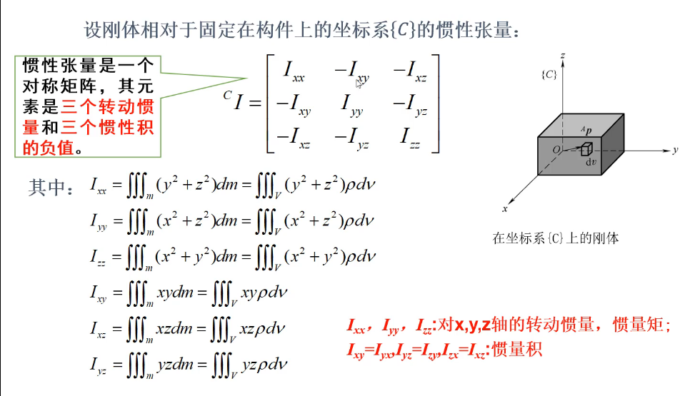

  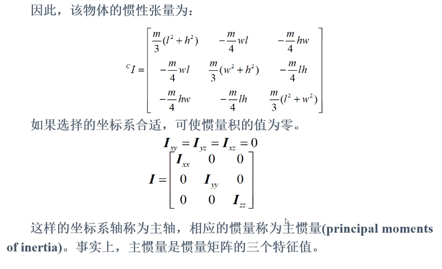

  主惯量和惯量积，平行轴定理


### 牛顿-欧拉方法

[机器人学之动力学笔记【9】—— 牛顿-欧拉 递推动力学方程_欧拉力矩平衡方程](https://blog.csdn.net/huangjunsheng123/article/details/110249073)

Newton-Euler方程

```
牛顿方程->面向平动->力
欧拉方程->面向转动->力矩
```

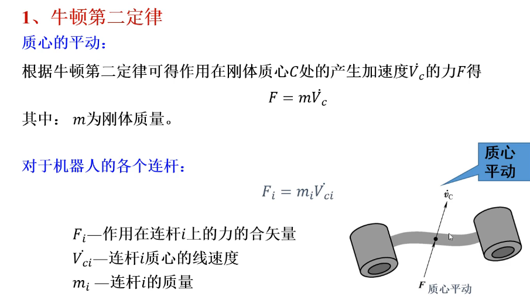

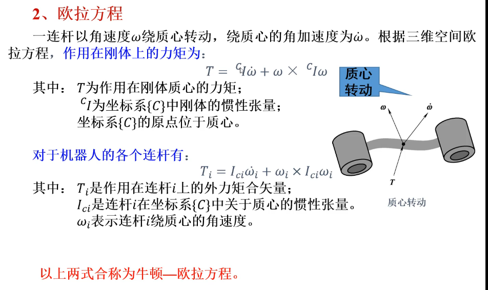

推导后的力矩由两项组成，第一项就是杆件的角加速度造成的，注意这里的 *I* 是对于建立在质心处的坐标系而言的，还有一部分就是由于系统的角速度造成的。

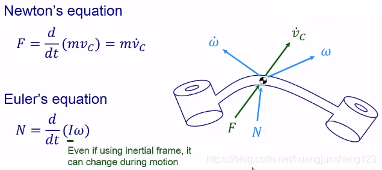

### 拉格朗日方程

- 拉格朗日函数$L$的定义是一个机械系统的动能$E_k$和势能$E_q$的差
  $$
  L=E_k-E_q
  $$


- 拉格朗日方程

  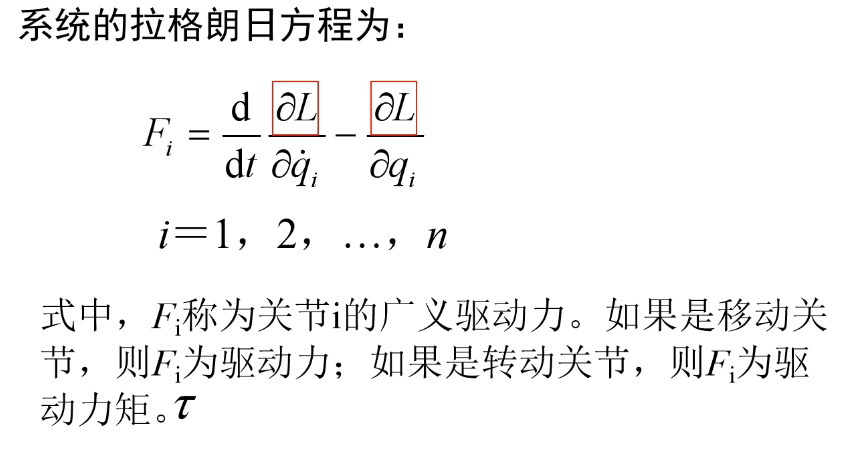

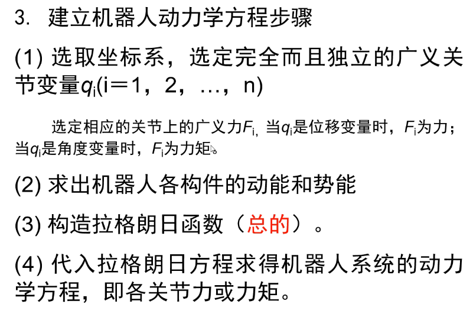

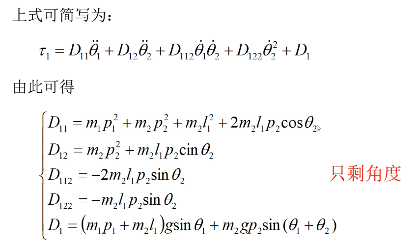

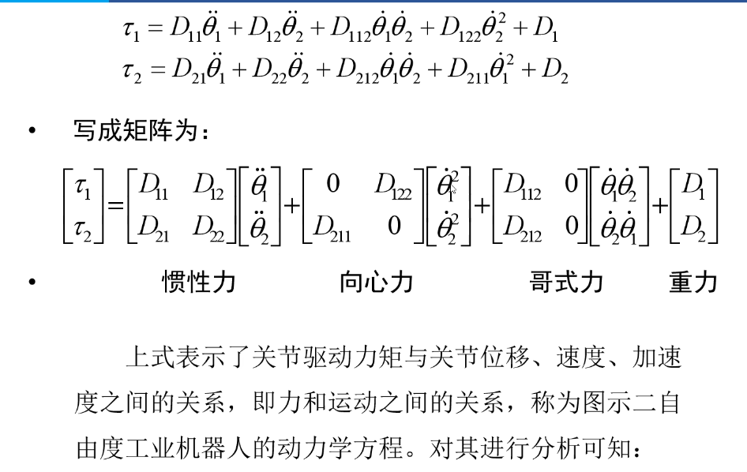

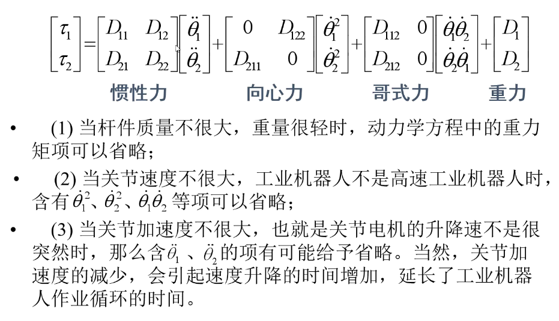

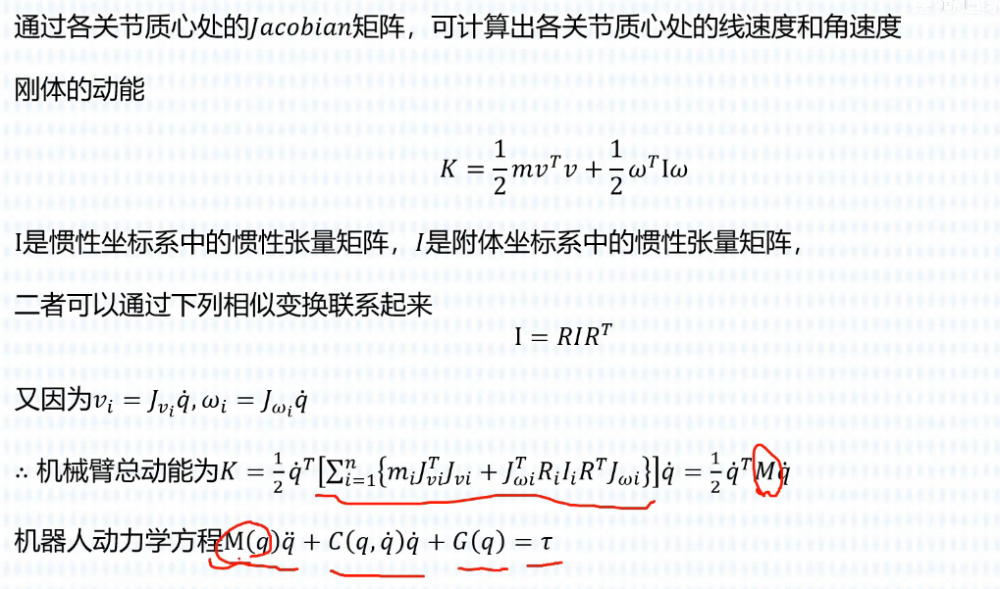

惯性张量矩阵$I$：


# 控制


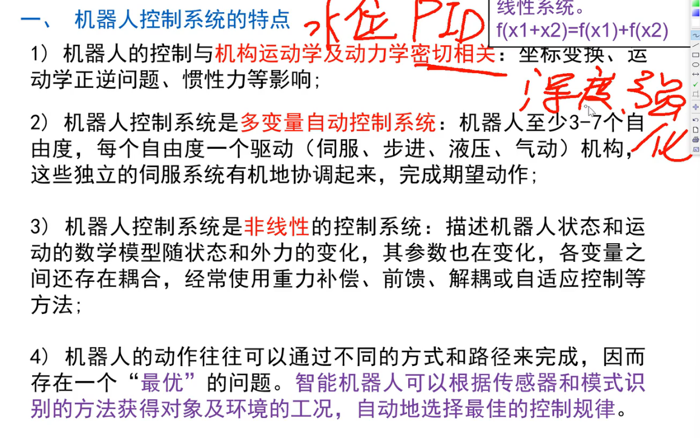

- PLC：PLC（Programmable Logic Controller）可编程逻辑控制器
- PC


## 力/位混合控制

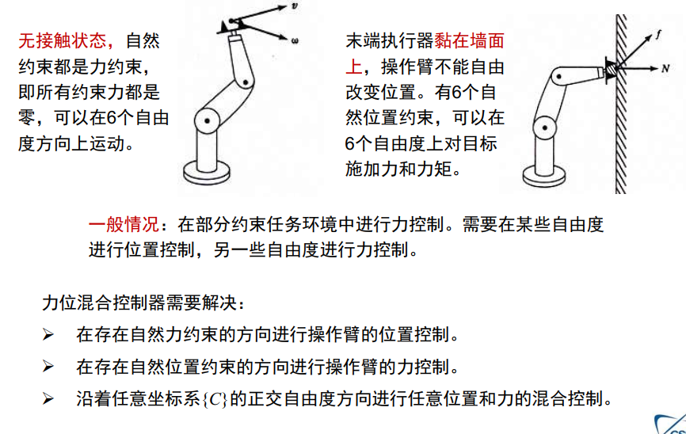


## 奇异点处理

[一篇文章讲透：机械臂的奇异点及其规避方法](https://zhuanlan.zhihu.com/p/620035856)

**在数学上，机械臂的奇异位姿意味着Jacobian矩阵不再满秩**。可以用Jacobian矩阵来判断机械臂是否处于奇异状态

- 腕关节奇异点
- 肘关节奇异点
- 肩关节奇异点

一种是在路径规划中尽可能避免机械臂经过奇异点，二是利用Jacobian矩阵的**伪逆**，保证奇异点附近**逆运动学算法**的稳定性


[【矩阵原理】伪逆矩阵（pseudo-inverse）](https://blog.csdn.net/Uglyduckling911/article/details/126853700)


# 构型

- SRS[针对关节限位优化的7自由度机械臂逆运动学解法 (tsinghuajournals.com)](http://jst.tsinghuajournals.com/CN/rhhtml/20201206.htm)


# TermProject

见E:/arm


# 期末

- [机器人建模与控制 2023-2024春 回忆卷 - CC98论坛](https://www.cc98.org/topic/5871439)


