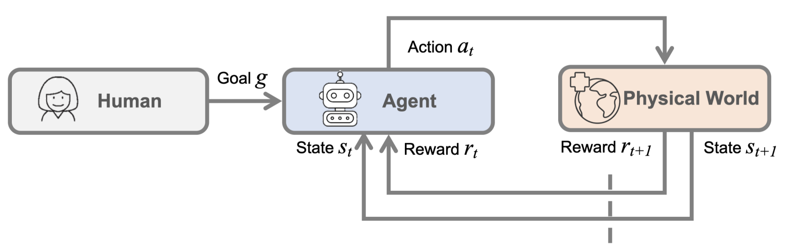
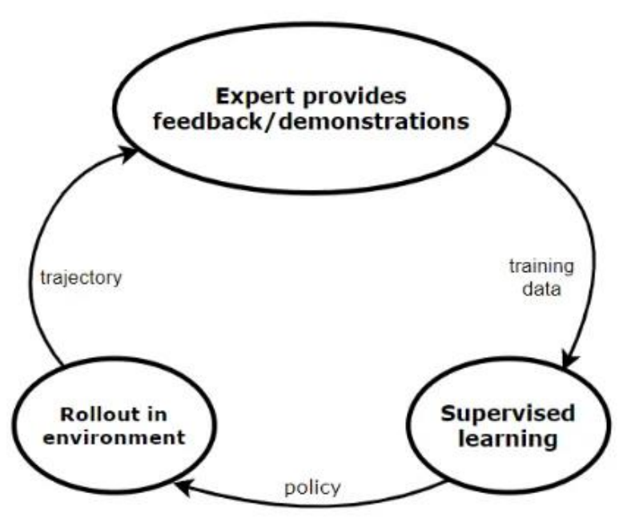
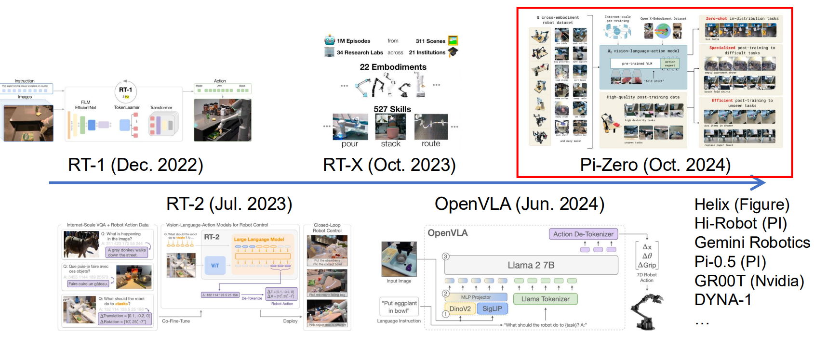

# Robot Learning

## Intro

Problems where an agent performs actions in the  environment, and receives  rewards.

- Goal: Learn how to take  actions that maximize reward

###  Problem formulation

## Robot perception

- what: get the info about the world and agent(as the state $S_t$)
- how: use different types of sensors

Robot Vision vs. Computer Vision

- Robot vision is embodied, active, and environmentally situated.

## Reinforcement learning

check [here](../../RL/02-Concepts.md)

- Model-Free RL
  - Cons
    - Require extensive interactions: Learns from trial and error
    - Safety concerns
    - Limited interpretability

- human: maintain an intuitive model of the world. Widely applicable

## Model learning & model-based planning

Here we refer to the physical world.

Learn a model of the world’s state transition function $P(s_{t+1}| s_t,a_t)$ and then use  planning through the model to make decisions.

- Key: GPU for parallel sampling / gradient descent

- Pixel Dynamics - Deep Visual Foresight
  - Takeaway: 让机器人直接在像素空间里“想象”未来画面会怎么变，再用这种视觉预测来做动作规划

> Conference on Robot Learning (CoRL) 2023 – Best Systems Paper Award

## Imitation learning

- Intro: Supervised learning from a demonstration dataset

下面介绍几种模仿学习的方法

- The basic form of imitation learning is Behavior Cloning (BC)

  - Takeaway: 把模仿学习当成一个普通监督学习问题

  - Pros: easy

  - Cons: covariate shift or compounding error

    - Sol: DAgger

      

- DAgger
  - Takeaway: 先用专家数据训练一个初始策略，让当前策略自己去跑，在它跑到的状态上，再请专家给正确动作标签，把这些新数据加进训练集，继续训练
- Inverse Reinforcement Learning (IRL）
  - Takeaway: 先从专家行为里推断一个隐藏的奖励函数，再用这个奖励函数去训练策略(学习专家为什么这么做)
  - Pros: 更有泛化能力
  - Cons: hard and complex

- GAIL: Generative Adversarial Imitation Learning
  - Takeaway: 把模仿学习和对抗学习结合
    - 一个**策略**负责生成行为
    - 一个**判别器**负责判断这个行为像不像专家

- Diffusion Policies

## Robotic foundation models

- Intro: aka Vision-Language-Action Models (VLAs), Large behavior models (LBMs)
  - What: A policy that maps (observation/state, goal) to action with no explicit representation of states / transition functions

## Remaining challenges

- Evaluation is primarily conducted in the real world -- different
  - costly, noisy and weak
  - Weak correlation between training loss and real-world success rate
- Current foundation models are not tailored for embodied agents
- Practical Considerations： delays / computing / modules

## References

- https://cs231n.stanford.edu/slides/2025/lecture_17.pdf

