# Main Takeaway

浙江大学控制科学与工程学院《智能移动技术》

课程安排

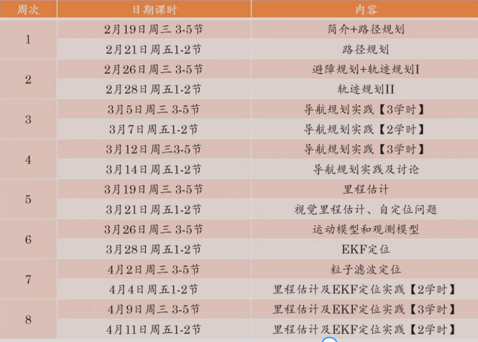

考核

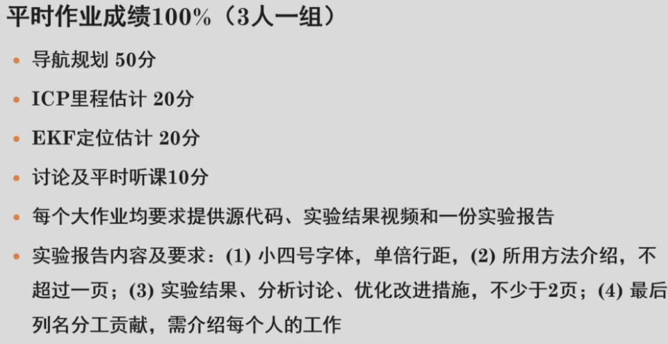

例程：https://github.com/AtsushiSakai/PythonRobotics.git

<!--more-->

# Lec 1 Intro

- 路径规划：根据所给定的地图和目标位置，规划一条使机器人到达目标位置的路径（只考虑工作空间的几何约束，不考虑机器人的运动学模型和约束）

  > 点路径点，将robot简化为一个点

- 避障规划：根据所得到的实时传感器测量信息，调整路径/轨迹以避免发生碰撞

  > 动态避障

- 轨迹生成：根据机器人的运动学模型和约束，寻找适当的控制命令，将可行路径转化为可行轨迹。

  > 最终可行轨迹


# Lec 2 路径规划

## 路径规划算法

| **维度**     | **位形空间（C-space configuration space）**                  | **工作空间（Workspace）**                               |
| ------------ | ------------------------------------------------------------ | ------------------------------------------------------- |
| **数学本质** | 所有可能的机器人**位形（Configuration）**的集合，构成n维流形 | 机器人末端执行器在**物理空间（如XYZ）**中可达的位置集合 |
| **描述对象** | 机器人全体构件的**完整状态**（如所有关节角度）               | 仅关注末端执行器的**位置和朝向**（部分状态）            |
| **示例**     | 平面2R机械臂的C-space是T2=S1×S1（圆环面）                    | 平面2R机械臂的工作空间是平面上的环形区域（可达点集合）  |


- 常见路径规划: 拓扑连通图+最优路径搜索(连续图难以保证时间)

  - 拓扑连通图

    - 基本思路: 对空间离散化

    - 分辨率完备

      解析性离散化，确保获得可行解

      - 行车图法：基于障碍物几何形状分解姿态空间

        基本思想：基于障碍物几何形状分解位形空间，将自由空间的连通性用一维曲线的网格表示，在加入起始点和目标点后，在该一维无向连通图中寻找一条无碰路径

        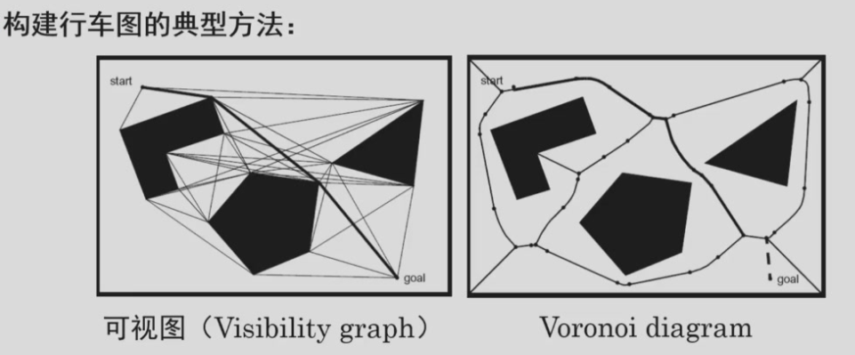

        - Voronoi diagram

          - 优点
            - 安全性高
          - 缺点
            - 计算复杂、路径长度较可视图法长、不适用于短距离定位传感器

        - 可视图法: 可视图由所有连接可见顶点对的边组成,可见指顶点之间无障碍物,初始位置和目标位置也作为顶点

          - 优点

            - 简单,可得路径长度上的最优解

          - 缺点

            - 所得路径靠近障碍物,不够安全

              > 以远大于机器人半径的尺寸膨胀障碍物，但容易造成可行路径的消失
              >
              > 在路径规划后修改所得路径，使其与障碍物保持一定的距离

      - 单元分解法：区分空闲单元和被占单元

        - 基本思想: 

          首先，将位形空间中的自由空间分为若干的小区域，每一个区域作为一个单元，以单元为顶点、以单元之间的相邻关系为边构成一张连通图；

          其次，在连通图中寻找包含初始姿态和目标姿态的单元，搜索连接初始单元和目标单元的路径；

          最后，根据所得路径的单元序列生成单元内部的路径

        - 精确单元分解: 严格基于环境几何形状分解,所得单元完全空闲

        - 近似单元分解: 栅格表示法，将环境分解成若干个大小相同的栅格

          四叉树表示法

      - 人工势场法：

        - 基本思想: 目标点对机器人产生吸引力,障碍物产生排斥力所有力合成构成机器人的控制率

          对势场求偏导，

        - 缺点: 存在局部最小,容易产生振荡和死锁

    - 概率完备: 基于概率随机采样离散化

      - PRM
      - RRT

## 路径搜索算法

- 广搜
- 深搜
- PRM：非全联通情况
- RRT

分辨率完备与概率完备方法比较 

- 空间离散采样：
  - 分辨率完备是基于解析计算的姿态空间分解
    - **原理**：通过数学解析对机器人的姿态空间进行系统性分解（类似将空间划分为网格）。
  - 概率完备是基于随机采样生成连通图或者树
- 位形空间连通性表示：
  - 分辨率完备完全表达了自由空间的连通性，高维情况下计算负担重
  - 概率完备方法是近似表达了连通性，但计算快速，只需要计算单个机器人姿态是否存在碰撞，其效率与碰撞检测模块效率相关


# Lec 3 避障规划

根据所得到的实时传感器测量信息，规划/调整路径/轨迹，以避免发生碰撞，也称为反应式避障


## Bug算法

- 基本思想：让机器人朝着目标前进，当行进路径上出现障碍物时，机器人绕着障碍物的轮廓移动，然后绕离它，继续驶向目标

| **算法**        | **关键改进**                                                 | **适用场景**                 |
| --------------- | ------------------------------------------------------------ | ---------------------------- |
| **BUG0**        | 基础版本，遇障即绕行，无优化策略。                           | 简单环境，快速实现           |
| **BUG1**        | 绕障时遍历整个障碍物，记录离目标最近的点，最终沿最短路径离开。 | 保证找到路径，但路径较长     |
| **BUG2**        | 沿m-line移动，绕行至再次与m-line相交时离开，减少绕行距离。   | 障碍物稀疏时效率更高         |
| **Tangent Bug** | 利用距离传感器预判障碍物轮廓，选择最优切点绕行，路径更平滑。 | 动态环境，支持实时传感器反馈 |

- BUG1 绕障时遍历整个障碍物，记录离目标最近的点（离开点），最终沿最短路径离开。绕行距离$L\leq d+\frac{3}{2}\sum p_i$

  > 如果离开点到目标的直线与当前障碍物相交，则不存在到达目标的路径

  优点：简单，可确保到达任何可达目标

  缺点：效率低

- BUG2 根据起始点和终止点定义路径L，机器人沿着L行走，当遇到障碍物时，机器人进入障碍物轮廓跟踪模式，当到达L上一个接近目标点的位置时，**如果该位置比碰到障碍物的位置更接近目标点**，则继续沿着L移向目标点，否则继续绕行

  如果机器人在跟踪模式下再次到达进入障碍物轮廓跟踪模式的点，则可以判断不存在到达目标点的路径

  优点：具有较短的移动路径

  缺点：采用贪婪搜索策略，某些请款修改移动低效

  


## 人工势场法


## 向量势直方图法

VFH

- 针对问题：势场法容易陷入局部最优，导致存在振荡、难以通过窄通道
- 基本思想：考虑到势场法仅用推斥势来表示障碍物，从而丢失了局部障碍物分布的详细信息，提出根据环境详细栅格地图构建机器人坐标系下障碍物**概率直方图**，根据概率直方图评估选择最优运动方向


| **优点**                     | **缺点**                               |
| ---------------------------- | -------------------------------------- |
| 实时性强，适合动态环境       | 路径可能非最优，尤其在复杂障碍群中     |
| 计算量低，适合嵌入式系统     | 依赖传感器精度，噪声数据易导致方向误判 |
| 无需全局地图，仅依赖局部感知 | 狭窄通道或密集障碍时可能无解           |

- 实现步骤

  1. 构建并维护机器人周围环境的局部栅格地图

     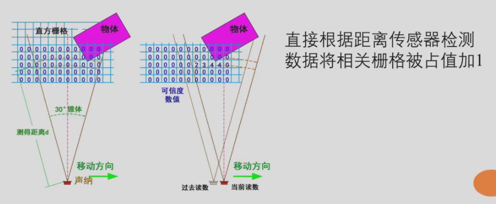

  2. 为每个栅格计算其障碍物向量，距离机器人越近向量越大

     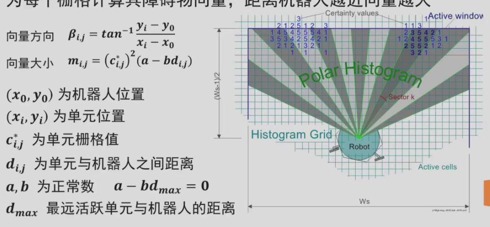

  3. 转换为极坐标下的障碍物概率直方图

     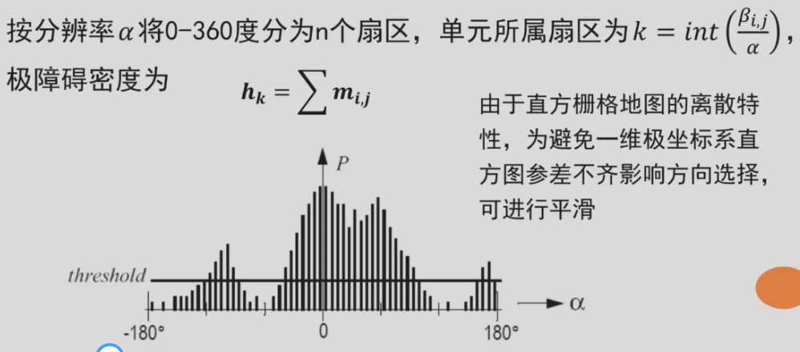

  4. 根据直方图，识别所有可以让机器人通过的通道，然后对每个通道计算成本，选择具有最低成本的通道，得到导航方向

     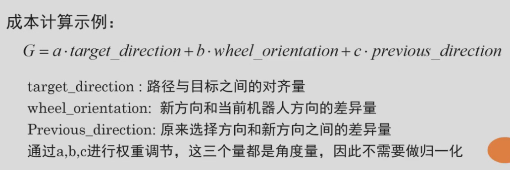

| **优点**                     | **缺点**                               |
| ---------------------------- | -------------------------------------- |
| 实时性强，适合动态环境       | 路径可能非最优，尤其在复杂障碍群中     |
| 计算量低，适合嵌入式系统     | 依赖传感器精度，噪声数据易导致方向误判 |
| 无需全局地图，仅依赖局部感知 | 狭窄通道或密集障碍时可能无解           |

## 动态窗口法

DWA dynamic window algorithm

- 基本思想：在速度空间中搜索适当的平移速度和旋转速度指令$(v，w)$

  从几何空间搜索转化为速度空间搜索

- 实现步骤

  1. 基于速度控制运动模型，构建可行的速度空间

  2. 考虑到机器人在运动过程中最大加速度的约束，在当前速度配置处以固定的小时间间隔开一个速度窗口空间

     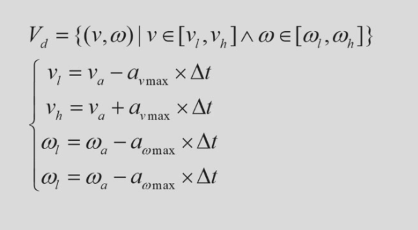

  3. 结合机器人速度约束，获得可行速度空间

     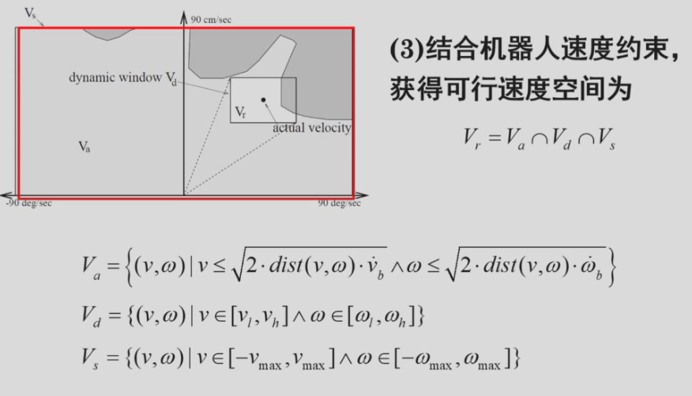

  4. 在可行速度空间中选择最优的速度控制指令

     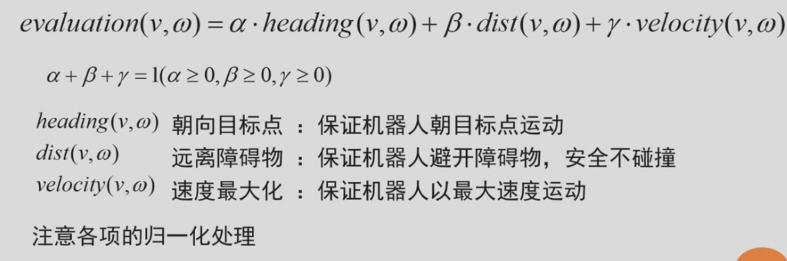

缺点：

- 根据单步信息数据计算期望速度，在评估选择速度时不考虑速度和路径平滑，容易导致机器人运动存在震动和轨迹扭动问题
- 参数较多，实际实现依赖工程经验，难以适应各种情况

| **算法**   | **DWA**              | **VFH**                | **TEB**              |
| ---------- | -------------------- | ---------------------- | -------------------- |
| **核心**   | 速度采样+轨迹评价    | 障碍密度直方图方向选择 | 时间弹性带优化轨迹   |
| **实时性** | 高（百毫秒级响应）   | 中（需构建直方图）     | 低（非线性优化耗时） |
| **适用性** | 动态障碍、低算力设备 | 狭窄通道、局部避障     | 高精度轨迹跟踪       |


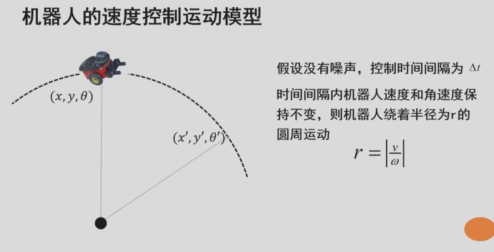


# Lec 4 轨迹规划

目标：给定路径与约束，生成一组控制序列，使机器人从初始位姿移动到目标位姿

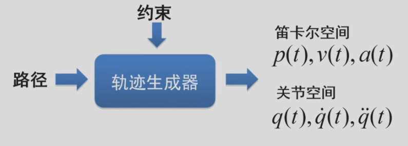

根据约束和最优目标，求取函数参数。需考虑的约束：

- 路径约束
- 运动学约束
- 边界约束
- 连续性/光滑性要求

## 一维轨迹规划

- 多项式
- 三角函数
- 指数函数


复合一维轨迹规划

- 多个基本一维轨迹合成
- 可降低多项式阶次
- 可满足机器人执行能力的约束
- 可利用最大化速度或加速度等来实现时间最优

常用复合轨迹（具体计算和运用看PPT）

- 抛物线轨迹：2个二阶多项式合成　加速度恒定，可满足初末位置和初末速度约束

- 梯形速度轨迹：2个二阶多项式和1个一阶多项式合成

  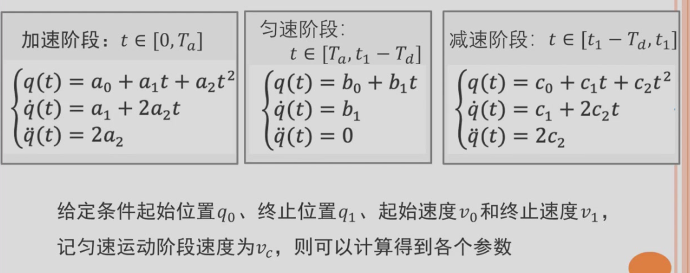

- 双S速度轨迹


## 二维轨迹规划

在平面上移动时，机器人有三个状态量 $(x, y, \theta)$

**轨迹规划**：
- 理论上：三维轨迹规划 $(x(t), y(t), \theta(t))$
- 实际上：二维轨迹规划 
  - $(x(t), y(t))$ 或 
  - $(v(t), \omega(t))$（线速度与角速度）

**角度计算**：
$$
\theta(t) = \arctan\left( \frac{\dot{y}(t)}{\dot{x}(t)} \right) = \arctan\left( \frac{y(t+\Delta t) - y(t)}{x(t+\Delta t) - x(t)} \right)
$$

**运动学方程**：
$$
\begin{cases}
\dot{\theta}(t) = \omega(t) \\
\dot{x}(t) = v(t)\cos\theta(t) \\
\dot{y}(t) = v(t)\sin\theta(t)
\end{cases}
$$
$(x(t),y(t))$

- 完整机器人(可全向移动): x,y独立规划,时间同步即可
- 非完整机器人,图形搜索法

$(v(t),w(t))$

- 参数优化法
- 反馈控制法


### 图形搜索法

- 主要思路：根据路径搜索经过或者近似经过路径点且满足运动学约束的图形曲线

  采用运动基元

  缺点：

  - 如何构建单词和搜索最佳单词
  - 运动基元方式实际是对状态空间和/或控制空间进行了离散化，直接导致空间分辨率降低，能达到的边界状态只是预定义单词能够达到的状态

- Dubins曲线[Dubins曲线详细笔记](https://zhuanlan.zhihu.com/p/414753861)

  - 将v约束喂取值$\{0,1\}$

  - 具有最小转弯半径$\rho_{ min}$的前向运动车辆在两个路径点之间的最短路径可以完全由不超过三个的运动基元组成
    运动基元为半径为$\rho_{ min}$向左或者向右转弯的圆弧、或者为直线，分别用L，R，S表示

    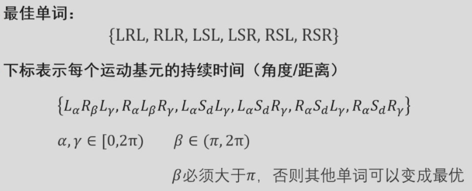

  - 选什么单词，下标取什么值？——遍历评估

- REEDS-SHEPP曲线[自动驾驶运动规划-Reeds Shepp曲线](https://zhuanlan.zhihu.com/p/122544884)

  - 比Dubins曲线多了允许向后运动，运动基元有$L,R,S,|$

    可用48个不同的单词来描述最短路径

- Balkcom-Mason曲线


### 参数优化法

- 基本思想：对移动机器人参考点的速度控制率进行参数化表示


- 离散的最优控制，只需要满足起始和末端的状态，$x(t)=x(t-1)+\Delta T\times constraint$，然后丢到求解器求解即可

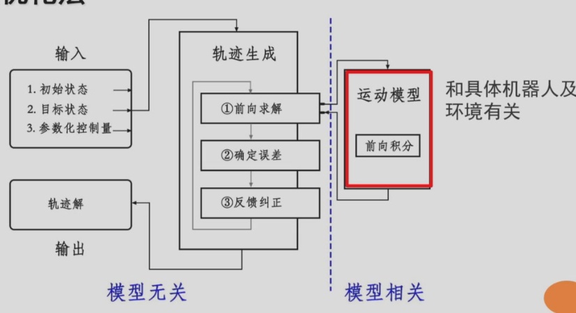

- 实际应用时，通常预先构造初始猜测查找表，或构建神经网络，简历边界约束与控制率参数之间的映射关系


### 反馈控制法

- 基本思想：根据当前状态与目标状态之间的差异，来生成减少这种差异的控制律

- 使用极坐标，建立机器人的运动模型，直接根据状态空间方程来设计控制器即可

- 缺点：
  - 不考虑当前速度，容易造成速度不连续
  - 平移速度、转向速度相互独立，但机器人总能力是有限的，且平移速度和转向速度存在关联


# Lec 5 里程估计

目录

- 基于机器人运动感知信息，结合运动学模型
  - 电机码盘（轮式里程计）
  - IMU（惯性单元，加速度计+陀螺仪）（惯性里程计） 
- 基于环境感知传感器信息，通过最佳匹配估计
  - 激光里程计（LO）
  - 视觉里程计（VO）


## 基于运动感知的里程估计

- 电机码盘（轮式里程计）

  误差来自很多方面，且有累积误差

- IMU（惯性单元，加速度计+陀螺仪+磁力计）（惯性里程计） 

  - 优缺点：

    | 优点         | 缺点                                                         |
    | ------------ | ------------------------------------------------------------ |
    | 采样频率高   | 易受磁场和外力加速度影响                                     |
    | 全天候       | 随着时间的增长累积误差较大，无法满足移动机器人长距离精确定位的要求，需要融合其它传感器进行组合导航 |
    | 短时精度较好 |                                                              |


## 激光里程计

下面先介绍一下**ICP算法**

### ICP理论推导

- ICP(Iterative Closest Point)
  - 估计P集合点与P集合点的初始位姿关系
  - 根据最近邻域规则建立P集合点与P集合点的关联
  - 利用线性代数/非线性优化的方式估计旋转平移量
  - 对点集合P的点进行旋转平移
  - 如果旋转平移后重新关联的均方差小于阈值，则结束

ICP有point to point,line to line,point to plane等，我们主要介绍一下**point-point ICP**

#### 点到点的ICP

**输入**：

- 源点云 $  P = \{p_i\}_{i=1}^n  $，目标点云 $  Q = \{q_i\}_{i=1}^m  $
- 初始变换 $  R_0 = I  $，$  t_0 = 0  $
- 最大迭代次数 $  K  $，收敛阈值 $  \epsilon  $

**目标**：

- 计算两组数据之间的旋转平移量$R,t$，使得两组数据形成最佳匹配，即两组数据的距离误差最小

**推导**：

构建成最小二乘问题，求使得误差平方和达到最小的R，t
$$
\min \frac{1}{2}\sum_{i=0}^{n}||q_i-(Rp_i+t)||^2
$$
**迭代过程**（第 $  k  $ 次迭代）：
1. **最近点匹配**：
   对每个 $  p_i \in P  $，在 $  Q  $ 中寻找最近点 $  q_j  $：

$$
q_j = \arg\min_{q \in Q} \| R_{k-1} p_i + t_{k-1} - q \|
$$


2. **计算变换参数**（SVD方法）：
   
   - 计算质心：
     $$
     \mu_p = \frac{1}{n} \sum_{i=1}^n p_i, \quad \mu_q = \frac{1}{n} \sum_{i=1}^n q_j
     $$
   
   - 去中心化点云：
     $$
     p_i' = p_i - \mu_p, \quad q_j' = q_j - \mu_q
     $$
   
     $$
     \frac{1}{2}\sum_{i=0}^{n}||q_i-(Rp_i+t_i)||^2 = \frac{1}{2} \sum_{i=1}^n \left( \| q_i' - R p_i' \|^2 + \| \mu_q - R \mu_p - t \|^2 \right)
     $$
   
     左边只与旋转矩阵R相关，右边只与质心相关，因此两边分别求解
   
     - 令第二项为零，直接得最优平移：
   
     $$
       t = \mu_q - R \mu_p
     $$
     
     - 旋转项优化：仅需最小化第一项：
     
     $$
     \min_R \sum_{i=1}^n \| q_i' - R p_i' \|^2=\sum(q_i'^Tq_i'+p_i'^TR^TRp_i'-2q_i'^TRp_i')
     $$
     
     因为$R^TR=I$因此前面两项均与R无关，所以只需要
     $$
     \max\sum q_i'^TRp_i'=\sum tr(q_i'^TRp_i')=tr(R\sum p_i'q_i'^T)
     $$
     
   - 构造协方差矩阵：
     $$
     H = \sum_{i=1}^n p_i' q_j'^T
     $$
     对H进行SVD分解：
     $$
     H = U \Sigma V^T
     $$
     目标函数上界
     $$
     tr(RU \Sigma V^T ) = tr(\Sigma V^TRU)\sim tr(\Sigma M)
     $$
   
     $$
     M=\begin{bmatrix}
     m_1^T\\
     m_2^T\\
     m_3^T
     \end{bmatrix},M是模为1的向量，因此m_i\le t1
     $$
   
     $$
     tr(\Sigma V^TRU) = \sigma_1 m_{11}+\sigma_2 m_{22}+\sigma_3 m_{33} \le \sigma_1+\sigma_2+\sigma_3
     $$
   
     当等号成立时有$H = U \Sigma V^T=I$
     $$
     \Rightarrow \quad R = V U^T
     $$
     
   - 计算平移向量：
     $$
     t = \mu_q - R \mu_p
     $$
   


3. **更新点云**：

$$
   P \leftarrow R \cdot P + t
 
$$


4. **判断收敛**

$$
\text{若 } \|R_k - R_{k-1}\| < \epsilon \text{ 且 } \|t_k - t_{k-1}\| < \epsilon \text{，则终止迭代。}
$$


| **优点**                      | **缺点**             |
| ----------------------------- | -------------------- |
| 闭式解，无需迭代初值          | 依赖精确的最近邻匹配 |
| 计算高效（复杂度 $  O(n)  $） | 对噪声和异常点敏感   |
| 理论收敛性保证                | 可能陷入局部最优     |

#### 点到面的ICP

##### 算法核心思想

- **核心目标**：通过最小化源点云到目标点云**局部切平面**的正交距离，求解最优刚体变换（旋转矩阵$R$和平移向量$t$）
- **优势**：相比点到点ICP，更充分利用曲面几何信息，提升收敛速度和鲁棒性

数学形式化

- 平面表示：目标点$q_i$所在平面由法向量$n_i\in R^3$和平面方程$n_i^T x+d_i=0$定义

  法向量的计算：PCA方法／最小特征值对应的特征向量即为法向量$n_i$

对每个源点$p_i$和目标点$q_i$（及其法向量$n_i$），最小化：

$$
\min_{R,t} \sum_{i=1}^N \left( \mathbf{n}_i^T (R\mathbf{p}_i + \mathbf{t} - \mathbf{q}_i) \right)^2
$$
##### 推导

**线性近似推导**

假设旋转量$\omega$为微小量，则：

$$
R \approx I + [\omega]_\times, \quad [\omega]_\times = \begin{bmatrix}
0 & -\omega_z & \omega_y \\
\omega_z & 0 & -\omega_x \\
-\omega_y & \omega_x & 0 
\end{bmatrix}
$$

误差项线性化为：

$$
e_i = \mathbf{n}_i^T (\mathbf{p}_i + \omega \times \mathbf{p}_i + \mathbf{t} - \mathbf{q}_i)
$$
构建关于参数$\mathbf{x} = [\omega_x, \omega_y, \omega_z, t_x, t_y, t_z]^T$的雅可比矩阵：

$$
\mathbf{J}_i = \frac{\partial e_i}{\partial \mathbf{x}} = \left[ -\mathbf{n}_i^T [\mathbf{p}_i]_\times \quad \mathbf{n}_i^T \right]
$$
##### 算法步骤

```python
def point_to_plane_icp(source, target, max_iters=100, tol=1e-6):
    # 初始化变换矩阵
    T = np.eye(4)
    prev_error = float('inf')
  
    for iter in range(max_iters):
        # 1. 最近邻搜索与法向量匹配
        corr_points, corr_normals = find_correspondences(source, target)
      
        # 2. 构建线性系统
        A = []
        b = []
        for p, q, n in zip(source, corr_points, corr_normals):
            # 计算残差
            e = np.dot(n, p - q)
            # 构造雅可比行
            J = [-np.dot(n, skew(p)), n]
            A.append(J)
            b.append(-e)
      
        # 3. 求解最小二乘问题
        delta = np.linalg.lstsq(A, b, rcond=None)[0]
      
        # 4. 更新位姿
        T_current = se3_exp(delta)
        T = T_current @ T
      
        # 5. 收敛判断
        current_error = np.linalg.norm(b)
        if abs(prev_error - current_error) < tol:
            break
        prev_error = current_error
  
    return T
```

##### 优缺点

- 优点
  - 对噪声和离群点鲁棒性强
  - 收敛速度快（通常比点到点快5-10倍）
  - 适合光滑表面配准
- 缺点
  - 需计算法向量（增加预处理时间）
  - 对法向量估计误差敏感

##### 加速策略

| 策略     | 描述                 | 效果                            |
| -------- | -------------------- | ------------------------------- |
| KD-Tree  | 快速最近邻搜索       | 复杂度从$O(N^2)$降到$O(N\log⁡N)$ |
| 多分辨率 | 分层配准（从粗到精） | 提速3-5倍                       |
| 并行计算 | GPU加速矩阵运算      | 实时性能                        |


### ICP相关问题

1. **ICP计算效率主要受什么影响？**

   - **点云规模**：点数量越多，最近邻搜索（如k-d树）耗时增加，复杂度约O(n log n)。

   - **初始估计质量**：初值偏离真实值会导致更多迭代次数。

   - **数据预处理**：降采样、去噪等步骤影响处理速度。

   - **优化方法**：SVD分解效率高，但点对面ICP可能需额外计算法线。

   - **硬件限制**：移动端计算资源有限，需优化算法（如使用GPU加速）。

2. **ICP迭代寻优存在的问题**

   - **局部最优**：非凸优化易陷入局部解，依赖初值。

   - **噪声敏感**：异常点或噪声导致误差函数不稳定。

   - **动态干扰**：移动物体引入错误对应，需额外处理。

   - **收敛速度慢**：重叠区域小或结构模糊时迭代次数多。

3. **移动机器人获取ICP初值的方法**

   - **里程计/IMU**：轮式编码器或IMU积分提供相对位姿。

   - **传感器融合**：融合激光SLAM、视觉里程计或GPS（户外）估计初始变换。

   - **运动模型预测**：假设匀速运动，用上一帧运动推测当前位姿。

4. **手机端获取ICP初值的方法**

   - **VIO（视觉惯性里程计）**：ARKit/ARCore融合摄像头和IMU数据。

   - **特征匹配**：提取ORB/SIFT特征计算粗略位姿。

   - **IMU数据**：陀螺仪提供旋转初值，加速度计辅助平移估计。

   - **快速运动估计**：光流或稀疏配准（如PnP）获取初值。

5. **ICP的隐含假设及解决方法**

- **假设**：静态环境、正确点对应、足够重叠、良好初值。
- 解决方法：
  - **鲁棒优化**：使用Trimmed ICP或Huber损失减少异常点影响。
  - **全局配准**：4PCS/Super4PCS提供无初值配准。
  - **动态处理**：语义分割剔除动态物体（如行人）。
  - **改进搜索**：结合法线（点对面）或特征描述子（FPFH）提升对应准确性。

## 视觉里程计

visual odometry(VO)

VO问题定义：检测由运动所导致的图像变化来估计两帧数据之间的位姿变化量

VO存在的问题：

- 应用对环境有多方面要求
  - 环境光照足够
  - 场景包含足够纹理
  - 相邻帧之间有足够的重叠内容
  - 场景静态
- 可以避免里程估计受地面不平整的影响，但噪声和错误匹配仍会影响里程估计的准确性，并会被不断叠加


### 基于图像的VO

- 利用两幅图像中所有像素的亮度信息
- 计算量大、精确度低


### 基于特征的VO

- 从图像中提取醒目的可重复的特征
- 要求两帧之间鲁棒匹配或者跟踪特征

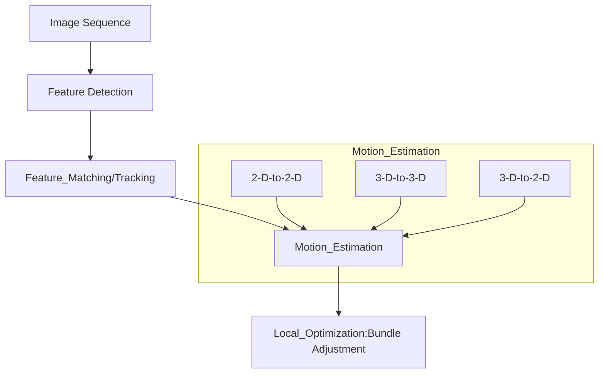

1. feature detection

   - 关键子+描述子

   - 焦点特征corner：ORB, Haris, Shi-Tomasi, FAST

     - ORB：

       关键点：oriented fast，使用局部像素灰度变化明显的像，以像素点为中心一定半径的圆上，有连续N个点与像素灰度值差大于阈值

       描述子：BRIEF描述子

   - 圆块特征blob: SIFT, SURF, CENSURE

2. feature match

   - 暴力搜索

   - 增加匹配约束条件

     - 区域约束：根据运动预测（特征跟踪）

       要求特征需要具备三维空间位置

       适用于运动偏移量和图像变化较小的情况

       如果要对一段长的图像序列采用跟踪策略，要对每一个特征建立仿射变形模型

     - 利用立体视觉极线约束：在第二帧图像的极限附近搜索

       适用于运动模型一致，但特征非三维

       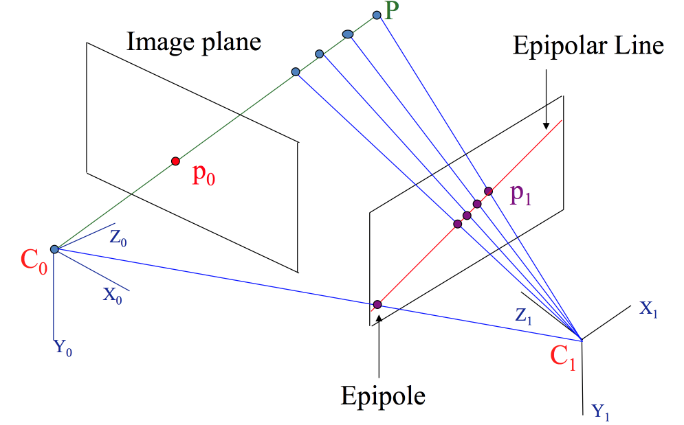

3. 基于特征匹配的运动估计

   - 单目相机

     仅有2D像素坐标，根据两组2D点估计运动2D-t0-2D

     采用对极几何方法——八点法：8个匹配点来估计得到本质矩阵E，然后SVD分解E得到R,t有四种可能性，需要把一个点代入到四种解中，检测该点在两个相机下的深度，来确定哪个是正确解

     当匹配点对多于8时，考虑匹配错误，采用RANSAC方法进行优化

   - 双目/RGBD相机

     有距离信息，根据两组3D点估计运动3D-to-3D

     常用ICP方法

   - 有三维点及其在相机的投影位置

     3D-to-2D：**PnP方法**

4. 局部优化

   针对问题：

   - 特征点对位姿估计存在误差·特征点对存在错误匹配
   - 帧与帧之间的误差不断累积

   解决方法：光束平移法（BundleAdjustment）

   对场景中任意三维点 X，由从每个视图所对应的摄像机的光心发射出来并经过图像中 X 对应的像素后的光线，都将交于 X这一点， 即对于三维点形成多个光束 (bundle)  

   实际应用中由于噪声等存在， 多条光线几乎不可能汇聚与一点，因此在求解过程中，需要不断对待求信息进行调整(adjustment)  ——融合多帧信息，建立匹配特征点光束约束，通过非线性最优化求解


### PnP

详细介绍一下PnP（perspective-n-point）方法：它描述了当知道n个3D空间点及其位置，如何估计相机的位姿。如果两张图像中的一张特征点3D位置已知，那么至少需要3个点对(以及至少一个额外验证点验证结果)就可以计算相机的运动。

其数学本质是求解投影方程：
$$
s_i\begin{bmatrix}
u_i\\
v_i\\
1
\end{bmatrix} = K(RP_i^W+t)
$$
其中$s_i$为深度，$(u_i,v_i)$为像素坐标

- 核心思想：通过**几何约束**或**优化方法**建立3D-2D点对的投影关系，求解相机外参R和t
- 主要方法有：[PnP(Perspective-n-Point)问题：各种算法总结分析 - 知乎 (zhihu.com)](https://zhuanlan.zhihu.com/p/399140251)
  - 采用6个点对的直接线性变换DLT方法
  - 采用3个点对的P3P
  - 优化后的EPnP、PnP、UPnP
  - Bundle Adjustment（构建成最小二乘问题迭代求解）

| **算法**              | **优点**                  | **缺点**               | **改进方向**          |
| --------------------- | ------------------------- | ---------------------- | --------------------- |
| **DLT**               | 简单通用，无需初始值      | 需至少6点，对噪声敏感  | 结合RANSAC剔除离群点  |
| **P3P**               | 仅需3个点，效率高         | 存在多解，需额外验证点 | 引入第4点验证或RANSAC |
| **EPnP**              | 复杂度 O(n)，适合多点场景 | 依赖控制点选取稳定性   | 自适应控制点选择      |
| **Bundle Adjustment** | 精度高，全局最优          | 计算量大，需初始值     | 结合EPnP提供初值      |

> 实际应用中常采用**EPnP+BA优化**的组合：EPnP快速提供初值，BA进一步优化至最优解。

## 多信息融合里程估计

- 单一传感器由于自身特征，在特定情景或使用方式下存在缺陷：
  - 轮式里程计：地面不平、轮子打滑等情况下位姿推算不准
  - IMU：长期位姿估计存在累积误差
  - 激光：空旷环境、狭长走廊等环境中无法准确估计位姿
  - 相机：弱纹理环境、图像过曝或过暗时无法估计位姿，单目尺度问题等
- 融合多传感器的信息以提高里程估计的性能
- 主要方法：EKF、MSCKF等


### math fundamental

- 概率理论

  贝叶斯规则：
  $$
  p(X|Y)=\frac{P(Y|X)p(X)}{p(Y)},p(Y)=\sum p(Y|X)p(X)\\
  p(X|Y)=\eta P(Y|X)p(X)\\
  posterior \propto likelihood \times prior(后验正比于似然\times先验)
  $$
  最大后验估计MAP：对一个状态进行最优估计
  $$
  x^*_{MAP}=\arg\max P(x|z) = \arg\max P(z|x)P(x)
  $$
  极大似然估计MLE：没有先验，在什么样的状态下最可能产生现在观测到的数据
  $$
  z^*_{MLE}=\arg\max P(x|z)
  $$


# Lec 6 定位问题及模型

定位方法：

1. 基于外部设备感知的定位

2. 基于历程估计的航位推算

3. 基于本体观测的定位估计（需要地图）

   > 2+3为运动与观测融合的自定位


## 地图表示形式

- 点云地图（point cloud）：

  - 基本思想：由空间中障碍物边缘点集合构成
    $$
    Point~Cloud = a ~cloud~of~n~points\\
    M=\{p_1.p_2...p_n\}
    $$

  - 常用传感器

    - 激光测距
    - RGBD传感器：数据具有稠密特性
    - 摄像头：需对图像进行处理，直接双目匹配恢复匹配点视深，形成视觉像素点云，或者提取特征后估计特征空间位置，形成视觉特征点云，具有稀疏特性

  - 多信息点云地图：空间坐标+颜色纹理（激光测距+RGBD）；法向量、梯度等信息（相邻点计算）

    有助于点云的分割分类

    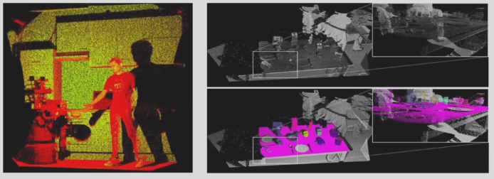

  - 优点：

    - 完全表示环境三维信息
    - 所构建地图不需要预先定义尺寸
    - 可方便地利用ICP等匹配方法进行里程估计和定位

  - 缺点：
    - 存储要求高
    - 环境描述层次低

- 栅格地图（Occupied Grid Map）：占用栅格地图

  - 基本思想：将环境分解成一系列离散栅格，每个栅格有一个值，表示该栅格被障碍物占用的情况
    $$
    M=\{m_1,m_2,...m_n\}\\
    m_i:地图中第i个栅格被占可能性，取值p(m_i=1)=(0,1)
    $$

  - 常用激光测距数据来构建

  - 优点：

    - 一种几何度量地图，可以详细描述环境信息
    - 方便进行路径规划

  - 缺点：

    - 由于地图存储空间由所需建图的环境范围和栅格的分辨率确定，因此随着栅格数量的增加和环境的扩大，地图所需内存和维护时间也迅速增长，地图维度的增加更会随着环境的扩大造成空间需求呈指数级增长

  - 降低存储空间的方法：采用四叉树/八叉树表示

    通过分辨率可变来减少存储空间需求

    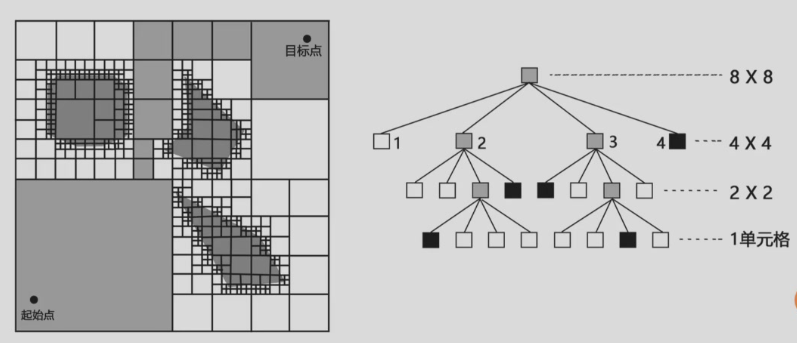

    通过限制查询深度，可随时获得同一地图的多个分辨率

    随着观测的获取增量式更新观测区域的地图，从而不需要预先定义地图的大小，避免了未知区域占用存储空间

  - 高度栅格地图（elevation map）：2.5维占用栅格地图

    实现不平整地面上的高效导航规划，采用二维栅格地图表示方法，在每个栅格中存储该栅格内障碍物的高度信息，通过高斯分布来表示高度估计和不确定性

    > 二维不能满足要求，三维计算和存储要求高

- 特征地图

  - 基本思想：以抽象的特征描述环境，通常采用拟合障碍物的陆标、线段、平面、多边形等结构性几何特征，通过一组参数对特征进行建模

    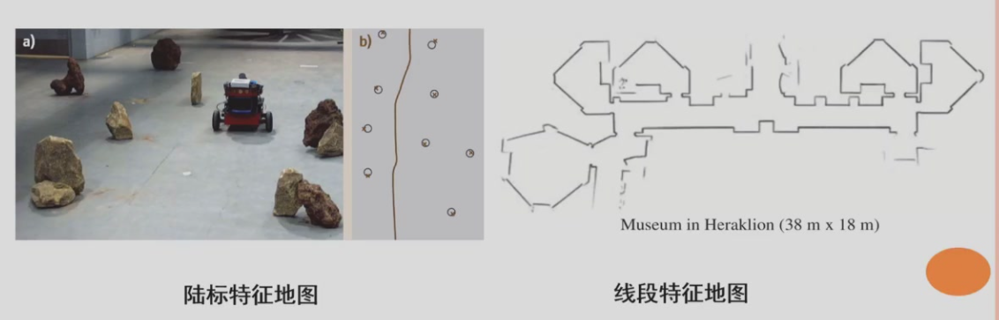

  - 优点：

    - 简洁、紧凑、内存占用量小
    - 表示方式更接近人对环境的感知
    - 对环境具有更高层次的描述性，使定位与建图的鲁棒性更强

  - 缺点：

    - 无法精确表征复杂的真实环境
    - 不能表示环境被占用/空闲/未知情况，不能直接用于导航规划

- 拓扑地图（topological map）

  - 基本思想：把环境表示为带结点和相关连接线的拓扑结构图，结点表示环境中的重要位置点，边表示结点间的连接关系
  - 优点：
    - 易于扩展，可实现快速路径规划
  - 缺点：
    - 由于信息的抽象性，使得机器人难以实现精确可靠的自定位

- 混合地图表示/多层地图表示

- 语义地图：语义地图是除了环境的空间信息之外还包含已知类别的实体特征的地图。这些实体的信息独立于地图内容，可用于一些特定知识背景中的推理

  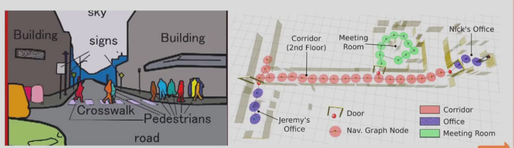


## 基于本体观测的定位估计

- 基本思想：利用本体传感器获得的环境观测信息与地图中存储的各个位置上的信息进行匹配，实现位置/位姿识别，也成为地点识别

下面为具体方法：

- 基于人工定义独特标识的定位

  环境中部署特殊标签（地面二维码），降低成本，确保可靠性

- 多个非独特标识感知融合定位

  在环境中部署一定标识，标识之间不具备独特性，利用3个以上标识感知信息进行定位估计——例如安装在某一高度的激光反射板

  定位原理：计算在每个位置上得到观测的可能性

  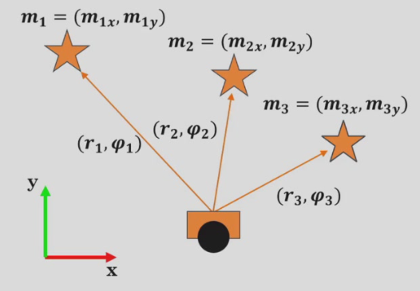

- 激光/视觉感知信息匹配定位

  re-localization


## 运动和观测信息融合的自定位

- 简单方法：有观测时根据观测匹配定位，无观测时根据里程估计进行航位推算
- 存在问题：
  - 观测存在不确定性，里程估计也存在不确定性，如何融合
  - 观测到多个特征时，每个特征观测都存在不确定性，如何融合估计
- 解决方案：
  - 在概率架构下对不确定性进行描述（称为置信度）和融合
  - 用方差表示置信度，方差小表示置信度高
  - 控制感知信息融合的自定位就是利用里程估计和观测信息**估计方差最小下的机器人位姿**

下面我们介绍一种非常重要的定位算法：

Markov Localization马尔可夫定位：

- 定义：最优化估计方差，使其最小（贝叶斯估计器是一种最小方差估计器）

- 问题概率描述：

  记地图为$  m  $，
  $  t  $时刻机器人位姿为$  x_t = (x_t, y_t, \theta_t)^T  $，观测信息为$  z_t  $，控制信息为$  u_t  $
  
  $$
  X^t = \{x_0, x_1, ..., x_t\} \quad Z^t = \{z_0, z_1, ..., z_t\} \quad U^{t-1} = \{u_0, u_1, ..., u_{t-1}\}
  $$
  
  求
  
  $$
  \hat{X}^t \triangleq E[X^t | Z^t, U^{t-1}, m]
  $$
  
  
  $$
  E[X^t | Z^t, U^{t-1}, m] = \int p(X^t | Z^t, U^{t-1}, m) X^t \, dX^t
  $$
  
  下面给出递推过程：
  
  构建递推算式
  
  
  $$
  p(X^t | Z^t, U^{t-1}, m) = p(X^{t-1}, x_t | Z^t, U^{t-1}, m)
  $$
  
  根据乘法规则 $  p(X, Y) = p(Y | X) p(X)  $有
  
  
  $$
  p(X^t | Z^t, U^{t-1}, m) = p(x_t | X^{t-1}, Z^t, U^{t-1}, m) p(X^{t-1} | Z^t, U^{t-1}, m)
  $$
  
  因为$  t-1  $时刻的路径与之后的观测和控制无关，所以
  
  
  $$
  p(X^t | Z^t, U^{t-1}, m) = p(x_t | X^{t-1}, Z^t, U^{t-1}, m) p(X^{t-1} | Z^{t-1}, U^{t-2}, m)
  $$
  
  根据贝叶斯公式 $  p(Y | X) = \eta p(X | Y) p(Y)  $
  
  
  $$
  p(X^t | Z^t, U^{t-1}, m) = \eta p(z_t | X^t, Z^{t-1}, U^{t-1}, m) p(x_t | X^{t-1}, Z^t, U^{t-1}, m) p(X^{t-1} | Z^{t-1}, U^{t-2}, m)
  $$
  下面是两个引理：
  
  当前状态可由上一时刻状态和控制量完全确定，即在已知 $x_{t-1}, u_{t-1}$ 情况下，$x_t$ 和其他变量独立
  
  $$
  p(x_t | X^{t-1}, Z^{t-1}, U^{t-1}, m) = p(x_t | x_{t-1}, u_{t-1}, m)
  $$
  
  当前观测可由当前状态完全确定，即在已知 $x_t$ 情况下，$z_t$ 和其他变量独立
  
  $$
  p(z_t | X^t, Z^{t-1}, U^{t-1}, m) = p(z_t | x_t, m)
  $$
  据此，有：
  $$
  p(X_t | Z^t, U^{t-1}, m) =\\ \eta p(z_t | x_t, m) p(x_t | x_{t-1}, u_{t-1}, m) p(X_{t-1} | Z^{t-1}, U^{t-2}, m)
  $$
  在实际应用中，自定位问题通常简化为：$x_t \triangleq E[x^t | Z^t, U^{t-1}, m]$
  $$
  p(x_t | Z^t, U^{t-1}, m) =\\ \eta p(z_t | x_t, m)\int p(x_t | x_{t-1}, u_{t-1}, m) p(x_{t-1} | Z^{t-1}, U^{t-2}, m) dx_{x-1}
  $$
  
  - $p(x_t | Z^t, U^{t-1}, m)$t时刻后验
  - $p(z_t | x_t, m)$观测模型
  - $p(x_t | x_{t-1}, u_{t-1}, m)$运动模型
  - $p(x_{t-1} | Z^{t-1}, U^{t-2}, m)$t-1时刻后验
  
- 

- 对于机器初始化

  - 初始位置已知：位置跟踪问题

  - 初始位置未知：全局定位问题
    $$
    p(x_0) = \frac{1}{|X|},|X|为地图中所有位姿的空间大小
    $$

  - 机器人在定位良好的条件下突然被移到另一个未被告知的地方：绑架问题（kidnapped robot problem）

    与全局定位问题的差异在于，当机器人被绑架时，机器人可能已经对自已所在的位置非常确信了

然后我们对式子中两个重要部分进行分别介绍

## 概率表示下的运动模型

我们先来分析一下运动模型：
$$
p(x_t | x_{t-1}, u_{t-1}, m)
$$
利用贝叶斯规则有：
$$
p(x_t | x_{t-1}, u_{t-1}, m) = \eta p(m | x_t, x_{t-1}, u_{t-1}) p(x_t | x_{t-1}, u_{t-1})
$$

- $p(x_t | x_{t-1}, u_{t-1})$为给定上一时刻位姿$x_{t-1}$和控制指令$u_{t-1}$，计算当前位姿$x_t$的概率分布

- $p(m | x_t, x_{t-1}, u_{t-1})$在控制指令$u_{t-1}$下机器人从$x_{t-1}$移动到$x_t$，在这样条件下地图m的可能性

  > 如果路径或者$x_t$与环境障碍物碰撞，则获得地图m的可能性低

下面我们来对概率运动模型进行求解：

- $p(x_t | x_{t-1}, u_{t-1})$对不同的控制指令形成不同的概率运动模型

  - 速度运动模型：$u_{t-1}$为发送给机器人、控制机器人运动的指令

  - 里程计运动模型：$u_{t-1}$为里程计数据

    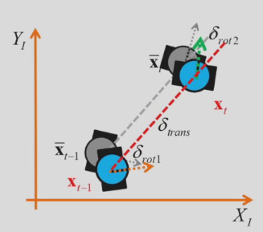

    1. 我们先在无噪声情况下获得里程计的航位推算模型

       将运动变化量叠加到 $x_{t-1}$ 得到 $x_t$


       $$
       \begin{pmatrix}
       x' \\
       y' \\
       \theta'
       \end{pmatrix}
       =
       \begin{pmatrix}
       x + \delta_{\text{trans}} \cos(\theta + \delta_{\text{rot1}}) \\
       y + \delta_{\text{trans}} \sin(\theta + \delta_{\text{rot1}}) \\
       \theta + \delta_{\text{rot1}} + \delta_{\text{rot2}}
       \end{pmatrix}
       $$
    
    2. 但是实际测量中带有各种误差
    
       真实值 = 测量值 - 误差


       $$
       \hat{\delta}_{\text{rot1}} = \delta_{\text{rot1}} - \tilde{\delta}_{\text{rot1}}, \quad 
       \hat{\delta}_{\text{trans}} = \delta_{\text{trans}} - \tilde{\delta}_{\text{trans}}, \quad 
       \hat{\delta}_{\text{rot2}} = \delta_{\text{rot2}} - \tilde{\delta}_{\text{rot2}}
       $$
    
       $$
       \begin{pmatrix}
       x' \\
       y' \\
       \theta'
       \end{pmatrix}
       =
       \begin{pmatrix}
       x + \hat \delta_{\text{trans}} \cos(\theta + \hat\delta_{\text{rot1}}) \\
       y + \hat \delta_{\text{trans}} \sin(\theta + \hat\delta_{\text{rot1}}) \\
       \theta + \hat\delta_{\text{rot1}} + \hat\delta_{\text{rot2}}
       \end{pmatrix}
       $$
    
    3. 于是我们可以设定误差为均值为0的高斯分布
    
    4. 闭式求解
    
       (1) 将里程计数据$u_{t-1}$表示为 $\delta = (\delta_{\text{rot1}}, \delta_{\text{trans}}, \delta_{\text{rot2}})^T$，作为测量控制值
    
       (2) 根据 $x_{t-1}, x_t$ 计算机器人的实际运动变化量 $\hat{\delta} = (\hat{\delta}_{\text{rot1}}, \hat{\delta}_{\text{trans}}, \hat{\delta}_{\text{rot2}})^T$，作为真实控制值
    
       (3) 根据真实值与测量值之间误差 $\tilde{\delta} = \delta - \hat{\delta}$ 的分布估计 $x_t$ 的分布


       $$
       p(x_t | x_{t-1}, {u}_{t-1}) = p(\tilde{\delta}_{\text{rot1}}) \cdot p(\tilde{\delta}_{\text{trans}}) \cdot p(\tilde{\delta}_{\text{rot2}})
       $$
       其中$p(\tilde{\delta})$满足高斯分布
       $$
       p(\tilde{\delta}_{\text{rot1}}) = \mathcal{N}(\tilde{\delta}_{\text{rot1}}; 0, \alpha_1 |\delta_{\text{rot1}}| + \alpha_2 |\delta_{\text{trans}}|)
       $$


       $$
       p(\tilde{\delta}_{\text{trans}}) = \mathcal{N}(\tilde{\delta}_{\text{trans}}; 0, \alpha_3 |\delta_{\text{trans}}| + \alpha_4 |\delta_{\text{rot1}} + \delta_{\text{rot2}}|)
       $$


       $$
       p(\tilde{\delta}_{\text{rot2}}) = \mathcal{N}(\tilde{\delta}_{\text{rot2}}; 0, \alpha_1 |\delta_{\text{rot2}}| + \alpha_2 |\delta_{\text{trans}}|)
       $$
    
       在不同$\alpha_i$参数下的得到不同的$p(x_t | x_{t-1}, {u}_{t-1})$
    
       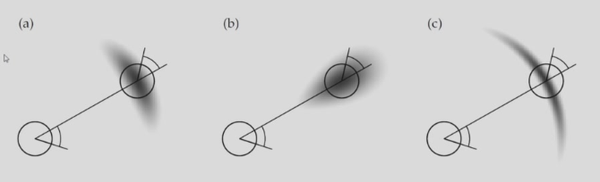
    
    5. 或者进行随机采样求解（和闭式求解不一样的是采样求解来拟合概率）
    
       将噪声建模为高斯分布
    
       - 在噪声的高斯分布中随机采样
    
       $$
       \tilde{\delta}_{\text{rot1}} \sim \mathcal{N}(0, \alpha_1 |\delta_{\text{rot1}}| + \alpha_2 |\delta_{\text{trans}}|)
       $$


       $$
       \tilde{\delta}_{\text{trans}} \sim \mathcal{N}(0, \alpha_3 |\delta_{\text{trans}}| + \alpha_4 |\delta_{\text{rot1}} + \delta_{\text{rot2}}|)
       $$


       $$
         \tilde{\delta}_{\text{rot2}} \sim \mathcal{N}(0, \alpha_1 |\delta_{\text{rot2}}| + \alpha_2 |\delta_{\text{trans}}|)


​       
​       $$


       - 基于采样噪声和里程计值构建真实控制量
    
       $$
         \hat{\delta}_{\text{rot1}} = \delta_{\text{rot1}} - \tilde{\delta}_{\text{rot1}}, \quad
         \hat{\delta}_{\text{trans}} = \delta_{\text{trans}} - \tilde{\delta}_{\text{trans}}, \quad
         \hat{\delta}_{\text{rot2}} = \delta_{\text{rot2}} - \tilde{\delta}_{\text{rot2}}


​       
​       $$


       - 通过运动模型计算新位姿
    
       $$
         x_t = \begin{pmatrix}
         x_{t-1} + \hat{\delta}_{\text{trans}} \cos(\theta_{t-1} + \hat{\delta}_{\text{rot1}}) \\
         y_{t-1} + \hat{\delta}_{\text{trans}} \sin(\theta_{t-1} + \hat{\delta}_{\text{rot1}}) \\
         \theta_{t-1} + \hat{\delta}_{\text{rot1}} + \hat{\delta}_{\text{rot2}}
         \end{pmatrix}


​       
​       $$


       - 重复采样生成点集，描述概率分布
    
       $$
       p(x_t | x_{t-1}, u_{t-1}) \approx \{x_t^{(1)}, x_t^{(2)}, ..., x_t^{(N)}\}
       $$


​       

- 

- 然后求解$p(m | x_t, x_{t-1}, u_{t-1})$

  地图分为可通行和不可通行

  本项作用：基于地图降低运动模型的不确定性

  问题：
  - 需要融合两次位姿之间路径不被占用的可能性
  - 机器人根据控制跟随该路径的可能性
  - 计算非常复杂，难以计算闭式解

  实际应用时，可以

  $$
  p(x_t | x_{t-1}, u_{t-1}, m) \approx p(x_t | x_{t-1}, u_{t-1})
  $$

  或

  $$
  p(x_t | x_{t-1}, u_{t-1}, m) \approx \eta p(x_t | x_{t-1}, u_{t-1}) p(x_t | m)
  $$
  如果只考虑运动模型进行位姿估计，其不确定性（方差）会不断地无上限增大

  > 地图一致运动模型Map-Consistent Motion Model，所以到底怎么求？好像没有介绍


## 概率表示下的观测模型

我们再来分析一下观测模型：
$$
p(z_t | x_t, m)
$$
观测模型根据感知测量模型（即感知随机变量在取值范围内的概率分布/概率密度）确定位姿空间上得到观测的概率

- 感知测量模型：描述测量信息的概率分布
- 观测模型：描述在机器人位姿条件下得到测量信息的概率分布

下面我们对观测模型进行求解：

1. 特征的观测模型构建

   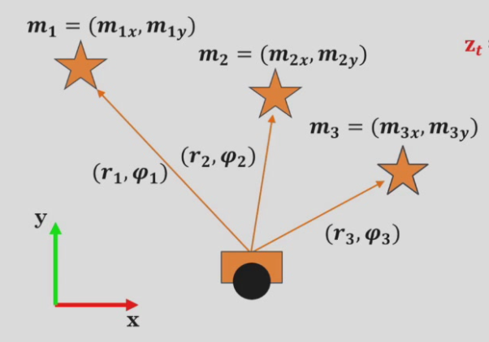
   $$
   m_1 = (m_{1x}, m_{1y}) \quad \text{为地图中特征位置信息（确定信息）}
   $$


$$
   z_t = \{(r_j, \varphi_j)\} \quad \text{为感知到的特征的测量信息（带有测量误差）}
$$


   - 特征的感知测量模型：

$$
     p(r_j, \varphi_j | x_t, m)
   
   
$$


   - 特征的观测模型：假设特征观测条件独立

$$
   p(z_t | x_t, m) = \prod_j p(r_j, \varphi_j | x_t, m)
$$

   从感知测量模型到观测模型：

   - 对所评估某位姿$x_t$，利用地图中特征确切位置，可以计算得到准确测量数据
   - 实际测量值=真实值+误差
   - 可以对误差分布进行建模（e.g. 均值为0的高斯分布），根据误差概率获得测量数据的概率，从而建立测量数据的概率描述

2. 激光束感知测量模型的物理建模

   一次激光测量的可能机制：正确测量（带有小测量噪声）、临时障碍、未检测到物体、随机误差
   $$
   p(z_t^k | x_t, m) = \alpha_{\text{hit}} p_{\text{hit}}(z_t^k | x_t, m) + \alpha_{\text{short}} p_{\text{short}}(z_t^k | x_t, m)
   $$


$$
   + \alpha_{\text{max}} p_{\text{max}}(z_t^k | x_t, m) + \alpha_{\text{rand}} p_{\text{rand}}(z_t^k | x_t, m)
$$


   - hit: 带少量噪声的正确测量
   - short: 临时障碍的测量
   - max: 达到最大距离的测量
   - rand: 随机错误测量


$$
   \alpha_{\text{hit}} + \alpha_{\text{short}} + \alpha_{\text{max}} + \alpha_{\text{rand}} = 1
$$

3. 基于likelihood field的激光束观测模型

   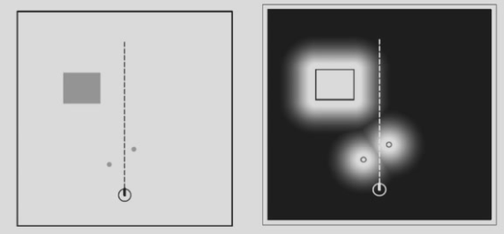

   基本思想：

   - 把激光束末端投影于地图中
   - 根据激光束末端投影与地图中最近物体之间距离建模
   - 为减少在线计算量，根据地图离线构建LikelihoodField图


# Lec 7 马尔可夫自定位求解方法

这里详细介绍求解方法：

$$
p(x_t | Z^t, U^{t-1}, m) = \eta p(z_t | x_t, m) \int p(x_t | x_{t-1}, u_{t-1}, m) p(x_{t-1} | Z^{t-1}, U^{t-2}, m) \, dx_{t-1}
$$

求解步骤

- 位姿预估 (Prediction)

$$
  \bar{p}(x_t | Z^t, U^{t-1}, m) = \int p(x_t | x_{t-1}, u_{t-1}, m) p(x_{t-1} | Z^{t-1}, U^{t-2}, m) \, dx_{t-1}
$$


- 观测更新 (Updating)

$$
p(x_t | Z^t, U^{t-1}, m) = \eta p(z_t | x_t, m) \bar{p}(x_t | Z^t, U^{t-1}, m)
$$

下面介绍几种经典的自定位方法（采用不同的假设或近似）：

[balzer82/Kalman: Some Python Implementations of the Kalman Filter (github.com)](https://github.com/balzer82/Kalman)

- KF

  - 解决什么问题？

    - **状态估计**：从含噪声的观测数据中动态估计系统状态（如位置、速度等）。
    - **噪声滤除**：抑制高斯白噪声及环境干扰，提升数据精度。
    - **预测与更新**：结合历史状态预测未来状态，并通过实时观测校正估计值。

  - 适用范围？

    - **系统特性**：线性动态系统（状态方程和观测方程均为线性）。
    - **噪声假设**：过程噪声（系统噪声）和观测噪声均为高斯白噪声。
    - **典型场景**：
      - 目标跟踪（雷达、无人机导航）。
      - 传感器融合（GPS/INS组合导航）。
      - 控制工程（机器人位姿估计）。

  - 核心思想和核心步骤：

    核心思想：高斯分布和线性变换

    

    1. **初始化**：
       - 设定初始状态 $ x_0 $ 和误差协方差矩阵 $ P_0 $。
       - 定义噪声协方差 $ Q $（过程噪声）和 $ R $（测量噪声）。

    2. **预测（时间更新）**：
       - **状态预测**：$ x_{k|k-1} = A x_{k-1} + B u_{k-1} $
       - **协方差预测**：$ P_{k|k-1} = A P_{k-1} A^T + Q $

    3. **校正（测量更新）**：
       - **卡尔曼增益计算**：$ K_k = P_{k|k-1} H^T (H P_{k|k-1} H^T + R)^{-1} $
       - **状态更新**：$ x_k = x_{k|k-1} + K_k (z_k - H x_{k|k-1}) $
       - **协方差更新**：$ P_k = (I - K_k H) P_{k|k-1} $

    关键参数

    - **状态转移矩阵（A）**：描述状态随时间的变化（如匀速模型中位置与速度的关系）。
    - **观测矩阵（H）**：将状态映射到观测空间（如仅测量位置时，H提取位置分量）。
    - **过程噪声协方差（Q）**：系统未建模误差（如风阻、摩擦）。
    - **测量噪声协方差（R）**：传感器误差特性（如GPS定位精度）。

  - 优缺点和改进：

    - **线性限制**：仅适用于线性系统，非线性需扩展（如EKF、UKF）。
    - **高斯假设**：非高斯噪声下性能下降。
    - **模型敏感性**：依赖准确的系统模型和噪声统计特性。

    改进方法

    1. **扩展卡尔曼滤波（EKF）**：
       - **方法**：通过一阶泰勒展开线性化非线性模型。
       - **适用**：轻度非线性系统，但存在线性化误差。

    2. **无迹卡尔曼滤波（UKF）**：
       - **方法**：通过无迹变换（UT）采样Sigma点，保留非线性分布特性。
       - **优点**：精度高于EKF，无需计算雅可比矩阵。

    3. **自适应KF（AKF）**：
       - **动态调整**：在线估计Q和R，增强鲁棒性（如Sage-Husa方法）。

    4. **粒子滤波（PF）**：
       - **适用**：强非线性、非高斯系统，通过蒙特卡洛采样近似后验分布。

- EKF

  - 解决什么问题？

    - **非线性系统状态估计**：针对**非线性动态系统**（如机器人运动、飞行器姿态），通过局部线性化实现状态估计。
    - **噪声处理**：在存在**高斯白噪声**（过程噪声和观测噪声）时，融合模型预测与传感器观测，提升估计精度。
    - **传感器融合**：解决多传感器（如IMU、GPS、雷达）数据在非线性系统中的融合问题。

  - 适用范围：

    - **系统特性**：轻度非线性动态系统（状态方程或观测方程为非线性）。
    - **噪声假设**：过程噪声和观测噪声均为高斯分布。
    - **典型场景**：
      - 机器人定位与SLAM（如车辆转弯模型CTRV）。
      - 无人机姿态估计（四元数动力学）。
      - 传感器非线性校准（如雷达极坐标转笛卡尔坐标）。

  - 核心思想和核心步骤：

    

    核心思想

    - **局部线性化**：通过**一阶泰勒展开**在状态估计点附近线性化非线性函数，将非线性问题转化为线性问题。
    - **雅可比矩阵**：计算状态转移函数 $ f $ 和观测函数 $ h $ 的雅可比矩阵 $ J_A $ 和 $ J_H $，用于近似协方差传播。

    核心步骤

    1. **初始化**：
       - 设定初始状态 $ x_0 $ 和误差协方差矩阵 $ P_0 $。
       - 定义噪声协方差 $ Q $（过程噪声）和 $ R $（观测噪声）。

    2. **预测（时间更新）**：
       - **状态预测**：$ x_{k|k-1} = f(x_{k-1}, u_k) $
       - **协方差预测**：$ P_{k|k-1} = J_A P_{k-1} J_A^T + Q $

    3. **线性化**：
       - 计算雅可比矩阵：$ J_A = \frac{\partial f}{\partial x}\bigg|_{x_{k-1}} $，$ J_H = \frac{\partial h}{\partial x}\bigg|_{x_{k|k-1}} $

    4. **校正（测量更新）**：
       - **卡尔曼增益**：$ K_k = P_{k|k-1} J_H^T (J_H P_{k|k-1} J_H^T + R)^{-1} $
       - **状态更新**：$ x_k = x_{k|k-1} + K_k (z_k - h(x_{k|k-1})) $
       - **协方差更新**：$ P_k = (I - K_k J_H) P_{k|k-1} $

  - 优缺点和改进：

    **优点**

    - **计算高效**：相比粒子滤波（PF），计算量小，适合实时系统。
    - **适用性广**：可处理大多数轻度非线性问题，工程实现简单。

    **缺点**

    - **线性化误差**：强非线性下泰勒展开的高阶项被忽略，导致估计偏差甚至发散。
    - **雅可比矩阵依赖**：需手动推导或数值计算雅可比矩阵，复杂系统实现困难。
    - **噪声敏感**：对 $ Q $ 和 $ R $ 的初始值敏感，需精细调参。
    - EKF采用多变量高斯分布表示估计的概率分布，这种单峰概率分布表示不适合于存在多个假设的情况

    **改进方法**

    1. **无迹卡尔曼滤波（UKF）**：
       - 通过**无迹变换（UT）**采样Sigma点，避免雅可比矩阵计算，精度更高。
       - 适用场景：强非线性系统（如电池SOC估计）。

    2. **迭代扩展卡尔曼滤波（IEKF）**：
       - 在更新阶段多次迭代线性化，减少单次线性化误差。
       - 适用场景：高度非线性且计算资源充足的情况。

    3. **自适应EKF**：
       - 动态调整 $ Q $ 和 $ R $（如Sage-Husa方法），提升鲁棒性。

    4. **结合深度学习**：
       - 使用神经网络拟合非线性函数或直接预测状态，减少模型误差。

- AKF

  - 解决的问题

    - **噪声时变适应**：在系统噪声（Q）或观测噪声（R）统计特性随时间变化时，传统KF因固定噪声参数导致性能下降，AKF能动态调整Q和R。

    - **模型不确定性**：当系统模型存在未建模动态或参数漂移（如传感器老化）时，AKF通过在线估计提升鲁棒性。

    - **新息协方差匹配**：强制新息序列（观测残差）的协方差与理论值一致，避免滤波发散。

  - 适用范围

    - **动态环境感知**：自动驾驶（路面颠簸导致IMU噪声突变）、无人机（风扰变化）。

    - **传感器退化场景**：摄像头在低光照下噪声增大，雷达在雨雪天观测误差变化。

    - **部分可观系统**：系统模型存在未知参数需联合估计（如摩擦力系数）。

- 核心思想与步骤

  **核心思想**

  - **噪声参数动态估计**：基于新息序列统计特性，实时调整Q和R。

  - **自适应机制**：通过滑动窗口、指数加权或变分贝叶斯方法平衡历史与当前信息。

  核心步骤（以Sage-Husa AKF为例）

  - **预测阶段**：

    - 状态预测：$  \hat{x}_{k|k-1} = F_k \hat{x}_{k-1|k-1}  $

    - 协方差预测：$  P_{k|k-1} = F_k P_{k-1|k-1} F_k^T + Q_{k-1}  $

    - **参数自适应**：

      - 计算新息：$  \epsilon_k = z_k - H_k \hat{x}_{k|k-1}  $

      - 更新噪声协方差：
        $$
        R_k = \alpha R_{k-1} + (1-\alpha)(\epsilon_k \epsilon_k^T - H_k P_{k|k-1} H_k^T)
        $$
        （α为遗忘因子，通常取0.95~0.99）

    - **更新阶段**：

      - 卡尔曼增益：$  K_k = P_{k|k-1} H_k^T (H_k P_{k|k-1} H_k^T + R_k)^{-1}  $

      - 状态更新：$  \hat{x}_{k|k} = \hat{x}_{k|k-1} + K_k \epsilon_k  $

      - 协方差更新：$  P_{k|k} = (I - K_k H_k) P_{k|k-1}  $

- 优缺点与改进

  优点

    - **环境适应性**：在时变噪声下，定位误差比传统KF降低30%~50%。

    - **模型容错**：对未建模动态（如车辆突然转向）具有更强鲁棒性。

    - **无需先验噪声**：适合传感器参数未知或漂移场景。

  缺点

    - **计算复杂度高**：相比KF增加20%~40%计算量。

    - **参数敏感**：遗忘因子α等超参数需精细调节。

    - **数值稳定性**：协方差矩阵易失去正定性，需正则化处理。

 

---

- UKF

  - 解决的问题：

    - **非线性系统状态估计**：处理状态方程或观测方程存在**强非线性**的系统，避免扩展卡尔曼滤波（EKF）因线性化导致的高阶误差。
    - **雅可比矩阵依赖**：无需计算雅可比矩阵，解决EKF因导数计算复杂导致的实现困难。
    - **协方差传递精度**：通过无损变换（UT）精确传递均值和协方差，提升非线性系统估计精度。

  - 适用范围

    - **系统特性**：中等到强非线性动态系统（如机器人运动、飞行器姿态控制）。
    - **噪声假设**：过程噪声和观测噪声为高斯分布。
    - **典型场景**：
      - 自动驾驶（车辆CTRV/CV/CA模型）
      - 无人机组合导航（IMU与视觉融合）
      - 目标跟踪（雷达极坐标观测）
      - 电池SOC估计（非线性电化学模型）

  - 核心思想与步骤

    核心思想

    - **无损变换（UT）**：通过确定性采样（Sigma点）近似非线性分布，直接传递均值和协方差。
    - **Sigma点规则**：选择2n+1个对称点（n为状态维度），保证一阶和二阶矩匹配。

    核心步骤

    1. **初始化**：
       - 初始状态 $ x_0 $ 和协方差 $ P_0 $
       - 定义过程噪声协方差 $ Q $ 和观测噪声协方差 $ R $

    2. **Sigma点生成**：

    $$
    \mathcal{X}_k^{(i)} = 
       \begin{cases}
       \hat{x}_k & i=0 \\
       \hat{x}_k + \gamma \sqrt{P_k}_i & i=1,\dots,n \\
       \hat{x}_k - \gamma \sqrt{P_k}_i & i=n+1,\dots,2n
       \end{cases}
    $$

       - $ \gamma = \sqrt{n+\lambda} $，$ \lambda $ 为缩放参数

    3. **预测（时间更新）**：
       - Sigma点通过非线性状态方程传播：$ \mathcal{X}_{k+1|k}^{(i)} = f(\mathcal{X}_k^{(i)}) $
       - 计算预测均值和协方差：


$$
         \hat{x}_{k+1|k} = \sum W_m^{(i)} \mathcal{X}_{k+1|k}^{(i)}
       
    
$$

  ​     


$$
         P_{k+1|k} = \sum W_c^{(i)} (\mathcal{X}_{k+1|k}^{(i)} - \hat{x}_{k+1|k})(\cdot)^T + Q
       
    
$$

  4. **更新（测量更新）**：
     - 预测观测Sigma点：$ \mathcal{Z}_{k+1|k}^{(i)} = h(\mathcal{X}_{k+1|k}^{(i)}) $
     - 计算观测均值和协方差：


$$
\hat{z}_{k+1} = \sum W_m^{(i)} \mathcal{Z}_{k+1|k}^{(i)}
$$

$$
S_{k+1} = \sum W_c^{(i)} (\mathcal{Z}_{k+1|k}^{(i)} - \hat{z}_{k+1})(\cdot)^T + R
$$

卡尔曼增益与状态更新：
$$
    K_{k+1} = P_{xz} S_{k+1}^{-1}
$$


$$
    \hat{x}_{k+1} = \hat{x}_{k+1|k} + K_{k+1}(z_{k+1} - \hat{z}_{k+1})
$$


$$
         P_{k+1} = P_{k+1|k} - K_{k+1} S_{k+1} K_{k+1}^T
       
    
$$

  - 优缺点与改进

    优点

    - **精度高**：对非线性分布的二阶矩近似，误差比EKF低50%以上。
    - **无需导数**：避免雅可比矩阵计算，实现简单。
    - **数值稳定**：协方差矩阵正定性保持更好。

    缺点

    - **计算量大**：Sigma点数量随状态维度n线性增长（2n+1点）。
    - **参数敏感**：缩放参数$ \lambda $和权重$ W_m/W_c $需调优。

    改进方向

    1. **Sigma点优化**：
       - 球面无迹变换（Spherical UT）：减少Sigma点数量至n+2。
       - 自适应Sigma点：根据非线性强度动态调整采样范围。

    2. **混合算法**：
       - UKF与粒子滤波（PF）结合：处理非高斯噪声。
       - 自适应UKF（AUKF）：在线估计Q和R。

    3. **工程优化**：
       - 并行化计算：加速Sigma点传播。
       - 矩阵分解：使用Cholesky更新代替直接求逆。

- PF（Particle Filter）

  - 解决问题：

    **非线性、非高斯动态系统**中的**状态估计问题**，PF通过蒙特卡洛采样逼近复杂概率分布

  - 使用范围

    - **非线性系统**：状态转移或观测模型无法用线性方程描述。
    - **非高斯噪声**：过程噪声或观测噪声不服从高斯分布。
    - **高维状态空间**：通过大量粒子近似复杂分布。
    - **多模态分布**：同时存在多个可能的估计状态（如目标分叉路径）

  - 核心思想与步骤

    核心思想

    - **蒙特卡洛方法**：用一组带权重的粒子（随机样本）近似后验概率分布。

      这里有个问题，如何进行采样？我们的目标是使样本分布能够近似密度函数/概率分布

      1. 采用样本排除法：均匀分布中采样，从[0,1]中随机采样

      2. 基于重要性评估计算目标样本分布

         1. 先根据一个已知的可以采样的分布采样

         2. 通过对粒子的重要性评估进行重采样获得目标样本分布

            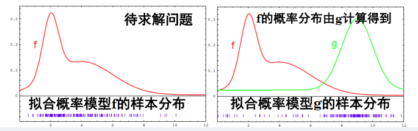
            $$
            重要性\omega=\frac{target~distribution}{proposal~distribution}=\frac{f(x)}{g(x)}
            $$
            对重要性权重进行归一化，然后进行重采样

            

    - **序贯重要性采样（SIS）**：通过动态更新粒子权重和重采样，逐步逼近真实状态。

    核心步骤

    1. **初始化**：

       - 生成 N 个粒子，均匀分布或根据先验分布生成，初始权重 $w_0(i)=1/N$。

    2. **预测（状态传播）**：

       - 根据系统动态模型传播每个粒子，模拟状态演化。
         $$
         x_k^{(i)} = p(x_k|x_{k-1}^{(i)})
         $$
         例如：自动驾驶中，粒子根据车辆运动模型（速度、转向角）更新位置。

    3. **权重更新**：

       - 计算每个粒子与当前观测的匹配程度（似然函数），更新权重：
         $$
         w_k^{(i)} = w_{k-1}^{(i)} p(z_k|x_k^{(i)})
         $$
         例如：通过激光雷达测距数据，计算粒子位置与地标距离的匹配度。

    1. **重采样**：

       - 归一化之后，根据权重分布进行重采样，淘汰低权重粒子，复制高权重粒子，保持粒子总数 N 不变。

         常用方法：系统重采样、残差重采样、多项式重采样。

    2. **状态估计**：

       - 加权平均或选取最高权重粒子作为当前状态估计：
         $$
         E[\hat x_k] = \sum x_k^{(i)} \tilde w_k^{(i)}
         $$

  - 优缺点与改进

    优点：

    - **无需线性/高斯假设**：适用于任意非线性、非高斯系统。
    - **多模态处理**：可同时表示多个可能的估计状态。
    - **灵活性**：可融合多源异构传感器数据。

    缺点：

    - **计算复杂度高**：粒子数量 N 需足够大（通常 N≥1000），实时性受限。
    - **粒子退化**：多次迭代后，少数粒子权重主导，多样性丧失。
    - **维度灾难**：高维状态空间需指数级增加粒子数

    改进

    - **自适应粒子数**：动态调整粒子数量（如KLD采样）。
    - 优化重采样：
      - **系统重采样**：降低方差，保持多样性。
      - **正则化重采样**：在粒子周围加入扰动，避免样本贫化。
    - 混合滤波：
      - **UPF（无迹粒子滤波）**：结合无迹变换（UT）生成重要性密度函数。
      - **RBPF（Rao-Blackwellized PF）**：分解状态空间，部分变量用解析解，减少采样维度。
    - **并行化**：利用GPU加速粒子传播与权重计算


| **特性**       | **KF**       | **EKF**            | **UKF**           |
| -------------- | ------------ | ------------------ | ----------------- |
| **适用系统**   | 线性         | 轻度非线性         | 强非线性          |
| **计算复杂度** | 低           | 中（需雅可比矩阵） | 中（Sigma点采样） |
| **精度**       | 线性最优     | 一阶近似，误差较大 | 二阶近似，精度高  |
| **实现难度**   | 简单         | 中等               | 中等              |
| **主要缺陷**   | 仅限线性系统 | 线性化误差         | 计算量略高        |


# References

- [DomyRndi/ZJU-ICP-mileage-estimation: 浙江大学控制科学与工程学院《智能移动技术》课程 ICP里程估计作业 (github.com)](https://github.com/DomyRndi/ZJU-ICP-mileage-estimation)
- [jyczju/Robot_Path_Plan: 浙江大学控制学院《智能移动技术》课程大作业 (github.com)](https://github.com/jyczju/Robot_Path_Plan)
- [Suhao07/Intellectual-motion-technology: 智能移动技术课程代码 (github.com)](https://github.com/Suhao07/Intellectual-motion-technology)