# Main Takeaway

上《机器人导论》这门课的补天笔记。

虽然没有怎么去听，但是大作业用solidworks设计自己的小车还是很有意思的。

<!--more-->

# 绪论

进入机器人领域前先看看著名的三大法则：

- 第一法则：机器人不得伤害人类，或袖手旁观坐视人类受到伤害；

- 第二法则：除非违背第一法则，机器人必须服从人类的命令；

- 第三法则：在不违背第一及第二法则下，机器人必须保护自己。

分类：工业机器人+服务机器人

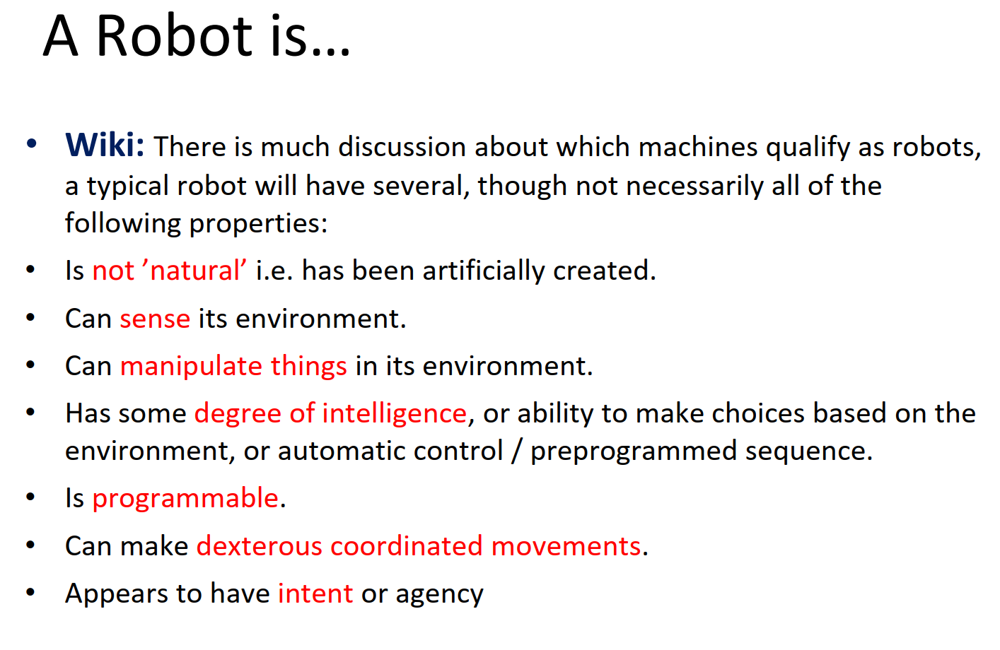

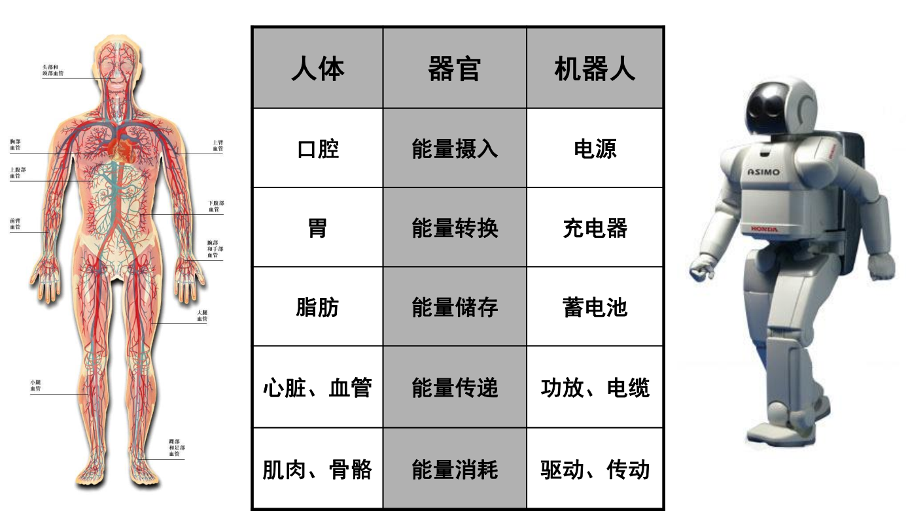

# Microcontroller

MCS-51 Microcontroller and Assembly Language

Arduino：AVR平台

# 传感器

## 概述

- 静态特性：输出相对于输入保持一定的对应关系  

  - 灵敏度

  - 信噪比(S/N)：传感器输出信号中信号分量与噪声分量的平方平均值之比

  - 线性

  - 稳定性：输入量恒定，输出量向一个方向偏移（温漂/零漂）

  - 精度：准确度（测量值对真值的偏离程度）/精密度（每次测量是否一样）

- 动态特性（响应特性）

  - 瞬态响应特性  

  - 频率响应特性  

### 内部传感器

| 传感器                   | 检测功能     |
| ------------------------ | ------------ |
| 电位器、旋转变压器、码盘 | 角度、位移   |
| 测速发电机、码盘         | 速度、角速度 |
| 加速度传感器             | 加速度       |
| 倾斜仪                   | 倾斜角度     |
| 陀螺仪                   | 方位角       |
| 力/力矩传感器            | 力/力矩      |

### 外部传感器

| 传感器       | 感知内容                                   | 传感器 | 感知内容 |
| ------------ | ------------------------------------------ | ------ | -------- |
| 视觉         | 环境图象                                   | 嗅觉   | 气味     |
| 触觉、滑动觉 | 物体存在检测、尺寸、形状、材质、硬度、光滑 | 听觉   | 声音     |
| 接近觉       | 障碍检测、距离                             | 味觉   | 味道     |
| 热觉         | 温度                                       | 力觉   | 力和力矩 |

## 运动传感器

- 电位器

  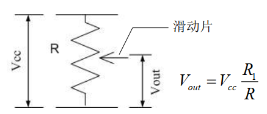

  - 旋转式：测量角位移
  - 直线式：测量线位移

- 编码器

  - 光电码盘（常）/磁编码器（检查磁通变化）[磁编码器原理](https://blog.csdn.net/encoder_yang/article/details/120968699)
  - 增量式（脉冲计数算角度，相位算方向）/绝对式
  - 速度传感器：统计指定时间内脉冲信号数量/测量相邻脉冲时间间隔  

- 加速度传感器：[读懂加速度传感器](https://www.eet-china.com/mp/a17878.html)

  压电式：利用加速度造成某个介质产生变形，通过测量其变形量并用相关电路转化成**电压输出**（eg:压电晶体）
  $$
  a=\frac{F}{M}
  $$

## 方位角传感器

测量机器人**方向和倾角**/进行**位姿估计**

- 指南针：测量**磁场方向**的传感器, 可用于方向的**绝对测量** （易受干扰）

  - 霍尔指南针：利用霍尔效应  
  - 磁通门罗盘：利用电磁感应原理  

  |        | 分辨率 | 精度 | 体积 | 价格 |
  | ------ | ------ | ---- | ---- | ---- |
  | 霍尔   | 低     | 低   | 小   | 低   |
  | 磁通门 | 高     | 高   | 大   | 高   |

- 陀螺仪：角速度测量仪器

  - 机械陀螺仪：高速旋转角动量——gosh

  - 光纤陀螺仪：good

    因为光束速度不变，因此光束沿通道转动同/反向时间不同，同时向顺/逆失真发出两束光，**检测相位差或干涉条纹变化**，即可测出闭合光路旋转角速度  

  - MEMS陀螺仪——科氏力(旋转物体在径向运动时所受到的切向力) good

    > MEMS陀螺仪通常安装有两个方向的可移动电容板， “径向的电容板加震荡电压迫使物体作径向运动，横向的电容板测量由于横向科里奥利运动带来的电容变化。”这样， MEMS陀螺仪内的“陀螺物体”在驱动下就会不停地来回做径向运动或震荡，从而模拟出科里奥利力不停地在横向来回变化的运动，并可在横向作与驱动力差90°的微小震荡。  
    >
    > 这种科里奥利力好比角速度，所以由电容的变化便可以计算出MEMS陀螺仪的角速度  

- 倾角仪：加速度传感器[倾角传感器的原理](https://zhuanlan.zhihu.com/p/567474907)

  如果初速度已知，就可以通过积分计算出线速度，进而可以计算出直线位移。所以它其实是运用惯性原理的一种加速度传感器。

  当倾角传感器静止时也就是侧面和垂直方向没有加速度作用，那么作用在它上面的只有重力加速度；重力垂直轴与加速度传感器灵敏轴之间的夹角就是倾斜角。

- IMU（惯性测量单元）

  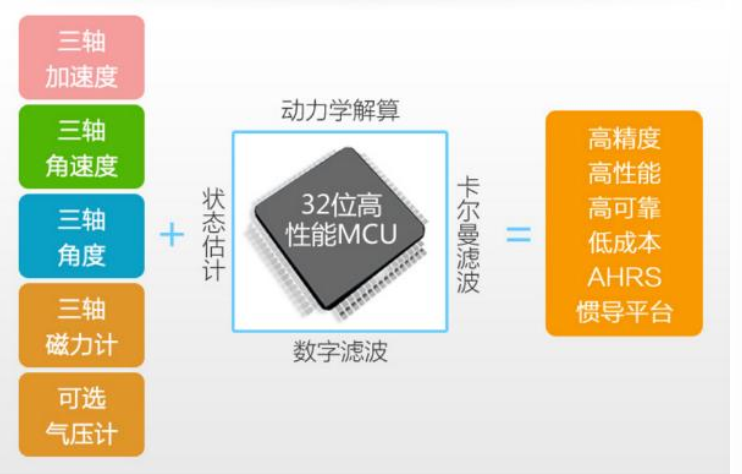

## 测距传感器

- 接近觉传感器：粗略的距离感觉

  - 光学

    - 对置式：左右一发一收，发了没收到则中间有东西
    - 回波式：红外光反射

  - 超声波：（和光学差不多）利用压电传感器生成声波,采用测量传输时间法测距

    > 声波传输速度低/ 锥形方式传播，分辨率差/能量被吸收/镜面反射

  - 激光：

    - 三角法

      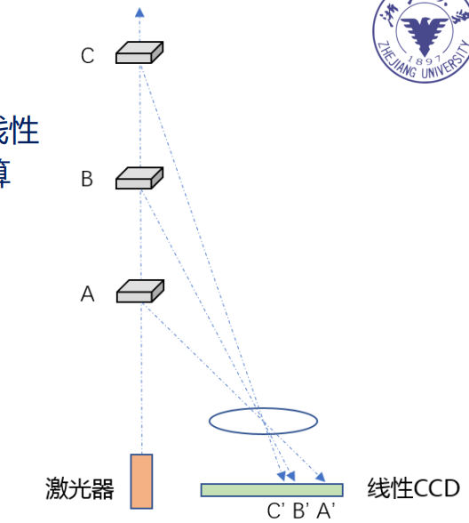

    - 时飞法（TOF）：直接延迟时间测量法
      $$
      s=vt,D=vt/2,c=3*10^8 m/s
      $$

    - 相位法：发射器发射一个连续波。用具有不同频率的sin信号调制所携带信号的波长。比较反射信号与所发送信号之间的相位差

      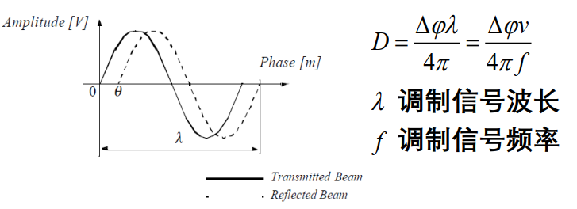

## 其它传感器

- 力觉传感器

  - 压阻式：半导体压阻效应

    > 半导体压阻效应：当对一块半导体在某一方向上施加应力时，其电阻率会产生一定的变化，

  - 压电式：压电效应

    > 压电效应：对某些特殊晶体进行挤压或拉伸时，晶体两端会产生不同的电荷，其电压与压力存在对应关系

  - 电容式：电容机理

    > 电容机理：电容量由电极面积和两个电极间的距离决定，压力产生形变

- 力矩传感器：当力矩作用在弹性轴上，轴会产生扭曲变形，存在剪切应变和应力

- 触觉传感器：测量解释接触觉、压觉或滑觉的传感器  
  - 微型开关：检测是否接触
  - 传感器阵列：检测力或位移

- 视觉传感器：小孔成像

  主要成像元件：

  - CCD：采用敷设在薄硅片上组成矩形网格的电荷收集晶格记录到达每个晶格的光能总量的某种度量
  - CMOS(Complementary Metal Oxide Semiconductor ):采用补充金属氧化半导体技术一次整合全部周边设施于单晶片中  

# 结构与驱动

主要驱动：电机驱动，气动驱动（气缸，气阀，管路），液压驱动（力矩大，轻，小），新型驱动（软体机器人，只能材料，eg:介电弹性体）

## 驱动方式

### 电机驱动

#### 有刷直流电机

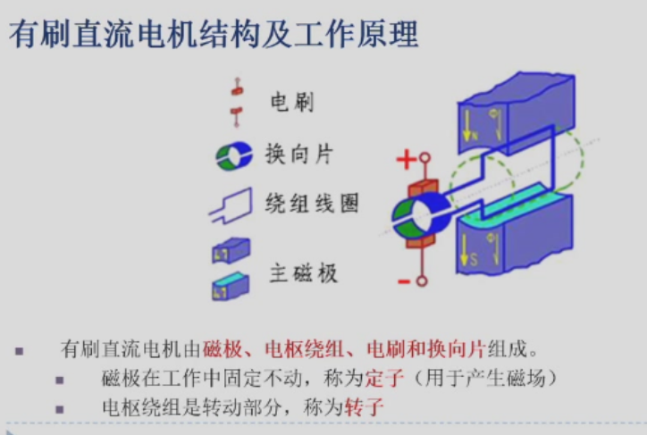

- 有刷电机H桥驱动——L298N，控制A、B项的输入进行正反转（都为正停止）

- PWM控制：$V_d=V_{max}\cdot D,D$为占空比——舵机

#### 无刷直流电机

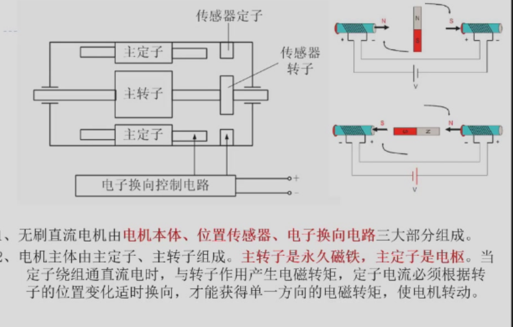

无刷电机的绕组有星形联结方式和三角联结方式，而三相星形联结（Y型）的二二导通方式

[无刷电机的工作原理，动图演示](https://zhuanlan.zhihu.com/p/72091265)

> 中间的转子会尽量使自己内部的磁感线方向与外磁感线方向保持一致”

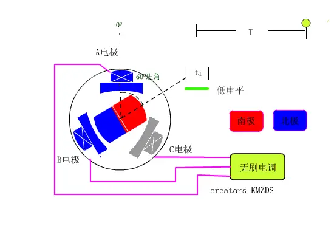

三个最重要的物理量

- 电枢电动势$E_a=K_en$
- 电磁转矩$T=K_mI$
- 电磁功率$P=E_aI=T\omega$

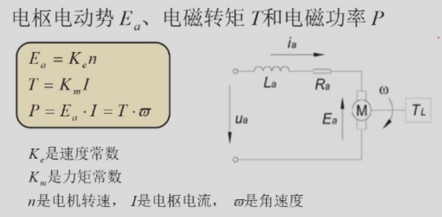

> 转速与感应电动势成正比，力矩与电流大小成正比

$$
n=\frac{U-IR_a}{K_e}
$$

- 转矩和转速的关系——斜率（速度/转矩常数）越小，说明电机刚性越好

拉式变换后得到二阶系统——三环PID（电流、速度、位置）

#### 伺服驱动系统

### 气动驱动

- 方向控制回路

  换向阀——[如何识别液压阀是几位几通](https://www.zhihu.com/question/435052479#:~:text=在简图中我们可以看符号中有几个用竖线隔开的"方格"，有几个就是几位。 再看某一个的方格中有几个与"方格"边框相交的竖线，有几个就是几通。 其中箭头表示通路（ 液流方向 ）%2C一个箭头表示两通%2C即进油与出油%2C二个箭头就是四通；┴ 和┬与方框的交点表示通路被阀芯堵死。 若图中一个框内有两个箭头%2C及一个 ┬,1、 位—用方格"□"表示，几位即几个方格 。 2 、 箭头↑首尾和 堵截符号 ┴与一个方格有几个交点即为几通。)
  
  - 几个方框代表几”位“
  - 箭头↑首尾和堵截符号┴与一个方格有几个交点即为几通。↑ 表示油口相通，方向不表示实际流向。┴ 表示油口不通

### 液压驱动

利用不可压缩的流体将作用域某一点的力传递给另一点——常委工业液压油

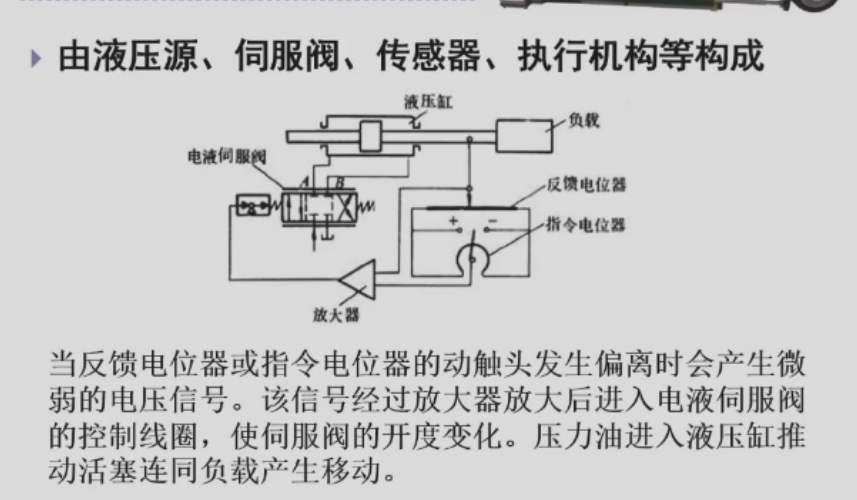

### 新型驱动

磁流变液——MR流体

## 结构

### 减速比

- 齿轮基本参数

  - 模数m：$m=齿距p/{\pi}=分度圆直径d/齿数z$​

    m越大，齿厚越大，承载能力越高

    > 欲使两齿轮正确啮合，两轮的模数必须相等  

  - 分度圆d：$d=mz$

- 定轴轮系的传动比：

  - 传动比定义：$i_{1k}=n_1/n_k$首末两轮的转速之比(>1减速，<1加速)

  - 一对齿轮：$i_{12}=n_1/n_2=z_2/z_1$​

  - 转向关系

    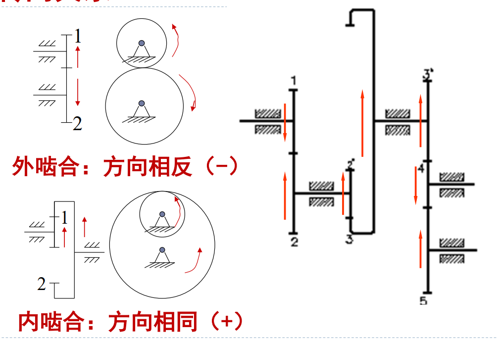

  - 减速比计算

    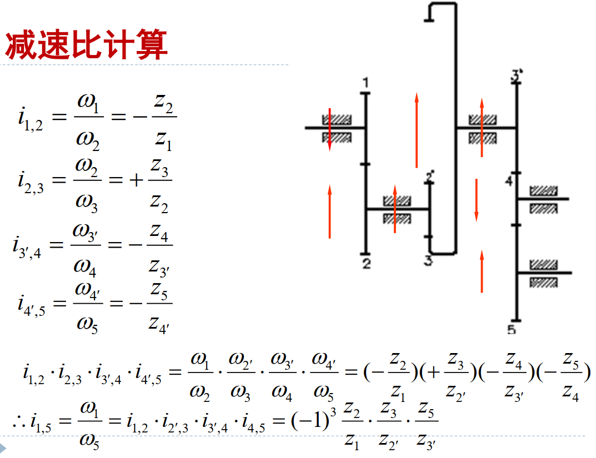

### 连杆

铰链四连杆是平面四杆机构的基本形式[5分钟搞懂四杆机构运动规律（有点帅）](https://zhuanlan.zhihu.com/p/541849290)

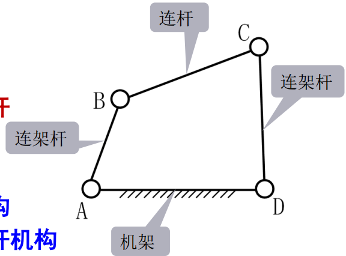

- 曲柄机构：能做整周回转——常作主动件转动（整转副）

- 摇杆机构：只能一定范围摆动——常作从动件

#### 曲柄摇杆机构

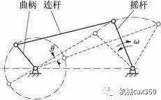

- AB为最短杆时，为曲柄摇杆机构
- BC为最短杆时，为双摇杆机构
- AD为最短杆时，为双曲柄机构

### 轴承

按可承受的载荷方向不同，滚动轴承分为三类：  

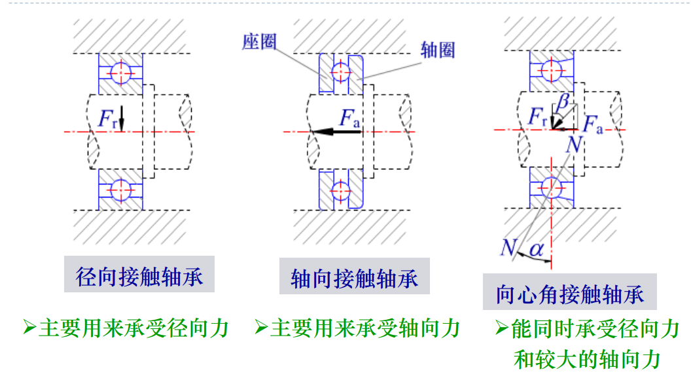

> 接触角α： 滚动体的载荷方向线与轴承径向平面之间的夹角； α 越大，可以承受的轴向力越大  

- 轴系固定的三种方法：

  1、两端固定（又称双支点单向固定）。 轴系两端由两个轴承支承，每个轴承分别承受一个方向的轴向力。这种结构较简单，适用于工作温度不高、支承跨距较小（跨距≤400mm）的轴系。

  2、一端固定一端游动（又称单支点双向固定）。 轴系由双向固定端的轴承承受轴向力并控制间隙，由轴向浮动的游动端轴承保证轴伸缩时支承能自由移动。为避免松动，游动端轴承内圈应与轴固定。这种结构适用于工作温度较高、支承跨距较大的轴系。

  3、两端游动。轴系两端的支承轴承（采用圆柱滚子轴承）轴向均可游动，以适应人字齿轮传动工作时，主、从动轮须对正的要求。当然这种结构形式用的较少，仅用于类似的特殊场合。

## 机器人正逆运动学

学了能取矿吗？

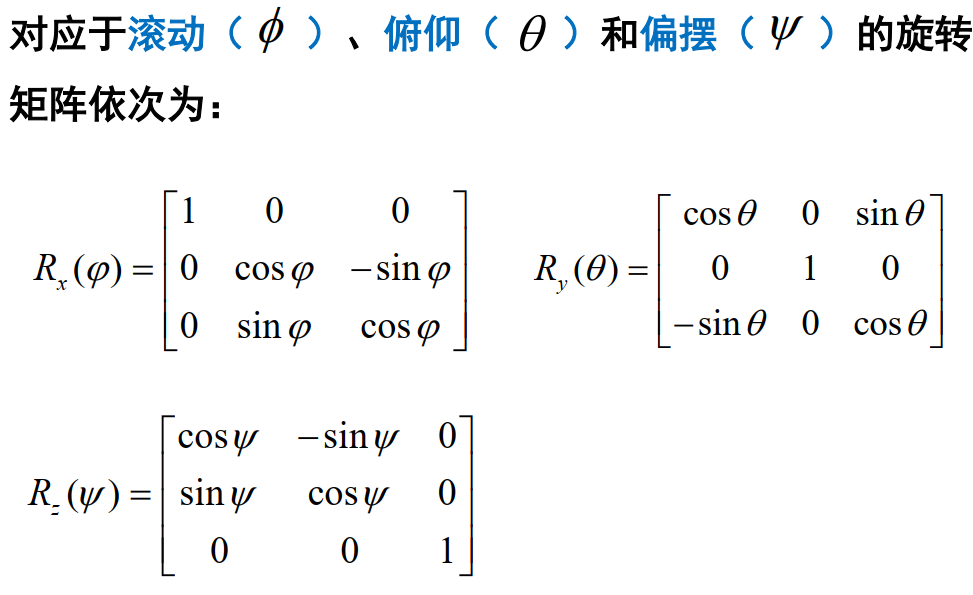

# 定位

## 里程估计

- 基于电机码盘的轮式移动机器人里程估计——误差累积

- 基于IMU里程估计：积分获得姿态、速度、位置

- 激光里程计：ICP(Iterative Closest Point)  算法[ICP算法详解](https://blog.csdn.net/qq_41685265/article/details/107140349)——一种点云匹配算法

  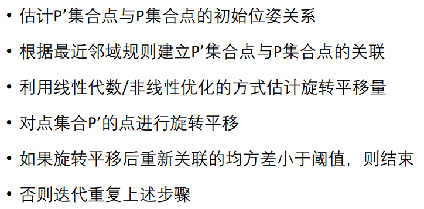

- GPS （Global Positioning System）：由空间端、 控制端和用户端三部分组成，也称为GNSS (Global Navigation Satellite System)

  > 多路径问题

- 全局视觉观测定位

- 基于环境人工标识的定位  （eg:QR）

  

- Markov Localization  [Markov Localization（马尔可夫定位）简介](https://blog.csdn.net/m0_72410588/article/details/131602989)

## 图像获取

视觉传感器——相机

- 被动相机成像：光反射——CCD传感器感知

  > 无法获得物体的深度

- 双目：一对被动视觉传感器，能够构成一套双目相机，模拟人的双目，获得深度  

  

视觉提供了一种**几何测量**的工具，也提供一种**语义认知**的工具，各种视觉应用是两种工具功能的组合

- 图像函数：图像是定义在CCD阵列下的离散函数  

  

- 相机模型

  

  - 镜头畸变
  - 相机标定：相机标定是指通过实验和计算来确定空间物体表面某点的三维几何位置与其在图像中对应点之间的相互关系的过程
  - 内部参数：如焦距、光心位置等
  - 外部参数：如相机的旋转和平移参数

# 规划与集群

> 懂不了一点

- 自主导航软件框架（感觉有点帅）：

  

## 运动规划

- 前端：路径搜索

  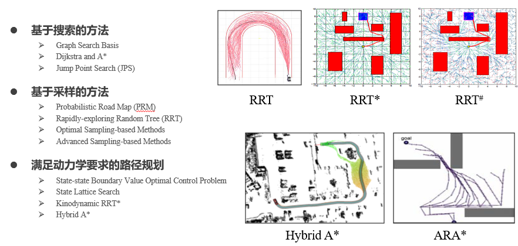

  - 基于采样的方法：

    [路径规划 | 随机采样算法：PRM、RRT、RRT-Connect、RRT*](https://zhuanlan.zhihu.com/p/349074802)

    [路径规划 | 随机采样算法：Informed-RRT* ](https://zhuanlan.zhihu.com/p/372315811)

  - 基于搜索的方法：基于图搜索的路径规划算法主要用于低维度空间上的路径规划问题，它在这类问题中往往具有较好的完备性，但是需要对环境进行完整的建模工作，在高维度空间中往往会出现维数灾难。

    [路径规划 | 图搜索算法：DFS、BFS、GBFS、Dijkstra、A* ](https://zhuanlan.zhihu.com/p/346666812)

    [路径规划 | 图搜索算法：JPS ](https://zhuanlan.zhihu.com/p/366964462)

- 后端：轨迹优化

  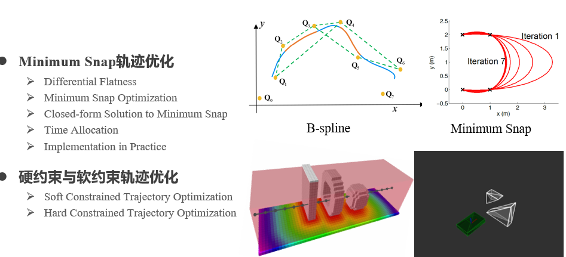

  [Minimum Snap轨迹生成，闭式求解Minimum Snap问题，机器人轨迹优化，多项式轨迹路径生成与优化](https://blog.csdn.net/u011341856/article/details/121861930)

## 集群

### 基于Virtual Structures的编队控制

- 集群编队结构表示：将整个集群用virtual structure表示为一个世界坐标系下的整体（virtual rigid body, VRB）；

  > 该方法可防止群内以及四旋翼和环境中的静态障碍物之间的碰撞
  >
  > UWB定位，测距

- 多目标需求：基于势场法表示集群中每架无人机编队保持、相互躲避、障碍物避障的需求；

- 控制：在VRB坐标系下统一上述各个势场得到相应的控制指令。

### VO

[底层避碰算法之VO（Velocity Obstacle）完全入门](https://zhuanlan.zhihu.com/p/662684761)

VO (Velocity Obstacle)速度避障

> 为什么这个算法的名字叫Velocity Obstacle速度障碍。因为这个算法是**在速度域**中把速度划分为了安全速度和障碍速度——VO算法直接在**速度域中找速度，避免了积分的步骤**。

### RVO

RVO（Reciprocal Velocity Obstacle）

VO的升级版本RVO（Reciprocal Velocity Obstacle）就是认为对方也是一个和自己采取着同样避碰策略的老友，把一半的避碰责任分给了老友

### 基于生物群落模型的集群算法（Flocking models）

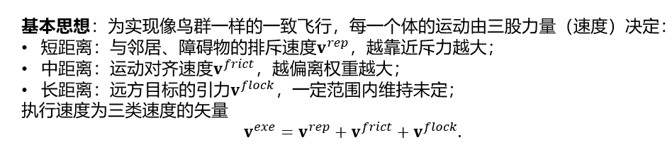

