# Main Takeaway

空中机器人——开卷

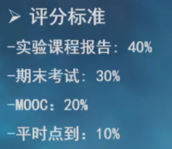

<!--more-->

# 概论

## 定义与形态

- 定义：有无飞控，不完全绝对

- 形态

  - 固定翼：固定翼飞行器靠螺旋桨或者涡轮发送机产生的推力作用飞机向前飞行的动力，主要升力来自机翼与空气的相对运动。飞行高度高，速度快，载重大。 常用于运输，测绘等领域

    五个组成部分：机体结构，航电系统，动力系统，起降系统，地面控制站

  - 旋翼：旋翼升力平衡重力；改变旋翼的转速控制飞行器的平稳和姿态；可以悬停，或在一定速度范围内以任意飞行；可视为一个空中飞行平台

    操控简单、可靠性高、模块易替换；常用于智能交通，航拍等领域

    四旋翼组成部分：旋翼，支架，电机，飞控（支架中间空间安放飞行控制计算机和外部设备）

  - 扑翼型/气囊型

## 动态模型

多旋翼空中机器人动态模型

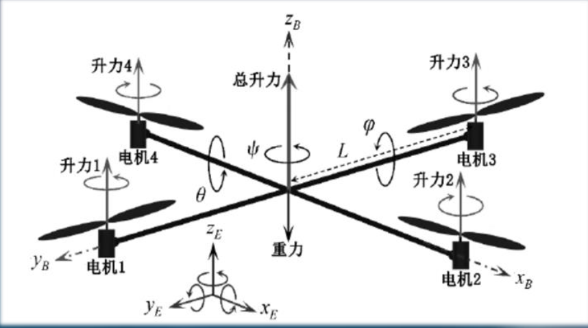

固定翼空中机器人动态模型

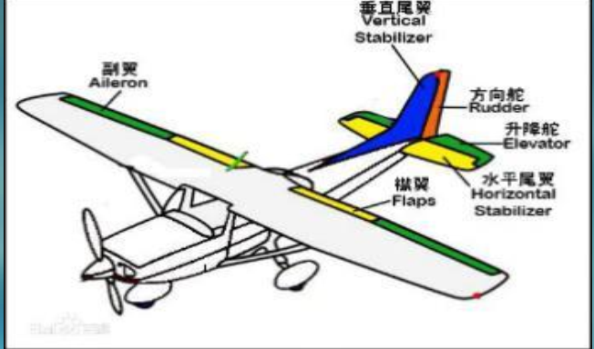

## 飞行控制基础

- 遥控飞行（Remote Control Flying ）

  – 航向、速度、高度等参数由地面操作人员通过通信数据链路遥控控制

- 程控飞行（Autopilot Flying ）

  – 航向、速度、高度等参数根据预先制定的规划航线由机载计算机控制系统计算获得并实施控制

- 自主飞行（Autonomous Flying）

  – 机载计算机控制系统能够感知环境的变化自动进行实时路径规划，并进行相应的姿态、航向、速度、高度等参数控制

> 自动控制的基本原理——反馈控制。无人机要求稳准快

## 飞行器名词解释

飞行机器人 Aerial Robot

速度表示：

- 真空速(TAS)，飞机相对于空气的运动速度，是考虑了空气密度影响的速度
- 指示空速(IAS)，折算到海平面高度的真空速，忽略了空气密度的变化，又称表速，是**空速管**测出的速度，也是表征飞机升力的速度
- 地速， 飞机相对于地面运动速度的水平分量，是真空速与风速水平分量的矢量和
- 垂直速度， 飞机相对于地面运动速度的垂直分量，即升降速度

- 马赫是表示速度的量词。一马赫即一倍音速(音波可以在固体、液体或是气体介质中传播，介质密度愈大，则音速愈快，**所以马赫的大小不是固定的**)

  > 马赫数小于1者为亚音速，马赫数大于5左右为超高音速

- 激波：飞机飞行 -> 对空气产生扰动，扰动(以扰动波的形式)以音速传播,积聚

- 马赫锥：超音速飞行时， 激波后的空气压力和温度急剧下降，导致水汽冷凝，形成雾化现象

- 高超飞行器：高超音速飞行器主要包括3类： 高超音速巡航导弹、高超音速飞机以及航天飞机。它们采用的**超音速冲压发动机**被认为是继螺旋桨和喷气推进之后的“第三次动力革命”

  > 复杂的气动特性；用超燃冲压发动机；飞行器机体与发动机一体化；飞行器机体与推进系统和飞行器结构动态之间耦合强；飞行器模型非线性度高；飞行器飞行高度、速度跨度大；飞行环境复杂，瞬间多变；气动特性和气热特性变化剧烈；控制精度高，末制导难度大

- 飞行包线：以速度作为横坐标，以高度作为纵坐标，把各个高度下的速度上限和下限画出来，这样就构成了一条边界线，称为飞行包线，飞机只能在这个线确定的范围内飞行

## 气动布局

飞机外部总体形态布局与位置安排称作气动布局

[飞机的气动布局 - 知乎 (zhihu.com)](https://zhuanlan.zhihu.com/p/105230538)

- 常规布局：水平尾翼和垂直尾翼都在后面

  特点是有主机翼和水平尾翼，大的主机翼在前，小机翼也就是水平尾翼在后，有一个或者两个垂直尾翼

- 变后掠翼布局：主翼的后掠角度可以改变，高速飞行可以加大后掠角，相当于飞鸟收起翅膀，低速飞行时减小后掠角，展开翅膀

  > 后掠角通俗讲就是机翼机身之间的夹角

  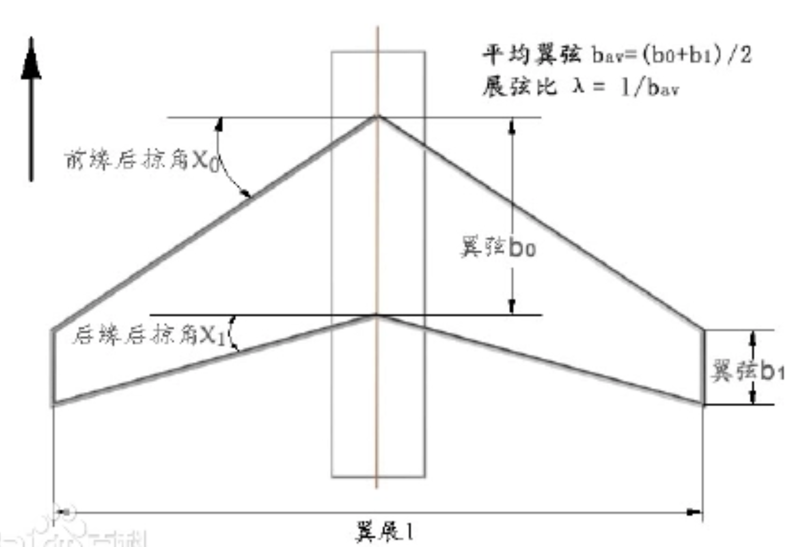

- 无尾布局：没有水平尾翼，无尾布局大大减少了空气阻力，无尾布局的缺点是低速性能不好，这影响到飞机的低速机动性能和起降能力。另外无尾布局因为只能依靠主翼控制飞行，所以稳定性也不理想

- 鸭式布局：这种气动布局其实就是无尾布局加个鸭翼。有了这个鸭翼，无尾布局的缺点得到明显改善，高速飞行时更加稳定，起降距离明显缩短，甚至机动性能比常规布局更加出色

  > 将水平尾翼移到主翼之前的机头两侧

- 飞翼布局：有飞机翅膀的布局，看上去只有机翼，没有机身，机身和机翼融为一体。无疑这种布局是空气动力效率最高的布局，因为所有机身结构都是机翼，都是用于产生升力，而且最大程度低降低了阻力。空气阻力最小所以雷达波反射自然也是最小，所以飞翼布局是隐身性能最好的气动布局。

  飞翼布局的最大缺陷是操控性能极差，完全依赖电子传感控制机翼和发动机的矢量推力

- 前掠翼布局：这种布局的特点是主翼前掠而不是后掠，因为机翼前掠致命的稳定性问题导致这种技术一直只停留在研发阶段，没有得到实际应用。

- 三角翼：[飞机的气动布局 - 知乎 (zhihu.com)](https://zhuanlan.zhihu.com/p/105230538)

## 主动控制（ACT）

在飞行器设计的初始阶段,考虑控制系统对飞行器总体设计的影响,充分发挥飞行控制的潜力的一种设计技术——YF-16,第一种采用主动控制技术的飞机

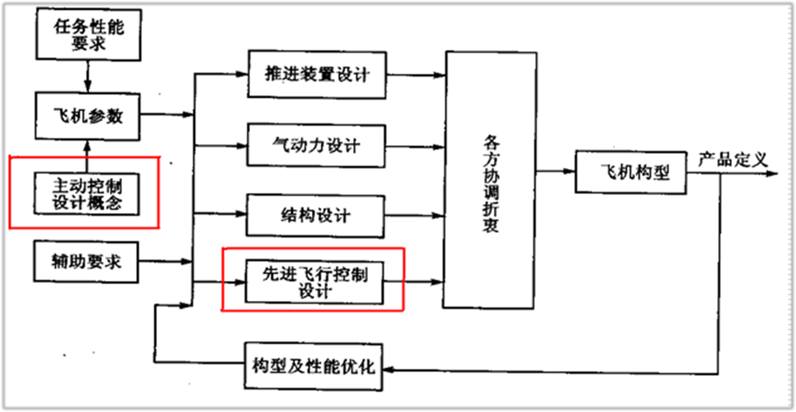

# 动态模型

空机看作为6自由度的刚体——三个质心运动和三个角运动

## 飞行器的坐标系

- 惯性坐标系：右手定则，注意$O_gz_g$垂直地面指向地心

  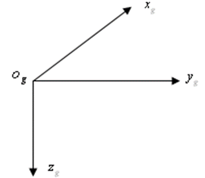

- 地球中心坐标系ECEF（理想）：与地球固联，原点为地球质心，X轴通过格林尼治线和赤道线的交点，Z轴通过原点指向北极

- WGS-84坐标系：WGS-84坐标系的X轴指向BIH(国际时间服务机构)1984.0定义的零子午面(Greenwich)和协议地球极(CTP)赤道的交点。 Z轴指向CTP方向。 Y轴与X、 Z轴构成右手坐标系——**把ECEF用在GPS中就是WGS-84坐标系**

  > **GPS输出的坐标数据就是这个坐标系下的！**
  >
  > **为什么有了GPS输出的海拔高度，我们还是要用气压计或者其他硬件来辅助定高呢**？为什么GPS的海拔数据精度没有办法支撑无人机高度定位呢？：因为GPS输出的信息**是相对于WGS-84坐标系。**我们可以把它看做一个参考椭球体，GPS输出的高度是垂直于椭球表面的高度，不是相对于海平面(Mean Sea Level)的高度。

- NED坐标系：NED坐标系是在**导航计算**时使用的坐标系，向量分别指向北，东，地，因此NED坐标系也经常称为“北东地坐标系”

- 机体坐标系：**机体坐标系与飞行器固联**，坐标系符合右手法则， **原点在飞行器重心处**， X轴指向飞行器机头前进方向， Y轴由原点指向飞行器右侧， Z轴方向根据X、 Y轴由右手法则确定

## 姿态表示

欧拉角变化率与机体角速度的关系

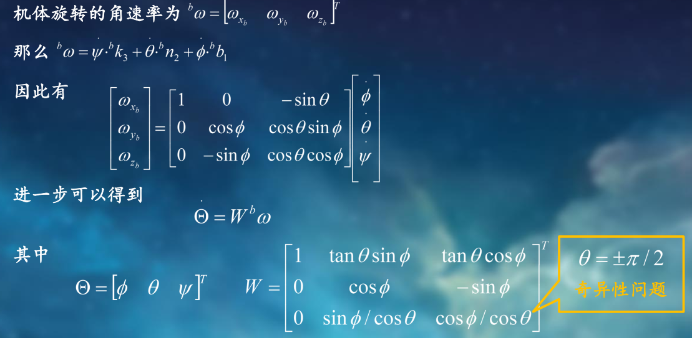


## 四旋翼飞行器动力学基础

动力学模型的输入为螺旋桨提供的拉力和力矩，输出为四旋翼的速度和角速度；运动学模型的输入为动力学模型的输出，即四旋翼的速度和角速度，输出为四旋翼的位置和姿态。

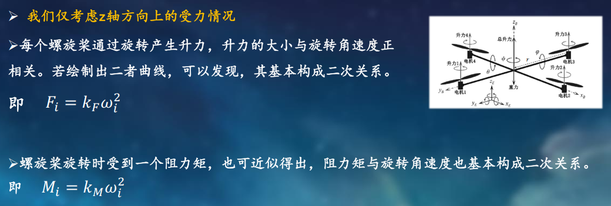

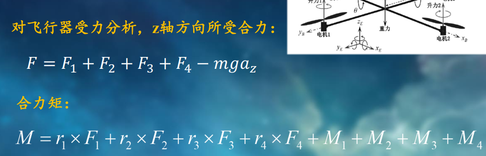

四旋翼飞行器相邻的两个螺旋桨旋转方向是相反的，这种设计是为了**平衡每个螺旋桨产生的反扭矩**，从而使飞行器能够稳定飞行

反扭距：当螺旋桨在转动的时候，迅速冲撞着螺旋桨平面内的空气。根据牛顿第三定律，空气也会给螺旋桨一个反方向的阻力。例如，如果一个螺旋桨顺时针旋转，它会产生一个逆时针的扭矩，这个扭矩会试图使飞行器逆时针旋转

[四旋翼数学模型——动力模型_主旋翼产生的反扭矩计算](https://blog.csdn.net/weixin_41869763/article/details/113853365#:~:text=本文介绍了四)

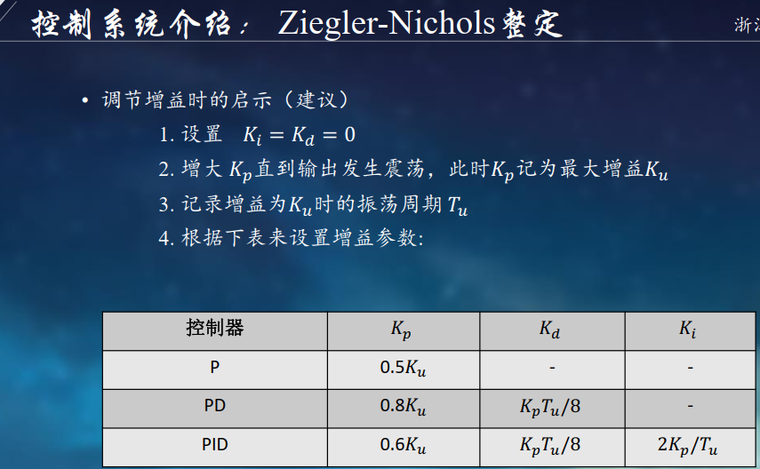

- 控制器设计：PID，其余见后面的控制器算法及仿真

  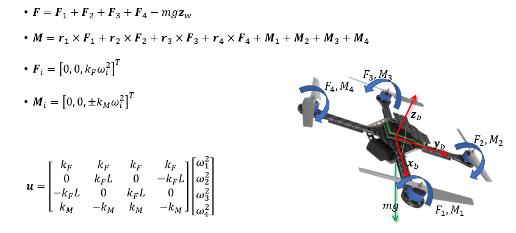

  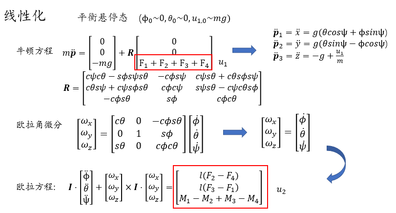

  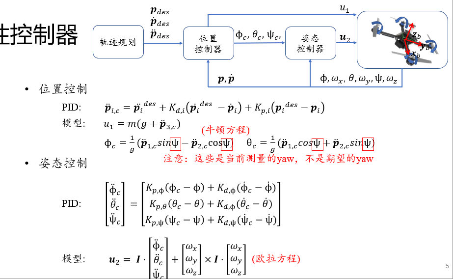

- SE3控制器

  微分平坦：四旋翼的状态和输入可以写成四个挑选出来的输出变量及其有限阶导数的代数函数

  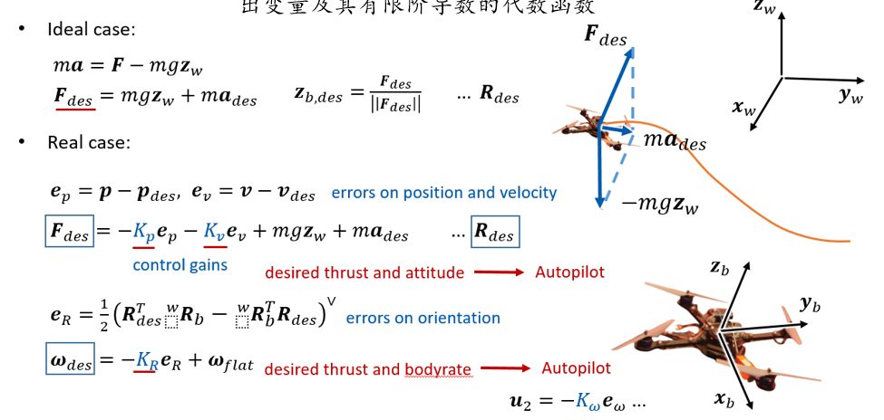

  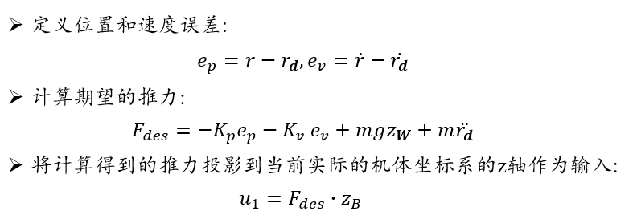

  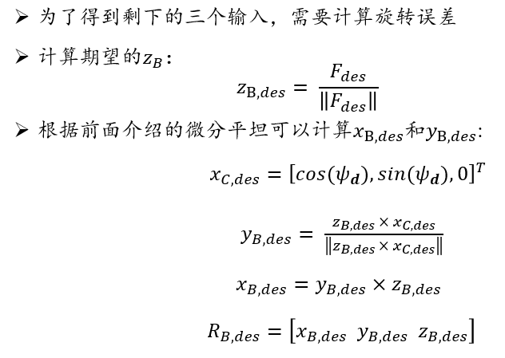

  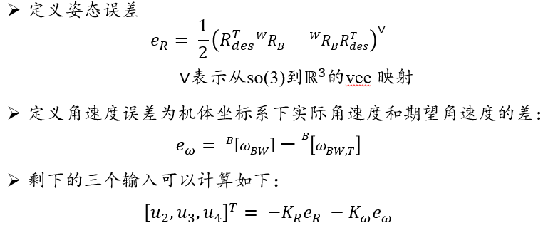

  两者都是串级控制，外环控制位置，内环控制姿态。但相比于Linear Controller，SE(3) Controller有两个特点：

  1. 根据误差计算期望的推力向量，用其根据微分平坦计算姿态误差（用旋转矩阵表示而非欧拉角，且没有小角度假设）。
  2. 推力控制输入是期望的推力向量投影到当前测量的姿态Z轴上的分量

# 常见导航方式

导航navigation：将运载体从起始点引导到目的地的技术或方法称为导航(Navigation)

空中机器人的定位是靠机载传感器和计算设备， 计算出自身所在位置和姿态。 所以， 定位的本质是**状态估计问题**

导航系统功能

➢测量定位——感知运载体的姿态、位置、速度、方向等信息

➢航行决策——决定运载体运动的方向、速度

➢路径规划——确定运载体从当前位置到达目的地的可行路径或最优路径

## 单一导航

- GPS全球定位系统（Global Positioning System）

  这是一个由覆盖全球的24颗卫星组成的卫星系统。这个系统可以保证在任意时刻，地球上任意一点都可以同时观测到4颗卫星，以保证卫星可以采集到该观测点的经纬度和高度，以便实现导航、定位、授时等功能

  GPS全球卫星定位系统由三部分组成： 空间部分—GPS星座； 地面控制部分—地面监控系统； 用户设备部分—GPS信号接收机

- 惯性导航系统

  分类： 平台式惯导系统 & 捷联惯导系统

  包含模块： 计算机、加速度计、陀螺仪或其他运动传感器的平台

  - 加速度计基本原理

    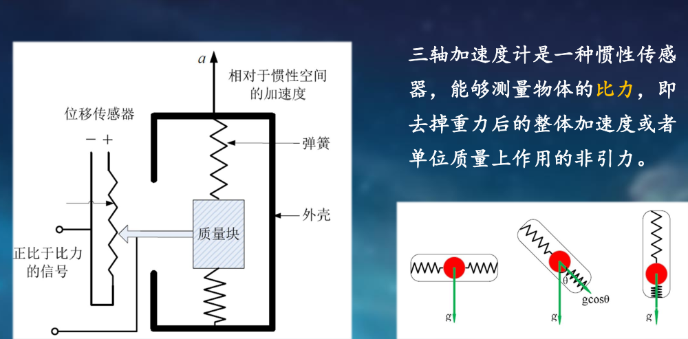

    比力：指的是物体所受的非引力外力与其质量的比值，比力通常用来描述物体的加速度，而这个加速度是去除重力加速度后的结果

  - 陀螺仪基本原理——角速度传感器

    在陀螺仪中，两个质量块运动速度方向相反，而大小相同。它们产生的科式力相反，从而压迫两块对应的电容板移动，产生电容差分变化。 电**容的变化正比于旋转角速度**

  - 捷联惯导原理图

    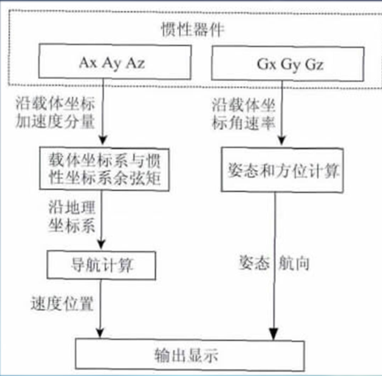

  - 惯导系统的特点

    

- 多普勒导航

  多普勒导航系统是利用多普勒效应实现的，该系统由磁罗盘或陀螺仪表、 多普勒雷达和导航计算机组成

  - 基本原理

    多普勒雷达不断地沿着某方向向地面发出无线电波，利用飞行器和地面有相对运动产生多普勒效应，测出雷达发射的电磁波和接收到的回波的**频率变化**，从而计算出飞行器相对于地面的飞行速度，速度的方向就是该点航线的方向

  - 特点

    

- 图形匹配导航系统（地形辅助导航）

  预先将无人机经过的地域，通过大地测量、航空摄影或已有的地形图等方法将地形数据（主要是地形位置和高度数据） **制成数字化地图**，存贮在机载计算机中，当飞机飞越上述区域时，其上的探测设备再次对该区域进**行测量并与预先存储的原图进行比较**，确定实际位置和位置偏差，从而实现对无人机的导航

  单纯的图形匹配导航不能提供地理坐标位置， **必须和其他导航方式进行组合**，更多的是和图形/惯性组合

  图形匹配导航可分为**地形匹配导航和景像匹配**导航两种

  - 特点

    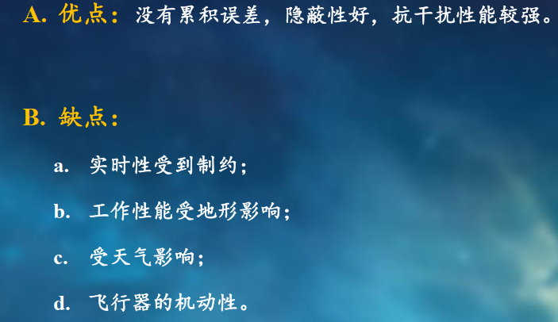

- 地磁导航

  - 基本原理

    地磁场是矢量场，在地球近地空间内任意一点的地磁矢量与其它地点的地磁矢量是不同的，且与该地点的经纬度是一一对应的。因此，理论上只要知道该点的地磁场矢量就可实现全球定位

  - 分类：地磁匹配，地形滤波

  - 特点

    

## 组合导航

组合导航是指把两种或两种以上的导航系统以适当的方式组合在一起，利用其性能上的互补特性可以获得比单独使用任一系统时更高的导航性能

> 除了可以将以上介绍的导航技术进行组合之外，还可以应用一些相关技术提高精度，比如大气数据系统、航迹推算技术等

组合导航常以 **INS 作为主导航系统**，而将其他导航定位误差不随时间积累的导航系统，如无线电导航、天文导航、地形匹配导航和卫星导航等系统作为**辅助导航系统**

INS/GPS组合导航


## 空中机器人SLAM

### 基础

**SLAM** (`simultaneous localization and mapping),也称为CML (Concurrent Mapping and Localization`), 即时定位与地图构建，或并发建图与定位。

SLAM问题可以描述为: 机器人在未知环境中从一个未知位置开始移动,在移动过程中根据位置估计和地图进行自身定位， 同时在自身定位的基础上建造**增量式地图**， 实现机器人的自主定位和导航

路标(Landmark)

一个空中机器人的传感器系统

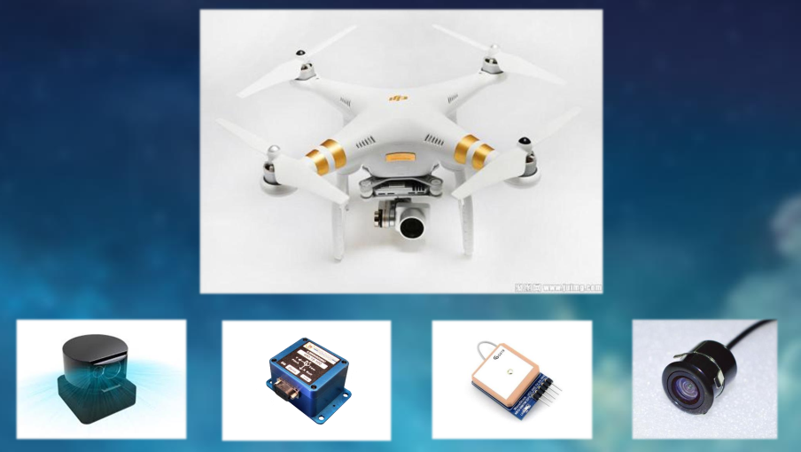

激光测距+IMU+GPS+视觉

基本概念

- 图是描述环境的信息， 可以用特征位置来表述
- 地标指的是环境中可以较易重复识别的特征
- 地标在SLAM中主要是用于帮助移动机器人确定它在哪里（自定位）

- 猜我在哪：里程计
- “纠正错误”：看之前的路标

### SLAM技术

建图+定位


机器人SLAM核心部分


### EKF

估计机器人的状态的方法： EKF

扩展卡尔曼技术帮助准确估计含有噪声信息的机器人位置，通知准确估计含有噪声信息的环境地标位置信息

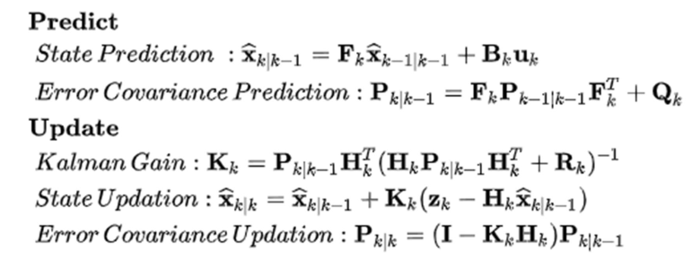

### 实战

微小型空中机器人中最流行的两种导航用传感器

- 激光传感器
- 视觉传感器

SLAM问题的建模

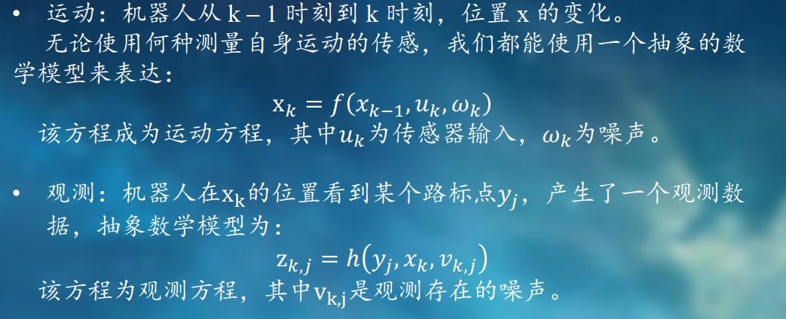

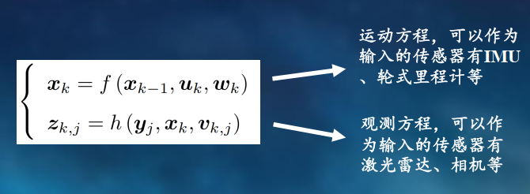

针对状态估计问题，人们最直觉的方法是滤波方法：

对于线性高斯系统，它的无偏的最优估计可以由卡尔曼滤波器给出。对于非线性非高斯系统，可以使用扩展卡尔曼滤波（EKF）求解

基于图优化的SLAM

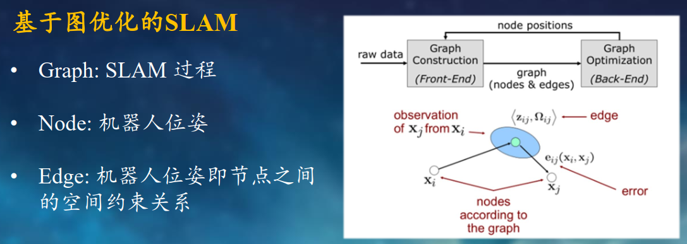

基于图优化的Cartographer

为了克服滤波方法大范围建图的累积误差无法消除的问题

激光SLAM算法对比


激光里程计的实现可以看做是点云的匹配和激光数据校正: ICP((Iterative Closest Point, 迭代最近点)

环境感知与构图功能实现

基于粒子滤波的Gmapping

视觉SLAM——BA（最小化投影误差，是一个非线性最小二乘问题）

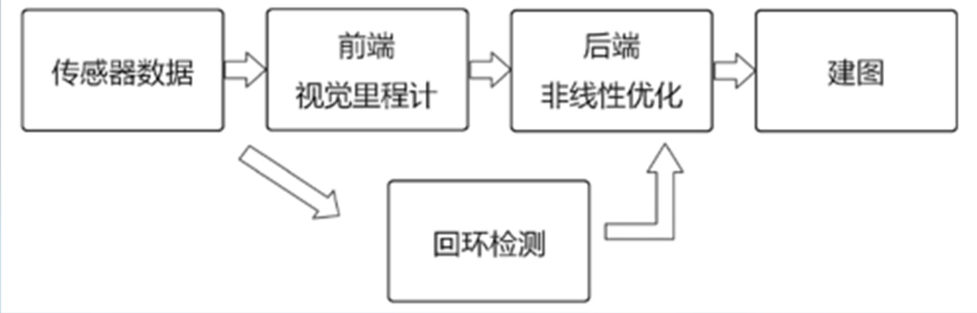


# MPC

> 画Bode图，加不同频率正弦信号，画出Bode图，分析幅值裕度和相位裕度

## 基本概念

MPC：最优控制的一种

动力学模型：

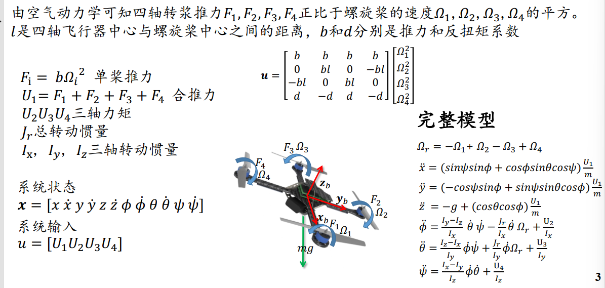

前面的几种控制器设计优缺点：

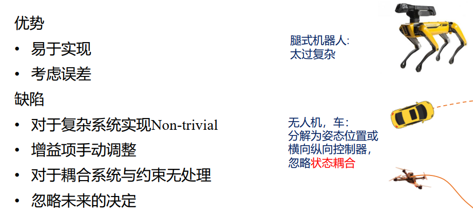

最优控制：

先根据动力学模型，选择可观测的系统状态，建立状态空间模型如下：

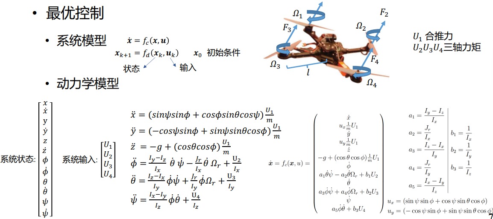

MPC：通过模型来预测系统在某一未来时间段内的表现来进行优化控制

多用于数位控制，用离散型状态空间表达$x_{k+1}=Ax_k+Bu_k$

MPC实现过程：

1. 估计/测量读取当前系统状态

2. 基于$u_k,u_{k+1}...u_{k+N}$来进行最优化

   定义cost func $J$

3. 只取$u_k$，进行滚动优化控制(receding horizon control)

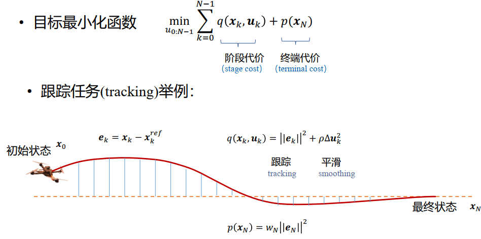

> 中间可自定义约束项
>
> 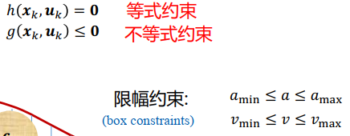

求解一段时间的最优解序列（有限的预测时域）：


但是我们只采用第一项作为当前的输入，why？

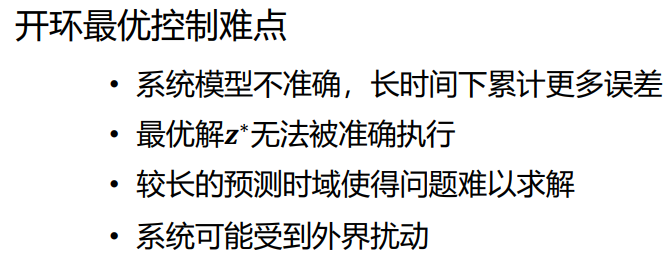

这种框架叫做滚动预测框架

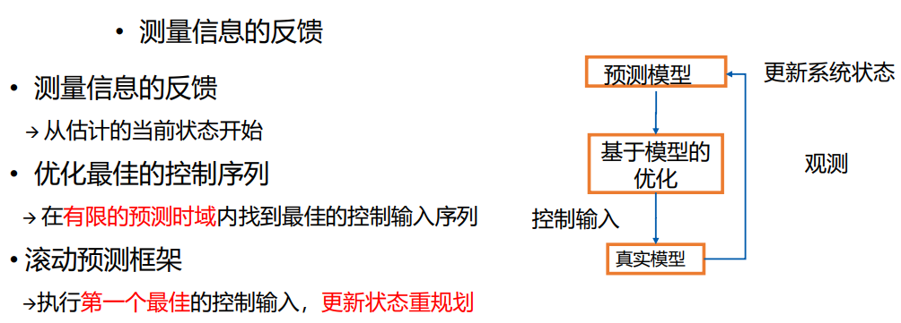

优势：

- 考虑未来时域（尽管有限）
- 考虑误差
- 减小问题规模（求解器一般有warm-start，由上次最优解开始作为初值）

## 模型预测控制参数

- 模型的选择

  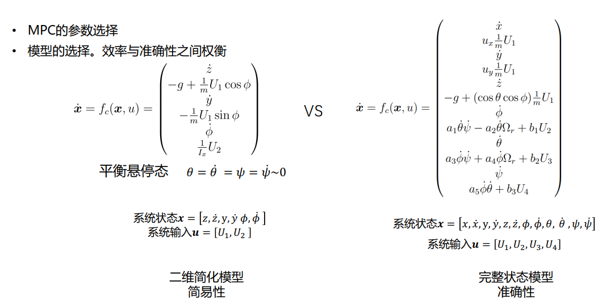

- 代价函数的选择

  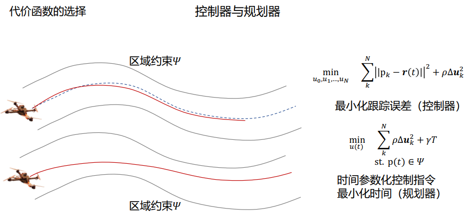

- 预测时域：计算量与解的可行性的权衡

  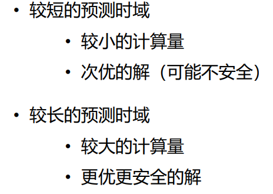

  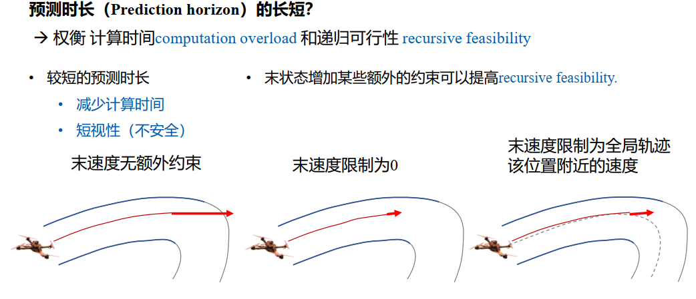

## 离散线性模型计算

先将模型转化为离散化线性模型：离散化直接由s-s model直接转（这里用的前向欧拉法）即可，线性化就是将非线性当前一阶泰勒展开

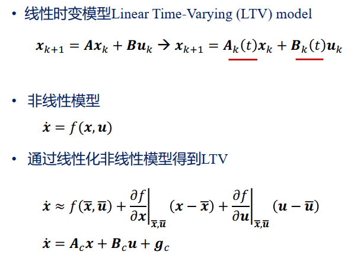

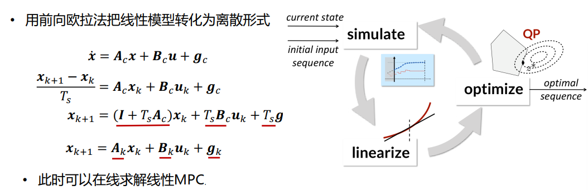

通过上述转化我们得到离散线性模型如下：

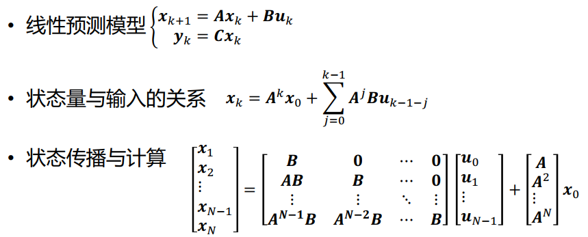

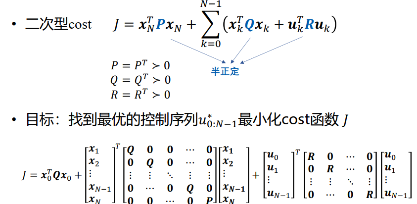

下面是推导过程

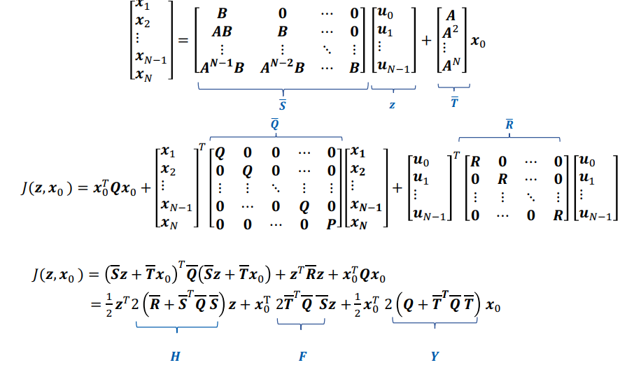

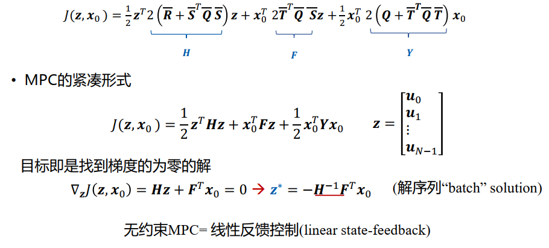

### 实例

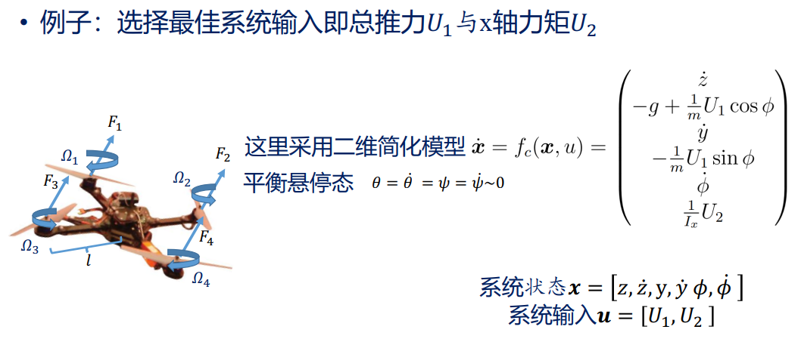

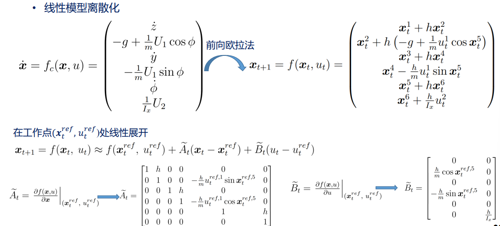

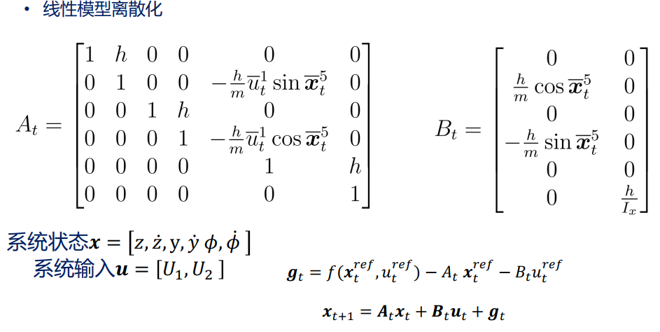


> 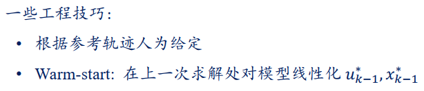

## CMPCC & MPCC

- CMPCC（Corridor-based Model Predictive Contouring Control）是一种高效的、后退的地平线、局部自适应的低级规划器

  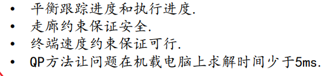

  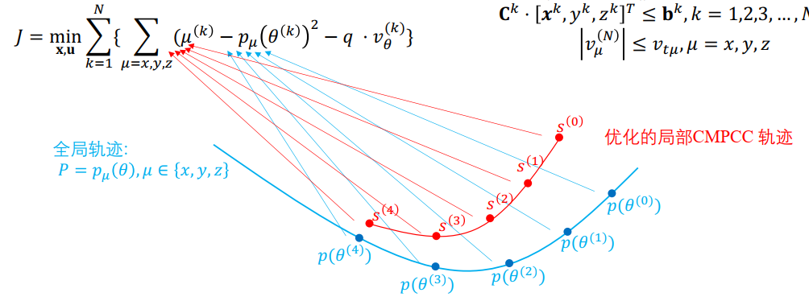

  求解快，限制终端速度可确保轨迹可行性，同时大大缩短规划的时间

- MPCC（Model Predictive Contouring Control）

# Path Planning

## Search-based path finding

构型空间：每个机器人姿态都是C-Space中的一个点

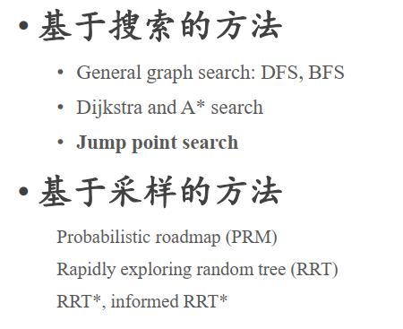

[基于图搜索的路径规划方法_根据图像中空间规划方向](https://blog.csdn.net/qq_37394634/article/details/119817929)

### Graph

图由节点和边构成


- BFS：队列——先进先出

- DFS：堆栈——后进先出

- Dijkstra ：每次取出容器中累计代价g(n)最小的节点

  有完备性和最优性，无方向性

### A*


> 这里的最优指的是代价最优

加权A*


#### 工程技巧

#### 栅格

基于栅格的路径搜索：怎么把栅格表示为图？（常8方向连接）


#### 最优启发式函数

如何寻找？


机器人只能沿着八个方向运动，导致节点n到终点的实际代价h\*(n)，比启发式代价即欧式距离大很多，即两个代价非常的不“紧贴(tight)”。因此需要找一个跟h*(n)更加接近的启发式函数

如何获得真正的理论最优解？——网格地图是高度结构化的


使用对角启发式函数**Diagonal Heuristic**

> 效率更优

#### **Tie Breaker**

对于基于栅格地图的图搜索问题来说，存在很多相同f(n)的路径，导致A*会拓展这些节点，导致计算资源的浪费。Tie Breaker的核心思想是在多个相同f(n)的路径中，根据某种倾向性来只选择一条进行拓展。


核心思想： 在相同  f 的节点中找到倾向性。下面时一种定义p的方法


### JPS

一种系统性实现打破对称性的方法：跳跃点搜索 Jump Point Search (JPS)

[Jump Point Search(JPS)算法总结与实现](https://zhuanlan.zhihu.com/p/181734749)

JPS 核心 : 找到对称性并打破它们

先介绍一下JPS的一些概念：

- 强迫邻居：节点 x 的8个邻居中有障碍，且 x 的父节点 p 经过x 到达 n 的距离代价比不经过 x 到达的 n 的任意路径的距离代价小，则称 n 是 x 的强迫邻居。

  分为直线关系和斜线关系

  

  对于斜线关系我们发现1,2,3都是x的强迫邻居，为什么2,3不是呢？——**邻居裁剪**：为了不产生多条等价的路径

  邻居裁剪：把节点的八个邻居分为劣性节点和自然节点——劣性节点只能从父节点到达，自然节点只能从子节点到达

- 跳点：满足以下三个条件之一即可
  1. 节点x是起点or终点
  2. 节点x至少有一个强迫邻居
  3. 节点x的父节点p在斜线方向，并且节点x的直线方向（水平/垂直）存在满足条件1/2的节点

JPS就是找跳跃点，通俗一点的讲就是在路径上改变移动方向的点就是跳跃点。

- 搜索过程：先直线后斜线

  Jumping规则，先Look Ahead，然后看是否目标点是当前点的跳点后继，水平和垂直展开如果都以障碍物结束，则沿对角线移动。

  JPS算法里只有跳点才会被加入openlist里，排除了大量不必要的点，最后找出来的最短路径也是由跳点组成。这也是 JPS/JPS+ 高效的主要原因。

**优劣性**

但是JPS也不一定是更好的


采样类最短路径算法


### 实践

前端路径搜索+后端轨迹优化

## sample-based path finding


### PRM

Probabilistic Road Map  ——多查询算法

两个阶段：构建阶段+搜索阶段

- 构建阶段：构建一个表征环境连通情况的路标图

  1. 在工作空间采样N个点
  2. 删除和环境碰撞的点
  3. 连接近邻的节点
  4. 删除和环境碰撞的路径段

  

- 搜索阶段

  

算法评价


先删点再找路径

**效率提升方法**


先找路径再判断碰撞，如果碰撞删点后再找路径

### RRT

Rapidly-exploring Random Tree——单查询

[RRT与RRT*算法具体步骤与程序详解](https://blog.csdn.net/weixin_42875283/article/details/124408158)


> 生长步长是固定的，可由程序决定，但不宜太大也不宜太小，太小的话路径规划时间长，太大则会略过目标点

算法优劣


> 无渐进最优性

效率提升方法

- kd-tree(KDT , k-Dimension Tree) [KD-Tree原理详解](https://zhuanlan.zhihu.com/p/112246942)

  [K-D Tree - OI Wiki (oi-wiki.org)](https://oi-wiki.org/ds/kdt/)常用于

  - 最近邻搜索
  - 距离范围搜索

  传统KNN缺点：数据量特别大时，需要计算参考点和每个样本点的距离，计算量非常大，所以提出一种优化算法-----kd-tree.利用kd树可以省去对大部分数据点的搜索，从而减少搜索的计算量

- 双向RTT

### RRT*

RRT*在RRT基础上做了改进，主要是进行了**重新选择父节点**和**重布线**的操作。试想在RRT中，我们的采样点最终与整棵树上和它最近的点连了起来，但这未必是最好的选择，我们的最终目的是让这个点与起点的距离尽可能近。RRT* 便对此做了改进，它在采样点加入路径树以后，以其为圆心画了一个小圈，考虑是否有更好的父节点，连到那些节点上能使起点到该点的距离更短（尽管那些节点并不是离采样点最近的点）。如果选择了更加合适的父节点，那么就把它们连接起来，并去除原来的连线（重布线）。

- 对RRT的改进
- 具备概率完备性和渐进最优性
- 通过在工作空间采样节点来构建一棵从起点到终点的树，随着采样增加，树从起点向终点生长，并且改进已有路径

改进之处

- 考虑邻近节点的历史路径长度，而非只是局部路径长度
- 重连接操作，改进局部最优解

### Informed RRT*

Informed-RRT*算法就是对RRT*的采样过程进行优化得到的算法，它**采用一个椭圆采样方式来代替全局均匀采样**，其它部分一样。

之后优化后，更新椭圆

[路径规划 | 随机采样算法：Informed-RRT* - 知乎 (zhihu.com)](https://zhuanlan.zhihu.com/p/372315811)

### Kinodynamic-RRT*

考虑机器人运动学和动力学——更改函数以适应机器人导航中的运动或其他约束

Smart Kinodynamic RRT*

## **Kinodynamic Path Finding**

**Kinodynamic : Kinematic + Dynamic**

动力学规划问题是在同时受到运动学约束(如避开障碍物)和动力学约束(如速度、加速度和力)的情况下综合机器人运动。运动动力学的解是从时间到广义力或加速度的映射。


现在目标不仅是路径最短，还要考虑时间、能量等来进行前端的规划


解决这个问题的方法有前向和后向两种方法：

### **状态栅格规划**

**State Lattice Planning**

把每个栅格换成机器人的状态，把每条边换成机器人的轨迹


两种采样方法的比较


#### 控制空间采样


幂零系统

A、B矩阵的性质很重要，建立多阶线性积分矩阵


因为是幂零矩阵，泰勒展开后某阶次之后全为0


9 discretization，2-D中x,y的取值，$x\in[-a_m,0.a_m]$，y同理，3*3=9

指数增长——爆炸，要控制维度和层数


实际使用中简化模型


只维护单层——基元库

#### 状态空间采样

**Boundary Value Problem**


Pontryagin’s 最小值原理


求解BVP


最后得到五次多项式

根据初始状态和末状态，利用BVP将中间状态采样求解出来

> 每条路径维持的时间是人为给定的，如果希望少一些层数，则可以延长维持时间

最优边值-中值问题 (BIVP)

轨迹库（Trajectory library）


单层lattice planning是一种常见的用于局部避障的选择

先选轨迹，再对轨迹进行平滑

#### 启发式函数

启发式函数就是对到达终点代价的猜测


对于每个节点（状态），**不考虑动力学**模型，搜索其最短路径

> 有人对每张图先跑一遍dijstra，将每个点的代价最为启发式函数

#### Hybrid A* Workflow


lattice graph容易指数爆炸，我们同时维护A*的栅格地图用于剪枝

针对动力学模型，每个栅格只存储一个state（代价最低的那一个）

状态不能一一对应，但是大大简化lattice graph的搜索


one shot

假设障碍不存在，解一次BVP，看结果有无经过障碍

### **Kinodynamic RRT\***

现在半径变为cost空间中的半径，需要用BVP求解得到cost看是否在cost圆内（麻烦）——近似方法，可达集

如果设置**cost tolerance** **r**, 可以计算当前状态的**前向可达集**，终止状态的**向后可达集**，如果以kd树的形式存储节点，就可以在树中进行范围查询。

随机采样——前后解的一致性不太好

# Minimum Snap Trajectory Generation

## SE3

轨迹优化的必要性：


光滑轨迹的生成


微分平坦：四旋翼的状态和输入可以写成四个挑选出来的输出变量及其导数的代数函数——如下四个变量$yaw$作为特殊量处理


建模总结如下：


## 光滑轨迹

- 光滑一维轨迹

  5次多项式插值法

  

  如果我们在轨迹中做点的插值——只插位置（无速度、加速度信息），则方程项数会增加，因此我们采用多端轨迹进行处理

- 光滑三维轨迹——最小化snap的轨迹生成

  

  

  约束：

  

  

  根据snap轨迹对函数求四阶倒数——得到目标函数的解析表达

  

  对函数添加约束

  

  对不同段轨迹交点连续添加约束

  

  对于上述的cost func我们得到最终表达式——一个典型的凸优化问题

  > cost func为半正定的二次型

  

先看下面的凸优化，然后继续：


如下进行决策变量的映射


然后我们利用矩阵C来将d进行重拍列，分离自由变量和受约束的变量


> C如何构造
>
> 

于是我们直接得到封闭的解析解

## 轨迹的安全性

可能在求得后端优化后的轨迹可能撞上障碍物，eg:


但是未优化的路径不会撞上，因此我们在会撞上的轨迹上加入原来无碰撞的中间航点作为中间经过路径

## 定义时间

但是我们又有新的问题：


一个简单的解决方法：


构造新的cost func


但这样就不是典型的凸优化问题了，于是利用迭代数值求解

## 凸优化


典型的凸优化问题


# Lab

## 控制器算法及仿真


动捕，即动作捕捉（Motion Capture），是一种用于记录物体运动信息的技术

[拓展【刚体力学】角动量与角动量守恒定律](https://zhuanlan.zhihu.com/p/681329478#:~:text=现在，我们对)

### 线性控制器

Linear Controller

动力学模型如下


然后将悬停态的稳态进行线性化处理


得到控制模型如下：


其中两个控制器我们使用PID


$$
\begin{bmatrix}
\ddot{\Phi}_c \\
\ddot{\Theta}_c \\
\ddot{\Psi}_c
\end{bmatrix}
=
\begin{bmatrix}
K_{p,\Phi}(\Phi_c - \Phi) + K_{d,\Phi}(\dot{\Phi}_c - \dot{\Phi}) \\
K_{p,\Theta}(\Theta_c - \Theta) + K_{d,\Theta}(\dot{\Theta}_c - \dot{\Theta}) \\
K_{p,\Psi}(\Psi_c - \Psi) + K_{d,\Psi}(\dot{\Psi}_c - \dot{\Psi})
\end{bmatrix}
$$

$$
u_2 = I \cdot \begin{bmatrix}
\ddot{\Phi}_c \\
\ddot{\Theta}_c \\
\ddot{\Psi}_c
\end{bmatrix}
+ \begin{bmatrix}
\omega_x \\
\omega_y \\
\omega_z
\end{bmatrix} \times I \cdot \begin{bmatrix}
\omega_x \\
\omega_y \\
\omega_z
\end{bmatrix} \quad \text{(欧拉方程)}
$$

### SE3控制器

Geometric SE(3) Controller——SE3表示三维空间中的刚体运动，包括平移和旋转

微分平坦：对于一个微分平坦系统，可以通过选择一组特定的系统输出（称为平坦输出），使得所有的状态变量和输入变量都可以由这组输出及其有限阶微分进行表示

目的：

- 能够自动生成轨迹
- 在空间中任何具有平坦输出（输出具有合理的有界导数）的任意平滑轨迹都可以被旋翼跟踪

> 四旋翼的状态和输入可以写成**四个**挑选出来的输出变量及其有限阶导数的代数函数
>
> 


ideal case


real case


我们期望的旋转轴$z_B$就是在$F_{des}$的方向上


$x_{C,des}$表示在笛卡尔坐标系中的期望位置向量

$x_{B,des}$表示在机体坐标系中的期望位置向量

这里$R_{B,des}$是期望的旋转矩阵，将四旋翼飞行器从世界坐标系转换到机体坐标系的旋转


V即将一个 3x3 的反对称矩阵映射到一个三维向量


------

两者都是串级控制，外环控制位置，内环控制姿态。但相比于Linear Controller，SE(3) Controller有两个特点：

1.根据误差计算期望的推力向量，用其根据微分平坦计算姿态误差（用旋转矩阵表示而非欧拉角，且没有小角度假设）g。

2.推力控制输入是期望的推力向量投影到当前测量的姿态Z轴上的分量。

### 实践

若是python又conda环境，我们需要指定catkin_make使用的python路径如下

```
catkin_make -DPYTHON_EXECUTABLE=/usr/bin/python3
```

Eigen中四元数Quaterniond

```
Eigen::Quaterniond q1(w, x, y, z);// 第一种方式

Eigen::Quaterniond q2(Vector4d(x, y, z, w));// 第二种方式

Eigen::Quaterniond q2(Matrix3d(R));// 第三种方式s
```

使⽤rosbag记录下⽆⼈机模拟器的⾥程计信息（推荐在roslaunch启动前先打开另⼀个终端开始录制）

```
rosbag record /sim/odom
```

PlotJuggler绘图工具

```
roscore
rosrun plotjuggler plotjuggler
```

没有姿态控制

```
rostopic pub /position_cmd quadrotor_msgs/PositionCommand "header:
  seq: 0
  stamp:
    secs: 0
    nsecs: 0
  frame_id: ''
position:
  x: 2.0
  y: 2.0
  z: 2.0
velocity:
  x: 0.0
  y: 0.0
  z: 0.0
acceleration:
  x: 0.0
  y: 0.0
  z: 0.0
jerk:
  x: 0.0
  y: 0.0
  z: 0.0
yaw: 0.0
trajectory_flag: 0"
```

# 历年卷

## 2023-2024春

[空中机器人 2023-2024春 回忆卷 - CC98论坛](https://www.cc98.org/topic/5870695)

## 2022-2023春

[控院《空中机器人》2022-2023春 期末回忆卷 - CC98论坛](https://www.cc98.org/topic/5587505)

[控院《空中机器人》2022-2023春 期末回忆卷 - CC98论坛](https://www.cc98.org/topic/5587505)
