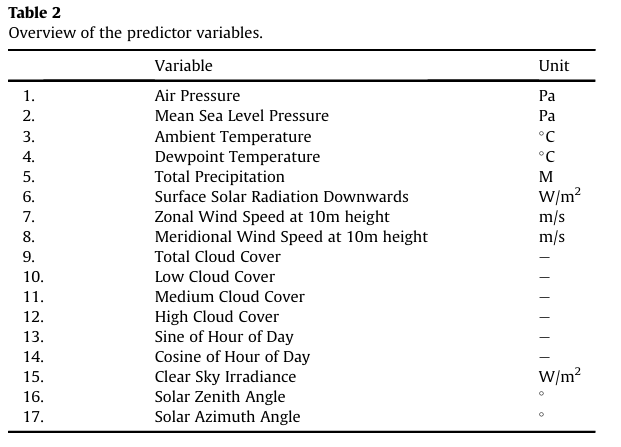
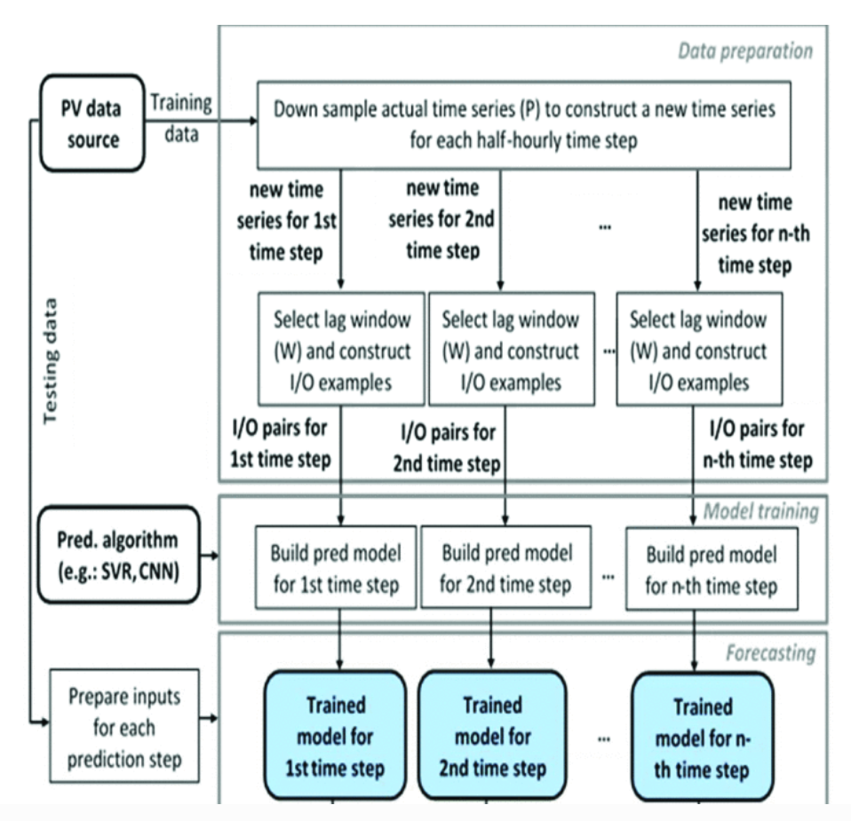

# Distributed Photovoltaic Aggregation


- **Operational day-ahead solar power forecasting for aggregated PV systems with a varying spatial distribution**. Visser Lennard et.al. **Renewable Energy**, **2022-1**, ([pdf](..\..\papers\PV\Operational_day-ahead_solar_power_forecasting_for_aggregated_PV_systems_with_a_varying_spatial_distribution.pdf))([link](https://doi.org/10.1016/j.renene.2021.10.102)).


    - RF、LSTM多光伏系统聚合效果好，其余经济相关内容没啥用


  - input data：12predictor variables

      

  - output data：日前（Day-ahead）光伏功率预测序列，时间分辨率为1小时


- **A cross-sectional survey of deterministic PV power forecasting: Progress and limitations in current approaches**. Sabadus Andreea et.al. **Renewable Energy**, **2024-5**, ([pdf](..\..\papers\PV\A_cross-sectional_survey.pdf))([link](https://doi.org/10.1016/j.renene.2024.120385)).


    - 仅单一预测场景


    - 短时间5mins内，hybrid方法（physics+ml）更好


- **A review of behind-the-meter solar forecasting**. Erdener Burcin Cakir et.al. **Renewable and Sustainable Energy Reviews**, **2022-5**,([pdf](..\..\papers\PV\A_review_of_Behind.pdf)) ([link](https://doi.org/10.1016/j.rser.2022.112224)).

  

  
  
  
    - 这篇综述链接的相关文章使用的方法和效果课看看
  
  
    - Table 6. Publications considering net load forecasting.对比了多个方法预测时间和输入数据，可看
  
  
    - 将机器学习技术与各种物理方法（如数值天气预报、晴空、卫星成像）相结合，已被证明能够为长期时间范围生成更优的预测结果——混合模型
  


- **Comparison of Direct and Indirect Approaches to PV Power Estimation**. Narynbaev Alisher F. et.al. **No journal**, **2024-2-29**,([pdf](..\..\papers\PV\Comparison_of_Direct_and_Indirect_Approaches_to_PV_Power_Estimation.pdf)) ([link](https://doi.org/10.1109/reepe60449.2024.10479839)).


    - 间接就是分阶段建模数据好的时候还是统计/机器学习模型表现好
    
      > 没啥用，用的MLP，可做benchmark


- **Day-ahead solar photovoltaic energy forecasting based on weather data using LSTM networks: a comparative study for photovoltaic (PV) panels in Turkey**. Garip Zeynep et.al. **Electr Eng**, **2023-6-19**, ([pdf](..\..\papers\PV\Day_ahead.pdf))([link](https://doi.org/10.1007/s00202-023-01883-7)).***

  | 技术类型         | 原理                                   | 适用场景            | 优劣势                                                                 |
  | :--------------- | :------------------------------------- | :------------------ | :--------------------------------------------------------------------- |
  | **物理模型**     | 基于辐射传输方程、组件物理参数模拟发电 | 数据稀缺/参数已知时 | 依赖精确参数；对云层快速变化响应差                                     |
  | **统计模型**     | 历史数据的数学关联（如ARIMA、SARIMA）  | 线性时序场景        | 面对BTM强非线性、长时序依赖时精度不足                                  |
  | **数据驱动模型** | 机器学习/深度学习学习“发电-天气”映射   | 历史数据丰富时      | 精度高但依赖数据质量与长度；代表技术：LSTM、BiLSTM、CNN-LSTM混合模型等 |

  - Table1Literaturereviews 可看，各种特点，方法，Time horizon均有

  

- **Solar Power Estimation Methods Using ANN and CA-ANN Models for Hydrogen Production Potential in Mediterranean Region**. Ateş Kübra Tümay et.al. **IETE Journal of Research**, **2023-3**,([pdf](..\..\papers\PV\Solar_Power_Estimation_Methods_Using_ANN_and_CA-ANN_Models_for_Hydrogen_Production_Potential_in_Mediterranean_Region.pdf)) ([link](https://doi.org/10.1080/03772063.2023.2176931)).


    - **人工神经网络（ANN）**


    - Cultural Algorithm-Artificial Neural Network(******CA**-ANN)
    
      > 感觉没啥用，或许可以试试


- **Day-Ahead Operational Forecast of Aggregated Solar Generation Assimilating Mesoscale Meteorology Information**. Terrén-Serrano Guillermo et.al. **No journal**, **2025-1-21**, ([pdf](..\..\papers\PV\Day-Ahead_Operational_Forecast_of_Aggregated_Solar_Generation_Assimilating_Mesoscale_Meteorology_Information.pdf)) ([link](https://doi.org/10.1109/gridedge61154.2025.10887459)).


  - 和我想要的不太一样，一种基于稀疏和贝叶斯学习的集成模型，用于开发具有概率性的日提前期系统级太阳能预测

- **Photovoltaic power estimation and forecast models integrating physics and machine learning: A review on hybrid techniques**. Santos Leticia de Oliveira et.al. **Solar Energy**, **2024-12**,([pdf](..\..\papers\PV\Photovoltaic_power_estimation_and_forecast.pdf))  ([link](https://doi.org/10.1016/j.solener.2024.113044)).**

  

  - 三种模型
    - **物理信息增强的机器学习**：利用物理模型（如PV-Lib）生成的特征训练ML（如ANN、SVM），提升学习过程对光伏物理规律的适应性；
    - **优化的物理模型**：通过优化算法（如粒子群、遗传算法）调整物理模型参数，减少不确定性；
    - **物理引导模型**：ML与物理模型协同（如约束ML输出、嵌入残差校正），直接整合物理规律。
  - 有数据来源和预处理介绍
  - 短期预测挺多

- **PV Power Forecasting in the Hexi Region of Gansu Province Based on AP Clustering and LSTNet**. Li Xujiong et.al. **International Transactions on Electrical Energy Systems**, **2024-4-26**, ([pdf](..\..\papers\PV\International_Transactions_on_Electrical_Energy_Systems.pdf)) ([link](https://doi.org/10.1155/2024/6667756)).***

  - 强相关，提出**亲和传播聚类（AP聚类）** 与**长短期时间序列网络（LSTNet）**

  - 效果非常好，且5种benchmark也可以借鉴

- **A Data-driven Approach for Forecasting State Level Aggregated Solar Photovoltaic Power Production**. Rana Mashud et.al. **No journal**, **2020-7**, ([pdf](..\..\papers\PV\A_Data-driven_Approach_for_Forecasting_State_Level_Aggregated_Solar_Photovoltaic_Power_Production.pdf))([link](https://doi.org/10.1109/ijcnn48605.2020.9207594)).***


  - 区域性预测，强comm，仅依赖历史数据（并网长期发电数据），未融合复杂气象数据，day-ahead

    

- **Forecasting Regional Level Solar Power Generation Using Advanced Deep Learning Approach**. Almaghrabi Sarah et.al. **No journal**, **2021-7-18**, ([pdf](..\..\papers\PV\Forecasting_Regional_Level_Solar_Power_Generation_Using_Advanced_Deep_Learning_Approach.pdf))([link](https://doi.org/10.1109/ijcnn52387.2021.9533458)).

- {{10.3390:en17122990}}


# 问题

- “不可见性”（电网难直接监测发电数据）与**间歇性**（受天气、时间动态影响），导致电网“净负荷”波动加剧，威胁稳定性，我们要Accurate behind-the-meter estimations, together with capacity and specification forecasts
- 传统PV功率预测主要针对单个电站，我们需要aggregated forecasting
  - the unavailability of the data


# Methods

- LSTM
- BiLSTM
- LSTM Encoder-Decoder
- CNN-LSTM


# Cmd

```
set PYTHONUTF8=1
autoliter -i ./PV_aggregation.md -o ../../papers/PV
```


